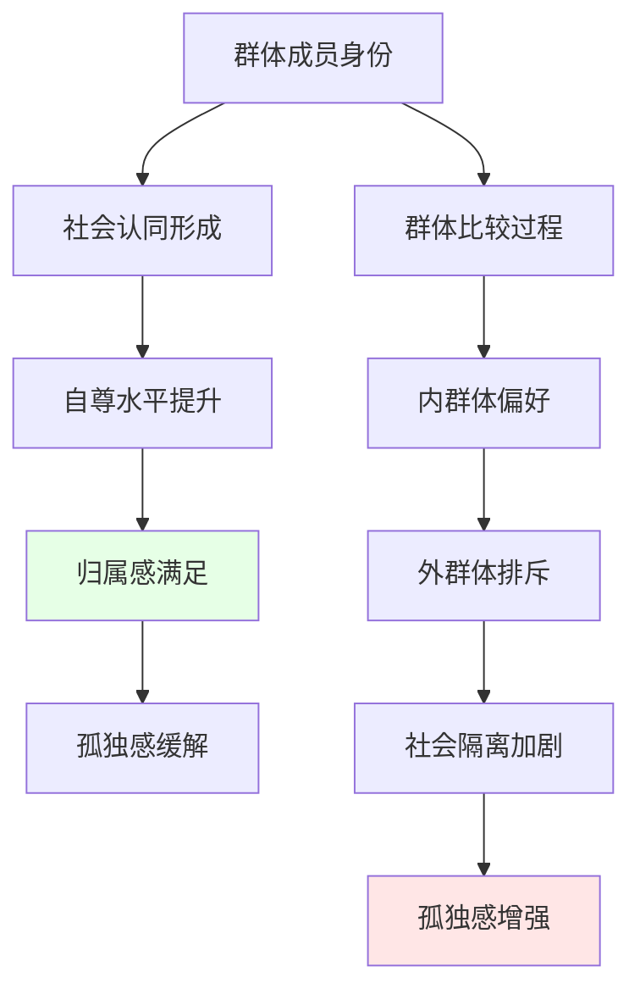
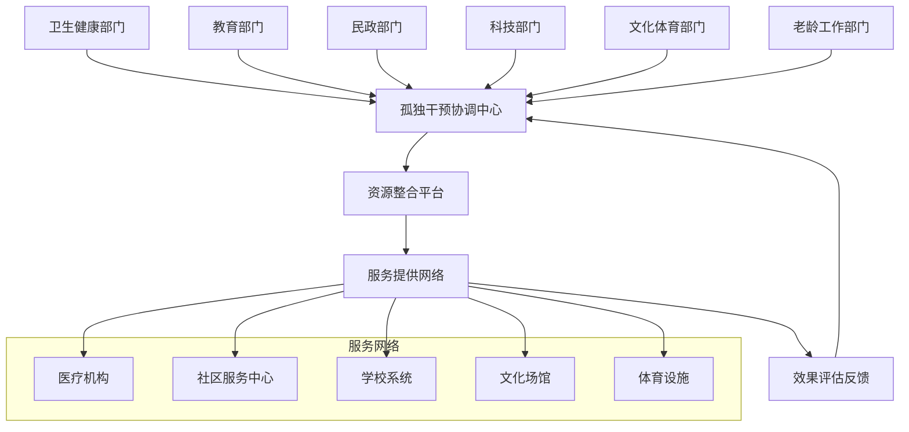

# 孤独社会心理学与社区干预 (Loneliness Social Psychology & Community Interventions)

## 社会心理学理论框架 (Social Psychological Theoretical Framework)

### 一、社会认同理论视角 (Social Identity Theory Perspective)

#### 1.1 群体归属与孤独

**核心机制分析：**



**关键研究发现：**
- 群体认同能够显著缓冲个体孤独感（Haslam & Reicher, 2016）
- 弱势群体成员更容易经历双重孤独：群体内边缘化+群体外排斥
- 虚拟群体认同在数字时代的重要性日益凸显

#### 1.2 社会比较与孤独维持

| 比较维度 | 上行比较影响 | 下行比较影响 | 调节因素 |
|----------|-------------|-------------|----------|
| **成功成就** | 自我贬低、嫉妒增强 | 满足感提升、感恩增加 | 个体自尊水平 |
| **人际关系** | 社交焦虑加剧 | 关系满意度提高 | 依恋安全性 |
| **外貌形象** | 身体不满增加 | 自我接纳改善 | 媒体素养水平 |

### 二、社会资本理论应用 (Social Capital Theory Application)

#### 2.1 三种资本类型的孤独相关性

| 资本类型 | 定义 | 对孤独的影响 | 获取途径 |
|----------|------|-------------|----------|
| **结合型资本** | 紧密人际关系网络 | 显著缓解情绪性孤独 | 家庭、密友关系 |
| **桥接型资本** | 松散社会联系网络 | 缓解社交性孤独 | 同事、邻居关系 |
| **链接型资本** | 与权威/资源的连接 | 提供结构性支持 | 专业网络、制度联系 |

#### 2.2 社会资本积累策略

**个人层面：**
- 主动参与社区活动
- 培养多元兴趣爱好
- 维护跨代际关系
- 发展志愿服务精神

**社区层面：**
- 建立邻里互助机制
- 组织定期聚会活动
- 创建兴趣小组平台
- 提供技能培训机会

### 三、社会支持系统分析 (Social Support System Analysis)

#### 3.1 支持类型的孤独缓解效果

| 支持类型 | 具体表现 | 孤独缓解机制 | 适用情境 |
|----------|----------|-------------|----------|
| **情感支持** | 理解、关爱、同情 | 满足归属需求 | 情绪性孤独 |
| **工具支持** | 实际帮助、资源提供 | 减轻生活压力 | 功能性孤独 |
| **信息支持** | 建议、指导、信息 | 增强应对能力 | 认知性孤独 |
| **陪伴支持** | 同在、共处、参与 | 减少独处时间 | 物理性孤独 |

#### 3.2 支持质量评估指标

**有效社会支持的特征：**
- **及时性**：在需要时能够获得
- **适当性**：符合个人实际需求
- **持续性**：长期稳定的供给
- **双向性**：既有给予也有接受
- **无条件性**：不附加不合理要求

### 四、数字时代的孤独悖论 (Digital Age Loneliness Paradox)

#### 4.1 连接与孤立的辩证关系

**数字媒体使用的双重效应：**

| 使用模式 | 积极效应 | 消极效应 | 调节因素 |
|----------|----------|----------|----------|
| **主动社交** | 扩展社交圈、维持远距离关系 | 时间消耗、现实社交替代 | 自我控制能力 |
| **被动浏览** | 信息获取、娱乐放松 | 社会比较、FOMO焦虑 | 媒体素养水平 |
| **深度互动** | 情感支持、身份认同 | 隐私担忧、网络霸凌 | 平台安全机制 |
| **浅层接触** | 保持联系、日常分享 | 关系表面化、真实感缺失 | 个人交往偏好 |

#### 4.2 数字鸿沟与孤独风险

**技术接入差异的影响：**
- 老年人数字技能不足导致的社会隔离
- 低收入群体设备和网络接入限制
- 农村地区数字基础设施薄弱
- 残障人士无障碍技术支持缺乏

### 五、社区干预模式 (Community Intervention Models)

#### 5.1 基于场所的干预策略

**社区中心模式：**
```
社区孤独干预中心功能布局：

┌─────────────────────────────────────┐
│           社区孤独干预中心            │
├─────────────────────────────────────┤
│  个体咨询室    │   团体活动室         │
│               │                      │
│  心理评估区    │   技能训练区         │
│               │                      │
│  数字素养教室  │   志愿服务区         │
│               │                      │
│  多代交流空间  │   兴趣工作坊         │
└─────────────────────────────────────┘
```

**实施要点：**
- 地理可达性优化
- 服务时间灵活性
- 多语言服务提供
- 文化敏感性设计

#### 5.2 基于人群的分层干预

| 人群类别 | 干预重点 | 核心策略 | 资源配置 |
|----------|----------|----------|----------|
| **独居老人** | 日常陪伴、健康管理 | 居家探访、电话关怀、社区食堂 | 社工+志愿者+医疗团队 |
| **新移民** | 文化适应、语言支持 | 同伴支持、文化桥梁项目 | 多语言社工+文化协调员 |
| **残障人士** | 无障碍参与、技能培训 | 辅助技术培训、包容性活动 | 无障碍设施+专业支持 |
| **青少年** | 同伴关系、身份认同 | 同伴辅导、兴趣社团、导师计划 | 青年工作者+专业导师 |

### 六、社会组织参与模式 (Organizational Participation Models)

#### 6.1 非营利组织的角色

**NGO在孤独干预中的功能：**
- 专业化服务提供
- 政策倡导推动
- 社区能力建设
- 研究与评估开展

**成功案例借鉴：**
- 英国Campaign to End Loneliness
- 澳大利亚Men's Sheds运动
- 日本孤独死预防项目
- 北欧国家长者陪伴计划

#### 6.2 企业社会责任参与

**商业机构的孤独干预贡献：**
- 员工心理健康项目
- 社区投资和赞助
- 产品服务适老化改造
- 志愿服务时间银行

### 七、政策层面干预策略 (Policy-Level Intervention Strategies)

#### 7.1 国家孤独战略框架

**政府层面的系统性应对：**

1. **立法保障**
   - 孤独防治法制定
   - 社会连接权利确认
   - 反社会隔离条款

2. **资源配置**
   - 专项资金设立
   - 人力资源培训
   - 基础设施建设

3. **监测评估**
   - 国民孤独指数建立
   - 干预效果追踪
   - 政策调整机制

#### 7.2 地方政府创新实践

**区域性特色项目：**
- 社区互助网格化管理
- 数字包容性城市建设
- 多代共融社区发展
- 绿色空间社交功能强化

### 八、跨部门协作机制 (Cross-Sector Collaboration Mechanisms)

#### 8.1 多部门联动模式



#### 8.2 数据共享与隐私保护平衡

**信息治理框架：**
- 最小必要原则
- 分级访问控制
- 去标识化处理
- 患者同意机制
- 安全审计追踪

### 九、技术创新应用 (Technological Innovation Applications)

#### 9.1 人工智能辅助干预

**AI在孤独干预中的应用场景：**

1. **智能筛查系统**
   - 语音情感分析
   - 文本情绪识别
   - 行为模式检测
   - 风险预警机制

2. **个性化推荐引擎**
   - 社交活动匹配
   - 兴趣群体推荐
   - 支持资源对接
   - 学习内容定制

3. **虚拟陪伴助手**
   - 情感对话支持
   - 日常提醒服务
   - 紧急联系协助
   - 健康监测集成

#### 9.2 虚拟现实社交康复

**VR技术的应用潜力：**
- 安全社交环境模拟
- 社交技能渐进训练
- 恐惧暴露治疗
- 远程群体活动参与

### 十、效果评估与持续改进 (Outcome Evaluation & Continuous Improvement)

#### 10.1 综合评估指标体系

**多层次评估框架：**

| 评估层次 | 指标类别 | 具体指标 | 测量方法 |
|----------|----------|----------|----------|
| **个体层面** | 心理健康 | 孤独感、抑郁焦虑水平 | 标准化量表 |
|          | 社会功能 | 社交活动频率、关系质量 | 行为观察 |
|          | 生活质量 | 主观幸福感、满意度 | 问卷调查 |
| **社区层面** | 参与度 | 活动参与率、志愿服务时数 | 行政记录 |
|          | 连接性 | 邻里关系强度、互助频率 | 社区调查 |
|          | 可持续性 | 项目延续性、资源利用率 | 成本效益分析 |
| **系统层面** | 覆盖范围 | 服务可及性、人群覆盖率 | 地理信息系统 |
|          | 协调程度 | 部门合作效率、转介顺畅度 | 流程分析 |
|          | 政策影响 | 法规完善度、资源配置合理性 | 政策评估 |

#### 10.2 持续质量改进循环

**PDCA循环在孤独干预中的应用：**

```
Plan (计划) → Do (执行) → Check (检查) → Act (处理)
    ↓                                            ↑
制定干预目标    实施具体措施    监测过程指标    调整优化策略
设定评估标准    提供服务支持    收集反馈信息    完善实施方案
资源配置规划    质量控制执行    效果数据分析    标准化推广
```

### 十一、国际合作与经验借鉴 (International Cooperation & Experience Learning)

#### 11.1 国际最佳实践案例

**欧洲经验：**
- 芬兰孤独防治国家战略
- 荷兰社区邻里守望项目
- 瑞典数字包容性政策

**亚洲经验：**
- 日本孤独死预防综合对策
- 韩国多代共居社区模式
- 新加坡邻里网络建设项目

**北美经验：**
- 美国社区健康中心整合模式
- 加拿大原住民文化连接项目

#### 11.2 全球合作机制建设

**国际合作平台：**
- WHO孤独防治技术合作网络
- OECD社会连接政策研究中心
- 联合国人权理事会孤独权利工作组
- 世界银行社会包容性投资项目

### 十二、未来发展展望 (Future Development Prospects)

#### 12.1 新兴趋势预测

**技术发展趋势：**
- 脑机接口在孤独干预中的应用前景
- 量子计算支持的大规模个性化干预
- 生物传感器实时监测社会连接质量
- 元宇宙中的虚拟社交康复

**社会变革影响：**
- 人口老龄化加速对孤独防治的新要求
- 气候变化导致的迁移和社区重组
- 工作模式变革对社会关系的影响
- 价值观多元化对孤独体验的重塑

#### 12.2 研究前沿方向

**亟待突破的关键问题：**
- 孤独的跨文化测量工具开发
- 代际传递机制的纵向研究
- 微生物-肠-脑轴与社会行为的关联
- 人工智能伦理在孤独干预中的规范

---

*本文件整合了社会心理学、公共卫生学、政策科学等多学科研究成果，为构建系统性的孤独社会心理干预体系提供了理论基础和实践指导。*