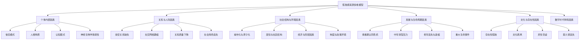

# 孤独感来源与病因学 (Sources & Etiology of Loneliness)

## 目录导航

- [一、孤独感来源的多维模型](#一孤独感来源的多维模型)
- [二、个体内部来源](#二个体内部来源)
- [三、关系与人际来源](#三关系与人际来源)
- [四、社会结构与环境来源](#四社会结构与环境来源)
- [五、生命周期与发展性来源](#五生命周期与发展性来源)
- [六、文化与存在性来源](#六文化与存在性来源)
- [七、数字时代特有来源](#七数字时代特有来源)
- [八、交互作用与累积效应](#八交互作用与累积效应)
- [九、孤独感来源的评估框架](#九孤独感来源的评估框架)

---

## 一、孤独感来源的多维模型

### 1.1 来源分层框架

### 1.2 来源类型学总览

| 来源层级 | 核心机制 | 典型表现 | 持续时间倾向 | 干预主攻方向 |
|---------|---------|---------|-------------|------------|
| **个体内部** | 依恋模式、认知偏差、神经易感性 | 长期自我否定、社交威胁过敏 | 慢性为主 | 心理治疗、依恋修复 |
| **关系与人际** | 亲密缺失、网络断裂、角色丧失 | 无人倾诉、被排斥感、归属感缺失 | 情境性或慢性 | 关系重建、社交技能 |
| **社会结构** | 城市化、阶层固化、社区瓦解 | 邻里陌生化、流动性过高 | 结构性慢性 | 社区干预、政策改善 |
| **发展周期** | 角色转换、身份重构、丧失 | 退休空虚、空巢失落、身份迷茫 | 阶段性 | 适应支持、意义重构 |
| **文化存在** | 价值断裂、意义虚无、灵性空洞 | "活着没意思"、文化不适应 | 深层慢性 | 存在治疗、意义疗法 |
| **数字时代** | 假性连接、比较效应、注意力碎片化 | 被动刷屏、FOMO焦虑 | 新型慢性 | 数字卫生、深度连接 |

---

## 二、个体内部来源

### 2.1 依恋模式与早期经验

**不安全依恋作为孤独的核心源头：**

| 依恋类型 | 形成条件 | 孤独产生机制 | 典型内心独白 | 关系中的表现 |
|---------|---------|------------|------------|------------|
| **焦虑型依恋** | 养育者回应不一致 | 过度渴望亲密却反复感到不够 | "TA 是不是不爱我了？" | 追逐、索取、过度警觉 |
| **回避型依恋** | 养育者冷淡或拒绝 | 压抑需求导致深层孤立 | "我不需要任何人" | 退缩、情感关闭、假性独立 |
| **恐惧型依恋** | 养育者既是安全又是威胁 | 渴望又恐惧，进退两难 | "我想靠近但我怕受伤" | 反复在亲密与退缩间摇摆 |

**早期依恋创伤的长程影响：**
- **情感忽视**：童年期情感需求被长期忽略 --> 内化为"我的需求不重要" --> 成年后不敢表达需要 --> 慢性孤独
- **情感虐待**：被嘲笑、否定、羞辱 --> 内化为"表达情感是危险的" --> 关系中情感冻结 --> 表面有人但内心孤立
- **关系不稳定**：频繁搬迁、父母离异、寄养 --> 内化为"关系是不可靠的" --> 难以建立持久信任 --> 反复关系破裂

### 2.2 人格特质与心理倾向

| 人格因素 | 与孤独的关联机制 | 表现特征 | 风险程度 |
|---------|----------------|---------|---------|
| **高神经质** | 情绪不稳定导致关系摩擦增多 | 过度敏感、灾难化解读 | 高 |
| **低外向性** | 社交驱动力低导致主动联系减少 | 安静退缩、不主动社交 | 中高 |
| **低宜人性** | 人际冲突频繁导致关系损耗 | 挑剔、不信任、攻击性表达 | 中 |
| **高完美主义** | 对关系质量期望过高导致持续失望 | "达不到理想就不如没有" | 中高 |
| **低自尊** | 自我否定导致社交退缩与讨好循环 | 过度讨好或完全退缩 | 高 |

### 2.3 认知图式与信息加工偏差

**孤独的认知维持机制：**

**常见致孤独认知图式：**

| 图式类型 | 核心信念 | 来源 | 在社交中的表现 | 导致的恶性循环 |
|---------|---------|------|-------------|-------------|
| **缺陷/羞耻** | "真实的我是有缺陷的" | 被批评、被嘲笑的经历 | 隐藏真实自我、戴面具社交 | 表面关系多但无人真正了解 |
| **被抛弃** | "重要的人总会离开我" | 亲人离世、被遗弃经历 | 过度黏附或先发制人地离开 | 关系反复破裂 |
| **社交隔离** | "我和别人不一样" | 被排斥、边缘化经历 | 自我隔离、不参与群体活动 | 越退缩越孤立 |
| **情感剥夺** | "没人会真正关心我" | 情感忽视的童年 | 不求助、不表达需求 | 得不到支持的循环 |

### 2.4 神经生物学易感性

**孤独的生物学基础：**

| 生物学因素 | 机制描述 | 对孤独的影响 | 研究证据 |
|-----------|---------|------------|---------|
| **遗传因素** | 孤独的遗传率约 37-55% (Boomsma et al., 2005) | 对社会威胁的神经敏感性、催产素受体基因变异 | 双生子研究、GWAS |
| **催产素系统** | OXTR 基因多态性影响社会信任与亲密能力 | 低催产素功能者更难建立信任关系 | 基因关联研究 |
| **HPA 轴敏感性** | 压力反应系统过度激活 | 社交情境中持续高警觉，消耗社交动力 | 皮质醇研究 |
| **多巴胺奖赏系统** | 社交奖赏预期降低 | 社交活动带来的愉悦感减弱，动机下降 | fMRI 研究 |
| **默认模式网络** | DMN 连接模式异常 | 过度自我参照、反刍思维 | 静息态脑成像 |

---

## 三、关系与人际来源

### 3.1 亲密关系缺失与质量不足

| 关系维度 | 缺失类型 | 典型情境 | 孤独感特征 | 严重程度 |
|---------|---------|---------|----------|---------|
| **伴侣关系** | 无伴侣 / 伴侣情感疏离 | 长期单身、婚内孤独 | 情绪性孤独为主 | 高 |
| **密友关系** | 无可倾诉的挚友 | 社交圈广但无深度关系 | "热闹散后更寂寞" | 中高 |
| **家庭关系** | 与原生家庭疏离 | 与父母断联、兄弟姐妹关系冷淡 | 根基性孤独 | 高 |
| **代际关系** | 与子女/晚辈疏离 | 空巢、代沟过大 | 传承性孤独 | 中 |

### 3.2 社交网络结构性萎缩

**社交网络萎缩的常见路径：**

1. **地理流动**：搬迁、移民、留学 --> 原有网络断裂 --> 新网络尚未建立 --> 过渡期孤独
2. **生活阶段变化**：毕业、退休、育儿 --> 社交场景消失 --> 被动社交减少 --> 网络自然萎缩
3. **关系创伤后退缩**：背叛、冲突、被排斥 --> 信任受损 --> 主动缩小社交圈 --> 保护性孤立
4. **健康限制**：慢性疾病、残疾、行动不便 --> 参与社交的物理能力下降 --> 被动退出社交场景

### 3.3 社会角色丧失与身份断裂

| 角色丧失类型 | 触发事件 | 丧失的连接维度 | 孤独感机制 |
|------------|---------|-------------|----------|
| **职业角色** | 退休、失业、裁员 | 同事网络、职业身份、日常结构 | "我是谁？我该在哪里？" |
| **配偶角色** | 丧偶、离异 | 亲密伴侣、共同社交圈、生活伴侣 | "世界上最了解我的人不在了" |
| **父母角色** | 空巢、子女移居 | 日常照顾关系、家庭聚合力 | "家里突然安静得可怕" |
| **社区角色** | 搬迁、社区拆迁 | 邻里关系、地方归属感 | "我不属于这里" |

### 3.4 人际技能缺陷

**社交技能缺失导致孤独的路径：**

| 技能缺陷 | 表现 | 关系后果 | 补救路径 |
|---------|------|---------|---------|
| **情感表达困难** | 无法清晰表达需求和感受 | 伴侣/朋友"猜不到你要什么" | 情感识读训练 |
| **共情能力不足** | 难以理解他人感受和需要 | 关系中的"自说自话" | 换位思考练习 |
| **冲突回避** | 遇到分歧就沉默或逃避 | 问题积累导致关系崩溃 | 建设性冲突训练 |
| **界限不清** | 过度付出或过度防御 | 关系中的耗竭或疏远 | 健康界限训练 |

---

## 四、社会结构与环境来源

### 4.1 城市化与社会原子化

**现代城市生活的致孤独机制：**

| 城市化特征 | 对社交的影响 | 孤独产生机制 | 全球数据 |
|-----------|------------|------------|---------|
| **高人口密度但低关系密度** | 物理接近但心理疏离 | "人群中的孤独"悖论 | 大城市孤独率高于农村 15-20% |
| **高流动性** | 邻里关系不稳定 | 无法形成长期社区纽带 | 城市居民平均每 5 年搬迁一次 |
| **功能分区** | 居住、工作、休闲空间分离 | 自然社交场景消失 | 通勤时间挤压社交时间 |
| **匿名性文化** | 不打扰他人=不关心他人 | 互不过问的冷漠默契 | 独居率持续上升 |

### 4.2 居住与社区因素

| 居住形态 | 孤独风险 | 机制 | 保护策略 |
|---------|---------|-----|---------|
| **独居** | 高 | 缺乏日常面对面互动 | 社区互助、定期聚会 |
| **高层公寓** | 中高 | 邻里互动物理阻隔 | 公共空间设计优化 |
| **郊区独栋** | 中 | 地理分散降低偶遇 | 社区活动中心建设 |
| **养老机构** | 中高 | 非自愿的环境转换 | 个性化社交支持 |

### 4.3 经济与阶层因素

**经济状况与孤独的关联：**

| 经济因素 | 孤独机制 | 典型群体 | 结构性障碍 |
|---------|---------|---------|----------|
| **贫困** | 无力参与社交活动、社会地位羞耻感 | 低收入家庭、失业者 | 经济门槛排斥 |
| **过度工作** | 无时间维护关系 | 996 工作者、创业者 | 时间贫困 |
| **经济不平等** | 阶层隔离减少跨群体接触 | 贫富差距大的社区 | 社会分层 |
| **消费主义** | 物质替代关系、竞争替代合作 | 高消费社会中的个体 | 价值观异化 |

### 4.4 制度与政策环境

**宏观制度对孤独的影响：**

- **社会保障缺失**：缺乏养老、医疗保障 --> 老年人因经济焦虑自我封闭
- **住房政策**：高房价导致年轻人远离社交核心区 --> 通勤生活挤压社交时间
- **户籍制度**：流动人口无法融入本地社区 --> 长期处于"外来者"身份
- **心理健康服务不足**：专业资源匮乏 --> 孤独无法及时识别和干预

---

## 五、生命周期与发展性来源

### 5.1 各发展阶段的孤独来源

| 生命阶段 | 核心发展任务 | 主要孤独来源 | 保护因素 | 风险信号 |
|---------|------------|------------|---------|---------|
| **青春期 (12-18)** | 身份认同、同伴归属 | 同伴排斥、身体形象焦虑、性取向困惑、家庭冲突 | 稳定友谊、支持性家庭、学校归属感 | 长期退缩、网络成瘾 |
| **青年期 (18-30)** | 亲密关系建立、职业定向 | 离家独立、择偶压力、职场新人适应、社交比较 | 室友/同伴关系、导师支持 | 反复短暂关系、社交回避 |
| **中年期 (30-50)** | 生产繁衍、事业巅峰 | 婚内孤独、育儿隔离、中年危机、照顾者倦怠 | 伴侣关系质量、同龄朋友圈 | 工作成瘾、婚外情倾向 |
| **中晚年 (50-65)** | 意义重构、角色转换 | 空巢、退休过渡、身体衰退、社交圈缩小 | 代际连接、兴趣社群 | 酒精依赖、慢性抱怨 |
| **老年期 (65+)** | 完整性 vs 绝望 | 丧偶、朋友离世、行动受限、机构化 | 社区支持、灵性资源 | 拒绝出门、放弃自我照顾 |

### 5.2 重大生命事件与过渡性孤独

| 生命事件 | 孤独触发机制 | 正常恢复时间 | 何时需要专业帮助 |
|---------|------------|------------|----------------|
| **丧亲/丧偶** | 最亲密关系断裂+社交圈重组 | 6-24 个月 | >24 个月仍严重孤独 |
| **离婚/分手** | 亲密关系丧失+共同社交圈分裂 | 3-18 个月 | 反复进入不健康关系 |
| **搬迁/移民** | 原有网络断裂+文化适应压力 | 6-24 个月 | >24 个月仍未建立新网络 |
| **退休** | 职业身份与同事网络同时丧失 | 6-12 个月 | 持续退缩、日常结构崩溃 |
| **重大疾病** | 身体限制+被标签化+照顾者角色转换 | 因疾病而异 | 完全拒绝社交或支持 |
| **生育** | 社交场景骤减+身份从个体变为照顾者 | 6-18 个月 | 产后抑郁+严重社交隔离 |

---

## 六、文化与存在性来源

### 6.1 存在性孤独来源

**存在主义视角下的四重孤独来源 (基于 Yalom)：**

| 存在性主题 | 孤独来源 | 体验描述 | 常见触发 |
|-----------|---------|---------|---------|
| **死亡** | 对死亡的终极独自面对 | "死是一个人的事，没人能替我" | 重大疾病、亲人去世 |
| **自由** | 存在的根本无依据性 | "没有人能告诉我该怎么活" | 人生重大选择、信仰崩塌 |
| **孤立** | 人与人之间不可逾越的鸿沟 | "没有人能真正完全理解我" | 深度亲密关系尝试后的落差 |
| **无意义** | 生命缺乏内在赋予的意义 | "这一切有什么意义？" | 中年危机、退休、丧失 |

### 6.2 文化疏离与价值断裂

| 文化来源 | 机制 | 典型群体 | 孤独体验 |
|---------|------|---------|---------|
| **代际文化断裂** | 父母与子女价值观根本不同 | 传统家庭中的现代青年 | "家里没人理解我" |
| **移民文化适应** | 母文化丧失+新文化难以融入 | 第一代移民、留学生 | "哪里都不是家" |
| **亚文化边缘化** | 主流文化不认可自己的身份 | LGBTQ+ 群体、少数民族 | "我必须隐藏真实的自己" |
| **精神世界空虚** | 世俗化导致灵性连接丧失 | 后宗教时代的个体 | "物质丰富但灵魂空洞" |

### 6.3 中国文化语境下的特殊来源

| 文化因素 | 孤独产生机制 | 典型表现 | 特殊性分析 |
|---------|------------|---------|----------|
| **面子文化** | 不能暴露脆弱和困难 | 有苦不能说、强颜欢笑 | 孤独被视为"丢人"，更难求助 |
| **家族主义** | 个体需求服从家族利益 | 为家庭牺牲个人关系和需要 | 物理上被家庭包围但情感需求被忽视 |
| **内敛文化** | 情感表达被抑制 | 不善表达、不敢表达 | 深层情感需求长期得不到回应 |
| **关系工具化** | 人际关系以功利价值衡量 | "没用的关系不值得维护" | 退休/失势后社交网络急剧萎缩 |
| **独生子女文化** | 同辈支持天然稀缺 | 无兄弟姐妹分担情感压力 | 面对父母养老时的孤军奋战感 |

---

## 七、数字时代特有来源

### 7.1 社交媒体悖论

| 数字行为 | 致孤独机制 | 心理后果 | 典型循环 |
|---------|----------|---------|---------|
| **被动刷屏** | 上行社会比较、FOMO | "别人都过得比我好" | 刷屏 --> 比较 --> 自卑 --> 更多刷屏 |
| **虚拟社交替代** | 以点赞评论替代真实互动 | 连接感的通货膨胀 | 在线活跃 --> 线下退缩 --> 关系表面化 |
| **策展式自我呈现** | 只展示完美生活面向 | 真实自我得不到回应 | 精心包装 --> 无人看见真实 --> 更孤独 |
| **信息茧房** | 算法强化同质性 | 观点极化、与异质群体脱节 | 越刷越窄 --> 越来越"没人理解我" |

### 7.2 远程工作与数字游民

| 工作模式 | 孤独风险因素 | 缺失的社交元素 | 缓解策略 |
|---------|------------|-------------|---------|
| **完全远程** | 日常偶然社交消失 | 茶水间对话、午餐社交、非正式互动 | 刻意安排同事社交 |
| **数字游民** | 持续移动无法扎根 | 长期稳定的社区归属 | 社群共居空间 |
| **自由职业** | 无组织归属 | 同事关系、职场身份 | 合作办公、行业社群 |

### 7.3 技术依赖与注意力碎片化

**数字设备对深度连接的破坏：**

- **注意力碎片化**：无法进行持续深度对话 --> 关系停留在表面
- **即时满足依赖**：真实关系需要耐心和投入 --> 偏好快餐式连接
- **多任务习惯**：与人相处时分心看手机 --> 在场但不在心
- **情感外包给屏幕**：用刷视频/打游戏替代面对孤独 --> 孤独感被暂时麻痹但长期加剧

---

## 八、交互作用与累积效应

### 8.1 多源叠加模型

**孤独很少由单一因素导致，通常是多因素交互累积的结果：**

| 叠加模式 | 示例 | 累积效应 | 干预复杂度 |
|---------|------|---------|----------|
| **内因 + 外因** | 焦虑依恋 + 搬迁新城市 | 内在脆弱性在新环境中被激活 | 中高 |
| **多重丧失** | 退休 + 丧偶 + 健康下降 | 同时丧失多个社交支柱 | 高 |
| **恶性循环** | 孤独 --> 抑郁 --> 社交退缩 --> 更孤独 | 正反馈循环越陷越深 | 高 |
| **代际传递** | 原生家庭孤立模式 --> 自身关系困难 | 孤独的跨代模式重演 | 需长期深度工作 |

### 8.2 保护因素与风险因素交互

| 风险因素 | 可抵消的保护因素 | 失衡时的后果 |
|---------|----------------|------------|
| 不安全依恋 | 一段安全的矫正性关系 | 持续慢性孤独 |
| 社交网络小 | 高质量深度关系 (哪怕只有 1-2 个) | 量质均缺 |
| 重大生命丧失 | 哀伤支持 + 社区承接 | 孤立性哀伤 |
| 城市匿名性 | 稳定的兴趣社群/宗教团体 | 原子化生存 |

---

## 九、孤独感来源的评估框架

### 9.1 临床评估问诊要点

**来源识别核心问题清单：**

| 评估维度 | 关键问题 | 评估目的 |
|---------|---------|---------|
| **个体内部** | "你对人际关系有什么核心信念？比如'人是可信赖的'还是'靠人不如靠己'？" | 识别认知图式 |
| **依恋历史** | "小时候当你难过/害怕的时候，谁会安慰你？怎么安慰的？" | 评估依恋模式来源 |
| **关系现状** | "现在你生活中有没有一个可以完全卸下防备、说出心里话的人？" | 评估亲密关系质量 |
| **社交网络** | "除了家人和同事，你多久会主动联系朋友一次？" | 评估社交网络活跃度 |
| **生命事件** | "最近一两年有没有什么重大变化——搬家、换工作、失去亲人？" | 识别情境性触发因素 |
| **文化因素** | "在你的成长环境中，表达情感需求是被鼓励的还是被看作软弱的？" | 识别文化性抑制 |
| **数字行为** | "你每天花多少时间在社交媒体上？刷完之后心情通常是好还是坏？" | 评估数字时代来源 |

### 9.2 来源优先级矩阵

| 可改变程度 | 高影响 | 低影响 |
|-----------|--------|--------|
| **高可改变** | 认知偏差、社交技能、数字行为、沟通模式 | 居住环境微调、时间管理 |
| **低可改变** | 依恋模式(需长期工作)、丧失事件、健康限制 | 遗传因素、文化背景 |

**干预优先策略**：优先处理"高影响+高可改变"象限的来源因素。

---

> **交叉引用**
> - [孤独概览](Loneliness_Overview.md) - 孤独的基本概念与分类
> - [孤独研究框架](Loneliness_Research_Framework.md) - 学术研究视角
> - [孤独临床手册](Loneliness_Clinical_Manual.md) - 临床诊疗方案
> - [孤独感缓释与自助策略](Loneliness_Relief_Mitigation.md) - 来源识别后的缓释方案
> - [婚后孤独感来源](../../relationships/marriage/marital-loneliness/Marital_Loneliness_Sources.md) - 婚内孤独的专项来源分析

---

*本文档整合了依恋理论、社会认知理论、存在主义心理学、社会学与流行病学等多学科视角，为系统理解孤独感的来源与病因学提供专业框架。*

*Created by Peace Lab Database Project*
*Author: Allen Galler (allengaller@gmail.com)*
