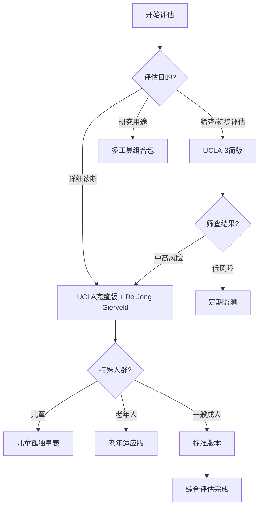

# 孤独测量工具详解与应用指南 (Loneliness Measurement Tools Detailed Guide)

## 核心测量工具标准化详解

### 一、经典孤独量表深度解析

#### 1.1 UCLA孤独量表 (UCLA Loneliness Scale)

**发展历程与版本演进：**
- **初版 (1978)**：80个项目，Russell等人开发
- **修订版 (1980)**：20个项目，删除冗余条目
- **第三版 (1996)**：保留核心20项，微调表述
- **简版 (2015)**：3项快速筛查版本

**完整20项版本条目分析：**

| 条目编号 | 原文条目 | 中文翻译 | 测量维度 | 反向计分 |
|---------|---------|---------|---------|---------|
| 1 | How often do you feel that you are "in tune" with the people around you? | 你有多经常感到与周围的人"合拍"？ | 社会连接感 | 是 |
| 2 | How often do you feel that you lack companionship? | 你有多经常感到缺少陪伴？ | 陪伴缺失感 | 否 |
| 3 | How often do you feel left out? | 你有多经常感到被排斥？ | 社会排斥感 | 否 |
| 4 | How often do you feel isolated from others? | 你有多经常感到与他人隔离？ | 社会孤立感 | 否 |
| 5 | How often do you feel that your relationships with others are not meaningful? | 你有多经常感到与他人的关系没有意义？ | 关系意义感 | 否 |
| 6 | How often do you feel that no one really knows you well? | 你有多经常感到没有人真正了解你？ | 被理解感 | 否 |
| 7 | How often do you feel that you are not a part of a group of friends? | 你有多经常感到不是朋友圈的一员？ | 群体归属感 | 否 |
| 8 | How often do you feel that you have no one to talk to? | 你有多经常感到没有人可以交谈？ | 交流机会 | 否 |
| 9 | How often do you feel alone? | 你有多经常感到孤独？ | 孤独感强度 | 否 |
| 10 | How often do you feel abandoned? | 你有多经常感到被遗弃？ | 被遗弃感 | 否 |
| 11 | How often do you feel that there is no one you can turn to? | 你有多经常感到没有可以求助的人？ | 社会支持感 | 否 |
| 12 | How often do you feel disconnected from other people? | 你有多经常感到与他人脱节？ | 连接感 | 否 |
| 13 | How often do you feel that people are around you but not with you? | 你有多经常感到人在身边但心不在一起？ | 陪伴质量 | 否 |
| 14 | How often do you feel that your interests and ideas are not shared by those around you? | 你有多经常感到周围的人不分享你的兴趣和想法？ | 兴趣共鸣 | 否 |
| 15 | How often do you feel outgoing and friendly? | 你有多经常感到外向和友好？ | 社交意愿 | 是 |
| 16 | How often do you feel close to people? | 你有多经常感到与人亲近？ | 亲密感 | 是 |
| 17 | How often do you feel left out of activities? | 你有多经常感到被活动排除在外？ | 活动参与感 | 否 |
| 18 | How often do you feel that your relationships don't mean as much to you? | 你有多经常感到你的人际关系对你来说没那么重要？ | 关系价值感 | 否 |
| 19 | How often do you feel that nobody understands you? | 你有多经常感到没有人理解你？ | 被理解感 | 否 |
| 20 | How often do you feel shy? | 你有多经常感到害羞？ | 社交焦虑 | 否 |

**评分标准与解释：**
- **频率选项**：几乎从不(1分)、很少(2分)、有时(3分)、经常(4分)
- **总分范围**：20-80分
- **分数解释**：
  - 20-40分：低孤独水平
  - 41-60分：中等孤独水平  
  - 61-80分：高孤独水平

**临床应用注意事项：**
- 建议间隔2-4周重复测量以评估变化趋势
- 考虑文化背景对条目理解的影响
- 注意季节性情绪波动的干扰
- 结合其他评估工具进行综合判断

#### 1.2 De Jong Gierveld孤独量表 (6项版本)

**量表结构：**
- **情感孤独分量表**：3个项目
- **社交孤独分量表**：3个项目

**完整条目列表：**

**情感孤独部分：**
1. "我缺少可以真正依靠的人"
2. "在我生活中缺少给我情感支持的人"  
3. "我缺少可以向其倾诉内心感受的人"

**社交孤独部分：**
1. "我缺少可以一起做事情的人"
2. "我缺少可以真正了解我的人"
3. "总的来说，我缺少可以谈论各种话题的朋友"

**评分与解释：**
- **回答选项**：是(1分)、否(0分)、有时(0.5分)
- **各维度得分**：0-3分
- **总分**：0-6分
- **解释标准**：
  - 0-1分：低孤独水平
  - 1.5-2.5分：中等孤独水平
  - 3-6分：高孤独水平

#### 1.3 De Jong Gierveld 孤独量表 (11项版本) — 推荐标准版

**为何推荐11项版本**：
- 信度更高（α=0.84-0.89 vs 6项α=0.70-0.80）
- 区分度更好：可更清晰地区分情感孤独(EL)和社交孤独(SL)
- 国际使用更广泛：欧洲老年孤独研究(European Social Survey)标准工具
- 诊断准确率：中等及以上孤独检出率约25-35%

**量表结构：**

| 项目 | 内容 | 维度 | 计分 |
|------|------|------|------|
| 1 | 我缺少可以真正依靠的人 | 情感孤独(EL) | 否=1, 是=0 |
| 2 | 在我生活中缺少给我情感支持的人 | 情感孤独(EL) | 否=1, 是=0 |
| 3 | 我缺少可以向其倾诉内心感受的人 | 情感孤独(EL) | 否=1, 是=0 |
| 4 | 我缺少可以给我温暖和理解的人 | 情感孤独(EL) | 否=1, 是=0 |
| 5 | 我缺少可以一起做事情的人 | 情感孤独(EL) | 否=1, 是=0 |
| 6 | 我缺少可以真正了解我的人 | 社交孤独(SL) | 否=1, 是=0 |
| 7 | 我缺少可以信赖的人 | 社交孤独(SL) | 否=1, 是=0 |
| 8 | 我缺少亲密的朋友 | 社交孤独(SL) | 否=1, 是=0 |
| 9 | 总的来说，我缺少可以谈论各种话题的朋友 | 社交孤独(SL) | 否=1, 是=0 |
| 10 | 我觉得自己被他人排斥 | 社交孤独(SL) | 否=1, 是=0 |
| 11 | 我觉得自己的社交圈太小 | 社交孤独(SL) | 否=1, 是=0 |

**评分与解释：**
- **计分方式**：每个"是"=1分（孤独），每个"否"=0分（不孤独）
- **情感孤独(EL)**：项目1-5，得分范围0-5
- **社交孤独(SL)**：项目6-11，得分范围0-6
- **总分**：0-11分

**诊断阈值**：
| 分数 | 孤独水平 | 临床意义 |
|------|----------|----------|
| 0-2 | 无/低孤独 | 社会连接良好 |
| 3-5 | 中等孤独 | 建议关注；可能需要预防性干预 |
| ≥6 | 严重孤独 | 建议临床评估和主动干预 |

**双维度解读**：
| EL | SL | 类型 | 干预重点 |
|----|----|------|----------|
| 高 | 低 | 情感孤独型 | 深化现有关系；情感表达训练 |
| 低 | 高 | 社交孤独型 | 扩大社交网络；社交技能训练 |
| 高 | 高 | 双重孤独型 | 综合干预；优先处理情感孤独 |
| 低 | 低 | 无孤独 | 维持当前状态 |

---

### 二、特殊人群专用测量工具

#### 2.1 儿童孤独量表 (Children's Loneliness Scale)

**适用年龄**：8-12岁儿童

**核心条目示例：**
- "我没有可以一起玩的好朋友"
- "我觉得班上其他同学都不喜欢我"
- "我想和别人一起玩，但他们不想和我玩"
- "我觉得自己和其他孩子不一样"

**儿童版本特点：**
- 语言表达简单明了
- 采用图画辅助理解
- 考虑儿童认知发展水平
- 区分同伴关系和家庭关系孤独

#### 2.2 老年孤独量表 (UCLA Loneliness Scale-Version 3 for Older Adults)

**针对老年人的适应性修改：**
- 考虑身体功能限制对社交的影响
- 区分居住安排和社会参与
- 考虑代际关系和支持网络
- 关注健康状况对孤独感的影响

### 三、多维度评估工具矩阵

#### 3.1 综合评估工具包

| 评估维度 | 推荐工具 | 评估重点 | 适用场景 |
|---------|---------|---------|---------|
| **总体孤独感** | UCLA孤独量表 | 孤独感强度与频率 | 通用筛查 |
| **孤独类型区分** | De Jong Gierveld量表 | 情感vs社交孤独 | 精确诊断 |
| **社交网络结构** | 社会网络问卷 | 关系数量与质量 | 系统评估 |
| **功能损害程度** | WHO功能评定量表 | 日常功能影响 | 干预决策 |
| **生活质量影响** | SF-36健康调查 | 整体生活质量 | 效果评估 |

#### 3.2 数字化评估工具

**移动应用集成评估：**
- **生态瞬时评估(EMA)**：日常生活中的实时孤独感测量
- **行为数据分析**：通过手机使用模式推断社交状态
- **语音情感分析**：通话和语音消息中的情感线索识别
- **地理位置追踪**：活动范围与社交聚集度分析

### 四、临床评估流程标准化

#### 4.1 三级筛查体系

**第一级：快速筛查**
```
筛查工具：UCLA-3简版或单条目筛查
筛查问题："在过去一周中，你有多少天感到孤独？"
- 0-1天：低风险
- 2-4天：中风险  
- 5-7天：高风险
```

**第二级：详细评估**
```
评估工具组合：
1. UCLA孤独量表(完整版) - 评估总体水平
2. De Jong Gierveld量表 - 区分孤独类型
3. 社会网络绘图 - 可视化关系结构
4. 功能影响评估 - 日常生活损害程度
```

**第三级：深入诊断**
```
综合评估要素：
- 精神健康共病筛查(PHQ-9, GAD-7)
- 社会支持系统详细评估
- 生活事件和创伤史
- 文化背景和个人价值观
- 治疗偏好和资源可用性
```

#### 4.2 动态监测方案

**短期监测(治疗期间)：**
- 频率：每周1次
- 工具：UCLA-3简版
- 目标：跟踪症状变化趋势

**中期评估(阶段性)：**
- 频率：每月1次
- 工具：完整UCLA量表
- 目标：评估干预效果

**长期追踪(维持期)：**
- 频率：每季度1次
- 工具：综合性评估包
- 目标：预防复发和维持效果

### 五、测量工具的信效度指标

#### 5.1 心理测量学特性

| 量表名称 | 内部一致性(α) | 重测信度 | 结构效度 | 效标效度 |
|---------|-------------|---------|---------|---------|
| UCLA孤独量表 | 0.89-0.94 | 0.70-0.85 | 良好 | 良好 |
| De Jong Gierveld | 0.80-0.85 | 0.65-0.80 | 良好 | 中等 |
| 儿童孤独量表 | 0.80-0.88 | 0.70-0.82 | 良好 | 中等 |

#### 5.2 跨文化适应性

**文化敏感性考虑：**
- **集体主义文化**：可能低估个体孤独感
- **个人主义文化**：可能高估社交需求
- **年龄差异**：不同年龄段对孤独的理解不同
- **性别差异**：男女表达孤独的方式存在差异

### 六、新兴测量技术与方法

#### 6.1 生理与生物标志物测量

孤独不仅是主观体验，更伴随可测量的生物学改变。以下指标可用于研究目的和部分临床场景。

**一、神经内分泌指标**

| 标志物 | 样本类型 | 孤独状态 | 机制说明 | 测量方法 | 证据等级 |
|--------|----------|----------|----------|----------|----------|
| **皮质醇(觉醒反应CAR)** | 唾液(醒后0/30/45min) | ↑ 钝化或过度 | HPA轴失调；慢性应激 | ELISA | A |
| **皮质醇(昼夜曲线)** | 唾液/头发 | 节律紊乱 | 慢性孤独者的典型特征 | 多次采样/毛发分析 | B |
| **DHEA-S** | 血液 | ↓ 相对降低 | 负反馈调节失衡 | 免疫分析 | B |
| **催产素(Oxytocin)** | 血液/唾液 | ↓ 基线偏低 | 社会连接激素；与社会支持负相关 | ELISA/Radioimmunoassay | B |
| **睾酮/雌激素比** | 血液 | 可能失衡 | 性激素影响社交动机和行为 | 化学发光法 | C |

**临床注意**：CAR测量需严格控制采样时间（醒后即刻、30分钟、45分钟），光照、睡眠时间和咖啡因摄入均影响结果。

**二、炎症与免疫指标**

| 标志物 | 样本类型 | 孤独状态 | 临床正常参考 | 机制说明 | 证据等级 |
|--------|----------|----------|-------------|----------|----------|
| **C反应蛋白(CRP)** | 血清/血浆 | ↑ | <3 mg/L | 全身炎症标志物 | A |
| **白细胞介素-6 (IL-6)** | 血清/血浆 | ↑ | <5 pg/mL | 核心促炎细胞因子 | A |
| **白细胞介素-1β (IL-1β)** | 血清/血浆 | ↑ | <0.5 pg/mL | 急性期反应；NLRP3炎症小体 | B |
| **肿瘤坏死因子-α (TNF-α)** | 血清/血浆 | ↑/变化 | <8 pg/mL | 促炎；与疲劳相关 | B |
| **可溶性白细胞介素-2受体(sIL-2R)** | 血清 | ↑ | 取决于年龄 | T细胞活化标志 | C |
| **干扰素-γ (IFN-γ)** | 血浆 | ↓ | 取决于实验 | 抗病毒免疫下调(CTRA) | B |
| **纤维蛋白原** | 血浆 | ↑ | 2-4 g/L | 炎症与凝血交叉 | B |

**Cole CTRA指标（基因表达水平，需全血RNA提取）**：
- **促炎通路基因**：NF-κB、CREB、AP-1靶基因上调
- **抗病毒通路基因**：I型干扰素应答基因下调
- **测量平台**：Nanostring、RNA-seq
- **注意**：需专业实验室，不适合常规临床

**三、心血管与自主神经指标**

| 指标 | 测量方法 | 孤独状态 | 临床意义 | 证据等级 |
|------|----------|----------|----------|----------|
| **心率变异性-RMSSD** | 连续ECG/PPG | ↓ | 迷走神经张力降低；情绪调节差 | A |
| **心率变异性-HF-HRV** | 连续ECG/PPG | ↓ | 副交感神经活动降低 | A |
| **心率变异性-LF/HF比** | 连续ECG/PPG | ↑ | 交感-副交感失衡 | B |
| **静息心率** | ECG/血压计 | ↑ | 心血管风险增加 | B |
| **血压（收缩/舒张）** | 标准袖带 | ↑ | 高血压风险 | A |
| **血压变异性** | 24h动态血压 | ↑ | 靶器官损害风险 | C |
| **内皮功能(FMD)** | 超声 | ↓ | 血管内皮功能障碍 | B |

**四、代谢指标**

| 标志物 | 样本类型 | 孤独状态 | 参考范围 | 机制 | 证据等级 |
|--------|----------|----------|----------|------|----------|
| **空腹血糖** | 血浆 | ↑ | 3.9-6.1 mmol/L | 慢性应激→胰岛素抵抗 | B |
| **糖化血红蛋白(HbA1c)** | 全血 | ↑ | <5.7% | 长期血糖控制 | B |
| **总胆固醇** | 血清 | ↑ | <5.2 mmol/L | 应激代谢改变 | C |
| **低密度脂蛋白(LDL-C)** | 血清 | ↑ | <3.4 mmol/L | 动脉粥样硬化风险 | C |
| **甘油三酯** | 血清 | ↑ | <1.7 mmol/L | 代谢综合征成分 | B |
| **瘦素(Leptin)** | 血清 | ↑ | 取决于BMI | 代谢-免疫交叉 | C |
| **脂联素(Adiponectin)** | 血清 | ↓ | 性别/年龄相关 | 抗炎；胰岛素增敏 | C |

**五、氧化应激与细胞衰老**

| 标志物 | 样本类型 | 孤独状态 | 机制 | 证据等级 |
|--------|----------|----------|------|----------|
| **8-OHdG** | 尿液 | ↑ | DNA氧化损伤 | B |
| **F2-异前列烷** | 尿液/血浆 | ↑ | 脂质过氧化 | B |
| **端粒长度(T/S比)** | 白细胞DNA | ↓ | 细胞衰老加速 | A |
| **端粒酶活性** | 白细胞 | ↓ | 端粒修复能力下降 | B |
| **氧化型LDL(ox-LDL)** | 血清 | ↑ | 血管氧化应激 | C |

**六、肠道菌群相关指标**

| 指标 | 样本类型 | 测量方法 | 孤独状态 | 证据等级 |
|------|----------|----------|----------|----------|
| **菌群α多样性(Shannon/Simpson)** | 粪便 | 16S rRNA/宏基因组 | ↓ | B |
| **菌群β多样性(Bray-Curtis/Unifrac)** | 粪便 | 16S rRNA/宏基因组 | 与非孤独者显著不同 | B |
| **短链脂肪酸(SCFA)** | 粪便/血清 | GC-MS/HPLC | ↓ | B |
| **丁酸(Butyrate)** | 粪便 | GC-MS | ↓ | B |
| **脂多糖结合蛋白(LBP)** | 血清 | ELISA | ↑（漏肠标志） | C |
| **连蛋白(Zonulin)** | 血清 | ELISA | ↑（肠道通透性） | C |
| **血清色氨酸/犬尿氨酸比** | 血清 | HPLC | ↓ | B |

**七、睡眠相关指标**

| 指标 | 测量方法 | 孤独状态 | 说明 | 证据等级 |
|------|----------|----------|------|----------|
| **睡眠效率** | 多导睡眠图/Actigraphy | ↓ | 入睡后实际睡眠时间占比 | A |
| **入睡潜伏期** | 同上 | ↑ | 从关灯到入睡的时间 | A |
| **觉醒次数** | 同上 | ↑ | 夜间醒来次数 | B |
| **REM睡眠比例** | 多导睡眠图 | ↓ | 快速眼动睡眠 | B |
| **慢波睡眠比例** | 多导睡眠图 | ↓ | 深度睡眠 | B |
| **PSQI总分** | 自评量表 | ↑ | 匹兹堡睡眠质量指数 | A |

**八、神经影像指标（研究级）**

| 指标 | 模态 | 孤独状态 | 区域/网络 | 证据等级 |
|------|------|----------|-----------|----------|
| **dACC灰质体积** | MRI-T1 | ↓ | 背侧前扣带皮层 | B |
| **AI灰质体积** | MRI-T1 | ↓ | 前岛叶 | B |
| **vmPFC激活** | fMRI | ↓ | 腹内侧前额叶（自我/关怀） | B |
| **NAcc激活** | fMRI | ↓ | 伏隔核（奖赏） | C |
| **DMN功能连接** | fMRI-静息态 | 异常 | 后扣带-内侧前额叶 | B |
| **白质完整性(FA)** | DTI | ↓ | 胼胝体、扣带束 | C |
| **NAA/Cho比** | MRS | ↓ | 前额叶（神经元健康） | D |
| **GABA水平** | MRS | ↓ | 前扣带/岛叶 | D |

**九、综合生物学风险评分**

研究人员可使用多个标志物构建**孤独生物学风险指数(Lonely Biology Risk Index, LBRI)**：

```
LBRI = w₁(CRP_z) + w₂(IL-6_z) + w₃(RMSSD_z⁻¹) + w₄(Cortisol_z) + 
       w₅(Telomere_z⁻¹) + w₆(SCFA_z⁻¹) + w₇(α-diversity_z⁻¹)

权重可根据主成分分析(PCA)或随机森林确定
参考阈值：
- LBRI < -0.5：低风险
- -0.5 ≤ LBRI ≤ 0.5：中等风险
- LBRI > 0.5：高风险
```

> **重要声明**：上述生物标志物主要用于**研究目的**和**个案深度评估**。常规临床评估仍应以主观量表为主。生物标志物目前**不能单独用于诊断孤独**，且多数标志物缺乏孤独特异性（在抑郁、焦虑、慢性应激中亦升高）。

#### 6.2 行为大数据分析

**数字足迹分析：**
- 社交媒体使用模式
- 通讯频率和时长
- 地理位置移动轨迹
- 在线社交网络密度

#### 6.3 神经影像测量

**脑成像指标：**
- 默认模式网络活动模式
- 社会疼痛回路激活程度
- 奖赏系统反应性
- 前额叶皮质功能连接

### 七、测量工具选择决策树



### 八、质量控制与标准化操作

#### 8.1 实施标准化流程

**评估前准备：**
- 确保环境安静舒适
- 解释评估目的和保密原则
- 确认参与者理解指导语
- 准备必要的时间(通常15-30分钟)

**实施过程中：**
- 严格按照指导语进行
- 避免引导性提问
- 记录任何异常反应
- 确保填写完整性

**结果解释时：**
- 结合多维度信息
- 考虑测量误差范围
- 避免单一分数决定论
- 提供具体可行的建议

#### 8.2 常见问题与解决方案

| 问题类型 | 典型表现 | 解决策略 |
|---------|---------|---------|
| **理解困难** | 反复询问条目含义 | 简化语言，提供具体例子 |
| **社会期望偏差** | 回答过于积极或消极 | 强调诚实回答的重要性 |
| **情绪反应强烈** | 评估过程中流泪或焦虑 | 提供情感支持，必要时暂停 |
| **文化差异** | 对某些概念理解不同 | 了解文化背景，适当调整表述 |

---

*本指南基于国际标准化的心理测量原则制定，结合了最新的孤独研究证据和临床实践经验，旨在为专业人士提供科学、系统的孤独测量指导。*