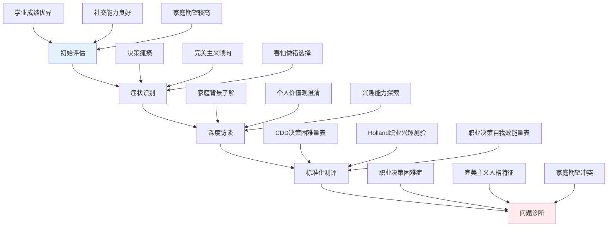
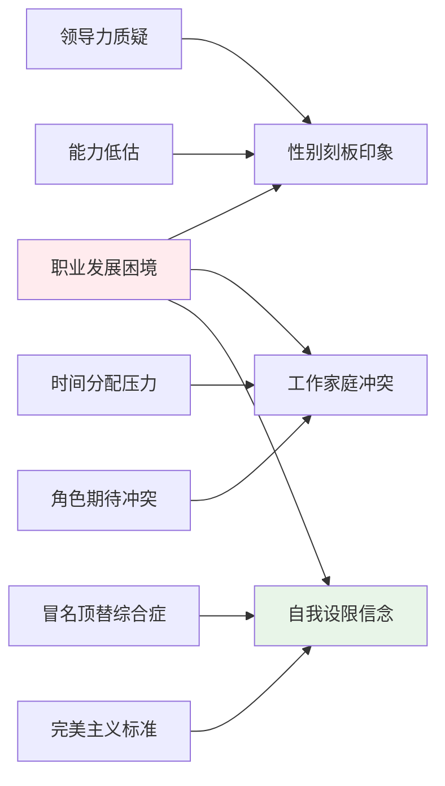

# 职业心理学案例研究与实践指南 (Vocational Psychology Case Studies & Practice Guide)

> 📘 **文档导航**: 本指南通过典型案例分析和实践指导，展示职业心理学理论的实际应用。相关文档：
> - [职业心理学概览](../Vocational_Psychology_Overview.md) - 学科全景图和理论基础
> - [职业心理学临床应用](../clinical/Vocational_Psychology_Clinical_Applications.md) - 治疗干预和咨询技术
> - [职业心理学术语标准](../Vocational_Psychology_Terminology_Standards.md) - 专业术语定义和使用规范

## 典型案例分析 (Typical Case Studies)

### 案例一：大学生职业决策困难干预

**案例背景**:
张同学，22岁，某重点大学计算机专业大四学生，面临毕业求职选择。表现出明显的决策困难症状：反复修改简历却不敢投递、面试机会增多反而更加焦虑、对未来职业发展方向感到迷茫。

**问题识别与评估**:

**干预过程**:

**第一阶段：建立咨询关系与问题澄清 (1-2次咨询)**
- 建立信任关系，营造安全的咨询环境
- 使用开放式提问深入了解决策困难的具体表现
- 运用倾听技术和共情回应减轻来访者焦虑

**第二阶段：认知重构与自我探索 (3-5次咨询)**
- 识别和挑战完美主义思维："必须找到最完美的工作"
- 引导重新框架化：将求职视为探索过程而非最终判决
- 使用职业兴趣测评工具帮助澄清个人偏好
- 进行价值观澄清练习，明确职业选择的核心标准

**第三阶段：技能训练与行动实施 (6-8次咨询)**
- 教授CASVE决策循环模型的具体应用
- 进行模拟面试训练，提升求职技能和自信心
- 制定具体的求职行动计划和时间表
- 建立支持系统，包括家人、朋友、职业导师的支持

**第四阶段：巩固效果与预防复发 (9-10次咨询)**
- 回顾整个咨询过程，总结学习收获
- 制定应对未来职业挑战的策略
- 建立长期的职业发展规划意识
- 安排后续跟进计划

**干预效果评估**:
| 评估维度 | 干预前 | 干预后 | 改善程度 |
| :--- | :--- | :--- | :--- |
| **决策困难程度** | 严重(42分) | 轻度(18分) | 显著改善 |
| **求职行动力** | 几乎无行动 | 积极投递简历 | 明显提升 |
| **焦虑水平** | 高度焦虑 | 中度焦虑 | 有效缓解 |
| **自我效能感** | 低水平 | 中高水平 | 显著增强 |

### 案例二：中年职场转型压力管理

**案例背景**:
李经理，42岁，某制造企业中层管理岗位工作15年，因公司业务转型面临岗位调整。出现职业倦怠症状：情感耗竭、工作满意度下降、对未来职业发展感到绝望。

**系统评估框架**:
| 评估层面 | 评估内容 | 评估工具 | 发现问题 |
| :--- | :--- | :--- | :--- |
| **个人层面** | 能力结构、兴趣变化、价值取向 | 职业能力测评、价值观澄清 | 技能老化、兴趣转移 |
| **组织层面** | 岗位要求、发展前景、支持资源 | 组织诊断访谈、岗位分析 | 转型适应困难 |
| **社会层面** | 家庭责任、经济压力、社会支持 | 家庭功能评估、社会支持量表 | 家庭经济依赖度高 |

**整合干预方案**:

**认知层面干预**:
- **重新定义成功**: 帮助从"职务晋升"转向"能力发展"的成功观
- **挑战年龄偏见**: 识别和反驳"40岁后无发展"的错误认知
- **重构转型意义**: 将危机转化为成长和学习的机会

**情绪层面调节**:
- **正念减压训练**: 每日10分钟正念练习，管理焦虑情绪
- **情绪日记记录**: 识别触发负面情绪的具体情境和思维模式
- **放松技能训练**: 渐进性肌肉放松、深呼吸等生理调节技术

**行为层面改变**:
- **技能更新计划**: 制定数字化技能学习路线图
- **网络拓展策略**: 参加行业交流活动，建立新的职业联系
- **兼职项目体验**: 通过咨询项目试探新的职业可能性

**社会支持激活**:
- **家庭沟通工作坊**: 增进家人对职业转型的理解和支持
- **同行支持小组**: 与面临相似挑战的同事建立互助网络
- **导师指导关系**: 寻找成功转型的前辈提供经验指导

**效果追踪结果**:
经过6个月的系统干预，李经理实现了成功的职场转型：
- 从传统制造业管理岗位成功转入数字化咨询领域
- 建立了新的职业技能体系和专业网络
- 家庭关系因开诚布公的沟通而更加和谐
- 工作满意度和生活幸福感显著提升

### 案例三：女性职业发展瓶颈突破

**案例背景**:
王女士，35岁，某金融机构高级分析师，已婚未育。在职业发展中遇到"玻璃天花板"现象，多次晋升机会被以"需要更多管理经验"为由拒绝，同时面临来自家庭的生育压力。

**性别角色影响分析**:

**赋权干预策略**:

**自我赋权训练**:
- **优势识别练习**: 系统梳理个人专业能力和成就经历
- **成功案例分析**: 研究其他女性领导者的职业发展路径
- **自信表达训练**: 学习在会议和谈判中有效表达观点

**策略性网络建设**:
- **女性领导力圈子**: 加入女性高管交流平台和导师计划
- **跨部门合作项目**: 主动承担能够展示领导能力的项目
- **行业影响力提升**: 通过专业文章发表和会议演讲增加曝光度

**工作生活整合**:
- **边界管理技能**: 学会在工作和家庭间设立清晰的时间边界
- **支持系统构建**: 与配偶协商育儿分工，寻求长辈支持
- **弹性工作安排**: 与雇主协商灵活工作时间和远程办公可能

**组织文化倡导**:
- **多元化倡议参与**: 积极参与公司的多元化和包容性项目
- **政策建议提交**: 基于个人经历向管理层提出改进建议
- **榜样力量发挥**: 成为其他女性员工的职业发展导师

**突破性成果**:
王女士在一年内实现了职业发展的重大突破：
- 成功晋升为部门负责人，打破了所在部门的女性晋升记录
- 建立了支持女性职业发展的内部网络
- 在平衡工作与家庭方面找到了适合自己的模式
- 成为公司多元化倡议的重要推动者

## 实践指导原则 (Practice Guidance Principles)

### 咨询关系建立技巧

**初始会谈要点**:
1. **营造安全环境**: 确保私密性，表达无条件积极关注
2. **澄清咨询目标**: 与来访者共同确定具体、可达成的目标
3. **建立工作联盟**: 说明咨询师角色和来访者责任
4. **设置合理期望**: 解释咨询过程、时间和可能的挑战

**关系维护策略**:
- 保持专业边界的同时展现真诚关怀
- 定期检查咨询关系质量
- 及时处理可能出现的阻抗或误解
- 在适当时机进行关系修复

### 干预技术应用指南

**认知行为技术**:
| 技术名称 | 适用问题 | 实施要点 | 注意事项 |
| :--- | :--- | :--- | :--- |
| **苏格拉底式提问** | 认知扭曲 | 开放式、引导性提问 | 避免直接纠正或评判 |
| **思维记录表** | 负面自动思维 | 结构化记录思维过程 | 保持客观、非批判态度 |
| **行为实验** | 信念验证 | 设计可操作的验证活动 | 确保安全性和可行性 |

**人本主义技术**:
| 技术要点 | 实施方法 | 核心要素 | 效果指标 |
| :--- | :--- | :--- | :--- |
| **积极倾听** | 全神贯注、适时回应 | 注意力、理解、共情 | 来访者感受到被理解 |
| **无条件积极关注** | 接纳全部、不带评判 | 真诚、温暖、尊重 | 建立信任关系 |
| **共情理解** | 情感共鸣、意义理解 | 情感准确度、深度理解 | 促进自我探索 |

### 危机识别与处理

**职业危机预警信号**:
| 危机类型 | 早期信号 | 中期表现 | 紧急干预指征 |
| :--- | :--- | :--- | :--- |
| **失业危机** | 求职挫折感增加 | 经济压力显现 | 自杀意念或计划 |
| **职场霸凌** | 工作满意度下降 | 身心症状出现 | 安全受到威胁 |
| **职业倦怠** | 工作投入度降低 | 情感耗竭明显 | 功能严重受损 |
| **身份危机** | 职业认同动摇 | 价值体系混乱 | 现实检验能力受损 |

**紧急处理流程**:
1. **安全评估**: 立即评估当事人的人身安全和自杀风险
2. **危机干预**: 提供即时情感支持和安全环境
3. **资源链接**: 联系专业机构和紧急支援系统
4. **后续跟进**: 制定长期支持和治疗计划

## 工具箱与资源库 (Toolkit & Resource Library)

### 评估工具清单

**标准化量表**:
- 职业兴趣量表(Holland职业兴趣量表)
- 职业决策困难诊断量表(CDD)
- 工作倦怠量表(MBBI)
- 职业适应性量表(CAS)
- 工作满意度问卷(JSQ)

**自评工具**:
- 个人优势识别清单
- 价值观澄清练习表
- 职业发展时间线图
- SWOT分析模板
- 决策平衡单

### 干预技术手册

**认知重构技术**:
- 识别认知扭曲的清单
- 替代性思维生成模板
- 理性情绪辩论技术
- 认知连续体练习

**行为激活策略**:
- 积极活动安排表
- 小步骤目标设定法
- 成功经验记录册
- 奖励系统设计

**沟通技能训练**:
-_assertive表达模板
- 冲突解决话术
- 反馈接收技巧
- 网络建设策略

### 数字化资源推荐

**在线评估平台**:
- 16Personalities职业性格测试
- O*NET职业信息网络
- LinkedIn职业发展工具
- Glassdoor薪资和公司评价

**移动应用推荐**:
- Headspace(正念冥想)
- Forest(专注力训练)
- Todoist(任务管理)
- Slack(团队协作)

**专业网站资源**:
- SIOP(工业与组织心理学学会)
- APA职业心理学分会
- 中国心理学会职业心理学专委会
- 各大高校职业发展中心

## 质量保证与伦理规范 (Quality Assurance & Ethical Standards)

### 专业胜任力要求

**知识基础**:
- 掌握职业心理学核心理论和最新发展
- 熟悉相关法律法规和行业标准
- 了解不同文化背景下的职业观念差异
- 持续更新数字化时代的新兴趋势

**技能标准**:
- 熟练运用各种评估工具和干预技术
- 具备良好的咨询关系建立和维护能力
- 掌握危机识别和紧急处理技能
- 能够进行有效的案例记录和档案管理

### 伦理实践准则

**保密原则**:
- 严格保护当事人隐私信息
- 明确告知保密例外情况
- 建立安全的信息存储系统
- 获得必要的知情同意

**专业边界**:
- 维持适当的咨询师-来访者关系
- 避免双重关系和利益冲突
- 及时转介超出能力范围的案例
- 定期接受督导和专业发展

**文化敏感性**:
- 尊重不同文化背景的价值观念
- 适应多元化的表达方式和沟通风格
- 避免文化偏见和刻板印象
- 提供包容性的服务环境

---

*📚 本案例研究与实践指南旨在为职业心理学实践者提供实用的操作框架和经验借鉴，促进专业服务质量的持续提升。*