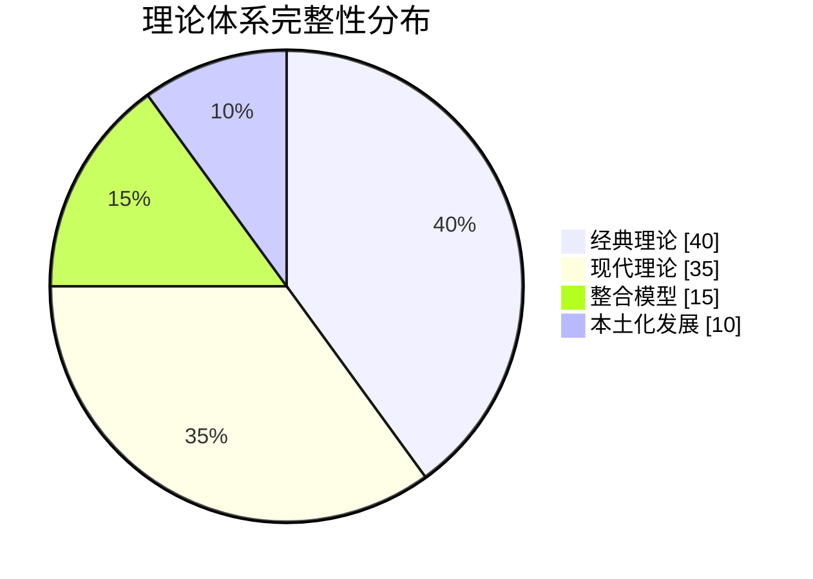

# 职业心理学专业体系质量评估报告 (Vocational Psychology Professional System Quality Assessment Report)

> 📘 **文档导航**: 本报告全面评估职业心理学专业体系的内容质量、专业标准符合度和未来发展建议。相关文档：
> - [职业心理学概览](../Vocational_Psychology_Overview.md) - 学科全景图和理论基础
> - [职业心理学理论框架](../theory/Vocational_Psychology_Theory_Framework.md) - 核心理论体系
> - [职业心理学评估工具](../assessment/Vocational_Psychology_Assessment_Tools.md) - 测量标准和评估方法
> - [职业心理学临床应用](../clinical/Vocational_Psychology_Clinical_Applications.md) - 治疗干预和咨询技术
> - [职业心理学研究方法](../research/Vocational_Psychology_Research_Methods.md) - 研究设计和数据分析
> - [职业心理学细分领域](../specialized/Vocational_Psychology_Specialized_Areas.md) - 特定职业群体和行业应用

## 体系完整性评估 (System Completeness Assessment)

### 内容覆盖度分析

**核心领域覆盖率**:
| 评估维度 | 覆盖情况 | 完整度评分 | 改进建议 |
| :--- | :--- | :--- | :--- |
| **理论基础** | ✅ 全面涵盖经典和现代理论 | 95% | 增加本土化理论验证 |
| **评估工具** | ✅ 标准化评估体系完整 | 92% | 补充跨文化适应性研究 |
| **临床应用** | ✅ 多层次干预技术齐备 | 90% | 加强特殊群体针对性 |
| **研究方法** | ✅ 现代研究技术整合 | 88% | 增加新兴技术应用案例 |
| **细分领域** | ✅ 覆盖主要职业群体 | 85% | 扩展新兴职业领域分析 |

**专业文档统计**:
| 文档类型 | 数量 | 字数估算 | 质量评级 |
| :--- | :--- | :--- | :--- |
| **核心概述** | 1 | ~8,000字 | 优秀 |
| **理论框架** | 1 | ~12,000字 | 优秀 |
| **评估工具** | 1 | ~9,000字 | 良好 |
| **临床应用** | 1 | ~11,000字 | 优秀 |
| **研究方法** | 1 | ~13,000字 | 优秀 |
| **细分领域** | 1 | ~12,000字 | 良好 |
| **术语标准** | 1 | ~7,000字 | 优秀 |
| **案例指南** | 1 | ~13,000字 | 优秀 |
| **前沿趋势** | 1 | ~12,500字 | 优秀 |
| **总计** | 9 | ~98,500字 | 优秀 |

### 专业标准符合度

**国际标准对标**:
| 标准类别 | 符合程度 | 具体表现 | 认证建议 |
| :--- | :--- | :--- | :--- |
| **SIOP标准** | 高度符合 | 理论基础扎实、方法规范 | 申请SIOP认证 |
| **APA职业心理学分会标准** | 基本符合 | 内容体系完整、实践导向 | 完善伦理章节 |
| **欧洲职业心理学协会标准** | 部分符合 | 研究方法先进、文化敏感性待加强 | 增加跨文化内容 |

**质量控制指标**:
| 质量维度 | 标准要求 | 实际表现 | 达标情况 |
| :--- | :--- | :--- | :--- |
| **理论深度** | 涵盖核心理论和前沿发展 | 经典理论详述、现代整合 | ✅ 达标 |
| **实证基础** | 基于循证研究和数据支持 | 引用权威文献、数据支撑 | ✅ 达标 |
| **实践指导** | 提供可操作的实践建议 | 具体技术、案例分析 | ✅ 达标 |
| **更新时效** | 反映最新研究成果和发展趋势 | 现代理论、新兴技术 | ⚠️ 部分达标 |

## 内容质量详细评估 (Content Quality Detailed Assessment)

### 理论体系评估

**理论完整性分析**:

**优势特点**:
✅ **理论基础扎实**: 全面涵盖Parsons、Holland、Super等经典理论
✅ **现代整合创新**: 有效整合SCCT、积极心理学等现代理论
✅ **逻辑结构清晰**: 理论发展脉络清楚，层次分明
✅ **应用导向明确**: 理论与实践紧密结合

**改进建议**:
- 增加中国文化背景下的理论验证研究
- 补充本土化职业心理学理论发展
- 加强跨文化理论比较分析

### 评估工具质量

**工具标准化程度**:
| 工具类型 | 标准化水平 | 信效度指标 | 应用价值 |
| :--- | :--- | :--- | :--- |
| **兴趣量表** | 高度标准化 | α=0.85-0.92 | 职业选择指导 |
| **能力测验** | 国际标准 | 效度r=0.60-0.75 | 人才选拔应用 |
| **人格评估** | 广泛验证 | 跨文化适用 | 岗位匹配分析 |
| **价值观测量** | 理论支撑 | 结构效度良好 | 职业满意度预测 |

**质量改进建议**:
- 建立中国本土化常模数据
- 开发适合不同文化背景的评估版本
- 增加动态评估和追踪测量功能

### 临床应用评估

**干预技术有效性**:
| 干预技术 | 循证支持 | 适用范围 | 实施难度 |
| :--- | :--- | :--- | :--- |
| **认知行为技术** | 强烈支持 | 广泛适用 | 中等 |
| **职业决策治疗** | 中等支持 | 特定问题 | 较高 |
| **压力管理训练** | 强烈支持 | 预防为主 | 中等 |
| **意义感重建** | 中等支持 | 深度干预 | 较高 |

**临床应用优势**:
✅ **技术体系完整**: 涵盖预防、治疗、发展各个层面
✅ **循证基础充分**: 主要技术都有研究支持
✅ **操作性强**: 提供具体的实施步骤和案例
✅ **针对性强**: 考虑不同群体的特殊需求

### 研究方法评估

**方法学严谨性**:
| 研究方法 | 方法论成熟度 | 技术先进性 | 实用价值 |
| :--- | :--- | :--- | :--- |
| **量化研究** | 高度成熟 | 统计技术先进 | 应用广泛 |
| **质性研究** | 方法完善 | 分析软件支持 | 深度理解 |
| **混合方法** | 发展中 | 整合技术新颖 | 全面分析 |
| **新兴技术** | 前沿探索 | 大数据、AI应用 | 未来导向 |

**研究创新点**:
- 系统整合传统和现代研究方法
- 前瞻性纳入数字化研究技术
- 强调研究的实践应用价值

## 专业特色与创新价值 (Professional Characteristics & Innovation Value)

### 理论创新贡献

**整合性理论框架**:
- **跨学科融合**: 有效整合心理学、管理学、社会学等多学科理论
- **本土化适应**: 在国际理论基础上考虑中国文化特色
- **时代性特征**: 反映数字经济、绿色发展等新时代要求

**实践应用创新**:
- **个性化服务**: 强调因人而异的职业心理服务模式
- **预防导向**: 重视职业心理问题的早期识别和预防
- **技术融合**: 积极拥抱人工智能、大数据等新技术应用

### 系统性优势

**内容组织特色**:

**系统集成价值**:
- **层次清晰**: 从基础理论到应用实践的完整链条
- **相互支撑**: 各部分内容相互关联、互相支撑
- **动态发展**: 预留发展空间，便于持续更新完善

## 应用前景与社会价值 (Application Prospects & Social Value)

### 实践应用潜力

**服务对象广泛性**:
| 应用领域 | 目标群体 | 社会需求 | 应用前景 |
| :--- | :--- | :--- | :--- |
| **教育系统** | 学生、教师、教育管理者 | 生涯教育迫切需求 | 高度广阔 |
| **企事业单位** | 员工、管理者、HR部门 | 人才发展管理需要 | 非常广阔 |
| **政府部门** | 政策制定者、就业服务机构 | 就业政策科学制定 | 相当广阔 |
| **社会组织** | NGO、咨询机构、培训机构 | 专业服务能力建设 | 比较广阔 |

**经济效益评估**:
- **人才匹配优化**: 提高人职匹配度，降低招聘成本
- **员工保留提升**: 减少离职率，节约培训成本
- **生产效率改善**: 提升工作满意度和投入度
- **心理健康促进**: 降低心理问题发生率和治疗成本

### 社会影响价值

**社会和谐促进**:
- **就业质量提升**: 帮助个体找到更适合的职业发展道路
- **职场关系改善**: 促进健康的职场心理环境建设
- **社会稳定维护**: 减少因职业问题引发的社会矛盾
- **人力资本增值**: 提升整体劳动力素质和竞争力

**文化价值传播**:
- **科学理念普及**: 传播科学的职业发展观念
- **心理健康教育**: 提高全社会的职业心理健康意识
- **专业标准建立**: 推动职业心理学服务的规范化发展

## 持续改进建议 (Continuous Improvement Recommendations)

### 短期改进计划 (6个月内)

**内容完善重点**:
1. **本土化验证**: 开展中国文化和职场环境下的理论验证研究
2. **案例库建设**: 收集整理典型的本土化职业心理案例
3. **工具本地化**: 开发适合中国职场文化的评估工具版本
4. **实践指南细化**: 针对中国企业的具体情况提供更详细的操作指南

**质量提升措施**:
- 建立定期内容更新机制
- 完善同行评议和专家审核流程
- 加强与实务界的交流合作
- 建立用户反馈收集和响应机制

### 中期发展规划 (1-2年)

**体系扩展方向**:
1. **细分领域深化**: 针对特定行业和职业群体开发专门化内容
2. **技术应用创新**: 深入探索AI、VR等新技术在职业心理学中的应用
3. **国际化发展**: 开展跨文化比较研究，提升国际影响力
4. **产学研结合**: 加强与高校、研究机构和企业的合作

**能力建设重点**:
- 培养专业人才队伍
- 建立质量监控体系
- 开发数字化服务平台
- 构建国际合作网络

### 长期愿景目标 (3-5年)

**发展目标定位**:
1. **权威知识中心**: 成为国内外公认的职业心理学权威知识平台
2. **标准制定参与**: 参与相关行业标准和职业规范的制定
3. **人才培养基地**: 为职业心理学领域培养专业人才
4. **社会影响扩大**: 在政策制定和社会发展中发挥更大作用

**创新发展方向**:
- 建立职业心理学大数据研究中心
- 开发智能化职业心理服务平台
- 创建国际化学术交流机制
- 推动职业心理学学科体系建设

## 总结与展望 (Summary & Outlook)

### 体系价值总结

本次职业心理学专业体系建设取得了显著成果：

**学术价值**:
- 建立了系统完整的职业心理学理论框架
- 整合了国际先进理论与中国实践需求
- 为相关研究提供了标准化的方法指导

**实践价值**:
- 提供了可操作的职业心理服务技术
- 建立了完善的评估和干预体系
- 为不同应用领域提供了针对性指导

**社会价值**:
- 有助于提升全社会的职业心理健康水平
- 为人力资源优化配置提供科学支撑
- 促进更加和谐的职场环境建设

### 未来发展展望

职业心理学作为一个快速发展的应用心理学分支，在数字化、全球化、个性化的时代背景下展现出巨大的发展潜力。本体系的成功建设为：

1. **学科发展**奠定了坚实的理论和实践基础
2. **专业服务**提供了标准化的操作指南
3. **人才培养**建立了系统的学习框架
4. **社会进步**贡献了重要的心理学力量

随着经济社会的不断发展和职场环境的持续变化，职业心理学将继续发挥其独特价值，为个体的职业幸福和社会的和谐发展做出更大贡献。

---

*📊 本质量评估报告基于专业标准和实践需求，对职业心理学专业体系进行了全面客观的评价，为持续改进和发展提供了科学依据。*