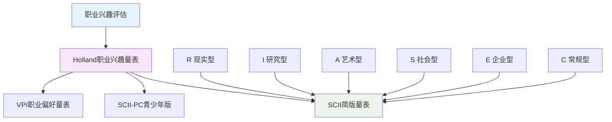

# 职业心理学评估工具与测量标准 (Vocational Psychology Assessment Tools & Standards)

> 📘 **文档导航**: 本指南详细介绍职业心理学的核心评估工具、测量标准和质量控制体系。相关文档：
> - [职业心理学概览](../Vocational_Psychology_Overview.md) - 学科全景图和理论基础
> - [职业心理学理论框架](../theory/Vocational_Psychology_Theory_Framework.md) - 核心理论体系
> - [职业心理学临床应用](../clinical/Vocational_Psychology_Clinical_Applications.md) - 治疗干预和咨询技术
> - [职业心理学术语标准](../Vocational_Psychology_Terminology_Standards.md) - 专业术语定义和使用规范
> - [职业心理学案例指南](../Vocational_Psychology_Case_Studies_Guide.md) - 典型案例分析和实践应用

## 评估体系总体框架 (Assessment System Framework)

### 职业心理学评估目标与原则

**核心评估目标**:
- 促进个体职业自我认知和决策能力
- 优化人职匹配和组织人才配置
- 预防和干预职业心理问题
- 支持职业生涯发展规划

**评估基本原则**:
| 原则类别 | 具体要求 | 实施要点 | 质量保障 |
| :--- | :--- | :--- | :--- |
| **科学性原则** | 基于实证研究和理论基础 | 选用标准化工具、确保信效度 | 定期验证更新 |
| **客观性原则** | 避免主观偏见和刻板印象 | 标准化施测程序、双盲评估 | 质量监控机制 |
| **发展性原则** | 关注动态发展和变化过程 | 纵向追踪评估、阶段性反馈 | 持续监测调整 |
| **个体化原则** | 考虑个体差异和特殊需求 | 个性化评估方案、文化敏感性 | 灵活适应调整 |
| **伦理性原则** | 保护当事人权益和隐私 | 知情同意、保密原则 | 伦理审查机制 |

### 核心评估领域与工具矩阵

#### 1. 职业兴趣评估系统

**Holland职业兴趣量表系列**:

**RIASEC六边形模型评估**:

**评估工具详细规格**:

**Holland职业兴趣量表 (Holland Code Finder)**:
| 工具属性 | 详细规格 | 质量指标 | 适用人群 |
| :--- | :--- | :--- | :--- |
| **题目数量** | 160题（SCII）/ 320题（完整版） | 信度α=0.85-0.92 | 15岁以上成人 |
| **施测时间** | 20-30分钟 | 效度验证充分 | 职业探索期 |
| **评分方式** | Likert 3点量表 | 常模群体N>5000 | 求职准备期 |
| **报告形式** | 六边形图谱、一致性指数 | 跨文化验证 | 职业转换期 |

**职业兴趣评估结果解释框架**:
| 一致性水平 | 匹配程度 | 职业适应性 | 发展建议 |
| :--- | :--- | :--- | :--- |
| **高度一致 (80-100)** | 完美匹配 | 职业满意度极高 | 深化专业发展 |
| **中度一致 (60-79)** | 良好匹配 | 职业适应良好 | 拓展相关领域 |
| **低度一致 (40-59)** | 一般匹配 | 需要适应调整 | 重新评估方向 |
| **不一致 (<40)** | 匹配度低 | 适应困难较大 | 考虑重新选择 |

#### 2. 能力倾向与技能评估

**综合能力评估体系**:
| 评估维度 | 核心工具 | 测评重点 | 应用价值 |
| :--- | :--- | :--- | :--- |
| **一般认知能力** | GATB一般能力倾向电池 | 智力水平、学习潜力 | 基础能力筛选 |
| **特殊能力倾向** | DAT微动作能力测验 | 手眼协调、精细操作 | 技能岗位匹配 |
| **创造性能力** | TCT创意思维测验 | 发散思维、创新能力 | 创新岗位评估 |
| **领导能力** | LPS领导潜能评估 | 影响力、决策能力 | 管理岗位选拔 |

**GATB一般能力倾向电池详细规格**:
| 分测验 | 能力维度 | 题目形式 | 适用范围 |
| :--- | :--- | :--- | :--- |
| **言语能力 (Verbal Ability)** | 语言理解、表达能力 | 词汇推理、阅读理解 | 文案、教育类岗位 |
| **数值能力 (Numerical Ability)** | 数学运算、逻辑推理 | 数字计算、图表分析 | 财务、分析类岗位 |
| **空间关系 (Spatial Relations)** | 空间想象、图形推理 | 立体图形旋转、图案识别 | 设计、工程类岗位 |
| **形态知觉 (Form Perception)** | 细节辨识、视觉敏锐度 | 图形差异识别、校对任务 | 质检、编辑类岗位 |
| **文书速度知觉 (Clerical Speed & Perception)** | 信息处理速度、准确性 | 数据录入、文件整理 | 行政、文秘类岗位 |
| **手指灵巧度 (Manual Dexterity)** | 手部精细动作协调性 | 小物件组装、手工操作 | 技工、制造类岗位 |
| **手腕手臂灵巧度 (Arm-Hand Steadiness)** | 肢体稳定性和控制力 | 精细手工、精密操作 | 手术、维修类岗位 |
| **运动协调 (Motor Coordination)** | 身体协调、反应速度 | 手脚配合、快速反应 | 体育、操作类岗位 |

#### 3. 人格特质与工作适应性评估

**大五人格模型在职业评估中的应用**:
| 人格维度 | 职业适应性 | 优势岗位 | 潜在风险 |
| :--- | :--- | :--- | :--- |
| **开放性 (Openness)** | 创新思维、学习适应 | 研发、创意类岗位 | 变化频繁、不稳定 |
| **尽责性 (Conscientiousness)** | 可靠负责、细致认真 | 管理、财务类岗位 | 过度完美主义 |
| **外向性 (Extraversion)** | 社交活跃、表达能力强 | 销售、公关类岗位 | 独立工作困难 |
| **宜人性 (Agreeableness)** | 合作友善、人际关系好 | 服务、教育类岗位 | 冲突回避倾向 |
| **神经质 (Neuroticism)** | 情绪稳定性较差 | 需要稳定环境 | 压力敏感性强 |

**NEO-PI-R人格量表职业应用规格**:
| 评估要素 | 技术参数 | 职业应用 | 解释要点 |
| :--- | :--- | :--- | :--- |
| **题目数量** | 240题（完整版）/ 60题（简版） | 信度α=0.85-0.90 | 高层管理评估 |
| **施测时间** | 30-45分钟 | 效度结构验证 | 团队建设诊断 |
| **常模群体** | 职场人群N>3000 | 跨文化适用性 | 领导力发展 |
| **报告维度** | 30个 facet 得分 | 个体化反馈 | 职业咨询应用 |

#### 4. 工作价值观与动机评估

**工作价值观评估体系**:
| 价值维度 | 核心内容 | 评估工具 | 职业匹配 |
| :--- | :--- | :--- | :--- |
| **内在价值** | 工作本身的满足感、成就感 | WVI工作价值观量表 | 创意、研究类 |
| **外在价值** | 薪酬待遇、社会地位 | PVQ个人价值观问卷 | 商业、金融类 |
| **社会价值** | 社会贡献、他人福祉 | SVS Schwartz价值观量表 | 服务、公益类 |
| **发展价值** | 成长机会、技能提升 | CVI职业发展问卷 | 培训、咨询类 |

**WVI工作价值观量表详细规格**:
| 评估维度 | 具体内容 | 题目示例 | 职业含义 |
| :--- | :--- | :--- | :--- |
| **成就导向** | 追求卓越、获得认可 | "我希望在工作中取得显著成就" | 竞争激烈的环境 |
| **自主独立** | 工作自由度、决策权 | "我希望能够自主安排工作方式" | 创业、管理岗位 |
| **安全保障** | 工作稳定性、福利保障 | "我重视工作的长期稳定性" | 公务员、国企类 |
| **人际关系** | 同事友好、团队合作 | "我希望能与同事建立良好关系" | 服务、协作类岗位 |
| **创新创造** | 新想法、解决问题 | "我喜欢面对新的挑战和问题" | 研发、设计类岗位 |

#### 5. 职业决策与适应性评估

**职业决策评估工具矩阵**:
| 评估目的 | 核心工具 | 评估重点 | 应用场景 |
| :--- | :--- | :--- | :--- |
| **决策风格识别** | CDS职业决策风格量表 | 决策偏好、信息处理方式 | 职业咨询初期 |
| **决策困难诊断** | CDD职业决策困难诊断量表 | 决策障碍、困扰程度 | 问题识别阶段 |
| **适应性评估** | CAS职业适应性量表 | 环境适应、压力应对 | 转岗适应期 |
| **满意度测量** | JSQ工作满意度问卷 | 满意度水平、不满因素 | 组织诊断应用 |

**CDD职业决策困难诊断量表结构**:
| 困难维度 | 具体表现 | 评估指标 | 干预方向 |
| :--- | :--- | :--- | :--- |
| **缺乏动机** | 缺乏决策意愿、被动等待 | 决策重要性认知不足 | 动机激发技术 |
| **缺乏信息** | 职业信息不足、不了解选择 | 信息搜集技能欠缺 | 信息提供支持 |
| **不一致信息** | 信息矛盾、难以整合 | 信息整合能力不足 | 信息分析训练 |
| **无效决策** | 决策技能不足、方法不当 | 决策过程技能缺失 | 决策技能培训 |

### 评估实施标准与流程

#### 标准化评估流程

**评估前准备阶段**:
1. **需求分析**: 明确评估目的、对象和用途
2. **工具选择**: 根据评估目标选择合适的工具组合
3. **环境准备**: 确保安静、舒适的评估环境
4. **材料准备**: 准备评估工具、记录表格、说明材料

**评估实施阶段**:
| 实施步骤 | 具体要求 | 质量控制 | 注意事项 |
| :--- | :--- | :--- | :--- |
| **指导语说明** | 清晰解释评估目的和要求 | 标准化指导语模板 | 确保理解一致 |
| **正式施测** | 严格按照时间限制进行 | 计时监控、过程记录 | 避免外界干扰 |
| **疑问解答** | 适度回答技术性问题 | 问题记录、统一标准 | 不影响测试公平性 |
| **材料回收** | 完整收集所有评估材料 | 清点核对、密封保存 | 防止信息泄露 |

**评估后处理阶段**:
1. **数据录入**: 准确录入原始数据，建立电子档案
2. **分数计算**: 按照标准化程序计算各项得分
3. **结果解释**: 结合理论框架和常模进行专业解释
4. **报告撰写**: 生成个体化评估报告

#### 质量控制体系

**信效度验证标准**:
| 验证指标 | 最低标准 | 理想标准 | 验证方法 |
| :--- | :--- | :--- | :--- |
| **内部一致性信度** | α≥0.70 | α≥0.85 | Cronbach α系数 |
| **重测信度** | r≥0.70 | r≥0.80 | 间隔2-4周重测 |
| **内容效度** | 专家评议通过 | 理论框架完整 | 专家小组评议 |
| **构念效度** | 因子负荷≥0.40 | 因子负荷≥0.60 | 验证性因子分析 |
| **效标效度** | r≥0.30 | r≥0.50 | 与外在标准相关 |

**常模建立标准**:
- **样本代表性**: 覆盖不同年龄、性别、教育水平、职业群体
- **样本规模**: 每个分组不少于300人，总样本不少于1000人
- **地域覆盖**: 涵盖不同地区、文化背景的代表性样本
- **时效性**: 每5年更新一次常模数据

### 数字化评估工具发展

#### 在线评估平台特性
- **自适应测试**: 根据答题情况动态调整题目难度
- **实时反馈**: 即时生成初步结果和建议
- **多媒体呈现**: 结合图像、音频等多种媒体形式
- **移动兼容**: 支持手机、平板等移动设备访问

#### 人工智能辅助评估
- **自然语言处理**: 分析开放式回答中的语言特征
- **行为数据分析**: 追踪鼠标移动、点击模式等行为指标
- **机器学习算法**: 基于大数据优化评估模型
- **智能解释系统**: 自动生成个性化解释报告

### 伦理与法律考量

#### 评估伦理原则
- **知情同意**: 详细说明评估目的、过程和用途
- **隐私保护**: 严格保密评估结果和个人信息
- **公平公正**: 避免任何形式的歧视和偏见
- **专业胜任**: 确保评估者具备相应的专业资质

#### 法律合规要求
- **数据保护法规**: 遵守个人信息保护相关法律法规
- **反歧视法律**: 确保评估过程和结果不涉及歧视因素
- **职业标准**: 符合相关行业的职业评估标准和规范
- **质量认证**: 通过相关专业机构的质量认证

---

*📚 本文档提供职业心理学评估工具的标准化指南和质量控制体系，为专业评估实践提供可靠的技术支撑。*