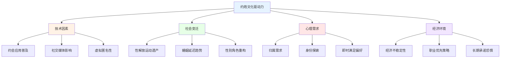
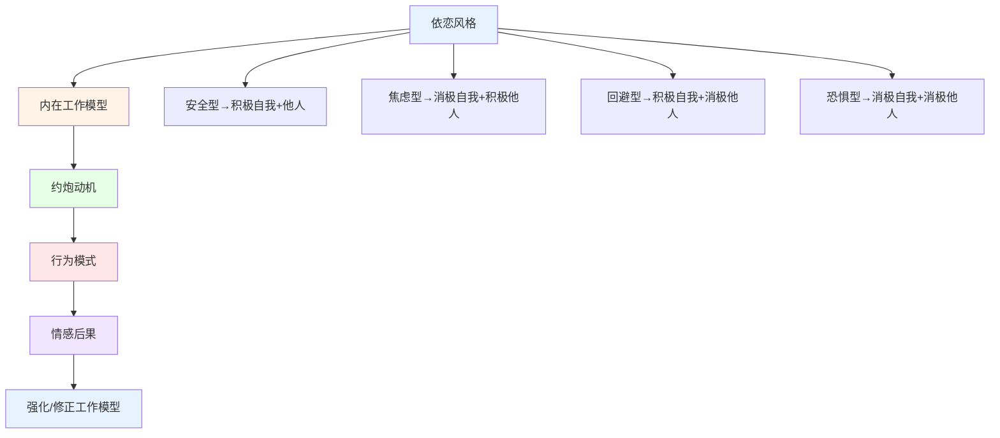
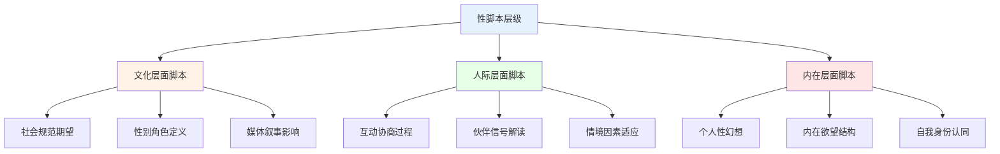

# 约炮心理学深度研究 (Casual Sex Psychology Deep Dive)

## 约炮文化的心理学透视

### 约炮文化(Hookup Culture)的社会心理学分析

#### 约炮文化的定义与演变

**约炮文化的学术界定：**
约炮文化指在当代青年群体中普遍存在的、以随意性行为为特征的社交环境，其中个体在无需承诺或情感投入预期的情况下进行性接触(Garcia et al., 2012)。



**约炮文化的历史演变：**
| 时期 | 文化特征 | 技术支撑 | 社会态度 | 主流模式 |
|------|---------|---------|---------|---------|
| **1960-1980** | 性解放初期 | 避孕药普及 | 逐渐开放 | 自由恋爱实验 |
| **1980-2000** | 保守回潮期 | 互联网萌芽 | 两极分化 | 约会文化主导 |
| **2000-2010** | 数字化起步 | 社交网络兴起 | 接受度提高 | 网络约会萌芽 |
| **2010-2020** | 约炮文化成熟 | 移动约会应用 | 普遍接受 | 应用匹配主导 |
| **2020至今** | 反思与调整 | AI匹配技术 | 批判性审视 | 多元化共存 |

#### 约炮文化的群体差异

**大学生vs非大学生群体的差异：**
| 比较维度 | 大学生群体 | 非大学生青年 | 职场成年人 | 中年群体 |
|---------|-----------|-------------|-----------|---------|
| **参与率** | 60-80% | 40-60% | 25-45% | 10-20% |
| **酒精关联** | 高度关联 | 中度关联 | 低度关联 | 极低关联 |
| **动机类型** | 社交+探索 | 生理+情感 | 情感+陪伴 | 陪伴+生理 |
| **后悔程度** | 中等(女性更高) | 中等 | 较低 | 最低 |
| **后续发展** | 少数发展为关系 | 中等比例发展 | 较高比例发展 | 多数为固定伙伴 |

## 依恋理论视角

### 依恋风格对约炮行为的深刻影响

#### 依恋理论的核心框架

**Bowlby依恋理论在性关系中的应用：**

| 依恋风格 | 约炮行为模式 | 伴侣选择倾向 | 情感体验特征 | 风险模式 | 临床干预重点 |
|---------|-------------|-------------|-------------|---------|-------------|
| **安全型** | 选择性参与、边界清晰 | 偏好真诚交流的伙伴 | 满足感较高、后悔较少 | 低风险 | 巩固健康模式 |
| **焦虑型** | 高频率、情感投入过度 | 偏好高回应性伙伴 | 情感波动大、依赖倾向 | 高风险：情感依赖 | 依恋安全感培养 |
| **回避型** | 偏好无情感连接的接触 | 选择低情感需求的伙伴 | 情感麻木、逃避亲密 | 中风险：情感隔离 | 亲密能力发展 |
| **恐惧型** | 混乱模式、推拉交替 | 不稳定的选择模式 | 矛盾情感、创伤重现 | 极高风险：关系混乱 | 创伤处理+依恋修复 |

#### 依恋风格与约炮动机的交互

**依恋-动机交互模型：**


**依恋风格决定的行为预测：**
- 安全型个体更可能在约炮中保持情感边界并获得积极体验
- 焦虑型个体容易将生理亲密误解为情感承诺
- 回避型个体利用约炮维持情感距离，避免深层亲密
- 恐惧型个体在渴望连接和恐惧亲密之间反复挣扎

### 约炮后的依恋动态

#### "约炮后情感"的心理学机制

**催产素效应与依恋激活：**
| 生理机制 | 作用过程 | 个体差异 | 实际影响 |
|---------|---------|---------|---------|
| **催产素释放** | 性行为中大量释放 | 女性通常释放更多 | 增强情感连接感 |
| **多巴胺奖励** | 性高潮的愉悦强化 | 追求新鲜者更强 | 促进重复行为 |
| **血清素波动** | 类似恋爱初期的变化 | 依恋焦虑者更敏感 | 产生情感依赖 |
| **皮质醇变化** | 压力暂时降低 | 压力大的个体更显著 | 形成压力应对机制 |

## 性脚本理论

### 性脚本(Sexual Scripts)的文化编码

#### 性脚本理论的框架

**Gagnon & Simon性脚本理论：**

性脚本理论认为性行为并非纯粹的本能驱动，而是通过文化脚本(Cultural Scenarios)、人际脚本(Interpersonal Scripts)和内在脚本(Intrapsychic Scripts)三个层面共同塑造的。

**三层脚本结构：**


#### 传统性别脚本的约炮表现

**男性与女性约炮脚本的差异：**
| 脚本维度 | 传统男性脚本 | 传统女性脚本 | 脚本冲突 |
|---------|-------------|-------------|---------|
| **主动性** | 被期待主动追求 | 被期待被动接受 | 期望与现实的差距 |
| **情感投入** | "不用负责" | "可能产生感情" | 情感需求不对称 |
| **社会评价** | "有魅力" | "不检点" | 双重标准持续存在 |
| **性满足** | 被期待总是享受 | 性满足常被忽视 | 性愉悦不平等 |
| **后续行为** | "不用联系" | "期待后续" | 关系预期错位 |

#### 新兴性脚本的发展

**Z世代的约炮脚本重构：**
- 更重视双方同意和明确沟通
- 性别角色期望趋于平等
- 对情感连接和生理满足的双重关注
- 数字化沟通成为脚本的重要组成部分
- 对传统性别脚本的批判性反思

## 知情同意框架

### 约炮中的同意(Consent)理论与实践

#### 知情同意的多层次模型

**同意的连续性光谱：**
| 同意层次 | 定义 | 行为表现 | 法律效力 | 伦理评估 |
|---------|------|---------|---------|---------|
| **明确同意** | 清晰、积极的口头或书面同意 | 主动说"是"、书面确认 | 完全有效 | 最佳实践 |
| **积极同意** | 通过行为和语言积极表达 | 主动参与、热情回应 | 有效 | 推荐标准 |
| **被动默认** | 未拒绝但不主动参与 | 不反抗但不回应 | 争议区域 | 不足够 |
| **沉默同意** | 在沉默中不表示反对 | 不说话也不行动 | 法律灰色地带 | 不可接受 |
| **不同意** | 明确表达或暗示拒绝 | 说"不"、身体后缩 | 完全无效 | 侵犯行为 |

#### 积极同意(Enthusiastic Consent)模型

**积极同意的核心原则：**
```
积极同意框架(Enthusiastic Consent Model)：
□ 同意必须是积极的、明确的(Yes Means Yes)
□ 沉默不等于同意
□ 同意可以在任何时候撤回
□ 酒精和药物影响下的同意无效
□ 同意某一行为不等于同意所有行为
□ 压力下的同意不是真正的同意
□ 同意需要持续确认而非一次性获得
```

#### 数字化约炮中的同意挑战

**线上到线下的同意连续性：**
1. **应用内沟通阶段** - 聊天中的意图表达和边界初步设定
2. **线下见面阶段** - 面对面确认线上的协议和期望
3. **亲密接触阶段** - 每一步推进都需要确认同意
4. **后续联系阶段** - 对未来关系的意愿确认

### 同意教育与实践建议

#### 同意能力的培养

**同意沟通技能训练：**
- 练习直接表达个人意愿和边界
- 学习识别非言语的同意和拒绝信号
- 培养在压力情境下坚持边界的能力
- 发展尊重他人边界的意识
- 掌握在复杂情境中的协商技巧

---

*本文件从约炮文化心理学、依恋理论、性脚本理论和知情同意框架四个维度深入分析约炮行为的心理机制，为理解和实践健康的约炮行为提供理论指导和实践建议。*
