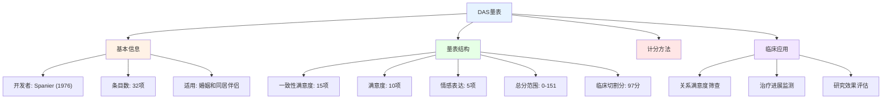
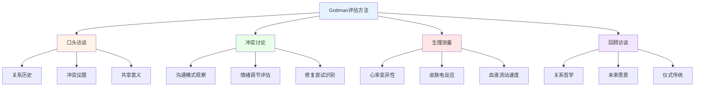
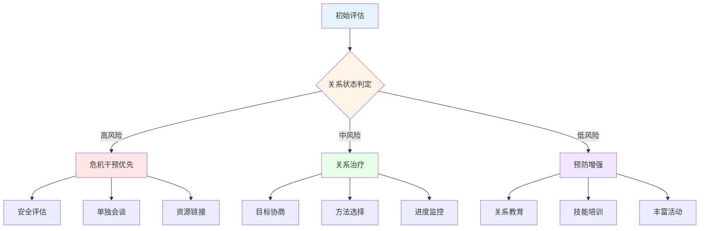

# 关系临床评估与治疗规划 (Relationship Clinical Assessment & Treatment Planning)

## 关系评估工具体系

### 标准化评估量表

#### 二元适应量表(Dyadic Adjustment Scale, DAS)

**DAS量表概述与应用：**


**DAS各维度解析：**
| 维度 | 条目数 | 核心内容 | 典型题目示例 | 信度(Cronbach's α) |
|------|--------|---------|-------------|-------------------|
| **一致性满意度** | 15 | 伴侣在重要议题上的一致程度 | "在处理家庭财务方面" | 0.90 |
| **满意度** | 10 | 对关系的整体满意程度 | "你多久会考虑结束关系" | 0.85 |
| **情感表达** | 5 | 情感交流的频率和质量 | "你是否拥抱你的伴侣" | 0.75 |

**DAS临床切割分的解释：**
| 分数区间 | 关系状态 | 临床建议 | 干预方向 |
|---------|---------|---------|---------|
| **0-70** | 严重困扰 | 紧急干预或考虑分离 | 危机干预、安全评估 |
| **71-85** | 显著不满 | 积极治疗介入 | 关系治疗、沟通训练 |
| **86-96** | 中等困扰 | 预防性干预 | 关系增强、技能培训 |
| **97-110** | 基本满意 | 维持和优化 | 关系教育、丰富活动 |
| **111-151** | 高度满意 | 继续保持 | 预防维护、优势强化 |

#### 体验性沟通量表(Communication Patterns Questionnaire, CPQ)

**CPQ的评估维度：**
| 沟通模式 | 定义 | 评估内容 | 适应证 | 治疗含义 |
|---------|------|---------|--------|---------|
| **建设性沟通** | 积极表达和倾听 | 讨论、表达、理解 | 评估关系优势 | 强化利用 |
| **要求-退缩** | 一方追求一方回避 | 施压与逃避模式 | 关系僵局评估 | 打破循环 |
| **互相回避** | 双方回避讨论问题 | 沉默和话题转移 | 隐性问题评估 | 安全讨论建立 |
| **攻击-防御** | 相互指责和保护 | 责备与辩护模式 | 高冲突关系评估 | 冲突降级训练 |

### Gottman方法评估体系

#### Gottman夫妻评估的"爱情实验室"方法

**Gottman评估的核心要素：**


**Gottman的"末日四骑士"(Four Horsemen)：**
| 四骑士 | 行为表现 | 生理特征 | 预测效度 | 解药(Antidote) |
|--------|---------|---------|---------|---------------|
| **批评(Criticism)** | 攻击对方人格而非行为 | 心率开始升高 | 离婚预测90%+ | 温和启动(Gentle Startup) |
| **蔑视(Contempt)** | 嘲讽、翻白眼、冷嘲热讽 | 免疫系统抑制 | 最强离婚预测因子 | 建立欣赏文化(Culture of Appreciation) |
| **防御(Defensiveness)** | 反击或推卸责任 | 情绪 flooding | 加速关系恶化 | 承担责任(Taking Responsibility) |
| **冷漠(Stonewalling)** | 拒绝互动、情感封闭 | 生理 flooding 极端 | 关系末期征兆 | 自我安抚(Self-Soothing) |

#### Gottman声音关系屋(Sound Relationship House)

**关系健康的七层结构：**
1. **爱情地图(Love Maps)** - 了解伴侣的内心世界、喜好、恐惧
2. **情感银行账户(Emotional Bank Account)** - 积极互动与消极互动5:1比例
3. **转向而非远离(Turn Toward)** - 对伴侣情感需求的积极回应
4. **积极视角(Positive Perspective)** - 对伴侣行为做积极归因
5. **冲突管理(Manage Conflict)** - 有效处理可解决和不可解决的冲突
6. **实现人生梦想(Make Life Dreams Come True)** - 支持伴侣的抱负和目标
7. **创造共享意义(Create Shared Meaning)** - 建立共同的价值观和仪式

## 关系治疗规划

### 治疗计划的系统化设计

#### 评估到干预的转化流程

**临床决策树：**


#### 治疗目标制定原则

**SMART原则在关系治疗中的应用：**
| 原则 | 具体应用 | 示例 | 评估方法 |
|------|---------|------|---------|
| **具体(Specific)** | 明确需要改变的行为 | "每周进行3次15分钟的积极对话" | 行为观察记录 |
| **可测(Measurable)** | 可量化评估的指标 | "DAS得分从85提升到100以上" | DAS量表前后测 |
| **可及(Achievable)** | 在能力范围内的目标 | "掌握非暴力沟通的四步表达法" | 技能演示评估 |
| **相关(Relevant)** | 与核心问题直接相关 | "减少冲突中的批评行为50%" | 四骑士行为频率 |
| **有时限(Time-bound)** | 明确的时间框架 | "8周内完成基础沟通训练模块" | 进度时间表 |

### 循证治疗方法选择

#### 关系治疗主流方法比较

**主要治疗方法的效果量比较：**
| 治疗方法 | 效果量(d) | 核心技术 | 适用人群 | 治疗周期 |
|---------|----------|---------|---------|---------|
| **EFT(情绪聚焦疗法)** | 0.80-1.30 | 情感重新连接、依恋修复 | 情感疏远型伴侣 | 8-20次 |
| **BCT(行为夫妻疗法)** | 0.60-0.90 | 行为交换、沟通训练 | 沟通困难型伴侣 | 15-25次 |
| **IBCT(整合行为夫妻疗法)** | 0.60-0.80 | 接纳改变、灵活应对 | 长期不可调和分歧 | 15-25次 |
| **Gottman方法** | 0.60-0.85 | 四骑士消除、友谊建立 | 多种关系问题 | 12-20次 |
| **Imago疗法** | 0.50-0.70 | 对话技术、镜像反馈 | 沟通阻断型伴侣 | 12-20次 |

#### EFT治疗阶段详解

**情绪聚焦疗法(EFT)的三个阶段九个步骤：**

| 阶段 | 步骤 | 治疗目标 | 关键干预 | 典型对话 |
|------|------|---------|---------|---------|
| **降级阶段** | 步骤1 | 评估关系互动模式 | 追踪循环模式 | "我注意到你们陷入了一个循环..." |
| | 步骤2 | 识别负面互动循环 | 标定问题模式 | "当你退缩时，她更多追求..." |
| | 步骤3 | 接触未表达的依恋情感 | 反映深层情感 | "在愤怒下面是害怕被抛弃" |
| | 步骤4 | 框定问题为循环模式 | 去个人化归因 | "问题不是你们任何一方，而是这个循环" |
| | 步骤5 | 表达被拒绝的依恋需求 | 促进脆弱表达 | "我真正需要的是感到被重视" |
| **重构阶段** | 步骤6 | 促进接纳新表达 | 见证和接纳 | "我听到你说你害怕失去我" |
| | 步骤7 | 促进情感需求和渴望的表达 | 鼓励亲密请求 | "我需要你在意我的感受" |
| **巩固阶段** | 步骤8 | 建立新的互动模式 | 练习新对话 | "当我们这样说话时我感觉更安全" |
| | 步骤9 | 巩固新模式和解决遗留问题 | 回顾与整合 | "我们找到了新的方式在一起" |

### 进度监控与效果评估

#### 治疗进展的量化追踪

**常规疗效监测(ROM)的实施：**
| 监测工具 | 频率 | 测量维度 | 临床意义变化阈值 | 作用 |
|---------|------|---------|----------------|------|
| **OQ-45** | 每次会谈 | 总体心理功能 | 14分以上变化 | 识别恶化和无反应者 |
| **DAS** | 每4次会谈 | 关系满意度 | 10分以上变化 | 追踪关系改善 |
| **ORS** | 每次会谈 | 主观幸福感 | 5分以上变化 | 即时反馈系统 |
| **四骑士频率** | 每2次会谈 | 沟通质量 | 减少50% | 行为改变追踪 |

**信号警报系统(Signal Alarm System)：**
```
绿色信号：按预期改善 → 继续当前治疗计划
黄色信号：改善缓慢或不稳定 → 调整治疗策略或讨论障碍
红色信号：持续恶化或无改善 → 重新评估诊断、改变方法或转介
```

---

*本文件系统介绍了关系临床评估的主流工具和方法，包括DAS量表和Gottman评估体系，并提供了基于循证的治疗规划框架，为临床工作者提供实用的评估-干预指南。*
