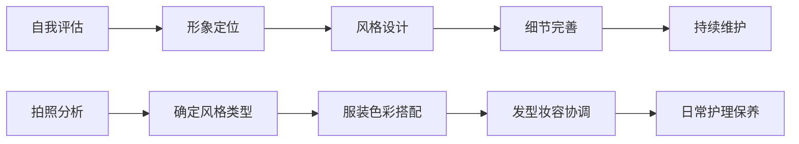
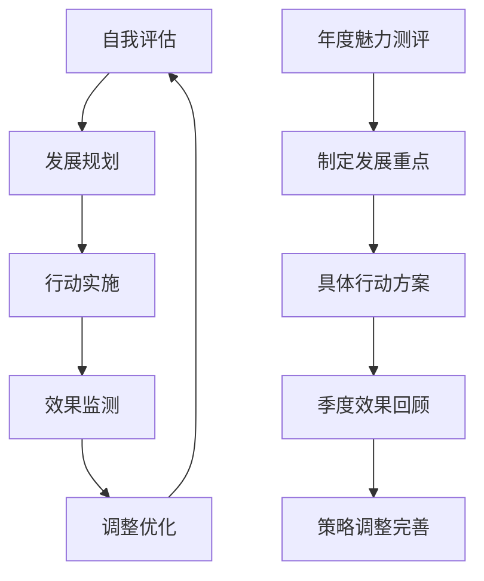

# Attraction Laws & Mate Selection Strategies (吸引力法则与择偶策略)

> 📘 **文档导航**: 本指南深入解析人际吸引的心理机制和择偶策略。相关文档：
> - [约会心理学概览](Dating_Psychology_Overview.md) - 理论基础
> - [约会沟通技巧](Dating_Communication_Skills.md) - 实践应用
> - [关系发展阶段](Dating_Relationship_Stage.md) - 进程管理
> - [约会伦理与法律考量](Dating_Ethics_Legal.md) - 吸引中的道德边界

## 吸引力形成的科学原理 (Scientific Principles of Attraction Formation)

### 生物学基础吸引力机制

| 吸引力维度 | 生物学机制 | 进化意义 | 现代表现 | 优化策略 |
| :--- | :--- | :--- | :--- | :--- |
| **外貌吸引力** | 对称性、平均化、健康指标 | 基因质量信号、繁殖适应性 | 面部对称度、身材比例、皮肤状态 | 保持健康生活方式、适度形象管理 |
| **气味化学** | 信息素、免疫系统兼容性 | 基因多样性优化、后代健康 | 体味偏好、香水选择 | 注意个人卫生、选择适合香型 |
| **声音特质** | 音调、节奏、共振频率 | 健康状态、性激素水平 | 声音磁性、语调变化、表达力 | 声乐训练、情绪表达练习 |
| **动作协调** | 身体协调性、运动能力 | 基因健康、生存适应力 | 步态优雅、手势自然、反应敏捷 | 规律运动、舞蹈训练、姿态矫正 |

### 心理学吸引力因素

| 心理因素 | 理论基础 | 作用机制 | 影响强度 | 培养方法 |
| :--- | :--- | :--- | :--- | :--- |
| **熟悉度** | 曝光效应(Mere Exposure Effect) | 重复接触增加好感 | 中等 | 主动参与社交活动、保持适度联系 |
| **相似性** | 相似性吸引理论 | 认知和谐、价值观匹配 | 强 | 发展多元兴趣、明确个人价值观 |
| **互补性** | 互补需求理论 | 功能性匹配、成长支持 | 中等 | 识别自身短板、寻找优势互补 |
| **稀缺性** | 稀缺原理 | 物以稀为贵的心理机制 | 中等 | 保持神秘感、避免过度暴露 |
| **光环效应** | 整体印象投射 | 优秀品质的扩散影响 | 强 | 全面发展、突出核心优势 |

## 个人魅力提升系统 (Personal Charisma Enhancement System)

### 魅力构成要素分析

| 魅力维度 | 核心要素 | 表现形式 | 发展路径 | 测评指标 |
| :--- | :--- | :--- | :--- | :--- |
| **外在魅力** | 形象管理、气质修养 | 着装品味、举止优雅、自信神态 | 形象设计、礼仪训练、气质培养 | 外在吸引力评分、第一印象调研 |
| **内在魅力** | 知识素养、人格品质 | 深度思考、真诚待人、独特见解 | 持续学习、品格修炼、独立思考 | 人格魅力测评、深度交流反馈 |
| **情感能力** | 共情理解、情绪管理 | 情感细腻、稳定可靠、支持性回应 | 情商训练、心理成长、关系实践 | 情感智慧评估、关系满意度调查 |
| **社交技能** | 沟通表达、人际网络 | 话题引导、人脉建设、影响力扩展 | 社交练习、网络拓展、领导力发展 | 社交影响力指数、人脉质量评估 |

### 魅力提升行动计划

#### 外在形象优化

#### 内在修养发展
| 修养领域 | 核心内容 | 学习资源 | 实践方法 | 效果评估 |
| :--- | :--- | :--- | :--- | :--- |
| **知识储备** | 人文社科、科技前沿、文化艺术 | 经典阅读、在线课程、专业讲座 | 定期学习、深度思考、分享交流 | 知识广度测试、思维深度评估 |
| **品格塑造** | 诚信正直、宽容包容、坚韧勇敢 | 道德经典、榜样学习、自我反思 | 日常践行、品格记录、他人反馈 | 品格成熟度测评、道德判断测试 |
| **审美情趣** | 艺术鉴赏、生活品味、创新思维 | 美术展览、音乐会、设计作品 | 主动体验、审美训练、创意实践 | 审美能力测试、创造力评估 |

## 择偶策略与匹配理论 (Mate Selection Strategies & Matching Theory)

### 进化心理学择偶偏好

| 性别差异 | 偏好维度 | 具体表现 | 进化解释 | 现代表达 |
| :--- | :--- | :--- | :--- | :--- |
| **男性偏好** | 年轻貌美、忠贞可靠 | 注重外貌、生育能力指标 | 繁殖投资最大化 | 健康活力、家庭责任感 |
| **女性偏好** | 资源地位、稳定可靠 | 注重经济实力、社会地位 | 后代养育保障 | 事业成就、责任心 |
| **共同偏好** | 善良诚实、智力相当 | 人品善良、智商匹配 | 长期合作基础 | 道德品格、沟通能力 |

### 现代理性择偶框架

#### 择偶标准权重分配
| 标准类别 | 具体指标 | 权重分配 | 评估方法 | 调整原则 |
| :--- | :--- | :--- | :--- | :--- |
| **核心价值观** | 人生目标、道德标准、宗教信仰 | 30% | 深度访谈、价值观问卷 | 基本底线，不易妥协 |
| **生活方式** | 居住偏好、消费观念、社交圈子 | 25% | 生活观察、情景模拟 | 可以适应，需要磨合 |
| **性格兼容性** | 情绪模式、沟通风格、冲突处理 | 20% | 性格测试、互动观察 | 互补优于相似 |
| **外在条件** | 外貌体型、经济状况、教育背景 | 15% | 客观评估、综合考量 | 适度要求，避免过度 |
| **发展潜力** | 成长空间、学习能力、适应性 | 10% | 能力测试、成长轨迹分析 | 重视潜能胜过现状 |

#### 匹配度评估矩阵
| 评估维度 | 高匹配 | 中等匹配 | 低匹配 | 改善建议 |
| :--- | :--- | :--- | :--- | :--- |
| **价值观契合度** | ≥85分 | 60-84分 | <60分 | 深度沟通、寻求共同点 |
| **生活习惯兼容性** | ≥80分 | 55-79分 | <55分 | 妥协调整、建立新习惯 |
| **沟通效率** | ≥75分 | 50-74分 | <50分 | 沟通训练、增进理解 |
| **冲突解决能力** | ≥70分 | 45-69分 | <45分 | 学习技巧、寻求帮助 |
| **情感连接深度** | ≥80分 | 55-79分 | <55分 | 增加相处时间、深度交流 |

## 数字化时代的匹配算法 (Matching Algorithms in Digital Age)

### 在线约会平台匹配机制

| 平台类型 | 匹配算法 | 核心特征 | 优劣势分析 | 使用建议 |
| :--- | :--- | :--- | :--- | :--- |
| **传统交友软件** | 基于地理位置和基本信息筛选 | 简单直观、用户基数大 | 优势：覆盖面广；劣势：匹配精度低 | 适合扩大社交圈、初步筛选 |
| **算法推荐平台** | 机器学习个性化推荐 | 精准匹配、智能学习 | 优势：匹配度高；劣势：可能存在偏见 | 适合认真寻找长期关系 |
| **兴趣社群平台** | 基于共同兴趣爱好聚合 | 兴趣导向、话题自然 | 优势：共同话题多；劣势：范围相对局限 | 适合寻找志同道合的伴侣 |
| **专业匹配平台** | 综合评估+人工审核 | 高质量用户、严格筛选 | 优势：用户质量高；劣势：费用较高 | 适合有一定经济基础的用户 |

### 算法优化策略

#### 个人资料优化
| 资料要素 | 优化要点 | 具体建议 | 注意事项 |
| :--- | :--- | :--- | :--- |
| **头像选择** | 清晰真实、展现最佳状态 | 多角度照片、自然光线、专业拍摄 | 避免过度修饰或虚假信息 |
| **个人简介** | 突出个性、体现价值 | 真实经历、独特见解、幽默元素 | 避免陈词滥调或过于自夸 |
| **兴趣标签** | 准确全面、体现深度 | 真实爱好、专业技能、生活态度 | 避免跟风填写热门标签 |
| **择偶标准** | 合理明确、不过于苛刻 | 重点关注核心需求、适当灵活性 | 避免标准过多或过于理想化 |

#### 互动策略优化
| 互动阶段 | 策略要点 | 具体方法 | 效果预期 |
| :--- | :--- | :--- | :--- |
| **初始接触** | 引起兴趣、展现诚意 | 个性化开场白、真诚赞美、共同话题 | 提高回复率和进一步交流意愿 |
| **深度了解** | 展现真实、建立连接 | 分享个人故事、表达真实想法、积极回应 | 增进相互了解和情感连接 |
| **关系推进** | 明确意图、创造机会 | 表达好感、提议见面、规划未来 | 推动关系向更深层次发展 |

## 文化差异与多元择偶 (Cultural Differences & Multicultural Dating)

### 跨文化吸引力特征

| 文化背景 | 吸引特点 | 择偶偏好 | 沟通风格 | 适应建议 |
| :--- | :--- | :--- | :--- | :--- |
| **东亚文化** | 含蓄内敛、重视家庭 | 稳定可靠、家庭责任感 | 间接表达、重视面子 | 学习文化礼仪、展现尊重理解 |
| **欧美文化** | 直接开放、个人主义 | 独立自主、共同成长 | 直接表达、平等对话 | 适应直接沟通、保持个人空间 |
| **南亚文化** | 传统保守、家族观念 | 门当户对、文化传承 | 委婉表达、家庭参与 | 了解传统习俗、展现包容态度 |
| **中东文化** | 宗教虔诚、性别分工 | 宗教认同、经济保障 | 尊重传统、适度保守 | 学习宗教知识、展现虔诚态度 |

### 跨文化关系挑战与应对

#### 常见挑战类型
| 挑战维度 | 具体表现 | 根本原因 | 解决策略 |
| :--- | :--- | :--- | :--- |
| **价值观冲突** | 生活方式、道德标准差异 | 文化背景不同导致的认知差异 | 开放沟通、寻找共同点、相互尊重 |
| **沟通障碍** | 表达方式、理解习惯不同 | 语言文化差异、思维方式不同 | 学习对方表达方式、耐心解释、避免误解 |
| **家庭压力** | 双方家庭不接受、文化冲突 | 传统观念与现代选择的矛盾 | 循序渐进、争取理解、建立支持网络 |
| **身份认同** | 文化归属感、身份混淆 | 多元文化背景的身份整合 | 接纳多元身份、建立新的文化认同 |

#### 成功要素分析
| 成功要素 | 核心内涵 | 培养方法 | 评估标准 |
| :--- | :--- | :--- | :--- |
| **文化敏感性** | 理解尊重不同文化背景 | 文化学习、实地体验、开放心态 | 能够准确识别文化差异并妥善处理 |
| **沟通适应性** | 灵活调整沟通方式 | 多元沟通训练、情境适应练习 | 在不同文化背景下都能有效沟通 |
| **情感韧性** | 面对挑战的坚持能力 | 心理建设、支持网络、成长思维 | 能够克服文化差异带来的困难 |
| **创新融合** | 创造新的关系模式 | 创意思维、实践探索、共同建设 | 建立独特的跨文化关系模式 |

## 吸引力维护与长期发展 (Attraction Maintenance & Long-term Development)

### 关系吸引力衰退预防

#### 衰退预警信号
| 信号类型 | 具体表现 | 衰退程度 | 应对措施 |
| :--- | :--- | :--- | :--- |
| **情感疏离** | 缺乏关心、减少交流、情感冷漠 | 轻度 | 增加互动、表达关爱、创造惊喜 |
| **新鲜感缺失** | 例行公事、缺乏激情、话题枯竭 | 中度 | 尝试新活动、改变日常模式、重温美好回忆 |
| **价值偏离** | 目标不同、价值观冲突、发展方向分歧 | 重度 | 深度沟通、重新评估匹配度、寻求专业帮助 |

#### 预防性维护策略
| 维护维度 | 具体措施 | 实施频率 | 效果评估 |
| :--- | :--- | :--- | :--- |
| **情感连接** | 深度对话、情感表达、共情理解 | 每周至少一次 | 情感满意度调查、亲密感评估 |
| **共同成长** | 学习新技能、共同目标、相互支持 | 每月制定计划 | 成长同步性评估、目标达成度 |
| **激情保鲜** | 创意约会、身体亲密、惊喜元素 | 定期安排 | 激情水平测评、新鲜感指数 |
| **独立空间** | 个人发展、朋友交往、独处时间 | 每周保证 | 独立性评估、关系满意度 |

### 个人持续发展计划

#### 魅力维持系统

#### 成长轨迹追踪
| 发展阶段 | 时间周期 | 重点目标 | 关键行动 | 成功指标 |
| :--- | :--- | :--- | :--- | :--- |
| **巩固期** | 1-2年 | 稳定现有魅力水平 | 保持良好习惯、适度提升 | 魅力水平维持在较高水准 |
| **提升期** | 2-5年 | 发展新的魅力维度 | 学习新技能、拓展兴趣领域 | 魅力构成更加多元化 |
| **精进期** | 5年以上 | 达到魅力巅峰状态 | 深度修养、独特个性形成 | 成为具有独特魅力的个体 |

---
*📚 本文档融合进化心理学、社会学、行为科学等多学科研究成果，为现代择偶提供科学指导。*
