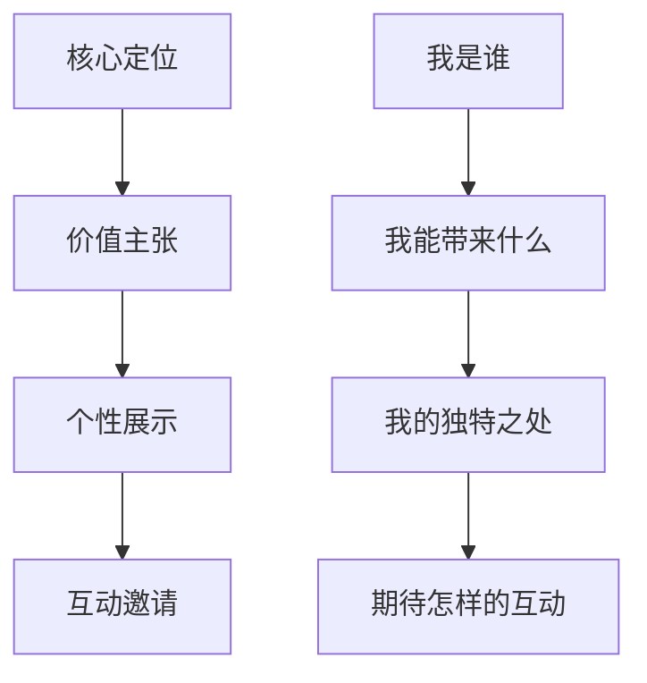

# Digital Age Dating & Online Relationship Dynamics (数字时代约会与在线关系动力学)

> 📘 **文档导航**: 本指南解析数字化时代约会的特点、挑战和最佳实践。相关文档：
> - [约会心理学概览](Dating_Psychology_Overview.md) - 理论基础
> - [约会沟通技巧](Dating_Communication_Skills.md) - 沟通应用
> - [吸引力法则与择偶](Dating_Attraction_Selection.md) - 匹配策略

## 数字化约会生态系统分析 (Digital Dating Ecosystem Analysis)

### 平台类型与特征矩阵

| 平台类别 | 主要功能 | 用户特征 | 匹配机制 | 优劣势分析 |
| :--- | :--- | :--- | :--- | :--- |
| **传统交友软件** | 基础匹配、地理位置筛选 | 年轻用户为主、寻求广泛选择 | 距离优先、基本信息匹配 | 优势：用户基数大、操作简单；劣势：匹配质量参差不齐 |
| **算法推荐平台** | 智能匹配、个性推荐 | 注重长期关系用户 | 机器学习算法、多维度匹配 | 优势：匹配精准度高；劣势：可能存在算法偏见 |
| **兴趣社群平台** | 基于共同兴趣聚合 | 有明确兴趣爱好的用户 | 兴趣标签匹配、社群互动 | 优势：天然话题基础、质量相对较高；劣势：用户群体相对局限 |
| **专业匹配平台** | 人工审核、高端匹配 | 有一定经济基础、追求质量的用户 | 专业评估+算法匹配 | 优势：用户质量高、匹配成功率高；劣势：费用昂贵、门槛较高 |
| **短视频社交** | 短视频展示、快速互动 | 年轻用户、注重表现力 | 内容吸引力、算法推送 | 优势：展示形式生动、传播力强；劣势：深度了解有限 |

### 数字化约会行为模式

#### 用户行为分析
| 行为类型 | 具体表现 | 心理动机 | 影响因素 | 优化建议 |
| :--- | :--- | :--- | :--- | :--- |
| **浏览行为** | 快速滑动、图像优先选择 | 寻求视觉刺激、节省时间 | 照片质量、第一印象 | 优化视觉呈现、突出个人特色 |
| **互动行为** | 点赞评论、私信交流 | 寻求连接、表达兴趣 | 内容质量、互动及时性 | 提升内容吸引力、及时回应 |
| **筛选行为** | 设置过滤条件、精准搜索 | 提高效率、减少无效接触 | 明确标准、合理期望 | 设定合理筛选标准、保持开放心态 |
| **维持行为** | 定期更新、积极参与 | 保持活跃、增加曝光 | 平台算法、社区氛围 | 规律性参与、适应平台特性 |

## 在线个人品牌建设 (Online Personal Branding)

### 数字形象塑造策略

#### 头像优化系统
| 头像类型 | 适用场景 | 设计要点 | 注意事项 | 效果预期 |
| :--- | :--- | :--- | :--- | :--- |
| **专业照** | 职场社交、严肃关系 | 正面清晰、着装得体 | 避免过度正式或随意 | 提升可信度和专业感 |
| **生活照** | 日常交友、轻松关系 | 自然状态、展现个性 | 避免过度修饰或虚假 | 增加亲和力和真实感 |
| **兴趣照** | 兴趣匹配、共同话题 | 体现爱好、展示特长 | 确保与个人实际情况一致 | 增强话题性和匹配度 |
| **创意照** | 个性展示、吸引注意 | 独特创意、视觉冲击 | 避免过于奇特或不当 | 提高记忆点和吸引力 |

#### 个人简介撰写艺术

#### 简介优化要素
| 要素维度 | 优化要点 | 具体建议 | 避免事项 | 效果评估 |
| :--- | :--- | :--- | :--- | :--- |
| **真实性** | 展现真实自我 | 诚实描述、避免夸大 | 虚假信息、过度包装 | 建立信任基础 |
| **吸引力** | 突出个人亮点 | 强调独特价值、有趣经历 | 平淡无奇、千篇一律 | 提高被关注度 |
| **相关性** | 与目标匹配 | 体现寻偶标准、共同兴趣 | 无关信息、模糊表述 | 提升匹配精准度 |
| **互动性** | 引导进一步交流 | 设置开放话题、邀请互动 | 封闭式表述、缺乏引导 | 促进深入交流 |

### 内容营销策略

#### 社交媒体内容规划
| 内容类型 | 发布频率 | 内容特点 | 目标效果 | 优化要点 |
| :--- | :--- | :--- | :--- | :--- |
| **生活分享** | 每周3-5次 | 日常生活、真实状态 | 展现生活态度、增加亲近感 | 保持自然、避免过度展示 |
| **兴趣展示** | 每周2-3次 | 爱好特长、专业技能 | 体现个人价值、吸引同类人群 | 突出特色、展现深度 |
| **观点表达** | 每周1-2次 | 思考感悟、价值观念 | 展示思维深度、寻找精神共鸣 | 真诚表达、避免争议 |
| **互动内容** | 每周2-4次 | 问答投票、话题讨论 | 增加互动机会、了解受众 | 关注反馈、及时回应 |

## 数字化沟通技巧 (Digital Communication Skills)

### 文本沟通艺术

#### 消息类型与策略
| 消息类型 | 最佳时机 | 内容结构 | 回复期待 | 效果优化 |
| :--- | :--- | :--- | :--- | :--- |
| **破冰消息** | 对方活跃时段 | 个性化开场+共同话题 | 2-4小时内 | 真诚具体、避免套路 |
| **跟进消息** | 约会后当天 | 感谢表达+积极反馈 | 2-6小时内 | 真诚感谢、具体赞美 |
| **日常问候** | 工作间隙、休闲时间 | 简短关心+具体内容 | 灵活响应 | 自然亲切、避免打扰 |
| **深入交流** | 双方都有时间 | 分享经历+开放问题 | 当天或次日 | 真诚分享、引导对话 |

#### 沟通技巧要点
| 技巧维度 | 具体方法 | 注意事项 | 效果评估 | 练习建议 |
| :--- | :--- | :--- | :--- | :--- |
| **时机把握** | 观察对方活跃时间、避免打扰 | 不要在深夜或工作时间发送 | 回复及时性和质量 | 记录对方习惯、建立时间档案 |
| **内容质量** | 个性化定制、避免模板化 | 真诚表达、具体细节 | 对话深度和持续性 | 练习观察、积累话题素材 |
| **情感表达** | 适度情感投入、避免过度 | 真实感受、循序渐进 | 情感连接建立 | 情感词汇练习、自我觉察 |
| **互动平衡** | 保持对话流畅、避免单向 | 积极倾听、适时回应 | 双向交流质量 | 角色扮演练习、反馈收集 |

### 视频通话优化

#### 技术准备清单
| 准备项目 | 具体要求 | 注意事项 | 效果提升 | 备选方案 |
| :--- | :--- | :--- | :--- | :--- |
| **设备设置** | 摄像头位置、麦克风质量 | 确保画面清晰、声音清楚 | 提升沟通体验 | 准备备用设备 |
| **环境布置** | 光线充足、背景整洁 | 选择安静、私密空间 | 营造良好氛围 | 提前布置环境 |
| **形象管理** | 着装得体、仪容整洁 | 保持良好的精神状态 | 增强第一印象 | 准备合适服装 |
| **技术测试** | 网络稳定、软件熟悉 | 提前测试各项功能 | 避免技术故障 | 准备技术支持 |

#### 互动技巧提升
| 互动要素 | 优化策略 | 实施要点 | 效果监测 | 持续改进 |
| :--- | :--- | :--- | :--- | :--- |
| **眼神交流** | 直视摄像头而非屏幕 | 练习自然的眼神接触 | 观察对方反应 | 录像自我观察 |
| **肢体语言** | 自然的手势、适度的动作 | 避免过度或僵硬的动作 | 增强表达力 | 镜子练习 |
| **声音控制** | 语调变化、语速适中 | 保持清晰温暖的声音 | 提升亲和力 | 声乐练习 |
| **话题引导** | 准备有趣话题、适时转换 | 避免尴尬沉默 | 维持对话流畅 | 话题库建设 |

## 虚拟关系发展管理 (Virtual Relationship Development Management)

### 线上到线下的过渡策略

#### 发展阶段管理
| 阶段特点 | 核心任务 | 关键行动 | 风险控制 | 成功指标 |
| :--- | :--- | :--- | :--- | :--- |
| **线上建立期** | 建立基本了解和好感 | 频繁文字交流、视频通话 | 避免过度理想化 | 对方表现出持续兴趣 |
| **深度了解期** | 探索价值观和兼容性 | 分享个人故事、讨论重要话题 | 保持真实性、避免隐瞒 | 建立深层情感连接 |
| **见面准备期** | 为实际接触做准备 | 讨论见面计划、建立期待 | 管理期望、确保安全 | 双方都期待实际见面 |
| **线下过渡期** | 将虚拟关系转化为现实 | 安排首次见面、逐步增加接触 | 循序渐进、保持沟通 | 线下互动质量良好 |

#### 安全风险管理
| 风险类型 | 识别信号 | 预防措施 | 应急预案 | 专业建议 |
| :--- | :--- | :--- | :--- | :--- |
| **身份欺诈** | 信息不一致、拒绝视频 | 核实身份、多方验证 | 立即停止接触 | 使用官方验证工具 |
| **情感操控** | 过快推进、情感勒索 | 保持理性、设定边界 | 寻求支持、专业帮助 | 咨询心理专家 |
| **隐私泄露** | 过度分享、不当要求 | 保护个人信息、谨慎分享 | 立即停止、更改设置 | 学习网络安全知识 |
| **见面风险** | 强烈要求、拒绝公共场所 | 坚持公共场所、告知他人 | 紧急联系、安全离开 | 遵循安全约会原则 |

### 长期虚拟关系维护

#### 关系保鲜策略
| 维护维度 | 具体措施 | 实施要点 | 效果评估 | 优化调整 |
| :--- | :--- | :--- | :--- | :--- |
| **情感连接** | 定期深度交流、情感表达 | 真诚分享、共情理解 | 情感满意度调查 | 根据反馈调整频率 |
| **共同体验** | 虚拟活动、同步参与 | 一起看电影、玩游戏 | 共同话题丰富度 | 尝试新的互动形式 |
| **未来规划** | 讨论线下计划、共同目标 | 制定见面时间表、未来愿景 | 期待感和确定性 | 定期更新计划 |
| **独立空间** | 保持个人发展、朋友交往 | 维持原有生活节奏 | 关系健康度评估 | 平衡关系与个人发展 |

## 数字化时代特殊挑战 (Digital Age Special Challenges)

### 屏幕疲劳与注意力分散

#### 疲劳识别与管理
| 疲劳类型 | 表现特征 | 根本原因 | 管理策略 | 预防措施 |
| :--- | :--- | :--- | :--- | :--- |
| **视觉疲劳** | 眼部不适、注意力下降 | 长时间屏幕使用 | 定期休息、眼部保健 | 控制使用时间、改善环境 |
| **心理疲劳** | 兴趣减退、选择困难 | 信息过载、决策疲劳 | 简化选择、专注质量 | 减少平台数量、提高筛选标准 |
| **社交疲劳** | 交流意愿下降、情感麻木 | 虚拟互动缺乏深度 | 增加线下接触、深度交流 | 平衡线上线下时间 |
| **比较疲劳** | 自我怀疑、不满现状 | 社交媒体比较文化 | 培养自我接纳、关注内在 | 限制社交媒体使用 |

### 算法偏见与信息茧房

#### 偏见识别与突破
| 偏见类型 | 表现形式 | 影响后果 | 突破策略 | 长期对策 |
| :--- | :--- | :--- | :--- | :--- |
| **审美偏见** | 过度关注外貌、忽视内在 | 错失优质匹配 | 主动拓宽标准、重视深度交流 | 培养全面评估能力 |
| **群体偏见** | 局限于特定群体、缺乏多样性 | 选择范围狭窄 | 主动探索不同群体、参与多元活动 | 扩大社交圈层 |
| **行为偏见** | 习惯性滑动、缺乏深度 | 错过真正合适的人 | 放慢节奏、认真了解 | 建立筛选机制 |
| **算法偏见** | 推荐固化、缺乏新鲜感 | 陷入信息茧房 | 主动搜索、多元化探索 | 定期调整偏好设置 |

## 未来发展趋势前瞻 (Future Development Trends)

### 技术革新影响

#### 新兴技术应用前景
| 技术类型 | 应用场景 | 潜在影响 | 发展阶段 | 准备建议 |
| :--- | :--- | :--- | :--- | :--- |
| **虚拟现实** | 沉浸式约会体验 | 增强真实感、扩大选择范围 | 概念验证期 | 了解技术发展、保持开放心态 |
| **人工智能** | 智能匹配优化、情感分析 | 提高匹配精准度、个性化服务 | 商业化初期 | 学习AI基础知识、关注行业动态 |
| **生物识别** | 身份验证、健康匹配 | 提高安全性、优化匹配质量 | 研究探索期 | 关注隐私保护、了解技术原理 |
| **区块链** | 身份认证、数据安全 | 增强信任、保护隐私 | 概念发展阶段 | 了解技术特点、评估应用价值 |

### 社会文化变迁

#### 价值观念演进
| 变迁趋势 | 具体表现 | 影响分析 | 适应策略 | 长远思考 |
| :--- | :--- | :--- | :--- | :--- |
| **关系多元化** | 非传统关系形式增加 | 拓宽选择范围、挑战传统观念 | 保持开放包容、明确个人需求 | 思考理想关系模式 |
| **个体化增强** | 个人发展优先于关系 | 强调独立性、追求自我实现 | 平衡个人与关系发展 | 探索独立与连接的平衡 |
| **数字化深度融合** | 线上线下界限模糊 | 改变交往方式、创造新可能 | 适应技术变化、保持人际温度 | 思考技术与人性的平衡 |
| **全球化加速** | 跨文化交往常态化 | 增加多样性、面临文化挑战 | 学习文化敏感性、发展跨文化能力 | 培养全球视野和包容心态 |

## 数字素养提升计划 (Digital Literacy Enhancement Plan)

### 核心能力建设

#### 数字沟通能力
| 能力维度 | 培养目标 | 学习路径 | 实践方法 | 评估标准 |
| :--- | :--- | :--- | :--- | :--- |
| **信息甄别** | 准确识别信息真伪 | 学习媒体素养、批判性思维 | 实际案例分析、专家指导 | 信息判断准确率提升 |
| **隐私保护** | 有效保护个人信息 | 学习网络安全知识、隐私设置 | 实际操作练习、定期检查 | 隐私泄露风险降低 |
| **数字礼仪** | 得体的线上交往方式 | 学习网络礼仪、文化差异 | 情景模拟练习、反馈收集 | 线上交往质量改善 |
| **技术适应** | 快速掌握新平台功能 | 持续学习、实践应用 | 新平台试用、功能探索 | 技术适应速度提升 |

#### 情感智慧发展
| 发展领域 | 重点内容 | 培养方法 | 实践机会 | 成长指标 |
| :--- | :--- | :--- | :--- | :--- |
| **虚拟情感识别** | 识别线上情感信号 | 学习非语言沟通、情感表达 | 实际交流练习、录像分析 | 情感识别准确度提升 |
| **数字边界管理** | 设定和维护线上边界 | 学习边界理论、实践应用 | 真实情境练习、反思总结 | 边界清晰度和执行力增强 |
| **远程关系维护** | 维持异地情感连接 | 学习远程沟通技巧、情感表达 | 长距离关系实践、经验分享 | 关系满意度和稳定性提升 |
| **技术与人性平衡** | 保持人际温度和技术效率 | 培养人文关怀、技术审慎使用 | 多样化交往实践、深度反思 | 实现技术赋能而非替代人际连接 |

---
*📚 本文档结合数字技术发展、社会心理学和关系科学，为数字时代的健康约会提供前瞻性指导。*
