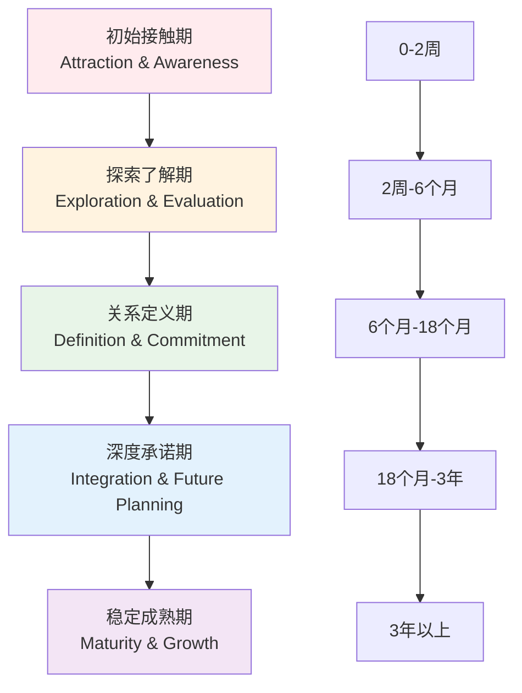
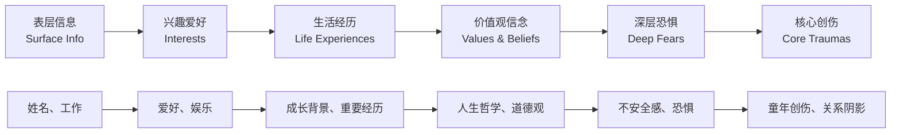

# Dating Relationship Development Stages (约会关系发展阶段)

> 📘 **文档导航**: 本指南详细解析约会关系从初识到长期承诺的各个发展阶段。相关文档：
> - [约会心理学概览](Dating_Psychology_Overview.md) - 理论基础
> - [约会沟通技巧](Dating_Communication_Skills.md) - 阶段性沟通策略
> - [吸引力法则与择偶](Dating_Attraction_Selection.md) - 匹配与发展

## 关系发展阶段全景图 (Relationship Development Panorama)

### 核心发展轨迹模型

## 第一阶段：初始接触期 (Initial Contact Stage: 0-2周)

### 阶段特征与心理体验

| 特征维度 | 具体表现 | 心理机制 | 行为模式 | 发展任务 |
| :--- | :--- | :--- | :--- | :--- |
| **认知特征** | 理想化倾向、选择性注意 | 首因效应、光环效应 | 寻找共同点、放大优点 | 建立初步好感和兴趣 |
| **情感体验** | 兴奋好奇、轻微焦虑 | 多巴胺分泌、肾上腺素升高 | 主动接触、试探反应 | 管理期待、保持现实感 |
| **行为表现** | 谨慎试探、礼貌互动 | 社交礼仪、印象管理 | 控制接触频率、观察反馈 | 展现真实自我但保持神秘感 |
| **关系状态** | 不确定性高、可能性多样 | 开放系统、多种选择 | 保持其他选择、避免过早投入 | 评估匹配度和潜在发展 |

### 关键发展指标

| 指标类别 | 评估标准 | 成功标志 | 风险信号 | 优化建议 |
| :--- | :--- | :--- | :--- | :--- |
| **相互兴趣度** | 双方主动联系频率和质量 | 积极回应、主动发起 | 单方面热情、回应敷衍 | 保持适度主动性，观察对方投入度 |
| **沟通质量** | 对话深度、话题广度、理解程度 | 深度交流、共鸣体验 | 表面寒暄、话题枯竭 | 准备多样化话题，展现真诚兴趣 |
| **化学反应** | 身体语言、情感连接、默契程度 | 自然亲近、舒适感强 | 紧张拘谨、明显隔阂 | 放松心态，注重自然互动 |
| **价值观初探** | 基本观念、生活态度、兴趣匹配 | 观念相近、兴趣重叠 | 重大分歧、缺乏共同点 | 开诚布公讨论重要话题 |

## 第二阶段：探索了解期 (Exploration Stage: 2周-6个月)

### 阶段核心任务

#### 自我披露渐进模型

### 关系深化策略

| 深化维度 | 具体策略 | 实施要点 | 注意事项 | 成功标准 |
| :--- | :--- | :--- | :--- | :--- |
| **信任建立** | 一致性行为、透明沟通 | 言行一致、履行承诺 | 避免过度承诺或隐瞒 | 对方表现出信赖和安全感 |
| **兼容性测试** | 多场景互动、压力测试 | 共同面对挑战、观察反应 | 避免故意制造困难 | 在不同情况下都能和谐相处 |
| **边界探索** | 渐进式接触、尊重反馈 | 试探舒适区、接受拒绝 | 不强迫突破、不忽视信号 | 明确双方的接受范围和底线 |
| **未来展望** | 讨论期望、规划可能 | 分享愿景、探讨兼容性 | 避免过早锁定或完全回避 | 对未来有一致的方向感 |

### 常见挑战与应对

| 挑战类型 | 典型表现 | 根本原因 | 解决策略 | 预防措施 |
| :--- | :--- | :--- | :--- | :--- |
| **理想化破灭** | 发现缺点后的失望感 | 初期过度美化、期望过高 | 接受不完美、重新评估 | 保持现实期待、全面了解 |
| **节奏不同步** | 一方急于推进另一方犹豫 | 依恋风格差异、准备度不同 | 沟通期望、寻找平衡点 | 提前讨论关系节奏偏好 |
| **外部干扰** | 家庭朋友意见、工作压力 | 系统性影响、注意力分散 | 建立支持网络、设定优先级 | 明确关系重要性、管理外界影响 |
| **沟通障碍** | 误解频发、表达困难 | 理解差异、表达方式不同 | 学习沟通技巧、增加耐心 | 建立有效沟通模式、定期check-in |

## 第三阶段：关系定义期 (Definition Stage: 6个月-18个月)

### 关键转折点管理

#### 关系定义对话框架

| 对话要素 | 内容要点 | 表达方式 | 时机选择 | 风险管控 |
| :--- | :--- | :--- | :--- | :--- |
| **现状确认** | 明确当前关系状态 | "我们现在算是..." | 关系稳定、双方舒适时 | 避免在冲突后或压力大时 |
| **未来期望** | 分享个人关系愿景 | "我希望我们能..." | 轻松愉快的私密环境 | 给对方思考和回应时间 |
| **兼容性评估** | 讨论重大议题匹配度 | "关于...你怎么看" | 逐步深入重要话题 | 避免一次性抛出所有问题 |
| **承诺讨论** | 探讨排他性和长期意向 | "你愿意...吗？" | 双方都有明确感觉时 | 尊重对方节奏，不施加压力 |

### 排他性建立过程

| 建立步骤 | 具体行动 | 沟通要点 | 时间节点 | 成功指标 |
| :--- | :--- | :--- | :--- | :--- |
| **意向表达** | 明确传达专一意愿 | "我想只和你约会" | 感情稳定、双方有好感时 | 对方感受到被珍视 |
| **边界设定** | 明确关系边界和规则 | "我们约定..." | 共同讨论制定规则 | 双方对边界有共识 |
| **社交公开** | 介绍给朋友家人 | "这是我的男朋友/女朋友" | 关系稳定、双方同意时 | 获得社交圈认可 |
| **未来规划** | 制定短期共同计划 | "下个月我们一起..." | 有明确发展方向时 | 有具体的共同期待 |

## 第四阶段：深度承诺期 (Deep Commitment Stage: 18个月-3年)

### 深度整合挑战

#### 生活融合维度分析

| 融合领域 | 具体表现 | 整合难度 | 成功要素 | 风险防控 |
| :--- | :--- | :--- | :--- | :--- |
| **日常生活** | 作息时间、家务分工、财务管理 | 中等 | 协商一致、灵活调整 | 建立日常routine、定期检视 |
| **社交网络** | 朋友圈融合、家庭关系处理 | 较高 | 相互介绍、平衡投入 | 尊重原有关系、逐步融入 |
| **价值体系** | 人生目标、道德标准、生活方式 | 高 | 深度沟通、寻找平衡 | 保持核心原则、适度妥协 |
| **未来规划** | 居住选择、事业发展、家庭计划 | 很高 | 共同愿景、分步实施 | 定期规划讨论、应急预案 |

### 承诺深化策略

| 深化维度 | 核心行动 | 沟通重点 | 实施方式 | 效果评估 |
| :--- | :--- | :--- | :--- | :--- |
| **情感深化** | 增加亲密行为、深度交流 | 表达深层情感、分享内心世界 | 定期深度对话、情感表达练习 | 亲密感和安全感显著提升 |
| **责任承担** | 共同承担责任、相互支持 | 明确各自责任、协作配合 | 制定责任分工、建立支持机制 | 双方都感到被支持和有价值 |
| **未来锚定** | 制定长期计划、做出承诺 | 讨论重大决定、表达承诺意愿 | 共同规划未来、仪式化承诺 | 对关系未来有明确预期和信心 |
| **系统整合** | 融入彼此生活系统 | 协调各方关系、建立新平衡 | 系统性规划、渐进式整合 | 成为彼此生活的重要组成部分 |

## 第五阶段：稳定成熟期 (Mature Stability Stage: 3年以上)

### 成熟关系特征

#### 关系质量评估体系

| 评估维度 | 高质量表现 | 中等质量表现 | 低质量表现 | 改善方向 |
| :--- | :--- | :--- | :--- | :--- |
| **情感连接** | 深度理解、无条件接纳 | 基本理解、有条件接纳 | 表面了解、经常误解 | 加强深度交流、增进理解 |
| **冲突处理** | 建设性解决、快速修复 | 能够处理、需要时间 | 回避冲突、积累怨恨 | 学习冲突技巧、建立修复机制 |
| **共同成长** | 相互激励、同步发展 | 各自发展、偶尔支持 | 发展不同步、相互阻碍 | 制定共同目标、支持彼此成长 |
| **激情维持** | 创意不断、新鲜感持续 | 偶有惊喜、基本满足 | 例行公事、缺乏激情 | 定期创造新体验、保持好奇心 |

### 长期维护策略

#### 关系保鲜系统

| 维护系统 | 核心组件 | 运作机制 | 实施要点 | 效果监测 |
| :--- | :--- | :--- | :--- | :--- |
| **情感滋养系统** | 日常关怀、特殊时刻关注 | 定期表达爱意、创造惊喜 | 建立关爱routine、个性化表达 | 情感满意度定期评估 |
| **成长支持系统** | 个人发展、共同目标 | 支持彼此梦想、共同发展 | 制定成长计划、相互鼓励 | 成长同步性监测 |
| **冲突预防系统** | 早期识别、及时处理 | 建立预警机制、快速响应 | 定期检视关系、主动沟通 | 冲突频率和强度跟踪 |
| **新鲜感创造系统** | 新体验、新挑战 | 定期尝试新事物、共同冒险 | 制定体验计划、走出舒适圈 | 关系活力和激情水平评估 |

## 跨阶段发展指导 (Cross-stage Development Guidance)

### 阶段转换预警系统

#### 转换信号识别

| 转换类型 | 积极信号 | 消极信号 | 评估要点 | 应对策略 |
| :--- | :--- | :--- | :--- | :--- |
| **正常进展** | 自然深化、双方同步 | 过快推进、单方主导 | 节奏匹配度、双方准备度 | 保持沟通、协调步伐 |
| **停滞不前** | 关系plateau、缺乏进展 | 原地踏步、失去动力 | 发展意愿、外部阻力 | 寻找突破口、注入新元素 |
| **倒退风险** | 重新审视、调整策略 | 关系恶化、考虑分离 | 核心问题、修复可能性 | 深度沟通、专业帮助 |

### 个性化发展路径

#### 依恋风格适配策略

| 依恋类型 | 发展特点 | 优势发挥 | 挑战应对 | 支持策略 |
| :--- | :--- | :--- | :--- | :--- |
| **安全型** | 稳健发展、自然过渡 | 建立稳定基础、提供安全感 | 保持平衡、避免自满 | 继续深化、探索更高层次 |
| **焦虑型** | 渴望亲密、担心失去 | 表达需求、寻求确认 | 管理焦虑、建立自信 | 提供稳定回应、增强安全感 |
| **回避型** | 独立自主、害怕束缚 | 保持空间、展现可靠性 | 逐步开放、处理恐惧 | 尊重边界、耐心引导开放 |
| **恐惧型** | 既渴望又害怕、矛盾纠结 | 识别真实需求、勇敢表达 | 处理创伤、建立信任 | 专业帮助、渐进式发展 |

## 危机识别与干预 (Crisis Identification & Intervention)

### 关系危机预警指标

| 危机类型 | 早期信号 | 中期表现 | 晚期症状 | 干预窗口 |
| :--- | :--- | :--- | :--- | :--- |
| **沟通危机** | 话题减少、误解增多 | 避免深入交流、表面应付 | 完全停止沟通、敌对状态 | 早期(可逆转) |
| **信任危机** | 小谎言、隐瞒行为 | 怀疑增加、监控行为 | 完全不信任、关系破裂 | 早期-中期(可修复) |
| **价值危机** | 观念分歧、目标不同 | 争吵频繁、无法妥协 | 核心价值观冲突、无法调和 | 中期(困难修复) |
| **激情危机** | 新鲜感下降、例行公事 | 缺乏亲密、情感疏离 | 完全冷漠、寻求外界刺激 | 早期-中期(可挽回) |

### 危机应对策略矩阵

| 危机严重程度 | 应对策略 | 实施要点 | 资源需求 | 成功概率 |
| :--- | :--- | :--- | :--- | :--- |
| **轻度危机** | 自我调节、简单沟通 | 冷静分析、坦诚交流 | 双方意愿、基本技巧 | 80-90% |
| **中度危机** | 深度沟通、行为改变 | 系统分析、制定计划 | 专业指导、时间投入 | 60-80% |
| **重度危机** | 专业干预、系统治疗 | 全面评估、综合治疗 | 心理专家、双方配合 | 40-60% |
| **极重度危机** | 关系终结、和平分离 | 理性评估、妥善处理 | 法律咨询、情感支持 | 修复困难(<30%) |

---
*📚 本文档基于发展心理学、关系科学和临床实践研究，为不同阶段的关系发展提供专业指导。*
