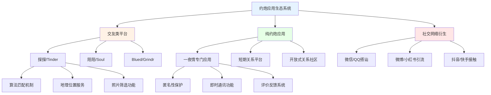
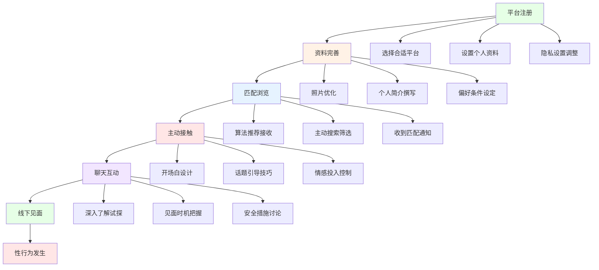
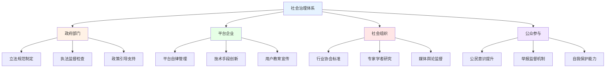

# 数字时代约炮与出轨的影响分析 (Digital Age Impact Analysis on Casual Sex and Infidelity)

## 技术变革对行为模式的影响

### 社交媒体平台的作用机制

#### 约炮应用生态分析

**主流平台类型及特征：**



**平台使用行为分析：**

| 平台类型 | 用户画像 | 使用动机 | 风险特征 | 监管难度 |
|---------|---------|---------|---------|---------|
| **传统交友软件** | 年轻群体为主 | 寻找长期关系 | 相对较低 | 中等 |
| **专业约炮应用** | 成熟用户较多 | 明确短期目的 | 较高 | 困难 |
| **社交媒体衍生** | 各年龄段混合 | 隐蔽性接触 | 中等 | 容易规避 |
| **即时通讯工具** | 普遍用户群体 | 日常社交延伸 | 较低但隐蔽 | 极难监管 |

#### 算法推荐机制影响

**匹配算法的心理效应：**
```
算法强化机制：
□ 选择性曝光效应：只显示符合偏好的选项
□ 确认偏误加强：不断验证已有认知
□ 多巴胺奖励循环：频繁的新鲜感刺激
□ 社会比较加剧：与大量潜在对象比较
□ FOMO心理增强：害怕错过更好的选择
```

**行为改变的具体表现：**
- 决策疲劳和选择困难增加
- 对现实关系满意度下降
- 期望值不断提高
- 承诺恐惧症加剧
- 即时满足倾向强化

### 数字化接触渠道分析

#### 网络搭讪新模式

**线上接触策略演变：**
1. **传统模式(2010年前)**
   - 论坛发帖求认识
   - QQ群组交流
   - 个人空间互动
   - 线下见面为主

2. **移动互联网时代(2010-2018)**
   - 位置服务匹配
   - 图片优先筛选
   - 即时消息沟通
   - 快速线下转化

3. **短视频社交时代(2018至今)**
   - 内容吸引关注
   - 评论区互动
   - 直播连麦接触
   - 多平台矩阵运营

#### 隐蔽性接触技术

**新型接触方式：**
| 接触方式 | 技术特点 | 隐蔽程度 | 风险等级 | 检测难度 |
|---------|---------|---------|---------|---------|
| **评论区互动** | 借助公共内容接触 | 高 | 中 | 低 |
| **私信暗号** | 使用特定词汇暗示 | 很高 | 高 | 高 |
| **群聊邀请** | 通过共同兴趣群组 | 中 | 中 | 中 |
| **直播打赏** | 金钱+关注的复合信号 | 中 | 中 | 中 |
| **朋友圈点赞** | 持续性关注表达 | 高 | 低 | 低 |

### 虚拟身份与真实性问题

#### 数字身份管理

**多重身份策略：**
```
常见的身份管理方式：
□ 真实身份：使用本人照片和信息
□ 半虚构身份：真实基础+美化包装
□ 完全虚构：编造个人信息和背景
□ 多重身份：针对不同平台使用不同人设
□ 匿名身份：刻意隐藏真实身份信息
```

**身份验证难题：**
- 照片的真实性难以确认
- 背景信息的核实困难
- 线上线下身份对应复杂
- 技术造假手段层出不穷
- 平台审核机制有限

#### 信息不对称加剧

**数字环境下的信息劣势：**
- 缺乏面对面的非言语信息
- 难以判断真实情感投入程度
- 虚假信息的识别成本高昂
- 时间和精力投入的风险增加
- 后期发现真相的心理落差巨大

## 行为模式的数字化特征

### 约炮行为的线上化趋势

#### 接触到成交的数字化流程

**典型线上约炮路径：**


#### 线上行为特征分析

**数字环境下的行为特点：**
1. **去抑制效应显著**
   - 匿名性降低道德约束
   - 距离感减少责任感
   - 即时性增强冲动行为
   - 群体效应放大冒险倾向

2. **表演性行为突出**
   - 人设包装更加精致
   - 内容创作成为常态
   - 受众反馈驱动行为
   - 形象管理投入增加

3. **快餐化趋势明显**
   - 匹配速度要求更快
   - 沟通效率追求更高
   - 见面时间大大缩短
   - 关系持续时间变短

### 出轨行为的数字化掩护

#### 网络出轨的新形式

**数字出轨行为分类：**
| 出轨类型 | 具体表现 | 技术手段 | 隐蔽程度 | 发现难度 |
|---------|---------|---------|---------|---------|
| **情感出轨** | 网络深度情感交流 | 私密聊天、邮件往来 | 高 | 中 |
| **性出轨** | 网络性行为(视讯等) | 视频通话、私密照片 | 很高 | 高 |
| **虚拟出轨** | 网络虚拟关系维持 | 社交游戏、虚拟社区 | 中 | 低 |
| **混合出轨** | 线上线下结合 | 多平台同时操作 | 高 | 中高 |

#### 数字痕迹的管理策略

**常见的反侦查行为：**
```
痕迹清除技术：
□ 聊天记录定时删除
□ 使用阅后即焚功能
□ 多设备分散存储
□ 虚拟身份切换
□ 加密通讯工具
□ 云端备份转移
```

**数据恢复的现实：**
- 专业技术人员仍可恢复大部分数据
- 云端同步往往留下备份痕迹
- 设备硬件可能保留残留信息
- 网络服务商保存通信记录
- 第三方应用可能记录行为数据

## 心理机制的数字化强化

### 即时满足心理的放大

#### 多巴胺系统的数字化刺激

**奖励机制的技术优化：**
```
平台设计的心理学原理：
□ 不确定性奖励：匹配成功的随机性
□ 可变比率强化：回复时间的不可预测
□ 社交验证满足：点赞评论的数量反馈
□ 进化优势激活：择偶成功的本能驱动
□ 竞争心理激发：与其他用户的比较
```

**成瘾性设计特征：**
- 无限滚动的信息流
- 即时反馈的通知系统
- 社交货币的量化展示
- 成就系统的等级设计
- 群体归属的虚拟满足

#### FOMO(错失恐惧症)的加剧

**数字环境下的焦虑强化：**
- 24小时不间断的接触可能
- 无数潜在选择的存在
- 同伴动态的实时可见
- 成功案例的持续展示
- 时间流逝的紧迫感

### 自我呈现与认同危机

#### 数字人设的构建压力

**社交媒体表演焦虑：**
```
人设维护的成本：
□ 时间精力的大量投入
□ 真实自我的逐渐迷失
□ 持续更新的内容压力
□ 受众期待的满足负担
□ 人设崩塌的恐惧心理
```

**身份认同的碎片化：**
- 线上线下人格的分裂
- 不同平台角色的切换
- 真实与虚拟界限模糊
- 社会认同的多元化
- 核心自我概念的动摇

#### 社会比较的数字化升级

**算法驱动的比较机制：**
- 精准推送的理想化内容
- 选择性展示的成功案例
- 美化滤镜下的虚假现实
- 群体压力的无形传导
- 自我价值的相对化评估

## 安全风险与防护措施

### 数字安全隐患

#### 个人信息泄露风险

**主要泄露途径：**
| 泄露类型 | 具体方式 | 防范难度 | 后果严重性 |
|---------|---------|---------|-----------|
| **主动泄露** | 自愿提供个人信息 | 低 | 中高 |
| **平台泄露** | 第三方数据共享 | 中 | 高 |
| **技术攻击** | 黑客入侵获取 | 高 | 极高 |
| **社交工程** | 骗术诱导获取 | 中 | 中高 |
| **关联推断** | 多平台信息拼接 | 高 | 高 |

#### 网络诈骗与陷阱

**常见数字骗局：**
```
典型诈骗模式：
□ 感情诈骗：建立虚假感情骗取财物
□ 色情敲诈：获取私密内容进行勒索
□ 虚假平台：伪造约炮应用骗取费用
□ 身份冒用：盗用他人身份进行活动
□ 技术陷阱：恶意软件获取设备控制
```

### 安全防护策略

#### 技术安全措施

**基础防护建议：**
```
数字安全基本要求：
□ 使用强密码和双重验证
□ 定期更新软件和系统
□ 谨慎授权应用权限
□ 使用加密通讯工具
□ 定期清理浏览记录
□ 备份重要数据文件
```

**高级防护技术：**
- 虚拟私人网络(VPN)使用
- 端到端加密通讯
- 匿名浏览器操作
- 多重身份管理
- 安全存储设备
- 专业安全软件

#### 行为安全管理

**风险规避策略：**
1. **前期筛选阶段**
   - 平台信誉度调查
   - 用户评价核实
   - 身份信息交叉验证
   - 公共信息比对确认

2. **接触交流阶段**
   - 避免过早透露个人信息
   - 不轻易相信过于完美的描述
   - 保持理性判断和警惕
   - 设置合理的心理预期

3. **线下见面阶段**
   - 选择公共场所首次见面
   - 告知信任的人具体安排
   - 保持通讯设备畅通
   - 准备应急撤离方案

## 监管与治理挑战

### 平台责任与监管困境

#### 内容审核的复杂性

**审核难点分析：**
- 边界模糊的色情内容
- 隐蔽性强的不当行为
- 跨国平台的管辖困难
- 技术手段的局限性
- 用户隐私保护要求

#### 法律监管的滞后性

**现行法规的不足：**
```
监管空白领域：
□ 约炮应用的法律地位不明确
□ 网络出轨的法律定性模糊
□ 数字证据的法律效力争议
□ 跨境执法的合作机制缺乏
□ 新兴行为的法律适用困难
```

### 社会治理创新

#### 多元治理主体

**协同治理体系：**


#### 技术治理手段

**新兴监管技术：**
- 人工智能内容识别
- 区块链溯源技术
- 大数据分析预警
- 生物识别验证
- 智能合约执行

## 未来发展趋势

### 技术发展预测

#### 新兴技术影响

**元宇宙等新技术的潜在影响：**
- 虚拟现实约会的普及
- 数字孪生身份的应用
- 沉浸式体验的增强
- 虚拟财产的价值认定
- 跨平台身份的统一

#### 人工智能的角色

**AI在关系领域的应用：**
- 智能匹配算法优化
- 情感分析和风险预警
- 虚拟伴侣和陪伴机器人
- 个性化内容推荐
- 自动化关系管理

### 社会适应策略

#### 教育引导方向

**数字素养教育重点：**
```
核心教育内容：
□ 网络安全意识培养
□ 健康关系观念树立
□ 批判思维能力发展
□ 情感管理技能提升
□ 法律法规知识普及
```

#### 制度建设完善

**长效机制建设：**
- 法律法规的及时更新
- 行业标准的统一制定
- 监管机制的持续优化
- 国际合作的深入推进
- 社会共识的逐步形成

---

*本文件分析了数字时代技术变革对约炮与出轨行为的深刻影响，为理解和应对相关挑战提供了全面的视角和策略建议。*