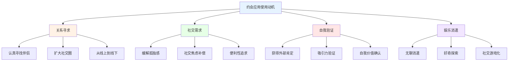
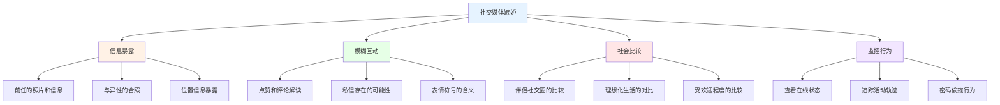
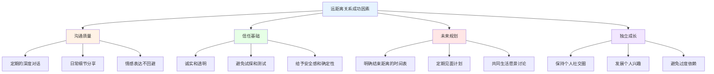

# 数字时代关系深度研究 (Digital Age Relationships Deep Dive)

## 约会应用心理学

### 约会应用(Dating Apps)的行为心理学

#### 约会应用的使用心理学

**约会应用用户的心理画像：**


**不同约会应用的用户心理差异：**
| 应用类型 | 核心吸引力 | 用户动机 | 决策模式 | 关系预期 | 心理风险 |
|---------|-----------|---------|---------|---------|---------|
| **滑动型(Tinder式)** | 快速视觉判断 | 短期连接为主 | 瞬间直觉 | 低承诺 | 选择过载、肤浅化 |
| **算法型(OkCupid式)** | 深度匹配分析 | 认真寻找 | 数据驱动 | 中等承诺 | 信息过载、过度分析 |
| **社交型(Soul式)** | 灵魂匹配概念 | 情感连接 | 内容导向 | 较高承诺 | 虚假亲密感 |
| **专业型(相亲平台)** | 条件精确筛选 | 婚姻导向 | 理性比较 | 高承诺 | 交易化倾向 |

#### 约会应用的行为成瘾机制

**约会应用成瘾的心理学模型：**
| 成瘾要素 | 约会应用表现 | 神经机制 | 易感因素 | 干预策略 |
|---------|-------------|---------|---------|---------|
| **可变比率强化** | 匹配的不确定性 | 多巴胺奖励系统激活 | 高新奇寻求者 | 设定使用时间限制 |
| **社会验证循环** | 点赞和匹配的反馈 | 社交奖赏回路激活 | 高自尊需求者 | 自我价值多样化 |
| **无限滚动** | 无尽的新面孔浏览 | 注意力捕获机制 | 决策回避者 | 设定浏览数量上限 |
| **通知驱动** | 推送通知的条件反射 | 期待-奖励回路 | FOMO倾向者 | 关闭非必要通知 |

### 选择过载与决策瘫痪

#### 约会应用中的选择心理学

**选择过载(Choice Overload)效应：**
- Schwartz (2004) 的选择悖论(Paradox of Choice)在约会中的体现
- 更多选择并不等于更好的决定
- 过多选择导致决策满意度下降
- 最大化者(Maximizer)vs满足者(Satisficer)的差异
- FOMO心理导致持续寻找"下一个更好"

**约会应用中的决策偏差：**
| 认知偏差 | 约会表现 | 影响后果 | 纠正方法 |
|---------|---------|---------|---------|
| **光环效应** | 照片好看就认为性格好 | 忽视重要品质 | 多维度评估 |
| **锚定效应** | 第一个匹配者成为比较标准 | 不合理的期望 | 避免固定比较 |
| **确认偏误** | 只注意支持初步印象的信息 | 错误判断加深 | 寻找反证 |
| **沉没成本** | 已投入时间聊天就不愿放弃 | 坚持不合适的选择 | 独立评估当前价值 |
| **可得性启发** | 高估容易想到的特征的重要性 | 过度重视表面因素 | 系统化评估框架 |

## 社交媒体与嫉妒

### 社交媒体引发的关系嫉妒

#### 社交媒体嫉妒的心理学机制

**Facebook嫉妒(Facebook Jealousy)的研究发现：**

Muise et al. (2009) 开创性研究揭示了社交媒体使用与关系嫉妒之间的显著关联。后续研究持续证实社交媒体是现代关系中嫉妒情绪的主要触发器。

**社交媒体嫉妒的触发情境：**


**社交媒体嫉妒的性别差异：**
| 维度 | 男性反应 | 女性反应 | 解释理论 | 调节因素 |
|------|---------|---------|---------|---------|
| **视觉触发** | 对伴侣与异性合照更敏感 | 对情感评论更敏感 | 进化心理学 | 依恋风格 |
| **行为反应** | 更可能监控和质问 | 更可能社交媒体窥探 | 性别社会化 | 关系长度 |
| **情绪表达** | 更可能转化为愤怒 | 更可能表达悲伤和焦虑 | 情绪社会化 | 文化背景 |
| **应对策略** | 更可能要求对方停止 | 更可能自我调节情绪 | 应对风格差异 | 自尊水平 |

#### 社交媒体与关系信任

**信任的数字化挑战：**
1. **透明悖论** - 更多信息并不等于更多信任
2. **情境缺失** - 社交媒体行为容易被误读
3. **记忆持久** - 数字内容不会消失，过去持续影响现在
4. **边界模糊** - 公共和私人领域的界限模糊

## 远距离数字亲密

### 远程关系(Remote Relationships)的维持

#### 远距离关系的数字工具

**远距离关系的技术支持：**
| 技术工具 | 亲密功能 | 心理效益 | 使用建议 | 潜在问题 |
|---------|---------|---------|---------|---------|
| **视频通话** | 面对面互动替代 | 减少孤独感、增加安全感 | 固定时间、高质量专注 | 通话疲劳 |
| **共享日历** | 协调生活节奏 | 增加共同感和预测性 | 同步重要日期和日常 | 过度规划压力 |
| **共同观影** | 共享体验创造 | 创造共同回忆和话题 | 定期选择双方感兴趣的内容 | 选择分歧 |
| **即时消息** | 持续的连接感 | 日常参与的替代 | 分享日常细节和感受 | 回复压力 |
| **远程控制玩具** | 身体亲密的替代 | 维持性亲密连接 | 共同探索和协商 | 技术依赖 |
| **共享相册** | 视觉生活分享 | 增加参与感和了解 | 即时分享日常瞬间 | 隐私边界 |

#### 远距离关系的亲密维持策略

**远距离关系的成功因素：**


**远距离关系的挑战与应对：**
| 挑战 | 心理机制 | 应对策略 | 预警信号 |
|------|---------|---------|---------|
| **沟通疲劳** | 互动变为义务而非快乐 | 质量优先于频率 | 对通话感到厌烦 |
| **情感疏远** | 缺乏身体接触和共同体验 | 创造虚拟共同体验 | 不再分享日常感受 |
| **不安全感** | 缺乏直接观察和确认 | 建立信任沟通协议 | 频繁质疑和查证 |
| **嫉妒问题** | 无法了解对方社交活动 | 开放沟通+合理边界 | 突然增加控制行为 |
| **未来不确定** | 缺乏明确的结束时间表 | 设定并更新时间表 | 避免讨论未来规划 |

## 手机冷落现象

### Phubbing(手机冷落)的关系影响

#### Phubbing的定义与测量

**Phubbing(Partner Snubbing)的学术研究：**

Roberts & David (2016) 将Phubbing定义为在面对面互动中因使用手机而忽略伴侣的行为，并开发了通用手机冷落量表(Generic Scale of Phubbing)。

**手机冷落的关系影响机制：**
| 影响维度 | 具体表现 | 机制解释 | 研究支持 | 干预建议 |
|---------|---------|---------|---------|---------|
| **关系满意度** | 被冷落方满意度下降 | 需求满足感降低 | Wang et al. (2019) | 设立无手机时段 |
| **冲突频率** | 因手机使用产生争吵 | 感知到的优先级排序 | McDaniel & Coyne (2016) | 协商使用规则 |
| **情感连接** | 感到被忽视和不被重视 | 注意力=关心的信号 | Przybylski & Weinstein (2013) | 质量注意力分配 |
| **心理幸福感** | 被冷落方抑郁水平上升 | 归属感受挫 | David et al. (2018) | 共同制定数字边界 |
| **关系稳定性** | 长期影响关系存续 | 侵蚀关系基础 | 需要更多纵向研究 | 预防性沟通 |

#### 数字边界的建立

**健康数字关系边界的建立策略：**
```
数字边界协议框架：
□ 进餐时不使用手机
□ 深度对话时手机静音
□ 睡前30分钟无屏幕
□ 隐私边界明确约定
□ 社交媒体发布需协商
□ 不在社交媒体上监控伴侣
□ 共同活动时专注当下
□ 定期回顾和更新协议
```

**数字时代关系健康的关键原则：**
1. **在场优先** - 面对面互动时保持完全在场
2. **质量连接** - 追求互动质量而非频率
3. **数字共情** - 理解数字沟通的局限性
4. **意识使用** - 有意识地使用技术而非被动成瘾
5. **定期断连** - 定期进行数字排毒和深度连接

---

*本文件从约会应用心理学、社交媒体嫉妒、远距离数字亲密和手机冷落现象四个维度深入探讨数字时代关系的心理机制，为在技术环境中维持健康关系提供科学指导。*
