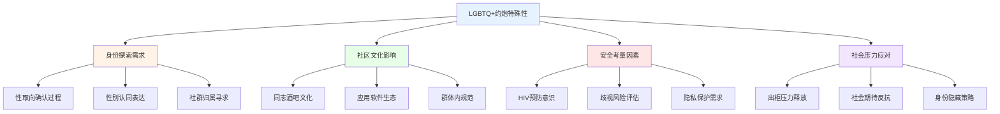
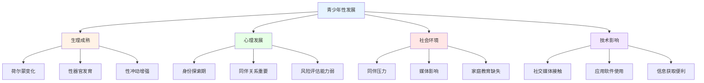
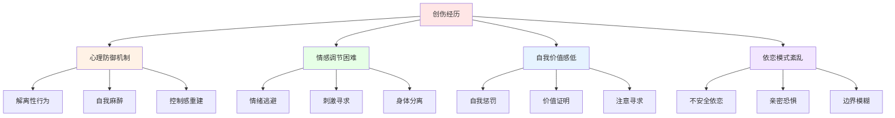
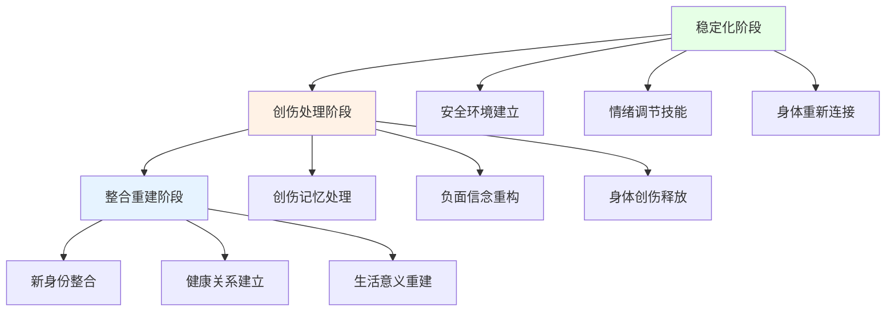

# 约炮与出轨的多元化群体视角 (Diverse Populations Perspectives on Casual Sex and Infidelity)

## LGBTQ+群体的特殊考量

### 性少数群体的独特经历

#### 身份认同与约炮行为

**LGBTQ+约炮行为的特殊性：**


**约炮动机的群体差异：**
| 群体类型 | 特殊动机 | 心理机制 | 风险因素 | 支持需求 |
|---------|---------|---------|---------|---------|
| **男同性恋** | 社区归属感、身份验证 | 群体认同需求、审美偏好 | HIV感染风险、年龄歧视 | 安全性行为教育、反歧视支持 |
| **女同性恋** | 情感连接需求、温柔体验 | 亲密关系渴望、温柔文化 | 安全套使用率低、妇科健康 | 健康教育、情感支持 |
| **双性恋** | 身份探索、多元体验 | 双重归属需求、灵活性 | 双重歧视、身份质疑 | 身份肯定、理解支持 |
| **跨性别者** | 身体认同表达、安全空间 | 性别确认需求、安全寻求 | 暴力风险、医疗歧视 | 跨性别友好环境、专业支持 |
| **酷儿群体** | 反叛传统、创新表达 | 边界挑战、创造性 | 社会排斥、法律风险 | 包容性环境、权利保护 |

#### 出轨行为的复杂性

**LGBTQ+出轨的特殊维度：**
| 出轨类型 | 表现形式 | 心理机制 | 关系影响 | 干预重点 |
|---------|---------|---------|---------|---------|
| **身份相关出轨** | 与不同性别表达者的关系 | 身份探索需求、表达自由 | 关系内性别认同冲突 | 身份整合支持 |
| **社区相关出轨** | 在特定社群内的关系 | 群体归属需求、文化认同 | 社区声誉影响 | 社群关系协调 |
| **安全相关出轨** | 与HIV阳性者的隐瞒关系 | 安全焦虑、污名恐惧 | 健康风险暴露 | 健康教育支持 |
| **表达相关出轨** | 性别表达不一致的关系 | 表达需求、角色探索 | 表达方式冲突 | 沟通技巧训练 |

### 青少年群体的特殊关注

#### 发展阶段的特殊性

**青少年约炮行为的发展背景：**



**风险因素分析：**
| 风险维度 | 具体表现 | 影响机制 | 预防策略 |
|---------|---------|---------|---------|
| **认知发展** | 判断能力不成熟 | 对风险后果理解不足 | 性教育课程、决策训练 |
| **情感发展** | 依恋需求强烈 | 容易被情感操控 | 情感教育、边界训练 |
| **社会压力** | 同伴认同需求 | 为融入群体而冒险 | 同伴教育、群体引导 |
| **技术接触** | 数字平台易接触 | 降低接触门槛 | 数字素养教育、家长监督 |
| **家庭因素** | 沟通不足、监管缺失 | 缺乏正确引导 | 家庭教育支持、亲子沟通 |

#### 保护性干预策略

**青少年友好型服务模式：**
```
核心原则：
□ 非评判性态度
□ 保密性保护
□ 发展适宜性
□ 文化敏感性
□ 赋权式参与
```

**具体干预措施：**
1. **教育预防项目**
   - 全面性教育课程
   - 同伴教育模式
   - 家长教育工作坊
   - 数字安全培训

2. **支持服务系统**
   - 青少年友好诊所
   - 同伴支持小组
   - 在线咨询服务
   - 危机干预热线

3. **环境改善策略**
   - 学校政策完善
   - 社区资源整合
   - 媒体内容监管
   - 技术平台规范

## 创伤康复视角分析

### 创伤与约炮行为的关联

#### 创伤驱动的性行为模式

**创伤后约炮行为的心理机制：**


**创伤类型与行为表现：**
| 创伤类型 | 约炮行为特征 | 心理功能 | 治疗重点 |
|---------|-------------|---------|---------|
| **性创伤** | 高频率、低选择性 | 身体重现、控制感 | 创伤处理、身体重新连接 |
| **情感创伤** | 寻求验证、重复模式 | 情感填补、自我价值 | 情感修复、自我关爱 |
| **依恋创伤** | 关系混乱、边界模糊 | 安全感寻求、连接需求 | 依恋修复、边界建立 |
| **复合创伤** | 多重动机、复杂表现 | 多层次需求、混乱状态 | 综合治疗、阶段化干预 |

#### 出轨行为的创伤根源

**创伤相关出轨的心理动力：**
| 动力类型 | 表现形式 | 深层需求 | 治疗方向 |
|---------|---------|---------|---------|
| **自我惩罚型** | 主动破坏关系 | 内疚感释放、自我伤害 | 自我宽恕、价值重建 |
| **刺激寻求型** | 追求高强度体验 | 麻醉痛苦、激活麻木 | 情绪调节、健康刺激 |
| **控制重建型** | 通过出轨获得掌控感 | 补偿无力感、重获权力 | 安全感建立、健康控制 |
| **连接寻求型** | 通过外部关系满足需求 | 弥补内在空虚、寻求理解 | 内在资源开发、真实连接 |

### 创伤知情治疗方法

#### 整合性治疗框架

**阶段化治疗模型：**


**治疗技术整合：**
1. **躯体体验疗法(SE)**
   - 身体感觉追踪
   - 创伤反应完成
   - 神经调节训练
   - 资源化技术

2. **辩证行为疗法(DBT)**
   - 情绪调节技能
   - 人际效能训练
   - 痛苦耐受技术
   - 正念练习

3. **依恋导向治疗**
   - 安全基地重建
   - 依恋风格调整
   - 关系模式修复
   - 情感连接增强

#### 预防复发策略

**创伤后成长促进：**
```
核心要素：
□ 创伤意义化整合
□ 韧性品质发展
□ 关系智慧提升
□ 生活目标明确
□ 社会支持网络
```

**具体实施方法：**
1. **自我觉察训练**
   - 创伤触发识别
   - 情绪预警系统
   - 行为模式觉察
   - 需求真实表达

2. **健康关系建设**
   - 边界清晰设定
   - 沟通技能提升
   - 依恋安全感培养
   - 亲密能力发展

3. **生活重构支持**
   - 价值体系重建
   - 目标规划制定
   - 社会功能恢复
   - 成长机会创造

## 特殊群体的综合支持

### 多重身份交叉影响

#### 交叉性理论应用

**多重身份的复杂交互：**
| 身份维度 | 交互影响 | 约炮/出轨表现 | 支持策略 |
|---------|---------|-------------|---------|
| **种族+性取向** | 双重少数压力 | 身份隐藏、社区寻求 | 文化敏感性服务 |
| **年龄+创伤史** | 发展创伤叠加 | 行为模式固化 | 发展适宜性干预 |
| **经济+教育** | 资源获取限制 | 风险环境暴露 | 资源链接支持 |
| **残疾+性别** | 身体自主权挑战 | 边界侵犯风险 | 权利倡导服务 |

#### 包容性服务模式

**多元化服务能力：**
```
服务设计原则：
□ 文化谦逊态度
□ 个性化适配
□ 多语言支持
□ 无障碍环境
□ 经济可及性
□ 技术友好性
```

**服务质量保障：**
1. **专业能力提升**
   - 多元文化培训
   - 创伤知情实践
   - 特殊群体专长
   - 伦理敏感性培养

2. **系统性支持**
   - 转介网络建设
   - 同行支持发展
   - 政策倡导参与
   - 研究证据积累

3. **持续质量改进**
   - 服务效果评估
   - 用户满意度调查
   - 实践经验总结
   - 最佳实践推广

---

*本文件从多元化群体视角深入分析约炮与出轨现象，为不同背景的个体提供更具针对性的理解和支持策略。*