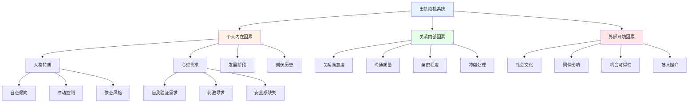
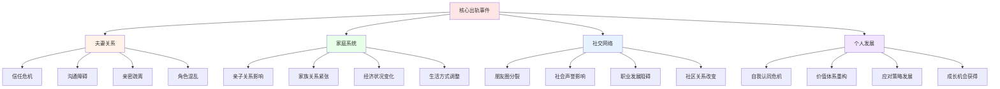

# 出轨心理学与关系干预 (Infidelity Psychology & Relationship Intervention)

## 出轨现象的多维度分析框架

### 出轨的定义与类型学

#### 学术定义标准

出轨(Infidelity)指在承诺关系中违反独占性约定的行为，包括但不限于性行为、情感亲密和其他形式的背叛。

#### 出轨类型分类体系

| 出轨维度 | 分类类型 | 核心特征 | 心理机制 | 关系影响 | 干预复杂度 |
|---------|---------|---------|---------|---------|---------|
| **行为性质** | 纯粹性出轨 | 仅有身体接触，无情感投入 | 生理驱动、冲动行为 | 相对较易修复 | 中等 |
| **行为性质** | 情感出轨 | 深度情感连接，可能无身体接触 | 情感需求未满足、寻找理解 | 极难修复 | 高 |
| **行为性质** | 混合出轨 | 情感和身体双重背叛 | 复合动机驱动 | 最具破坏性 | 极高 |
| **关系状态** | 婚内出轨 | 在法律婚姻关系中的背叛 | 权利义务冲突、社会压力 | 法律后果严重 | 高 |
| **关系状态** | 恋爱出轨 | 在非婚恋爱关系中的背叛 | 承诺程度相对较低 | 社会谴责相对较轻 | 中等 |
| **持续性** | 一次性出轨 | 单次偶然行为 | 冲动、酒精影响、机会主义 | 相对容易原谅 | 低-中 |
| **持续性** | 持续性出轨 | 长期重复行为 | 系统性问题、习惯性模式 | 信任彻底崩塌 | 极高 |

### 出轨动机的深层分析

#### 综合动机理论模型

#### 核心动机维度详析

| 动机类别 | 具体表现 | 心理根源 | 典型触发情境 | 预防策略 |
|---------|---------|---------|-------------|---------|
| **关系不满** | 寻求外部满足 | 情感需求未被满足 | 长期关系倦怠期 | 改善关系质量 |
| **自我提升** | 证明自身魅力 | 自尊心补偿机制 | 中年危机、外貌焦虑 | 建立内在自信 |
| **报复心理** | 对等报复行为 | 公平感失衡 | 发现伴侣出轨后 | 健康冲突处理 |
| **逃避现实** | 逃离关系困境 | 问题回避机制 | 重大生活压力 | 直面问题解决 |
| **刺激寻求** | 追求新鲜体验 | 新奇寻求倾向 | 关系稳定化阶段 | 创造关系新意 |
| **依恋补偿** | 弥补早期创伤 | 依恋不安全感 | 童年情感缺失 | 依恋修复治疗 |

### 出轨的影响因素分析

#### 个体层面风险因子

**人格特质相关因素：**
1. **依恋风格**
   - 焦虑型依恋：过度寻求外部验证
   - 回避型依恋：害怕亲密而向外寻求
   - 恐惧型依恋：既渴望又恐惧亲密关系

2. **人格维度**
   - 高神经质：情绪不稳定，易冲动
   - 低宜人性：缺乏同理心和责任感
   - 高外向性：寻求刺激和社会认可
   - 低尽责性：自制力差，规划能力弱

3. **心理发展因素**
   - 未完成的发展任务
   - 早期创伤经历的影响
   - 身份认同的不确定性

#### 关系层面促成因素

**关系质量指标：**
| 关系维度 | 高风险特征 | 影响机制 | 改善方向 |
|---------|-----------|---------|---------|
| **沟通模式** | 回避冲突、缺乏深度交流 | 问题积累、误解加深 | 建设性沟通训练 |
| **亲密程度** | 情感疏离、身体接触减少 | 需求转向外部满足 | 亲密技能重建 |
| **满意度水平** | 持续不满、期望落差大 | 寻求替代性满足 | 期望管理调整 |
| **承诺强度** | 承诺模糊、投入不足 | 违背成本降低 | 承诺意识强化 |
| **冲突处理** | 破坏性争吵、冷暴力 | 情感连接断裂 | 健康冲突技能 |

#### 环境层面诱发条件

**社会文化影响：**
1. **技术媒介因素**
   - 社交媒体扩大接触范围
   - 约炮应用降低搜寻成本
   - 网络匿名性降低道德约束

2. **同伴群体效应**
   - 社交圈子的态度影响
   - 同伴出轨行为的示范
   - 群体规范的压力传导

3. **文化价值变迁**
   - 对出轨容忍度的变化
   - 个人主义价值观兴起
   - 传统婚姻观念松动

## 出轨的多重后果评估

### 对个人的心理影响

#### 出轨者的内心体验

**情感反应谱系：**
1. **即时反应阶段(0-72小时)**
   - 兴奋和刺激感
   - 焦虑和罪恶感并存
   - 对被发现的恐惧
   - 关系不确定性的担忧

2. **中期调整阶段(1-6个月)**
   - 情感麻木或抑郁
   - 自我合理化过程
   - 对伴侣的复杂情感
   - 生活常规的改变

3. **长期整合阶段(6个月以上)**
   - 深度自我反思
   - 价值观重新评估
   - 行为模式的改变
   - 成长和学习体验

#### 被出轨者的创伤反应

**创伤应激反应连续体：**

| 反应类型 | 具体表现 | 持续时间 | 干预需求 | 恢复路径 |
|---------|---------|---------|---------|---------|
| **急性应激** | 震惊、否认、愤怒爆发 | 数天至数周 | 危机干预 | 情绪稳定化 |
| **复杂哀伤** | 持续悲伤、失去信任 | 数月至数年 | 深度治疗 | 意义重构 |
| **创伤后成长** | 新的人生洞察、关系智慧 | 长期过程 | 支持性治疗 | 积极转化 |

### 对关系系统的冲击

#### 关系破裂的不同层次

**关系损伤评估矩阵：**

| 损伤维度 | 轻度影响 | 中度影响 | 重度影响 | 致命影响 |
|---------|---------|---------|---------|---------|
| **信任水平** | 暂时怀疑 | 明显动摇 | 严重受损 | 完全崩塌 |
| **情感连接** | 轻微疏远 | 明显隔阂 | 深度断裂 | 彻底分离 |
| **沟通质量** | 短期困难 | 持续障碍 | 严重阻塞 | 完全中断 |
| **身体亲密** | 暂时减少 | 明显下降 | 严重缺失 | 完全停止 |
| **未来规划** | 短期调整 | 重大修改 | 重新考虑 | 彻底放弃 |

#### 系统性连锁反应

**关系生态系统影响图：**

### 对子女和家庭的影响

#### 儿童发展风险

**不同年龄段的影响特点：**
1. **幼儿期(0-6岁)**
   - 安全感基础动摇
   - 依恋模式受影响
   - 行为退化或攻击性增加

2. **学龄期(7-12岁)**
   - 学业表现下降
   - 同伴关系困难
   - 对成人关系产生困惑

3. **青春期(13-18岁)**
   - 性态度和价值观混乱
   - 亲密关系模式学习偏差
   - 身份认同发展受阻

#### 家庭功能变化

**系统功能障碍表现：**
- 家庭凝聚力下降
- 角色边界模糊化
- 情感表达模式改变
- 问题解决机制失效

## 干预与治疗策略

### 个体层面的自我修复

#### 出轨者的责任承担

**自我反思框架：**
1. **行为层面检视**
   - 具体行为的客观描述
   - 行为发生的情境分析
   - 造成的直接后果盘点

2. **动机深层探索**
   - 表层理由vs真实动机
   - 个人需求的根本来源
   - 选择该行为的原因

3. **影响全面评估**
   - 对伴侣的具体伤害
   - 对关系的整体影响
   - 对自己的长远后果

#### 被出轨者的创伤处理

**恢复过程阶段模型：**
1. **稳定化阶段**
   - 情绪急救和危机管理
   - 建立基本的安全感
   - 恢复日常生活节奏

2. **处理阶段**
   - 创伤记忆的逐步面对
   - 情感表达和哀伤处理
   - 认知重构和意义寻找

3. **整合阶段**
   - 新的身份认同建立
   - 关系模式的重新学习
   - 未来生活的积极规划

### 关系层面的修复工作

#### 重建信任的系统工程

**信任重建四阶段模型：**

| 阶段 | 核心任务 | 时间框架 | 关键行为 | 成功指标 |
|------|---------|---------|---------|---------|
| **透明化** | 完全信息公开 | 3-6个月 | 主动汇报行踪、联系方式公开 | 信息获取无障碍 |
| **一致性** | 行为言行一致 | 6-12个月 | 承诺必兑现、行为可预测 | 可靠性感知提升 |
| **修复性** | 主动弥补过错 | 12-18个月 | 具体补偿行动、持续努力 | 伤害感逐步减轻 |
| **新生性** | 共同创造未来 | 18个月+ | 新的关系模式、共同目标 | 新的信任基础建立 |

#### 沟通修复技术

**有效沟通重建步骤：**
1. **基础技能重建**
   - 倾听技巧训练
   - 情绪表达规范化
   - 非暴力沟通实践

2. **深度对话促进**
   - 安全对话环境营造
   - 敏感话题处理规程
   - 共情能力培养

3. **冲突处理升级**
   - 建设性争吵技能
   - 修复性对话模式
   - 共同问题解决

### 专业治疗介入

#### 治疗适应症评估

**需要专业帮助的指征：**
- 持续的严重情绪困扰
- 自杀或自伤风险
- 关系暴力或虐待
- 儿童发展明显受损
- 法律纠纷涉及
- 反复出轨行为模式

#### 治疗方法选择

**循证治疗方法矩阵：**

| 方法类型 | 适用情况 | 核心技术 | 治疗周期 | 效果证据 |
|---------|---------|---------|---------|---------|
| **个体治疗** | 严重创伤反应 | 创伤聚焦CBT、EMDR | 12-24次 | 强烈支持 |
| **夫妻治疗** | 关系修复意愿 | 情感聚焦治疗(EFT) | 15-25次 | 强烈支持 |
| **家庭治疗** | 子女影响显著 | 系统家庭治疗 | 10-20次 | 中等支持 |
| **团体治疗** | 同伴支持需求 | 出轨幸存者团体 | 8-16周 | 中等支持 |

#### 治疗过程管理

**阶段性治疗目标：**
1. **初期(1-3个月)**
   - 危机稳定和安全建立
   - 基本治疗联盟形成
   - 问题评估和目标设定

2. **中期(3-9个月)**
   - 深层创伤处理
   - 关系模式探索
   - 技能学习和练习

3. **后期(9-18个月)**
   - 整合和巩固
   - 预防复发计划
   - 独立功能恢复

## 预防与前瞻性策略

### 个人预防措施

#### 自我觉察提升

**预警信号识别：**
- 情感需求的外部寻求倾向
- 对现有关系的持续不满
- 道德边界的模糊化思考
- 冲动控制能力的下降

#### 关系维护技能

**预防性关系建设：**
- 定期的关系满意度评估
- 持续的亲密技能发展
- 有效的冲突预防机制
- 共同成长目标的设定

### 关系系统强化

#### 健康关系特征

**抗出轨关系要素：**
1. **情感连接质量**
   - 深度的理解和接纳
   - 持续的情感投入
   - 有效的支持系统

2. **沟通系统效能**
   - 开放诚实的信息交流
   - 及时的问题处理
   - 建设性的冲突解决

3. **边界管理系统**
   - 清晰的价值观共识
   - 明确的行为边界
   - 相互的尊重和信任

#### 持续发展机制

**关系进化策略：**
- 定期的关系回顾和调整
- 新鲜体验的共同创造
- 成长目标的协同推进
- 应对外部挑战的合作

---
---
*本文件整合了临床心理学、婚姻家庭治疗和创伤学的最新研究成果，为出轨问题的预防、干预和治疗提供了科学的理论框架和实用的操作指南。*

**相关文档链接：**
- [约炮心理学与健康实践指南](../casual-sex/Casual_Sex_Psychology.md) - 约炮行为的科学定义和健康实践框架
- [约炮与出轨关系影响综合分析](../impact-analysis/Relationship_Impact_Comparison.md) - 两种行为对不同类型关系的影响对比
- [约炮与出轨临床实践指南](../clinical-guide/Clinical_Practice_Manual.md) - 专业心理咨询和治疗的技术方法
- [约炮与出轨预防干预指南](../prevention/Prevention_Intervention_Guide.md) - 基于风险因素的预防策略和早期干预
- [约炮与出轨法律伦理考量](../legal-ethics/Legal_Ethical_Considerations.md) - 相关法律风险和伦理道德框架
- [约炮与出轨跨文化视角](../cultural-perspective/Cross_Cultural_Analysis.md) - 不同文化背景下的认知差异和处理方式
- [数字时代约炮出轨影响分析](../digital-age/Digital_Age_Impact.md) - 社交媒体技术对行为模式的影响
- [约炮与出轨多元化群体视角](../diverse-populations/Diverse_Populations_Perspectives.md) - 特殊群体的经历分析和支持策略