# 夫妻相处知识网络与交叉引用系统 (Marriage Knowledge Network & Cross-references)

## 知识体系架构图

```mermaid
graph TB
    A["夫妻相处核心理论<br/>Marriage_Couple_Relationship.md"] --> B["日常实践指南<br/>Marriage_Daily_Practices.md"]
    A --> C["冲突处理解决<br/>Marriage_Conflict_Resolution.md"]
    A --> D["长期维护策略<br/>Marriage_Long_Term_Maintenance.md"]
    A --> E["评估诊断工具<br/>Marriage_Assessment_Diagnosis.md"]
    A --> F["特殊人群处理<br/>Marriage_Special_Populations.md"]
    A --> G["预防准备策略<br/>Marriage_Prevention_Preparation.md"]
    
    B --> H["沟通技能训练<br/>Marriage_Communication.md"]
    B --> I["情感连接培养<br/>Marriage_Psychology.md"]
    
    C --> J["Gottman方法<br/>Marriage_Therapy_Methods.md"]
    C --> K["EFT情绪聚焦<br/>Marriage_Therapy_Methods.md"]
    
    D --> L["生命周期管理<br/>Marriage_Overview.md"]
    D --> M["危机干预处理<br/>Marriage_Crisis_Intervention.md"]
    
    E --> N["标准化评估<br/>Marriage_Resources.md"]
    E --> O["临床访谈<br/>Marriage_Therapy_Methods.md"]
    
    F --> P["文化敏感性<br/>Marriage_Cultural_Perspectives.md"]
    F --> Q["LGBTQ+议题<br/>Marriage_Intimacy_Sexuality.md"]
    
    G --> R["婚前教育<br/>Marriage_Resources.md"]
    G --> S["风险预防<br/>Marriage_Crisis_Intervention.md"]
```

## 核心概念交叉引用网络

### 依恋理论知识网络

**核心文档节点：**
- [夫妻相处核心关系](file://marriage/Marriage_Couple_Relationship.md#L15-L25) - 依恋理论基础应用
- [婚姻心理学基础](file://marriage/Marriage_Psychology.md#L5-L12) - 依恋类型详细解析
- [冲突处理解决](file://marriage/Marriage_Conflict_Resolution.md#L35-L45) - 依恋相关冲突处理
- [特殊人群处理](file://marriage/Marriage_Special_Populations.md#L85-L120) - 不同人群依恋特点
- [评估诊断工具](file://marriage/Marriage_Assessment_Diagnosis.md#L18-L25) - ECR-R依恋评估量表

**关联知识点：**
- 安全型依恋的表现和培养策略
- 焦虑型依恋的自我安抚技术
- 回避型依恋的情感表达训练
- 恐惧型依恋的创伤处理方法

### 沟通模式知识网络

**核心文档节点：**
- [日常实践指南](file://marriage/Marriage_Daily_Practices.md#L5-L15) - 日常沟通黄金法则
- [沟通模式技术](file://marriage/Marriage_Communication.md#L1-L83) - 专业沟通理论
- [冲突处理解决](file://marriage/Marriage_Conflict_Resolution.md#L25-L35) - 建设性沟通技巧
- [评估诊断工具](file://marriage/Marriage_Assessment_Diagnosis.md#L30-L36) - 沟通模式观察记录

**关联知识点：**
- Gottman四骑士识别与转化
- 我信息表达技术
- 积极倾听技能
- 情感验证方法

### 冲突处理知识网络

**核心文档节点：**
- [冲突处理解决](file://marriage/Marriage_Conflict_Resolution.md#L1-L120) - 冲突类型与处理技术
- [危机干预处理](file://marriage/Marriage_Crisis_Intervention.md#L1-L100) - 危机状态冲突管理
- [特殊人群处理](file://marriage/Marriage_Special_Populations.md#L185-L220) - 特殊情境冲突应对
- [治疗技术方法](file://marriage/Marriage_Therapy_Methods.md#L35-L45) - 专业冲突解决技术

**关联知识点：**
- 冲突六步解决技术
- 情绪聚焦冲突处理
- 即时修复与延迟修复
- 特殊冲突情境处理

## 实用工具交叉引用系统

### 评估工具使用路径

**基础评估流程：**
1. [简易关系温度计](file://marriage/Marriage_Assessment_Diagnosis.md#L65-L75) - 日常关系监测
2. [沟通模式观察](file://marriage/Marriage_Assessment_Diagnosis.md#L78-L85) - 互动模式识别
3. [依恋风格自评](file://marriage/Marriage_Assessment_Diagnosis.md#L88-L105) - 依恋类型确认
4. 专业标准化量表评估

**进阶评估工具：**
- [DAS-II婚姻调适量表](file://marriage/Marriage_Assessment_Diagnosis.md#L18-L25) - 全面关系质量评估
- [Gottman比率编码](file://marriage/Marriage_Assessment_Diagnosis.md#L19-L19) - 互动观察金标准
- [ECR-R依恋量表](file://marriage/Marriage_Assessment_Diagnosis.md#L20-L20) - 依恋风格筛查

### 干预技术应用路径

**预防性干预：**
- [婚前准备策略](file://marriage/Marriage_Prevention_Preparation.md#L5-L15) - 风险因素识别
- [日常实践指南](file://marriage/Marriage_Daily_Practices.md#L20-L30) - 预防性日常习惯
- [长期维护策略](file://marriage/Marriage_Long_Term_Maintenance.md#L20-L30) - 持续关系投资

**治疗性干预：**
- [EFT情绪聚焦](file://marriage/Marriage_Therapy_Methods.md#L18-L33) - 依恋修复核心技术
- [Gottman方法](file://marriage/Marriage_Therapy_Methods.md#L35-L45) - 关系技能训练
- [IBCT整合行为](file://marriage/Marriage_Therapy_Methods.md#L46-L55) - 接纳与改变平衡

## 跨领域知识整合

### 与心理学其他领域的连接

**发展心理学：**
- [儿童发展影响](file://child-adolescent/Child_Adolescent_Development.md#L1-L50) - 子女对夫妻关系的影响
- [青少年发展](file://adolescent-crisis/Adolescent_Crisis_Intervention.md#L1-L80) - 青春期家庭关系挑战

**临床心理学：**
- [抑郁焦虑共病](file://depression/Depression_Treatment.md#L1-L150) - 心理障碍对关系的影响
- [创伤处理](file://trauma/Trauma_Treatment.md#L1-L100) - 创伤经历的关系影响

**社会心理学：**
- [社会支持系统](file://society-community/Society_Community_Support.md#L1-L68) - 外部支持对关系的作用
- [文化适应](file://east-asian-philosophy/china/confucianism/Confucianism_Modern_Application.md#L1-L80) - 文化因素对关系的影响

### 与相关专题的交叉引用

**恋爱关系：**
- [恋爱心理学](file://love/Love_Psychology_Overview.md#L1-L100) - 恋爱到婚姻的过渡
- [择偶心理](file://love/Love_Mate_Selection.md#L1-L90) - 选择标准与关系基础

**家庭系统：**
- [家庭系统排列](file://family-constellation/Family_Constellation_Laws.md#L1-L150) - 家庭系统对夫妻关系的影响
- [原生家庭](file://marriage/Marriage_Psychology.md#L48-L57) - 原生家庭模式的代际传递

**个人成长：**
- [自我慈悲](file://self-compassion/Self_Compassion_Theory.md#L1-L80) - 个人自我关怀对关系的影响
- [正念冥想](file://mindfulness/Mindfulness_Core.md#L1-L120) - 正念练习在关系中的应用

## 专业资源导航系统

### 治疗师培训路径

**入门级：**
- [基础理论学习](file://marriage/Marriage_Overview.md#L1-L100) - 婚姻关系基本概念
- [沟通技能培训](file://marriage/Marriage_Communication.md#L1-L83) - 基础沟通技术
- [评估工具掌握](file://marriage/Marriage_Assessment_Diagnosis.md#L15-L25) - 标准化评估方法

**进阶级：**
- [EFT认证培训](file://marriage/Marriage_Therapy_Methods.md#L18-L33) - 情绪聚焦治疗技术
- [Gottman方法认证](file://marriage/Marriage_Therapy_Methods.md#L35-L45) - Gottman七原则应用
- [特殊人群处理](file://marriage/Marriage_Special_Populations.md#L1-L200) - 文化敏感性技能

**专家级：**
- [复杂案例处理](file://marriage/Marriage_Crisis_Intervention.md#L1-L100) - 危机干预技术
- [研究与督导](file://marriage/Marriage_Resources.md#L59-L66) - 专业发展路径
- [跨领域整合](file://marriage/Marriage_Therapy_Methods.md#L85-L105) - 多种方法整合应用

### 大众自助资源导航

**初学者路径：**
- [关系基础知识](file://marriage/Marriage_Overview.md#L15-L25) - 理解关系基本概念
- [日常实践指南](file://marriage/Marriage_Daily_Practices.md#L5-L25) - 简单易行的日常技巧
- [自我评估工具](file://marriage/Marriage_Assessment_Diagnosis.md#L65-L105) - 简易自我评估方法

**进阶学习路径：**
- [专业书籍推荐](file://marriage/Marriage_Resources.md#L30-L42) - 循证实践书籍
- [在线课程资源](file://marriage/Marriage_Resources.md#L81-L88) - 结构化学习项目
- [支持小组参与](file://marriage/Marriage_Resources.md#L72-L77) - 同伴支持网络

**危机应对路径：**
- [危险信号识别](file://marriage/Marriage_Assessment_Diagnosis.md#L85-L95) - 危机预警系统
- [紧急资源获取](file://marriage/Marriage_Resources.md#L92-L99) - 危机干预资源
- [专业帮助寻求](file://marriage/Marriage_Resources.md#L110-L120) - 治疗师选择指南

## 知识更新与维护机制

### 内容更新策略

**定期审查周期：**
- 核心理论文档：每年审查更新
- 实践技术文档：每半年审查更新
- 评估工具文档：根据最新研究更新
- 特殊人群文档：根据社会变化更新

**更新触发机制：**
- 新研究发表
- 临床实践反馈
- 用户需求变化
- 社会文化变迁

### 质量控制体系

**内容准确性保障：**
- 同行评议机制
- 实证研究支撑
- 专家审核流程
- 用户反馈循环

**实用性和可操作性：**
- 临床验证测试
- 用户体验调研
- 技术可行性评估
- 文化适应性检查

这个知识网络系统旨在为用户提供一个完整的、相互关联的夫妻相处知识体系，确保信息的准确性和实用性，同时便于用户根据不同需求找到相应的资源和指导。