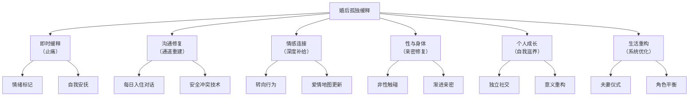

# 婚后孤独缓释策略与实践指南 (Post-Marital Loneliness Relief Strategies & Practice Guide)

## 目录导航

- [一、缓释的核心原则](#一缓释的核心原则)
- [二、即时缓释：当婚后孤独袭来时](#二即时缓释当婚后孤独袭来时)
- [三、沟通修复策略](#三沟通修复策略)
- [四、情感连接重建技术](#四情感连接重建技术)
- [五、性亲密与身体连接修复](#五性亲密与身体连接修复)
- [六、个人层面的缓释策略](#六个人层面的缓释策略)
- [七、育儿期专项缓释方案](#七育儿期专项缓释方案)
- [八、中年与空巢期缓释方案](#八中年与空巢期缓释方案)
- [九、夫妻共同实践清单](#九夫妻共同实践清单)
- [十、何时需要专业帮助](#十何时需要专业帮助)

---

## 一、缓释的核心原则

### 1.1 婚后孤独缓释的四项基本原则

| 原则 | 内涵 | 错误做法 | 正确做法 |
|------|------|---------|---------|
| **双向责任** | 婚后孤独是系统问题，不是某一方的错 | 指责对方"你让我孤独" | "我们的互动模式让我们都感到不被连接" |
| **小步渐进** | 修复关系是马拉松，不是短跑 | 期望一次深谈解决所有问题 | 每天一个微小的连接尝试 |
| **安全优先** | 在安全感不足时不强求深度暴露 | "你必须告诉我你的感受" | "当你准备好的时候，我在这里" |
| **并行成长** | 个人成长与关系修复同步进行 | 完全依赖伴侣来解决自己的孤独 | 一边照顾自己，一边投资关系 |

### 1.2 缓释路径总览



---

## 二、即时缓释：当婚后孤独袭来时

### 2.1 婚后孤独的急救步骤

**当你在婚姻中感到一阵强烈孤独时：**

| 步骤 | 操作 | 目的 |
|------|------|------|
| **1. 暂停** | 不要立即指责或退缩，先让自己暂停 10 秒 | 中断自动化反应（追逐或石墙） |
| **2. 命名** | 对自己说："我现在感到在这段关系里的孤独" | 精确命名降低情绪强度 |
| **3. 身体安抚** | 手放胸口、3 次深呼吸 | 激活副交感神经 |
| **4. 区分** | 问自己："这个感觉中有多少是现在发生的，多少是旧伤被激活？" | 区分当前情境与历史创伤 |
| **5. 选择** | 决定：现在是表达的好时机，还是先照顾好自己再找时间沟通？ | 从反应模式转为选择模式 |

### 2.2 婚后孤独时不建议做的事

| 不建议的行为 | 为什么 | 替代行为 |
|------------|--------|---------|
| 深夜翻旧账 | 疲劳+情绪化=升级冲突 | 记下来，约定白天清醒时讨论 |
| 向父母/公婆诉苦 | 三角化加剧问题 | 找不涉及双方家庭的朋友或咨询师 |
| 报复性刷手机/加班 | 暂时逃避但长期加剧疏离 | 用建设性独处替代（阅读、运动） |
| 与异性"倾诉" | 情感外泄可能变成情感出轨 | 向同性朋友或专业人士倾诉 |
| 冷战/石墙 | 沉默比冲突更伤害关系 | 说"我需要一点时间，但我会回来谈" |

---

## 三、沟通修复策略

### 3.1 每日"入住对话" (Daily Check-In)

**每天 10-15 分钟的结构化情感对话：**

```
每日入住对话模板：

1. "今天你过得怎么样？" （不是"忙不忙"，而是真正的问候）
2. 分享今天的一个高光时刻
3. 分享今天的一个困难时刻
4. "有什么我可以为你做的？"
5. 感谢对方一件今天做的事

规则：
- 倾听时不打断、不评判、不给建议
- 手机收起来
- 眼神接触
- 时间到了就结束，不用解决所有问题
```

### 3.2 安全表达脆弱的句式

**从攻击/指责转为脆弱表达：**

| 指责式 (加剧孤独) | 脆弱式 (缓释孤独) |
|-----------------|-----------------|
| "你从来不关心我" | "我最近感到有些孤独，我很想和你多一些连接" |
| "你整天就知道看手机" | "当你看手机的时候，我会有种被忽视的感觉" |
| "你根本不了解我" | "我有些心里话想和你分享，但我不知道怎么开口" |
| "你一点都不浪漫" | "我很怀念我们刚在一起时的那种亲密感" |
| "你就是个冷血动物" | "当我感到脆弱的时候，我需要你的回应——即使只是一个拥抱" |

### 3.3 Gottman "修复尝试"技术

**在沟通中断或冲突升级时使用的关系修复句式：**

| 修复类型 | 示例句式 | 使用时机 |
|---------|---------|---------|
| **叫停** | "我们先暂停一下好吗？等冷静了再谈" | 情绪即将失控 |
| **软化** | "对不起，刚才语气太冲了" | 意识到自己攻击了对方 |
| **共识** | "你说的有道理，我想想" | 防御墙要升起时 |
| **幽默** | "我们又开始那个老模式了，要不要重来？" | 发现又陷入追逃循环 |
| **身体** | 伸出手、轻拍对方手臂 | 语言不够时 |
| **承认** | "我知道这对你来说也不容易" | 对方在退缩时 |

---

## 四、情感连接重建技术

### 4.1 Gottman 爱情地图更新

**每月一次的"爱情地图"更新练习：**

| 问题领域 | 示例问题 | 目的 |
|---------|---------|------|
| **当下状态** | "你最近最大的压力是什么？" | 跟上对方当下的内心世界 |
| **梦想与渴望** | "如果没有任何限制，你最想做什么？" | 了解对方的深层渴望 |
| **恐惧与担忧** | "你最近最担心的事情是什么？" | 创造情感安全空间 |
| **高光与感恩** | "最近什么事情让你感到最开心？" | 分享积极情绪 |
| **关于我们** | "你觉得我们的关系中，什么是最好的部分？" | 强化关系积极面 |

### 4.2 "转向行为"的日常实践

**Gottman 研究发现：幸福夫妻对伴侣发出的"关注请求"(bids for attention)的回应率是 86%，而不幸福夫妻只有 33%。**

| 伴侣的关注请求 | 转向 (增加连接) | 背对 (增加孤独) | 攻击 (损害关系) |
|-------------|--------------|---------------|-------------|
| "你看窗外那只鸟" | "真的耶，好漂亮" | 不回应/继续看手机 | "我在忙" |
| "今天工作好累" | "怎么了？和我说说" | "嗯" | "谁不累？" |
| 伸手想牵手 | 握住 | 假装没看到 | 甩开 |
| "我们好久没出去了" | "是啊，周末去哪里？" | 沉默 | "去哪有什么意思" |

**练习**：连续一周，刻意觉察伴侣每天向你发出的"关注请求"，并尽可能"转向"回应。记录每天的转向次数。

### 4.3 共同体验的刻意创造

| 共同体验类型 | 缓释孤独的机制 | 示例活动 | 频率建议 |
|------------|-------------|---------|---------|
| **新鲜感活动** | 打破惯性、激活多巴胺 | 一起学新技能、去新餐厅、旅行 | 每月 1-2 次 |
| **合作型活动** | 重建"团队感" | 一起做饭、整理花园、DIY 项目 | 每周 1-2 次 |
| **对话型活动** | 创造深度交流的场景 | 散步、长途开车、咖啡厅 | 每周 2-3 次 |
| **仪式型活动** | 创造专属的"我们的"记忆 | 纪念日传统、每周约会夜 | 按仪式节奏 |
| **身体型活动** | 增加身体接触和协同感 | 双人瑜伽、舞蹈课、按摩 | 每周 1 次 |

---

## 五、性亲密与身体连接修复

### 5.1 非性身体亲密重建

**在修复性亲密之前，先重建日常身体连接：**

| 身体接触阶梯 | 难度 | 操作 | 渐进节奏 |
|------------|------|------|---------|
| **Level 1** | 低 | 出门/到家时的拥抱 (6秒以上) | 第 1-2 周每天 |
| **Level 2** | 低 | 沙发上坐近一点、脚碰脚 | 第 1-2 周 |
| **Level 3** | 中低 | 牵手散步、头靠肩膀 | 第 2-3 周 |
| **Level 4** | 中 | 按摩对方肩膀、梳头 | 第 3-4 周 |
| **Level 5** | 中高 | 面对面拥抱（不说话，只感受呼吸）| 第 4+ 周 |

**核心原则**：所有身体接触在双方同意的前提下进行。任何一方说"今天不想"时，尊重而不追问。

### 5.2 性亲密的渐进修复

| 阶段 | 焦点 | 操作 | 不做什么 |
|------|------|------|---------|
| **第一阶段：脱敏** | 降低围绕性的焦虑和压力 | 约定一段时间不发生性行为，只做非性触碰 | 不施压、不表现出失望 |
| **第二阶段：感官聚焦** | 重新发现身体的愉悦感 | Sensate Focus 练习：轮流触碰对方身体（非性区域） | 不以高潮为目标 |
| **第三阶段：沟通** | 表达真实的性需求和边界 | 分享"我喜欢/不喜欢"清单 | 不评判对方的偏好 |
| **第四阶段：重建** | 建立新的、双方都满意的亲密模式 | 一起探索、保持好奇和幽默 | 不与过去或他人比较 |

---

## 六、个人层面的缓释策略

### 6.1 婚姻中的个人边界与空间

**健康的个人空间不是逃避，而是让自己有东西可以"带回"关系中：**

| 个人空间类型 | 对关系的益处 | 如何沟通 |
|------------|------------|---------|
| **独立社交** | 满足社交性孤独，减少对伴侣的过度依赖 | "我周末想和朋友聚一次，这让我充电后对我们更好" |
| **独处时间** | 自我觉察和情绪调节 | "我每天需要 30 分钟完全属于自己的时间" |
| **个人兴趣** | 保持个人身份和活力 | "我想恢复画画的爱好" |
| **个人成长** | 防止在关系中自我消融 | "我报了一个课程" |

### 6.2 独立社交网络的维护

**不把所有社交鸡蛋放在婚姻这一个篮子里：**

| 策略 | 操作 | 频率 |
|------|------|------|
| 维护至少 2-3 个独立的深度友谊 | 定期单独与好友见面 | 每月 2-3 次 |
| 参与至少一个伴侣不参加的社群/活动 | 加入读书会、运动团体、兴趣班 | 每周 1 次 |
| 保持与原生家庭的适度连接 | 定期联络兄弟姐妹、父母 | 每周 1 次 |
| 发展至少一项个人专属的兴趣 | 绘画、写作、跑步、园艺 | 每周 2-3 次 |

### 6.3 自我慈悲练习

**当婚后孤独让你怀疑自己的价值时：**

| 自我慈悲要素 | 练习方式 | 示例内化语言 |
|------------|---------|------------|
| **自我友善** | 像对待好朋友一样对待自己 | "在婚姻中感到孤独不是你的错" |
| **共同人性** | 认识到无数人有同样的体验 | "世界上有很多人此刻也在婚姻中感到孤独" |
| **正念觉察** | 不压抑也不放大，温和觉察 | "我注意到这个孤独感，它只是一种暂时的体验" |

---

## 七、育儿期专项缓释方案

### 7.1 育儿期夫妻连接策略

| 策略 | 具体操作 | 为什么有效 |
|------|---------|----------|
| **睡前 15 分钟** | 孩子睡后，不看手机，夫妻面对面聊天 15 分钟 | 每天至少有一个"只属于我们"的时段 |
| **轮换"自由时间"** | 每周各有 2-3 小时不带孩子的个人时间 | 减少怨恨累积 |
| **月度约会夜** | 每月至少一次不带孩子的外出约会 | 维持"伴侣"身份 |
| **育儿协作感恩** | 每天互相感谢对方在育儿中做的一件事 | 从"你做得不够"转为"谢谢你做的" |
| **身体接触微习惯** | 交接孩子时拥抱一下、路过时拍拍肩 | 维持身体连接的最低阈值 |

### 7.2 "丧偶式育儿"的缓释策略

| 对母亲 | 对父亲 | 共同策略 |
|--------|--------|---------|
| 明确表达具体需求而非笼统抱怨 | 主动承担具体育儿任务而非"你说我做" | 每周商议并书面分配育儿责任 |
| 维持至少一个独立社交活动 | 创造独自照顾孩子的固定时段 | 建立"不可协商"的夫妻时间 |
| 允许自己"不完美" | 不因"做得不好"而退出 | 降低对彼此的完美期望 |

---

## 八、中年与空巢期缓释方案

### 8.1 中年婚姻的孤独缓释

| 策略 | 操作 | 目标 |
|------|------|------|
| **关系清点** | 坐下来真诚地回顾"我们这些年" | 看见过去的好，也承认现在的问题 |
| **共同新开始** | 一起开始一件两人都没尝试过的事 | 打破"老夫老妻"的惯性 |
| **个人意义探索** | 各自探索"下半生我想成为什么样的人" | 然后分享，看看哪些可以交汇 |
| **深度对话重启** | 每周一次"36个问题"式的深度对话 | 重新发现"陌生"的对方 |

### 8.2 空巢期的转化策略

| 从... | 转化为... | 如何实现 |
|------|---------|---------|
| "孩子走了我们没话说" | "终于有机会重新认识彼此" | 每周约会夜 + 共同新爱好 |
| "我们这么多年白过了" | "我们可以从现在开始" | 写下"我希望我们未来十年的关系是..." |
| "TA已经变成陌生人了" | "我很好奇现在的TA是什么样的人" | 带着好奇而非审判去提问 |
| "反正也就这样了" | "如果不试，怎么知道不可能？" | 预约婚姻咨询、参加夫妻成长营 |

---

## 九、夫妻共同实践清单

### 9.1 每周行动清单

| 项目 | 频率 | 参与者 | 预计时间 |
|------|------|--------|---------|
| 每日入住对话 | 每天 | 双方 | 10-15 分钟 |
| 至少一次深度对话 | 每周 | 双方 | 30-60 分钟 |
| 一次无孩子/无手机约会 | 每周 | 双方 | 2+ 小时 |
| 6 秒拥抱 (出门/到家) | 每天 | 双方 | 各 6 秒 |
| 感谢对方一件事 | 每天 | 双方 | 1 分钟 |
| 个人独立社交/独处 | 每周 | 各自 | 2-4 小时 |

### 9.2 关系温度计 (月度自测)

**每月底夫妻各自填写，然后分享对比：**

| 评估维度 | 0 (极差) --- 10 (极好) | 你的评分 | 伴侣的评分 |
|---------|----------------------|---------|----------|
| 情感连接感 | | | |
| 被理解程度 | | | |
| 沟通质量 | | | |
| 身体/性亲密 | | | |
| 共同乐趣 | | | |
| 冲突处理 | | | |
| 对关系的整体满意度 | | | |

**使用方式**：不是用来指责分数低的维度，而是问"这个月我们可以一起在哪个维度上做一个小小的改善？"

---

## 十、何时需要专业帮助

### 10.1 自助 vs 专业帮助的判断标准

| 情况 | 建议 |
|------|------|
| 偶尔感到婚后孤独，自助策略后有改善 | 继续自助实践 |
| 持续 3 个月以上的婚后孤独，自助无明显效果 | 建议寻求夫妻咨询 |
| 一方或双方出现抑郁/焦虑症状 | 同时寻求个人治疗和夫妻咨询 |
| 涉及暴力、持续贬低、严重控制行为 | 优先确保安全，个人咨询优先于夫妻咨询 |
| 一方已有外遇或即将外遇 | 紧急夫妻咨询 |
| 一方有自杀或自伤想法 | 立即寻求危机干预 |

### 10.2 推荐的专业治疗方法

| 治疗方法 | 适用情况 | 核心焦点 |
|---------|---------|---------|
| **EFT 情绪聚焦夫妻治疗** | 追逃循环、情感疏离、依恋伤痛 | 重建情感安全连接 |
| **Gottman 方法** | 沟通问题、冲突升级、日常连接不足 | 改善互动模式和友谊基础 |
| **IBCT 整合行为夫妻治疗** | 长期不可调和的差异 | 在接受差异中找到亲密 |
| **个人心理治疗** | 个人依恋创伤、抑郁、原生家庭影响 | 处理个人层面的孤独来源 |

---

> **交叉引用**
> - [婚后孤独感来源](Marital_Loneliness_Sources.md) - 理解来源才能精准缓释
> - [婚内孤独概览](Marital_Loneliness_Overview.md) - 婚内孤独的整体框架
> - [婚内孤独临床管理](Marital_Loneliness_Clinical_Management.md) - 专业治疗方案
> - [孤独感缓释与自助策略](../../../psychology/loneliness/Loneliness_Relief_Mitigation.md) - 通用孤独缓释策略
> - [孤独治疗与关系干预](../../../psychology/loneliness/Loneliness_Treatment.md) - 专业治疗概览

---

*本文档面向婚后孤独感人群，整合了 Gottman 方法、EFT 情绪聚焦治疗、依恋理论和积极心理学的实践策略，提供从即时缓释到长期改善的系统化方案。严重婚姻困境请寻求专业夫妻治疗。*

*Created by Peace Lab Database Project*
*Author: Allen Galler (allengaller@gmail.com)*
