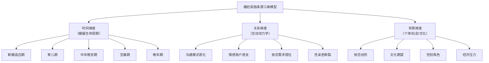
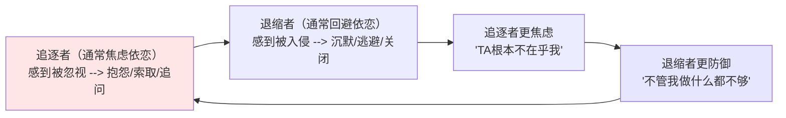

# 婚后孤独感来源与形成机制 (Sources & Formation Mechanisms of Post-Marital Loneliness)

## 目录导航

- [一、婚后孤独的特殊性](#一婚后孤独的特殊性)
- [二、婚姻生命周期中的孤独来源](#二婚姻生命周期中的孤独来源)
- [三、关系动力学来源](#三关系动力学来源)
- [四、个体心理来源](#四个体心理来源)
- [五、社会文化来源](#五社会文化来源)
- [六、中国婚姻语境下的特殊来源](#六中国婚姻语境下的特殊来源)
- [七、性与身体亲密相关来源](#七性与身体亲密相关来源)
- [八、来源识别的临床评估框架](#八来源识别的临床评估框架)

---

## 一、婚后孤独的特殊性

### 1.1 为什么婚后孤独比单身孤独更具破坏力

| 维度 | 单身孤独 | 婚后孤独 | 为什么更痛 |
|------|---------|---------|----------|
| **期望落差** | 预期独处是正常的 | "结了婚不应该孤独" | 期望与现实的巨大鸿沟加剧痛苦 |
| **表达困难** | 容易被理解和同情 | "你有家有伴侣还孤独？" | 社会不承认，无法获得支持 |
| **逃避成本** | 可以自由调整生活 | 涉及家庭、孩子、经济 | 被困在产生孤独的关系中 |
| **自我怀疑** | "我还没找到对的人" | "是不是我有问题？" | 归因于自身缺陷的可能性更大 |
| **羞耻感** | 社会接受度较高 | "连最亲密的人都不理解我" | 深层羞耻和失败感 |

### 1.2 婚后孤独的三维来源模型

---

## 二、婚姻生命周期中的孤独来源

### 2.1 各阶段核心来源分析

| 婚姻阶段 | 时间段 | 核心孤独来源 | 典型表现 | 高风险信号 |
|---------|--------|------------|---------|----------|
| **新婚适应期** | 0-2年 | 理想化破灭、生活习惯冲突、角色转换压力 | "怎么结了婚TA变了一个人" | 频繁冲突后的冷战 |
| **育儿初期** | 孩子0-6岁 | 夫妻时间被育儿完全占据、产后抑郁、角色从"夫妻"变为"父母" | "我们只谈孩子，再没有属于我们两个人的对话" | 性生活消失、分房睡 |
| **学龄儿童期** | 孩子6-18岁 | 生活被孩子课业占据、工作事业高压、夫妻各忙各的 | "我们像两条平行线" | 下班不想回家 |
| **中年倦怠期** | 结婚10-20年 | 关系惯性、激情消退、中年危机、意义感流失 | "室友式婚姻""像合伙人" | 外遇倾向、工作逃避 |
| **空巢过渡期** | 孩子离家后 | 失去"为了孩子"的关系粘合剂、面对彼此的真实关系状态 | "孩子走了才发现我们多年没有真正交流过" | 突然提出离婚 |
| **退休共处期** | 退休后 | 长时间共处放大矛盾、各自社交圈萎缩 | "成天对着TA，比上班时更孤独" | 抑郁、酒精依赖 |

### 2.2 育儿期孤独的深度分析

**育儿期是婚后孤独的高发阶段：**

| 来源因素 | 机制 | 性别差异 | 被忽视的原因 |
|---------|------|---------|------------|
| **物理时间被剥夺** | 婴幼儿照料消耗所有时间精力 | 母亲通常承担更多 | "有了孩子就是这样的" |
| **对话内容窄化** | 只讨论孩子、家务、开支 | 双方均受影响 | "不谈孩子谈什么呢？" |
| **身体触碰变质** | 被孩子"触碰耗竭"后不想再被碰 | 母亲更显著 | "别碰我"不是不爱 |
| **社交圈骤缩** | 产后与朋友联系减少 | 母亲更显著 | "带孩子哪有时间社交" |
| **角色冲突** | "好妈妈/爸爸"与"伴侣"角色的冲突 | 双方 | "孩子第一"的道德绑架 |
| **疲劳与耗竭** | 慢性睡眠不足导致情绪调节能力下降 | 双方 | 以为"等孩子大了就好了" |

### 2.3 空巢期孤独的来源拆解

| 空巢期来源 | 深层机制 | 表现 |
|-----------|---------|------|
| **粘合剂消失** | 孩子是维系关系的唯一议题 | 孩子走后"无话可说" |
| **关系真相暴露** | 多年回避的情感疏离无处可藏 | "原来我们早就形同陌路" |
| **自我丧失** | 多年以"父母"角色为主，个人身份模糊 | "孩子不需要我了，我是谁？" |
| **伴侣重新相遇** | 发现眼前的人已经"变成了陌生人" | "我不认识TA了" |

---

## 三、关系动力学来源

### 3.1 沟通模式恶化

**Gottman "四骑士"与婚后孤独的关系：**

| 沟通毒素 | 在婚后孤独中的表现 | 孤独感产生机制 | 长期后果 |
|---------|-----------------|-------------|---------|
| **批评 (Criticism)** | "你总是...你从来不..." | 被攻击者感到不被接纳 | 关闭自我表达 |
| **蔑视 (Contempt)** | 翻白眼、讽刺、冷嘲热讽 | 被轻视者感到不值得被爱 | 深层羞耻与退缩 |
| **防御 (Defensiveness)** | "不是我的问题，是你自己..." | 双方都感到不被理解 | 对话变成攻防战 |
| **石墙 (Stonewalling)** | 沉默、不回应、假装没听到 | 被"石墙"的一方感到被遗弃 | 情感关系的实质死亡 |

### 3.2 情感账户的慢性透支

**Gottman "情感银行账户"模型：**

| 存款行为 (减少孤独) | 取款行为 (增加孤独) | 危险阈值 |
|-------------------|-------------------|---------|
| 眼神接触、微笑 | 看手机不看对方 | 取款/存款比 > 1:5 |
| 主动问"你今天怎么样？" | 下班回家直接进房间 | 表明关系处于危险区 |
| 记住对方说过的事 | 忘记重要的日子和承诺 | |
| 表达欣赏和感谢 | 视对方的付出为理所当然 | |
| 在对方需要时放下手中事 | "等一下""我在忙" | |

### 3.3 依恋需求的错位与追逃循环

**追逃循环 (Pursue-Withdraw Cycle) 是婚后孤独最常见的互动模式：**

| 角色 | 深层依恋需求 | 表面表现 | 对方的误读 | 孤独体验 |
|------|------------|---------|----------|---------|
| **追逐者** | "我需要确认你爱我" | 追问、抱怨、发脾气 | "TA太缠人/太控制了" | "我拼命想靠近，TA却越跑越远" |
| **退缩者** | "我需要安全空间" | 沉默、回避、冷处理 | "TA根本不在乎" | "我不知道怎么做才对，干脆关闭" |

### 3.4 权力不平衡与隐形控制

| 权力不平衡形式 | 孤独产生机制 | 被控制方的体验 |
|-------------|------------|-------------|
| **经济控制** | 经济依赖方丧失关系中的议价能力 | "我不敢说不，因为我需要TA养我" |
| **情感操控 (Gaslighting)** | 被否定自身感受的真实性 | "TA说我想太多了，也许是我有问题" |
| **社交隔离** | 被限制与朋友/家人的接触 | "TA不喜欢我和朋友出去" |
| **决策垄断** | 所有重要决定由一方做主 | "我的想法从来不被考虑" |

---

## 四、个体心理来源

### 4.1 依恋创伤的重新激活

| 原生家庭经历 | 在婚姻中的激活方式 | 导致的婚后孤独 |
|------------|-----------------|-------------|
| **情感忽视** | 伴侣工作忙不回消息 --> 激活"我不重要"的信念 | 即使对方只是忙，也感到被遗弃 |
| **情感虐待** | 伴侣一次批评 --> 激活"我是坏的"核心信念 | 过度防御或彻底崩溃 |
| **不稳定依恋** | 伴侣任何微小变化 --> 激活"TA要离开我了"的恐惧 | 持续不安全感导致控制或退缩 |
| **角色倒转** | 习惯照顾他人 --> 在婚姻中也只给不取 | "谁来照顾照顾我？" |

### 4.2 未分化的自我 (Bowen)

**自我分化水平低导致的婚后孤独：**

| 低分化表现 | 在婚姻中的影响 | 孤独感机制 |
|-----------|-------------|----------|
| **情绪融合** | 完全依赖伴侣的情绪 | 伴侣不在或心情不好时自己"塌方" |
| **假性自我** | 过度迎合对方期望 | "TA从来不知道真实的我" |
| **三角化** | 引入第三方(孩子/父母/外遇)回避直面二人关系 | 核心关系被稀释 |
| **情绪割离** | 切断情感以自保 | "我不再期待了" --> 深层孤独 |

### 4.3 个人心理需求的发展性变化

| 人生阶段 | 心理需求的变化 | 婚姻中的不同步 | 孤独来源 |
|---------|-------------|-------------|---------|
| **30-35** | 渴望事业成就、自我实现 | 一方聚焦事业，另一方聚焦家庭 | 生活轨迹分叉 |
| **35-45** | 中年意义重构、自我审视 | 一方开始反思，另一方维持现状 | "我在变，TA却停在原地" |
| **45-55** | 渴望深度连接、灵性成长 | 一方精神追求，另一方务实度日 | 精神世界的鸿沟 |
| **55+** | 回顾生命、传承与完整性 | 对婚姻的评价和期望出现根本分歧 | "这一辈子我们真的在一起过吗？" |

---

## 五、社会文化来源

### 5.1 婚姻期望的社会建构

| 社会建构 | 对婚姻的不现实期望 | 落差导致的孤独 |
|---------|-----------------|-------------|
| **灵魂伴侣神话** | "对的人应该不用说就懂我" | 伴侣不"读心"就是不爱 |
| **浪漫爱情永恒** | "真爱应该永远有激情" | 激情自然消退被解读为感情死亡 |
| **完美婚姻形象** | "别人的婚姻看起来那么幸福" | 社交媒体比较加剧不满 |
| **婚姻包治百病** | "结了婚就不会孤独了" | 婚后孤独更难被承认和求助 |

### 5.2 性别角色期望

| 性别期望 | 对男性的影响 | 对女性的影响 | 共同后果 |
|---------|------------|------------|---------|
| **情感表达** | "男人不该软弱" --> 压抑情感需求 | "女人太敏感" --> 需求被贬低 | 双方都无法安全表达 |
| **关系维护** | "赚钱就是爱" --> 忽略情感投入 | "照顾家庭就是爱" --> 自我消耗 | 各自在不同维度努力但彼此看不见 |
| **求助行为** | "男人要自己扛" --> 不求助 | "为了家庭忍一忍" --> 不求助 | 双方都在独自承受 |

### 5.3 社交网络的婚后萎缩

**婚后社交网络萎缩的路径：**

| 萎缩机制 | 具体表现 | 后果 |
|---------|---------|------|
| **夫妻融合** | 婚后放弃各自朋友圈 | 所有社交需求压给一个人 |
| **时间挤压** | 家庭责任挤压社交时间 | 逐渐与朋友失联 |
| **社交过滤** | 只维持"夫妻联合"的社交 | 个人独立关系消失 |
| **搬迁** | 婚后搬到新居住地 | 原有社交网络断裂 |

---

## 六、中国婚姻语境下的特殊来源

### 6.1 中国式婚后孤独的独特来源

| 中国文化因素 | 孤独产生机制 | 典型表现 | 比西方更严重的原因 |
|------------|------------|---------|------------------|
| **婆媳关系** | 夫妻关系被婆媳矛盾侵蚀 | "TA永远站在TA妈那边" | 三代同住或强势原生家庭介入 |
| **面子婚姻** | 为了面子维持不幸福的婚姻 | "离婚太丢人了" | 社会对离婚的污名化 |
| **催生压力** | 生育被外界定义而非夫妻自主 | "什么时候要二胎？" | 家族和社会对生育的强制期望 |
| **经济捆绑** | 房贷、孩子教育、养老形成退出壁垒 | "离不起" | 高房价、高教育投入 |
| **丧偶式育儿** | 父亲角色缺位，母亲独自承担 | "有没有他都一样" | 传统性别分工+996工作文化 |
| **公婆/原生家庭边界不清** | 婚姻不是两个人而是两个家族的事 | "我们从来做不了自己的决定" | 孝道文化+经济依赖 |

### 6.2 特定情境分析

**"丧偶式育儿"的孤独机制：**

| 层面 | 母亲的体验 | 父亲的体验（被忽视的一面） |
|------|----------|---------------------|
| **身体** | 极度疲劳、睡眠不足 | 被排除在育儿之外的无力感 |
| **情感** | "我一个人带孩子，他去哪了？" | "我不够好，干脆别碍事了" |
| **关系** | 对伴侣的怨恨累积 | 对伴侣的抱怨感到无处施力 |
| **社交** | 全部时间被孩子占据 | 用工作逃避家庭但也失去家庭连接 |

---

## 七、性与身体亲密相关来源

### 7.1 性亲密断裂与孤独

| 性亲密问题 | 孤独产生机制 | 性别差异 | 常见误区 |
|-----------|------------|---------|---------|
| **无性婚姻** | 失去最私密的连接渠道 | 男女都会感到孤独但表达方式不同 | "性不重要" |
| **机械性性行为** | 身体在但心不在 | 女性更易感到被物化 | "有做就好了" |
| **性需求不匹配** | 被拒绝方感到不被渴望 | 高欲望方的羞耻和低价值感 | "TA不正常" |
| **身体触碰消失** | 不仅是性，日常亲密触碰也消失 | 对双方的影响同样深远 | "老夫老妻还牵什么手" |
| **产后性生活变化** | 身体恢复 + 角色转换 + 疲劳 | 母亲的复杂感受常被忽视 | "生完孩子就该恢复正常" |

### 7.2 性孤独的隐性表达

| 隐性信号 | 真实含义 | 常被误解为 |
|---------|---------|----------|
| 频繁晚归 | 回家后要面对性的尴尬 | 工作太忙 |
| 各自看手机到深夜 | 避免上床后的沉默 | 睡前习惯 |
| 对身体接触敏感 | 害怕身体接触升级到"不得不面对"的性 | 不喜欢被碰 |
| 一方突然健身/打扮 | 在外界寻求被渴望的感觉 | 注重健康/形象 |

---

## 八、来源识别的临床评估框架

### 8.1 婚后孤独来源诊断问卷

**临床问诊核心问题：**

| 评估维度 | 关键问题 | 识别的来源类型 |
|---------|---------|-------------|
| **关系时间线** | "你们是从什么时候开始感到'不对劲'的？发生了什么？" | 触发事件与阶段性来源 |
| **沟通模式** | "当你想和伴侣谈心里话时，通常会发生什么？" | 沟通恶化模式 |
| **情感安全** | "你觉得在伴侣面前可以安全地展示脆弱吗？" | 依恋安全性 |
| **日常连接** | "过去一周，你们有过非功能性的（不是关于孩子/家务/工作的）对话吗？" | 情感账户状态 |
| **性亲密** | "对于你们目前的身体亲密/性亲密状况，你内心真实感受如何？" | 性孤独来源 |
| **原生家庭** | "你父母的婚姻关系是怎样的？你从中学到了什么？" | 代际传递来源 |
| **个人变化** | "最近这些年你个人有什么重大变化或成长？伴侣知道吗？" | 发展性不同步 |
| **外部压力** | "目前最大的外部压力是什么？它如何影响你们的关系？" | 社会/经济来源 |

### 8.2 来源优先级矩阵

| 紧迫性 / 可改变性 | 高可改变 | 低可改变 |
|-----------------|---------|---------|
| **高紧迫** | 沟通模式、日常连接行为、数字行为 | 经济困境、重大疾病、婆媳冲突 |
| **低紧迫** | 社交网络萎缩、性亲密习惯 | 依恋模式、文化期望、原生家庭影响 |

**临床干预顺序建议**：
1. 先稳定"高紧迫+高可改变"的来源 --> 建立信心
2. 再处理"高紧迫+低可改变"的来源 --> 学习接纳与适应
3. 逐步深入"低紧迫+低可改变"的来源 --> 长期深度工作

---

> **交叉引用**
> - [婚内孤独概览](Marital_Loneliness_Overview.md) - 婚内孤独的整体框架
> - [婚后孤独缓释策略](Marital_Loneliness_Relief.md) - 针对性的缓释方案
> - [婚内孤独临床管理](Marital_Loneliness_Clinical_Management.md) - 专业治疗方案
> - [孤独感来源与病因学](../../../psychology/loneliness/Loneliness_Sources_Etiology.md) - 通用孤独来源框架
> - [孤独感缓释与自助策略](../../../psychology/loneliness/Loneliness_Relief_Mitigation.md) - 通用缓释策略

---

*本文档从婚姻生命周期、关系动力学、个体心理、社会文化和性亲密等多维度系统分析婚后孤独的来源与形成机制，为临床评估和干预方向提供专业指导。*

*Created by Peace Lab Database Project*
*Author: Allen Galler (allengaller@gmail.com)*
