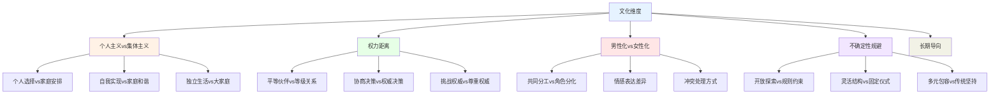
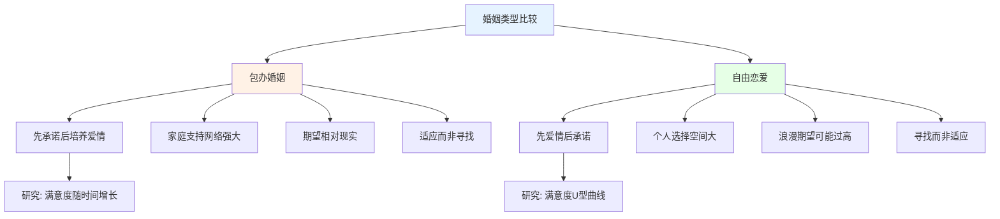
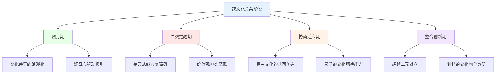

# 跨文化关系深度研究 (Cross-Cultural Relationships Deep Dive)

## 集体主义与个人主义的关系模式

### 文化维度对亲密关系的塑造

#### Hofstede文化维度理论的关系应用

**文化维度与关系模式映射：**

**个人主义与集体主义文化的关系特征对比：**
| 关系维度 | 个人主义文化(欧美) | 集体主义文化(东亚) | 关键差异 | 融合趋势 |
|---------|------------------|------------------|---------|---------|
| **择偶标准** | 浪漫爱情优先 | 家庭背景和匹配度优先 | 感觉vs理性 | 东亚年轻人趋向浪漫优先 |
| **关系目的** | 个人幸福和成长 | 家庭延续和社会整合 | 个体vs集体 | 双重目的日益普遍 |
| **边界管理** | 清晰的私密边界 | 渗透性的家庭边界 | 独立vs互联 | 城市化推动边界清晰化 |
| **冲突处理** | 直接表达和讨论 | 间接暗示和调解 | 直面vs回避 | 全球化推动直接沟通增加 |
| **离婚态度** | 个人选择可接受 | 家庭耻辱需避免 | 自由vs责任 | 东亚离婚率持续上升 |
| **性别角色** | 趋向平等 | 传统分工较强 | 平等vs等级 | 两种文化都在趋向平等 |

### 集体主义文化的亲密关系模式

#### 东亚文化的关系特征

**中国关系文化的深层结构：**
| 文化概念 | 关系含义 | 现代演变 | 代际差异 | 临床意义 |
|---------|---------|---------|---------|---------|
| **面子(Mianzi)** | 维护关系体面和社会声誉 | 从社会面子向个人尊严转变 | 年轻人更重视个人尊严 | 面子问题常是隐性冲突源 |
| **关系(Guanxi)** | 基于互惠的社会网络 | 从关系本位向规则本位演变 | 年轻人更重视个人能力 | 关系网络影响关系支持 |
| **孝道(Xiao)** | 对父母的尊敬和赡养义务 | 从绝对服从向理性关爱转变 | 年轻人边界意识增强 | 孝道冲突是常见治疗议题 |
| **缘分(Yuanfen)** | 命中注定的关系连接 | 浪漫化程度降低但仍影响认知 | 年轻人更相信个人选择 | 缘分信念可缓冲关系压力 |

#### 日本的"甘え"(Amae)文化

**甘え心理学在关系中的应用：**
- 甘え指在亲密关系中依赖他人的被宠爱期望
- Doi (1973) 认为甘え是日本人际关系的核心概念
- 健康的甘え促进亲密感和安全感
- 过度的甘え导致关系依赖和边界问题
- 现代日本社会中甘え的性别差异逐渐缩小

## 包办婚姻与现代演变

### 包办婚姻(Arranged Marriage)的心理学分析

#### 包办婚姻的类型光谱

**婚姻安排形式的光谱：**
| 类型 | 定义 | 决策权 | 父母角色 | 个人意愿 | 现代分布 |
|------|------|--------|---------|---------|---------|
| **强制婚姻** | 完全由父母决定 | 父母独占 | 决定者 | 无选择权 | 违法但存在 |
| **传统包办** | 父母主导安排 | 父母为主 | 主导者 | 有限参与 | 农村地区仍常见 |
| **半包办** | 父母介绍子女选择 | 协商决策 | 推荐者 | 最终同意权 | 城市中产阶级主流 |
| **自主介绍** | 子女主导父母祝福 | 个人为主 | 建议者 | 充分选择权 | 受教育群体普遍 |
| **完全自主** | 个人完全自主决定 | 个人独占 | 知情者 | 完全自主 | 年轻一代主流 |

#### 包办婚姻的心理优势与挑战

**包办婚姻vs自由恋爱的比较研究：**

**Myers et al. (2005) 印度研究发现：**
- 包办婚姻的满意度随时间推移而上升
- 自由恋爱婚姻的满意度在初期高但逐渐下降
- 两组在10-15年后的满意度趋于相近
- 文化适应和家庭支持是关键调节变量

### 现代中国的相亲文化

#### 相亲市场的社会学分析

**当代中国相亲的形式与特征：**
| 相亲形式 | 平台/场所 | 参与者特征 | 匹配标准 | 成功率 |
|---------|---------|-----------|---------|--------|
| **公园相亲角** | 公共场所 | 父母代子女 | 学历收入房车 | 极低(<5%) |
| **婚介机构** | 专业服务 | 中年离异或急于婚配 | 综合条件匹配 | 中等(10-20%) |
| **网络平台** | 世纪佳缘、百合网 | 各年龄层 | 算法推荐+筛选 | 低-中等 |
| **同事介绍** | 工作社交圈 | 职场人士 | 知根知底优势 | 较高(20-30%) |
| **校友圈** | 校友网络 | 受教育群体 | 学历背景匹配 | 较高 |

## 跨文化恋爱与婚姻

### 跨文化关系的发展阶段

#### 跨文化关系适应模型

**跨文化关系的发展轨迹：**

**跨文化关系中的关键协商议题：**
1. **语言使用** - 家庭中使用哪种语言、子女的语言教育
2. **饮食文化** - 日常饮食的融合与各自的保留
3. **宗教信仰** - 不同的宗教实践和子女的宗教教育
4. **育儿方式** - 教育理念、管教方式的文化差异
5. **节日庆祝** - 双方传统节日的安排和重视程度
6. **财务管理** - 经济观念差异和家庭财务决策
7. **家庭边界** - 与各自原生家庭的距离和互动频率

### 混血家庭的身份建构

#### 混血子女的发展心理学

**混血儿童(Multiracial Children)的身份发展：**
| 发展阶段 | 年龄 | 主要任务 | 挑战因素 | 支持策略 |
|---------|------|---------|---------|---------|
| **早期觉察** | 3-5岁 | 注意到家庭中的文化差异 | 归类困惑 | 开放讨论差异 |
| **身份探索** | 6-10岁 | 开始理解多重文化身份 | 同伴压力 | 肯定双重身份 |
| **认同整合** | 11-15岁 | 整合多重文化身份 | 社会归类压力 | 提供身份模型 |
| **自主定义** | 16-20岁 | 自主选择身份表达方式 | 社会期待冲突 | 支持自主选择 |
| **成熟整合** | 20+岁 | 形成独特的多元文化身份 | 社会偏见应对 | 持续的社区支持 |

## 全球化对关系的影响

### 文化全球化与关系趋同

#### 全球化背景下的关系变革

**全球关系趋势的趋同与分化：**
| 趋势维度 | 全球趋同方向 | 文化抵抗力量 | 结果形态 |
|---------|-------------|-------------|---------|
| **择偶自由** | 个人选择权增加 | 家庭传统压力 | 折中式自主 |
| **性别平等** | 伙伴关系趋向平等 | 传统性别角色惯性 | 渐进式改善 |
| **结婚年龄** | 普遍推迟 | 生育时间压力 | 晚婚但并非不婚 |
| **离婚态度** | 接受度提高 | 宗教和文化禁忌 | 谨慎但可能 |
| **同居** | 婚前同居普遍化 | 传统文化反对 | 隐蔽性增加 |
| **数字化约会** | 全球使用约会应用 | 本地化匹配偏好 | 技术本地化 |

---

*本文件从集体主义与个人主义文化维度、包办婚姻演变、跨文化恋爱和全球化影响等角度深度分析跨文化关系，为理解文化因素在亲密关系中的核心作用提供学术框架。*
