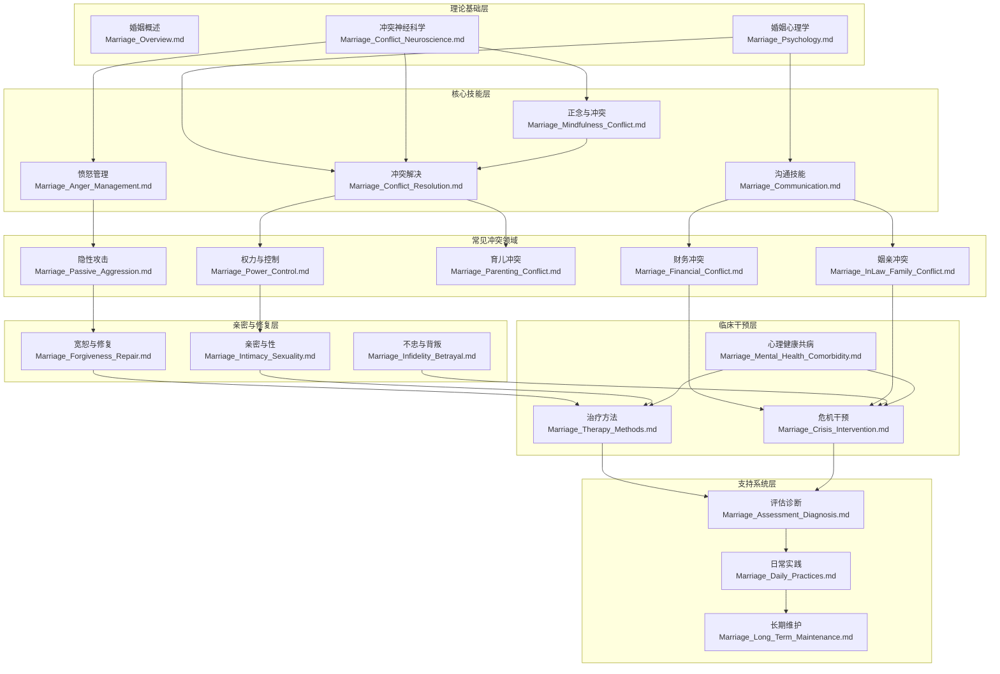

# 夫妻相处知识网络与交叉引用系统 (Marriage Knowledge Network & Cross-references)

## 知识体系架构图

## 核心概念交叉引用网络

### 1. 依恋理论知识网络

| 核心文档 | 涉及依恋内容 | 交叉关联 |
| --- | --- | --- |
| [婚姻心理学](婚姻心理学.md) | 四种成人依恋类型详解、依恋互动模式表、原生家庭传递 | → Conflict_Resolution（依恋相关冲突）、Therapy_Methods（EFT 依恋修复） |
| [冲突解决](婚姻ConflictResolution.md) | 依恋相关冲突识别、追逃模式（Pursuer-Distancer） | → Psychology（依恋根源）、Conflict_Neuroscience（依恋安全的神经基础） |
| [冲突神经科学](婚姻Conflict神经科学.md) | Coan 手握实验、依恋安全感对杏仁核反应的调节 | → Psychology（依恋类型）、Mindfulness_Conflict（共同调节练习） |
| [治疗方法](婚姻疗法Methods.md) | EFT 三阶段详解、依恋损伤修复、IFS 中流放者-管理者-消防员的依恋动力 | → Forgiveness_Repair（AIRM 依恋损伤修复）、Crisis_Intervention（依恋创伤下的危机） |
| [宽恕与修复](婚姻ForgivenessRepair.md) | Johnson 的 AIRM 五步依恋损伤修复协议 | → Therapy_Methods（EFT 框架）、Intimacy_Sexuality（性创伤与依恋安全） |
| [评估诊断](婚姻评估诊断.md) | ECR-R 依恋量表 | → Psychology（依恋类型解读） |

### 2. 沟通模式知识网络

| 核心文档 | 涉及沟通内容 | 交叉关联 |
| --- | --- | --- |
| [婚姻沟通](婚姻沟通.md) | Gottman 四骑士、NVC 完整框架、元沟通、冲突后修复对话、婚姻阶段沟通 | → Conflict_Resolution（冲突中的沟通技巧）、Passive_Aggression（石墙的沟通维度） |
| [冲突解决](婚姻ConflictResolution.md) | 冲突中的沟通技巧表、Gottman "冲突中的梦想"完整脚本 | → Communication（技术来源）、Mindfulness_Conflict（正念沟通） |
| [隐性攻击](婚姻PassiveAggression.md) | 石墙（Stonewalling）作为沟通阻断、六种间接敌意形式 | → Communication（四骑士中的石墙）、Anger_Management（压抑愤怒的沟通表达） |
| [正念与冲突](婚姻正念Conflict.md) | S.T.O.P. 正念沟通技术、R.A.I.N. 技术应用于夫妻对话 | → Communication（正念沟通整合）、Conflict_Neuroscience（正念对前额叶的激活） |

### 3. 冲突处理知识网络（扩展版）

| 核心文档 | 涉及冲突内容 | 交叉关联 |
| --- | --- | --- |
| [冲突解决](婚姻ConflictResolution.md) | 六步技术、Thomas-Kilmann 冲突风格、干预脚本示范、案例分析 | → 所有冲突领域文件、Conflict_Neuroscience（冲突的生理基础） |
| [冲突神经科学](婚姻Conflict神经科学.md) | 杏仁核劫持、多迷走神经理论、皮质醇/催产素动力、神经可塑性 | → Conflict_Resolution（为什么冲突技巧失效的生理解释）、Mindfulness（正念如何改变神经通路） |
| [财务冲突](婚姻FinancialConflict.md) | Klontz 金钱脚本、财务不忠、收入差距、中国文化特殊议题（彩礼、房产） | → Power_Control（经济控制）、Crisis_Intervention（财务危机） |
| [姻亲冲突](婚姻InLawFamilyConflict.md) | 忠诚冲突、三角化、婆媳关系、有边界的孝道 | → Conflict_Resolution（姻亲冲突干预脚本）、Psychology（原生家庭影响） |
| [育儿冲突](婚姻育儿Conflict.md) | 教养风格分歧、协同育儿模型、鸡娃文化、隔代教养 | → Conflict_Resolution（育儿分歧干预脚本）、InLaw_Family（三代同堂动力） |
| [权力与控制](婚姻PowerControl.md) | 煤气灯操纵、强制控制、French & Raven 权力基础 | → Crisis_Intervention（家暴筛查）、Passive_Aggression（隐性权力操作） |
| [隐性攻击](婚姻PassiveAggression.md) | 战略性无能、冷暴力、惩罚性石墙 | → Communication（石墙详解）、Anger_Management（压抑型愤怒） |
| [愤怒管理](婚姻Anger管理.md) | 愤怒类型学、容纳技术、建设性表达框架 | → Conflict_Neuroscience（愤怒的神经机制）、Mindfulness（正念愤怒管理） |

### 4. 治疗方法知识网络

| 治疗方法 | 核心文档 | 交叉引用 |
| --- | --- | --- |
| EFT 情绪聚焦疗法 | [治疗方法](婚姻疗法Methods.md) | → Psychology（依恋类型）、Forgiveness_Repair（AIRM）、Conflict_Neuroscience（EFT 的神经改变机制） |
| Gottman 方法 | [治疗方法](婚姻疗法Methods.md) | → Communication（四骑士详解）、Conflict_Resolution（冲突中的梦想）、Daily_Practices（声音关系之屋日常实践） |
| IFS 内部家庭系统 | [治疗方法](婚姻疗法Methods.md) | → Anger_Management（愤怒作为消防员部分）、Psychology（内在工作模式与IFS部分的映射） |
| ACT 接纳承诺疗法 | [治疗方法](婚姻疗法Methods.md) | → Mindfulness_Conflict（ACT 与正念的整合）、Power_Control（控制议程的解构） |
| 图式疗法 | [治疗方法](婚姻疗法Methods.md) | → Psychology（原生家庭与图式形成）、Power_Control（屈从/特权图式互锁）、Infidelity（遗弃图式与外遇脆弱性） |
| Discernment Counseling | [治疗方法](婚姻疗法Methods.md) | → Crisis_Intervention（"一方想走一方想留"的危机处理）、Infidelity（外遇后的方向决策） |

### 5. 心理健康与婚姻交叉网络

| 核心文档 | 涉及内容 | 交叉关联 |
| --- | --- | --- |
| [心理健康共病](婚姻心理健康共病.md) | 抑郁-婚姻双向模型、焦虑、PTSD/C-PTSD、人格障碍（BPD/NPD/OCPD）、ADHD、物质滥用 | → Crisis_Intervention（共病增加危机风险）、Therapy_Methods（共病情况下的治疗选择） |
| [冲突神经科学](婚姻Conflict神经科学.md) | 皮质醇对免疫系统的影响、慢性冲突的身体健康后果 | → Mental_Health（躯体化共病）、Psychology（压力与婚姻模型） |
| [危机干预](婚姻危机干预.md) | 自杀风险评估、C-SSRS 应用、安全计划 | → Mental_Health（自杀风险的共病因素）、Power_Control（家暴情境下的复合风险） |

### 6. 亲密、性与修复知识网络

| 核心文档 | 涉及内容 | 交叉关联 |
| --- | --- | --- |
| [亲密与性](婚姻亲密性学.md) | Basson 循环模型、双控制模型、色情影响、性创伤、感觉聚焦 2.0 | → Conflict_Neuroscience（创伤的神经基础）、Mindfulness（正念性治疗）、Power_Control（性强迫） |
| [宽恕与修复](婚姻ForgivenessRepair.md) | Enright 四阶段、Worthington REACH、Gottman Atone-Attune-Attach、文化维度 | → Crisis_Intervention（外遇后修复协议）、Therapy_Methods（宽恕在各流派中的位置） |
| [不忠与背叛](婚姻出轨Betrayal.md) | 背叛创伤、多维度出轨模型 | → Crisis_Intervention（外遇后PTSD协议）、Forgiveness_Repair（信任重建） |

### 7. 正念与东方智慧整合网络（Peace Lab 特色）

| 核心文档 | 涉及内容 | 交叉关联 |
| --- | --- | --- |
| [正念与冲突](婚姻正念Conflict.md) | 关系正念、S.T.O.P./R.A.I.N. 技术、慈悲冥想、佛教/道家/儒家智慧、ACT 整合 | → Conflict_Neuroscience（正念改变默认模式网络）、Anger_Management（正念愤怒管理）、Therapy_Methods（ACT 六角模型） |
| [婚姻心理学](婚姻心理学.md) | 神经可塑性与关系模式——正念如何改变"硬连线"的互动模式 | → Conflict_Neuroscience（记忆再巩固）、Mindfulness（正念作为神经可塑性干预） |
| [宽恕与修复](婚姻ForgivenessRepair.md) | 佛教、儒家、道家宽恕智慧表 | → Mindfulness_Conflict（Thich Nhat Hanh 的"重新开始"仪式） |

## 实用工具交叉引用系统

### 评估工具使用路径

**基础评估流程：**
1. [简易关系温度计](婚姻评估诊断.md) - 日常关系监测
2. [沟通模式观察](婚姻评估诊断.md) - 互动模式识别（→ Communication 四骑士识别）
3. [依恋风格自评](婚姻评估诊断.md) - 依恋类型确认（→ Psychology 依恋类型详解）
4. [冲突风格评估](婚姻ConflictResolution.md) - Thomas-Kilmann 冲突风格自评（新增）
5. 专业标准化量表评估

**进阶评估工具：**
- DAS-II 婚姻调适量表 → 全面关系质量评估
- Gottman 比率编码 → 互动观察金标准
- ECR-R 依恋量表 → 依恋风格筛查
- C-SSRS → 自杀风险结构化评估（→ Crisis_Intervention 自杀风险部分）
- VSA 评估清单 → 脆弱性-压力-适应三维度评估（→ Psychology VSA 模型）

### 干预技术应用路径

**预防性干预：**
- [婚前准备策略](婚姻预防预防.md) - 风险因素识别
- [日常实践指南](婚姻DailyPractices.md) - 预防性日常习惯
- [正念冲突预防](婚姻正念Conflict.md) - 正念练习建立情绪弹性（新增）
- [长期维护策略](婚姻LongTermMaintenance.md) - 持续关系投资

**治疗性干预（按理论取向）：**
- EFT 情绪聚焦 → [治疗方法](婚姻疗法Methods.md)（依恋修复核心技术）
- Gottman 方法 → [治疗方法](婚姻疗法Methods.md)（关系技能训练）
- IFS 内部家庭系统 → [治疗方法](婚姻疗法Methods.md)（部分工作与 U-Turn 技术，新增）
- ACT 接纳承诺 → [治疗方法](婚姻疗法Methods.md)（心理灵活性六角模型，新增）
- 图式疗法 → [治疗方法](婚姻疗法Methods.md)（早期适应不良图式，新增）
- Discernment Counseling → [治疗方法](婚姻疗法Methods.md)（混合意向夫妻，新增）

**危机干预路径：**
- [危机预警识别](婚姻危机干预.md) - 黄/橙/红三级预警系统
- [自杀风险评估](婚姻危机干预.md) - C-SSRS 应用与安全计划（新增）
- [外遇后创伤协议](婚姻危机干预.md) - Glass"窗与墙"三阶段修复（新增）
- [紧急降级脚本](婚姻危机干预.md) - 四个危机场景的治疗师对话脚本（新增）

### 按问题导向的文档检索指南

| 来访者呈现的问题 | 首选参考文档 | 补充参考文档 |
| --- | --- | --- |
| "我们总是吵架" | Conflict_Resolution, Communication | Anger_Management, Conflict_Neuroscience |
| "他/她从不听我说话" | Communication（NVC, 元沟通）, Passive_Aggression | Psychology（追逃模式） |
| "为钱的事总是争论" | Financial_Conflict | Power_Control（经济控制维度） |
| "婆婆总是干涉我们" | InLaw_Family_Conflict | Conflict_Resolution（姻亲冲突脚本） |
| "我们对孩子教育看法不同" | Parenting_Conflict | Conflict_Resolution（育儿分歧脚本） |
| "他/她出轨了" | Crisis_Intervention（外遇协议）, Infidelity_Betrayal | Forgiveness_Repair, Intimacy_Sexuality |
| "我想离婚/对方想离婚" | Therapy_Methods（Discernment Counseling）, Crisis_Intervention | Psychology（VSA 评估） |
| "我们没有性生活/性不和谐" | Intimacy_Sexuality（Basson 模型, 感觉聚焦） | Mindfulness_Conflict（正念身体觉察） |
| "他/她控制我" | Power_Control | Crisis_Intervention（家暴筛查） |
| "一方有抑郁/焦虑" | Mental_Health_Comorbidity | Therapy_Methods（治疗选择）, Psychology（VSA 模型） |
| "我无法原谅他/她" | Forgiveness_Repair | Mindfulness_Conflict（慈悲冥想） |
| "他/她总是冷暴力" | Passive_Aggression, Anger_Management | Communication（石墙解毒剂） |
| "我们在考虑离婚" | [Divorce_Decision_Psychology](离婚心理/离婚决策心理学.md)（决策过程） | Therapy_Methods（Discernment Counseling）、Crisis_Intervention |
| "离婚后孩子怎么办" | [Divorce_Impact_Children](离婚心理/离婚ImpactChildren发展.md)、[Children_Support](离婚心理/离婚ChildrenSupport干预.md) | [Coparenting](离婚心理/离婚Coparenting沟通.md)（共同育儿） |
| "离婚后无法和前任沟通" | [Coparenting_Communication](离婚心理/离婚Coparenting沟通.md)（BIFF沟通、平行育儿） | [Family_Rebuilding](离婚心理/离婚FamilyRebuilding.md) |
| "离婚后想重新开始" | [Family_Rebuilding](离婚心理/离婚FamilyRebuilding.md)（个人重建、再婚融合） | Forgiveness_Repair |

## 跨领域知识整合

### 与心理学其他领域的连接

**发展心理学：**
- 儿童发展影响 → 子女对夫妻关系的影响（→ Parenting_Conflict 育儿冲突）
- 青少年发展 → 青春期家庭关系挑战（→ InLaw_Family_Conflict 代际关系）
- 离婚对子女发展影响 → 分年龄段多维度分析（→ [Divorce_Impact_Children_Development](离婚心理/离婚ImpactChildren发展.md)）
- 离婚家庭子女干预 → 循证干预项目与危机支持（→ [Divorce_Children_Support_Intervention](离婚心理/离婚ChildrenSupport干预.md)）
- 共同育儿与沟通 → 离婚后的育儿合作（→ [Divorce_Coparenting_Communication](离婚心理/离婚Coparenting沟通.md)）

**临床心理学：**
- 抑郁焦虑共病 → [心理健康共病](婚姻心理健康共病.md)（新增专题文件）
- 创伤处理 → [亲密与性](婚姻亲密性学.md)（性创伤与婚姻，新增板块）
- 人格障碍 → [心理健康共病](婚姻心理健康共病.md)（BPD/NPD/OCPD 与婚姻互动）

**神经科学：**
- 情感神经科学 → [冲突神经科学](婚姻Conflict神经科学.md)（新增专题文件）
- 多迷走神经理论 → [冲突神经科学](婚姻Conflict神经科学.md)（Polyvagal Theory 在婚姻中的应用）
- 神经可塑性 → [婚姻心理学](婚姻心理学.md)（新增板块：关系模式的神经编码与改变）

**社会心理学：**
- 社会支持系统 → 外部支持对关系的作用
- 文化因素 → [姻亲冲突](婚姻InLawFamilyConflict.md)（中国文化孝道与婆媳关系）、[财务冲突](婚姻FinancialConflict.md)（彩礼、房产文化）

### 与 Peace Lab 核心领域的整合

**正念与冥想：**
- [正念与冲突](婚姻正念Conflict.md) — Peace Lab 签名整合文件
- 慈悲冥想在婚姻中的应用（Metta, Tonglen, 重新开始仪式）
- ACT 正念六角模型的夫妻适用（→ Therapy_Methods）

**东方哲学智慧：**
- 佛教四圣谛映射婚姻苦难（→ Mindfulness_Conflict）
- 缘起法则应用于冲突循环分析（→ Mindfulness_Conflict）
- 道家无为与阴阳平衡（→ Mindfulness_Conflict）
- 儒家恕道、修身、知止、中庸在婚姻中的应用（→ Mindfulness_Conflict、Forgiveness_Repair）

**个人成长：**
- 自我慈悲 → 个人自我关怀对关系的影响
- 情绪智力 → [婚姻心理学](婚姻心理学.md)（新增板块：EI 四维度与夫妻练习）

## 专业资源导航系统

### 治疗师培训路径

**入门级（基础胜任力）：**
- [婚姻概述](婚姻总览.md) - 婚姻关系基本概念与生命周期
- [婚姻沟通](婚姻沟通.md) - 基础沟通技术（Gottman 四骑士、NVC）
- [评估诊断](婚姻评估诊断.md) - 标准化评估方法
- [婚姻心理学](婚姻心理学.md) - 依恋理论、认知偏差、VSA 模型

**进阶级（专业深化）：**
- [治疗方法](婚姻疗法Methods.md) - EFT、Gottman、IFS、ACT、图式疗法
- [冲突神经科学](婚姻Conflict神经科学.md) - 理解干预的神经机制
- [正念与冲突](婚姻正念Conflict.md) - 正念整合取向
- [特殊人群](婚姻特殊人群.md) - 文化敏感性技能

**专家级（复杂案例）：**
- [危机干预](婚姻危机干预.md) - 自杀评估、外遇创伤协议、紧急降级
- [心理健康共病](婚姻心理健康共病.md) - 双重诊断的婚姻治疗
- [权力与控制](婚姻PowerControl.md) - 家暴筛查与安全评估
- [宽恕与修复](婚姻ForgivenessRepair.md) - 深度创伤修复工作

### 大众自助资源导航

**初学者路径：**
- [婚姻概述](婚姻总览.md) - 理解关系基本概念
- [日常实践](婚姻DailyPractices.md) - 简单易行的日常技巧
- [评估诊断](婚姻评估诊断.md) - 简易自我评估方法

**特定问题路径（参照上方"按问题导向的文档检索指南"表格）**

**危机应对路径：**
- [危机干预](婚姻危机干预.md) - 危机预警信号识别与急救箱
- [治疗方法](婚姻疗法Methods.md) - Discernment Counseling（犹豫期辨识咨询）
- [婚姻资源](婚姻资源.md) - 紧急资源获取与治疗师选择指南

---

## 知识更新与维护机制

### 内容更新策略

**定期审查周期：**
- 核心理论文档：每年审查更新
- 实践技术文档：每半年审查更新
- 评估工具文档：根据最新研究更新
- 特殊人群文档：根据社会变化更新

**更新触发机制：**
- 新研究发表
- 临床实践反馈
- 用户需求变化
- 社会文化变迁

### 质量控制体系

**内容准确性保障：**
- 同行评议机制
- 实证研究支撑
- 专家审核流程
- 用户反馈循环

**实用性和可操作性：**
- 临床验证测试
- 用户体验调研
- 技术可行性评估
- 文化适应性检查

---

### 本模块文件清单（32 个核心文件）

| 类别 | 文件 | 行数（约） | 状态 |
| --- | --- | --- | --- |
| **理论基础** | Marriage_Overview.md | 100 | 原有 |
| | Marriage_Psychology.md | 277 | 已深化 |
| | Marriage_Conflict_Neuroscience.md | 270 | 新建 |
| **核心技能** | Marriage_Communication.md | 275 | 已深化 |
| | Marriage_Conflict_Resolution.md | 404 | 已深化 |
| | Marriage_Anger_Management.md | 316 | 新建 |
| | Marriage_Mindfulness_Conflict.md | 450 | 新建 |
| **冲突领域** | Marriage_Financial_Conflict.md | 400 | 新建 |
| | Marriage_InLaw_Family_Conflict.md | 449 | 新建 |
| | Marriage_Parenting_Conflict.md | 378 | 新建 |
| | Marriage_Power_Control.md | 383 | 新建 |
| | Marriage_Passive_Aggression.md | 314 | 新建 |
| **亲密与修复** | Marriage_Intimacy_Sexuality.md | 300+ | 已深化 |
| | Marriage_Forgiveness_Repair.md | 400 | 新建 |
| | Marriage_Infidelity_Betrayal.md | 63 | 原有 |
| **临床干预** | Marriage_Therapy_Methods.md | 267 | 已深化 |
| | Marriage_Crisis_Intervention.md | 359 | 已深化 |
| | Marriage_Mental_Health_Comorbidity.md | 390 | 新建 |
| **支持系统** | Marriage_Assessment_Diagnosis.md | — | 原有 |
| | Marriage_Daily_Practices.md | — | 原有 |
| | Marriage_Long_Term_Maintenance.md | — | 原有 |
| | Marriage_Couple_Relationship.md | — | 原有 |
| | Marriage_Cultural_Perspectives.md | — | 原有 |
| | Marriage_Special_Populations.md | — | 原有 |
| | Marriage_Prevention_Prevention.md | — | 原有 |
| | Marriage_Resources.md | — | 原有 |
| **离婚心理学** | divorce-psychology/Divorce_Decision_Psychology.md | 203 | 新建 |
| | divorce-psychology/Divorce_Impact_Children_Development.md | 161 | 新建 |
| | divorce-psychology/Divorce_Children_Support_Intervention.md | 148 | 新建 |
| | divorce-psychology/Divorce_Coparenting_Communication.md | 260 | 新建 |
| | divorce-psychology/Divorce_Family_Rebuilding.md | 260 | 新建 |
| **导航** | INDEX.md | 107 | 已重构 |
| | Marriage_Knowledge_Network.md | — | 已重写 |

---

## 📞 危机干预资源 | Crisis Resources

> **如果您或您认识的人正在经历心理危机或有自杀念头,请立即寻求帮助。**

### 中国大陆

| 资源 | 联系方式 |
|---|---|
| 北京心理危机研究与干预中心 | **010-82951332** (24小时) |
| 全国心理援助热线 | **400-161-9995** (24小时) |
| 希望24热线 | **400-161-9995** (24小时) |
| 生命热线 | **400-821-1215** (24小时) |

### 国际

| 地区 | 资源 | 联系方式 |
|---|---|---|
| 🇺🇸 美国 | 988 Suicide & Crisis Lifeline | **988** (24/7) |
| 🇬🇧 英国 | Samaritans | **116 123** (24/7) |
| 🇭🇰 香港 | 撒玛利亚防止自杀会 | **2389-0000** |
| 🇹🇼 台湾 | 生命线 | **1995** |

**完整资源列表**:[_meta/docs/CRISIS_RESOURCES.md](../../../_meta/docs/CRISIS_RESOURCES.md)

**全球资源**:[Befrienders Worldwide](https://www.befrienders.org) | [WHO 心理健康](https://www.who.int/health-topics/mental-health)

