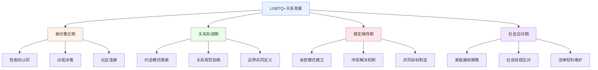
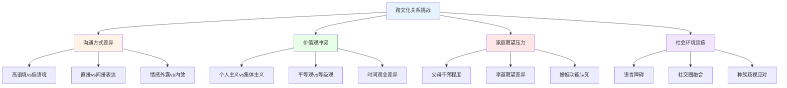
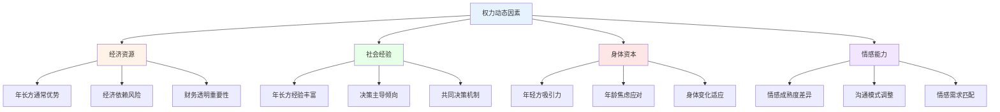

# 多元化群体关系深度指南 (Relationships Diverse Populations Guide)

## LGBTQ+关系的心理学研究

### 性少数群体亲密关系的独特模式

#### 同性关系的动力学特征

**LGBTQ+关系的发展阶段：**


**同性关系与异性关系的关键差异：**
| 比较维度 | 同性关系 | 异性关系 | 研究发现 |
|---------|---------|---------|---------|
| **角色分工** | 更平等、灵活 | 常受性别角色影响 | Kurdek (2005): 同性关系更平等 |
| **冲突解决** | 更少回避、更直接 | 存在性别差异 | 同性伴侣冲突频率更低但处理更积极 |
| **亲密质量** | 情感连接强度相当 | 情感连接强度相当 | 关系满意度无显著差异 |
| **社会支持** | 外部支持较少 | 外部支持较充分 | 缺乏社会支持是主要压力源 |
| **关系稳定性** | 与婚姻平等地区相当 | 统计上较稳定 | 制度性支持影响稳定性 |

#### 性别认同与关系动态

**跨性别者的关系挑战：**
- 性别转换过程中伴侣关系的调整与适应
- 身体形象变化对亲密关系的影响
- 社会歧视对关系质量的侵蚀效应
- 医疗决策中的伴侣参与和协商

**非二元性别者的关系模式：**
- 超越传统性别框架的平等互动
- 代词使用和身份尊重的日常实践
- 在二元性别主导社会中的关系导航
- 独特的家庭分工和角色协商方式

### 双性恋与泛性恋的关系经验

#### 双重边缘化的挑战

**双性恋_erasure (Bisexual Erasure) 的关系影响：**
| 表现形式 | 具体描述 | 对关系的影响 | 应对策略 |
|---------|---------|-------------|---------|
| **身份否定** | 被视为"过渡阶段" | 伴侣怀疑忠诚度 | 身份肯定沟通 |
| **文化隐形** | 媒体中缺乏代表 | 关系不被认可 | 社区支持建立 |
| **健康差异** | 医疗系统忽视 | 健康风险增加 | 主动医疗倡导 |
| **社区排斥** | 不被LGBTQ+或异性恋群体完全接纳 | 社交孤立感增强 | 双性恋社区参与 |

#### 泛性恋的关系哲学

**泛性恋(Pansexual)的核心信念：**
- 吸引力基于个体特质而非性别
- 关系定义超越性别二元框架
- 对伴侣身份变化的开放态度
- 挑战传统性取向分类体系

## 跨文化伴侣关系

### 文化差异对关系的影响机制

#### 文化碰撞的核心议题

**跨文化伴侣的典型挑战：**


**跨文化关系的适应策略矩阵：**
| 适应领域 | 挑战表现 | 成功策略 | 失败模式 |
|---------|---------|---------|---------|
| **语言沟通** | 语义误解、情感表达受限 | 双语学习、情感词汇共享 | 假设对方理解、拒绝学习 |
| **饮食文化** | 饮食习惯、餐桌礼仪冲突 | 轮流体验、创新融合 | 贬低对方文化饮食 |
| **节庆传统** | 不同的节日重要性 | 共同庆祝双方节日 | 只坚持己方传统 |
| **育儿理念** | 教育方式和文化传承分歧 | 取长补短、创造新传统 | 固守单一文化标准 |
| **性别角色** | 对男女职责的不同期待 | 协商分工、超越刻板印象 | 强加己方文化规范 |

#### 文化混搭的关系优势

**跨文化关系的独特收益：**
1. **认知灵活性增强** - 持续的文化切换训练思维弹性
2. **世界观的拓展** - 通过伴侣获得新的文化视角
3. **适应能力提升** - 面对不同文化环境的快速调整能力
4. **创造性思维** - 文化碰撞激发创新解决方案
5. **子女的多元优势** - 双文化背景儿童的认知和社交优势

### 移民伴侣的特殊议题

#### 移民身份对关系的压力

**移民伴侣的压力源分析：**
| 压力维度 | 具体表现 | 对关系的影响 | 缓冲因素 |
|---------|---------|-------------|---------|
| **法律不确定性** | 签证依赖关系 | 权力不平等 | 独立签证途径 |
| **经济困境** | 就业资格受限 | 经济压力传导 | 职业技能转化 |
| **社会孤立** | 支持网络缺失 | 过度依赖伴侣 | 社区连接建立 |
| **身份认同危机** | 文化归属感混乱 | 伴侣间理解障碍 | 双文化身份整合 |
| **语言障碍** | 表达能力受限 | 沟通效率降低 | 持续语言学习 |

## 年龄差距关系

### 年龄差距关系的心理学分析

#### 不同年龄差距模式的关系特征

**年龄差距关系(Age-Gap Relationships)的分类与特征：**
| 年龄差距 | 常见动态 | 潜在挑战 | 发展优势 |
|---------|---------|---------|---------|
| **5岁以内** | 生活阶段相近 | 差异感知较少 | 共同成长空间大 |
| **5-10岁** | 代际差异显现 | 生活节奏不同 | 经验传承互补 |
| **10-20岁** | 明显代际差异 | 社会评判压力 | 互补性显著 |
| **20岁以上** | 跨代关系特征 | 生命规划差异 | 深层互补可能 |

#### 年龄差距关系的权力动态

**权力平衡分析：**


#### 成功年龄差距关系的要素

**关系满意度预测因素：**
1. **共同价值观优先** - 价值观一致性比年龄更重要
2. **平等沟通机制** - 避免父母-子女式的互动模式
3. **社会支持建设** - 建立跨年龄的友谊网络
4. **未来规划协调** - 退休、健康、家庭规划的前瞻性讨论
5. **独立身份维护** - 避免过度依赖或过度保护

## 多边恋与关系伦理

### 多边恋(Polyamory)的理论与实践

#### 多边恋的定义与类型

**关系形式光谱：**
| 关系类型 | 定义特征 | 参与者共识 | 情感结构 | 常见挑战 |
|---------|---------|-----------|---------|---------|
| **多边恋** | 多个知情同意的亲密关系 | 全面知情同意 | 多重情感连接 | 时间精力分配 |
| **开放式关系** | 主要关系外允许其他性关系 | 规则明确限定 | 主次关系分明 | 嫉妒管理 |
| **三人关系** | 三人之间的平等亲密关系 | 三方共同同意 | 三角情感结构 | 平等维护困难 |
| **多边网络** | 相互关联的多重关系网络 | 网络内透明沟通 | 复杂关系图谱 | 界限管理复杂 |

#### 多边恋的伦理原则

**多边恋的核心伦理框架：**
```
伦理四原则：
□ 知情同意 (Informed Consent) - 所有参与者充分了解关系结构
□ 诚实透明 (Honesty & Transparency) - 信息开放共享不隐瞒
□ 自主权尊重 (Autonomy) - 每个人有选择和退出的权利
□ 关怀责任 (Care & Responsibility) - 对所有关系中的情感负责
```

#### 嫉妒管理策略

**多边恋中的嫉妒转化框架：**
1. **嫉妒正常化** - 接受嫉妒是正常情感而非道德失败
2. **根源探究** - 识别嫉妒背后的不安全感、恐惧或需求
3. **需求沟通** - 将嫉妒转化为具体需求的表达
4. **安全协议** - 建立增加安全感的行为协议
5. **丰盛心态** - 培养"爱不是零和游戏"的认知模式

### 关系多样性的未来趋势

#### 社会认知的演变

**关系形式的社会接受度变化：**
- 传统一夫一妻制仍占主流但不再是唯一选择
- 年轻一代对关系多样性接受度显著提高
- 法律制度开始关注非传统关系的权利保护
- 学术研究从病理化转向理解多元化的关系模式

---

*本文件从LGBTQ+关系、跨文化伴侣、年龄差距关系和多边恋等多个维度深入探讨多元化群体关系的心理学特征，为理解和尊重关系多样性提供科学依据和实践指导。*
