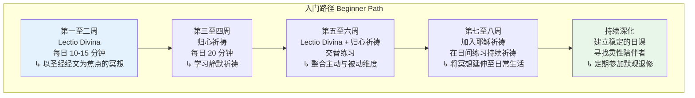

# 基督教冥想概述 | Christian Meditation Overview

> **适用对象**：对基督教灵修传统感兴趣的冥想练习者、神学研究者、跨宗教对话参与者、心理健康从业者
> **阅读时长**：约 50–60 分钟（可分段阅读）
> **实践建议**：配合正文中的阶段性练习，分 4–6 次完成，每次 15–20 分钟
> **最后更新**：2026-05

---

## 一、核心概念

### 1.1 基督教冥想的本质

基督教冥想（Christian Meditation）是基督宗教中一套丰富而多元的灵修实践体系，其核心在于**通过有意识的祈祷和内在安静，与上帝建立更深层的亲密关系**。与东方冥想传统中追求"空"或"无我"不同，基督教冥想从根本上是一种**关系性的实践**——冥想者不是要消解自我，而是要在寂静中聆听上帝的声音，回应上帝的爱。

基督教灵修传统中，"冥想"一词涉及两个互补但可区分的概念：

| 术语 | 拉丁语 | 含义 |
|------|--------|------|
| **默想** | Meditatio | 对经文、教义或神圣真理的有意识的、理智性的反复思考 |
| **默观** | Contemplatio | 超越语言和概念的安静祈祷，在寂静中安住于上帝的临在之中 |

这两个维度共同构成了基督教冥想实践的完整光谱——从主动的、理性的沉思到被动的、直觉性的安住。

### 1.2 基督教冥想的核心神学基础

```mermaid
graph TD
    subgraph 神学基础 Theological Foundations
        T1["道成肉身"<br/>Incarnation<br/>↳ 上帝进入人类历史<br/>物质世界是神圣的] --> T2["内在之神"<br/>Imago Dei<br/>↳ 人按上帝形象所造<br/>内心有神圣的火花"]
        T2 --> T3["圣灵的内住"<br/>Indwelling of the Spirit<br/>↳ 圣灵在内心祈祷<br/>超越言语的叹息"]
        T3 --> T4["与基督联合"<br/>Theosis / Deification<br/>↳ 成为神圣的参与者<br/>与上帝合一"]
    end

    style T4 fill:#fff3e0
```

**关键神学洞见**：

- **上帝的内在性**：上帝不是遥远的造物主，而是"比我们的内在自我更亲近我们"（奥古斯丁，《忏悔录》）。基督教冥想的核心不是"到达"上帝，而是**觉醒到上帝已经临在于内心深处**
- **圣灵的祈祷**：保禄/保罗在《罗马书》8:26 中写道："圣灵亲自以不可言喻的叹息为我们转求。"基督教冥想传统理解这句话为：在静默祈祷中，是圣灵在内心深处祈祷，而非我们的努力
- **与基督的共融**：冥想是与基督建立亲密关系的途径，如同《若望福音》15:4 所说："你们住在我内，我也住在你们内"

### 1.3 心（Heart / Kardia）的概念

在基督教灵修传统中，特别是东正教传统中，**心**（Kardia, καρδία）不仅指情感中心，而是**整个人的深层整合——身体、理智、情感和灵性的交汇之处**。

> "心的纯净使人看见上帝。" —— 《玛窦福音》5:8

心的概念在基督教冥想中具有多重含义：

1. **存在的中心**：心是人最真实、最深层的所在
2. **与上帝相遇的场所**：心是上帝与人之间亲密关系的"内室"（参《玛窦福音》6:6）
3. **需要守护的战场**：如同箴言所说："你要保守你心，胜过保守一切，因为一生的果效是由心发出"（箴言 4:23）
4. **被转化的对象**：通过冥想和祈祷，心被圣灵逐渐转化——从石心变为肉心（参《厄则克耳》36:26）

---

## 二、历史与传统

### 2.1 沙漠教父与教母的遗产（3–5 世纪）

基督教冥想传统的根基深植于 3 至 5 世纪的**沙漠修道运动**。当基督教在罗马帝国成为官方宗教后，许多虔诚的信徒感到教会日益世俗化，选择退入埃及、叙利亚和巴勒斯坦的沙漠，追求与上帝更直接的相遇。

**关键人物及其贡献**：

| 人物 | 时期 | 核心贡献 |
|------|------|---------|
| **安东尼大帝** St. Anthony the Great | 约 251–356 | 退入沙漠与诱惑搏斗；确立"**心之战**"（Spiritual Warfare）的灵修框架 |
| **艾瓦格利乌斯** Evagrius Ponticus | 345–399 | 系统整理**八邪念**（Eight Logismoi），发展出"**警醒**"（Nepsis, νῆψις）的修行方法 |
| **玛喀里** Macarius of Egypt | 约 300–391 | 强调心的纯净和圣灵的内住，提出"心之祈祷"的理念 |
| **约翰·卡西安** John Cassian | 360–435 | 将沙漠传统传入西方修道体系，其著作直接影响本笃会会规 |

**艾瓦格利乌斯的贡献尤为深远**：他提出的八邪念系统（贪食、淫欲、贪财、忧愁、愤怒、懈怠、虚荣、骄傲）后来被教宗大额我略发展为**七宗罪**，而他提出的**警醒**（Nepsis）概念——以持续的觉知守护心灵——成为后来耶稣祈祷和归心祈祷的精神源头。

### 2.2 本笃会传统与 Lectio Divina（6–12 世纪）

**圣本笃**（St. Benedict of Nursia, 约 480–547）的《会规》将沙漠传统转化为西方修道生活的制度框架。本笃会灵修的三大支柱——**祈祷**（Orare）、**工作**（Laborare）、**阅读**（Lectio）——形成了一个循环的灵性节奏。

**Lectio Divina（神圣阅读）** 是本笃会传统的核心冥想实践，由四个递进的阶段组成：

```mermaid
graph LR
    subgraph Lectio Divina 四阶段
        L1["读"<br/>Lectio<br/>↳ 缓慢诵读经文<br/>留意触动自己的词句"] --> L2["默"<br/>Meditatio<br/>↳ 反复咀嚼经文<br/>让意义深入内心"]
        L2 --> L3["祈"<br/>Oratio<br/>↳ 以经文为起点<br/>向上帝祈祷"]
        L3 --> L4["观"<br/>Contemplatio<br/>↳ 安静地安住于<br/>上帝的临在中"]
    end

    L4 -.->|循环| L1

    style L4 fill:#fff3e0
```

### 2.3 耶稣祈祷的传统（5 世纪至今）

**耶稣祈祷**（Jesus Prayer / Prayer of the Heart）是东正教灵修传统中最核心的持续祈祷实践。其标准形式为：

> **"主耶稣基督，上帝之子，求你怜悯我罪人。"**
> （Κύριε Ἰησοῦ Χριστέ, Υἱὲ τοῦ Θεοῦ, ἐλέησόν με τὸν ἁμαρτωλόν.）

这一祈祷最早可追溯到 5 世纪的**尼罗斯山传统**（Athonite tradition），并在 14 世纪的**《菲洛卡利亚》**（Philokalia）中得到系统化。其修行进阶如下：

1. **唇舌之祷**：用口反复诵念
2. **心思之祷**：在心中无声地诵念
3. **心律之祷**：祈祷与心跳节奏同步，成为自发的、不间断的内在祈祷
4. **圣灵之祷**：祈祷超越了人的努力，成为圣灵在内心深处的自发性祈祷

### 2.4 圣女大德兰与圣十字若望（16 世纪）

16 世纪的加尔默罗会改革产生了基督教冥想史上最具深度的灵修著作：

**圣女大德兰**（St. Teresa of Ávila, 1515–1582）在《七宝楼台》（*Interior Castle*）中将心灵的内在旅程描述为进入一座七层城堡的过程：

| 居所 | 状态 | 特征 |
|------|------|------|
| **第一至三居所** | 自我净化 | 通过纪律、祈祷和道德修行净化心灵 |
| **第四居所** | 祈祷的平安 | 开始体验超自然的平安，但仍是初步的 |
| **第五居所** | 神秘联合之始 | 在祈祷中与上帝建立深层的亲密感 |
| **第六居所** | 深度净化 | 经历灵性的"黑夜"——痛苦但必要的净化 |
| **第七居所** | 神灵婚配 | 灵魂与上帝的永恒联合，在三者中生活 |

**圣十字若望**（St. John of the Cross, 1542–1591）在《攀登加尔默罗山》和《心灵的黑夜》中系统阐述了冥想进阶中的**净化阶段**：

> "灵魂若要到达与上帝的联合，必须在欲望和执着上经历彻底的空虚化——不是空虚化意志本身，而是空虚化对受造物的执着，以便唯独充满对造物主的爱。"

### 2.5 现代基督教冥想运动（20 世纪至今）

20 世纪见证了基督教冥想传统的重大复兴：

| 人物/运动 | 贡献 |
|----------|------|
| **托马斯·默顿** Thomas Merton (1915–1968) | 将基督教默观传统与现代思想对话，其《新制的种子》和《默观的种子》将修道院的默观智慧带给普通读者 |
| **若望迈恩** John Main (1926–1982) | 复兴了本笃会的**归心祈祷**传统，创立了普世基督教冥想团体（WCCM） |
| **多玛斯·基廷** Thomas Keating (1923–2018) | 系统化了**归心祈祷**（Centering Prayer）方法，将其发展为现代基督徒可用的冥想框架 |
| **安东尼·布鲁姆** Anthony Bloom (1914–2003) | 将东正教的耶稣祈祷传统介绍给西方平信徒 |
| **理查德·罗尔** Richard Rohr (1943–) | 将基督教默观传统与方济各灵修、生态意识和跨宗教对话结合 |

---

## 三、核心修习方法

### 3.1 Lectio Divina（神圣阅读）

Lectio Divina 是一种以圣经经文为焦点的冥想方法，适合个人和团体实践。

**详细实践步骤**：

1. **准备**（Statio）：选择一段圣经经文（建议从《诗篇》、《福音书》或保罗书信开始），找一个安静的地方，做几次深呼吸安定心神
2. **读**（Lectio）：缓慢地朗读经文 2–3 遍，留意哪个词或短语特别触动你
3. **默**（Meditatio）：将注意力集中在触动你的词句上，反复咀嚼，让意义从理智层面深入到心层面。可以问自己："这段经文在我的生活中意味着什么？"
4. **祈**（Oratio）：以经文激发的情感和思想为起点，向上帝祈祷。这可以是感恩、祈求、忏悔或赞美的祈祷
5. **观**（Contemplatio）：放下所有的话语和思想，安静地安住在上帝的临在中。不需要做任何事，只是"在"
6. **行动**（Actio）：以这段冥想为基础，带着新的觉知回到日常生活中

**推荐经文**：
- 《圣咏/诗篇》23、42、63、91、139
- 《若望/约翰福音》15 章（葡萄树的比喻）
- 《罗马书》8 章（圣灵的祈祷）
- 《斐理伯/腓立比书》4:4–8

### 3.2 归心祈祷（Centering Prayer）

归心祈祷由多玛斯·基廷神父在 1970 年代系统化，其灵感来源于《未知的云》（*The Cloud of Unknowing*）等中世纪神秘主义文本。

**核心原则**：归心祈祷不是一种"做"的方法，而是一种"**同意**"上帝临在和行动的方式。

**实践步骤**：

1. **选择圣言**：选择一个代表你愿意让上帝在此刻行动的意愿的词（如"爱"、"平安"、"耶稣"、"慈悲"）
2. **安坐**：舒适地坐下，闭眼，静默片刻，意识到上帝的临在
3. **诵念圣言**：在心中轻轻诵念你选择的词，作为向上帝表达你愿意在此的象征
4. **应对分心**：当思绪涌起时（这是正常的，不是失败），不要与之抗争，轻轻回到你的圣言
5. **结束**：20 分钟后（可用柔和的计时器），保持静默 2 分钟，缓慢睁开眼睛，以主祷文结束

**实践节奏**：建议每日两次，每次 20 分钟，早晨一次，午后或傍晚一次。

### 3.3 耶稣祈祷（Jesus Prayer）

耶稣祈祷是东正教传统中最古老的持续祈祷实践，也被越来越多的西方基督徒所采用。

**基本形式**：
> "主耶稣基督，上帝之子，求你怜悯我。"（可根据个人情况调整长度）

**与呼吸的配合**：

| 呼吸阶段 | 诵念内容 |
|---------|---------|
| 吸气 | "主耶稣基督，上帝之子" |
| 呼气 | "求你怜悯我" |

**进阶修行**：

1. **固定时间练习**（每日 15–30 分钟）：安静坐着，配合呼吸诵念
2. **日间练习**：在行走、工作间隙随时诵念，使之成为背景性的祈祷
3. **心之祈祷**：祈祷逐渐从有意识的诵念变为内心自发的振动
4. **注意**：深层的耶稣祈祷修行（特别是涉及心轮区域的观想）建议在经验丰富的灵性导师指导下进行

### 3.4 基督教正念

近年来，一些基督教学者和实践者发展出将**基督教信仰与正念实践相结合**的方法。这与世俗正念不同，其核心区别在于：

| 维度 | 世俗正念 | 基督教正念 |
|------|---------|-----------|
| **焦点** | 当下的觉知 | 当下的觉知中对上帝临在的开放 |
| **态度** | 不评判的观察 | 不评判的观察 + 对神圣引导的信赖 |
| **目的** | 减压、心理健康 | 更深地与上帝共融 |
| **伦理框架** | 普世伦理 | 基督教美德（信、望、爱） |

**基督教正念练习**：

1. **临在练习**（Abiding Practice）：安静坐着，意识到"我在这里，上帝也在这里"，在觉知中安住于这个双重事实
2. **感恩扫描**（Gratitude Scan）：类似身体扫描，但焦点是在身体和心灵的每个层面寻找上帝恩典的痕迹
3. **受造物默观**（Contemplation of Creation）：以弗朗西斯的传统，在自然万物中"阅读"上帝的"第二本书"——自然

---

## 四、实践指南

### 4.1 初学者入门路径



### 4.2 日课建议

基督教冥想传统强调**日常节奏**的重要性。以下是一个参考日课：

| 时段 | 练习 | 时长 | 说明 |
|------|------|------|------|
| **晨起** | 晨间祈祷 + Lectio Divina | 15–20 分钟 | 以圣经经文开始新的一天 |
| **午前** | 耶稣祈祷 | 10–15 分钟 | 在日间工作中插入短暂的祈祷 |
| **午后** | 归心祈祷 | 20 分钟 | 在午后安静时段进行静默祈祷 |
| **傍晚** | 回顾祈祷（省察） | 10–15 分钟 | 回顾一天中上帝的临在与缺席 |
| **夜间** | 安息祈祷 | 5–10 分钟 | 以信任和交托结束一天 |

### 4.3 灵性陪伴与指引

基督教传统中，**灵性陪伴**（Spiritual Direction / Accompaniment）是冥想修行的重要组成部分。灵性陪伴者不是心理治疗师或顾问，而是一位**帮助你辨识上帝在你生活中的临在和行动**的同行者。

选择灵性陪伴者的标准：

1. 有深厚的个人祈祷生活
2. 接受过灵性陪伴的训练
3. 自己有灵性陪伴者（即"谁陪伴陪伴者"）
4. 尊重你的独特旅程，不将自己的经验强加于你
5. 能够保守你分享的秘密

### 4.4 退修（Retreat）

定期参加**默观退修**（Contemplative Retreat）是基督教冥想传统的重要组成部分。退修通常持续 1–10 天，期间参与者：

- 保持静默（或大部分时间静默）
- 每日进行多次祈祷和冥想
- 与灵性陪伴者进行个别会谈
- 参加团体礼拜
- 在自然中散步和反思

---

## 五、现代应用与研究

### 5.1 心理健康领域的应用

基督教冥想实践在心理健康领域得到了越来越多的研究关注：

- **归心祈祷与焦虑**：Fox 等人（2016）的研究发现，规律练习归心祈祷 8 周后，参与者的焦虑和压力水平显著降低
- **Lectio Divina 与创伤恢复**：结合圣经叙事的冥想被用于帮助创伤幸存者重构其生命故事
- **耶稣祈祷与心率变异性**：Bernardi 等人（2001）发现，诵念耶稣祈祷（以及瑜伽的 Om 诵念）可以增强呼吸性窦性心律不齐，改善自主神经系统的调节
- **基督教冥想与抑郁**：多名研究者发现，结合基督教信仰维度的正念干预比世俗正念对信仰基督的抑郁患者更有效（Hathaway & Tan, 2009）

### 5.2 神经科学研究

| 研究领域 | 发现 |
|---------|------|
| **默认模式网络** | 归心祈祷中，默认模式网络的活跃度降低，表明自我指涉思维的减少 |
| **脑电波** | 耶稣祈祷和归心祈祷练习者在冥想中表现出显著的前额叶 alpha 和 theta 波活动 |
| **脑结构变化** | 长期冥想的修道士和修女表现出前额叶皮层和脑岛区域的灰质密度增加 |
| **情绪调节** | 基督教冥想者表现出更强的前额叶对杏仁核的调节能力 |

### 5.3 跨宗教对话

基督教冥想传统在现代跨宗教对话中扮演重要角色。托马斯·默顿与达赖喇嘛的对话、多玛斯·基廷与佛教禅师的对话，都证明了不同冥想传统之间的相互学习是可能的。基督教冥想者可以从佛教学习精确的觉知技术，佛教徒可以从基督教学习爱的神秘主义的深度表达。

---

## 六、注意事项与建议

### 6.1 安全须知

1. **灵性危机**：冥想中可能出现强烈的情绪、内在冲突或"灵性黑暗"——这可能是正常的净化过程，但如果持续且严重影响日常生活，应寻求灵性陪伴者和心理健康专业人士的帮助
2. **避免灵性逃避**：不应以冥想替代面对现实问题或寻求必要的心理治疗
3. **团体支持**：冥想不应完全孤立进行，建议在信仰团体中实践
4. **身体照顾**：基督教冥想尊重身体作为"圣灵的殿"，不应忽视身体健康

### 6.2 常见误区

| 误区 | 正确理解 |
|------|---------|
| "冥想是东方宗教的专利" | 基督教有自己深厚而古老的冥想传统，可追溯至沙漠教父 |
| "冥想就是要放空大脑" | 基督教冥想不是"空"，而是对上帝临在的"满"——以专注取代杂念 |
| "必须有特殊的灵性体验才算成功" | 冥想的效果不取决于体验的强度，而在于对上帝爱的忠诚 |
| "冥想与日常生活无关" | 基督教冥想的目的是在日常生活的每一刻中更深层地活出信仰 |
| "我不够'圣洁'，不能冥想" | 冥想正是为了与上帝建立关系——你不需要先变得完美 |

### 6.3 推荐阅读

| 书籍 | 作者 | 说明 |
|------|------|------|
| 《心灵的黑夜》Dark Night of the Soul | 圣十字若望 | 灵性旅程中黑暗与净化的经典论述 |
| 《七宝楼台》Interior Castle | 圣女大德兰 | 心灵内在旅程的系统描绘 |
| 《新制的种子》New Seeds of Contemplation | 托马斯·默顿 | 面向现代读者的基督教默观经典 |
| 《敞开心，敞开灵》Open Mind, Open Heart | 多玛斯·基廷 | 归心祈祷的入门指南 |
| 《菲洛卡利亚》The Philokalia | 多位作者 | 东正教灵修文本汇编，耶稣祈祷的核心文献 |
| Christian Meditation | James Finley | 基督教冥想的现代导论 |

---

> **相关资源**
> - 返回 [INDEX](./INDEX.md)
> - 参见 [基督教默观专业概述](传统-亚伯拉罕宗教-基督教默观-ChristianContemplative总览.md)
> - 参见 [基督教实践指南](传统-亚伯拉罕宗教-基督教默观-Christian实用指南.md)
