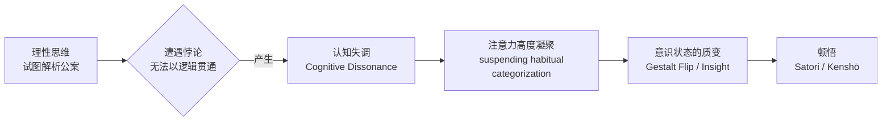
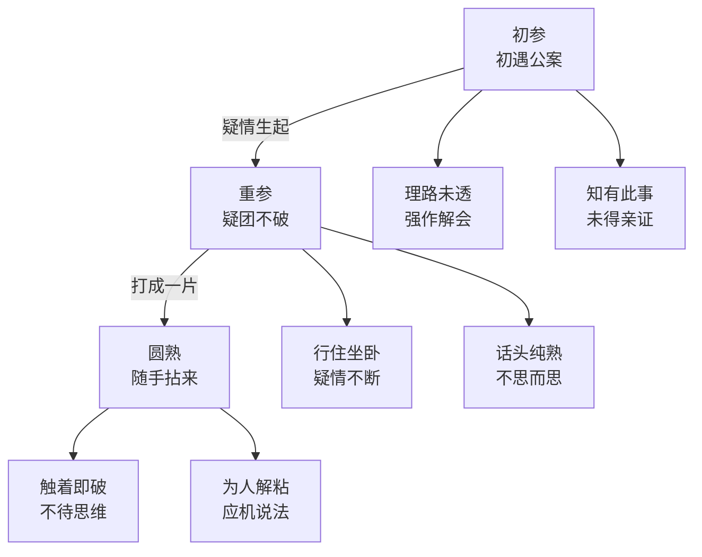

# 坐禅公案集详解

> **最后更新**: 2026-05

---

## 目录

1. [公案的本质与功能](#1-公案的本质与功能)
2. [十个核心公案逐案解析](#2-十个核心公案逐案解析)
3. [公案参究的渐进路径](#3-公案参究的渐进路径)
4. [附录：公案与现代认知科学](#4-附录公案与现代认知科学)

---

## 1. 公案的本质与功能

### 1.1 何为公案

**公案**（Kōan / こうあん）原意为"官府的案牍"，禅宗借指祖师接引学人的言语、动作与典故，成为后世学人参究的"话头"。公案并非哲学命题，而是** designed cognitive dissonance device **——一种精心设计的心灵困境，旨在打破逻辑思维的惯性锁链。

> "公案者，佛祖之关键、人天之眼目。" ——《无门关》序

### 1.2 为何有效：认知框架的爆破

| 层面 | 普通思维 | 公案干预 |
|------|---------|---------|
| **逻辑结构** | 二元对立（是/非、有/无） | 瓦解二元，制造逻辑悖论 |
| **语言功能** | 描述、解释、定义 | 指向不可言说之境 |
| **认知目标** | 获取知识、解决问题 | 悬置问题、反转追寻方向 |
| **心理效应** | 舒适区的知识累积 | 认知失调→注意力高度凝聚 |

### 1.3 心理学机制：认知失调→顿悟

**神经科学视角**：公案的悖论性语言激活前额叶皮层的冲突监测网络（anterior cingulate cortex, ACC），当逻辑解析持续失败时，默认模式网络（DMN）的过度自我参照活动被抑制，可能触发γ波同步与整体脑网络的重组——这正是顿悟体验的神经相关物（Jung-Beeman et al., 2004; Kounios & Beeman, 2009）。

---

## 2. 十个核心公案逐案解析

### 2.1 赵州狗子（无字公案）

| 项目 | 内容 |
|------|------|
| **原文** | 僧问赵州："狗子还有佛性也无？" 州云："无。" |
| **日文** | 僧、趙州に問う：「狗子、仏性ありやなしや」州云く「無」。 |
| **出处** | 《无门关》第一则 |

**背景**：
赵州从谂禅师（778–897）为南泉普愿法嗣。按佛教常义，一切众生皆有佛性，狗子亦不应例外。赵州却答"无"，公然违背基本教义。此"无"并非"没有"的否定判断，而是截断思虑的**活句**。

**参究要点**：
- 不思善、不思恶，正当与么时，哪个是明上座本来面目？
- "无"字不是概念，而是一把利刃，斩断"有/无"二边见
- 参此公案时，如猫捕鼠，全副精神凝聚于一"无"字

**常见误区**：
| 误区 | 纠正 |
|------|------|
| 将"无"理解为哲学上的虚无主义 | "无"是活句，非概念；是功用，非义理 |
| 试图解释赵州为何答"无" | 一切解释皆属思量，正是要离却思量 |
| 以"狗子也有佛性"的常识来调和 | 调和即回避矛盾，错失公案锋芒 |

**现代心理学解读**：
此公案构成一个**完美悖论**：学人带着"一切众生有佛性"的信念提问，得到的回答直接摧毁这一信念。这种"belief disconfirmation"引发强烈的认知失调。当学人不再试图解释、不再调和矛盾，而是让"无"成为一个纯粹的知觉对象（如凝视一个无法命名的形状），意识的范畴化功能暂时停摆，可能触发非二元觉知（non-dual awareness）的闪现。

---

### 2.2 庭前柏树子

| 项目 | 内容 |
|------|------|
| **原文** | 僧问："如何是佛祖西来意？" 州云："庭前柏树子。" |
| **日文** | 僧問う「如何にぞ是れ佛祖西来意」州云く「庭前柏樹子」。 |
| **出处** | 《无门关》第三十七则 |

**背景**：
"佛祖西来意"是禅宗最核心的追问——达摩祖师从西方来，究竟传递了什么消息？这是整个禅宗的"终极问题"。赵州的回答却指向庭院中一棵平凡的柏树。

**参究要点**：
- 柏树子即是西来意，西来意即是柏树子——不是比喻，不是象征，是直接的同一
- 问题本身即是答案，答案从未离开问题
- 参"柏树子"时，须见柏树即佛、佛即柏树，无隔无碍

**常见误区**：
| 误区 | 纠正 |
|------|------|
| 认为赵州以自然隐喻佛性 | 不是隐喻，是直接的现量呈现 |
| 在柏树子中寻找隐藏的深意 | 深意即是表意，表意即是深意 |
| 将"西来意"视为一个需要被解释的概念 | 西来意不是一个可被传递的"东西" |

**现代心理学解读**：
从**格式塔心理学**角度，此公案摧毁了"问题-答案"之间的分离结构。学人期待一个超越性的答案（transcendent answer），却得到一个完全内在性的对象（immanent object）。这种"期待落差"迫使意识从"寻找模式"（search mode）切换到"存在模式"（being mode），类似于正念中的"放下追求"（non-striving）。

---

### 2.3 即心是佛

| 项目 | 内容 |
|------|------|
| **原文** | 僧问："如何是佛？" 马祖云："即心是佛。" |
| **日文** | 僧問う「如何にぞ是れ佛」馬祖云く「即心は佛なり」。 |
| **出处** | 《景德传灯录》卷六 |

**背景**：
马祖道一（709–788）为南岳怀让法嗣，开创洪州宗。"即心是佛"是马祖著名的教学，但后期他又说"非心非佛"——这是针对不同根器学人的对治法门。

**参究要点**：
- "心"不是思维心、不是肉团心，而是本来面目
- "即"是直接的、无媒介的、当下的
- 此公案易解难证：人人会说"即心是佛"，几人亲见？

**常见误区**：
| 误区 | 纠正 |
|------|------|
| 将"心"等同于日常的自我意识 | 此心超越能所，非六识分别 |
| 认为"即心是佛"是一种自我肯定/自信 | 佛无"我"相，肯定谁？ |
| 以心理学术语（潜意识、集体无意识）比附 | 比附即是远离，切忌穿凿 |

**现代心理学解读**：
"即心是佛"与当代**具身认知（Embodied Cognition）**有深层共鸣：佛性不在遥远的彼岸，就在当下的身心整体中。但从禅宗立场，"即心是佛"是**存在论陈述**而非**认知论命题**——它不是在说"你可以通过某种方法认识到心是佛"，而是在说"心本来就是佛，与认识与否无关"。

---

### 2.4 狗子佛性（云门版）

| 项目 | 内容 |
|------|------|
| **原文** | 僧问云门："狗子还有佛性也无？" 门云："有。" 僧云："为什么撞入这个皮袋？" 门云："为它知而故犯。" |
| **日文** | 僧問う「狗子、仏性ありやなしや」門云く「有り」... |
| **出处** | 《云门匡真禅师广录》 |

**背景**：
与赵州"无"形成对照，云门文偃（864–949）答"有"，并进一步追问。此公案展示了禅宗教学的**应病与药**：对不同学人，同一问题可以有截然相反的回答。

**参究要点**：
- 赵州"无"与云门"有"，是同是别？
- "知而故犯"：明知是幻，偏作幻人——这是什么境界？
- 参此公案，须透"有""无"两头，见不二义

**常见误区**：
| 误区 | 纠正 |
|------|------|
| 认为云门与赵州矛盾 | 两大师同证一味，应机不同而已 |
| 试图在"有""无"之间做综合判断 | 综合即第三边，仍未出二元 |
| 以"狗子也有佛性"为究竟 | 落于常见，未透祖师意 |

**现代心理学解读**：
云门的"有"与赵州的"无"构成一个**双束缚（Double Bind）**的完整结构（Bateson, 1956）。当学人同时面对两个权威来源的矛盾信息，且被要求必须理解其一致性时，常规的元沟通（meta-communication）框架崩溃。在安全的禅修环境中，这种崩溃可以促成**认知重构**而非病理性的混乱。

---

### 2.5 万里一条铁

| 项目 | 内容 |
|------|------|
| **原文** | 僧问："如何是佛？" 法眼云："汝是慧超。"僧问："如何是佛法大意？" 投子云："佛是化身，法是报身，僧是法身。" 或云："万里一条铁。" |
| **日文** | 万里一條鉄（ばんりいちじょうてつ） |
| **出处** | 《碧岩录》等 |

**背景**：
"万里一条铁"形容全体法界，亘古今而不变，遍十方而无异。如一条铁铸成的万里长墙，无孔无缝、无间断处。

**参究要点**：
- "万里"喻空间之广，"一条铁"喻体性之一
- 千差万别的事相，原来只是一条铁——见差别即见平等
- 此公案重在"体会全体"，非在解析文句

**常见误区**：
| 误区 | 纠正 |
|------|------|
| 将"一条铁"理解为僵化的统一性 | 铁是活泼泼的，非死物 |
| 在"万里"与"一条"之间做数量计较 | 数量概念在此不适用 |
| 认为这是强调"万物一体"的泛神论 | 非神非泛，离却名相 |

**现代心理学解读**：
从**系统论**视角，"万里一条铁"描述的是整体大于部分之和的涌现特性。在深度冥想中，大脑网络的同步化增强（如γ波在全脑的耦合），可能对应于主观上"万物一体"的体验。但禅宗的"一条铁"更进一步——它不仅是一体感，更是**连"一体"的概念也消融**后的赤裸呈现。

---

### 2.6 洗钵去

| 项目 | 内容 |
|------|------|
| **原文** | 僧问赵州："某甲乍入丛林，乞师指示。" 州云："吃粥了也未？" 僧云："吃粥了。" 州云："洗钵去。" |
| **日文** | 僧問う「某甲初めて叢林に入る、師に乞ふ指示せんを」州云く「粥を喫したるや未ざるや」...「洗鉢せよ」 |
| **出处** | 《无门关》第七则 |

**背景**：
学人刚入丛林，渴望得到"佛法大意"的开示。赵州却问吃粥了没有，然后叫他去洗钵。最平常的日常动作，即是最深的佛法。

**参究要点**：
- "洗钵去"不是敷衍，不是转移话题，就是直指
- 佛法不在高处，在洗完的钵中、在当下的动作里
- 参此公案，须于穿衣吃饭处见道

**常见误区**：
| 误区 | 纠正 |
|------|------|
| 认为赵州在暗示"日常即道"的哲理 | 不是哲理，是现量 |
| 将"洗钵"当作一种"正念练习" | 正念有能所，此公案无能所 |
| 觉得赵州不想回答所以随便说一句 | 恰恰是最恳切的回答 |

**现代心理学解读**：
此公案体现了**行动中的心流（Flow in Action）**。契克森米哈伊（Csikszentmihalyi）描述的心流状态——完全沉浸于当下活动、自我意识消失——与"洗钵去"的禅境高度吻合。但禅宗更进一步：心流仍是一种"体验"，而"洗钵去"是**体验的消融**——连"我在心流中"也没有了。

---

### 2.7 干屎橛

| 项目 | 内容 |
|------|------|
| **原文** | 僧问："如何是佛？" 云门云："干屎橛。" |
| **日文** | 僧問う「如何にぞ是れ佛」雲門云く「乾屎橛（かんしくぜつ）」。 |
| **出处** | 《无门关》第二十一则 |

**背景**：
"干屎橛"指厕所中干燥的木片或竹片，古人用以拭粪。以如此卑下、污秽之物指称"佛"，是禅宗** radically iconoclastic **精神的极致体现。

**参究要点**：
- 佛的名号、庄严相好，在此被彻底解构
- 见干屎橛是佛，则一切净秽平等
- 此公案力量极大，但根器不相应者易生邪见

**常见误区**：
| 误区 | 纠正 |
|------|------|
| 认为禅宗主张"佛与粪同等"的虚无主义 | 不是虚无，是超越净秽二边后的平等 |
| 以此公案为借口，轻慢佛像、毁谤三宝 | 大邪见！公案是药，不是许可证 |
| 在情绪上抗拒此公案的"粗恶" | 抗拒即着相，正是要破此相 |

**现代心理学解读**：
"干屎橛"是**神圣性去极化（Desacralization）**的极端操作。伊利亚德（Mircea Eliade）描述的"神圣与世俗"二分，在此被彻底打破。从心理分析角度，这是对"理想化自我"（idealized ego）和"崇高客体"的解构——当佛可以被称作干屎橛，所有的心理投射对象都失去了它们的催眠力量，意识被迫面对"没有任何东西可以被抓住"的赤裸真实。

---

### 2.8 一口吸尽西江水

| 项目 | 内容 |
|------|------|
| **原文** | 庞居士问马祖："不与万法为侣者是什么人？" 祖云："待汝一口吸尽西江水，即与汝道。" |
| **日文** | 龐居士、馬祖に問う「万法と侶とせざる者は何の人ぞ」祖云く「汝が一口にして西江水を吸い尽くすを待ちて、即ち汝に道んず」。 |
| **出处** | 《无门关》第四十一则 |

**背景**：
庞蕴（?–811）为马祖门下著名居士。"不与万法为侣者"——超越一切相对、不与任何事物为伴侣的，是什么人？马祖的回答以不可能完成的任务（一口吸尽长江水）封住了所有口。

**参究要点**：
- "一口吸尽"不是夸张修辞，是现量的全体摄入
- 西江水的浩渺与一口的微小，本来不二
- 此公案重在"能所俱泯"的量感体验

**常见误区**：
| 误区 | 纠正 |
|------|------|
| 将"一口吸尽"理解为菩萨的大愿力 | 不是愿力，是当下的全体 |
| 认为这是马祖在说"你做不到我就不说" | 不是条件句，是直示 |
| 在"一口"与"西江"的大小对比上思维 | 大小是分别，此公案离分别 |

**现代心理学解读**：
此公案涉及**无限与有限**的悖论。在数学中，康托尔证明了无限可以有不同的大小；在禅宗中，"一口"这个极端有限的行为与"西江"这个无限象征的同一，指向了**意识本身的无限性**——意识可以"包含"任何对象而不被对象填满。这类似于康德所说的"无限判断"（infinite judgment），但禅宗不是哲学思辨，而是直接的"做"（doing）。

---

### 2.9 花 Falling，老僧不扫

| 项目 | 内容 |
|------|------|
| **原文** | 南泉因东西两堂争猫儿，泉乃提起云："道得即救取猫儿，道不得即斩却也。" 众无对，泉遂斩之。晚赵州外归，泉举似州，州乃脱履安头上而出。泉云："子若在，即救得猫儿。" |
| **备注** | "花 falling，老僧不扫"为另一著名意象，出自其他机缘，常被与南泉斩猫并论，表"任运自在、不逐境转"之意。 |
| **出处** | 《无门关》第一则（斩猫）/ 散见诸录 |

**背景**：
南泉普愿（748–834）为马祖法嗣。两堂争猫，南泉以斩猫逼令学人"道一句"——这逼迫到了极限。赵州的"脱履安头上"是无言中的全机大用。

**参究要点**：
- 南泉"斩"与赵州"履顶"，是同是别？
- "花 falling，老僧不扫"：境自生灭，心不起念——这是不扫，还是扫了也不见扫？
- 参此公案，须透"死活关"：什么是活句？什么是死句？

**常见误区**：
| 误区 | 纠正 |
|------|------|
| 认为南泉真的在提倡暴力 | 此"斩"是象征，表截断情识 |
| 以"不扫"为消极无为的哲学 | 不是无为，是无为而无不为 |
| 将赵州的动作当作"疯狂"或"表演" | 全机大用，岂是表演？ |

**现代心理学解读**：
南泉的"斩"是一个**极限情境（Limit Situation）**的营造，类似于存在主义心理学中"面对死亡"的觉醒作用。在极端的紧迫感和道德困境中，常规的防御机制和认知策略全部失效，学人被逼到"无处可逃"的绝境——正是在这个绝境中，超越性的觉知可能闪现。赵州的"脱履安头上"则是**荒诞中的自由**——当所有理性回应都失效时，一种完全出乎意料的行动打破了僵局。

---

### 2.10 只手之声

| 项目 | 内容 |
|------|------|
| **原文** | 俱胝和尚，凡有诘问，唯举一指。后有童子，因外人问："和尚说何法要？" 童子亦竖一指。胝闻，以刀断其指，童子叫唤走出，胝召之，童子回首，胝却竖起一指，童子忽然领悟。 |
| **关联公案** | "只手之声"（一只手拍掌是什么声音？）——此原出《无门关》第六则，常被与俱胝竖指并参。 |
| **日文** | 隻手の声（せきしゅのこえ） |
| **出处** | 《无门关》 |

**背景**：
俱胝和尚以"一指禅"闻名。后出"只手之声"公案：以两手拍掌有声，以一手拍掌何声？这是逻辑上不可能回答的问题。

**参究要点**：
- "只手之声"不是无声，也不是有声——离却声与无声二边
- 俱胝断指后竖指，童子领悟：指不是指，指即是道
- 参此公案，须向"不可说处"道一句

**常见误区**：
| 误区 | 纠正 |
|------|------|
| 认为答案是"无声"/"默然" | "无声"仍是概念，不是只手之声 |
| 将"只手"理解为"孤独"的象征 | 不是存在主义哲学，是直指 |
| 觉得俱胝断指太残忍 | 此"残忍"是破执著的极端手段，非真暴力 |

**现代心理学解读**：
"只手之声"是**感官悖论（Sensory Paradox）**的典范。它在听觉模态中创造了一个"不可能对象"（impossible object），类似于视觉中的彭罗斯三角。当大脑无法为这个问题找到任何对应的感官表征时，它被迫面对**表征能力的极限**。这种"表征崩溃"（representational collapse）可能与禅宗所说的"能所双亡"有关——当意识无法"表征"任何东西时，它可能"翻转"回到自身，体验非二元的自觉。

---

## 3. 公案参究的渐进路径

### 3.1 初参（起始阶段）

| 特征 | 表现 | 对治 |
|------|------|------|
| **理路未透** | 以逻辑分析公案，试图"读懂" | 放下书本知识，单提话头 |
| **浮想联翩** | 坐中杂念纷飞，无法凝聚 | 计数呼吸，渐减妄缘 |
| **急躁求成** | 希望快速"开悟" | 深信因果，不求速效 |
| **身体不适** | 腿痛、腰酸、昏沉 | 调身调息，循序渐进 |

### 3.2 重参（深化阶段）

| 特征 | 表现 | 对治 |
|------|------|------|
| **疑情成团** | 话头在胸中滚动，行住不离 | 不可放松，如鸡抱卵 |
| **时散时聚** | 有时清明，有时昏沉 | 不随境转，打成一片 |
| **境界现前** | 光影、异相、身心脱落感 | 凡所有相，皆是虚妄，不可执取 |
| **理障渐薄** | 不再解释，纯然参究 | 水涨船高，自然深化 |

### 3.3 圆熟（成熟阶段）

| 特征 | 表现 | 注意 |
|------|------|------|
| **触境皆如** | 日常动静，无非公案 | 不可自居开悟，仍需保任 |
| **信手拈来** | 用时便有，不用即休 | 不蓄意炫弄，不故作玄妙 |
| **为人解粘** | 能应机接化学人 | 以先觉觉后觉，报佛深恩 |
| **无功用行** | 不参而参，参而不参 | 佛道长远，久久为功 |

---

## 4. 附录：公案与现代认知科学

### 4.1 公案效应的认知模型

| 认知科学概念 | 公案对应 | 禅修表现 |
|-------------|---------|---------|
| **认知失调**（Festinger, 1957） | 公案的悖论结构 | 强烈的内在紧张感、无法释怀 |
| **顿悟**（Insight） | 打破公案 | 突然的"啊！"体验、世界翻转 |
| **注意瞬脱**（Attentional Blink） | 截断意识流 | 一念不生、前后际断 |
| **默认模式网络抑制** | 破除自我参照 | 无我感、主客融合 |
| **预测编码崩溃** | 超越范畴化 | 赤裸的"如是"体验 |

### 4.2 公案参究与正念冥想的核心差异

| 维度 | 正念冥想（Mindfulness） | 公案参究（Kōan Introspection） |
|------|------------------------|------------------------------|
| **核心操作** | 开放或专注地觉察当下经验 | 将全部心力凝聚于一个不可解的问号 |
| **目标导向** | 减压、提升专注力、情绪调节 | 顿悟见性、解脱生死 |
| **与思维的关系** | 观察思维，不追随 | 以思维撞击思维，直至思维爆炸 |
| **情绪处理** | 接纳、不评判 | 转化、超越 |
| **典型体验** | 平静、放松、清晰 | 紧张、疑闷、爆发的狂喜 |
| **文化根源** | 南传上座部/现代心理治疗 | 汉传禅宗/东亚儒学背景 |

> **重要提示**：公案参究需在具格禅师指导下进行。若无明师，不宜盲参，以免引发精神困扰。现代心理学研究（如Lindahl et al., 2017）已记录禅修可能产生的困难体验（challenging experiences），公案参究因其强烈的认知冲突特性，风险尤高。

---

*"若人识得心，大地无寸土。"* —— 古德

---

**关联阅读**：
- [坐禅总览](传统-佛教-坐禅-Zazen冥想总览.md)
- [坐禅实操进阶指南](传统-佛教-坐禅-Zazen实践指南.md)
- [INDEX](INDEX.md)
