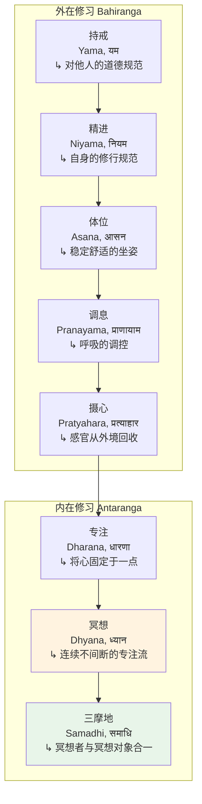
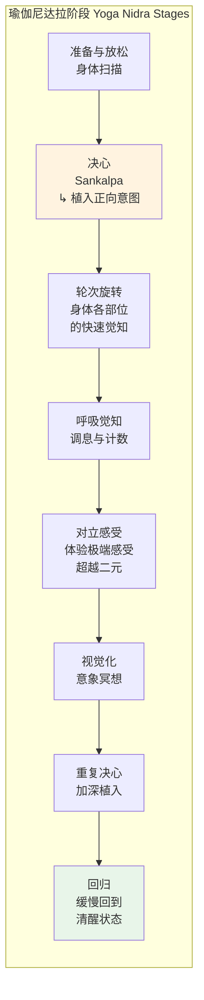
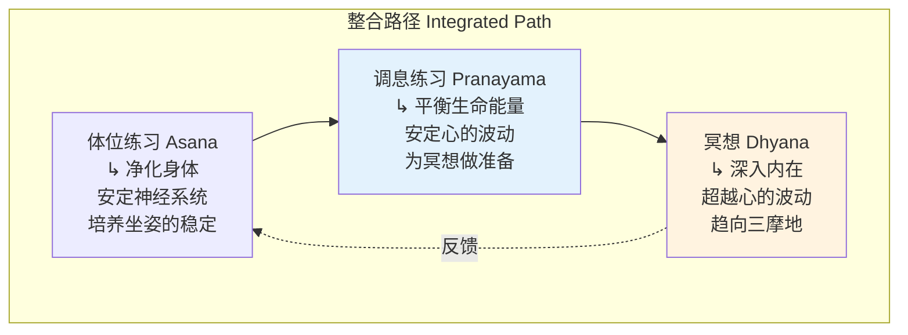

# 瑜伽冥想概述 | Yoga Meditation Overview

> **适用对象**：对瑜伽传统中的冥想体系感兴趣的练习者、瑜伽教师、印度哲学研究者、心理健康从业者
> **阅读时长**：约 50–60 分钟（可分段阅读）
> **实践建议**：配合正文中的阶段性练习，分 4–6 次完成，每次 15–20 分钟
> **最后更新**：2026-05

---

## 一、核心概念

### 1.1 瑜伽冥想的本质

瑜伽冥想（Yoga Meditation）是指源于印度瑜伽传统的一整套冥想修习体系。在西方世界，"瑜伽"通常让人联想到身体姿势（Asana, आसन），但在其本源的传统中，**冥想才是瑜伽的核心**。帕坦伽利（Patañjali, पतञ्जलि）在《瑜伽经》（Yoga Sūtra, योगसूत्र）中将瑜伽定义为：

> "瑜伽是心之波动的止息。"（Yogaś citta-vṛtti-nirodhaḥ, योगश्चित्तवृत्तिनिरोधः）—— 《瑜伽经》1.2

这意味着瑜伽的终极目的不是身体的柔韧或力量，而是**心灵（Citta, चित्त）的彻底转化**——从通常的散乱、执着和痛苦中解脱出来，达到纯净觉知的状态。

### 1.2 八支瑜伽（Ashtanga Yoga）的框架

帕坦伽利的瑜伽体系被称为**八支瑜伽**（Ashtanga Yoga, अष्टाङ्गयोग），冥想是其高级阶段：

注意：体位（Asana）在传统语境中主要指**冥想坐姿**，而非现代瑜伽课中的各种身体姿势。调息（Pranayama）是连接外在修习与内在冥想的关键桥梁。

### 1.3 心（Citta）的运作机制

帕坦伽利详细分析了心（Citta, चित्त）的运作，这构成了瑜伽冥想的理论基础：

| 概念 | 梵文 | 含义 |
|------|------|------|
| **心的波动** | Citta-vṛtti, चित्तवृत्ति | 心灵中不断升起的思想、感受、记忆等心理活动 |
| **五种波动** | Pañca-vṛttayaḥ | 正知、错误知、分别知、睡眠、记忆 |
| **两种练习** | Abhyāsa & Vairāgya | 持续练习与不执着——冥想的两翼 |
| **克里亚** | Kriyā, क्रिया | 净化行动——瑜伽冥想中的主动净化过程 |
| **般若** | Prajñā, प्रज्ञा | 通过冥想生起的超越性的智慧或洞见 |

瑜伽冥想的核心策略是：**不试图压制心的波动，而是通过持续的练习和不执着，让波动自然平息**——如同搅动的水在停止搅动后自然恢复清澈。

### 1.4 三德（Gunas）与心的状态

瑜伽哲学继承了数论派（Sāṃkhya, सांख्य）的三德理论，认为一切物质自然（Prakṛti, प्रकृति）都由三种基本力量构成：

| 三德 | 梵文 | 特质 | 在冥想中的表现 |
|------|------|------|--------------|
| **萨埵** | Sattva, सत्त्व | 纯净、清明、和谐 | 冥想所需的心的状态——清明、平静、有觉知 |
| **剌阇** | Rajas, रजस | 活跃、激动、欲望 | 冥想的障碍——心的散乱、不安、执着 |
| **答摩** | Tamas, तमस | 暗昧、惰性、迟钝 | 冥想的障碍——昏沉、瞌睡、无明 |

冥想的过程本质上是**增加萨埵（纯净）的品质，减少剌阇（激动）和答摩（暗昧）的影响**。这就是为什么瑜伽传统强调饮食、作息和生活方式的调节——它们直接影响心的三德比例。

---

## 二、历史与传统

### 2.1 吠陀与奥义书传统（公元前 1500–500 年）

瑜伽冥想的根源可以追溯到最古老的印度文献——**吠陀**（Veda, वेद）。在《梨俱吠陀》中已经有关于内在修行和超越意识的描述。但真正系统化的冥想理论出现在**奥义书**（Upanishad, उपनिषद्）中。

关键奥义书中的冥想教导：

| 奥义书 | 核心冥想教导 |
|--------|-------------|
| **《卡塔奥义书》** Kaṭha Upaniṣad | 通过控制感官、安住于冥想，认识阿特曼（Atman, आत्मन्，即真我） |
| **《曼杜卡奥义书》** Māṇḍūkya Upaniṣad | 分析意识的四种状态——醒、梦、深眠和第四境（Turiya, तुरीय） |
| **《湿婆奥义书》** Śvetāśvatara Upaniṣad | 描述了冥想的坐姿、呼吸控制和持咒修习 |
| **《唱赞奥义书》** Chāndogya Upaniṣad | "Tat Tvam Asi"（汝即彼）——通过冥想认识个体自我与宇宙本体的同一 |

### 2.2 帕坦伽利与《瑜伽经》（约公元前 2 世纪至公元 5 世纪）

帕坦伽利的《瑜伽经》是瑜伽冥想传统的**奠基性文本**。虽然它只包含 196 条简短的格言（Sutra, सूत्र），但其对冥想理论和实践的论述深刻而精密。

《瑜伽经》中关于冥想的关键概念：

- **三耶摩**（Sañyama, संयम）：专注（Dharana）、冥想（Dhyana）和三摩地（Samadhi）作为一个整体实践
- **般若**（Prajñā）：通过三耶摩生起的超越性洞见
- **法云三摩地**（Dharma-megha-samadhi, धर्ममेघसमाधि）：最高的冥想境界，超越了一切执着
- **独存**（Kaivalya, कैवल्य）：瑜伽的终极目标——觉知（Purusha, पुरुष）完全从物质自然中分离，安住于自身

### 2.3 《薄伽梵歌》中的瑜伽冥想（约公元前 2 世纪）

《薄伽梵歌》（Bhagavad Gītā, भगवद्गीता）整合了多种瑜伽路径，为不同气质的修行者提供了多元化的冥想方式：

| 瑜伽路径 | 梵文 | 核心方法 | 适合人群 |
|---------|------|---------|---------|
| **行动瑜伽** | Karma Yoga, कर्मयोग | 以无私无执的态度行动 | 活跃于世界的人 |
| **知识瑜伽** | Jñāna Yoga, ज्ञानयोग | 通过分辨与冥想认识真我 | 理智倾向的人 |
| **虔信瑜伽** | Bhakti Yoga, भक्तियोग | 以冥想和祈祷与神圣建立爱的关系 | 情感倾向的人 |
| **冥想瑜伽** | Dhyāna Yoga, ध्यानयोग | 系统的坐姿与冥想修习 | 冥想倾向的人 |

《薄伽梵歌》第 6 章特别详细地描述了冥想修习的方法：

> "在一个清净之处，建立一个稳固的座位……坐下来，使身体、颈部和头部保持正直，然后将感官收摄，观照鼻尖……" —— 《薄伽梵歌》6.11–13

### 2.4 密宗瑜伽与哈达瑜伽（6–15 世纪）

**密宗瑜伽**（Tantric Yoga, तांत्रिकयोग）为瑜伽冥想引入了新的维度：身体的能量系统。密宗传统认为人体内有精密的能量通道（Nadi, नाडी）和能量中心（Chakra, चक्र），冥想可以通过激活这些系统来加速灵性觉醒。

**哈达瑜伽**（Hatha Yoga, हठयोग）的经典文献如《哈达瑜伽之光》（*Hatha Yoga Pradipika*, 约 15 世纪）将体位、净化法（Shatkarma, षट्कर्म）、调息和冥想整合为一个完整的修行体系。

---

## 三、核心修习方法

### 3.1 禅那（Dhyana）—— 瑜伽冥想的核心

在帕坦伽利的体系中，**禅那**（Dhyana, ध्यान）是专注（Dharana）的深化：当心能够持续不断地流向冥想对象，不被打断时，专注就转化为冥想。

**专注与冥想的区别**：

| 维度 | 专注（Dharana） | 冥想（Dhyana） |
|------|----------------|---------------|
| **稳定性** | 间歇性的专注，时有分心 | 连续不间断的专注流 |
| **努力感** | 需要较多主动努力 | 努力感减少，更加自然流畅 |
| **比喻** | 如同水滴落在表面 | 如同油持续不断地流注 |
| **持续时间** | 短暂的专注片刻 | 延长的、不间断的觉知流 |

**禅那练习的基本步骤**：

1. **选择冥想对象**：可以是呼吸、一个神圣的意象、一个梵咒（Mantra）、一个几何图形（Yantra）或内在的光
2. **安定身体**：选择一个稳定舒适的冥想坐姿（如莲花坐、至善坐或简单的盘坐）
3. **从调息过渡**：先做 5–10 分钟的调息练习，使心安定下来
4. **开始专注**：将注意力轻轻放在冥想对象上
5. **应对分心**：不评判地注意到分心，温和地将注意力带回来
6. **深化冥想**：当专注变得连续时，放松努力，让冥想自然展开
7. **结束**：缓慢地从冥想中出来，保持片刻的静默

### 3.2 克里亚瑜伽（Kriya Yoga）

**克里亚瑜伽**是一种强调能量转化的冥想方法，在《瑜伽经》2.1 中帕坦伽利首次提及，后经由不同的传承发展出多种形式。现代最著名的是由**拉希里·马哈萨亚**（Lahiri Mahasaya, 1828–1895）传播的克里亚瑜伽，后由**帕拉宏撒·尤迦南达**（Paramahansa Yogananda, 1893–1952）引入西方。

克里亚瑜伽的核心原理是**通过特定的呼吸和能量技术，加速灵性觉醒的进程**。其修行包括：

1. **调息与能量引导**：通过特定的呼吸模式引导生命能量（Prana, प्राण）沿脊柱上下流动
2. **梵咒冥想**：在呼吸过程中内在地诵念神圣的声音（如 Om, ॐ）
3. **观想**：将注意力集中在脊柱内的能量通道上
4. **三个阶段的净化**：身体净化、心理净化和灵性净化

> **注意**：克里亚瑜伽的详细技术通常需要在合格的导师指导下传授，不应仅凭文字描述自行练习。

### 3.3 瑜伽尼达拉（Yoga Nidra）—— 瑜伽睡眠冥想

**瑜伽尼达拉**（Yoga Nidra, योगनिद्रा）意为"瑜伽睡眠"，是一种在保持觉知的同时进入深度放松状态的冥想方法。传统上被认为是意识在醒、梦、深眠之外的第四种状态（Turiya, तुरीय）的修习方式。

**瑜伽尼达拉的典型阶段**：

瑜伽尼达拉的现代形式主要由**萨特亚南达·萨拉斯瓦蒂**（Satyananda Saraswati, 1923–2009）在 20 世纪中叶系统化。

### 3.4 梵咒冥想（Mantra Meditation）

梵咒（Mantra, मन्त्र）冥想是瑜伽传统中最普遍的冥想形式之一。"Mantra"由"man"（心）和"tra"（保护/超越）组成，意为**保护心灵超越世俗束缚的工具**。

**瑜伽中常用的梵咒**：

| 梵咒 | 梵文 | 含义与用途 |
|------|------|----------|
| **Om** | ॐ | 宇宙的根本声音，一切梵咒的基础 |
| **Om Namah Shivaya** | ॐ नमः शिवाय | 对湿婆的敬拜，转化与觉醒的力量 |
| **Om Mani Padme Hum** | ॐ मणिपद्मे हूँ | 虽源自佛教，在瑜伽传统中也广泛使用 |
| **Gayatri Mantra** | गायत्री मन्त्र | 最古老的吠陀梵咒之一，祈求灵性光明 |
| **So Hum** | सोऽहम् | "我即彼"，配合呼吸的自然梵咒 |

**梵咒冥想的方法**：

1. **出声诵念**（Vaikhari, वैखरी）：大声诵念，适合初学者
2. **低语诵念**（Upamshu, उपांशु）：低声诵念，只有自己能听到
3. **心中诵念**（Manasa, मानस）：在心中无声地诵念
4. **超越诵念**（Para, पर）：梵咒融入觉知本身，不再是有意识的"做"

### 3.5 体位-调息-冥想的整合

瑜伽冥想的独特之处在于其强调**体位→调息→冥想**的递进关系。这三者不是独立的练习，而是一个有机的整体：

**整合练习的建议流程**：

1. 体位练习 20–30 分钟（根据个人需要调整）
2. 调息练习 5–10 分钟（如交替鼻孔呼吸 Nadi Shodhana）
3. 冥想 15–30 分钟
4. 以静默和感恩结束

---

## 四、实践指南

### 4.1 初学者入门路径

### 4.2 日课建议

| 时段 | 练习 | 时长 | 说明 |
|------|------|------|------|
| **晨起** | 体位 + 调息 + 冥想 | 30–45 分钟 | 以完整的瑜伽练习开始新的一天 |
| **午间** | 短暂调息或梵咒 | 5–10 分钟 | 在工作间隙进行简短的内在练习 |
| **午后** | 瑜伽尼达拉 | 20–30 分钟 | 深度放松和恢复 |
| **晚间** | 温和体位 + 冥想 | 15–20 分钟 | 放松一天的压力，为睡眠做准备 |

### 4.3 冥想坐姿指南

选择合适的冥想坐姿是瑜伽冥想的基础：

| 坐姿 | 梵文 | 难度 | 说明 |
|------|------|------|------|
| **简易坐** | Sukhasana, सुखासन | 初级 | 交叉双腿，适合初学者 |
| **至善坐** | Siddhasana, सिद्धासन | 中级 | 一脚跟抵会阴，另一脚放在前方 |
| **莲花坐** | Padmasana, पद्मासन | 高级 | 双脚交叉放在对侧大腿上，经典冥想坐姿 |
| **椅子坐** | — | 初级 | 坐在椅子上，双脚平放地面——完全可接受的替代方案 |

**关键原则**：脊柱自然挺直，身体放松而不懈怠，舒适而不昏沉。如有膝盖或髋关节问题，请使用坐垫或椅子。

### 4.4 常见障碍与应对

| 障碍 | 梵文 | 表现 | 应对方法 |
|------|------|------|---------|
| **疾病** | Vyadhi | 身体不适影响冥想 | 先通过体位和调息改善身体健康 |
| **懈怠** | Styana | 缺乏修行动力 | 回忆冥想的目的和好处，建立规律习惯 |
| **怀疑** | Samsaya | 对修行路径产生疑问 | 研读经典，与导师和同修交流 |
| **疏忽** | Pramada | 不认真对待修行 | 设定明确的修行时间和空间 |
| **怠惰** | Alasya | 身心沉重，昏沉 | 加强体位练习，注意饮食，保证充足睡眠 |
| **执着** | Avirati | 对感官享乐的执着 | 练习不执着（Vairagya），逐渐减少对外在刺激的依赖 |
| **错误认知** | Bhranti-darshana | 误解冥想体验 | 保持谦逊，与有经验的导师交流 |
| **退步** | Alabdha-bhumikatva | 无法达到之前的冥想深度 | 接受波动是正常的，持续练习 |

---

## 五、现代应用与研究

### 5.1 心理健康领域的应用

瑜伽冥想（特别是体位-调息-冥想的整合模式）在心理健康领域已有大量研究支持：

- **焦虑与压力**：多项元分析表明，整合瑜伽练习（包含冥想成分）可以显著降低焦虑和压力水平（Pascoe et al., 2017）
- **抑郁**：瑜伽冥想作为辅助治疗，可以降低轻度至中度抑郁的症状严重程度（Cramer et al., 2017）
- **创伤后应激障碍**： trauma-sensitive yoga 结合冥想已被证明对 PTSD 患者有效（van der Kolk et al., 2014）
- **睡眠障碍**：瑜伽尼达拉被研究发现可以改善睡眠质量，减少失眠症状

### 5.2 神经科学研究

| 研究领域 | 发现 |
|---------|------|
| **脑结构** | 长期瑜伽冥想者表现出前额叶皮层、脑岛和海马体的灰质密度增加（Gothe et al., 2019） |
| **默认模式网络** | 冥想中默认模式网络活跃度降低，与自我指涉思维的减少相关 |
| **自主神经系统** | 调息练习（特别是交替鼻孔呼吸）可以增强副交感神经系统活性 |
| **炎症标志物** | 规律的瑜伽冥想练习与降低的炎症标志物（如 IL-6、CRP）水平相关 |
| **端粒长度** | 一些初步研究表明，长期的瑜伽冥想练习可能与端粒长度的保护有关 |

### 5.3 瑜伽冥想的现代变体

| 变体 | 创始人/来源 | 特点 |
|------|-----------|------|
| **整合瑜伽** Integral Yoga | 斯瓦米·萨奇达南达 | 整合体位、调息、冥想、梵咒和虔信 |
| **超觉静坐** TM | 玛哈礼希·玛赫西·优济 | 使用个人专属梵咒的简便冥想方法 |
| **维尼瑜伽** Viniyoga | T.K.V. 德西卡恰 | 根据个人需要定制的瑜伽练习 |
| **昆达里尼瑜伽** Kundalini Yoga | Yogi Bhajan | 强调能量觉醒的冥想和梵咒练习 |
| **艾扬格瑜伽中的冥想** | B.K.S. Iyengar | 通过精确的体位练习为冥想做准备 |

---

## 六、注意事项与建议

### 6.1 安全须知

1. **身体安全**：如果在体位练习中有任何疼痛，应立即停止。有慢性疾病者应在医生和合格瑜伽教师的指导下练习
2. **呼吸安全**：调息练习应循序渐进，绝不可强行屏息。有呼吸系统疾病者应特别谨慎
3. **心理安全**：如有严重心理健康问题，应在专业心理健康从业者的指导下进行冥想
4. **能量安全**：昆达里尼觉醒相关的冥想练习应在有经验的导师指导下进行，不应自行强行推进
5. **避免灵性危机**：不追求特殊的体验或状态，保持平衡和理性的修行态度

### 6.2 尊重传统的建议

1. **认识源头**：瑜伽冥想深植于印度文化和哲学传统，练习者应尊重其文化根源
2. **文化挪用的警惕**：避免将瑜伽冥想从其哲学语境中剥离，仅作为"健身"或"减压工具"使用
3. **寻求合格指导**：找到一位有传承和经验的导师，不要仅凭书籍或视频自学高级练习
4. **经典学习**：建议阅读《瑜伽经》《薄伽梵歌》等经典文本，理解冥想背后的哲学基础

### 6.3 推荐阅读

| 书籍 | 作者 | 说明 |
|------|------|------|
| 《瑜伽经》Yoga Sutras | 帕坦伽利 | 瑜伽冥想的基础文本 |
| 《薄伽梵歌》Bhagavad Gita | — | 瑜伽哲学的核心经典 |
| 《哈达瑜伽之光》Hatha Yoga Pradipika | 斯瓦特玛拉玛 | 哈达瑜伽的经典文本 |
| Light on Yoga | B.K.S. Iyengar | 体位练习的经典参考书 |
| The Heart of Yoga | T.K.V. Desikachar | 维尼瑜伽传统的冥想入门 |
| Yoga Nidra | Swami Satyananda | 瑜伽尼达拉的权威指南 |

---

> **相关资源**
> - 返回 [INDEX](./INDEX.md)
> - 参见 [瑜伽尼达拉概述](传统-印度瑜伽-瑜伽尼德拉-瑜伽尼德拉总览.md)
> - 参见 [昆达里尼冥想概述](传统-印度瑜伽-昆达里尼冥想-昆达里尼冥想总览.md)
