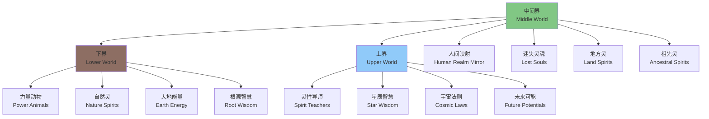
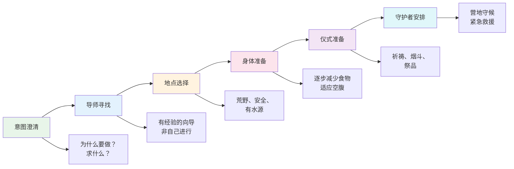
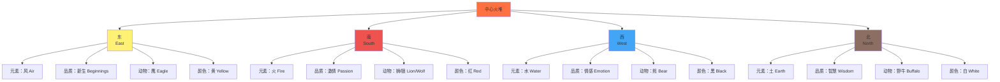

# 萨满传统实修指南 (Shamanic Traditions Practical Guide)

> **最后更新：** 2026-05

---

## 目录

1. [鼓之旅完整引导协议](#1-鼓之旅完整引导协议)
2. [Vision Quest 的准备与执行](#2-vision-quest-的准备与执行)
3. [火典礼操作流程](#3-火典礼操作流程)
4. [植物药工作的伦理框架](#4-植物药工作的伦理框架)
5. [现代城市中的萨满实践](#5-现代城市中的萨满实践)
6. [附录：参考资源](#6-附录参考资源)

---

## 1. 鼓之旅完整引导协议

鼓之旅（Drum Journey）是萨满实践中最核心、最普遍的技术。单调的鼓声（130-220 BPM）改变意识状态（Altered State of Consciousness, ASC），使从业者能够进入非 ordinary 现实（Non-Ordinary Reality, NOR），与灵性向导、力量动物、祖先或更高智慧建立连接。

### 1.1 鼓之旅三领域模型

| 领域 | 特征 | 典型入口 | 主要接触对象 | 常见目的 |
|------|------|----------|-------------|----------|
| **下界** | 洞穴、地底、根系、水域深处 | 树洞、洞穴、地下河流入口 | 力量动物、自然灵、大地母亲 | 找回力量、治疗身体、 grounding |
| **中间界** | 与物质世界平行但不可见 | 镜子、水面、雾中 | 地方灵、祖先、迷失灵魂 | 寻回灵魂碎片、与祖先对话、解决当下问题 |
| **上界** | 云端之上、星辰之间、光之领域 | 攀爬、飞行、光束 | 灵性导师、星辰存在、扬升大师 | 获取高层智慧、未来洞见、灵性进化 |

### 1.2 准备阶段

| 维度 | 操作 | 详细说明 |
|------|------|----------|
| **空间准备** | 安静、安全、不受打扰的空间 | 关闭手机；告知他人你需要30-60分钟不被打扰；拉上窗帘或调暗灯光 |
| **身体准备** | 舒适的躺姿 | 平躺于地板或床上，头部略高（可用枕头），膝盖下可垫支撑；盖好毯子（意识改变时体温可能变化） |
| **眼罩** | 遮挡视觉 | 使用眼罩或布条；减少视觉输入有助于听觉聚焦 |
| **意图设定** | 清晰、简洁的问题或目的 | 在鼓声开始前，大声或默念你的意图。例如："我想遇见我的力量动物"、"我需要关于XX问题的指引" |
| **净化** | 烟熏净化（可选） | 使用鼠尾草、圣木（Palo Santo）、雪松等烟熏空间与身体；摇动铃铛或拨浪鼓打破停滞能量 |
| **保护** | 建立能量边界 | 观想白光或光之蛋包裹全身；声明："我只允许对我最高善的灵体接近" |

### 1.3 鼓声设置

| 参数 | 标准范围 | 说明 |
|------|----------|------|
| **速度** | 130-220 BPM | 130-180 BPM适合初次进入；180-220 BPM适合深度旅程或回程加速 |
| **节奏** | 稳定、单调、无变化 | 关键在于"单调"——不变节奏诱使大脑从Beta波（清醒）转向Alpha/Theta波（轻度催眠/深度冥想） |
| **持续时间** | 15-30分钟 | 初次建议15分钟；经验丰富者可延长至45-60分钟 |
| **音调** | 低沉、共振 | 低音鼓（frame drum或萨满鼓）最佳；低沉频率与大地能量共振 |
| **变化信号** | 快速敲击（回程信号） | 3-7秒的快速连续敲击表示"旅程结束，请返回" |

**鼓声替代方案：**

| 替代方式 | 适用情境 | 注意事项 |
|----------|----------|----------|
| **录音** | 无现场鼓手时 | 确保录音质量高，有清晰的回程信号 |
| **摇动器（Rattle）** | 需要更轻柔的进入 | 摇动器频率更高，可能不如鼓声深沉 |
| **节拍器+低音** | 技术化替代 | 确保节奏绝对稳定 |
| **数字应用** | 旅行中 | 测试应用可靠性；备用方案 |

### 1.4 进入与旅程阶段

| 阶段 | 时间 | 操作 | 体验特征 |
|------|------|------|----------|
| **放松期** | 0-3分钟 | 深呼吸，感受身体沉重；允许 drum 声充满意识 | 可能感到烦躁或怀疑——正常 |
| **转变期** | 3-8分钟 | 观想入口（见下方）；允许图像自然出现，不强迫 | 视觉、身体感觉、或纯粹的"知道"开始出现 |
| **旅程期** | 8-25分钟 | 在领域内探索；与遇到的灵体互动；寻求答案 | 时间感扭曲；体验极为真实；可能同时感知物理身体 |
| **回程期** | 25-30分钟 | 听到回程信号（快速敲击）；感谢遇到的灵体；沿原路返回 | 回程可能快速；带着礼物或信息返回 |
| **整合期** | 30-45分钟 | 缓慢睁眼；记录体验；吃 grounding 食物（如巧克力、坚果） | 可能感到摇晃、情绪涌动、或深度平静 |

**三领域入口观想：**

| 领域 | 推荐入口 | 进入方式 |
|------|----------|----------|
| **下界** | 大树根部洞口、地下洞穴入口、水中漩涡 | 想象从入口下降——可以坠落、攀爬、滑下或漂流 |
| **中间界** | 浓雾中的门、镜中倒影、熟悉的自然场景但略有不同 | 步入、穿过或融入 |
| **上界** | 大树顶端、高山之巅、云梯、光束 | 攀爬、飞行或被抬升 |

### 1.5 安全返回的三次信号系统

这是鼓之旅中至关重要的安全协议，确保意识能完整返回物理身体。

| 信号 | 鼓声特征 | 行动 | 目的 |
|------|----------|------|------|
| **第一次信号** | 节奏略加快，持续3-5秒 | 意识到旅程即将结束；向遇到的灵体告别；准备收集信息 |
| **第二次信号** | 明显快速敲击，持续5-7秒 | 开始回程；沿来时的路返回；感谢灵体；携带礼物/信息 |
| **第三次信号** | 极快速连续敲击，持续7-10秒 | 快速返回；进入身体；感受手指脚趾；准备睁眼 |
| **最终停止** | 鼓声完全停止 | 完全回到身体；缓慢睁眼； grounding |

**如果错过回程信号：**

| 情境 | 应对 |
|------|------|
| 沉浸过深未听到信号 | 鼓手应在第一次信号后持续加速；最终用力一击 |
| 独自使用录音 | 选择有明确多层信号的录音；设定物理闹钟作为备用 |
| 无法返回的感觉 | 摇动身体；咳嗽；移动手指脚趾；大声说"我回来了" |
| 情绪过度激活 | 立即 grounding：喝温水、触摸地面、吃东西 |

### 1.6 旅程中的互动指南

| 情境 | 建议 |
|------|------|
| **遇到力量动物** | 观察其特征；询问："你有什么教导给我？"；请求它陪伴你；记住它的名字或象征 |
| **遇到灵性导师** | 保持尊重但不卑躬屈膝；提问你的意图；接受教导，即使不完全理解 |
| **遇到恐怖形象** | 不要逃跑（可能延长恐惧）；保持平静；询问："你以这种形式出现，要教我什么？"; 若感到真实威胁，立即要求返回 |
| **遇到请求帮助的灵体** | 评估自己的能力范围；不承诺超出能力的事；可以转介给更合适的灵体 |
| **获得信息但不理解** | 请求以其他形式呈现；带回信息，在事后通过日记、艺术或咨询来解读 |

### 1.7 旅程后整合

| 步骤 | 操作 | 时间 |
|------|------|------|
| 1. 立即记录 | 闭眼，快速说出或写下所有记得的细节——关键词、图像、情感 | 5-10分钟 |
| 2. 详细书写 | 睁开眼睛，扩展记录为完整的叙事 | 15-30分钟 |
| 3. 绘制旅程地图 | 画出你经过的路径、遇到的灵体、关键场景 | 10-20分钟 |
| 4. 解读信息 | 问自己："这与我的意图有何关联？" "我在日常生活中如何应用？" | 持续 |
| 5. 行动承诺 | 根据旅程信息，设定至少一个具体行动 | 24小时内 |
| 6. 感谢 | 对鼓声、空间、灵体表达感谢；可以小供奉（如烟草、食物、水） | 旅程结束后 |

---

## 2. Vision Quest 的准备与执行

Vision Quest（寻视之旅）是北美原住民传统中最神圣的成年礼与灵性深化实践。通常涉及独自在野外停留4天4夜，禁食、祈祷、等待异象（Vision）的降临。

### 2.1 准备阶段（通常数周至数月）

| 准备项目 | 详细说明 | 时间线 |
|----------|----------|--------|
| **意图澄清** | 在日记中深入书写：为什么我要做Vision Quest？我寻求什么？我愿意放下什么？ | Quest前4-8周 |
| **寻找导师** | Vision Quest不应独自进行。寻找有经验的向导（最好是受过原住民训练或长期实践者） | Quest前数月 |
| **寻找守护者** | 安排一人在营地守候，负责安全、每日探视（不打扰，只确认安全）、紧急情况 | Quest前2周 |
| **选择地点** | 荒野、远离人烟、有基本安全条件；需获得土地使用许可；传统上选择山顶、沙漠或森林深处 | Quest前2-4周 |
| **身体准备** | 逐步减少食物摄入；进行 outdoors 露营训练；适应独处；练习基础野外生存技能 | Quest前2-4周 |
| **仪式准备** | 准备祈祷用品（烟斗、祭品、圣物）；制作或获得 quest 标记物（如布条、羽毛） | Quest前1周 |
| **告别仪式** | 与亲友告别，说明你将"离开"数日；处理完紧急事务；心理上放下日常身份 | Quest前1-2天 |

### 2.2 选址与圈地

| 考虑因素 | 标准 | 原因 |
|----------|------|------|
| **安全性** | 无大型掠食动物活跃；无极端天气风险；手机信号可及（或守护者可用卫星通讯） | Quest期间无法自我保护 |
| **水源** | 300米内有清洁水源，或携带足够水 | 无水的情况下4天有生命危险 |
| **神圣感** | 自然壮丽、安静、有特殊能量感的地点 | 地点本身即是导师 |
| **隐私** | 不会被徒步者、猎人打扰 | 打断可能破坏深度体验 |
| **合法性** | 公共土地需许可；私人土地需许可；国家公园通常禁止 | 法律问题会分散注意力 |

**传统圈地方式：**

| 元素 | 操作 | 象征 |
|------|------|------|
| **中心点** | 以石头标记你的"座位"——通常面对日出方向 | 你在此世界的中心 |
| **圆圈** | 用石头或自然物标记约3-5米直径的圆 | 神圣空间的边界 |
| **四方向** | 在圆的东西南北放置祭品或标记 | 与宇宙力量对齐 |
| **入口** | 通常在东边留一个开口 | 迎接日出与新开始 |
| **祭品** | 烟草、玉米粉、丝带系于附近的树 | 感谢大地、请求允许 |

### 2.3 禁食与隔离

| 维度 | 标准 | 变体 |
|------|------|------|
| **食物** | 完全禁食（仅饮水） | 初学者可做"半Quest"——每日少量干果 |
| **饮水** | 每日至少2升 | 炎热环境下增加 |
| **隔离** | 完全独自；不与任何人说话 | 守护者每日远处目视确认 |
| ** shelter** | 无帐篷；仅用睡袋和防水布（若下雨） | 极端天气下可使用简易遮蔽 |
| **物品** | 极简：睡袋、水、刀、哨子（紧急）、日记本、祈祷用品 | 无书籍、无音乐、无娱乐 |

### 2.4 四天四夜阶段性体验

| 天数 | 主题 | 典型体验 | 修习要点 |
|------|------|----------|----------|
| **第一天** | 放下 | 思绪纷飞；想家；怀疑自己的决定；身体不适 | 坚持；将注意力带到呼吸；记住"为什么选择来这里" |
| **第二天** | 面对 | 深层情绪浮现——恐惧、悲伤、愤怒；可能与过去创伤连接 | 允许情绪流动；不压抑、不放大；哭泣是净化 |
| **第三天** | 空虚 | 身体极度虚弱；心智安静；可能感到与自然的深度连接 | 这是Vision最可能出现的时间；保持开放；不追求 |
| **第四天** | 整合 | 虚弱但清明；可能出现深刻的洞见、异象或直接的"知晓" | 接收；感谢；准备回归；将体验锚定 |

**异象（Vision）的形式：**

| 形式 | 描述 | 如何应对 |
|------|------|----------|
| **视觉异象** | 看见动物、光、场景、符号 | 观察、记住、不恐惧；可以询问意义 |
| **听觉信息** | 听到话语、歌声、自然之声中的信息 | 聆听；若不理解，请求重复或澄清 |
| **身体感知** | 强烈的能量流动、温度变化、振动 | 不抗拒；允许能量流动；若不适则 grounded |
| **直接的知晓** | 没有形象或声音，只是"知道"某件事 | 信任；记录；这可能是最真实的Vision |
| **情感浪潮** | 无法解释的深度情感 | 允许；情感本身即是信息 |
| **无** | 什么都没有发生 | 这也是有效的；"空"本身就是一种教导 |

### 2.5 回归整合

| 步骤 | 操作 | 时间 |
|------|------|------|
| **物理回归** | 由守护者接回；缓慢恢复饮食（从流质开始） | 第4-5天 |
| **清洁** | 沐浴；更换衣物；象征性地"洗去"旧身份 | 回归当日 |
| **感谢** | 对土地、守护者、导师表达感谢；祭品供奉 | 回归当日 |
| **讲述** | 向导师讲述你的体验；导师帮助你解读 | 回归后1-3天 |
| **沉默期** | 传统上回归后不立即与所有人分享；只与导师和少数人讨论 | 回归后数日 |
| **艺术表达** | 绘画、写作、制作物品来表达Vision | 回归后数周 |
| **生活整合** | 根据Vision设定生活改变；可能涉及职业、关系、居住地等重大决定 | 持续数月 |

---

## 3. 火典礼操作流程

火典礼（Fire Ceremony）是跨越文化的萨满实践，利用火的转化力量来释放旧有模式、设定新意图、并与灵性世界沟通。

### 3.1 准备阶段

| 项目 | 详细说明 |
|------|----------|
| **选择地点** | 户外、通风、远离可燃物；确认当地法规允许生火；准备灭火工具（水、沙、灭火器） |
| **时间选择** | 日落时分最佳（日夜交界，转化力量最强）；满月或新月有额外能量 |
| **材料准备** | 见下表 |
| **参与者准备** | 禁食或轻食2-3小时前；沐浴或洗手洗脸；穿着天然材质衣物 |
| **意图设定** | 每个参与者提前写下要释放的和要召唤的 |

**火典礼材料清单：**

| 类别 | 物品 | 用途 |
|------|------|------|
| **火种** | 干柴、引火物、打火机/火柴 | 建立火堆 |
| **芳香** | 鼠尾草、雪松、甜草、圣木 | 净化空间与参与者 |
| **书写** | 天然纸张（无化学涂层）、笔 | 写下释放与意图 |
| **祭品** | 烟草、玉米粉、花、食物 | 感谢元素与灵体 |
| **辅助** | 鼓、摇动器、铃铛 | 创造神圣氛围 |
| **安全** | 水桶、铲子、灭火器 | 紧急情况 |
| **座位** | 毯子或垫子 | 围坐舒适 |

### 3.2 四方向召唤

| 方向 | 元素 | 召唤语示例 | 祭品 |
|------|------|-----------|------|
| **东** | 风 | "东方的风，新生的力量，带来清明与开始，请来到我们的火旁" | 羽毛、香 |
| **南** | 火 | "南方的火，热情与转化，燃烧我们的旧有，点亮我们的道路，请来到我们的火旁" | 红辣椒、蜡烛 |
| **西** | 水 | "西方的水，情感与直觉，洗涤我们的心灵，带来梦境与洞见，请来到我们的火旁" | 水、贝壳 |
| **北** | 土 | "北方的土，智慧与根基，支撑我们的旅程，带来 ancestral 的力量，请来到我们的火旁" | 石头、烟草 |
| **上** | 天/灵 | "上方的天父/宇宙/造物主，照亮我们，指引我们，请祝福这个火典礼" | 烟草烟雾上升 |
| **下** | 地/母 | "下方的大地母亲，承载我们，滋养我们，接收我们的释放，请祝福这个火典礼" | 祭品埋入土中 |

### 3.3 释放与意图的书写

| 步骤 | 操作 | 示例 |
|------|------|------|
| **释放清单** | 在一张纸上写下所有你想放下的——恐惧、旧模式、关系、创伤、信念 | "我释放对失败的恐惧" "我释放与XX的怨恨" |
| **意图清单** | 在另一张纸上写下你想召唤的——新品质、目标、关系、状态 | "我召唤勇气" "我欢迎健康的伙伴关系" |
| **感恩清单** | （可选）第三张纸写下你感恩的 | "我感恩我的健康" "我感恩家人的支持" |
| **书写方式** | 手写；每个项目单独一行；不缩写；用"我"陈述 | — |

### 3.4 焚烧仪式流程

| 阶段 | 时长 | 操作 | 引导语 |
|------|------|------|--------|
| **净化** | 5-10分钟 | 以鼠尾草烟熏每位参与者；摇铃打破旧能量 | "以烟净化，以铃唤醒，我们准备进入神圣空间" |
| **生火** | 10-15分钟 | 共同建立火堆；参与者可各自添加一根柴，同时说出一句祈祷 | "以这火，我们点燃转化" |
| **召唤四方向** | 10-15分钟 | 主持人面向各方向召唤；参与者可跟随重复 | 见上方召唤语 |
| **释放焚烧** | 15-20分钟 | 每人依次将"释放清单"投入火中；可选择大声读出或默默 | "我释放……将它交托给火，交托给转化" |
| **鼓/歌** | 10-15分钟 | 鼓声或歌声支持释放过程；允许情感表达 | 自由的鼓声或传统歌曲 |
| **意图焚烧** | 15-20分钟 | 每人将"意图清单"投入火中；想象意图已被宇宙接收 | "我召唤……愿火将此愿望送达灵性世界" |
| **静默接收** | 10-15分钟 | 围火静坐；接收任何信息、洞见或单纯的平静 | 无引导，纯沉默 |
| **感恩与关闭** | 10分钟 | 感谢四方向、火、灵体、彼此；宣布典礼结束 | "感谢所有参与的存在。愿这个转化在我们的生活中实现。典礼结束。" |

### 3.5 灰烬处理

| 方式 | 操作 | 适用情境 |
|------|------|----------|
| **埋入土中** | 冷却后，将灰烬埋入大地；可埋于树下或花园 | 意图与扎根、成长相关 |
| **撒入流水** | 将灰烬撒入河流或溪流 | 意图与流动、释放、情感相关 |
| **风吹散** | 让风吹散灰烬 | 意图与自由、传播、新思想相关 |
| **保留小部分** | 将一小撮灰烬装入小袋，作为护身符 | 个人持续的需要转化之力 |
| **安全处理** | 若以上皆不可行，冷却后安全丢弃 | 城市环境限制 |

---

## 4. 植物药工作的伦理框架

植物药（如死藤水/Ayahuasca、佩奥特/Peyote、迷幻蘑菇/Psilocybin等）在萨满传统中扮演重要角色，但其使用涉及复杂的伦理、法律与文化问题。

### 4.1 核心伦理问题

| 问题 | 分析 | 立场建议 |
|------|------|----------|
| **非原住民是否应该使用死藤水？** | 死藤水是亚马逊原住民数千年传统；商业化使用常剥削当地社区；但拒绝所有跨文化使用也可能陷入文化封闭 | 尊重来源；寻求与原住民社区直接合作的 retreat；学习并回馈；不以消费者心态参与 |
| **佩奥特的合法性与神圣性** | 佩奥特在美国对原住民宗教合法，对他人非法；原住民守护团体反对外人使用 | 非原住民应尊重法律与原生守护者的意愿；不寻求非法渠道 |
| **传统 vs 现代语境** | 传统植物药仪式有完整的文化、社区、整合支持系统；现代 retreat 常剥离这些 | 选择提供完整整合支持的 retreat；不只追求"trip" |
| **身心安全** | 植物药对某些人（精神病史、药物交互）有严重风险 | 全面的医学筛查；诚实披露健康状况 |

### 4.2 身体准备：Dieta

Dieta（饮食准备）是亚马逊传统中植物药仪式前的必要准备，目的是净化身体以增加对植物的敏感性。

| 维度 | 传统Dieta | 现代简化版 |
|------|----------|-----------|
| **时长** | 数周至数月 | 至少3-7天 |
| **禁止食物** | 盐、糖、油、肉、鱼、蛋、乳制品、酒精、咖啡因、香料、性、大蒜、洋葱 | 至少避免：酒精、药物、咖啡因、重口味食物、红肉 |
| **推荐食物** | 简单米饭、少量蔬菜、香蕉、木薯 | 清淡素食、大量蔬菜、全谷物、大量水 |
| **禁止行为** | 性行为、过度社交、强烈情绪 | 减少社交媒体、减少刺激、独处 |
| **目的** | 身体净化；增加植物敏感度；建立与植物的关系 | 身体安全；心理准备；尊重传统 |

**药物交互禁忌：**

| 药物类别 | 风险 | 停药时间 |
|----------|------|----------|
| **SSRI抗抑郁药** | 与Ayahuasca的MAOI成分交互，可导致血清素综合征（可能致命） | 至少2-4周（需医生指导） |
| **MAOI药物** | 叠加效应 | 至少2周 |
| **兴奋剂** | 心脏风险 | 至少48小时 |
| **抗精神病药** | 不可预测交互；精神病风险 | 不建议参与 |
| **降压药** | MAOI可升高血压 | 需密切医学监督 |

### 4.3 整合期的心理支持

植物药体验本身只占修行的20%，整合（Integration）占80%。

| 整合阶段 | 时间 | 支持需求 |
|----------|------|----------|
| **立即整合** | 体验后24-48小时 | 安静、休息、 journaling、轻食；避免重大决定 |
| **短期整合** | 1-4周 | 与整合教练或治疗师会谈；艺术表达；身体练习（瑜伽、走路） |
| **中期整合** | 1-6个月 | 将持续的洞见应用于日常生活；可能面临关系、职业的重大调整 |
| **长期整合** | 6个月-数年 | 植物药可能开启长期灵性进程；持续的个人修行支持 |

**整合期危险信号：**

| 信号 | 含义 | 应对 |
|------|------|------|
| 持续的解离感 | 未完全"回来" |  grounding 练习；专业帮助 |
| 极端情绪起伏 | 体验内容未处理 | 创伤知情治疗师 |
| 灵性逃避 | 用灵性体验逃避现实生活 |  grounding 日常生活 |
| 救世主情结 | 认为自己获得了特殊使命 | 谦卑；与成熟导师讨论 |
| 重复渴求 | 不断想重复体验 | 反思是否成瘾化；寻找其他修行方式 |

---

## 5. 现代城市中的萨满实践

在城市环境中进行萨满实践需要创造性适应。核心原则不变——与灵性世界连接、与自然沟通、转化意识——但形式可以调整。

### 5.1 无自然环境时的实践

| 传统实践 | 城市替代方案 | 操作 |
|----------|-------------|------|
| **野外Vision Quest** | 城市静修 | 租一间无窗或遮光好的房间；4天独处；极简；禁食或轻食 |
| **自然中的鼓之旅** | 室内鼓之旅 | 公寓中创造神圣空间；使用录音；眼罩；不受打扰的时间 |
| **篝火典礼** | 蜡烛典礼 | 使用大蜡烛代表火；同样的书写、释放、意图流程；更安全 |
| **自然中的力量动物搜寻** | 城市中的动物征兆 | 留意城市中出现的动物（鸟、昆虫、流浪猫狗）；记录并解读 |
| **与树的连接** | 城市树木 | 公园中的老树同样拥有力量；请求许可后拥抱或背靠 |

### 5.2 数字鼓声替代

| 场景 | 数字替代方案 | 设置建议 |
|------|-------------|----------|
| **鼓之旅** | 高质量录音；专用app（如Insight Timer中的萨满鼓声） | 使用降噪耳机；确保录音有明确回程信号 |
| **日常连接** | 节拍器设置130-220 BPM | 可作为背景音乐在工作时维持轻度 altered 状态 |
| **睡眠/梦境工作** | 缓慢鼓声（<100 BPM） | 入睡前播放；可能诱发清醒梦 |
| ** grounding** | 自然声音（雨、河流） | 焦虑时聆听；效果类似 drum journey 的 grounding |

**推荐的数字资源：**

| 类型 | 来源 | 说明 |
|------|------|------|
| 录音 | Michael Harner的Foundation for Shamanic Studies出品 | 经典；有明确信号 |
| App | Insight Timer（搜索"shamanic drum"） | 多种选择；免费 |
| 在线 | YouTube上的萨满鼓声视频 | 需筛选质量；注意广告打断 |
| 自制 | 使用GarageBand或类似软件 | 自定义BPM和时长 |

### 5.3 安全的小型仪式

| 仪式 | 最小可行版本 | 时间 | 空间需求 |
|------|-------------|------|----------|
| **个人火典礼** | 一支大蜡烛 + 两张纸（释放/意图） | 30分钟 | 桌面 |
| **力量动物找回** | 室内鼓之旅，意图"遇见力量动物" | 20分钟 | 可躺下的空间 |
| **日常 grounding** | 站立，感受脚底；深呼吸；观想根须入地 | 3分钟 | 任何地方 |
| **感恩仪式** | 每日黄昏，对四个方向鞠躬；说出感恩 | 5分钟 | 窗边或阳台 |
| **月亮仪式** | 新月/满月夜晚，窗边静坐；设定或释放意图 | 15分钟 | 能看到月亮的窗边 |

### 5.4 建立城市中的神圣空间

| 元素 | 城市版本 | 布置建议 |
|------|----------|----------|
| **祭坛** | 桌面或小架子 | 面向东方；放置自然物（石头、贝壳、羽毛）、蜡烛、圣像 |
| **净化** | 喷雾替代烟熏 | 用精油（雪松、鼠尾草精油+水）喷雾；避免烟雾报警器 |
| **声音** | 小铃铛、音叉 | 仪式开始和结束时摇铃；音叉定调 |
| **自然连接** | 盆栽植物 | 照顾植物作为与自然的关系；请求它们的许可和教导 |
| **方向标记** | 指南针或手机 | 在空间中明确四个方向；可用不同颜色物品标记 |

### 5.5 城市萨满的每日修习

| 时间 | 修习 | 时长 |
|------|------|------|
| **晨起** | 对日出方向祈祷；设定当日意图 | 3分钟 |
| **通勤** | 正念行走或坐车；将通勤视为"旅程" | 全程 |
| **午间** | 简短 drum journey 或 grounding | 10分钟 |
| **黄昏** | 感恩仪式；回顾一日 | 5分钟 |
| **睡前** | 日记；梦境意图设定 | 10分钟 |
| **每周** | 一次完整 drum journey；一次深度 journaling | 1-2小时 |
| **每月** | 新月/满月仪式；回顾与设定 | 30分钟 |
| **每季** | 一次"城市Vision Quest"（一日独处、轻食、无媒体） | 1天 |

---

## 6. 附录：参考资源

### 核心读物

| 书名 | 作者 | 核心内容 |
|------|------|----------|
| *The Way of the Shaman* | Michael Harner | 现代核心萨满技术的系统介绍 |
| *Cave and Cosmos* | Michael Harner | 鼓之旅的深度指南 |
| *Soul Retrieval* | Sandra Ingerman | 灵魂碎片回收技术 |
| *Welcome to the Revolution* | Daniel Pinchbeck | 植物药与现代灵性的讨论 |
| *The Cosmic Serpent* | Jeremy Narby | 死藤水与DNA的科学研究 |

### 伦理与责任组织

| 组织 | 关注点 |
|------|--------|
| **ICEERS** | 死藤水的伦理使用、科学研究、法律改革 |
| **MAPS** | 迷幻剂的心理治疗研究 |
| **Native American Church** | 佩奥特的合法宗教使用 |
| **Foundation for Shamanic Studies** | 伦理的跨文化萨满教育 |

### 植物药法律状态速查（部分国家/地区）

| 物质 | 美国 | 加拿大 | 荷兰 | 巴西 | 秘鲁 |
|------|------|--------|------|------|------|
| Ayahuasca | 非法（DMT受控） | 非法 | 非法（但 Santo Daime 获宗教豁免） | 合法（传统使用） | 合法（传统使用） |
| Peyote | 原住民宗教合法 | 非法 | 非法 | N/A | N/A |
| Psilocybin | 多数州非法（俄勒冈州治疗用合法） | 非法 | 合法（新鲜蘑菇，"神奇松露"） | 非法 | 灰色地带 |

> **重要提醒：** 法律状态不断变化。本表仅反映2026年5月前的情况。参与任何植物药仪式前，务必确认当地最新法律。

### 安全清单

| 项目 | 检查 |
|------|------|
| □ | 医学筛查完成 |
| □ | 无禁忌药物交互 |
| □ | 有经验丰富的引导者 |
| □ | 有紧急医疗方案 |
| □ | 有整合支持计划 |
| □ | 意图清晰 |
| □ | 法律状态确认 |
| □ | 尊重来源文化与社区 |

---

> *"萨满不是关于逃离现实，而是关于更深地进入现实——包括可见与不可见的。"*  
> —— 受 Michael Harner 启发
