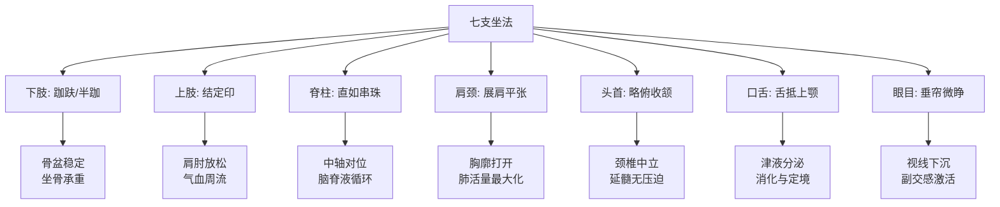
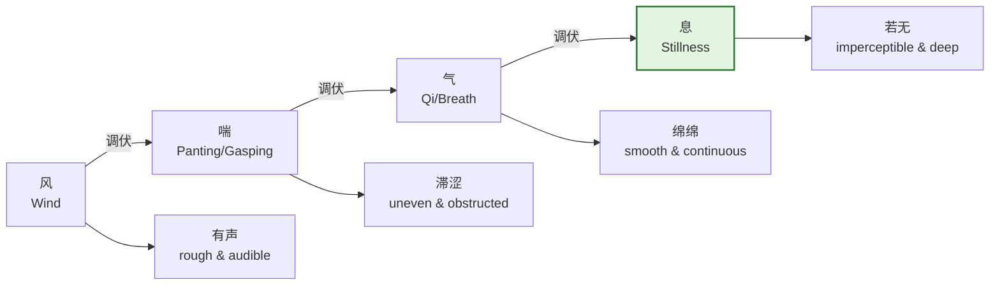
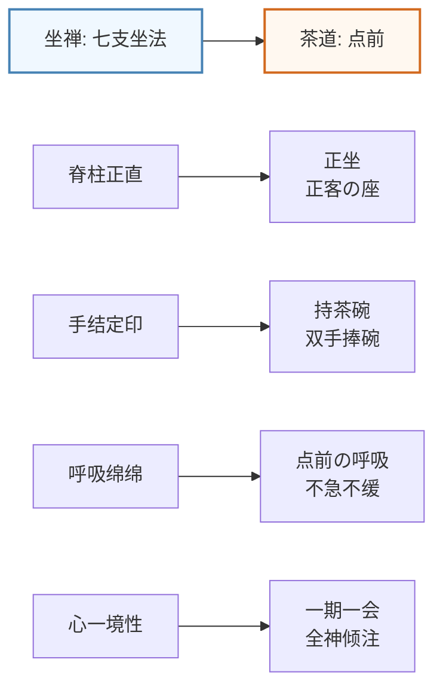

# 坐禅实操进阶指南

> **最后更新**: 2026-05

---

## 目录

1. [七支坐法的生物力学详解](#1-七支坐法的生物力学详解)
2. [呼吸法的四个层次](#2-呼吸法的四个层次)
3. [坐禅中的身体问题处理](#3-坐禅中的身体问题处理)
4. [坐禅与日常活动](#4-坐禅与日常活动)
5. [团体共修形式](#5-团体共修形式)

---

## 1. 七支坐法的生物力学详解

七支坐法（ Seven-Point Posture of Vairocana / 毘卢七支坐 ）是汉传、藏传、东密共通的上座禅修坐姿。每一"支"不仅具有宗教象征意义，更蕴含深刻的**生物力学原理**。

### 1.1 第一支：足——跏趺坐/半跏坐

| 坐姿类型 | 操作要点 | 解剖学意义 | 常见错误 | 纠正方法 |
|---------|---------|-----------|---------|---------|
| **双跏趺**（Full Lotus） | 右脚放左大腿根，左脚放右大腿根，两膝贴垫 | 骨盆最稳定，坐骨结节垂直向下，脊柱自然拔直；股骨外旋极限，髋外展肌群充分伸展 | 强行扳腿导致膝盖内扣 | 先做束角式（Baddha Konasana）热身，逐步外旋 |
| **单跏趺**（Half Lotus） | 一脚放对侧大腿根，另一脚放臀下或腿前 | 单侧骨盆略高，可用薄垫调整；较双跏易行，稳定性佳 | 悬空膝盖未支撑 | 悬空膝下垫方形 cushion |
| **散盘**（Burmese） | 两脚一前一后，小腿交叉于前方 | 髋外旋要求最低，适合初学者；坐骨承重直接 | 骨盆后倾，脊柱弓背 | 臀部垫高 5–10 cm，使髋高于膝 |
| **椅子坐** | 臀部坐前 1/3，双脚平放地面 | 适合膝髋损伤者；脊柱仍须保持直立 | 背靠椅背，精神昏沉 | 不倚靠背，想象头顶有线上提 |

**生物力学核心**：
- **坐骨结节承重**（Ischial tuberosity loading）：当髋膝关节角度使坐骨结节成为唯一主要承重点时，脊柱的中立位（neutral spine）最容易自然达成。
- **骨盆-脊柱耦合**（Pelvic-spine coupling）：骨盆每前倾 1°，腰椎 lordosis 增加约 0.8°。跏趺坐通过股骨的外旋和髋关节的屈曲，自然地引导骨盆进入轻微前倾，从而减少腰椎代偿性后凸的风险。

### 1.2 第二支：手——结定印

| 要素 | 标准操作 | 生物力学原理 |
|------|---------|------------|
| **位置** | 肚脐下约 4 横指处，悬空或轻放大腿上 | 避免压迫腹腔，横膈膜活动不受限 |
| **左手** | 在下，掌心向上 | 传统以左为静、为定 |
| **右手** | 在上，掌心向上，叠放左手之上 | 两拇指轻触，形成闭合回路 |
| **拇指** | 轻触成椭圆，如捧一球 | 肩肘自然下垂，肩关节无内旋张力 |

**生物力学核心**：
- **肩肱节律**（Scapulohumeral rhythm）：当手臂放松垂落、肘关节屈曲约 30–45° 时，斜方肌上束的张力最小，颈椎的代偿性前伸风险降低。
- **能量循环假说**：两拇指轻触形成的闭合回路，从中医经络学对应手太阴肺经与手阳明大肠经的交汇；从现代角度，此姿势减少了上肢的静电散失（虽未获严格科学证实，但学人普遍报告安定感增强）。

### 1.3 第三支：脊——直如串珠

| 要点 | 具体描述 | 常见偏差 |
|------|---------|---------|
| **脊柱中立** | 颈椎、胸椎、腰椎保持自然生理曲度，不拔不塌 | 刻意"拔背"导致胸椎过直（military spine） |
| **腰椎稳定** | 命门（L2-L3）处微微后撑，如贴墙壁 | 骨盆后倾，腰椎变平 |
| **胸椎延伸** | 胸骨柄微上提，肩胛骨自然下沉 | 挺胸导致肋骨外翻、呼吸浅短 |

**生物力学核心**：
- **脑脊液动力学**（CSF dynamics）：脊柱的中立位优化了枕骨大孔（foramen magnum）至骶骨（sacrum）的脑脊液流动通路。任何显著的脊柱偏移都会增加硬膜（dura mater）的张力，可能引发头痛或昏沉。
- **轴向负荷**（Axial loading）：当脊柱处于中立位时，重力沿脊柱的力线（line of gravity）通过各椎体的中心，椎间盘压力最小。

### 1.4 第四支：肩——展肩平张

| 要点 | 操作 | 错误 |
|------|------|------|
| **展肩** | 两肩向两侧平展，如大鹏展翅 | 耸肩（上斜方肌紧张） |
| **平张** | 锁骨水平，肩峰在同一高度 | 一高一低（脊柱侧弯代偿） |
| **放松** | 肩井穴（GB21）无酸胀感 | 刻意后夹，菱形肌过度收缩 |

**生物力学核心**：
- **胸廓顺应性**（Thoracic compliance）：当肩关节处于外展约 30°、外旋约 15° 的位置时，胸大肌和胸小肌的张力最小，胸廓的弹性回缩力最优，有利于腹式呼吸的深长展开。

### 1.5 第五支：头——略俯收颔

| 要点 | 标准 | 测量方法 |
|------|------|---------|
| **下颔内收** | 喉结与胸骨上窝的连线略小于 90° | 可用两指轻触下巴与喉结，确认无过度前伸 |
| **目光方向** | 睁眼时视线自然落于身前 1–1.5 米地面 | 过高则精神涣散，过低则易昏沉 |
| **枕骨位置** | 枕骨基部（occipital base）微微上提 | 想象头顶有线上拉，下颔自然内收 |

**生物力学核心**：
- **延髓保护**（Medulla oblongata protection）：枕骨-寰椎-枢椎（C0-C1-C2）的关节是全身最灵活也最脆弱的区域。下颔过度前伸会增加枕下肌群（suboccipital muscles）的张力，通过硬膜牵连机制（dural traction）影响延髓的功能，导致头晕或注意力涣散。
- **前庭系统**：下颔内收的姿势使前庭系统（vestibular system）处于最稳定的状态，减少身体的微摆动（postural sway）。

### 1.6 第六支：舌——抵上颚

| 层次 | 位置 | 效应 |
|------|------|------|
| **初学** | 舌尖轻触上排牙齿后方牙龈 | 减少口干，促进唾液分泌 |
| **深入** | 舌尖抵上颚硬腭与软腭交界处 | 任督二脉的"鹊桥"接通感 |
| **高级** | 舌体整体上贴，如吸盘附着 | 津液大量涌现，"玉液还丹" |

**生物力学核心**：
- **唾液分泌**（Salivation）：舌抵上颚刺激副交感神经（via chorda tympani branch of CN VII），促进唾液分泌。唾液中含有神经生长因子（NGF）和表皮生长因子（EGF），传统所谓"津液"并非虚妄。
- **颞下颌关节**（TMJ）：舌抵上颚时，颞下颌关节处于其中立位，咬肌和颞肌的张力最小，减少了头面部的整体紧张度。

### 1.7 第七支：眼——垂帘微睁

| 状态 | 眼睑位置 | 适用情境 |
|------|---------|---------|
| **全睁** | 正常睁眼，视线专注 | 初学对治昏沉，或经行时 |
| **垂帘** | 眼睑下垂约 30–50%，视线模糊 | 标准坐禅，最常用 |
| **全闭** | 双眼闭合 | 极度疲劳时短暂使用，不推荐常坐 |

**生物力学核心**：
- **副交感神经激活**：眼睑轻微下垂减少了视网膜的光输入，通过视交叉上核（SCN）的调节，促进副交感神经主导的状态（rest-and-digest），心率变异性（HRV）的频谱分析显示 LF/HF 比值下降。
- **眼动与思维**：眼球的微小运动（saccades）与思维的活跃高度相关。垂帘微睁减少了眼动的频率，从而间接地稳定了注意力的波动。

---

## 2. 呼吸法的四个层次

禅宗呼吸法源自安般守意经（Ānāpānasati），将呼吸分为四个层次：**风、喘、气、息**（四相）。

### 2.1 风相

| 特征 | 表现 | 调伏方法 |
|------|------|---------|
| **声** | 呼吸有明显声音，如风过缝隙 | 放缓出入，令声渐微 |
| **粗** | 胸腹起伏大，气息急躁 | 数息法：数入不数出，从一至十 |
| **散** | 注意力随呼吸漂移，无法凝聚 | 将注意力集中于鼻端或脐下 |

### 2.2 喘相

| 特征 | 表现 | 调伏方法 |
|------|------|---------|
| **滞** | 呼吸不连贯，似有停顿 | 放松肩颈，检查是否耸肩 |
| **急** | 急吸急呼，如喘息 | 延长呼气，呼气时间长于吸气 |
| **浅** | 只到胸部，未达腹部 | 练习腹式呼吸，手放脐上感受起伏 |

### 2.3 气相

| 特征 | 表现 | 深化方法 |
|------|------|---------|
| **绵** | 呼吸细长，如丝如缕 | 随息：不数，只随 |
| **匀** | 入息出息等长 | 可渐修至 1:1:1（吸-停-呼）或 1:2:1 |
| **柔** | 鼻端几乎无感，腹微起伏 | 止息：息止于脐下，心息相依 |

### 2.4 息相

| 特征 | 表现 | 注意 |
|------|------|------|
| **若无** | 呼吸极微细，似乎停止 | 不是真的停止，是觉知的深化 |
| **深** | 内呼吸启动，毛孔似乎在呼吸 | 不可刻意追求，自然呈现 |
| **定** | 心息合一，能所俱泯 | 此时最易入定，也最易入魔——须明师看护 |

**四相进阶表**

| 层次 | 呼吸特征 | 身心状态 | 对治障碍 | 常用法门 |
|------|---------|---------|---------|---------|
| 风 | 有声、粗重 | 散乱、妄想纷飞 | 昏沉/掉举 | 数息 |
| 喘 | 滞涩、不匀 | 紧张、身体不适 | 胸闷/气逆 | 随息、调身 |
| 气 | 绵绵、均匀 | 轻安、身心调和 | 细微昏沉 | 止息、观想 |
| 息 | 若无、深寂 | 入定、心一境性 | 贪著禅定 | 观慧、参究 |

---

## 3. 坐禅中的身体问题处理

### 3.1 腿麻

| 类型 | 原因 | 即时对策 | 长期改善 |
|------|------|---------|---------|
| **压麻** | 坐骨神经或腓总神经受压 | 缓慢出坐，按摩臀部至小腿；单腿盘换边 | 加强髋外旋柔韧性（鸽子式、束角式） |
| **气血麻** | 血液循环暂时受阻 | 勿急站起，先按摩涌泉穴、足三里；缓慢活动踝关节 | 调整坐垫高度，避免血管直接受压 |
| **气冲麻** | 气机发动，能量冲击经络 | 不惊不怖，以意念引导至足底；若持续，可轻开目 | 此属正常，继续用功 |

### 3.2 膝盖痛

| 原因 | 辨识 | 对策 |
|------|------|------|
| **半月板/韧带牵拉** | 膝盖内侧或外侧刺痛，尤其在跏趺坐时 | 立即改散盘或椅子坐；不可忍痛，以免造成永久性损伤 |
| **髌骨轨迹异常** | 膝盖前方酸胀，久坐后加重 | 膝盖下垫卷起的毛巾，减少髌骨压力；强化股四头肌内侧头 |
| **寒湿积聚** | 膝盖冷痛，尤其在冬季 | 坐前热敷膝盖；穿护膝；灸足三里、犊鼻穴 |

> **重要原则**：膝盖痛是**红灯信号**。髋关节的柔韧性不足不应由膝关节代偿。任何导致膝盖疼痛的坐姿都应立即调整。

### 3.3 腰痛

| 类型 | 表现 | 对策 |
|------|------|------|
| **肌肉疲劳** | 腰部两侧竖脊肌酸胀 | 轻微调整骨盆角度，想象"坐高一寸"；坐后做猫牛式（Cat-Cow）放松 |
| **椎间盘压力** | 腰骶部中央深部钝痛，可放射至臀部 | 检查是否塌腰（腰椎后凸）；臀部垫高；坐不超过 45 分钟须起身 |
| **肾气不足** | 腰部空痛，久坐后站起眩晕 | 减少单次坐禅时间，增加次数；配合站桩或八段锦"两手攀足固肾腰" |

### 3.4 肩颈紧张

| 原因 | 检查方法 | 矫正方案 |
|------|---------|---------|
| **耸肩** | 手摸肩井穴（GB21），有硬结或酸痛 | 呼气时意念从肩井穴"放下"至脚底；检查坐垫是否过低（导致手臂悬空） |
| **头前倾** | 侧面照镜子，耳垂是否在肩峰正上方 | 收颔练习：后脑勺贴墙，做点头动作；使用稍高的坐垫 |
| **胸式呼吸** | 吸气时肩膀明显上抬 | 改为腹式呼吸，手放腹部；检查手结印位置是否过高 |
| **旧伤/劳损** | 特定角度疼痛，有外伤史 | 改椅子坐，背靠椅背（临时）；就医检查；艾灸大椎、肩髃 |

---

## 4. 坐禅与日常活动

坐禅不是孤立的行为，而是渗透于一切日常活动的**心法**。以下以日本"道"文化为例，展示坐禅如何转化为日常实践。

| 日常活动 | 日文 | 坐禅心法的转化 | 核心共通点 |
|---------|------|--------------|-----------|
| **茶道** | Chanoyu / 茶の湯 | 点前（temae）的每一个动作皆是正念：取水、煮水、点茶、献茶 | **一期一会**：当下的唯一性；**侘寂**：不完美的完美 |
| **剑道** | Kendo / 剣道 | 构（kamae）即是定印，打击前的"间"（ma）即是观呼吸的息相 | **残心**：动作后的无念；**气剑体一致**：身心合一 |
| **书道** | Shodo / 書道 | 执笔前的调息、磨墨的静心、一笔入魂的当下 | **守破离**：从模仿到自由；**余白**：空即是满 |
| **花道** | Ikebana / 生け花 | 剪枝前的观照、花材的取舍（即"杀活同时"）、留白的意境 | **天、地、人**三才的配置；**生け花**即"让生命活着" |

### 4.1 坐禅与茶道（Chanoyu）

**实践建议**：
- 茶事前先静坐 10 分钟，将心态从"日常模式"切换为"茶事模式"
- 点茶时，将注意力放在茶筅触击茶碗的声音上——此即"声尘圆通"
- 饮茶后，静坐 5 分钟，体会茶汤在体内的流动——此即"身观"

### 4.2 坐禅与剑道（Kendo）

- **构（Kamae）= 定印**：中段的构要求重心略低、脊柱正直、肩沉肘张，与七支坐法的要求完全一致
- **气合（Kiai）= 金刚诵**：大声的"面！""小手！"不仅是战术信号，更是通过强烈呼气震开丹田气结的方法
- **残心（Zanshin）= 观慧**：打击后的无念状态，不欢喜、不期待，正是坐禅中"不迎不拒"的心法

### 4.3 坐禅与书道（Shodo）

- **执笔前的静坐**：日本书道有"临池静坐"的传统，书写前须调身、调息、调心
- **一笔入魂**：每一笔都是一次呼吸周期——吸起笔、停息、呼落笔
- **余白（Yohaku）**：纸上的空白处即是坐禅中的"空"——不是"没有字"，而是"充满可能"

### 4.4 坐禅与花道（Ikebana）

- **选材即拣择**：选择哪一支花、舍弃哪一片叶，即是坐禅中的"放下"工夫
- **剪切即杀活**：剪去多余的枝条，让主枝的生命更充分展现——"杀活同时"
- **配置即中道**：主枝、客枝、使枝的三者关系，即是"不一不异"的禅理

---

## 5. 团体共修形式

### 5.1 Sesshin（禅七 / 摄心）的完整流程

Sesshin 是日本禅宗的密集禅修活动，通常为 3–7 天，期间全程禁语，每日坐禅时间可达 12–16 小时。

| 时间 | 活动 | 说明 |
|------|------|------|
| 04:00 | 起床（起床板） | 禅堂内听到木板敲击声即起 |
| 04:20 | 早课 / 诵经 | 《楞严咒》《心经》等 |
| 05:00 | 第一支香（坐禅） | 约 50 分钟 |
| 05:50 | 经行（Kinhin） | 绕佛慢步，约 10 分钟 |
| 06:00 | 第二支香 | 约 50 分钟 |
| 06:50 | 早粥 | 过堂，禁语，食存五观 |
| 08:00 | 第三支香 | 约 50 分钟 |
| ... | ... | 循环进行 |
| 21:00 | 养息香（最后一支） | 较短，约 30 分钟 |
| 21:30 | 止静 / 养息 | 就寝，或继续独坐 |

**Sesshin 的关键环节**：

| 环节 | 内容 | 心法 |
|------|------|------|
| **入室** | 进入禅堂，按序就坐 | 放下一切外缘，心如墙壁 |
| **坐香** | 正坐参禅 | 话头绵密，不令间断 |
| **行香** | 经行绕佛 | 动中修定，步步行道 |
| **小参** | 个别向禅师呈见地 | 如实报告，不炫弄 |
| **大参** | 众前与禅师问答 | 全机大用，不怯场 |
| **出坡** | 劳动作务 | 动中修禅，运水搬柴 |

### 5.2 一日坐禅会（One-Day Sitting）

适合都市行者的密集修行形式，通常在一周末进行。

| 时间 | 内容 | 备注 |
|------|------|------|
| 08:30 | 报到 / 简介 | 新参与者了解规矩 |
| 09:00 | 第一座（40分钟） | 调身、调息、调心 |
| 09:45 | 经行（10分钟） | 室内慢步 |
| 10:00 | 第二座（40分钟） | 深入 |
| 10:45 | 茶歇（15分钟） | 禁语，可上厕所 |
| 11:00 | 第三座（40分钟） | |
| 11:45 | 午斋（30分钟） | 过堂 |
| 12:30 | 午休 / 阅读（45分钟）| |
| 13:15 | 第四座（40分钟） | 下午开始 |
| 14:00 | 第五座（40分钟） | |
| 14:45 | 经行 / 茶歇 | |
| 15:00 | 第六座（40分钟） | |
| 15:45 | 第六座后的分享 | 可开口交流体验 |
| 16:30 | 结束 / 清洁 | 出坡 |

### 5.3 在线共修（Online Zazenkai）

| 形式 | 平台/工具 | 优势 | 挑战 |
|------|----------|------|------|
| **直播共坐** | Zoom /腾讯会议 | 同时在线，有共修氛围；可设主持人带领 | 家庭干扰；无禅堂物理能量场 |
| **定时打卡** | 微信群 / 专用App | 灵活时间；每日提醒 | 缺乏同步的集体能量 |
| **视频回放** | YouTube / B站 | 可随时跟随 | 单向，无互动 |
| **混合模式** | 线下+线上同步 | 扩大参与范围 | 技术调试复杂 |

**在线共修的最佳实践**：
1. **环境准备**：在家中划定固定区域为"禅座"，铺上专用坐垫，不用于其他活动
2. **设备设置**：摄像头侧后方放置，可见坐姿但不直接面对；音频关闭，避免呼吸声干扰他人
3. **时间表**：严格遵循统一的起止时间，使用在线计时器同步
4. **仪式感**：开始前集体线上问讯（摄像头前合掌），结束集体回向
5. **后续连接**：建立小型共修小组（3–5人），每周线上小参

---

## 附录：坐禅进阶时间规划表

| 阶段 | 时间 | 单次坐长 | 每日次数 | 重点 |
|------|------|---------|---------|------|
| **初学** | 第 1–4 周 | 15–20 分钟 | 1–2 次 | 调身：七支坐法的习惯化 |
| **稳固** | 第 1–3 月 | 25–30 分钟 | 2 次 | 调息：从风相到气相 |
| **深入** | 第 3–6 月 | 40–45 分钟 | 2 次 | 调心：对治昏沉掉举 |
| **加行** | 第 6–12 月 | 50–60 分钟 | 2–3 次 | 参究：话头或公案 |
| **长坐** | 第 1–2 年 | 60–90 分钟 | 2–3 次 | 入定：保任工夫 |
| **密集** | 第 2 年起 | 参加 Sesshin | 每年 1–2 次 | 突破：在极限中翻转 |

---

*"行亦禅，坐亦禅，语默动静体安然。"* —— 永嘉玄觉《证道歌》

---

**关联阅读**：
- [坐禅总览](Zazen冥想总览.md)
- [坐禅公案集详解](Zazen公案Collection.md)
- [INDEX](INDEX.md)
