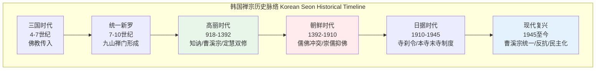
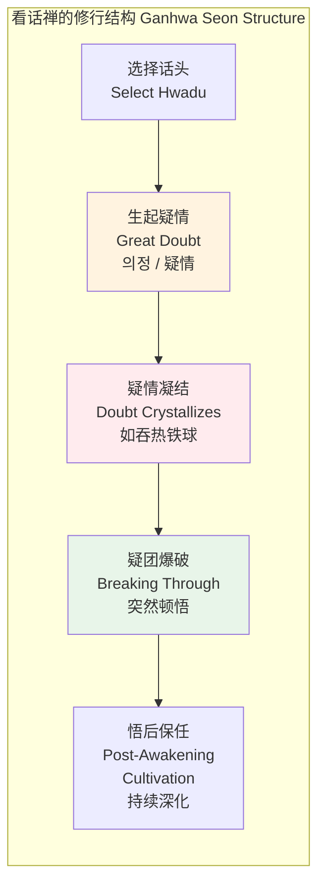
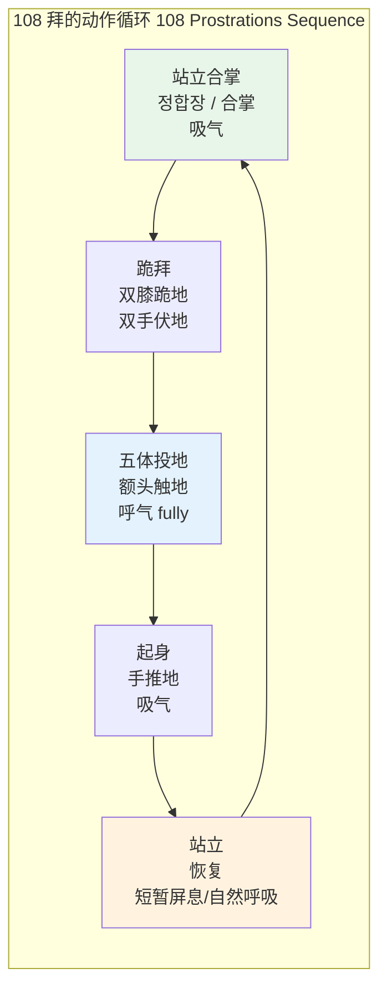
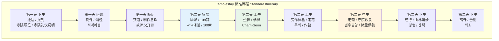

# 韩国禅（Seon）专业概述

> **适用对象**：对东亚禅宗传统感兴趣的冥想练习者、韩国文化研究者、寻求深度禅修体验者  
> **阅读时长**：约 35–45 分钟（可分段阅读）  
> **实践建议**：初学者建议从 Templestay 体验开始；108 拜与 Hwadu 参究需在指导下进行  
> **最后更新**：2026-05

---

## 一、历史脉络

### 1.1 中国禅宗传入朝鲜半岛

韩国禅（Seon / 선 / 禪）的历史可追溯至**三国时代**（公元前57年–公元668年）：

| 时期 | 关键事件 | 代表人物 |
|-----|---------|---------|
| **高句丽（372年）** | 中国前秦僧顺道携佛经佛像入高句丽，佛教正式传入朝鲜半岛 | 顺道（Sundo） |
| **百济（384年）** | 东晋僧摩罗难陀（Malananda）入百济 | 摩罗难陀 |
| **新罗（7世纪）** | 僧侣入唐求法，将禅宗各宗派引入新罗 | 元晓（Wonhyo）、义湘（Uisang） |
| **统一新罗（668–935）** | 禅宗九山派形成；念佛结社运动兴起 | 道义（Doui，马祖道一法嗣）、慧哲（Hyecheol） |

**禅宗九山（Gusan Seonmun / 九山禅门）**：统一新罗时期，入唐求法的僧侣将禅宗带回，在各地形成九个以山地寺院为中心的禅宗派系，包括迦智山派、实相山派、圣住山派、师子山派、阇崛山派、凤林山派、菩提山派、涉岾山派、须弥山派。这是韩国禅宗独立宗派的起源。

### 1.2 高丽时期：知讷禅师与曹溪宗

**高丽王朝**（918–1392）是韩国佛教的黄金时代。寺院经济繁荣，大藏经雕版（高丽大藏经）完成。

- **知讷禅师（Jinul / Chinul, 1158–1210）**：韩国禅宗史上最重要的人物
  - 创立**曹溪宗（Jogye Order / 조계종 / 曹溪宗）**，取法于中国六祖慧能驻锡的曹溪
  - 提出**"定慧双修"**（Simultaneous Cultivation of Samādhi and Prajñā），试图调和当时渐修派（以华严宗为代表）与顿悟派（以禅宗为代表）的争论
  - 著有《白云守端禅师语录》《普照国师语录》等
  - 建立**松广寺（Songgwangsa）**的修行制度，影响延续至今



### 1.3 朝鲜时代：儒佛的冲突与压制

**朝鲜王朝**（1392–1910）建立后，以程朱理学为国教，佛教遭遇系统性压制：

- **土地剥夺**：寺院大量田产被没收，经济来源断绝
- **社会歧视**：僧侣被禁止入城，被视为贱民阶层
- **宗派合并**：将高丽时期的多个宗派强行合并为**禅宗（Seon）**与**教宗（Gyo）**两宗，后进一步合并为**曹溪宗**
- **隐遁山林**：佛教被迫退入深山，反而促成了**深山禅修传统**的纯粹化——远离政治与世俗，专注实修

**意外后果**：压制虽然残酷，却使得韩国禅宗的**实修传统**相对于中国和日本更为完整地保存下来。朝鲜时代后期涌现了**休静（Hyujeong / 1520–1604）**等一批高僧，他们在壬辰倭乱（1592–1598）中组织僧兵抗战，一度提升了佛教的社会地位。

### 1.4 日本殖民时期的压制

**日本殖民统治**（1910–1945）对韩国佛教造成了深远创伤：

- **寺刹令（1911）**：日本殖民政府颁布《寺刹令》，将韩国寺院纳入日本佛教（主要是曹洞宗和临济宗）的**本寺末寺制度**，强迫韩国僧侣娶妻食肉
- **分化策略**：培植亲日派僧侣，分裂韩国佛教界
- **文化掠夺**：大量佛教文物、典籍被运往日本

**反抗与坚守**：以**万海韩龙云（Han Yong-un / 1879–1944）**为代表的独立运动僧侣，既参与抗日独立运动，也推动佛教改革。韩龙云所著《朝鲜佛教维新论》主张佛教的现代化与社会参与。

### 1.5 现代韩国佛教的复兴

- **1945年后**：摆脱殖民统治，曹溪宗立即废除僧妻制，恢复独身传统
- **1962年**：曹溪宗与大韩佛教天台宗成为韩国两大主要宗派
- **1970–1990年代**：经济起飞期的宗教复兴；寺院数量与信众人数大幅增长
- **2000年代至今**：Templestay 国际化、企业冥想项目、神经科学研究

---

## 二、核心理论

### 2.1 Seon 的核心：直指人心，见性成佛

韩国 Seon 承继中国禅宗六祖慧能的传统，核心教义可概括为：

> **直指人心（Jikji sim / 직지심 / 直指心），见性成佛（Gyeonseong seongbul / 견성성불 / 見性成佛）**

这意味着：
- **佛性（Buddha-nature / 불성 / 佛性）**并非需要通过长期修行慢慢积累的东西，而是**人人本自具足**
- 修行的目的不是"成为"佛，而是**"发现"**自己本来就是佛
- 语言和概念是障碍；真理必须被**直接体验**，不能被教授

### 2.2 Hwadu 话头

**话头（Hwadu / 화두 / 話頭）**是韩国 Seon 最具特色的修行方法，相当于中国禅宗的"公案"（Gongan / 公案）。

| 特征 | 说明 |
|-----|------|
| **定义** | 一句看似荒谬或无解的话、一个问题、一个情境，作为冥想专注的对象 |
| **功能** | 切断逻辑思维（discursive thinking），迫使心进入"疑情"（Great Doubt / 의정 / 疑情）状态 |
| **经典范例** | "我是谁？"（나는 누구인가）、"念佛是谁？"（염불하는 이는 누구인가）、"万法归一，一归何处？" |
| **操作** | 将话头像咀嚼口香糖一样持续"含在口中"，不问答案，只是持续追问 |

**话头 vs. 公案**：严格来说，话头（Hwadu）是公案（Gongan）中的核心句子。韩国 Seon 更强调话头的**持续参究**，而非公案整体故事的研习。

### 2.3 Ganhwa Seon 看话禅

**看话禅（Ganhwa Seon / 간화선 / 看話禪）**是由中国大慧宗杲（1089–1163）系统发展、由知讷引入韩国并深化的修行体系：



**疑情（Great Doubt）**是看话禅的核心动力。它不是普通的怀疑或困惑，而是一种**全身心投入、如吞热铁球、吐不出咽不下**的紧迫追问。知讷认为，疑情足够强大时，会像炸药一样炸开自我与世界的二元对立。

### 2.4 Silent Illumination 默照

**默照（Mukjo / 묵조 / 默照）**是与看话禅并行的另一修行路径，主要与曹洞宗传统相关：

- **默（Muk / 묵 / 默）**：静默、不涉思维、不费力
- **照（Jo / 조 / 照）**：觉照、觉知、光明
- 默照意味着：**在不造作、不努力的静默中，本然的觉照自然显现**

与看话禅的**主动参究**形成对比，默照是**被动开放**的。两者在韩国 Seon 中并非对立，而是针对不同根器修行者的不同法门。

### 2.5 Jogye Order 曹溪宗

**大韩佛教曹溪宗（Jogye Order of Korean Buddhism / 대한불교조계종 / 大韓佛敵曹溪宗）**是韩国最大的佛教宗派：

- **历史**：直接承继知讷的曹溪宗法脉
- **规模**：管理全国约 **90% 的传统寺院**（约 2,000 余座）
- **总部**：首尔**曹溪寺（Jogyesa）**
- **教育**：设有韩国佛教大学（Dongguk University 东国大学、中央僧伽大学）
- **制度**：严格的僧伽制度，出家众（大僧 / 比丘）与在家众（在家信徒 / 优婆塞/夷）分明

---

## 三、主要修习方法

### 3.1 Cham-Seon 参禅

**参禅（Cham-Seon / 참선 / 參禪）**是韩国 Seon 的基本坐禅方法。

**坐姿（七支坐法 / Seven Points of Posture / 칠지좌법）**：

| 要点 | 韩文 | 说明 |
|-----|------|------|
| **足** | 연가좌 / 跏趺坐 | 双盘（完全跏趺）或单盘（半跏趺）；若不可行，可用散盘或椅子 |
| **手** | 정인 / 定印 | 右手在下、左手在上，拇指轻触，置于脐下约 10 cm 处（禅定印） |
| **脊** | 척추 / 脊柱 | 脊柱自然挺拔，如叠铜钱，不前倾不后仰 |
| **肩** | 어깨 / 肩膀 | 两肩平展放松 |
| **舌** | 혀 / 舌 | 舌尖轻抵上颚，唾液自然下咽 |
| **目** | 눈 / 眼 | 眼睛微张，视线沿鼻端向下约 1 米处；不紧闭也不瞠视 |
| **头** | 머리 / 头 | 下巴微收，头顶虚顶（如被丝线上提） |

**与 Zazen 的异同**：

| 维度 | 韩国 Cham-Seon | 日本 Zazen |
|-----|---------------|-----------|
| **坐姿** | 七支坐法，与 Zazen 基本相同 | 同样七支坐法，某些流派强调盘腿的严格性 |
| **手部** | 定印（右手下、左手上） | 通常相同（法界定印） |
| **视线** | 眼微张，视线下垂 | 基本相同 |
| **核心方法** | **看话禅为主**，参究 Hwadu | **只管打坐（Shikantaza）**为主，纯然觉知 |
| **呼吸关注** | 初期可能用数息（Seon-sok / 선식）入门 | 同样可能用数息入门，但很快转入无对象觉知 |
| **公案使用** | **深度、持续地参究单一话头** | 临济宗有公案（Koan）制度，但方法与韩国 Ganhwa 有差异 |
| **修行强度** | 禅七期间每日坐禅 **10–16 小时** | 永平寺等传统道场的强度相似 |

### 3.2 Hwadu Gongan 话头公案

**参究方法**：

1. **选择话头**：初学者通常由师父分配一个话头，如"**我是谁？**"（나는 누구인가）或"**念佛是谁？**"（염불하는 이는 누구인가）
2. **持续追问**：在坐禅和日常生活中，不断将注意力带回话头
3. **切断思维**：当逻辑试图"解答"话头时，立即回到追问本身
4. **疑情生起**：持续参究会产生一种"如鲠在喉"的紧迫感——这就是疑情
5. **爆破与顿悟**：疑情到达临界点时，可能发生突然的顿悟体验（**Kensho / 견성 / 見性**）

**常见 Hwadu 选择**：

| 话头 | 韩文 | 来源/说明 |
|-----|------|----------|
| "我是谁？" | 나는 누구인가 | 最通用的入门话头；与西方"Who am I?" inquiry 类似 |
| "念佛是谁？" | 염불하는 이는 누구인가 | 源于中国禅宗；追问念佛的主体 |
| "万法归一，一归何处？" | 만법귀일 일귀허처 | 云门文偃公案；追问终极统一 |
| "狗子无佛性" | 건자무불성 | 赵州从谂公案；挑战佛性概念的边界 |
| "拖死尸的是谁？" | 타사시적시수 | 追问"这个身体"的主人 |

### 3.3 108 拜（108 Prostrations / 108배 / 百八拜）

108 拜是韩国佛教中独特的**身体冥想**，将礼拜、呼吸与忏悔整合为一体。

**象征意义**：
- **108** 代表人世的 108 种烦恼（십팔번뇌 / 十八烦恼的六种组合）
- 每拜一次，象征放下一种烦恼

**操作方法**：



**呼吸配合**：
- **站立合掌**：缓慢吸气
- **跪拜至五体投地**：缓慢呼气，额头触地时呼气完成
- **起身**：吸气
- **节奏**：约 3–5 秒完成一个循环；108 拜全程约 **15–25 分钟**

**身心效应**：
- 身体层面：温和的有氧运动、脊柱屈伸、下肢肌群激活
- 呼吸层面：建立稳定的呼吸节律，呼吸深度自然增加
- 心理层面：重复的仪式动作诱导**轻度恍惚/专注状态**；忏悔与感恩的情绪整合
- 神经科学层面：前额叶皮层在重复动作中进入低激活状态，与 DMN 的变化相关

### 3.4 Seon Meditation Retreats 禅七 / 冬安居

韩国寺院的**密集禅修制度**是 Seon 传统的核心载体。

| 类型 | 韩文 | 时间 | 内容 |
|-----|------|------|------|
| **夏安居** | 하안거 / 夏安居 | 农历四月十六至七月十五 | 雨季期间禁足修行；传统上佛陀时代制定 |
| **冬安居** | 동안거 / 冬安居 | 农历十月十六至正月十五 | 韩国更重视冬安居；是全年最核心的修行期 |
| **禅七** | 참선칠일 / 禅七 | 连续 7 天 | 短期密集；每日坐禅 10+ 小时 |
| ** монастический日常** | 정진 / 精進 | 全年 | 早课（约 3:00–4:00 起床）、晨钟暮鼓、早晚课诵、劳作（우화 / 雨花） |

**典型一日作息（以松广寺为例）**：

| 时间 | 活动 | 韩文 |
|-----|------|------|
| 03:00 | 起床 | 기상 |
| 03:30 | 早课 / 诵经 | 조공 / 새벽예불 |
| 05:00 | 坐禅（一炷香） | 참선 |
| 06:00 | 早斋 | 조공양 |
| 07:30 | 劳作（雨花） | 우화 / 作務 |
| 10:00 | 坐禅 | 참선 |
| 12:00 | 午斋 | 오공양 |
| 14:00 | 坐禅 / 经行 | 참선 / 경행 |
| 17:00 | 药石（晚餐） | 약석 |
| 18:00 | 坐禅 / 开示 | 참선 / 개시 |
| 21:00 | 养息（就寝） | 양식 |

> **经行（Kyeonghaeng / 경행 / 經行）**：坐禅与坐禅之间的行走冥想。在走廊或庭院中以极慢的速度行走，保持与坐禅相同的觉知品质。

### 3.5 Tea Seon 茶禅

韩国茶礼（Dado / 다도 / 茶道，或称 Panyaro / 반야노 / 般若路）不仅是饮茶仪式，也是**冥想实践**：

- **慢**：每一个动作都极慢、极专注，如移动茶具、注水、品茶
- **简**：韩国茶礼比日本茶道更为朴素，强调**当下的直接体验**而非繁复的仪式美学
- **无我**：泡茶者与饮茶者的分别消融；茶即禅，禅即茶
- **草衣禅师（Cho Ui / 1786–1866）**：韩国茶禅的重要复兴者，著有《东茶颂》（Dongdasong），将饮茶提升到修行层面

### 3.6 Garden Seon 庭园禅

韩国传统园林（정원 / 庭园）被设计为**冥想空间**：

| 元素 | 象征 | 冥想功能 |
|-----|------|---------|
| **岩石** | 山、永恒、不动 | 坐姿观想对象；形态的抽象性切断概念思维 |
| **白砂/碎石** | 水、虚空、流动 | 枯山水式的空白空间提供心理"留白" |
| **松树** | 坚韧、长青、骨气 | 四季不变的绿色提供稳定感；"松风"是冥想的好伴侣 |
| **池塘** | 心、倒影、包容 | 水面倒影的观照；"心如止水"的直接体验 |
| **曲径** | 修行之路、非直线 | 身体的缓慢移动本身就是冥想 |

**代表性庭园**：
- **昌德宫后苑（秘苑）**（首尔）：朝鲜王室园林，融儒道释于一炉
- **潇洒园（Soswaewon）**（潭阳）：16世纪私家园林，韩国庭园美学巅峰
- **松广寺、海印寺等寺院园林**：以自然为本，最小人为干预

---

## 四、韩国佛教的独特特征

### 4.1 与儒教的融合——孝道的重视

韩国佛教的独特之处之一，是**在儒教社会的压力下发展出了对"孝"（효 / Hyo）的深度强调**：

- **盂兰盆经（Ullambana Sutra）**在韩国被特别重视；农历七月十五的**盂兰盆节（Obon / 报恩斋）**是年度大节
- **父母恩重经**的普及：强调报答父母恩情的佛教伦理
- **僧俗关系**：韩国僧侣与家庭的关系比日本更为紧密；出家后仍保持与家人的联系并不罕见

### 4.2 与萨满教的共存——山神信仰

韩国传统社会中，**佛教与萨满教（Musok / 무속 / 巫俗）并非对立，而是共存**：

- 几乎所有韩国大寺院都设有**山神阁（Sanshingak / 산신각 / 山神閣）**，供奉山神（Sansin / 산신 / 山神）
- 山神通常以**白发长须的老者骑虎**的形象出现，融合了道教神仙、本土山神与佛教护法神的特征
- 正月十五的**燃灯会**与萨满的村落仪式在同一社区中共存
- 这种**"双层信仰"**（Buddhism for the afterlife, Shamanism for this life）是韩国宗教生态的独特现象

### 4.3 女性出家传统

- **比丘尼（Biguni / 비구니 / 比丘尼）**在韩国佛教中占有重要地位
- **麻花寺（Magoksa）**、**桐华寺（Donghwasa）**等寺院有比丘尼僧团独立修行
- 与泰国等南传国家不同，韩国比丘尼享有**完整的受戒权和宗教地位**
- **曹溪宗第11教区本寺麻花寺**：是韩国最大的比丘尼修行中心之一

### 4.4 Templestay 项目

详见第五章。

---

## 五、Templestay 项目详解

### 5.1 起源与发展

**Templestay（템플스테이 / 寺刹체험）**是韩国佛教最具国际影响力的现代创新：

| 时间 | 事件 |
|-----|------|
| **2002年** | 为庆祝佛诞节（农历四月初八）和韩日世界杯，曹溪宗首次向外国游客开放寺院住宿体验 |
| **2003–2005年** | 项目快速扩展；从最初的几座寺院扩展到全国 30+ 座 |
| **2007年** | 成立"韩国佛教文化事业团"（Korean Buddhist Culture Foundation），Templestay 正式制度化 |
| **2010年代** | 成为韩国文化旅游的核心产品；年接待量突破 20 万人次 |
| **2020年代** | 新冠疫情后加速数字化转型；在线 Templestay、虚拟寺院导览出现 |

### 5.2 标准化流程

Templestay 通常提供 **1 夜 2 天**或 **2 夜 3 天**的体验套餐，内容高度标准化：



**核心体验元素**：

| 元素 | 韩文 | 说明 |
|-----|------|------|
| **108 拜** | 108배 | 所有 Templestay 的标配；通常在清晨进行 |
| **坐禅** | 참선 | 由僧侣指导基础 Cham-Seon；通常 30–60 分钟 |
| **钵盂供养** | 발우공양 | 寺院素食；四碗饭（饭、汤、菜、水）的持钵进食法 |
| **劳作** | 우화 / 作務 | 清扫、洗碗、整理等简单劳动；体验"日常即修行" |
| **师父开示** | 스님 법문 | 僧侣对佛教教理或日常生活的简短讲解；常有问答环节 |

### 5.3 对韩国旅游业的贡献

- **文化外交品牌**：Templestay 是韩国文化体育观光部主推的"韩国代表性文化体验"之一
- **经济贡献**：直接创造寺院收入；带动周边地区的餐饮、交通、手工艺产业
- **国际形象**：将韩国从"购物-整容-K-pop"的单一旅游形象，拓展为**精神文化旅游目的地**
- **数据**：疫情前（2019年）Templestay 年接待约 **30 万人次**，其中外国游客约 **15%**（主要来自日本、台湾、美国、欧洲）

### 5.4 争议与批评

| 批评类型 | 具体内容 | 回应/现状 |
|---------|---------|----------|
| **过度商业化** | Templestay 被批评为"佛教迪士尼"，修行体验被稀释为旅游表演 | 部分寺院坚持小型、深度体验；官方推动分级认证体系 |
| **文化浅层化** | 外国游客可能将 1 夜的体验等同于"理解韩国佛教" | 推出 3 夜、7 夜甚至更长时间的深度项目 |
| **寺院负担** | 接待工作占用僧侣修行时间；部分小寺院设施不足 | 政府补贴与寺院自愿参与相结合 |
| **性别问题** | 部分 Templestay 项目由男性僧侣主导，女性修行者声音不足 | 麻花寺等比丘尼寺院提供以女性视角为主的 Templestay |

---

## 六、与现代生活的交汇

### 6.1 韩国高压社会中的冥想需求

- **教育压力**：韩国学生在 OECD 国家中学习时长最长；考前焦虑、抑郁比例高
- **职场文化**："加班文化"（야근 / 夜勤）、**等级制度（seniority system）**导致慢性压力
- **冥想作为应对机制**：越来越多韩国人将 Cham-Seon 视为**心理健康的自助工具**，而非宗教皈依
- **寺院周末课程**：曹溪寺等都市寺院提供面向上班族的**周末禅修班**（주말선방 / 周末禅房）

### 6.2 企业冥想项目

| 企业类型 | 实践形式 | 效果 |
|---------|---------|------|
| **大型财阀** | 邀请僧侣进行企业内训；高管 Templestay | 压力管理、领导力中的"正念"元素 |
| **初创企业** | 办公室 10 分钟呼吸冥想；午休坐禅 | 提升专注力、减少倦怠 |
| **政府/公共部门** | 公务员压力管理项目纳入冥想 | 韩国政府推动的"国民幸福"政策的一部分 |

### 6.3 K-pop 明星与冥想

- **BTS（防弹少年团）**：成员多次在访谈中提及冥想对心理健康的帮助；其歌词中也出现"爱自己"（self-love）等近似正念的概念
- **寺院参访成为明星"形象管理"**：部分明星公开参加 Templestay，带动年轻粉丝关注
- **批评**：也存在"灵性消费主义"的担忧——冥想被简化为"减压工具"而非深度修行

### 6.4 数字排毒 Digital Detox

- **智能手机成瘾**是韩国严重的社会问题（"手机僵尸"/스마트폰 좀비）
- **寺院数字排毒**：部分 Templestay 推出"无手机"体验，要求参与者全程上交电子设备
- **都市数字排毒咖啡馆**：受 Templestay 启发，首尔出现提供静默空间、无 Wi-Fi 的"静心咖啡馆"

---

## 七、科学视角

### 7.1 韩国大学对 Seon 的神经科学研究

近年来，韩国科研机构对 Seon 冥想进行了系统的神经科学研究：

| 研究机构 | 研究方向 | 主要发现 |
|---------|---------|---------|
| **首尔国立大学（SNU）** | Hwadu 参究的 fMRI 研究 | 持续参究话头时，**前额叶皮层（PFC）**活性降低，**后扣带皮层（PCC）**活动减弱——与 DMN 的下调一致 |
| **韩国脑研究院（KBrain）** | 长期禅修者的脑结构 MRI | 长期 Seon 修行者（10 年+）的**岛叶（insula）**灰质密度增加，与内感受（interoception）能力提升相关 |
| **东国大学（佛教大学）** | 108 拜的生理效应 | 108 拜可显著降低皮质醇水平；心率变异性（HRV）在完成后 30 分钟内显著提升 |
| **KAIST / 科学技术院** | 脑波与 Hwadu 状态 | 深度参究状态下，γ 波（30–100 Hz）在高级修行者中出现同步爆发，与顿悟报告有时序关联 |

### 7.2 Hwadu 对大脑默认模式网络的影响

```mermaid
graph TD
    subgraph Hwadu 参究的神经机制 Neural Mechanisms of Hwadu
        A1[持续追问 Hwadu<br/>"我是谁？"] --> A2[逻辑前额叶<br/>持续尝试解答]
        A2 --> A3[反复失败<br/>→ 认知疲劳]
        A3 --> A4[前额叶活动降低<br/>DMN 关键节点<br/>后扣带皮层 PCC<br/>活跃度下降]
        A4 --> A5[自我叙事暂时中断<br/>Self-Narrative Suspension]
        A5 --> A6[顿悟可能<br/>Insight / Satori<br/>γ波同步爆发]
    end

    style A3 fill:#fff3e0
    style A4 fill:#e3f2fd
    style A6 fill:#e8f5e9
```

**默认模式网络（DMN）**：
- DMN 是大脑在静息状态下的活跃网络，负责**自我参照思维、自传体记忆、心智游移**
- 抑郁症、焦虑症的 DMN 过度活跃与反刍思维（rumination）密切相关
- 韩国研究表明，Hwadu 参究——尤其是**持续将注意力从思维内容转移到追问本身**——可能是一种"强制关闭 DMN"的技术
- 这与正念（Mindfulness）的"去中心化观察"不同：Hwadu 更加**主动、聚焦、具有认知挑战性**

---

## 八、实践指引

### 8.1 入门路径：Templestay 预约

| 步骤 | 操作 | 网址/方式 |
|-----|------|----------|
| **1. 选择寺院** | 访问 Templestay 官方网站的"寻找寺院"功能 | [templestay.com](https://templestay.com) |
| **2. 语言选择** | 筛选提供英语/中文/日语服务的寺院 | 大城市寺院（曹溪寺、奉恩寺）语言支持最好 |
| **3. 类型选择** | 体验型（Relaxation）vs. 修行型（Training） | 首次建议选择体验型；寻求深度者选择修行型 |
| **4. 时间预订** | 旺季（春季、秋季）需提前 2–4 周预订 | 在线预订系统支持信用卡支付 |
| **5. 准备** | 阅读寺院礼仪指南；准备宽松衣物 | 寺院提供僧服（松广袍）但需自备内衣和洗漱用品 |

**礼仪提醒**：
- 进入大殿需脱鞋、脱帽
- 穿着需保守（不露肩、不露膝）
- 禁止在佛像前拍照
- 用斋时保持安静，遵循"四思量"（计功多少、量彼来处、防心离过、正事良药）

### 8.2 在家修习方法

对于无法前往寺院的人，可以在家建立简化的 Seon 修习：

| 时间 | 修习内容 | 时长 |
|-----|---------|------|
| **清晨（起床后）** | 108 拜或 21 拜简化版 | 10 分钟 |
| **日间间隙** | 话头参究：在日常活动中偶尔带回"我是谁？" | 数秒至数分钟 |
| **晚间（睡前）** | 坐禅：基础呼吸觉察或数息 | 15–30 分钟 |
| **周末** | 延长坐禅至 45 分钟；阅读 Seon 经典（如知讷《修心诀》） | 1–2 小时 |

**在家坐禅步骤**：
1. 选择安静角落，铺坐垫或薄毯
2. 设定闹钟（建议从 15 分钟开始）
3. 采用七支坐法（椅子坐亦可，臀部垫高）
4. 先做 3–5 次深呼吸放松
5. 开始数息（1 到 10，循环）或参究话头
6. 结束时，缓慢睁眼，双手搓热按摩面部，缓缓起身

### 8.3 常见 Hwadu 选择指南

| 练习者类型 | 推荐话头 | 理由 |
|-----------|---------|------|
| **完全初学者** | "呼吸的是谁？" | 与呼吸觉察自然衔接，不突兀 |
| **有正念基础者** | "我是谁？" | 从观察身体/呼吸自然过渡到追问主体 |
| **寻求突破者** | "万法归一，一归何处？" | 更具挑战性，能快速生起疑情 |
| **生活压力大者** | "烦恼的是谁？" | 直接将话头应用于当下的情绪困境 |

### 8.4 108 拜的操作方法

**简化版（21 拜）适合初学者**：

1. 面向东方（象征佛陀与日出）或任何安静方向
2. 每拜配合一次完整呼吸
3. 心中可默念佛号（"南无阿弥陀佛"）或保持静默
4. 不求速度，求**每一拜的质量**——身体的伸展、呼吸的完整、当下的觉知
5. 若体力不支，可改为**半拜**（跪而不伏地）或**合掌鞠躬**

**安全提示**：
- 膝关节有问题者，可在膝盖下垫软垫
- 高血压患者避免过快起身（防止体位性低血压）
- 孕期女性应咨询医生后谨慎进行

---

## 附录：韩国 Seon / 日本 Zazen / 中国 Chan 差异对比表

| 维度 | 韩国 Seon | 日本 Zazen | 中国 Chan |
|-----|----------|-----------|----------|
| **历史起源** | 7世纪中国禅宗传入；知讷（12世纪）整合曹溪宗 | 12世纪荣西/道元传入；分临济/曹洞 | 6世纪达摩传入；六祖慧能（7世纪）革新 |
| **最大宗派** | **曹溪宗（Jogye Order）** | 曹洞宗（Soto）、临济宗（Rinzai） | 禅宗分散；无单一最大宗派；禅宗与净土融合常见 |
| **核心方法** | **看话禅（Ganhwa Seon）**深度参究单一话头 | 曹洞：**只管打坐（Shikantaza）**；临济：**公案（Koan）** |  diverse：话头禅、默照禅、念佛禅、生活禅 |
| **公案/话头** | **持续追问同一话头**，疑情为关键 | 临济：由师父检验对公案的"回应"；曹洞：无公案 | 复兴期重视话头；历史上"开悟诗"传统 |
| **仪式元素** | **108拜**是核心日常实践 | 较少拜佛；坐禅本身即核心 | 因寺院而异；部分寺院恢复传统仪轨 |
| **僧俗关系** | **Templestay**成为国际名片；都市寺院提供周末课程 | **坐禅会（Zazenkai）**面向社会；寺院住宿（住坊）需长期 commitment | 短期禅修班普及；少林寺等商业化程度高 |
| **饮食** | **钵盂供养**（발우공양）；严格的寺院素食 | 精進料理（Shojin Ryori）更为精致化；部分寺院允许鱼（靖国等） | 寺院素食；部分地区融合地方菜系 |
| **女性出家** | **比丘尼地位较高**；有独立比丘尼寺院区 | 尼僧（Ama）存在但地位低于僧；部分寺院不允许女性进入 | 比丘尼传统存在；历史上曾因戒律争论 |
| **与其他传统关系** | **与萨满教共存**（山神阁）；受儒教孝道影响深 | 与神道教有历史互动；明治时期"废佛毁释"创伤 | 与道教、儒教深度交融；文革创伤后复兴 |
| **现代创新** | **Templestay**（2002年始）；企业冥想；神经科学研究 | 乔布斯影响下的西方普及；**正念（Mindfulness）**的日本来源；森林浴（Shinrin-yoku） | 生活禅（净慧法师）；居士佛教兴盛；网络弘法 |
| **典型一日强度** | 禅七期间 **12–16 小时**坐禅 | 永平寺等传统道场强度相当；都市坐禅会较轻 | 短期禅修班通常 6–8 小时；长期出家强度不一 |
| **代表寺院** | 松广寺（Songgwangsa）、海印寺（Haeinsa）、曹溪寺（Jogyesa） | 永平寺（Eihei-ji）、总持寺（Soji-ji）、妙心寺（Myoshin-ji） | 少林寺、柏林禅寺、净慧寺、佛光山（台湾） |

---

> **延伸阅读建议**：
> - Buswell, R. E. (1992). *The Zen Monastic Experience: Buddhist Practice in Contemporary Korea*.
> - 知讷（Jinul）. 《修心诀》（*Susimkyeol* / 수심결 / 修心訣）.
> - 韩龙云（Han Yong-un）. 《朝鲜佛教维新论》.
> - 官方资源：[Templestay 官网](https://eng.templestay.com)
> - 重要提醒：本文件中的 Templestay 信息可能因寺院政策调整而变化，请以官方网站最新信息为准。任何高强度的禅修活动（如禅七）应循序渐进，有心脏病、精神疾病史者需事先咨询医生与寺院。

*Peace Lab Database — Meditation Knowledge Base*
