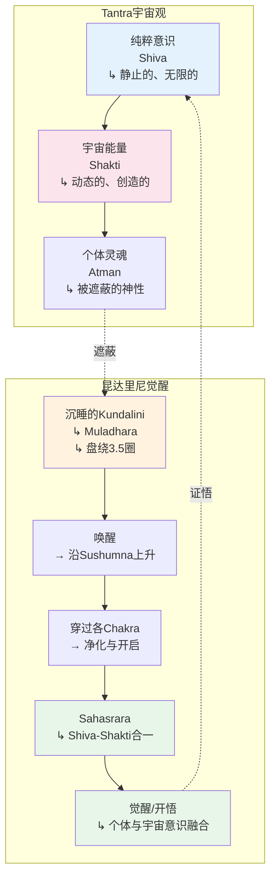
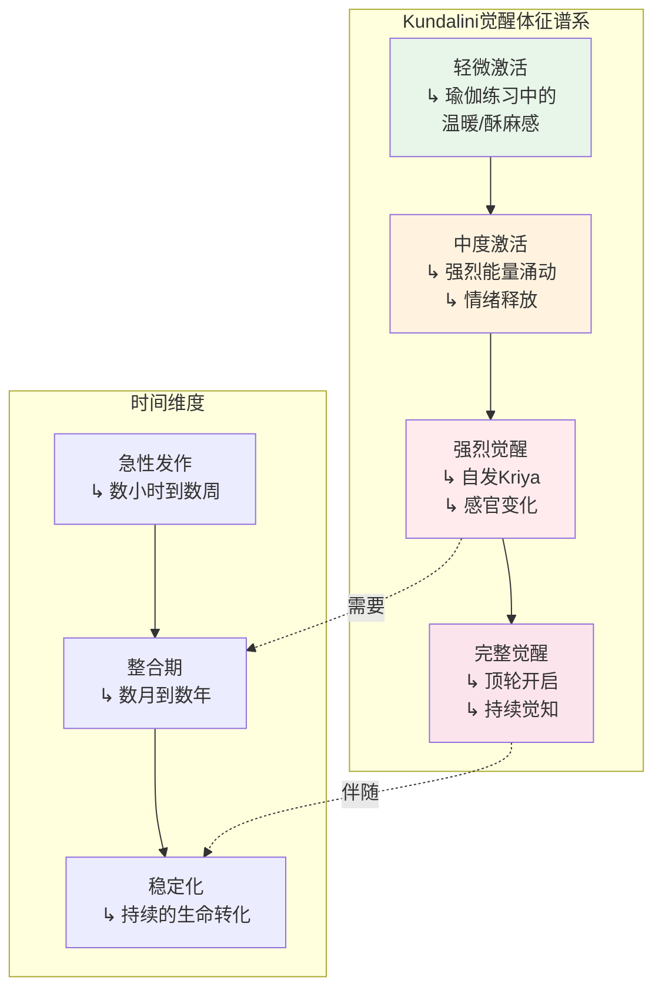
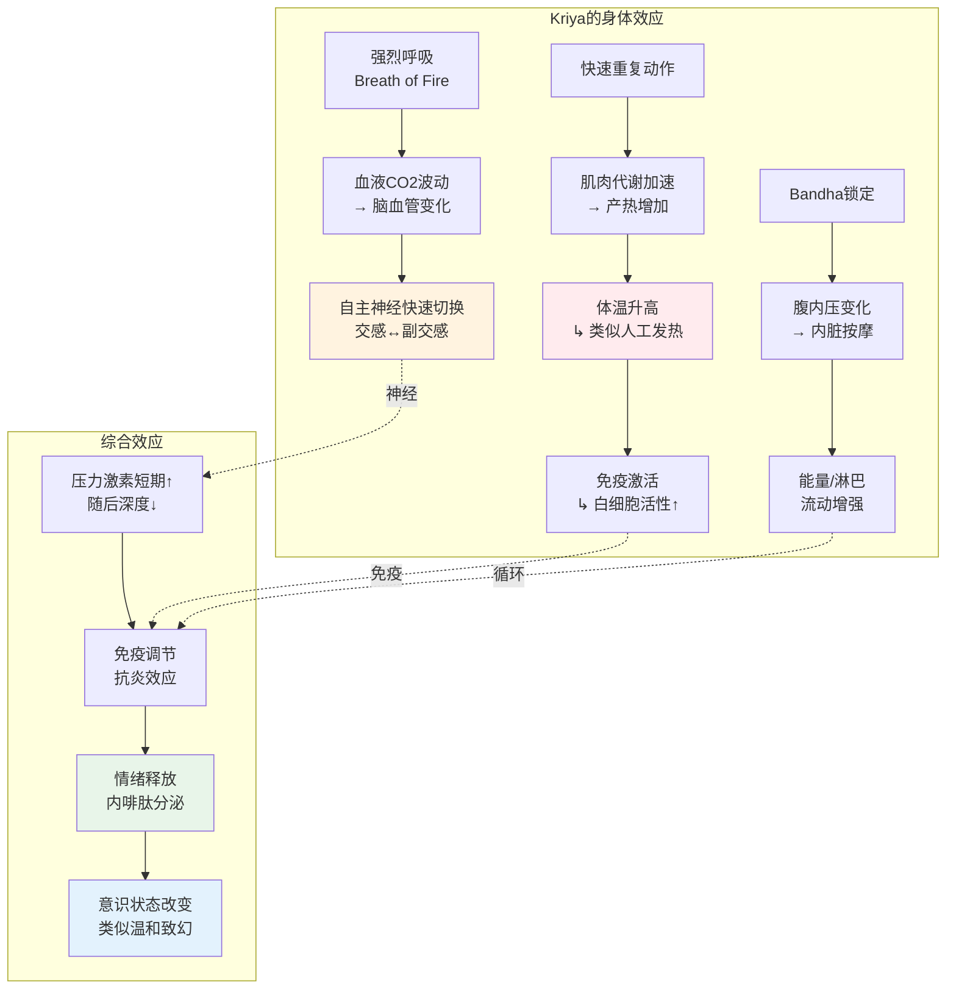
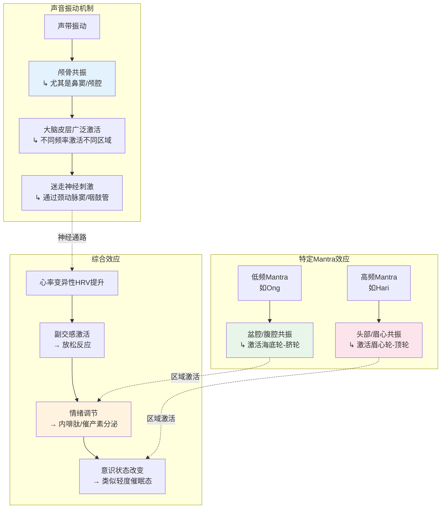

# 昆达里尼冥想专业概述：从Tantra传统到现代Kundalini Yoga

> **适用对象**：对瑜伽能量体系有兴趣的进阶练习者、瑜伽教练、身心疗愈从业者、创伤康复研究者  
> **阅读时长**：约 40–50 分钟（可分段阅读）  
> **实践建议**：Kundalini技术具有一定强度，请循序渐进，有导师指导更佳  
> **最后更新**：2026-05

---

## 一、历史与经典来源

### 1.1 Tantra传统——昆达里尼的源头

昆达里尼（Kundalini，梵语：कुण्डलिनी）的概念起源于印度次大陆的**Tantra传统**（约公元5-9世纪），而非主流的吠陀传统。Tantra一词意为"织就、扩展"，代表了一套与吠陀仪式截然不同的精神技术体系。

**Tantra的核心特征**：

| 特征 | 吠陀传统 | Tantra传统 |
|------|---------|-----------|
| **世界观** | 二元对立：神圣 vs 世俗 | 非二元：一切都是神圣能量的显现 |
| **身体态度** | 身体是束缚，需超越 | 身体是神圣圣殿，是觉醒的载体 |
| **能量观** | 未系统化 | 人体是微宇宙，蕴含宇宙能量（Shakti） |
| **修行方法** | 祭祀、苦行、知识 | 仪式、曼陀罗、观想、呼吸控制、性能量转化 |
| **目标** | 解脱（Moksha），与梵合一 | 觉醒（Moksha/Bhukti），在世间即体验神性 |

**Tantra中的昆达里尼萌芽**：
早期的Tantra文本（如《Mahabhuta Tantra》《Kubjika Tantra》）中，昆达里尼被描述为一条**沉睡于海底轮（Muladhara）的蛇形能量**。这条蛇盘绕三圈半，阻塞了中脉（Sushumna）的入口。当通过特定的修行技术唤醒它时，它会沿中脉上升，穿过各个脉轮（Chakra），最终在顶轮（Sahasrara）与湿婆（Shiva，代表纯粹意识）合一。



### 1.2 《哈他瑜伽之光》（Hatha Yoga Pradipika）——系统化的里程碑

14世纪，斯瓦特玛拉玛（Swatmarama）撰写了《哈他瑜伽之光》（Hatha Yoga Pradipika），这是第一部将昆达里尼理论与哈他瑜伽身体技术系统整合的经典。

**核心贡献**：

| 方面 | 内容 |
|------|------|
| **理论框架** | 将昆达里尼、脉轮、Nadi（能量通道）系统化，与哈他瑜伽的体式（Asana）、清洁法（Shatkarma）、呼吸法（Pranayama）整合 |
| **Pranayama** | 详细描述了对唤醒Kundalini至关重要的呼吸控制技术，包括Kumbhaka（悬息）、Nadi Shodhana（经脉净化） |
| **Bandha & Mudra** | 系统阐述了身体锁定（Bandha）和手印（Mudra）对能量引导的作用，尤其是Mula Bandha（根锁）、Uddiyana Bandha（腹锁）、Jalandhara Bandha（喉锁） |
| **Nada（内音）** | 描述冥想中会出现的内在声音（如钟声、雷鸣、笛声），作为Kundalini觉醒的标志 |

**关键章节摘录**：

> *"当沉睡的昆达里尼被唤醒，它像一条被击打头部的蛇，直立起来。穿过中脉，它直达梵穴（Brahmarandhra），那里是解脱之门。"* ——《哈他瑜伽之光》第三章

### 1.3 斯瓦特玛拉玛（Swatmarama）与哈他瑜伽谱系

斯瓦特玛拉玛并非昆达里尼理论的原创者，而是**整合者**。他所处的时代，印度瑜伽传统已经积累了丰富的身体技术和能量理论，他将其编纂为一部可操作的练习手册。

**哈他瑜伽的传承谱系**：

```mermaid
graph TD
    subgraph 早期源头<br/>10-13世纪
        E1[Gorakhnath<br/>↳ Nath Sampradaya<br/>↳ 哈他瑜伽先驱] --> E2[Matsyendranath<br/>↳ 创始人]
        E2 --> E3[早期Tantra<br/>↳ Kaula / Kapalika]
    end

    subgraph 系统化时期<br/>14世纪
        S1[Swatmarama<br/>↳ 《哈他瑜伽之光》<br/>HYP 14世纪] --> S2[Gheranda<br/>↳ 《Gheranda Samhita》]
        S1 --> S3[Shiva Samhita<br/>↳ 另一部哈他经典]
    end

    subgraph 近现代转型<br/>19-20世纪
        M1[Swami Vivekananda<br/>↳ 1893芝加哥<br/>↳ 瑜伽西传先驱] --> M2[Yogi Bhajan<br/>↳ 1969来到西方<br/>↳ 创立3HO/Kundalini Yoga]
        M2 --> M3[Sivananda lineage<br/>↳ 全球传播<br/>↳ 整合各派]
    end

    E1 -.->|传承| S1
    S1 -.->|影响| M1
    S1 -.->|直接影响| M2

    style E1 fill:#e8f5e9
    style S1 fill:#fff3e0
    style M2 fill:#e3f2fd
```

### 1.4 Yogi Bhajan与Kundalini Yoga的西传

**Harbhajan Singh Khalsa**（1929–2004），被称为Yogi Bhajan，是将Kundalini Yoga系统引入西方的关键人物。

| 维度 | 内容 |
|------|------|
| **背景** | 出生于英属印度（今巴基斯坦），早年学习传统锡克教、哈他瑜伽和Kundalini Yoga |
| **西传** | 1968年受邀访问加州大学洛杉矶分校（UCLA），随后定居洛杉矶；1969年创立**3HO（Healthy, Happy, Holy Organization）** |
| **教学特点** | 将传统Kundalini技术（Kriyas、Pranayama、Mantra、Mudra）打包为一套标准化的课程体系；强调**家庭式修习**和**日常生活的灵性化** |
| **影响** | 使Kundalini Yoga成为西方最广泛传播的瑜伽形式之一；培养了数千名教师；影响了瑜伽、冥想、身心灵产业的商业化格局 |
| **争议** | 见第五节"安全与争议" |

**Yogi Bhajan体系的独特之处**：
- **白装传统**：练习者穿白色棉质服装，象征纯洁和能量放大
- **包头巾**：覆盖头顶（顶轮区域），据说可以" contain the energy"
- **早起修习**：推荐在清晨4-7点（Amrit Vela，"甘露时刻"）进行Sadhana（日常灵性修习）
- **Sadhana配方**：通常包括Japji Sahib（锡克教经文诵读）、Kriya练习、冥想、唱诵

### 1.5 历史发展的关键节点

| 时期 | 事件/人物 | 意义 |
|------|----------|------|
| **5-9世纪** | Tantra经典形成 | 昆达里尼概念的诞生 |
| **9-13世纪** | Nath Siddha传统 | 哈他瑜伽的身体技术积累；Gorakhnath等大师将瑜伽与世俗生活结合 |
| **14世纪** | Swatmarama《哈他瑜伽之光》 | 昆达里尼理论与身体技术的系统整合 |
| **15-17世纪** | Hatha Yoga Pradipika传播 | 印度各地的瑜伽传统吸收哈他技术 |
| **1893年** | Swami Vivekananda芝加哥世界宗教议会 | 印度瑜伽首次大规模进入西方视野 |
| **1920-50年代** | Krishnamacharya在Mysore教学 | 现代体式瑜伽（Asana-based Yoga）的奠基 |
| **1969年** | Yogi Bhajan定居美国 | Kundalini Yoga作为独立体系在西方的确立 |
| **1990年代至今** | 全球化与商业化 | Kundalini Yoga在全球范围内的传播、教师培训体系的建立、争议事件曝光 |

---

## 二、核心理论

### 2.1 昆达里尼（Kundalini）——蛇形沉睡能量

昆达里尼是Kundalini Yoga的核心操作对象。这个词来自梵语词根"Kundala"（कुण्डल），意为"盘绕的"，形容一条盘绕的蛇。

**昆达里尼的多层含义**：

| 层面 | 含义 | 隐喻 |
|------|------|------|
| **字面** | 盘绕的能量，如蛇般蜷曲 | 沉睡、潜在、待唤醒 |
| **生理层面** | 位于脊柱底部的生命能量储备 | 与盆底神经丛、骶神经、内分泌系统的关联 |
| **心理层面** | 潜意识中被压抑的创造力、性欲、生命力 | 荣格心理学中的"集体无意识"原型 |
| **灵性层面** | 个体灵魂与宇宙神性连接的最终通道 | Shakti（动态能量）回归Shiva（静止意识） |

**经典描述**：
- 《Shiva Samhita》："她（昆达里尼）像一条盘绕的蛇，以睡眠覆盖Brahmarandhra（顶轮开口）的入口。当她被瑜伽唤醒时，她直立起来，打开解脱之门。"
- 盘绕**三圈半**：隐喻三次完整的能量循环（对应三脉：Ida、Pingala、Sushumna）加上半圈（进入中脉的转折）

### 2.2 七脉轮系统（Sapta Chakra）

脉轮（Chakra，梵语：चक्र，意为"轮"）是人体能量系统的核心节点。传统哈他瑜伽描述的主要脉轮有六个，加上顶轮外的人天交界点，形成七脉轮体系。

```mermaid
graph TD
    subgraph 七脉轮系统<br/>Seven Chakra System
        C7[Sahasrara<br/>顶轮<br/>↳ 千瓣莲花<br/>↳ 纯粹意识<br/>↳ 紫/白色] --> C6[Ajna<br/>眉心轮<br/>↳ 两眉之间<br/>↳ 直觉/智慧<br/>↳ 靛蓝色]
        C6 --> C5[Vishuddha<br/>喉轮<br/>↳ 喉部<br/>↳ 表达/沟通<br/>↳ 天蓝色]
        C5 --> C4[Anahata<br/>心轮<br/>↳ 胸骨中央<br/>↳ 爱/慈悲<br/>↳ 绿色]
        C4 --> C3[Manipura<br/>脐轮<br/>↳ 肚脐上方<br/>↳ 意志/力量<br/>↳ 黄色]
        C3 --> C2[Svadhishthana<br/>生殖轮<br/>↳ 耻骨上方<br/>↳ 情绪/创造<br/>↳ 橙色]
        C2 --> C1[Muladhara<br/>海底轮<br/>↳ 会阴/尾骨<br/>↳ 生存/根基<br/>↳ 红色]
    end

    subgraph 昆达里尼上升路径
        K1[沉睡于Muladhara] --> K2[唤醒 → 依次穿过各Chakra]
        K2 --> K3[每个Chakra的开启<br/>→ 对应能力的激活]
        K3 --> K4[Sahasrara合一<br/>↳ 与Shiva-Shakti融合]
    end

    C1 -.->|起点| K1
    C7 -.->|终点| K4

    style C1 fill:#b71c1c
    style C2 fill:#e65100
    style C3 fill:#f9a825
    style C4 fill:#43a047
    style C5 fill:#1e88e5
    style C6 fill:#5e35b1
    style C7 fill:#8e24aa
```

**各脉轮详解**：

| 脉轮 | 梵名 | 位置 | 元素 | 功能/心理主题 | 身体对应 | 曼陀罗音节 |
|------|------|------|------|-------------|---------|-----------|
| **海底轮** | Muladhara | 会阴/尾骨尖端 | 土 Earth | 生存、安全感、根基 | 盆底肌、腿、脚、骨骼 | LAM |
| **生殖轮** | Svadhishthana | 耻骨上方、下腹部 | 水 Water | 情绪、性欲、创造力、关系 | 生殖器官、膀胱、肾脏 | VAM |
| **脐轮** | Manipura | 肚脐上方、太阳神经丛 | 火 Fire | 意志力、个人力量、自尊 | 消化系统、胰腺、肾上腺 | RAM |
| **心轮** | Anahata | 胸骨中央、心脏水平 | 风 Air | 爱、慈悲、连接、接纳 | 心脏、肺、胸腺 | YAM |
| **喉轮** | Vishuddha | 喉结水平、颈部中央 | 空/以太 Ether | 表达、沟通、真理、聆听 | 甲状腺、喉咙、口腔 | HAM |
| **眉心轮** | Ajna | 两眉之间、眉心 | 光 Light | 直觉、洞察、智慧、想象力 | 松果体、垂体、双眼 | OM |
| **顶轮** | Sahasrara | 头顶中央、百会 | 意识 Consciousness | 灵性觉醒、与神合一、超越 | 大脑皮层、神经系统 | 寂静/所有音节 |

**脉轮的"开启"意味着什么**：
传统描述中，昆达里尼上升时会"开启"或"净化"各个脉轮。这不应被理解为"打开开关"式的简单操作，而是一种**能量-心理-意识的综合转化过程**。每个脉轮的"开启"通常伴随着：
- 该脉轮对应身体区域的感觉变化（温热、脉动、酥麻）
- 对应心理主题的深刻体验（如心轮开启时涌现的爱与悲伤）
- 潜意识内容的浮现与释放（被压抑的记忆、情绪）

### 2.3 三脉系统（Nadi）——能量通道

Nadi（नाडी）是瑜伽生理学中的能量通道，类似于中医经络，但体系不同。

```mermaid
graph TD
    subgraph 三脉模型<br/>Three Main Nadis
        S1[Sushumna 中脉<br/>↳ 脊柱中央<br/>↳ 最精微的能量通道] --> S2[Ida 左脉<br/>↳ 脊柱左侧<br/>↳ 阴/月/清凉<br/>↳ 左鼻孔呼吸主导时活跃]
        S1 --> S3[Pingala 右脉<br/>↳ 脊柱右侧<br/>↳ 阳/日/温热<br/>↳ 右鼻孔呼吸主导时活跃]
    end

    subgraph 交汇点<br/>Chakra层面
        C1[Muladhara<br/>三脉起点] --> C2[Svadhishthana<br/>交汇]
        C2 --> C3[Manipura<br/>交汇]
        C3 --> C4[Anahata<br/>交汇]
        C4 --> C5[Vishuddha<br/>交汇]
        C5 --> C6[Ajna<br/>三脉合一]
    end

    S2 -.->|运行| C2
    S3 -.->|运行| C2
    S1 -.->|中央通道| C6

    style S1 fill:#fff3e0
    style S2 fill:#e3f2fd
    style S3 fill:#ffebee
    style C6 fill:#e8f5e9
```

**三脉详解**：

| Nadi | 位置 | 性质 | 对应 | 失衡表现 |
|------|------|------|------|---------|
| **Sushumna（中脉）** | 脊柱中央，从会阴到顶轮 | 中性、平衡、灵性 | 中央能量通道；昆达里尼的上升路径 | 堵塞时：灵性追求受阻，难以深入冥想 |
| **Ida（左脉）** | 脊柱左侧，从左鼻孔起 | 阴、月、Chandra、副交感主导 | 情绪、直觉、接受性、内在世界 | 过盛时：抑郁、昏沉、过度内向、冷漠 |
| **Pingala（右脉）** | 脊柱右侧，从右鼻孔起 | 阳、日、Surya、交感主导 | 行动、理性、外向性、外在世界 | 过盛时：焦虑、躁动、攻击性、失眠 |

**左右鼻孔交替与能量平衡**：
传统瑜伽认为，人的左右鼻孔的通气量会自然交替（约每90-120分钟转换一次主导鼻孔），这对应Ida和Pingala的交替主导。通过**Nadi Shodhana（左右交替鼻孔呼吸）**可以主动平衡两脉的能量。

### 2.4 Kundalini觉醒的体征

Kundalini觉醒是一个连续谱，从微弱的能量感动到强烈的灵性转化体验。以下是传统文献和现代经验报告中常见的觉醒体征：

#### 2.4.1 身体层面的体征

| 体征 | 传统描述 | 现代解读 |
|------|---------|---------|
| **脊柱能量感** | 如蛇沿脊柱上行 | 可能与脊髓神经、筋膜张力的变化有关 |
| **热量涌现** | 从脊柱底部涌起的温热或灼热 | 自主神经系统的强烈激活；可能与棕色脂肪组织产热有关 |
| **身体振动/颤抖** | 不自主的细微或明显抖动 | 神经系统释放长期积累的紧张；类似创伤释放机制 |
| **呼吸自动变化** | 呼吸变得极深、极快，或自动悬息 | 呼吸中枢被高级脑区抑制或激活 |
| **身体姿势自动调整** | 手自动结印、身体摆出特定体式（Kriya） | 深层神经系统和筋膜系统的自组织 |
| **感官增强或钝化** | 视觉/听觉变得异常敏锐，或暂时丧失 | 神经系统重组期间的暂时性现象 |

#### 2.4.2 心理-情绪层面的体征

| 体征 | 说明 |
|------|------|
| **情绪涌现** | 被压抑的情绪（悲伤、愤怒、恐惧）突然强烈释放 |
| **记忆的闪回** | 童年、前世（若相信轮回）或集体层面的记忆浮现 |
| **强烈的喜悦/狂喜** | 无原因的极乐感、与万物合一的爱 |
| **恐惧与死亡感** | "小我"的瓦解带来的存在性恐惧 |
| **认知重构** | 对自我、世界、时间的感知发生根本性变化 |

#### 2.4.3 灵性层面的体征

| 体征 | 传统描述 |
|------|---------|
| **内光（Inner Light）** | 闭眼时看到明亮的光，通常从眉心区域出现 |
| **内音（Inner Sound）** | 听到持续的嗡嗡声（OM）、钟声、笛声、水声等 |
| **直觉与洞见** | 突然获得超越日常逻辑的知识或理解 |
| **三摩地（Samadhi）体验** | 深度的禅定状态：时间感消失、主体-客体边界消融 |
| **持续觉知状态** | 觉醒后，觉知变得持续、不间断，即使在日常活动中 |



---

## 三、主要修习技术

### 3.1 Kriyas（净化动作）——Kundalini Yoga的核心

Kriya（क्रिया）意为"行动、净化、仪式"。在Kundalini Yoga中，Kriya是指**一系列有特定顺序的体式、呼吸、曼陀罗和冥想的组合**，旨在产生特定的身心效应。

**Kriya的结构特征**：

| 要素 | 说明 |
|------|------|
| **目的性** | 每个Kriya都有明确的目标（如：净化肝脏、增强意志力、打开心轮） |
| **重复性** | 通常包含大量重复动作（如：连续快速弯腰100次） |
| **强度** | 比哈他瑜伽的体式练习更为强烈，旨在"冲击"能量系统 |
| **综合性** | 同时运用体式（Asana）、呼吸（Pranayama）、声音（Mantra）、锁定（Bandha） |

**经典Kriya示例**：

| Kriya名称 | 主要内容 | 目标 | 强度 |
|----------|---------|------|------|
| **Sat Kriya** | 跪坐，双手上举，重复"Sat Nam"（吸气Sat，呼气Nam），同时收缩根锁（Mula Bandha） | 激活并提升昆达里尼能量；净化所有脉轮 | 高 |
| **Spinal Flex Series** | 坐式脊柱前后屈伸，配合Breath of Fire | 唤醒脊柱能量；灵活脊柱 | 中 |
| **Surya Kriya** | 站立序列，包含手臂大幅摆动、脊柱扭转、深蹲 | 激活太阳能量；增强个人力量 | 高 |
| **Heart Center Kriya** | 以心轮为中心的体式、呼吸和冥想序列 | 打开心轮；培养无条件的爱 | 中 |
| **Liver/Gallbladder Kriya** | 针对右侧躯干的扭转、伸展和敲击 | 净化肝脏和胆囊；释放愤怒 | 中 |

**Kriya的生理学效应**：



### 3.2 呼吸法（Pranayama）

#### 3.2.1 火焰呼吸（Breath of Fire / Kapalabhati变体）

火焰呼吸是Kundalini Yoga中最具特色的呼吸技术，也是最具争议的。

**操作方法**：
1. 鼻吸鼻呼，快速、有力、均匀地呼吸
2. 强调**主动呼气**（通过腹部快速内收），吸气为被动回弹
3. 频率约 **120-180次/分钟**（每秒2-3次）
4. 通常持续 **1-3分钟**，可分组进行

**效应机制**：

| 效应 | 机制 |
|------|------|
| **快速升温** | 代谢率急剧增加，产热增加 |
| **副交感随后激活** | 快速呼吸后的自然反弹，带来深度放松 |
| **腹腔泵效应** | 快速的腹部运动按摩内脏，促进淋巴回流 |
| **CO2波动** | 快速呼吸导致短暂的低碳酸血症，随后CO2恢复，产生轻度眩晕感 |
| **迷走神经刺激** | 快速切换的呼吸模式强烈刺激自主神经系统 |

**禁忌**：
- 孕期绝对禁止
- 高血压、心脏病患者需谨慎
- 癫痫患者禁止
- 饭后1小时内不宜
- 初学者应从短时间（30秒）开始

#### 3.2.2 长深呼吸（Long Deep Breathing）

与火焰呼吸形成对比，长深呼吸是Kundalini Yoga中的基础放松呼吸。

**操作方法**：
- 鼻吸鼻呼，缓慢、深长、均匀
- 充分运用横膈膜，吸气时腹部扩张，呼气时腹部内收
- 吸呼比约 **1:1 或 1:2**
- 可在任何体式中配合

#### 3.2.3 悬息（Breath Retention / Kumbhaka）

在Kundalini Yoga中，悬息被用于"锁定"和引导能量。

| 类型 | 方法 | 目的 |
|------|------|------|
| **Antara Kumbhaka** | 吸气后悬息 | 扩展能量、提升意识 |
| **Bahir Kumbhaka** | 呼气后悬息 | 深化稳定、净化能量 |
| **配合Bandha** | 悬息时同时收缩Mula Bandha + Uddiyana Bandha | 将Prana锁定在中脉区域 |

### 3.3 曼陀罗与唱诵（Mantra & Chanting）

曼陀罗（Mantra，梵语：मन्त्र）是"超越心智的工具"，通过声音的振动来影响意识和能量状态。

#### 3.3.1 Kundalini Yoga核心Mantra

| Mantra | 含义 | 使用场景 | 效应 |
|--------|------|---------|------|
| **Sat Nam** | "Sat = 真理；Nam = 名字/身份" → "我的真实身份是真理" | 最通用的Mantra；Sat Kriya的核心 | 校准个体与宇宙真理的频率 |
| **Wahe Guru** | "Wah = 惊叹；He = 那个；Guru = 转化黑暗为光明的力量" → "惊叹于那个将黑暗转为光明的力量" | 冥想唱诵；表达感恩 | 提升意识频率；产生狂喜感 |
| **Ong Namo Guru Dev Namo** | "我向无限创造者鞠躬，我向内在的超越智慧鞠躬" | Sadhana的开始Tune-in | 建立与"更高力量"的连接；设置神圣的练习空间 |
| **Har** | "Har = 神性的创造力" | 创造财富/机会相关的Kriya | 激活脐轮（Manipura）；增强行动力 |
| **Ra Ma Da Sa Sa Say So Hung** | 治疗Mantra；每个音节对应不同的宇宙治疗力量 | 疗愈冥想（Healing Meditation） | 激活自疗愈能力；为远程疗愈发送能量 |
| **Ek Ong Kar** | "Ek = 一；Ong = 宇宙创造力；Kar = 创造者" → "创造者是一切，一切是一" | 与锡克教相关的练习 | 体验非二元性；扩展意识 |

#### 3.3.2 唱诵的生理机制



**Japa（重复诵念）的神经科学**：
- 重复诵念可以产生**神经振荡的同步化**，降低默认模式网络（DMN）的活动——这与冥想的"自我消融"体验有关
- 出声唱诵比默念产生更强的迷走神经刺激效果
- 团体唱诵（如Kirtan）通过**社会连接机制**增强催产素分泌

### 3.4 体式与锁定（Asana, Bandhas & Mudras）

#### 3.4.1 常用体式

Kundalini Yoga的体式与主流哈他瑜伽有所不同，更强调**能量效应**而非**解剖学对齐**。

| 体式 | 梵/英名 | 要点 | 能量效应 |
|------|---------|------|---------|
| **简易坐/完美坐** | Sukhasana / Siddhasana | 脊柱挺拔，坐骨扎根 | 稳定根基能量；准备冥想 |
| **雷电坐/金刚坐** | Vajrasana | 跪坐，臀部坐于脚跟 | 激活海底轮；促进消化 |
| **弓式** | Dhanurasana | 俯卧，双手抓脚踝，身体弓起 | 打开心轮；增强意志力 |
| **肩倒立/犁式** | Sarvangasana / Halasana | 倒立系列 | 逆转能量流向；刺激甲状腺 |
| **鱼式** | Matsyasana | 仰卧，头顶点地，背部弓起 | 打开喉轮；反向平衡肩倒立 |
| **乌鸦式/鹤禅式** | Bakasana | 手臂支撑平衡 | 激活脐轮；培养勇气与专注力 |
| **骆驼式** | Ustrasana | 跪姿后弯 | 打开心轮；释放情绪 |

#### 3.4.2 Bandha（能量锁定）

Bandha（बंध）意为"锁、封印"，是通过特定肌肉的收缩来引导和锁定Prana（能量）的技术。

| Bandha | 位置 | 操作方法 | 能量效应 |
|--------|------|---------|---------|
| **Mula Bandha（根锁）** | 盆底肌群（会阴区域） | 类似凯格尔运动；向上提拉盆底 | 将下行的能量向上引导；激活海底轮 |
| **Uddiyana Bandha（腹锁）** | 下腹部（肚脐下方） | 呼气后屏息，腹部内收，横膈膜上提 | 将能量从腹腔向上推至胸/头部；强烈按摩内脏 |
| **Jalandhara Bandha（喉锁）** | 喉部 | 吸气后屏息，下巴内收贴近胸骨 | 阻止能量继续上行外散；将其导向中脉 |
| **Maha Bandha（大锁）** | 三锁同时 | 呼气后屏息，同时做三锁 | 三锁合一，产生最强的能量锁定效应 |

**Bandha的生理学解读**：
- Mula Bandha：激活盆底肌群 → 刺激骨盆神经丛 → 影响生殖/泌尿系统 → 能量上提的主观体验
- Uddiyana Bandha：腹内压剧变 → 内脏按摩 → 腹腔神经丛（"第二大脑"）的强烈刺激 → 自主神经系统重组
- Jalandhara Bandha：颈动脉窦受压 → 压力感受器激活 → 迷走神经强烈刺激 → 心率骤降、深度放松

#### 3.4.3 Mudra（手印）

Mudra（मुद्रा）是通过特定的手势来引导能量流动的技术。

| Mudra | 手势 | 能量效应 | 使用场景 |
|-------|------|---------|---------|
| **Gyan Mudra（智慧印）** | 拇指与食指指尖相触，其余三指伸直 | 连接个体灵魂（拇指）与宇宙灵魂（食指）；增强专注与智慧 | 几乎所有冥想 |
| **Shuni Mudra（耐心印）** | 拇指与中指指尖相触 | 激活耐心与承诺的能量 | 需要持久力的Kriya |
| **Surya Mudra（太阳印）** | 拇指压住无名指根部，其余手指伸直 | 激活太阳/火元素；增加新陈代谢 | 需要产热和活力的练习 |
| **Buddhi Mudra（沟通印）** | 拇指与小指指尖相触 | 激活水元素和直觉；增强沟通 | 喉轮相关的冥想 |
| **Prayer Pose（祈祷式）** | 双手合十于胸前 | 平衡左右脑/阴阳能量；向心致敬 | 开始和结束练习 |
| **Venus Lock（金星锁）** | 双手交握，手指交错，拇指相触 | 平衡男/女能量；增强性/创造能量 | 需要能量稳定的Kriya |

### 3.5 冥想练习——以Sa Ta Na Ma为例

#### 3.5.1 Sa Ta Na Ma冥想（Kirtan Kriya）

这是Kundalini Yoga中最广为研究的冥想之一，被称为"Kirtan Kriya"。

**操作方法**：

| 步骤 | 内容 |
|------|------|
| **坐姿** | 简易坐，脊柱挺拔，闭眼 |
| **Mantra** | Sa-Ta-Na-Ma（代表生命的循环：出生-存在-死亡-重生） |
| **声音** | 出声唱诵 → 低语 → 默念 → 默念 → 低语 → 出声（共12分钟） |
| **手印** | 每唱一个音节，变换一个手指触碰拇指：Sa=食指，Ta=中指，Na=无名指，Ma=小指 |
| **观想** | 观想能量从头顶（Sahasrara）流入，从眉心（Ajna）流出 |

**时间分配**：
- 2分钟：出声唱诵
- 2分钟：低语
- 4分钟：默念
- 2分钟：低语
- 2分钟：出声

**科学研究**：

| 研究 | 对象 | 发现 |
|------|------|------|
| **Khalsa et al. (2009)** *Journal of Alternative and Complementary Medicine* | 轻度认知障碍老年人 | 每天练习12分钟，8周后：记忆测试分数显著改善；脑血流量（SPECT）显示额叶和顶叶活动增强 |
| **Newberg et al. (2010)** | Kirtan Kriya练习者 | SPECT扫描显示顶叶（空间定位/自我边界）活动降低，与"自我消融"体验相关 |
| **Lavretsky et al. (2011)** *Journal of Clinical Psychiatry* | 抑郁症患者 | Kirtan Kriya + 常规治疗组 vs 仅常规治疗组：抑郁评分显著降低；生活质量改善 |

#### 3.5.2 其他经典冥想

| 冥想 | 方法 | 目标 |
|------|------|------|
| **11分钟冥想** | 任意Mantra或呼吸法，持续11分钟 | Kundalini Yoga认为11分钟足以改变神经和 glandular 系统 |
| **31分钟冥想** | 同上，持续31分钟 | 更深层的能量/意识转化 |
| **2.5小时冥想** | 完整的Sadhana的一部分 | 据说可改变潜意识模式；通常由资深练习者进行 |
| **太阳水冥想** | 凝视太阳（日出/日落时），同时唱诵 | 激活第三眼；增强松果体功能 |
| **慈悲冥想（Loving Kindness变体）** | 配合特定Mantra，向特定对象发送祝福 | 打开心轮；培养无条件的爱 |

---

## 四、科学视角

### 4.1 对压力与焦虑的研究

Kundalini Yoga的科学研究在近年来快速增长，尤其在精神健康领域表现突出。

| 研究 | 设计 | 对象 | 主要发现 |
|------|------|------|---------|
| **Shannahoff-Khalsa et al. (1999)** *CNS Spectrums* | RCT | 强迫症患者 | Kundalini Yoga冥想组 vs 放松训练组：强迫症状显著改善 |
| **Khalsa (2004)** *Journal of Complementary Medicine* | 综述 | 多项研究 | Kundalini Yoga对失眠、焦虑、成瘾有积极效果 |
| **Kozasa et al. (2008)** *Perceptual and Motor Skills* | 横断面 | 长期Kundalini练习者 vs 初学者 | 长期练习者在心理量表上表现出更低的焦虑和更高的幸福感 |
| **Simon & Schmid (2011)** *Journal of Bodywork and Movement Therapies* | 定性研究 | Kundalini Yoga练习者 | 参与者报告情绪调节能力增强、自我意识提升、人际关系改善 |

### 4.2 创伤与PTSD的研究

Kundalini Yoga在创伤康复领域显示出独特潜力，可能与它的**强烈身体释放**特性有关。

| 研究 | 设计 | 对象 | 主要发现 |
|------|------|------|---------|
| **Jindani et al. (2015)** *Journal of Evidence-Based Complementary & Alternative Medicine* | RCT | PTSD患者 | Kundalini Yoga组 vs 常规治疗组：PTSD症状显著降低；效果在随访中维持 |
| **Telles et al. (2012)** *International Journal of Yoga* | RCT | 受海啸影响的儿童 | 瑜伽（含Kundalini元素）干预：睡眠改善、PTSD症状减轻 |
| **Pence et al. (2014)** *Journal of Clinical Psychology* | 开放试验 | 退伍军人性创伤幸存者 | Kundalini Yoga干预：PTSD和抑郁症状显著改善；参与者报告身体赋权感增强 |

**创伤释放机制假说**：

```mermaid
graph TD
    subgraph 创伤储存
        T1[创伤事件] --> T2[交感神经系统过度激活]
        T2 --> T3[身体进入冻结/战斗/逃跑]
        T3 --> T4[未完成的防御反应<br/>被"冻结"在身体中]
        T4 --> T5[慢性肌肉紧张<br/>呼吸模式紊乱<br/>自主神经失调]
    end

    subgraph Kundalini Yoga干预
        K1[强烈的身体动作<br/>Kriyas] --> K2[激活被冻结的<br/>身体记忆]
        K2 --> K3[不自主的颤抖/释放<br/>↳ 类似TRE技术]
        K3 --> K4[呼吸法改变<br/>自主神经平衡]
        K4 --> K5[Mantra唱诵<br/>迷走神经刺激]
    end

    subgraph 整合与康复
        R1[防御反应完成] --> R2[身体从冻结中释放]
        R2 --> R3[自主神经恢复弹性]
        R3 --> R4[创伤叙事重构]
    end

    T5 -.->|打破| K1
    K5 -.->|促进| R3

    style T4 fill:#ffebee
    style T5 fill:#ffebee
    style K3 fill:#fff3e0
    style R3 fill:#e8f5e9
```

### 4.3 Lee S. Berk的免疫学研究

Lee S. Berk 是加州大学Irvine分校的研究者，他对幽默、冥想和Kundalini Yoga的免疫学效应进行了开创性研究。

| 研究 | 发现 |
|------|------|
| **Berk et al. (1988)** *American Journal of Medical Sciences* | 首次证明 humor/laughter 可以影响免疫系统；后续将研究扩展到冥想 |
| **Berk et al. (2001)** *Annuals of Behavioral Medicine* | Kundalini Yoga练习者的唾液皮质醇水平降低；免疫球蛋白A（IgA）增加 |
| **Berk & Tan (1995)** |  laughter/relaxation 可以降低 pro-inflammatory cytokines（IL-6, TNF-α）；Kundalini Yoga有类似效果 |

**核心发现**：
- Kundalini Yoga的**幽默、欢乐元素**（如某些Kriya中的大笑、愉快的唱诵）与**深度放松**的结合，产生了独特的免疫调节效应
- 这种"欣快-放松"的交替模式，可能模拟了健康的自主神经系统的**弹性切换能力**

### 4.4 脑电与神经影像研究

| 研究 | 方法 | 发现 |
|------|------|------|
| **Arambula et al. (2001)** *Applied Psychophysiology and Biofeedback* | Kundalini Yoga练习中的EEG | 前额叶α和θ波增加；与深度放松和内在觉知增强相关 |
| **Newberg et al. (2001)** *Psychiatry Research: Neuroimaging* | SPECT扫描 | 冥想时顶叶活动降低（与自我边界感相关）；前额叶活动增加（与注意力相关） |
| **Lazar et al. (2005)** *NeuroReport* | MRI结构成像 | 长期冥想者（含Kundalini练习者）的岛叶、感觉皮层、前额叶灰质密度增加 |

### 4.5 内分泌系统效应

Kundalini Yoga强调对**glandular system（腺体系统）**的影响，这有其生理基础：

| 腺体 | 相关Kundalini技术 | 可能的效应 |
|------|------------------|-----------|
| **松果体（Pineal）** | 眉心轮冥想、Jalandhara Bandha、倒立体式 | 褪黑素分泌节律优化；可能影响昼夜节律和季节性情绪 |
| **脑垂体（Pituitary）** | 头部区域的Kriya、特定Mudra | 生长激素、促甲状腺激素的调节；被誉为"master gland"的优化 |
| **甲状腺（Thyroid）** | 喉轮冥想、Jalandhara Bandha、肩倒立 | 甲状腺激素的调节；代谢率的优化 |
| **肾上腺（Adrenals）** | 强烈的Kriya、Breath of Fire后的放松 | 应激反应模式的重建；从慢性应激到弹性应对 |
| **性腺（Gonads）** | Mula Bandha、根轮冥想 | 性激素的调节；性能量的转化（传统说法中的"炼精化气"） |

---

## 五、安全与争议

### 5.1 Kundalini综合征（Kundalini Syndrome）/ 能量危机

Kundalini觉醒并非总是温和的。当能量系统以超过身心整合能力的速度激活时，可能出现一系列困扰性的身心症状，统称为**Kundalini Syndrome**或**Spiritual Emergency**（灵性危机）。

```mermaid
graph TD
    subgraph 触发因素
        T1[强烈的Kriya练习] --> T2[缺乏准备的Pranayama]
        T2 --> T3[创伤历史的激活]
        T3 --> T4[药物辅助的灵性探索]
        T4 --> T5[个人危机/重大生活变故]
    end

    subgraph Kundalini综合征表现
        P1[身体症状<br/>↳ 持续灼热感<br/>↳ 不明疼痛<br/>↳ 睡眠障碍] --> P2[情绪症状<br/>↳ 极端情绪波动<br/>↳ 无来由的恐惧<br/>↳ 躁狂/抑郁样表现]
        P2 --> P3[认知症状<br/>↳ 现实感丧失<br/>↳ 强迫性灵性观念<br/>↳ 认知混乱]
        P3 --> P4[灵性症状<br/>↳ 持续的能量涌动<br/>↳ 无法控制的内视/内听<br/>↳ 与日常功能冲突的"觉醒体验"]
    end

    subgraph 与精神病学的交界
        D1{是否能区分<br/>Kundalini综合征<br/>vs 精神疾病？}
        D1 -->|通常困难| D2[需要跨学科评估<br/>↳ 精神科医生<br/>↳ 有经验的瑜伽导师<br/>↳ 身心治疗师]
    end

    T1 -.->|触发| P1
    P4 -.->|评估| D1

    style P1 fill:#fff3e0
    style P2 fill:#ffebee
    style P3 fill:#ffebee
    style P4 fill:#ffebee
    style D2 fill:#e3f2fd
```

**Kundalini综合征的常见症状**：

| 类别 | 症状 | 传统解释 | 现代医学解释 |
|------|------|---------|------------|
| **身体** | 脊柱持续灼热/电流感 | Kundalini在Sushumna中运行 | 自主神经系统失调；脊髓神经异常放电 |
| **身体** | 睡眠极度减少但精神亢奋 | "不需要睡眠的觉醒状态" | 轻躁狂/躁狂症状；需警惕双相障碍 |
| **身体** | 全身不自主颤抖 | Kriyas的自发表现 | 神经系统释放长期紧张；类似创伤释放 |
| **情绪** | 极度的恐惧（"自我正在瓦解"） | "小我死亡"的必经过程 | 自我解体（Ego Dissolution）；可能与解离相关 |
| **情绪** | 无来由的狂喜与悲伤交替 | 脉轮净化的表现 | 情绪调节系统失衡；类双相表现 |
| **认知** | 感觉"一切都不真实" | "超越幻象" | 现实感丧失（Derealization）；解离症状 |
| **感知** | 持续看到光/听到声音 | 第三眼/内在听觉开启 | 持续性的感觉异常；需排除器质性病变 |

**应对策略**：

| 策略 | 具体方法 | 原理 |
|------|---------|------|
| ** grounding（接地）** | 大量户外活动、赤脚行走、重体力劳动、食用 grounding 食物（根茎类） | 将能量从头部/上部脉轮引导回身体/地球 |
| **停止灵性练习** | 暂停所有Kriya、Pranayama、冥想；只做简单的Hatha Yoga体式 | 减少能量激活的刺激 |
| **建立日常结构** | 规律的饮食、睡眠、工作时间；避免过度刺激 | 为神经系统提供可预测的安全感 |
| **寻求支持** | 有经验的Kundalini导师、了解灵性危机的心理治疗师、支持团体 | 不被病理化，同时获得专业的身心支持 |
| **温和的身体工作** | 按摩、温和的游泳、园艺 | 通过身体将能量"落地" |
| **创造性表达** | 绘画、写作、音乐 | 将转化的能量引导到创造性产出中 |

### 5.2 3HO组织争议

Yogi Bhajan创立的3HO（Healthy, Happy, Holy Organization）及相关的Kundalini Research Institute（KRI）是Kundalini Yoga全球化传播的主要力量，但近年来面临严重争议。

| 争议维度 | 内容 |
|----------|------|
| **Yogi Bhajan本人** | 2019年起，多名前弟子公开指控Yogi Bhajan性虐待、精神控制、经济剥削；部分指控涉及未成年人 |
| **教义真实性** | Yogi Bhajan声称自己的教导来自古老的锡克教/瑜伽传统，但学者研究发现许多内容是**他的创造**，而非传统传承 |
| **白装传统** | 要求穿全白服装和包头的传统被质疑为控制手段（消除个体身份、增强团体归属） |
| **商业化** | KRI的教师培训费用高昂（通常3000-5000美元），且存在多层级的营销体系 |
| **锡克教关系** | 3HO将锡克教元素（如Kirtan、 turbans）融入瑜伽教学，引发正统锡克教社区的不满和批评 |

**对练习者的影响**：
- 许多练习者因为这些争议而感到**幻灭和背叛**
- 也有练习者选择**将技术与人格分离**——继续使用Kundalini Yoga的技术，但脱离3HO的组织框架
- **关键问题**：一个具有争议的创始人，是否 invalidate 了整个技术体系？这需要每个练习者根据自己的价值观来判断

### 5.3 商业化问题

Kundalini Yoga在全球范围内的商业化带来了额外的问题：

| 问题 | 表现 | 风险 |
|------|------|------|
| **教师培训质量参差** | 200小时TT（教师培训）课程大量涌现 | 缺乏经验的教师可能无法识别学生的风险信号 |
| **过度承诺** | 宣传Kundalini Yoga可以治愈各种疾病 | 延误正规医疗；患者产生不切实际的期望 |
| **灵性逃避** | 以"灵性成长"为名逃避现实责任 | 人际关系破裂、经济困难、心理健康恶化 |
| **精英化定价** | 高端静修营、"大师"课程价格高昂 | 将灵性实践变成阶层特权 |
| **文化挪用** | 将印度传统元素商业化包装，脱离文化语境 | 对源文化的 disrespect；浅薄的灵性消费 |

---

## 六、实践指引

### 6.1 初学者入门路径

```mermaid
graph LR
    subgraph 第一阶段<br/>基础建立<br/>1-2个月
        S1A[学习基本体式<br/>简易坐/完美坐] --> S1B[自然呼吸觉察<br/>Long Deep Breathing]
        S1B --> S1C[温和的脊柱运动<br/>Spinal Flex]
        S1C --> S1D[简单Mantra<br/>Sat Nam唱诵]
        S1D --> S1E[目标：身体适应<br/>建立日常习惯]
    end

    subgraph 第二阶段<br/>核心Kriya<br/>2-6个月
        S2A[引入Breath of Fire<br/>从30秒开始] --> S2B[学习Mula Bandha<br/>根锁基础]
        S2B --> S2C[练习完整Kriya<br/>如Sat Kriya]
        S2C --> S2D[加入Mantra冥想<br/>11分钟起]
        S2D --> S2E[目标：能量感建立<br/>能舒适完成30分钟练习]
    end

    subgraph 第三阶段<br/>深化与扩展<br/>6个月-2年
        S3A[更复杂的Kriyas] --> S3B[悬息练习<br/>Kumbhaka]
        S3B --> S3C[Sadhana建立<br/>清晨日常修习]
        S3C --> S3D[探索不同<br/>Kriya类别]
        S3D --> S3E[目标：自主练习<br/>能辨识身体信号]
    end

    subgraph 第四阶段<br/>整合与探索<br/>2年+
        S4A[系统学习经典<br/>HYP等] --> S4B[可能的<br/>教师培训]
        S4B --> S4C[个人修行道路<br/>结合其他传统]
    end

    S1E -->|巩固| S2A
    S2E -->|进阶| S3A
    S3E -->|成熟| S4A

    style S1E fill:#e8f5e9
    style S2E fill:#e8f5e9
    style S3E fill:#e8f5e9
    style S4C fill:#fce4ec
```

### 6.2 技术对比表

| 技术 | 强度 | 核心效应 | 最佳时间 | 初学者建议 |
|------|------|---------|---------|-----------|
| **Long Deep Breathing** | 低 | 放松、副交感激活 | 任何时间 | 每日必练的基础 |
| **Breath of Fire** | 高 | 能量激活、升温 | 早晨、空腹 | 从30秒开始，逐步增加 |
| **Sat Kriya** | 高 | 全面激活昆达里尼 | 早晨 | 在导师指导下学习 |
| **Nadi Shodhana** | 中 | 能量平衡、静心 | 冥想前 | 学习正确手位和节奏 |
| **Sa Ta Na Ma冥想** | 中 | 认知增强、情绪平衡 | 任何时间 | 非常适合初学者 |
| **根锁（Mula Bandha）** | 中 | 能量引导、盆底强化 | 融入体式中 | 先学会辨识盆底肌 |
| **腹锁（Uddiyana Bandha）** | 高 | 内脏按摩、能量提升 | 空腹时 | 需空腹；饭后4小时 |
| **团体唱诵（Kirtan）** | 中 | 情绪释放、社群连接 | 周末/特定活动 | 参加本地Kirtan活动 |

### 6.3 禁忌症

| 状况 | 禁忌/限制 | 原因 |
|------|----------|------|
| **孕期** | 绝对禁止Breath of Fire、强烈Bandha、仰卧体式超过几分钟 | 可能影响胎儿血供；腹锁增加腹内压风险 |
| **高血压** | 避免强烈头低于心脏的体式、强烈悬息、Breath of Fire | 血压进一步升高风险 |
| **心脏病** | 避免Breath of Fire、强烈Kriya、热环境练习 | 心脏负荷过大 |
| **癫痫** | 避免Breath of Fire、强烈的呼吸模式变化、闪光刺激 | 可能诱发发作 |
| **青光眼** | 避免倒立、强烈头低位 | 眼压升高风险 |
| **近期手术/受伤** | 避免涉及该区域的体式 | 伤口愈合延迟或再损伤 |
| **精神疾病史** | 避免强烈的Kriya、存思练习；简单的呼吸和体式为主 | 可能触发精神病性症状 |
| **饮食失调** | 避免与禁食/净化强烈关联的练习 | 可能强化病理行为 |

### 6.4 循序渐进原则

| 原则 | 说明 |
|------|------|
| **从呼吸开始** | 不要急于做复杂的Kriya；先建立稳定的呼吸基础 |
| **时间递增** | 冥想从3分钟开始，每周增加1-2分钟，而非一次性挑战长时间 |
| **观察身体信号** | 头晕、恶心、过度情绪涌动都是"过度"的信号；停下来，休息 |
| **不要比较** | 团体课中不要模仿他人的强度；每个人的能量系统不同 |
| **休息与练习同等重要** | 深度放松（Savasana）是整合练习成果的关键环节；不要跳过 |
| **记录体验** | 保持练习日记，记录身体感受、情绪变化、梦境等；有助于辨识模式和早期预警信号 |

### 6.5 师资选择指南

鉴于3HO争议和教师培训质量的参差，选择合适的老师尤为重要：

| 评估维度 | 好的标志 | 警示信号 |
|----------|---------|---------|
| **训练背景** | 透明的培训来源；愿意讨论训练内容和时长 | 回避谈论培训背景；声称"秘密传承" |
| **教学风格** | 鼓励学生倾听自己的身体；提供修改选项；不强推强度 | "没有痛苦就没有收获"；羞辱无法完成的学生 |
| **对Mantra/哲学的理解** | 能解释Mantra的含义和文化背景；尊重源传统 | 将Mantra神秘化为"魔法咒语"；文化挪用 |
| **对"能量"的态度** | 将能量感描述为主观体验，不夸大 | 声称能"传递能量"、"开启脉轮"、保证觉醒 |
| **对个人边界的尊重** | 尊重学生的身体边界；不强迫调整 | 未经同意的身体触碰；侵犯个人空间 |
| **处理困难的能力** | 能识别学生的痛苦信号；知道何时建议就医 | 将所有身心问题都解释为"净化"或"灵性考验" |
| **财务透明度** | 清晰的收费标准；不施加经济压力 | 高价"进阶课程"的压力销售；要求大额捐赠 |

### 6.6 与其他冥想/瑜伽传统的对比

| 维度 | **Kundalini Yoga** | **哈他瑜伽（传统）** | **佛教禅修** | **现代正念（MBSR）** |
|------|-------------------|---------------------|------------|-------------------|
| **核心目标** | 唤醒昆达里尼能量；灵性觉醒 | 身体净化；为冥想做准备 | 心念觉知；解脱烦恼 | 减压、情绪调节、健康 |
| **身体练习** | 强烈、重复、能量导向 | 缓慢、精准、解剖学导向 | 通常为静坐 | 可能包含 gentle yoga |
| **呼吸技术** | 复杂多样（Breath of Fire、悬息等） | 系统的Pranayama | 通常自然呼吸 | 自然呼吸觉察 |
| **声音使用** | 核心元素（Mantra、唱诵） | 较少使用 |  chant 在某些传统中使用 | 通常不使用 |
| **强度** | 高 | 中 | 低至中 | 低 |
| **宗教/文化背景** | 锡克教+印度教Tantra | 印度教 | 佛教 | 去宗教化、医学框架 |
| **教师依赖度** | 传统上较高（传承体系） | 中等 | 中高（需要善知识的指导） | 较低（标准化课程） |
| **科学证据** | 中（快速增长中） | 中高 | 高（尤其是正念） | 高 |

---

## 七、延伸阅读与参考

### 经典原著

- **《哈他瑜伽之光》（Hatha Yoga Pradipika）** — Swatmarama（14世纪）；英译本推荐：Brian Dana Akers
- **《Shiva Samhita》** — 匿名（约17世纪）；重要的哈他瑜伽经典
- **《Gheranda Samhita》** — Gheranda（17世纪）；七重身净化体系
- **《Kundalini: The Evolutionary Energy in Man》** — Gopi Krishna（个人觉醒记录，有争议但影响深远）
- **《Autobiography of a Yogi》** — Paramahansa Yogananda（包含Kundalini相关内容，影响西方瑜伽文化深远）

### Yogi Bhajan体系著作

- **《The Aquarian Teacher》** — Yogi Bhajan / KRI（3HO官方教师培训教材）
- **《Kundalini Yoga: The Flow of Eternal Power》** — Shakti Parwha Kaur Khalsa
- **《Sadhguru: The Yogi, the Mystic, the Visionary》** — 注意：此Sadhguru非Yogi Bhajan体系，而是Isha Foundation的领袖

### 现代学术著作

- **《Kundalini: The Arousal of the Inner Energy》** — Ajit Mookerjee
- **《The Kundalini Experience》** — Lee Sannella, M.D.（精神科医生的临床视角）
- **《Spiritual Emergency》** — Stanislav Grof & Christina Grof（灵性危机的开创性研究）
- **《Far Journeys》** — Robert Monroe（包含Kundalini相关体验记录）
- **《The Trauma Spectrum》** — Robert Scaer（讨论Kundalini与创伤释放的关系）

### 科学研究文献

- Khalsa, D.S., et al. (2009). Cerebral blood flow changes during chanting meditation. *Journal of Alternative and Complementary Medicine*, 15(12), 1329-1333.
- Lavretsky, H., et al. (2011). A pilot study of yogic meditation for family dementia caregivers with depressive symptoms. *Journal of Clinical Psychiatry*, 72(12), 1665.
- Jindani, F.G., et al. (2015). A yoga intervention for posttraumatic stress disorder. *Journal of Evidence-Based Complementary & Alternative Medicine*, 20(3), 192-197.
- Berk, L.S., et al. (2001). Modulation of neuroimmune parameters during the eustress of humor-associated mirthful laughter. *Alternative Therapies in Health and Medicine*, 7(2), 62.
- Arambula, P., et al. (2001). Physiological correlates of Kundalini Yoga meditation: A study of a yoga master. *Applied Psychophysiology and Biofeedback*, 26(2), 147-153.
- Newberg, A., et al. (2001). The measurement of regional cerebral blood flow during the complex cognitive task of meditation: A preliminary SPECT study. *Psychiatry Research: Neuroimaging*, 106(2), 113-122.

### 争议与批判性资源

- **Premka: White Bird in a Golden Cage** — Pamela Saharah Dyson（Yogi Bhajan前伴侣的回忆录，涉及虐待指控）
- **3HO官方回应与独立调查报告** — 建议阅读多方观点后形成自己的判断
- **《Sex, Death, and Tantra》** — 关于Tantra传统中性元素的历史与当代问题的学术讨论

---

> **免责声明**：本文所述的Kundalini Yoga技术具有潜在的身心强度。Breath of Fire、强烈的Bandha、长时间悬息等技术可能不适合所有人。孕妇、心血管疾病患者、癫痫患者、有精神疾病史者应在专业医疗建议和经验丰富的导师指导下谨慎实践。Kundalini觉醒相关的强烈身心体验（Kundalini Syndrome）虽然稀有，但确实可能发生。如出现持续的身体不适、情绪失控或现实感丧失，请立即停止练习并寻求专业医疗和心理支持。
