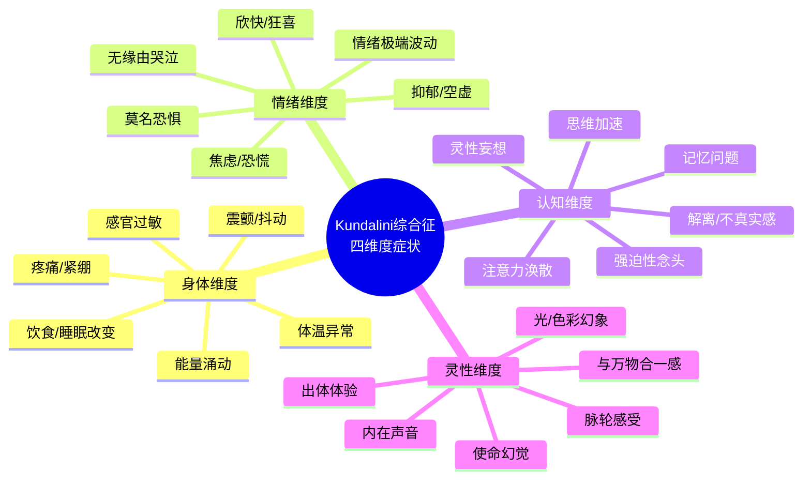
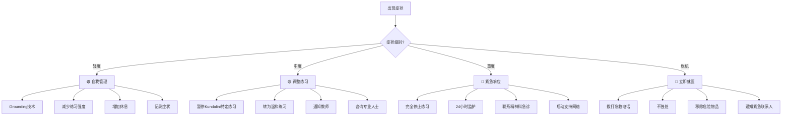
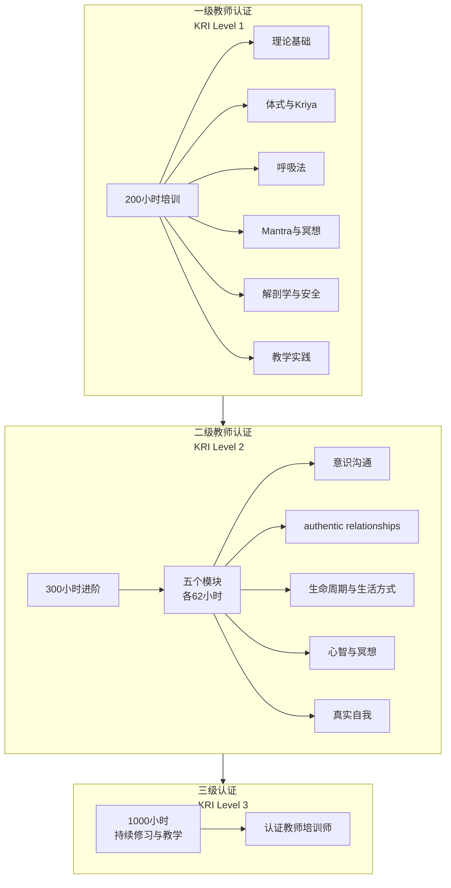
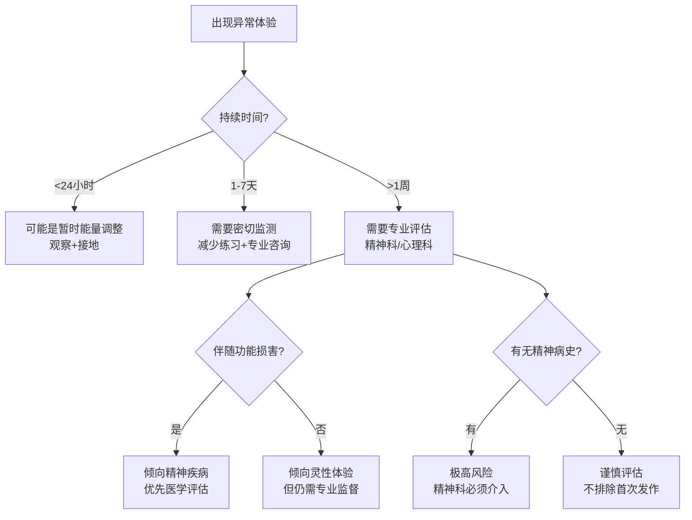

# 昆达里尼安全筛查与危机应对

> **Kundalini Safety Screening & Crisis Response Protocol**
>
> 本文档为 Kundalini Yoga 修习者、教师及心理健康工作者提供系统性的安全评估框架，涵盖 Kundalini 综合征的完整识别、筛查、危机应对与师资选择指南。

---

## 一、Kundalini 综合征的完整症状谱系

### 1.1 概述

Kundalini 综合征（Kundalini Syndrome）指在灵性修习（尤其是 Kundalini Yoga、密集冥想、呼吸练习）过程中，由于能量（Prana/Kundalini）的急剧升起或不当引导，导致的一系列身心症状。这些症状可能是**暂时的能量调整**，也可能是**需要专业干预的病理状态**。正确区分两者是安全修习的核心。

### 1.2 四维度症状清单

#### 身体维度症状

| 症状 | 描述 | 常见程度 | 持续时间 | 注意级别 |
|------|------|---------|---------|---------|
| **能量涌动** | 感觉电流/热流沿脊柱上升，或从底部冲向头顶 | 非常常见 | 数秒-数分钟 | ⚠️ 低 |
| **体温异常** | 练习中或之后感到异常热或冷，出汗或寒战 | 常见 | 数分钟-数小时 | ⚠️ 低 |
| **不自主震颤** | 手、腿、身体某部位或全身的不自主抖动 | 常见 | 练习中-数小时 | ⚠️ 中 |
| **身体疼痛/紧绷** | 旧伤部位的疼痛重现、肌肉莫名紧绷、头部压力感 | 较常见 | 数小时-数天 | ⚠️ 中 |
| **感官过敏** | 对光、声音、触觉异常敏感 | 较常见 | 数天-数周 | ⚠️ 中 |
| **消化系统变化** | 腹泻、便秘、食欲剧增或丧失 | 较少见 | 数天 | ⚠️ 中 |
| **睡眠模式剧变** | 失眠、嗜睡、睡眠需求大幅减少或增加 | 常见 | 数天-数周 | ⚠️ 中 |
| **心率/呼吸异常** | 心悸、呼吸急促、感觉无法深呼吸 | 较少见 | 数分钟-数小时 | 🔴 高 |
| **昏厥/失去意识** | 练习中或之后短暂失去意识 | 罕见 | 瞬间 | 🔴 高 |

#### 情绪维度症状

| 症状 | 描述 | 常见程度 | 注意级别 |
|------|------|---------|---------|
| **情绪过山车** | 短时间内从极度喜悦跌入深度悲伤 | 常见 | ⚠️ 中 |
| **无缘由哭泣** | 毫无预兆地流泪，可能伴随释放感 | 非常常见 | ⚠️ 低 |
| **焦虑/恐慌发作** | 突然感到强烈恐惧、濒死感、失控感 | 较常见 | 🔴 高 |
| **无根据的欣快** | 持续的、与现实脱节的极度愉悦感 | 较少见 | 🔴 高 |
| **深度抑郁/空虚** | 能量释放后的"空洞感"、无意义感 | 较常见 | 🔴 高 |
| **莫名恐惧** | 对特定事物或普遍存在的恐惧感 | 较常见 | ⚠️ 中 |
| **愤怒爆发** | 突发的、与触发不成比例的愤怒 | 较少见 | ⚠️ 中 |
| **情绪麻木** | 对通常有反应的事物失去情感反应 | 较少见 | 🔴 高 |

#### 认知维度症状

| 症状 | 描述 | 常见程度 | 注意级别 |
|------|------|---------|---------|
| **思维加速** | 念头飞速运转，难以停止 | 较常见 | ⚠️ 中 |
| **注意力涣散** | 难以集中精力阅读、对话或工作 | 较常见 | ⚠️ 中 |
| **记忆问题** | 短期记忆下降、"断片"感 | 较少见 | ⚠️ 中 |
| **解离/不真实感** | 感觉世界不真实（derealization）或自己不真实（depersonalization） | 较少见 | 🔴 高 |
| **强迫性灵性念头** | 反复思考灵性概念、无法停止的"开悟"渴望 | 较少见 | 🔴 高 |
| **决策困难** | 简单的日常决策也变得困难 | 较少见 | ⚠️ 中 |
| **认知过载** | 感觉信息过多，大脑"塞满" | 较常见 | ⚠️ 低 |

#### 灵性维度症状

| 症状 | 描述 | 常见程度 | 注意级别 |
|------|------|---------|---------|
| **内在光/色彩** | 闭眼时看到光、几何图案、颜色 | 常见 | ⚠️ 低 |
| **内在声音** | 听到念诵声、音乐、或"指导声音" | 较常见 | ⚠️ 中 |
| **脉轮感受** | 特定脉轮区域的强烈能量感（旋转、开启感） | 常见 | ⚠️ 低 |
| **身体外体验** | 感觉意识离开身体、从上方观看自己 | 较少见 | ⚠️ 中 |
| **与万物合一感** | 强烈的边界消融、与宇宙合一的体验 | 较少见 | ⚠️ 低 |
| **超感知声称** | 相信自己获得了特殊能力（读心、预知等） | 罕见 | 🔴 高 |
| **弥赛亚情结** | 相信自己被选中执行特殊灵性使命 | 罕见 | 🔴 高 |

---

## 二、高风险人群筛查问卷

> **使用说明：** 本问卷用于修习者在开始 Kundalini Yoga 前进行自我评估，或在出现症状后进行回顾。得分越高，风险越大，建议寻求专业评估。
>
> **评分：** 每个问题 0-3 分（0=从不/完全没有，1=偶尔/轻微，2=经常/中等，3=总是/严重）

### 2.1 问卷内容

| # | 问题 | 0 | 1 | 2 | 3 |
|---|------|---|---|---|---|
| **1** | 你是否曾被诊断为精神疾病（如双相情感障碍、精神分裂症、重度抑郁症、边缘型人格障碍）？ | | | | |
| **2** | 你是否正在服用精神科药物？ | | | | |
| **3** | 你是否有未处理的重大创伤经历（童年虐待、战争经历、严重事故）？ | | | | |
| **4** | 你是否有过自杀想法或自杀尝试？ | | | | |
| **5** | 你是否经历过突然的、无诱因的惊恐发作？ | | | | |
| **6** | 你是否有过解离体验（感觉世界不真实、或自己像旁观者）？ | | | | |
| **7** | 你是否有过躁狂或轻躁狂发作（持续数天的极度兴奋、睡眠需求减少、冲动行为增加）？ | | | | |
| **8** | 你的家族中是否有人被诊断为精神分裂症或双相情感障碍？ | | | | |
| **9** | 你是否在之前的冥想/瑜伽练习中经历过强烈的、失控的能量反应？ | | | | |
| **10** | 你是否感到强烈的"必须开悟"的紧迫感，或追求极端的灵性体验？ | | | | |
| **11** | 你是否缺乏稳定的日常生活结构（睡眠、饮食、工作不规律）？ | | | | |
| **12** | 你是否处于重大生活变故中（离婚、丧亲、失业、移民）？ | | | | |
| **13** | 你是否在孤立状态下练习（没有教师、社群或心理支持）？ | | | | |
| **14** | 你是否同时使用改变意识状态的物质（大麻、迷幻药、高剂量咖啡因）？ | | | | |
| **15** | 你是否有过被诊断为癫痫或有过不明原因的抽搐发作？ | | | | |

### 2.2 评分与解读

| 总分 | 风险级别 | 建议行动 |
|------|---------|---------|
| **0-5** | 🟢 低风险 | 可以开始 Kundalini Yoga，建议在有经验的教师指导下进行 |
| **6-15** | 🟡 中风险 | 需要谨慎开始。建议先进行温和的准备练习（基础瑜伽、 grounding 技术），并告知教师你的情况 |
| **16-25** | 🟠 高风险 | **强烈建议**在开始 Kundalini Yoga 前咨询精神科医生或临床心理师。可考虑从更温和的修习方式开始（如 walking meditation、Restorative Yoga） |
| **26-45** | 🔴 极高风险 | **不建议**自行开始 Kundalini Yoga。必须在专业精神健康团队与经验丰富的 Kundalini Yoga 治疗师共同监督下进行，或选择其他更适合的修习路径 |

### 2.3 特别警示信号

以下任何一项为"是"，均建议**先寻求专业评估**再开始或继续 Kundalini Yoga：

- [ ] 正在经历精神病性症状（幻觉、妄想、思维紊乱）
- [ ] 最近 6 个月内有自杀尝试
- [ ] 未稳定的精神疾病（近期有过住院或药物调整）
- [ ] 同时滥用改变意识状态的物质
- [ ] 没有任何社会支持系统

---

## 三、危机应对协议

### 3.1 症状分级与响应

### 3.2 轻度症状（🟢）自我管理

**适用症状：** 轻微的能量涌动、短暂的体温变化、练习中的轻微震颤、短暂的情绪波动、闭眼时的光点

| 技术 | 操作方式 | 预期效果 |
|------|---------|---------|
| **Grounding 接地** | 双脚站立，感受脚底与地面的接触；或赤脚踩草地/土地 | 将能量从头部导回身体，恢复稳定 |
| **冷水刺激** | 冷水洗脸、冲手腕、或冷水淋浴 | 激活迷走神经，降低交感神经兴奋 |
| **进食 grounding 食物** | 吃根类蔬菜（土豆、胡萝卜）、坚果、或喝热汤 | 通过消化系统的副交感激活稳定身心 |
| **规律呼吸** | 4-7-8 呼吸：吸 4 秒，屏 7 秒，呼 8 秒 | 快速降低心率，安抚神经系统 |
| **身体扫描** | 从脚底到头顶，逐步觉察身体各部位的存在 | 重建身体边界感，减少解离 |
| **减少练习** | 将练习时间减半，或改为隔日练习 | 给予神经系统整合时间 |

### 3.3 中度症状（🟡）调整练习

**适用症状：** 持续的震颤、睡眠模式显著改变、频繁的焦虑、轻度解离感、持续的内在声音

| 行动 | 具体操作 |
|------|---------|
| **暂停 Breath of Fire** | 改为深长横膈膜呼吸或自然呼吸 |
| **暂停 Root Lock（根锁）** | 仅保持意念，不强力收缩 |
| **暂停倒置体式** | 不做肩倒立、头倒立等能量倒灌体式 |
| **减少冥想时间** | 从长时间静坐改为短时间（10-15 分钟）或动态冥想 |
| **增加接地练习** | 每次练习前后各做 5 分钟 grounding |
| **转为 Restorative Yoga** | 使用大量辅具的支撑性体式，无激活呼吸 |
| **通知教师** | 告知你的症状，获得个性化调整建议 |
| **咨询专业人士** | 考虑咨询熟悉灵性问题的治疗师 |

### 3.4 重度症状（🔴）紧急响应

**适用症状：** 持续 panic attack、明显解离、强烈的幻觉、失控的能量反应、严重失眠超过 3 天、无法正常生活功能

| 行动 | 具体操作 |
|------|---------|
| **完全停止练习** | 暂停所有 Kundalini Yoga 和冥想，直到症状稳定 |
| **24 小时不独处** | 确保有人陪伴，或入住支持性环境 |
| **精神科急诊评估** | 前往医院精神科急诊，排除或处理精神疾病急性发作 |
| **联系 Kundalini Yoga 治疗师** | 寻找有处理 Kundalini 综合征经验的治疗师 |
| **启动社会支持** | 通知家人/朋友，建立支持网络 |
| **记录详细日志** | 记录症状的时间、触发、强度，供专业人士参考 |
| ** grounding 优先** | 每日多次 grounding，避免任何能量提升活动 |

### 3.5 危机症状（🚨）立即就医

**适用症状：** 自杀意念或计划、伤害他人的想法、完全脱离现实（持续的幻觉/妄想）、癫痫样发作、无法控制的自伤行为

| 行动 | 优先级 |
|------|--------|
| **拨打急救电话** | 立即 |
| **不独处** | 立即 |
| **移除危险物品** | 立即（药物、利器、高处窗户等） |
| **通知紧急联系人** | 尽快 |
| **前往最近医院急诊科** | 若无法拨打急救，自行或他人协助前往 |

---

## 四、师资选择指南

### 4.1 合格 Kundalini Yoga 教师的特征

| 特征 | 说明 | 如何验证 |
|------|------|---------|
| **正式认证** | 完成 KRI（Kundalini Research Institute）认可的教师培训（200小时基础 + 300小时进阶） | 要求查看证书，在 KRI 官网验证 |
| **持续教育** | 定期参加进修工作坊和培训 | 询问最近参加的培训 |
| **教学经验** | 至少 2-3 年的实际教学经验 | 询问教学年限和学生反馈 |
| **创伤知情** | 了解创伤如何在身体中储存，知道何时不推进 | 询问是否受过创伤知情培训 |
| **自我修习** | 教师自己有规律的每日 sadhana（个人修习） | 询问教师的个人练习 |
| **谦卑态度** | 不声称"开悟"、不制造依赖、承认自己的局限 | 观察其言行是否一致 |
| **推荐专业帮助** | 在学生出现精神症状时，主动建议寻求专业帮助 | 询问其如何处理学生的情绪危机 |
| **清晰的伦理边界** | 不利用学生的信任进行财务/情感/性剥削 | 观察是否建立清晰的师生界限 |

### 4.2 3HO/KRI 认证体系解析

| 级别 | 培训时长 | 核心内容 | 可以教授 |
|------|---------|---------|---------|
| **Level 1** | 200 小时（通常 6-9 个月周末制或 1 个月密集制） | Kundalini Yoga 基础：体式、呼吸、冥想、Mantra、解剖、教学基础 | 基础 Kundalini Yoga 课程、工作坊 |
| **Level 2** | 300 小时（5 个模块，每模块 62 小时） | 深化个人修习、教学技能、专业方向（如产前、创伤、儿童等） | 进阶课程、专项主题课程 |
| **Level 3** | 1000 小时（持续数年的 sadhana + 教学 + 服务） | 成为教师培训师、领导社区 | 培训新教师 |

### 4.3 Red Flags（警示信号）

遇到以下情况的教师/组织，**建议谨慎选择或避免**：

| Red Flag | 具体表现 | 潜在风险 |
|---------|---------|---------|
| **声称独家/秘密教导** | "只有我得到了真正的传承"、"其他老师都教错了" |  cult 倾向、精神控制 |
| **财务剥削** | 要求大量金钱"购买灵性进阶"、频繁推销高价课程 | 经济剥削 |
| **性边界模糊** | 声称"性能量传输"需要身体接触、对学员有性暗示 | 性剥削 |
| **制造依赖** | "没有我你无法进步"、阻止学员接触其他老师 | 情感控制 |
| **否认医学** | "医生不懂灵性，不要吃药"、阻止学员就医 | 健康风险 |
| **过度承诺** | "这个 Kriya 可以治愈癌症"、"一个月就能开悟" | 误导、失望后的二次创伤 |
| **缺乏认证** | 拒绝展示认证证书、认证来自不知名机构 | 教学质量无保障 |
| **自我神化** | 教师声称自己是"大师""化身"、要求崇拜 | 权力滥用 |
| **忽视安全** | 对学员的严重症状置之不理、鼓励"突破"而非保护 | 身心伤害 |
| **孤立学员** | 鼓励学员切断与家人朋友的联系 | 社会隔离、 cult 控制 |

---

## 五、与精神疾病症状的鉴别诊断

### 5.1 鉴别诊断框架

### 5.2 Kundalini 觉醒 vs 躁狂发作

| 特征 | Kundalini 觉醒 | 躁狂发作（Bipolar） |
|------|--------------|-------------------|
| **持续时间** | 数小时-数天，然后逐渐稳定 | 至少 1 周（或需住院） |
| **睡眠** | 可能减少，但不感到疲惫 | 睡眠需求显著减少，且不感到需要睡眠 |
| **能量** | 高度但"有方向"的能量感 | 过度活跃、冲动、无目的 |
| **情绪** | 深度平静与喜悦交替，有"中心"感 | 欣快、易怒、情绪不稳 |
| **认知** | 清晰、洞察增加、有反思能力 | 思维飞跃、注意力涣散、判断力下降 |
| **行为** | 可能减少社交以整合体验 | 冲动消费、高风险行为、性欲亢进 |
| **现实检验** | 保持现实检验能力 | 可能丧失，出现夸大妄想 |
| **触发** | 明确的灵性修习触发 | 可能无明显触发，或与生活事件相关 |
| **对 grounding 反应** | grounding 后稳定 | grounding 无效或更加烦躁 |
| **对他人影响** | 可能向内退缩，但不伤害他人 | 可能伤害自己或他人 |

**关键鉴别点：** Kundalini 觉醒者通常保持"观察者"能力——即使体验强烈，仍有一部分自我在"观看"。躁狂发作者往往完全沉浸于体验，丧失观察能力。

### 5.3 Kundalini 觉醒 vs 精神病性症状

| 特征 | Kundalini 觉醒 | 精神病性障碍（如精神分裂症） |
|------|--------------|--------------------------|
| **内在声音** | 通常是指导性的、支持性的、与自我一致 | 通常是命令性的、贬低的、与自我冲突的 |
| **幻觉内容** | 通常是几何图案、光、宇宙意象 | 可能涉及被害、被控制、妄想性解释 |
| **恐惧水平** | 即使有恐惧，也感到有"更大的力量"在保护 | 强烈的被害恐惧、偏执 |
| **现实检验** | 能够区分内在体验与外在现实 | 无法区分，坚信幻觉为真实 |
| **社会功能** | 可能暂时退缩，但基本功能保持 | 显著的社会/职业功能下降 |
| **自知力** | 通常保持——"我在经历一些强烈的体验" | 通常丧失——"我没有问题，是世界要害我" |
| **对支持反应** |  grounding 和社群支持有帮助 | 通常需要抗精神病药物 |

### 5.4 Kundalini 觉醒 vs 解离障碍

| 特征 | Kundalini 觉醒 | 解离障碍（DID/DTD） |
|------|--------------|-------------------|
| **边界感** | 边界暂时消融但有"回归"能力 | 边界长期混乱或人格切换 |
| **身份感** | "我是更广阔存在的一部分" | "我不知道我是谁"或"我是多个人" |
| **记忆** | 记忆通常完整 | 可能有记忆断片（amnesia） |
| **触发** | 明确与灵性修习相关 | 通常与创伤触发相关 |
| **控制感** | 即使体验强烈，仍有"选择"感 | 感到被" takeover"、失控 |
| **持续时间** | 与修习周期相关 | 长期持续，不随练习变化 |

### 5.5 综合鉴别要点

| 指标 | 灵性体验 | 需要医学关注 |
|------|---------|-----------|
| **现实检验能力** | 保持 | 受损 |
| **社会功能** | 基本保持或暂时轻度下降 | 显著下降 |
| **自知力** | 存在 | 缺失 |
| **危险性** | 无自伤/伤人风险 | 有风险 |
| **持续时间** | 与修习相关，可调控 | 持续存在，不受控 |
| ** grounding 反应** | 有帮助 | 无效或恶化 |
| **专业评估** | 可作为辅助 | 必须优先 |

---

## 六、安全修习检查清单

### 6.1 每次练习前

- [ ] 已空腹或进食后至少 2 小时
- [ ] 睡眠基本充足（非严重失眠后的强行练习）
- [ ] 未服用影响意识的物质
- [ ] 情绪状态相对稳定（非极端愤怒/悲伤时）
- [ ] 知道今天练习后有时间放松整合
- [ ] 手机静音但有紧急联系方式可用

### 6.2 练习中

- [ ] 保持对呼吸的觉察，不憋气
- [ ] 感到头晕/疼痛/强烈不适时，立即停止或转为休息
- [ ] 不与他人比较，不强迫自己"达标"
- [ ] 保持面部和颈部放松
- [ ] 记住：随时可以退出，这不会"浪费"之前的努力

### 6.3 练习后

- [ ] 给予足够的放松时间（不少于体式时间的 1/4）
- [ ] 缓慢起身，避免体位性低血压
- [ ] 饮用温水（非冰水）
- [ ] 记录任何异常体验
- [ ] 若症状持续超过 24 小时，告知教师或专业人士

---

## 七、资源与求助渠道

### 7.1 专业组织

| 组织 | 资源 | 网址 |
|------|------|------|
| **KRI (Kundalini Research Institute)** | 认证教师查询、安全指南 | kundaliniresearchinstitute.org |
| **3HO (Healthy, Happy, Holy Organization)** | Yogi Bhajan 传承、全球社群 | 3ho.org |
| **Spiritual Emergence Network** | 灵性危机支持转介 | spiritualemergencenetwork.org |
| ** emergingpare@gmail.com** | 灵性危机国际支持网络 | 搜索 "Spiritual Crisis Network" |

### 7.2 推荐阅读

- Kason, Y. (2000). *Farther Shores: Understanding How the Mind, Body, and Spirit Evolve Through Spiritual Crisis*
- Lukoff, D. (1985). "The Diagnosis of Mystical Experiences with Psychotic Features." *Journal of Transpersonal Psychology*
- Greyson, B. (2000). "Near-Death Experiences and the Physio-Kundalini Syndrome." *Journal of Religion and Health*
- Scotton, B. (1996). *The Textbook of Transpersonal Psychiatry and Psychology*

---

> *"昆达里尼能量是强大的。尊重它，如同尊重火焰——它可以温暖你的家，也可以烧毁它。"*
>
> — Kundalini Yoga 传统智慧

---

**最后更新：2026-05**

---

## 📞 危机干预资源 | Crisis Resources

> **如果您或您认识的人正在经历心理危机或有自杀念头,请立即寻求帮助。**

### 中国大陆

| 资源 | 联系方式 |
|---|---|
| 北京心理危机研究与干预中心 | **010-82951332** (24小时) |
| 全国心理援助热线 | **400-161-9995** (24小时) |
| 希望24热线 | **400-161-9995** (24小时) |
| 生命热线 | **400-821-1215** (24小时) |

### 国际

| 地区 | 资源 | 联系方式 |
|---|---|---|
| 🇺🇸 美国 | 988 Suicide & Crisis Lifeline | **988** (24/7) |
| 🇬🇧 英国 | Samaritans | **116 123** (24/7) |
| 🇭🇰 香港 | 撒玛利亚防止自杀会 | **2389-0000** |
| 🇹🇼 台湾 | 生命线 | **1995** |

**完整资源列表**:[_meta/docs/CRISIS_RESOURCES.md](../../../../../_meta/docs/CRISIS_RESOURCES.md)

**全球资源**:[Befrienders Worldwide](https://www.befrienders.org) | [WHO 心理健康](https://www.who.int/health-topics/mental-health)

