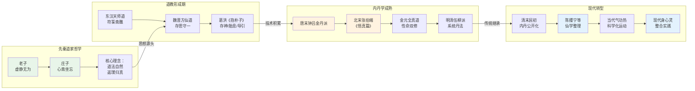
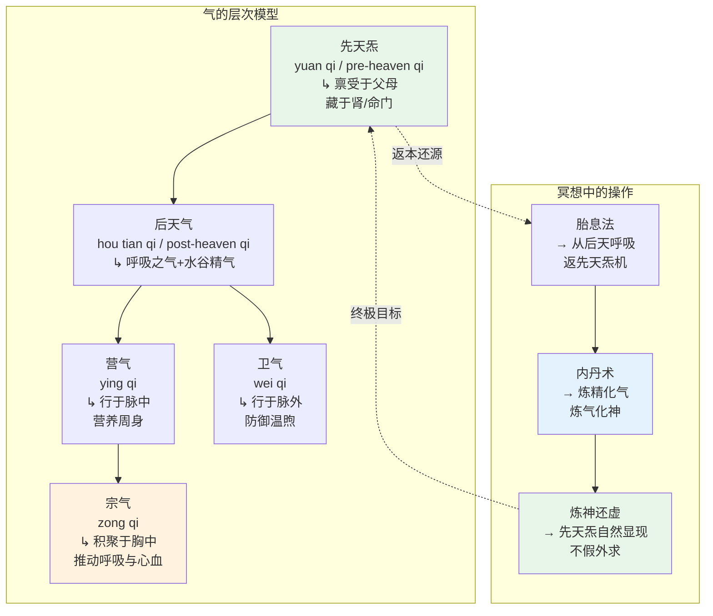
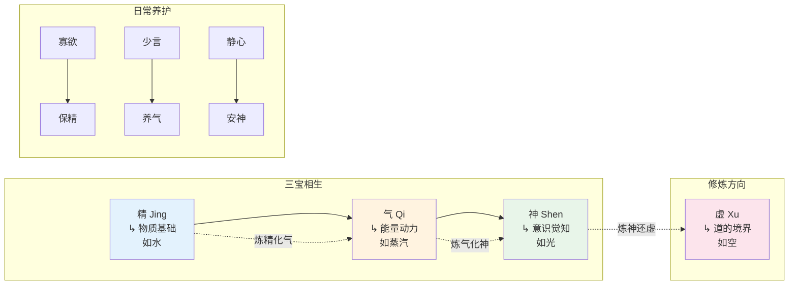
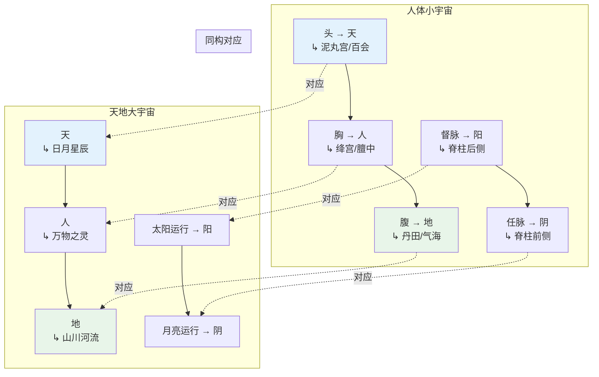
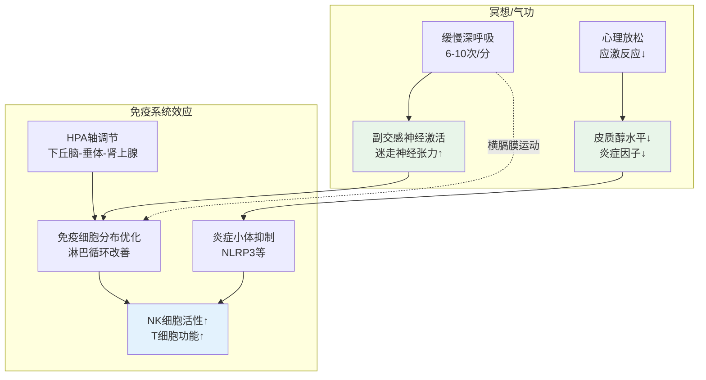

# 道家冥想专业概述：从老庄玄思到内丹实修

> **适用对象**：对传统东方冥想体系有兴趣的进阶练习者、中医/气功从业者、身心整合研究者  
> **阅读时长**：约 40–50 分钟（可分段阅读）  
> **实践建议**：理论部分可通读，修习方法请在有经验导师指导下逐步实践  
> **最后更新**：2026-05

---

## 一、历史脉络

### 1.1 先秦道家的冥想雏形

道家冥想的思想源头可追溯至先秦时期的老子与庄子，其核心并非后世道教的"修仙"技术，而是一种**通过静观与体悟回归于道**的存在方式。

**老子《道德经》中的冥想维度**：

| 章节 | 原文 | 冥想意涵 |
|------|------|---------|
| 第十章 | "载营魄抱一，能无离乎？专气致柔，能如婴儿乎？" | **抱一**——身心合一的早期表述；**专气致柔**——调息与身体柔化的结合 |
| 第十六章 | "致虚极，守静笃。万物并作，吾以观复。" | **虚静观照**——道家冥想的核心方法：心至虚、守于静，观万物循环 |
| 第四十八章 | "为学日益，为道日损。损之又损，以至于无为。" | **日损**——减法式的冥想进路，与佛家"放下"相通 |
| 第五十六章 | "塞其兑，闭其门，挫其锐，解其纷，和其光，同其尘，是谓玄同。" | **塞兑闭门**——关闭感官门户，内敛精神；**玄同**——冥想的终极境界 |

**庄子《南华经》中的冥想实践**：

- **心斋**（《人间世》）："若一志，无听之以耳而听之以心，无听之以心而听之以气。"——超越感官与心念，以"气"为媒介的深层觉知
- **坐忘**（《大宗师》）："堕肢体，黜聪明，离形去知，同于大通。"——忘却形体与智识，与大道合一
- **天籁之听**（《齐物论》）：超越人籁与地籁，聆听万物自化的本然之声——一种**开放的、无拣择的觉知冥想**

> **关键区分**：先秦道家的冥想是**哲学性的、境界导向的**，并未形成系统的身体技术。老庄所描述的"虚静""坐忘"更多是精神境界，而非可操作的修习程序。系统的身体冥想技术是在道教形成后，逐步吸收方仙道、医学、养生术而发展的。

### 1.2 道教形成与修习体系化

东汉张道陵创立五斗米道（天师道），道教正式形成。此时期的冥想特点是将道家哲学与民间信仰、方仙术、医药学融合，开始出现**有组织的身体实践**。

| 时期 | 代表经典/人物 | 冥想发展 |
|------|-------------|---------|
| **东汉**（张道陵、魏伯阳） | 《周易参同契》——"万古丹经王" | 将《周易》卦象、阴阳五行与炼丹术结合，奠定**内丹学的理论框架** |
| **魏晋**（葛洪） | 《抱朴子·内篇》 | 系统整理**存思法**（存思体内神明）、**守一法**、**胎息法**；区分内养（养神）与外养（养形） |
| **南北朝**（陶弘景、寇谦之） | 《真诰》《养性延命录》 | 上清派强调**存思上清境**与体内神真；寇谦之改革天师道，引入礼拜与斋戒的冥想维度 |
| **隋唐**（司马承祯、吴筠） | 《坐忘论》《天隐子》 | 将佛教禅定框架融入道家，提出**敬信→断缘→收心→简事→真观→泰定→得道**的七阶坐忘体系 |
| **唐末五代**（钟离权、吕洞宾、陈抟） | 《灵宝毕法》《指玄篇》《无极图》 | **内丹学正式成熟**：钟吕金丹派确立炼精化气→炼气化神→炼神还虚的四阶次第；陈抟以《无极图》图示丹道 |
| **北宋**（张伯端） | 《悟真篇》——与《参同契》并称丹经双璧 | 将内丹术提升至"性命双修"的高度，主张**先命后性**，强调身体基础 |
| **金元**（王重阳、丘处机） | 全真道创立 | 强调**性命双修、三教合一**；将内丹修炼与日常持戒、苦行结合；龙门派重视**清静打坐** |
| **明清**（伍守阳、柳华阳） | 《天仙正理》《金仙证论》 | 内丹学进一步系统化，提出**炼己**（心性修养）的重要性；柳华阳以佛家语言注释丹经，体现三教融合 |



### 1.3 全真道与正一道的冥想取向差异

道教两大主流传统在冥想方法上形成了鲜明的互补格局：

| 维度 | **全真道** | **正一道（天师道）** |
|------|-----------|-------------------|
| **核心经典** | 《道德经》《清静经》《周易参同契》《悟真篇》 | 《正一经》《太平经》《黄庭经》 |
| **冥想取向** | **清修内丹**——以静坐、打坐为主要形式，追求"明心见性" | **斋醮符箓**——以仪式、存思、感召神明为主要形式 |
| **身体技术** | 强调内丹修炼、胎息、导引；有系统的身体修行次第 | 强调存思体内神真、步罡踏斗、符咒冥想 |
| **终极目标** | 性命双修，羽化登仙（全真北宗）或即身成佛（受佛教影响） | 长生久视、济世度人、与神明交通 |
| **日常生活** | 出家住观，禁婚茹素，有严格的戒律体系 | 可居家修行，可以婚娶，强调"积功累德" |
| **代表人物** | 王重阳、丘处机、马丹阳 | 张道陵、陆修静、杜光庭 |
| **现代传承** | 北京白云观、武汉长春观、各地全真道观；龙门派丹法有私人传承 | 龙虎山天师府、各地正一道观；台湾正一道活跃 |

**整合视角**：现代修习者不必拘泥于宗派之分。全真道的**静坐丹法**提供了系统化的身体-能量-意识转化路径；正一道的**存思法**和**仪式冥想**则提供了丰富的观想技术和与"神圣"对话的心理框架。两者可以互补。

---

## 二、核心理论

### 2.1 道（Dao）——宇宙本原与冥想终极指向

"道"是道家思想的最高范畴，也是冥想的终极指向。《道德经》开篇即言："道可道，非常道。"——道超越语言与概念，但可以通过冥想的**非概念性觉知**来"体证"。

**道的三重冥想维度**：

| 维度 | 含义 | 冥想中的体验 |
|------|------|-------------|
| **宇宙之道** | 万物生成变化的根本法则 | 冥想中感受身体与宇宙的连续，"天人合一"的境界体验 |
| **生命之道** | 个体生命的本源与归宿 | 内观中觉察身体内在的"生机"流动，非意志驱动的自发律动 |
| **修行之道** | 回归于道的具体路径 | 从有为到无为，从控制到放下，最终"道自道"——道自行显现 |

### 2.2 气（Qi）——生命能量的基础

"气"是道家冥想的核心操作对象。理解气的多层次含义，是正确修习的前提。



**关键区分**：
- **先天炁**（元炁）：不可通过呼吸"制造"，只能通过减少消耗、清净心念来"涵养"。胎息法的终极目标即是让后天呼吸停息，先天炁机自然运转。
- **后天气**：可以通过调息、导引、饮食来培补，是内丹修炼的"原材料"。

### 2.3 三宝：精（Jing）/ 气（Qi）/ 神（Shen）

三宝是道家冥想中对生命三要素的系统表述，也是内丹修炼的操作对象。

| 要素 | 属性 | 所在 | 功能 | 内丹操作 |
|------|------|------|------|---------|
| **精** | 阴，有形 | 肾/下丹田 | 生命物质基础，生殖与发育 | **炼精化气**——将精微物质转化为能量 |
| **气** | 阴阳之间，无形但有质 | 丹田/经络/全身 | 生命活动的动力 | **炼气化神**——将能量转化为意识之光 |
| **神** | 阳，无形无质 | 心/上丹田/泥丸宫 | 意识、觉知、灵性 | **炼神还虚**——意识融入虚空 |

**三宝关系**：



**修炼口诀**："炼精化气，炼气化神，炼神还虚，炼虚合道。"四句话概括了内丹修炼的完整次第，从有形到无形，从后天返先天。

### 2.4 玄关一窍（Xuan Guan Yi Qiao）——丹道核心关窍

"玄关一窍"是内丹学中最神秘也最关键的概念，各家解释不一，但其核心指向一个**超越具体穴位的觉知枢纽**。

| 流派 | 玄关位置说 | 实质内涵 |
|------|----------|---------|
| **身中派** | 两肾之间、脐后肾前、命门之内 | 身体能量的核心汇聚点 |
| **心下派** | 心下、绛宫（膻中）之内 | 心神与气交汇之处 |
| **非定位派** | "不在身内，不在身外"（《悟真篇》） | 玄关不是固定穴位，而是**修炼中自然显现的觉知中心** |
| **呼吸派** | 在呼吸出入之间 | 悬息时的"息停脉住"之际，玄关自现 |

**现代理解**：玄关一窍可以理解为**身心转换的临界点**——当身体充分放松、呼吸极度微细、心念高度专注时，会自然出现一种"觉醒的宁静"状态。这个状态本身没有固定位置，但体验者常常报告其感觉位于身体中心区域（胸腹之间）。

### 2.5 天人合一（Tian Ren He Yi）——冥想的宇宙论基础

道家冥想不是孤立的"个人修炼"，而是在"天人合一"的宇宙论框架中进行的。人体被视为小宇宙（**小周天**），与天地大宇宙同构、同律。



**修行意义**：
- **时间维度**：人体的生理节律（子午流注）与天地运行（昼夜、四季）同步——冥想应顺应天时
- **空间维度**：人体的经络穴位与天体的运行轨迹对应——通过内观感知"体内星空"
- **能量维度**：人体之气与天地的阴阳之气可以相互感应——"采日精月华"不是迷信，而是注意力与自然节律的同步

### 2.6 阴阳五行与冥想

阴阳五行不仅是哲学框架，更是**冥想中的身体觉知地图**。

| 五行 | 脏腑 | 情志 | 冥想关联 |
|------|------|------|---------|
| **木** | 肝 | 怒 | 肝气郁结者冥想易烦躁，宜配合嘘字诀呼气 |
| **火** | 心 | 喜 | 心火亢盛者冥想难静心，宜意守涌泉、引火归元 |
| **土** | 脾 | 思 | 思虑过度者冥想昏沉，宜守中宫、调息匀细 |
| **金** | 肺 | 悲 | 肺气虚弱者冥想气浅，宜配合呬字诀与深吸 |
| **水** | 肾 | 恐 | 肾气不足者冥想难深入，宜温养命门、固精培元 |

---

## 三、主要修习体系

### 3.1 内丹术（Nei Dan Shu）——道家冥想的巅峰体系

内丹术是道家最系统、最精深的冥想-能量-意识转化体系，被誉为"东方炼金术"。其本质是通过一系列的身体-能量-意识操作，将"后天"的生命状态转化为"先天"的道性境界。

#### 3.1.1 内丹四阶次第

```mermaid
graph LR
    subgraph 第一阶<br/>炼精化气<br/>Lian Jing Hua Qi
        S1A[基础：
身体调柔<br/>呼吸调细<br/>心念调静] --> S1B[方法：
意守下丹田<br/>配合逆腹式呼吸<br/>吸升呼降]
        S1B --> S1C[现象：
丹田温热/跳动<br/>气机沿督脉上行<br/>三车搬运]
        S1C --> S1D[标志：
打通任督<br/>小周天运转<br/>玉液还丹]
    end

    subgraph 第二阶<br/>炼气化神<br/>Lian Qi Hua Shen
        S2A[基础：
小周天通<br/>元气充盈] --> S2B[方法：
意守中丹田/黄庭<br/>神气相抱<br/>心息相依]
        S2B --> S2C[现象：
六根震动<br/>阳光三现<br/>马阴藏相]
        S2C --> S2D[标志：
大周天通<br/>六根不漏<br/>金液还丹]
    end

    subgraph 第三阶<br/>炼神还虚<br/>Lian Shen Huan Xu
        S3A[基础：
大周天通<br/>阳神成就] --> S3B[方法：
意守上丹田/泥丸<br/>神入炁中<br/>炁包神外]
        S3B --> S3C[现象：
出神入化<br/>阳神出游<br/>分身应世]
        S3C --> S3D[标志：
粉碎虚空<br/>虚空粉碎<br/>打成一片]
    end

    subgraph 第四阶<br/>炼虚合道<br/>Lian Xu He Dao
        S4A[基础：
虚空粉碎<br/>人法俱空] --> S4B[境界：
与道合真<br/>无名无相<br/>无量光寿]
    end

    S1D -->|进阶| S2A
    S2D -->|进阶| S3A
    S3D -->|终极| S4A

    style S1A fill:#e3f2fd
    style S2A fill:#fff3e0
    style S3A fill:#e8f5e9
    style S4A fill:#fce4ec
```

#### 3.1.2 小周天与大周天详解

| 项目 | **小周天**（Microcosmic Orbit） | **大周天**（Macrocosmic Orbit） |
|------|------------------------------|-------------------------------|
| **路径** | 任脉（前正中，降）+ 督脉（后正中，升） | 十二正经全部贯通 |
| **能量基础** | 后天呼吸之气 + 先天元气的初步萌动 | 元气充盈，自然流通全身 |
| **意识操作** | 有意识的意守丹田 + 意念导引 | 无意识的自动运行，"无为而无不为" |
| **身体感受** | 丹田热感 → 气沿脊柱上行 → 过三关（尾闾→夹脊→玉枕）→ 入口降至丹田 | 全身温暖、酥麻、轻盈，气无处不到 |
| **时间尺度** | 一般需数月到数年 | 在炼精化气成熟后自然发生 |
| **现代对应** | 可能与自主神经系统的重组、筋膜张力的重新分布有关 | 可能与全身微循环改善、细胞代谢优化有关 |

**三关详解**：

| 关窍 | 位置 | 生理对应 | 通关体验 |
|------|------|---------|---------|
| **尾闾关** | 尾骨尖端 | 骶神经丛、盆底肌群 | 气感如温水沿会阴向后上方流动 |
| **夹脊关** | 第七胸椎棘突下 | 交感神经干、膈神经区域 | 背部中央有强烈的"冲开"感或胀热感 |
| **玉枕关** | 枕骨粗隆下 | 延髓、小脑、颈神经丛 | 最难通的一关，常有头痛、重压感；通后如清凉甘露下降 |

> **重要提醒**：现代练习者不应刻意追求"气冲三关"的体验。内丹学的这些描述是基于古代长期修行者的经验总结，带有浓厚的文化和个体差异性。盲目追求可能导致**气感执着**（将正常的身体感觉误解为"气"，引发焦虑）或**意念过重**（因过度集中注意力而导致紧张性头痛、失眠等问题）。

#### 3.1.3 内丹修炼中的常见偏差与纠正

| 偏差 | 表现 | 原因 | 纠正方法 |
|------|------|------|---------|
| **意念过重** | 头痛、眉心胀、失眠 | 强行意守、过度集中 | 改为**似有似无**的意守，或转守体外虚空 |
| **追求气感** | 身体某处持续胀麻、不适 | 将正常生理感觉误读为"气" | 放下对气感的追求，回归自然呼吸 |
| **呼吸过急** | 胸闷、头晕、心悸 | 刻意深呼吸、逆腹式呼吸用力过猛 | 改为自然呼吸，不追求腹式 |
| **昏沉** | 打坐即睡、觉知模糊 | 疲劳、饭后、意念不足 | 调整时间（避免饭后）、轻微活动后再坐、或采用站桩 |
| **散乱** | 杂念纷飞、坐不住 | 心绪不宁、环境干扰、急于求成 | 从数息入手，每次减少5分钟，建立习惯 |
| **遗精失控** | 修炼期间遗精频繁 | 炼精化气阶段精气转化不稳 | 配合提肛、固肾功法；必要时减少晚间练习 |

### 3.2 胎息法（Tai Xi Fa）——返先天的呼吸技术

胎息是道家呼吸法的最高境界，意为**如胎儿在母腹中的呼吸**——不通过口鼻，而是以身体全身的毛孔或丹田为呼吸的出入口。

**经典描述**：
- 《抱朴子》："胎息者，能不以鼻口嘘吸，如在胞胎之中。"
- 《云笈七签》："气入身来为之生，神去离形为之死。知神气可以长生，固守虚无以养神气。"

#### 3.2.1 胎息的修习次第

| 阶段 | 呼吸特征 | 修习方法 | 时间周期 |
|------|---------|---------|---------|
| **第一阶段：调息** | 鼻吸鼻呼，深长匀细 | 数息法：吸气默数1-10，循环；呼吸比 1:2 | 1–3 个月 |
| **第二阶段：闭息** | 吸-闭-呼，逐步延长闭气 | 吸气后轻闭，从3秒逐步增至10秒以上 | 3–6 个月 |
| **第三阶段：胎息萌动** | 呼吸极微细，似有似无 | 不再刻意控制，只是觉知呼吸的自然起伏 | 6 个月–数年 |
| **第四阶段：真胎息** | 鼻息几乎停止，丹田自动起伏 | 全身毛孔似乎在开合，与天地交换 | 长期修习，不可强求 |

#### 3.2.2 胎息与横膈膜呼吸的关系

胎息并非与横膈膜呼吸对立，而是**横膈膜呼吸的极化发展**：


**关键认知**：胎息的"口鼻呼吸停止"不是**生理学意义上的停止**，而是**主观体验上的淡化**——当呼吸变得极深长、极微细时，习练者的注意力不再聚焦于口鼻，而是感受到全身的参与，因此产生"不以鼻口呼吸"的体验。

### 3.3 存思法（Cun Si Fa）——观想冥想体系

存思法是道教独有的冥想技术，核心是通过**有意识的观想**来调动身体能量、净化心神、与神圣力量连接。

#### 3.3.1 存思法的主要类型

| 类型 | 内容 | 经典来源 | 现代心理机制 |
|------|------|---------|-------------|
| **存神** | 观想体内各部位有神明驻守（如心神赤帝、肝神青帝等） | 《黄庭经》《上清大洞真经》 | 通过具象化符号与身体建立深度连接；类似催眠中的身体扫描与意象引导 |
| **守一** | 将注意力集中于"一"——可以是丹田、呼吸、或某种意象 | 《老子》"抱一"、《太平经》 | 注意力训练的核心方法；减少认知资源的外散 |
| **存思日月** | 观想日月之光华进入身体，照耀脏腑 | 《太上黄庭外景经》 | 光意象的疗愈效果；与昼夜节律同步的心理暗示 |
| **存思仙境** | 观想上清仙境、洞天福地，身游其中 | 上清派经典 | 沉浸式想象有助于深度放松；创造心理"安全基地" |
| **身神合一** | 将自身与某尊神明合一，获得其特质 | 雷法、符箓派 | 身份认同的扩展；力量感与保护感的心理建构 |

#### 3.3.2 《黄庭经》存思体系详解

《黄庭经》（分为内景经与外景经）是存思法的核心经典，描述了人体内各部位的"身神"：

```mermaid
graph TD
    subgraph 身神分布<br/>《黄庭经》体系
        H1[上丹田/泥丸宫<br/>↳ 脑神精根<br/>字泥丸] --> H2[中丹田/绛宫<br/>↳ 心神丹元<br/>字守灵]
        H2 --> H3[下丹田/命门<br/>↳ 肾神玄冥<br/>字育婴]
        H4[肝神<br/>字龙烟<br/>↳ 青色] --> H5[肺神<br/>字皓华<br/>↳ 白色]
        H6[脾神<br/>字常在<br/>↳ 黄色] --> H7[胆神<br/>字龙曜<br/>↳ 青黄]
    end

    subgraph 存思操作
        O1[闭目内视] --> O2[依次观想各部位神明]
        O2 --> O3[以光/色/形填充该部位]
        O3 --> O4[感受该部位的能量状态]
        O4 --> O5[若有不适，以神明之光净化]
    end

    style H1 fill:#e3f2fd
    style H2 fill:#ffebee
    style H3 fill:#e8f5e9
    style H4 fill:#e8f5e9
    style H5 fill:#fce4ec
    style H6 fill:#fff3e0
```

**现代应用**：不必拘泥于具体的神明形象，可以将"身神"理解为**各脏腑的心理-能量象征**。例如：
- 观想心脏区域有温暖的红光 → 激活副交感神经、增强自我关怀
- 观想肝脏区域有柔和的青绿色光芒 → 疏肝解郁、释放愤怒
- 观想肾脏区域有深邃的蓝光 → 增强安全感、稳固根基

### 3.4 导引与动功——冥想中的身体智慧

道家不主张长期枯坐，而是强调**动静结合**。导引（Dao Yin）意为"导气令和，引体令柔"，是通过特定的身体动作来引导气的流动。

#### 3.4.1 八段锦（Ba Duan Jin）——冥想维度的解读

八段锦是最广为流传的道家导引术，其每个动作都有明确的冥想意涵：

| 式名 | 动作要点 | 冥想意涵 | 脏腑/经络 |
|------|---------|---------|----------|
| **两手托天理三焦** | 双手上托，脚跟可提 | 拉伸三焦，疏通上中下三部气机 | 三焦经 |
| **左右开弓似射雕** | 拉弓射箭姿势 | 宣发肺气，开阔心胸 | 肺经、大肠经 |
| **调理脾胃须单举** | 一手上举一手下按 | 中焦升降，脾胃调和 | 脾经、胃经 |
| **五劳七伤往后瞧** | 转头向后看 | 松解颈椎，疏通膀胱经 | 膀胱经 |
| **摇头摆尾去心火** | 俯身摇头摆臀 | 引火下行，心肾相交 | 心经、肾经 |
| **两手攀足固肾腰** | 前屈攀足 | 拉伸膀胱经，温补肾气 | 肾经、膀胱经 |
| **攒拳怒目增气力** | 握拳怒目冲拳 | 疏肝理气，激发肝气 | 肝经 |
| **背后七颠百病消** | 踮脚震动全身 | 振动全身经络，调和气血 | 全身 |

**冥想整合练习**：
1. 先做一遍八段锦（约10分钟），使身体温暖、气脉活跃
2. 静坐5分钟，观察身体内部的能量感
3. 进入正式的冥想/内丹练习

#### 3.4.2 五禽戏（Wu Qin Xi）——仿生冥想法

五禽戏由华佗创编，模仿虎、鹿、熊、猿、鸟五种动物的动作。其冥想维度在于**通过形态模仿进入该动物的"能量状态"**：

| 禽 | 核心特质 | 冥想意涵 | 对应脏腑 |
|----|---------|---------|---------|
| **虎** | 威猛、下沉 | 培养内在的定力与威势；肾气下沉 | 肾 |
| **鹿** | 灵敏、舒展 | 打开心胸与脊柱的灵活性；肝气条达 | 肝 |
| **熊** | 厚重、沉稳 | 培养中焦的稳定感；脾胃运化 | 脾 |
| **猿** | 机敏、轻盈 | 心念的灵活与警觉；心气灵动 | 心 |
| **鸟** | 升腾、开阔 | 肺气的宣发与上升；胸怀开阔 | 肺 |

#### 3.4.3 太极拳的冥想维度

太极拳本质上是一种**移动的冥想**（Moving Meditation），其冥想维度体现在：

| 层面 | 内容 |
|------|------|
| **身体层面** | 极慢的动作迫使习练者保持高度的身体觉知；任何分心的念头都会体现在动作的失衡上 |
| **呼吸层面** | 动作与呼吸的精密配合（通常：开吸合呼、起吸落呼），训练呼吸-运动的整合 |
| **意识层面** | "意到气到"——注意力引导能量的流动；长期练习培养**
念-身-气**的三位一体 |
| **哲学层面** | 阴阳转换、以柔克刚、舍己从人——将道家哲学 embodied 在身体中 |

### 3.5 女丹修炼（坤道 / Kun Dao）——女性特有的丹道体系

传统内丹学以男性身体为默认模型，但道教也发展出了专门针对女性生理特点的修炼体系，称为"女丹"或"坤道"。

#### 3.5.1 女丹与男丹的核心差异

| 维度 | **男丹（乾道）** | **女丹（坤道）** |
|------|----------------|----------------|
| **能量中心** | 以下丹田（精室）为核心 | 以**乳溪**（两乳之间）或**中丹田**为核心 |
| **修炼起点** | 炼精化气（精为基础） | 炼血化气（血为基础）；女性以血为本 |
| **关窍不同** | 三关：尾闾→夹脊→玉枕 | 女性经络走向有差异，部分流派提出不同的"关窍"路径 |
| **月经与修炼** | 无此问题 | 月经被视为"后天之精"的排出；高阶修炼要求"斩赤龙"（月经停止） |
| **经典** | 《悟真篇》《性命圭旨》 | 《西王母修正途十则》《女金丹》《坤道秘笈》 |

#### 3.5.2 女丹修炼的现代视角

**批判性理解**：
- "斩赤龙"的要求带有父权制社会对女性身体的控制色彩，不应作为现代修习的目标
- 但女丹修炼对**乳房-心轮区域**的重视具有现代意义——该区域与副交感神经、催产素分泌、情感连接密切相关
- 女性练习者可以根据自身生理周期调整冥想重点：

| 月经周期阶段 | 身体特点 | 冥想建议 |
|------------|---------|---------|
| **月经期** | 能量向下、内敛 | 以休息为主，可做温和的呼吸觉察，避免强烈意守下丹田 |
| **卵泡期** | 能量上升、活跃 | 适合动态的导引练习、存思日光 |
| **排卵期** | 能量顶峰、开放 | 适合深度的内观冥想、与"内在智慧"对话 |
| **黄体期** | 能量内敛、稳定 | 适合静坐、胎息练习、身体扫描 |

---

## 四、与中医养生的整合

### 4.1 子午流注——十二时辰与脏腑冥想

子午流注理论认为，人体的十二条正经在一天24小时中轮流"当令"，每个时辰对应一条经络的气血最旺盛。

```mermaid
graph LR
    subgraph 子时-卯时<br/>23:00-07:00
        Z1[子时 23-1<br/>胆经当令] --> Z2[丑时 1-3<br/>肝经当令]
        Z2 --> Z3[寅时 3-5<br/>肺经当令]
        Z3 --> Z4[卯时 5-7<br/>大肠经当令]
    end

    subgraph 辰时-未时<br/>07:00-15:00
        C1[辰时 7-9<br/>胃经当令] --> C2[巳时 9-11<br/>脾经当令]
        C2 --> C3[午时 11-13<br/>心经当令]
        C3 --> C4[未时 13-15<br/>小肠经当令]
    end

    subgraph 申时-亥时<br/>15:00-23:00
        S1[申时 15-17<br/>膀胱经当令] --> S2[酉时 17-19<br/>肾经当令]
        S2 --> S3[戌时 19-21<br/>心包经当令]
        S3 --> S4[亥时 21-23<br/>三焦经当令]
    end

    style Z1 fill:#1a237e
    style Z2 fill:#1a237e
    style C3 fill:#b71c1c
    style S2 fill:#1a237e
```

**冥想时机建议**：

| 时辰 | 经络 | 最佳冥想类型 | 原理 |
|------|------|------------|------|
| **子时（23-1点）** | 胆经 | 深度静坐/内丹 | 一阳初生，元气萌动；传统认为这是"采药"的最佳时机 |
| **丑时（1-3点）** | 肝经 | 睡眠优先；失眠者可做肝区放松冥想 | 肝主疏泄，深度睡眠是肝脏修复的关键 |
| **寅时（3-5点）** | 肺经 | 呼吸冥想、胎息法 | 肺经当令，肺气最旺；古代"寅时打坐"的传统 |
| **卯时（5-7点）** | 大肠经 | 导引、动功 | 阳气上升，适合活动身体 |
| **午时（11-13点）** | 心经 | 静坐、养心冥想 | 阳气最盛，一阴初生；适合"小憩"或静养 |
| **酉时（17-19点）** | 肾经 | 内丹、温养命门 | 肾经当令，肾气收藏；适合培补先天 |

> **现代调整**：现代人作息与古代不同，不必严格遵循时辰。但了解子午流注有助于理解为什么：
> - 有些人深夜冥想会感到特别"清醒"（子时的阳气萌动）
> - 午饭后静坐容易昏沉（气血集中在消化系统）
> - 清晨练习呼吸法效果尤佳（肺经当令）

### 4.2 冥想与脏腑调养

根据中医脏腑理论，不同的冥想方法可以针对性地调养不同的脏腑系统：

| 脏腑 | 常见失调 | 对应冥想方法 | 操作要点 |
|------|---------|------------|---------|
| **心** | 心悸、失眠、烦躁 | **心肾相交冥想** | 意守丹田（肾）与膻中（心）之间的连线，吸气时气从丹田上升至心，呼气时从心下降至丹田 |
| **肝** | 易怒、抑郁、目干涩 | **嘘字诀 + 肝区观想** | 呼气时发"嘘"（xū）音，同时观想肝区（右肋下）的青绿色光芒扩散 |
| **脾** | 思虑过度、消化不良 | **守中宫 + 黄庭观想** | 意守脐上4寸（中脘区域），想象黄色温煦之光温暖脾胃 |
| **肺** | 气短、易悲、皮肤干燥 | **呬字诀 + 肺呼吸冥想** | 呼气时发"呬"（sī）音，专注于呼吸的每一次出入，想象肺叶如白花瓣开合 |
| **肾** | 腰酸、耳鸣、恐惧 | **命门火观想法** | 意守后腰命门穴（第二腰椎棘突下），想象此处有温暖的小火球，光芒向四周扩散 |

### 4.3 四季养生与冥想调整

| 季节 | 气候特点 | 养生原则 | 冥想调整 |
|------|---------|---------|---------|
| **春** | 生发 | 养肝，疏泄 | 多练导引（八段锦、五禽戏之鹿戏），以动为主；存思青色 |
| **夏** | 长养 | 养心，宁神 | 早起冥想，避免午时（11-13点）强烈意守上丹田；存思红色 |
| **秋** | 收敛 | 养肺，润燥 | 呼吸法为主，延长呼气以收敛；存思白色 |
| **冬** | 闭藏 | 养肾，固精 | 以内丹静坐为主，减少动功；意守命门、丹田；存思黑色 |

---

## 五、现代科学视角

### 5.1 气功的生理学研究

道家冥想（以气功为主要现代载体）是东方身心技术中**科学研究最为充分**的领域之一。自1950年代以来，中国和西方的研究者对气功进行了系统的生理学考察。

| 研究者/机构 | 研究内容 | 主要发现 |
|------------|---------|---------|
| **上海高血压研究所**（1950-60年代） | 气功对高血压的疗效 | 规律气功练习可使收缩压平均下降10-20 mmHg，效果与药物相当 |
| **中国科学院**（1970-80年代） | 气功师发功时的生理指标 | 发功时脑电呈现高度同步化，皮肤电阻显著变化，暗示自主神经系统的特殊调控状态 |
| **哈佛大学Herbert Benson** | "放松反应"研究 | 将 transcendental meditation 与气功并置研究，发现两者均可降低代谢率、减少应激激素 |
| **加州大学Irvine分校** | 气功与免疫指标 | 长期气功练习者的NK细胞活性、淋巴细胞转化率显著高于对照组 |

### 5.2 脑电研究（EEG/ERP）

脑电研究为理解冥想状态提供了客观的神经生理学窗口。

```mermaid
graph TD
    subgraph 清醒日常状态
        W1[β波 dominant<br/>13-30 Hz] --> W2[前额叶高活动<br/>认知负荷大]
        W2 --> W3[注意力外散<br/>多任务处理]
    end

    subgraph 轻度放松/静坐初期
        L1[α波增加<br/>8-13 Hz] --> L2[顶枕区α同步<br/>闭眼放松标志]
        L2 --> L3[肌肉张力下降<br/>心率开始减缓]
    end

    subgraph 深度冥想/内丹入定
        D1[θ波显著增加<br/>4-8 Hz<br/>↳ 前额-中央区] --> D2[δ波出现<br/>0.5-4 Hz<br/>↳ 高度专注时]
        D2 --> D3[γ波同步<br/>40 Hz+<br/>↳ 意识的整合态]
        D3 --> D4[全脑高相干性<br/>↳ 各脑区同步化]
    end

    subgraph 气功特异状态<br/>有争议
        Q1[α波振幅异常高<br/>可达100μV+] --> Q2[θ-α边界波<br/>7-8 Hz 持续]
        Q2 --> Q3["气感"出现时的<br/>体感皮层激活]
    end

    W1 -->|静坐放松| L1
    L1 -->|深入冥想| D1
    D3 -.->|部分报告| Q1

    style W1 fill:#ffebee
    style L1 fill:#fff3e0
    style D3 fill:#e8f5e9
    style Q1 fill:#e3f2fd
```

**关键研究发现**：

| 脑波频段 | 正常状态 | 冥想/气功状态 | 含义 |
|---------|---------|--------------|------|
| **β波（13-30 Hz）** | 清醒、思考、焦虑时高 | 显著降低 | 思维活动减少，皮层兴奋性下降 |
| **α波（8-13 Hz）** | 闭眼放松时出现 | 振幅增大、分布扩展至前额 | 放松但不困倦；注意内敛 |
| **θ波（4-8 Hz）** | 浅睡、困倦时出现 | 在清醒冥想中显著增加（前额区） | 深度放松、潜意识开放、创造力提升 |
| **δ波（0.5-4 Hz）** | 深睡眠时出现 | 少数高阶冥想者在清醒时出现 | 可能与"无我"体验、深度整合有关 |
| **γ波（40 Hz+）** | 认知整合、意识清晰时短暂出现 | 在开放监控冥想中同步性增强 | 意识的整合与清晰；不同脑区信息整合 |

> **重要提示**：脑电研究中的"气功特异态"（如超高振幅α波）存在争议，部分研究的可重复性不高。应将气功/冥想的脑电变化理解为**程度差异**（深度放松的极端表现），而非**类别差异**（超自然状态）。

### 5.3 自主神经系统与心率变异性（HRV）

道家冥想对自主神经系统的调节作用，是科学研究最为确证的领域之一。

| 指标 | 正常范围 | 长期冥想者 | 变化方向 | 意义 |
|------|---------|-----------|---------|------|
| **静息心率** | 60-80 bpm | 50-60 bpm | ↓ | 迷走神经张力升高，心脏效率提升 |
| **HRV（RMSSD）** | 20-50 ms | 40-80 ms | ↑ | 自主神经弹性增强，应激恢复力提升 |
| **血压（收缩压）** | <120 mmHg | 可下降5-15 mmHg | ↓ | 副交感主导，血管扩张 |
| **皮肤电导（GSR）** | 基线波动 | 基线降低、波动减小 | ↓ | 交感神经兴奋性降低 |
| **呼吸频率** | 12-18次/分 | 6-10次/分 | ↓ | 呼吸效率提升，副交感激活 |

### 5.4 免疫调节证据

| 研究 | 对象 | 干预 | 免疫指标变化 |
|------|------|------|------------|
| **Li et al. (2003)** *Psychosomatic Medicine* | 参与者 vs 对照组 | 气功训练 1 个月 | 中性粒细胞吞噬活性 ↑；淋巴细胞转化率 ↑ |
| **Lee et al. (2004)** *American Journal of Chinese Medicine* | 乳腺癌患者 | 气功练习 8 周 | NK细胞活性 ↑；白细胞介素-2（IL-2）↑；生活质量评分 ↑ |
| **Oh et al. (2012)** *Journal of Alternative and Complementary Medicine* | 健康成年人 | 太极/气功练习 12 周 | 流感疫苗抗体滴度 ↑；炎症因子C反应蛋白 ↓ |
| **Yang et al. (2007)** *BMC Complementary Medicine and Therapies* | 系统综述（34项RCT） | 各类气功/太极 | 整体免疫指标改善；但研究质量参差不齐 |

**机制假说**：



### 5.5 表观遗传学前沿

近年研究发现，长期冥想练习可能通过**表观遗传机制**影响基因表达：

- **Dusek et al. (2008)** *PLoS ONE*：放松反应（RR）练习可改变与应激、炎症、能量代谢相关的基因表达
- **Kaliman et al. (2014)** *Psychoneuroendocrinology*：长期冥想者的炎症相关基因（如NF-κB通路）表达下调
- ** implication**：道家冥想可能不仅是"心理放松"，而是通过**神经-内分泌-免疫网络**产生深层的生物学效应

---

## 六、实践指引

### 6.1 初学者入门路径

道家冥想体系庞杂，初学者容易迷失。以下是一个**经过筛选的、安全的入门路径**：

```mermaid
graph LR
    subgraph 第一阶段<br/>基础准备<br/>2-4周
        P1A[学习基本坐姿<br/>散盘/椅子坐] --> P1B[自然呼吸觉察<br/>10分钟/日]
        P1B --> P1C[八段锦/简单导引<br/>10分钟/日]
        P1C --> P1D[目标：身体放松<br/>呼吸自然]
    end

    subgraph 第二阶段<br/>入门修法<br/>1-3个月
        P2A[腹式呼吸训练<br/>吸4秒-呼6秒] --> P2B[意守丹田<br/>似有似无]
        P2B --> P2C[配合导引<br/>动功→静坐]
        P2C --> P2D[目标：丹田有温感<br/>心能静下来]
    end

    subgraph 第三阶段<br/>深化修习<br/>3-12个月
        P3A[逆腹式呼吸<br/>吸升督-呼降任] --> P3B[小周天意念导引<br/>不追求气感]
        P3B --> P3C[子午流注配合<br/>择时修习]
        P3C --> P3D[目标：身心轻安<br/>睡眠质量提升]
    end

    subgraph 第四阶段<br/>系统修炼<br/>1年+
        P4A[寻找明师<br/>系统内丹法] --> P4B[性命双修<br/>日常持戒]
        P4B --> P4C[目标非追求神通<br/>而是身心转化]
    end

    P1D -->|巩固| P2A
    P2D -->|进阶| P3A
    P3D -->|因缘成熟| P4A

    style P1D fill:#e8f5e9
    style P2D fill:#e8f5e9
    style P3D fill:#e8f5e9
    style P4C fill:#fce4ec
```

### 6.2 每日练习结构建议

| 时间段 | 内容 | 时长 | 要点 |
|--------|------|------|------|
| **晨起** | 八段锦/五禽戏 | 10-15 分钟 | 唤醒身体，升发阳气 |
| **早/午** | 静坐冥想 | 15-20 分钟 | 意守丹田，自然呼吸为主 |
| **睡前** | 卧式放松/胎息预备 | 10 分钟 | 不要强烈意守，以放松入睡为目的 |

### 6.3 注意事项与禁忌

| 情况 | 建议 |
|------|------|
| **高血压** | 避免强烈的意念上引（如意守百会、引气上头）；适合意守涌泉、下丹田 |
| **心脏病** | 避免闭气、悬息；呼吸保持自然流畅；如有不适立即停止 |
| **精神疾病史** | 避免强烈的存思观想（可能加重幻觉/妄想）；以简单的呼吸觉察为主；建议在专业人员指导下练习 |
| **孕期** | 避免强烈的下丹田意守；以放松呼吸、轻柔导引为主；禁闭气 |
| **经期** | 避免强烈的下腹部意守；可减少静坐时间，增加卧式放松 |
| **空腹/饱腹** | 空腹时适合静坐；饱腹后1小时内不宜强烈意守腹部；饭后适合做温和的导引 |
| **熬夜后** | 以休息为主，不要强行静坐（易昏沉） |

### 6.4 与佛教禅修的异同

道家冥想与佛教禅修（尤其是中国禅宗）在历史上相互影响、深度交融，但仍有根本差异：

| 维度 | **道家冥想** | **佛教禅修** |
|------|------------|------------|
| **终极目标** | **长生久视、与道合真**——重视生命的延续与转化 | **涅槃、解脱轮回**——超越生死，断除烦恼 |
| **身体态度** | **身体是实现道的工具**——重视身体修炼（命功） | **身体是苦之本**——虽不修苦身，但核心在于心法（性功） |
| **核心操作** | **气**——以气的运化为核心操作对象 | **心**——以心念的觉照为核心操作对象 |
| **方法特点** | 有为法（意守、导引、吐纳）→ 无为法（自然胎息） | 多为直接的无为法（只管打坐、默照） |
| **宇宙观** | 天人合一，人与宇宙同构 | 万法唯识/缘起性空，宇宙是心的显现 |
| **神明观念** | 承认体内外有神明、仙真（存思法的基础） | 原始佛教无神；大乘佛教的佛菩萨是觉悟者，非主宰神 |
| **现代形态** | 气功、养生、内丹修炼 | 正念（Mindfulness）、内观（Vipassana）、禅宗静坐 |

**共通之处**：
- 都强调**静坐**作为核心修习方式
- 都重视**呼吸**的调节与觉察
- 都追求**心念的净化与超越**
- 在实践中，两者常**相互借鉴**（如禅宗吸收道家的"丹田"概念；道家吸收佛教的"观心"方法）

**现代整合建议**：
- 若身体较弱、能量不足，可从**道家的导引、内丹**入手，先培补身体基础
- 若心念散乱、情绪困扰，可从**佛教的正念/内观**入手，先培养心的觉知力
- 高阶修习者往往**性命双修**——身体（命）与心性（性）同时修炼

### 6.5 如何选择修习体系

| 你的状态 | 推荐入门体系 | 原因 |
|---------|------------|------|
| 身体亚健康、易疲劳 | **导引（八段锦/太极）+ 基础静坐** | 先通经络、活气血，再谈静坐 |
| 心念散乱、焦虑 | **守一法 + 自然呼吸觉察** | 简单的注意力训练，降低认知负荷 |
| 已有静坐基础、能量感明显 | **小周天意念导引** | 顺势引导能量，避免能量瘀滞 |
| 寻求身心深度转化 | **寻找明师，系统修习内丹** | 需要口传心授的体系，不可自学 |
| 女性、经期不规律 | **女丹基础（乳溪意守）+ 周期调整** | 尊重女性生理特点 |

---

## 七、延伸阅读与参考

### 经典原著

- **《道德经》** — 老子（先秦）
- **《庄子》** — 庄周（先秦）
- **《周易参同契》** — 魏伯阳（东汉）
- **《黄庭经》** — 相传为魏华存（晋）
- **《悟真篇》** — 张伯端（北宋）
- **《坐忘论》** — 司马承祯（唐）
- **《性命圭旨》** — 相传为尹真人弟子（明）
- **《伍柳仙宗》** — 伍守阳、柳华阳（明清）

### 现代学术著作

- **《道家内丹修炼》** — 张广保
- **《道教气功百问》** — 陈撄宁
- **《中国道教史》** — 卿希泰
- **Taoist Meditation and Longevity Techniques** — Livia Kohn（编译）
- **The Taoist Body** — Kristofer Schipper
- **Meditation Works: In the Daoist, Buddhist, and Hindu Traditions** — Livia Kohn

### 科学研究文献

- Benson, H. (1975). *The Relaxation Response*. William Morrow.
- Dusek, J.A., et al. (2008). Genomic counter-stress changes induced by the relaxation response. *PLoS ONE*, 3(7), e2576.
- Li, Q.Z., et al. (2003). The effect of Qigong on human neutrophil function. *American Journal of Chinese Medicine*, 31(1), 29-38.
- Yang, Y., et al. (2007). The effect of Qigong on immune cells. *BMC Complementary and Alternative Medicine*, 7, 35.
- Kaliman, P., et al. (2014). Rapid changes in histone deacetylases and inflammatory gene expression in expert meditators. *Psychoneuroendocrinology*, 40, 96-107.

---

> **免责声明**：本文所述的道家冥想技术来源于传统文献与学术研究，仅供知识参考与身心保健之用。内丹修炼中的高阶技术（如强烈的意念导引、胎息、闭关等）可能存在身心风险，**必须在有经验的导师指导下进行**。如有任何身心疾病，请先咨询专业医疗人员，不可将冥想作为医疗替代方案。
