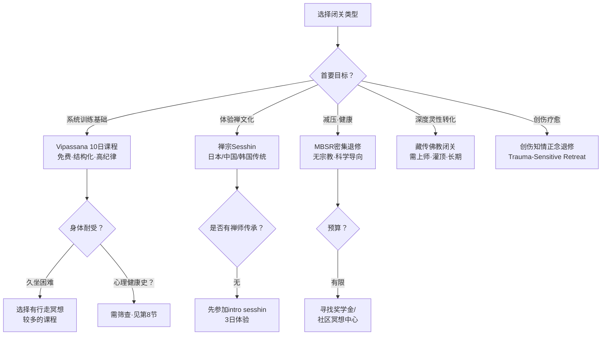
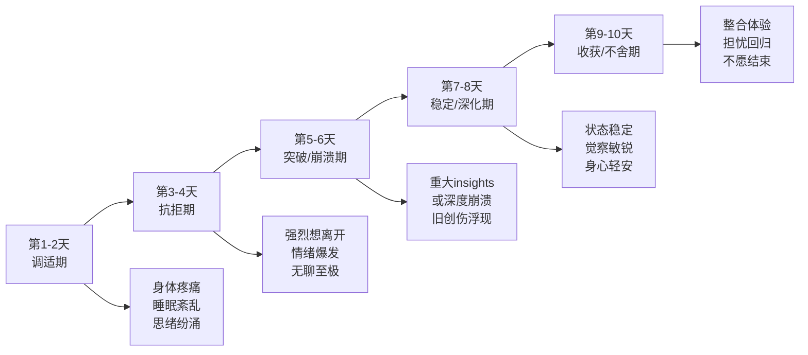
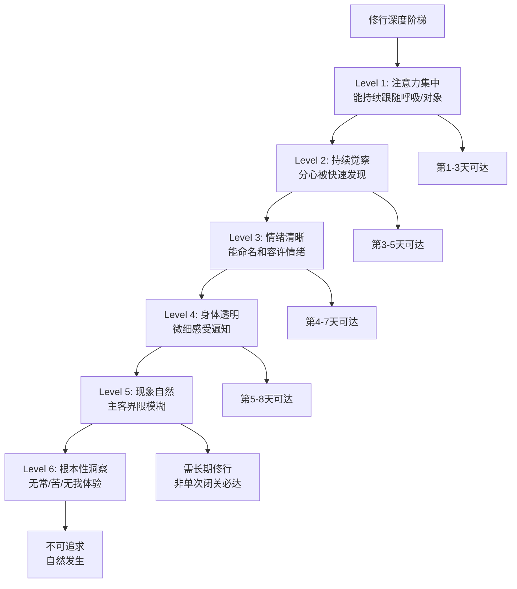
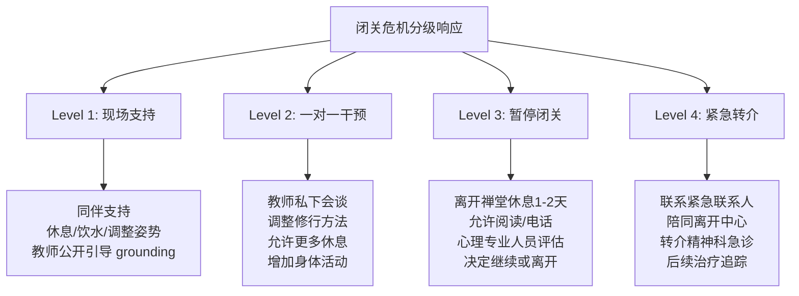

# 冥想密集闭关指南 | Meditation Retreat Guide

> **领域**：冥想深化实践与密集修行（Intensive Meditation Practice）
> **关键词**：密集闭关（Retreat）、内观十日课程（Vipassana 10-Day）、止观 retreat（Samatha-Vipassana Retreat）、禅宗闭关（Zen Sesshin）、整合期（Integration）、修行危机（Practice Crisis）、闭关后效应（Post-Retreat Effects）
> **上次更新**：2026-05

---

## 目录

1. [什么是冥想密集闭关](#1-什么是冥想密集闭关)
2. [闭关的主要类型与传承](#2-闭关的主要类型与传承)
3. [闭关前的准备：身心评估与基础建设](#3-闭关前的准备身心评估与基础建设)
4. [闭关中的修行：日程、技术与挑战](#4-闭关中的修行日程技术与挑战)
5. [闭关中的安全与危机应对](#5-闭关中的安全与危机应对)
6. [闭关后的整合：从密集到日常](#6-闭关后的整合从密集到日常)
7. [闭关效果评估与长期追踪](#7-闭关效果评估与长期追踪)
8. [特殊人群的闭关适配](#8-特殊人群的闭关适配)
9. [参考文献与资源](#9-参考文献与资源)

---

## 1. 什么是冥想密集闭关

### 1.1 定义与核心特征

冥想密集闭关（Meditation Retreat）是指在一段时间内（通常从数天到数月），练习者脱离日常生活，在特定环境中进行持续性、高强度的冥想修行。与日常短时练习相比，闭关具有以下核心特征：

| 维度 | 日常练习 | 密集闭关 |
|------|---------|---------|
| **时长** | 5-60分钟/天 | 6-16小时/天 |
| **连续性** | 间断，穿插于生活 | 连续，以冥想为主轴 |
| **环境** | 家庭/工作场所 | 专用闭关中心/寺庙 |
| **社交** | 正常人际互动 | 通常禁语或极度简化 |
| **感官输入** | 丰富多样 | 极简、受控 |
| **指导** | 自我引导或App | 现场教师/传统仪轨 |
| **目的** | 减压、维持、渐进 | 突破、深化、转化 |

### 1.2 为什么需要闭关

从神经可塑性与学习理论的角度，密集练习的优势包括：

- **累积剂量效应**：每日6-10小时的练习在10天内即达到60-100小时，相当于日常30分钟练习约4-6个月的总量
- **注意力资源集中**：免除日常决策消耗（Decision Fatigue），将全部认知资源投入修行
- **神经可塑性的饱和效应**：研究表明，连续密集练习可诱发更显著的脑结构与功能改变（Fox et al., 2014）
- **深度状态的可达性**：长时静坐更容易进入jhanas（禅那）、samadhi（三摩地）或深度正念状态
- **模式中断（Pattern Interrupt）**：脱离自动化生活脚本，提供根本性的视角转换可能

### 1.3 闭关的历史与文化根基

| 传统 | 闭关形式 | 历史渊源 | 核心目的 |
|------|---------|---------|---------|
| **上座部佛教** | Vipassana 十日课程 | 缅甸/泰国传统，Goenka于1969年系统化推广 | 体验无常、苦、无我 |
| **禅宗（中日韩）** | Sesshin（摄心） | 唐宋禅宗丛林制度 | 打破分别心，见性成佛 |
| **藏传佛教** | 三年三月闭关 | 密续传统，宗喀巴大师确立 | 生起次第、圆满次第修持 |
| **印度瑜伽传统** | Ashram 静修 | 韦达传统，现代由Sivananda等推广 | 综合瑜伽：体式、呼吸、冥想、服务 |
| **基督教传统** | Retreat/避静 | 依纳爵神操（16世纪） | 灵性辨明、与神亲密 |
| **苏菲传统** | Khalwa（隐居） | 伊斯兰神秘主义传统 | 与真主的合一体验 |
| **世俗正念** | MBSR 密集退修 | Kabat-Zinn于1979年创立 | 减压、觉察力培养 |

---

## 2. 闭关的主要类型与传承

### 2.1 上座部内观十日课程（Vipassana 10-Day Course）

**组织结构**：
- **主办方**：S.N. Goenka传承的Vipassana Research Institute（全球312+中心）
- **费用**：完全免费，基于捐赠（Dana）
- **规模**：通常为20-100人
- **日程**：每日约10小时冥想，4:00起床，21:00就寝

**修行结构**：

| 天数 | 主题 | 技术 | 难度 |
|------|------|------|------|
| 1-3 | Anapana（观息） | 观察自然呼吸，限定区域从鼻孔到上唇 | 中等 |
| 4 | 过渡日 | 上午教Vipassana，下午开始全身扫描 | 高 |
| 5-9 | Vipassana（内观） | 从头到脚、从脚到头系统扫描身体感受 | 很高 |
| 10 | Metta（慈心） | 将产生的纯净振动转化为对众生的善意 | 中等 |

**关键规则**：
- 完全的禁语（Noble Silence）：不与任何人交流，包括眼神接触、手势
- 不持任何宗教仪式或祈祷
- 不使用任何辅助工具（念珠、咒语、观想）
- 严格的性别隔离
- 过午不食（部分中心）

### 2.2 禅宗摄心（Zen Sesshin）

**典型日程（日本曹洞宗/临济宗）**：

```
04:00  起床（敲响大板）
04:30  早课（诵经/坐禅）
05:30  坐禅（一期：40-50分钟）
06:20  行禅（ kinhin，10-15分钟）
06:40  坐禅（二期）
07:30  早餐（斋饭，食存五观）
08:30  坐禅（三期）
09:20  行禅
09:40  坐禅（四期）
10:30  私下面谈（Dokusan/Teisho）
12:00  午餐
13:00  劳作（Samu：打扫、园艺）
14:00  坐禅（五期）
...     循环坐禅-行禅
18:00  晚餐（部分传统过午不食）
19:00  晚课/公案参究（临济宗）
21:00  止静
```

**核心技术**：
- **只管打坐（Shikantaza）**：曹洞宗，无对象觉察，"只是坐"
- **公案参究（Koan）**：临济宗，以话头打破逻辑思维
- **面接（Dokusan）**：与禅师一对一，汇报修行状态

### 2.3 藏传佛教闭关

**类型分级**：

| 级别 | 时长 | 内容 | 指导要求 |
|------|------|------|---------|
| **短期闭关** | 3-7天 | 咒语累积、简单观想 | 接受过灌顶 |
| **中期闭关** | 1-3个月 | 加行（Ngondro）、本尊修持 | 上师亲自指导 |
| **长期闭关** | 3年3月3天 | 生起次第、圆满次第、大圆满 | 根本上师常驻 |

**特殊要素**：
- **灌顶（Empowerment）**：多数修法需上师灌顶授权
- **闭关房（Tib. mtshams）**：专门建造，有时完全封闭
- **饮食供养**：由护持者提供，闭关者不从事劳作
- **结界与护持**：复杂的仪轨保护修行环境

### 2.4 世俗正念密集课程（Secular Intensive MBSR/MBCT）

**MBSR 密集退修（Retreat）**：
- 时长：5-7天
- 日程：每日约8小时正式练习（坐禅、身体扫描、瑜伽）
- 教师：MBSR认证教师
- 费用：通常$500-2000（含食宿）
- 特色：无宗教框架，强调科学基础

**与其他闭关的差异**：

| 维度 | 宗教传统闭关 | 世俗正念密集 |
|------|-------------|-------------|
| **哲学框架** | 解脱/觉悟/合一 | 减压、觉察、健康 |
| **伦理要求** | 持戒（五戒/十戒等） | 基本共处守则 |
| **教师角色** | 灵性权威/上师 | 专业 facilitator |
| **后续整合** | 可能要求长期修行承诺 | 鼓励但不强制日常练习 |
| **危机处理** | 依赖传统经验 | 通常有心理健康专业人员支持 |

### 2.5 闭关类型选择决策树



---

## 3. 闭关前的准备：身心评估与基础建设

### 3.1 身体健康准备

**久坐耐受度自评**：

| 评估项目 | 通过标准 | 未通过的处理 |
|---------|---------|-------------|
| 连续静坐30分钟 | 无明显疼痛或麻木 | 增加日常坐禅时长，逐步延长 |
| 盘腿/跪坐 | 可维持至少一种稳定坐姿 | 准备禅修椅、 cushions、凳子 |
| 每日6-8小时活动 | 无严重腰背/膝盖疾病 | 选择允许较多行走冥想的课程 |
| 过午不食耐受 | 血糖稳定，无低血糖史 | 提前咨询医生，准备应急食品 |
| 睡眠减少 | 可在6小时内恢复精神 | 提前调整作息 |

**建议的闭关前3个月准备计划**：

| 阶段 | 目标 | 具体内容 |
|------|------|---------|
| **第1个月** | 建立基础 | 每日冥想30分钟，尝试不同坐姿，开始早睡 |
| **第2个月** | 延长耐受 | 每周1-2次60分钟长坐，加入行走冥想 |
| **第3个月** | 模拟闭关 | 尝试1日"居家闭关"（4-6小时冥想），禁语半天 |

### 3.2 心理健康筛查

**不适合参加传统密集闭关的情况**：

| 风险等级 | 情况 | 建议 |
|---------|------|------|
| **绝对禁忌** | 活跃精神病性症状（幻觉、妄想）、急性自杀意念、严重物质依赖戒断期 | 先寻求精神科治疗 |
| **高风险** | 未稳定的PTSD、复杂创伤、重度抑郁（近6月发作）、解离性障碍、近期重大丧失（<3月） | 选择创伤知情退修，或有心理师驻场的课程 |
| **中等风险** | 轻中度焦虑、ADHD、饮食障碍恢复期、双相障碍稳定期 | 提前告知教师，准备应急计划，考虑较短课程 |
| **低风险** | 轻度压力、失眠、关系困扰、个人成长需求 | 可参加标准课程，保持自我监测 |

**闭关前心理自评问卷（简版）**：

```
过去一个月内：
□ 我是否有过无法控制的侵入性记忆或闪回？
□ 我是否在安静独坐时感到极度不安或恐慌？
□ 我是否有过伤害自己或他人的想法？
□ 我是否正在经历现实感丧失（感觉世界不真实）？
□ 我是否在最近三个月内经历了重大的丧失或创伤？

如果以上任一问题回答"是"，建议在报名前咨询心理健康专业人员，
并考虑选择有创伤知情支持的闭关课程。
```

### 3.3 实际事务准备

**物资清单**：

| 类别 | 推荐携带 | 注意事项 |
|------|---------|---------|
| **衣物** | 宽松、分层、无醒目图案 | 避免紧身衣物限制呼吸 |
| **坐垫** | 自己习惯的 meditation cushion | 虽然中心通常提供，但自己的更熟悉 |
| **药品** | 处方药、急救药、个人常用药 | 必须提前告知中心 |
| **阅读** | 不携带 | 绝大多数闭关禁止阅读 |
| **书写** | 一本笔记本（仅用于修行笔记） | 多数中心允许，但限制使用 |
| **电子设备** | 手机交由中心保管 | 完全禁用手机、电脑 |
| **食品** | 通常不允许 | 特殊饮食需求提前沟通 |

**事务安排**：
- 工作：请足够假期，包括闭关后1-2天缓冲期
- 家庭：安排妥当，避免闭关期间需紧急联系
- 财务：自动缴纳账单，预留应急资金
- 告知：告诉1-2位紧急联系人你的去向和中心联系方式

### 3.4 动机与期望澄清

**健康的闭关动机**：
- 深化冥想练习，理解心的运作
- 体验更深层的宁静与觉察
- 在受控环境中面对和转化困难
- 学习传统修行的完整方法

**不健康的动机（可能导致失望或危机）**：
- 逃避现实问题（"只要我去闭关，一切就会好起来"）
- 追求神秘体验或"开悟"作为成就
- 证明自己（"我能忍受最苦的课程"）
- 在人际关系危机中"冷静一下"

**期望校准练习**：

> 在闭关前，写下你对这次闭关的三个具体期望。然后问自己：
> 1. 这个期望是修行过程的自然结果，还是我强加的？
> 2. 如果这个目标没有达成，我还能从闭关中获得价值吗？
> 3. 我是否准备好面对比预期更困难的情况？

---

## 4. 闭关中的修行：日程、技术与挑战

### 4.1 典型的身心变化曲线



### 4.2 常见挑战与应对策略

**身体层面**：

| 挑战 | 机制 | 应对策略 |
|------|------|---------|
| **膝盖/背部疼痛** | 久坐压力、姿势不当 | 调整姿势、使用椅子、申请站立冥想、在疼痛成为信号前移动 |
| **极度困倦** | 睡眠负债释放、副交感神经过度激活 | 开放眼睛、挺直脊柱、冷水洗脸、在房间角落站立冥想 |
| **幻觉/幻象** | 感官剥夺、alpha-theta状态 | 知晓其为正常现象，不追逐不恐惧，告知教师 |
| **胃肠不适** | 饮食改变、过午不食、压力反应 | 少量多次饮水、温和的腹部呼吸、必要时告知医护人员 |
| **头痛** | 排毒反应、姿势紧张、能量变化 | 检查肩颈放松、保持水分、若持续告知教师 |

**心理层面**：

| 挑战 | 机制 | 应对策略 |
|------|------|---------|
| **强烈情绪爆发** | 压抑内容的释放、防御降低 | 允许情绪存在、回到呼吸锚点、必要时离开禅堂处理 |
| **侵入性记忆/闪回** | 创伤记忆在安静中浮现 | 使用 grounding 技术（双脚踩地、环顾四周）、立即告知教师 |
| **存在性恐惧/死亡焦虑** | 深层防御机制的松动 | 作为修行材料观察、保持呼吸、寻求教师指导 |
| **极端无聊** | 多巴胺戒断、刺激习惯化 | 将无聊作为观察对象、注意"想要刺激"的欲望 |
| **狂喜/特殊体验执着** | 大脑奖励系统激活 | 不追求、不执着、标记为"经验"后继续修行 |
| **想要离开的冲动** | 逃离不适的本能反应 | 承诺"再坐一小时后决定"、与教师讨论、区分真正需要与逃避 |

### 4.3 修行深度的阶梯模型



---

## 5. 闭关中的安全与危机应对

### 5.1 闭关特有的风险因素

密集闭关创造了独特的心理动力学环境，可能诱发或加剧以下问题：

| 风险因素 | 机制 | 可能后果 |
|---------|------|---------|
| **感官剥夺** | 简化环境降低现实检验锚点 | 解离、幻觉、现实感丧失 |
| **社会隔离** | 禁语剥夺社会反馈 | 孤立感、偏执思维、社交功能退化 |
| **睡眠剥夺** | 早起+不适姿势+精神活跃 | 认知功能下降、情绪不稳定、精神病性症状 |
| **饮食改变** | 素食、过午不食 | 低血糖、营养不足、躯体化反应 |
| **权威结构** | 教师作为绝对权威 | 激活依赖、创伤性权力动力、灵性滥用风险 |
| **情绪倾泻** | 长期压抑的释放 | 情绪淹没、自伤冲动、功能崩溃 |

### 5.2 闭关危机识别协议

**教师/工作人员监测清单**：

| 观察维度 | 正常表现 | 预警信号 | 紧急信号 |
|---------|---------|---------|---------|
| **身体** | 偶尔调整姿势、自然呼吸 | 持续颤抖、无法控制的哭泣、自伤行为 | 晕厥、自残、攻击行为 |
| **情绪** | 间歇性情绪波动、安静后的释放 | 持续恐慌、离群索居超过24小时、表达想死 | 明确自杀计划、严重解离 |
| **行为** | 遵守规则、偶尔走神 | 完全不进食、拒绝离开房间、对空气说话 | 毁坏物品、威胁他人 |
| **认知** | 报告"念头很多" | 表达"现实不真实"、认为自己开悟/被选中 | 妄想、幻觉作为坚信的现实 |

### 5.3 分级干预体系



### 5.4 "修行黑夜"（Dark Night）的闭关管理

修行黑夜现象（见[修行黑夜现象专题](临床-安全-Meditation_Dark_Night.md)）在闭关中发生率显著升高：

**识别标志**：
- 持续超过48小时的强烈恐惧、绝望或虚无感
- 对修行本身产生强烈的厌恶或怀疑
- 感觉"一切都失去了意义"，包括修行
- 身体感知消失或变得陌生
- 强烈的"自我解体"体验伴随恐慌

**管理原则**：
1. **不鼓励继续深入内观**：转为 grounding 练习、慈心禅或身体活动
2. **重建现实锚点**：增加感官刺激、与人交谈、接触自然
3. **专业评估**：区分修行黑夜与精神病性发作或抑郁发作
4. **不评判**：告知练习者这是已知的修行现象，非个人失败
5. **后续支持**：提供闭关后的心理健康追踪

---

## 6. 闭关后的整合：从密集到日常

### 6.1 整合期的定义与重要性

整合期（Integration Period）是指从闭关结束到日常生活完全恢复稳定之间的过渡阶段。研究表明，闭关后的2-4周是心理最脆弱也是最具可塑性的时期。

**整合不良的典型表现**：
- "灵性 bypass"：用"一切都是幻相"逃避现实责任
- 优越感：认为自己比"不修行的人"更高级
- 社交困难：无法适应正常对话的节奏和内容
- 冲动决策：在"洞察"驱使下做出重大人生改变
- 抑郁反弹：从高峰体验跌落后的失落和空虚

### 6.2 整合期日程建议

| 阶段 | 时长 | 建议 |
|------|------|------|
| **缓冲期** | 闭关后1-2天 | 不立即返回工作；在自然环境中独处或轻度社交 |
| **过渡期** | 第1周 | 减少工作强度；维持每日1-2小时冥想； journaling |
| **稳定期** | 第2-4周 | 恢复正常工作节奏；建立可持续的日常练习；寻找修行社群 |
| **长期维持** | 第1-6月 | 每月参加共修；考虑担任闭关义工；阅读深化理论 |

### 6.3 整合期的具体技术

** grounding 日常化**：
- 每日至少一次5分钟的身体 grounding（感受双脚、手触物体）
- 避免连续多日不练习
- 保持至少一项与"非修行者"的定期联系

**洞察的落地转化**：

| 闭关中的洞察 | 日常整合练习 | 避免的行为 |
|-------------|-------------|-----------|
| "一切都是无常的" | 在困难时刻默念，但不以此为借口放弃承诺 | 用无常合理化不负责任 |
| "自我是建构的" | 观察身份认同的流动性，但仍履行角色责任 | 虚无主义、道德相对主义 |
| "痛苦源于执着" | 觉察欲望升起，但渐进式改变习惯 | 压抑自然需求和情感 |
| "当下是唯一真实的" | 日常活动中的正念渗透 | 忽视未来规划和学习 |

### 6.4 社群支持的重要性

**建议的支持结构**：

```mermaid
graph TD
    A[整合期支持网络] --> B[修行伙伴]
    A --> C[教师/督导]
    A --> D[心理咨询师]
    A --> E[日常社交圈]
    
    B --> B1[每周共修<br/>经验分享<br/>互相提醒落地]
    C --> C1[定期面接/Dokusan<br/>深化指导<br/>纠偏]
    D --> D1[处理激活的创伤<br/>现实检验<br/>重大决策支持]
    E --> E1[保持"正常"<br/>防止修行泡沫<br/>多元视角]
```

---

## 7. 闭关效果评估与长期追踪

### 7.1 短期效果（闭关后即刻-1周）

| 维度 | 常见正向效果 | 常见负向/中性效果 |
|------|-------------|-----------------|
| **注意力** | 显著增强，持续时间长 | 注意力过于"黏滞"，难以切换 |
| **情绪** | 平静、喜悦、感恩 | 情绪波动大、对刺激敏感 |
| **身体** | 放松、能量感 | 疲惫、睡眠需求增加 |
| **认知** | 清晰、洞察 | 思维变慢、决策犹豫 |
| **人际** | 温和、有耐心 | 疏离、不愿参与琐事对话 |

### 7.2 中期效果（1-6个月）

**评估工具建议**：
- **FFMQ（五因素正念量表）**：测量正念特质变化
- **DASS-21**：监测抑郁、焦虑、压力水平
- **WHO-5**：整体幸福感
- **自定义 journaling**：追踪特定修行目标

### 7.3 长期效果（6个月-数年）

**关键追踪指标**：

| 指标 | 积极轨迹 | 警示轨迹 |
|------|---------|---------|
| 日常练习维持 | 每周>4次，每次>20分钟 | 完全停止或极度不规律 |
| 生活功能 | 工作/关系/健康改善 | 功能退化、孤立、经济困难 |
| 心理韧性 | 面对压力更从容 | 更脆弱、更回避 |
| 世界观 | 更开放、更慈悲 | 更僵化、更评判 |
| 再次闭关 | 有意义的回归 | 强迫性追求高峰体验 |

### 7.4 闭关效果的研究证据

| 研究 | 样本 | 发现 |
|------|------|------|
| Fox et al. (2014) Meta-analysis | 163篇神经影像研究 | 长期冥想者脑结构改变：前额叶、海马、岛叶灰质增加；杏仁核灰质减少 |
| Kral et al. (2018) | MBSR参与者 | 8周课程后杏仁核反应性降低，且在3个月后持续 |
| Szabo et al. (2021) | Vipassana 10日课程 | 显著降低焦虑、抑郁、压力；提升正念水平；效果在3个月追踪中维持 |
| Lindahl et al. (2017) | 冥想不良反应研究 | 密集闭关中22%报告至少一次显著不良反应；多数为暂时性 |

---

## 8. 特殊人群的闭关适配

### 8.1 创伤幸存者的闭关

**核心原则**：选择创伤知情（Trauma-Sensitive）闭关

| 特征 | 标准闭关 | 创伤知情闭关 |
|------|---------|-------------|
| **禁语** | 完全禁语 | 可选择简短交流 |
| **闭眼** | 鼓励闭眼 | 可选择睁眼 |
| **身体扫描** | 从头到脚深入 | 从安全区域开始，可跳过 |
| **教师权威** | 绝对指令 | 邀请式语言，强调选择 |
| **静默时长** | 长达数小时 | 较短的时段，有 grounding 穿插 |
| **支持资源** | 仅限教师 | 心理健康专业人员在场 |

**推荐资源**：
- Trauma-Sensitive Mindfulness Retreat（David Treleaven体系）
- iRest Yoga Nidra Retreat（由Richard Miller开发，专为创伤设计）
- 部分MBSR教师提供的改良密集课程

### 8.2 首次闭关者

**建议**：
- 首次选择**3-5日**课程，而非10日
- 选择有良好支持系统的主流中心
- 提前与中心沟通你的经验水平和担忧
- 不要独自在无人指导的情况下闭关

### 8.3 长期修行者

**进阶闭关选项**：
- 30日/60日/90日 Vipassana课程
- 禅宗冬季/夏季安居（Ango）
-  solo retreat（独居闭关，需充分准备）

**注意事项**：
- 长期闭关可能激活深层心理内容，建议有稳定的教师关系
- 准备应对"修行高原期"——长时间无明显进展的阶段
- 保持与现实世界的最低限度连接

---

## 9. 参考文献与资源

### 学术文献

1. Fox, K. C., et al. (2014). Is meditation associated with altered brain structure? A systematic review and meta-analysis of morphometric neuroimaging in meditation practitioners. *Neuroscience & Biobehavioral Reviews*, 43, 48-73.
2. Kral, T. R., et al. (2018). Impact of short and long-term mindfulness meditation training on amygdala reactivity to emotional stimuli. *NeuroImage*, 181, 301-313.
3. Szabo, A., et al. (2021). The psychological effects of a 10-day Vipassana meditation retreat: A pilot study. *Mental Health, Religion & Culture*, 24(4), 395-408.
4. Lindahl, J. R., et al. (2017). The varieties of contemplative experience: A mixed-methods study of meditation-related challenges in Western Buddhists. *PLOS ONE*, 12(5), e0176239.
5. Cebolla, A., et al. (2017). Unwanted effects: Is there a negative side of meditation? A multicentre survey. *PLOS ONE*, 12(9), e0183137.
6. Kornfield, J. (1993). *A Path with Heart: A Guide Through the Perils and Promises of Spiritual Life*. Bantam.
7. Treleaven, D. A. (2018). *Trauma-Sensitive Mindfulness: Practices for Safe and Transformative Healing*. W.W. Norton.
8. Britton, W. B., et al. (2021). Defining and measuring meditation-related adverse effects in mindfulness-based programs. *Clinical Psychological Science*, 9(6), 1185-1204.

### 闭关中心资源

| 类型 | 资源 | 网址/联系方式 |
|------|------|--------------|
| Vipassana（全球） | Vipassana Research Institute | www.dhamma.org |
| 禅宗（美国） | San Francisco Zen Center | www.sfzc.org |
| 藏传佛教（全球） | FPMT Retreat Centers | www.fpmt.org |
| 世俗正念（全球） | MBSR官方退修 | www.umassmed.edu/cfm |
| 创伤知情 | Trauma-Sensitive Mindfulness | www.traumasensitivemindfulness.com |
| 韩国禅 | 国际Seon中心 | 通过Korean Buddhist orders查询 |

### 相关链接

- [创伤知情冥想指南](临床-安全-Meditation_Trauma_Sensitive.md)
- [修行黑夜现象专题](临床-安全-Meditation_Dark_Night.md)
- [冥想不良反应系统分类](临床-安全-Meditation_Adverse_Effects.md)
- [冥想危机干预方案](临床-安全-Meditation_Crisis_Protocol.md)
- [冥想与睡眠](基础-总览-Meditation_And_Sleep.md)
- [危机与哀伤冥想指南](临床-危机冥想-Crisis_Meditation_Guide.md)
- [止观禅定理论基础](../../01-智慧传统/宗教/佛教-冥想-Buddhism_Samatha_Vipassana.md)
- [内观禅修实践指南](基础-总览-Vipassana_Practice_Guide.md)

---

> **最后更新：2026-05**
> 本指南旨在帮助修行者安全、有效地进行密集闭关。闭关是一项严肃的承诺，请在选择前充分评估自身条件，并在整个过程中保持自我关怀。
>
> **记住：最好的闭关不是最苦的闭关，而是最适合你当下状态的闭关。**

---

## 📞 危机干预资源 | Crisis Resources

> **如果您或您认识的人正在经历心理危机或有自杀念头,请立即寻求帮助。**

### 中国大陆

| 资源 | 联系方式 |
|---|---|
| 北京心理危机研究与干预中心 | **010-82951332** (24小时) |
| 全国心理援助热线 | **400-161-9995** (24小时) |
| 希望24热线 | **400-161-9995** (24小时) |
| 生命热线 | **400-821-1215** (24小时) |

### 国际

| 地区 | 资源 | 联系方式 |
|---|---|---|
| 🇺🇸 美国 | 988 Suicide & Crisis Lifeline | **988** (24/7) |
| 🇬🇧 英国 | Samaritans | **116 123** (24/7) |
| 🇭🇰 香港 | 撒玛利亚防止自杀会 | **2389-0000** |
| 🇹🇼 台湾 | 生命线 | **1995** |

**完整资源列表**:[_meta/docs/CRISIS_RESOURCES.md](../../_meta/docs/CRISIS_RESOURCES.md)

**全球资源**:[Befrienders Worldwide](https://www.befrienders.org) | [WHO 心理健康](https://www.who.int/health-topics/mental-health)

