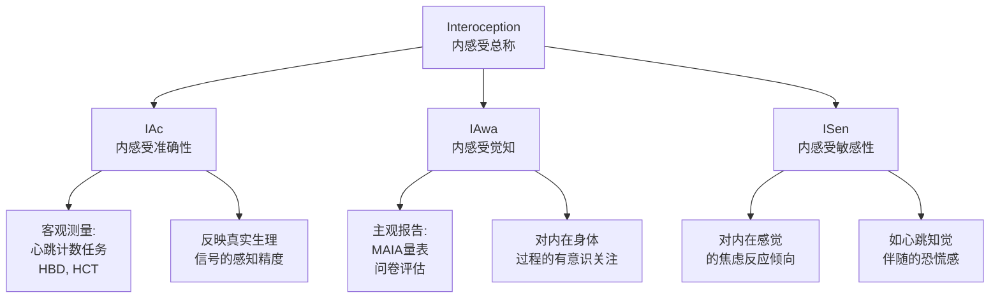
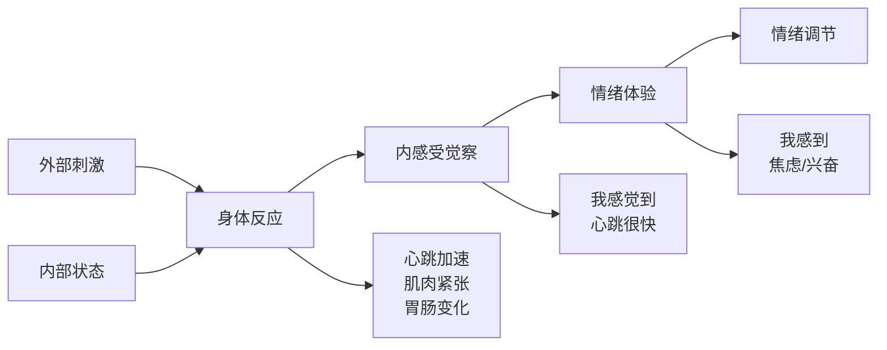
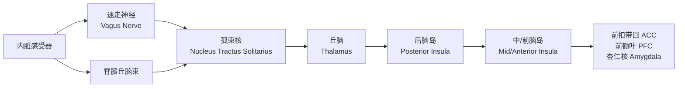
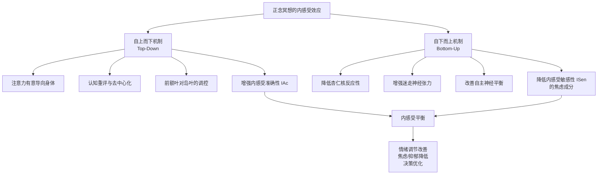
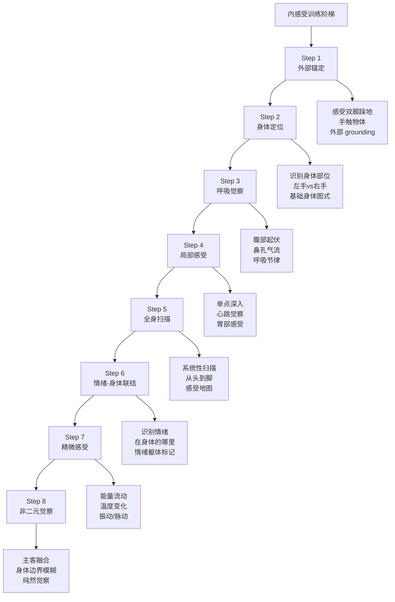
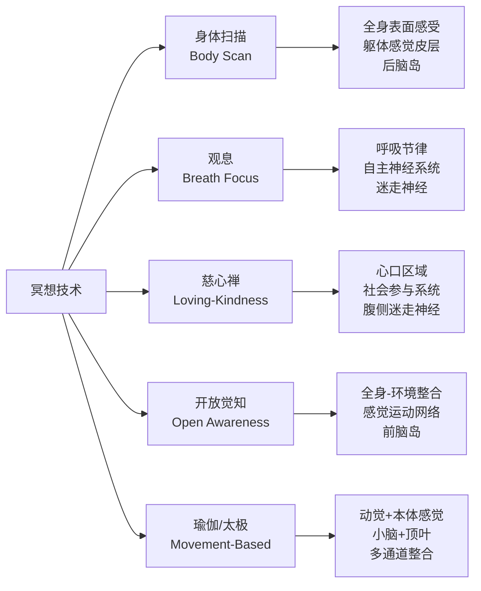

# 内感受与冥想专业指南 | Interoception & Meditation Guide

> **领域**：冥想神经科学与身体觉察机制（Meditation Neuroscience & Somatic Awareness）
> **关键词**：内感受（Interoception）、内感受准确性（Interoceptive Accuracy, IAc）、内感受觉知（Interoceptive Awareness, IAwa）、岛叶（Insula）、身体扫描（Body Scan）、躯体标记假说（Somatic Marker Hypothesis）、内感受暴露（Interoceptive Exposure）
> **上次更新**：2026-05

---

## 目录

1. [内感受的核心概念](#1-内感受的核心概念)
2. [内感受的神经科学基础](#2-内感受的神经科学基础)
3. [内感受与冥想的关系](#3-内感受与冥想的关系)
4. [内感受训练阶梯模型](#4-内感受训练阶梯模型)
5. [分技术的内感受效应](#5-分技术的内感受效应)
6. [临床整合：病症适配](#6-临床整合病症适配)
7. [内感受障碍与冥想风险](#7-内感受障碍与冥想风险)
8. [评估工具与测量方法](#8-评估工具与测量方法)
9. [前沿研究与未来方向](#9-前沿研究与未来方向)
10. [参考文献](#10-参考文献)

---

## 1. 内感受的核心概念

### 1.1 什么是内感受

内感受（Interoception）是指有机体对来自身体内部信号的感受能力，包括心跳、呼吸、胃肠蠕动、体温、激素水平变化、饥饿、口渴、疼痛、肌肉张力等。它是身体向大脑传递的"内部环境报告"，构成了情绪体验、自我意识和决策的生理基础。

**内感受 vs. 外感受 vs. 本体感觉**：

| 感觉通道 | 信息来源 | 示例 | 主要脑区 |
|---------|---------|------|---------|
| **外感受（Exteroception）** | 外部环境 | 视觉、听觉、触觉、嗅觉、味觉 | 初级感觉皮层（V1, A1, S1） |
| **本体感觉（Proprioception）** | 身体在空间中的位置 | 关节位置、肌肉长度、运动方向 | 小脑、顶叶皮层 |
| **内感受（Interoception）** | 身体内部环境 | 心跳、呼吸、饥饿、内脏不适、体温 | 岛叶、前扣带回（ACC）、躯体感觉皮层 |

### 1.2 内感受的多维模型（Garfinkel et al., 2015）

现代研究将内感受区分为三个相互关联但可分离的维度：



| 维度 | 英文全称 | 定义 | 测量方式 |
|------|---------|------|---------|
| **内感受准确性** | Interoceptive Accuracy | 客观判断身体内部状态的精确程度 | 心跳计数任务（HCT）、呼吸阻力辨别 |
| **内感受觉知** | Interoceptive Awareness | 对身体内部信号的有意识关注和觉察 | MAIA量表（多维内感受觉知评估）、自我报告 |
| **内感受敏感性** | Interoceptive Sensibility | 对身体感觉的主观重视程度和情绪反应 | 心跳知觉信心评分、焦虑敏感性指数 |

### 1.3 内感受在心理功能中的核心作用

**Damasio的躯体标记假说（Somatic Marker Hypothesis）**：

决策并非纯粹理性计算过程。身体对可能选择的"预感性"反应（内脏感受、皮肤电反应等）以"躯体标记"的形式指导决策。内感受能力受损（如某些额叶损伤患者）会导致决策能力严重下降，即使智力完全正常。

**内感受与情绪的关系**：



- **James-Lange理论**：情绪源于对身体变化的感知
- **Schachter-Singer理论**：情绪 = 生理唤醒 + 认知标签
- **现代整合观点**：内感受是情绪体验的"原材料"，认知框架为其赋予意义

---

## 2. 内感受的神经科学基础

### 2.1 内感受神经通路

**初级内感受通路**：



**关键脑区功能**：

| 脑区 | 功能 | 冥想相关性 |
|------|------|-----------|
| **后脑岛** | 原始内感受信号的初级表征 | 冥想增强其觉察精度 |
| **前脑岛** | 内感受整合、主观感受、自我觉察 | 长期冥想者灰质增加最显著的区域之一 |
| **前扣带回（ACC）** | 内感受-情绪-认知整合、冲突监测 | 冥想增强ACC功能连接 |
| **杏仁核** | 内感受威胁信号的快速反应 | 冥想降低杏仁核反应性 |
| **前额叶（vmPFC, dlPFC）** | 内感受调节、情绪重评 | 冥想增强PFC对杏仁核的调控 |

### 2.2 迷走神经在内感受中的双重角色

迷走神经（第X对脑神经）是内感受信息传递的"高速公路"，约80%的迷走神经纤维为传入纤维（从身体到脑）。

**腹侧迷走神经（Ventral Vagal）**：
- 与Porges的多迷走神经理论相关
- 支持社会参与、安全感和恢复性内感受
- 冥想通过延长呼气激活腹侧迷走神经，增强副交感张力

**背侧迷走神经（Dorsal Vagal）**：
- 与冻结/关闭反应相关
- 过度激活导致麻木、解离、社交退缩
- 某些冥想状态可能与背侧迷走神经调节有关（需谨慎区分健康与病理性）

### 2.3 内感受的神经可塑性

**冥想导致的内感受相关脑改变**：

| 研究 | 样本 | 发现 |
|------|------|------|
| Lazar et al. (2005) | 经验丰富的正念冥想者 | 右侧前脑岛和感觉皮层灰质增厚 |
| Hölzel et al. (2011) | MBSR 8周参与者 | 右侧海马和后脑岛灰质密度增加 |
| Fox et al. (2014) Meta | 163篇研究 | 岛叶灰质增加是冥想最一致的神经结构发现 |
| Farb et al. (2013) | MBSR参与者 | 冥想经验与"叙事网络"到"直接经验网络"的转换相关，岛叶是核心节点 |

---

## 3. 内感受与冥想的关系

### 3.1 冥想作为内感受训练的系统

几乎所有冥想传统都以某种形式训练内感受，只是侧重点和方法不同：

| 冥想传统 | 内感受训练方式 | 关注区域 | 最终目标 |
|---------|--------------|---------|---------|
| **正念身体扫描** | 系统性关注身体各部位感受 | 全身表面与深层 | 觉察身体感受的无常性 |
| **观息（Anapana）** | 观察呼吸的物理感受 | 鼻孔/腹部/全身 | 培养专注力与精微觉察 |
| **内观（Vipassana）** | 从头到脚扫描身体感受 | 全身皮肤表面 | 体验感受的生起与灭去 |
| **瑜伽/哈他瑜伽** | 体式中的身体感受觉察 | 肌肉、关节、呼吸 | 身心整合、能量流动 |
| **太极/气功** | 气感、身体能量觉察 | 丹田、经络、整体气场 | 气的培养与导引 |
| **慈心禅（Metta）** | 身体中温暖/开放感的觉察 | 心口区域 | 将身体感受转化为情感状态 |
| **藏传佛教脉轮修持** | 能量中心（Chakra）的感受 | 七个脉轮位置 | 能量转化与觉悟 |
| **基督教归心祈祷** | 神圣临在的"感受" | 心为中心 | 与神的联合体验 |

### 3.2 正念冥想的双重内感受机制



### 3.3 内感受的三个层级与冥想适配

**层级一：内感受缺失（Alexithymia / 述情障碍倾向）**

- 特征：难以识别和描述身体感受与情绪；"我不知道自己有什么感觉"
- 在人群中的比例：约10%（一般人群），高达50%（抑郁症、PTSD、饮食障碍）
- 冥想适配：
  - 从极度简单的身体觉察开始（"你的左手在哪里？"）
  - 使用外部锚点辅助（手放在腹部感受呼吸）
  - 避免抽象指导语（"感受你的能量"）
  - 结合躯体治疗（Somatic Experiencing, Sensorimotor Psychotherapy）

**层级二：内感受过度敏感（Interoceptive Hypersensitivity）**

- 特征：对身体微小变化过度警觉；频繁报告心悸、胃肠不适、头晕
- 常见于：恐慌障碍、健康焦虑、躯体症状障碍
- 冥想适配：
  - 从外感受 grounding 开始，建立外部安全锚点
  - 渐进式内感受暴露（从最不焦虑的身体区域开始）
  - 强调"观察而不反应"的去中心化能力
  - 配合认知行为治疗（CBT）

**层级三：内感受平衡（Balanced Interoception）**

- 特征：准确感知身体信号，适度情绪反应，灵活调节
- 冥想目标：维持并深化这一状态
- 进阶练习：开放觉知（Open Awareness）、非二元觉察

---

## 4. 内感受训练阶梯模型

### 4.1 八阶梯模型（从基础到高阶）



### 4.2 每一阶梯的详细训练

**Step 1: 外部锚定（External Anchoring）**

| 练习 | 方法 | 时长 | 目标 |
|------|------|------|------|
| 接地呼吸 | 感受双脚与地面接触的同时呼吸 | 3-5分钟 | 建立身体存在的基本感 |
| 物体触摸 | 握住一个物体，感受重量、温度、质地 | 2-3分钟 | 通过外感受引导身体觉察 |
| 声音 grounding | 聆听环境中的声音，同时觉察身体坐姿 | 3-5分钟 | 多通道整合，降低内感受焦虑 |

**Step 2: 身体定位（Body Localization）**

| 练习 | 方法 | 时长 | 目标 |
|------|------|------|------|
| 身体部位识别 | 闭眼，被询问"你的左手在哪里？"，不移动去感受 | 5分钟 | 激活身体图式（Body Schema） |
| 身体边界绘制 | 用注意力"勾勒"身体轮廓 | 5分钟 | 建立身体边界意识 |
| 左右对比 | 同时觉察左手和右手，比较感受差异 | 3分钟 | 增强身体觉察的分辨率 |

**Step 3: 呼吸觉察（Breath Awareness）**

| 练习 | 方法 | 时长 | 目标 |
|------|------|------|------|
| 腹部觉察 | 手放腹部，感受起伏 | 5-10分钟 | 建立基础内感受锚点 |
| 鼻孔觉察 | 感受空气进出鼻孔的温度差异 | 5-10分钟 | 精微感受训练 |
| 全身呼吸 | 感受呼吸在身体各处的微妙影响 | 10分钟 | 扩展呼吸觉察的范围 |

**Step 4: 局部感受（Localized Sensation）**

| 练习 | 方法 | 时长 | 目标 |
|------|------|------|------|
| 心跳觉察 | 手按脉搏或单纯内感心跳 | 3-5分钟 | 最经典的内感受准确性训练 |
| 胃部觉察 | 饭后1-2小时，觉察胃部饱胀/空虚 | 3分钟 | 内脏感受训练 |
| 温度觉察 | 觉察手部或脚部的温度 | 3分钟 | 皮肤温度感受（与内感受相关） |

**Step 5: 全身扫描（Body Scan）**

| 练习 | 方法 | 时长 | 目标 |
|------|------|------|------|
| 标准身体扫描 | 从头到脚，系统关注每个区域 | 20-45分钟 | 建立全身内感受地图 |
| 快速扫描 | 5分钟内快速掠过全身 | 5分钟 | 日常维护 |
| 深层扫描 | 在特定区域停留更久，深入感受 | 30分钟 | 深化特定区域觉察 |

**Step 6: 情绪-身体联结（Emotion-Body Connection）**

| 练习 | 方法 | 时长 | 目标 |
|------|------|------|------|
| 情绪定位 | 当情绪升起时，问"这在我的身体哪里？" | 持续练习 | 建立情绪躯体地图 |
| 感受命名 | 为身体感受命名（紧绷、沉重、热、空等） | 5分钟 | 增强情绪粒度（Emotional Granularity） |
| 情绪回溯 | 回忆一个情境，追踪身体的反应 | 5-10分钟 | 理解情绪-身体联结模式 |

**Step 7: 精微感受（Subtle Sensation）**

| 练习 | 方法 | 时长 | 目标 |
|------|------|------|------|
| 能量觉察 | 感受身体中的流动感、电流感 | 10-20分钟 | 进入更精微的感受层面 |
| 脉动觉察 | 感受心跳在全身产生的细微脉动 | 5分钟 | 全身心跳感知 |
| 边界消融 | 感受身体边界处的模糊感 | 10分钟 | 预备非二元体验 |

**Step 8: 非二元觉察（Non-Dual Awareness）**

| 练习 | 方法 | 时长 | 目标 |
|------|------|------|------|
| 开放觉知 | 不聚焦任何特定对象，保持全局开放 | 20-30分钟 | 超越主客二分 |
| 觉察本身 | 将注意力转向"谁在觉察" | 15-20分钟 | 自我探询 |
| 纯然存在 | 不区分内在/外在、身体/环境 | 20分钟 | 非二元体验 |

### 4.3 阶梯进阶的自评标准

| 当前阶梯 | 进阶标准 | 未达标信号 |
|---------|---------|-----------|
| Step 1 → 2 | 能在闭眼时清楚知道身体各部位位置 | 身体部位感觉模糊或混淆 |
| Step 2 → 3 | 能稳定觉察呼吸3分钟以上不走神 | 注意力频繁飘走，忘记在觉察 |
| Step 3 → 4 | 能在不控制的情况下清晰感知呼吸 | 总是不自觉地控制呼吸 |
| Step 4 → 5 | 能准确感知心跳（误差<10%）或特定区域感受 | 完全感觉不到心跳或目标区域 |
| Step 5 → 6 | 能完成标准身体扫描而不入睡或烦躁 | 扫描中频繁入睡或强烈抗拒 |
| Step 6 → 7 | 能在情绪升起时自动注意到身体信号 | 情绪爆发后才发现，身体信号被忽略 |
| Step 7 → 8 | 能稳定觉察精微感受10分钟以上 | 精微感受一闪即逝，无法稳定 |

---

## 5. 分技术的内感受效应

### 5.1 不同冥想技术的内感受靶点



### 5.2 各技术对内感受维度的影响

| 冥想技术 | IAc（准确性） | IAwa（觉知） | ISen（敏感性/焦虑） | 最受益人群 |
|---------|-------------|-------------|-------------------|-----------|
| **身体扫描** | ↑↑↑ 显著提升 | ↑↑↑ 显著提升 | →或↓ 中性或降低 | 述情障碍、慢性疼痛 |
| **呼吸觉察** | ↑↑ 中等提升 | ↑↑ 中等提升 | ↓ 降低焦虑 | 焦虑障碍、恐慌 |
| **观息（Vipassana）** | ↑↑↑ 显著提升 | ↑↑↑ 显著提升 | ↓↓ 显著降低 | 高功能修行者 |
| **慈心禅** | → 中性 | ↑↑ 中等提升 | ↓↓ 显著降低 | 抑郁、自我批评 |
| **开放觉知** | → 中性 | ↑↑↑ 显著提升 | ↓↓ 显著降低 | 高阶修行者 |
| **瑜伽/太极** | ↑↑ 中等提升 | ↑↑ 中等提升 | ↓ 降低焦虑 | 躯体化、运动受限 |
| **行走冥想** | → 中性 | ↑ 轻度提升 | ↓ 降低焦虑 | ADHD、静坐困难 |

---

## 6. 临床整合：病症适配

### 6.1 焦虑障碍中的内感受训练

**核心机制**：焦虑障碍患者通常具有**内感受恐惧（Interoceptive Fear）**——对正常身体变化的灾难化解释。例如，心跳加速被解释为"心脏病发作"或"失控"。

**冥想整合方案**：

| 阶段 | 目标 | 技术 | 时长 |
|------|------|------|------|
| **稳定期** | 降低对内部感受的恐惧 | 外部 grounding + 缓慢呼吸 | 1-2周 |
| **暴露期** | 建立与身体感受的安全关系 | 渐进式身体扫描（从安全区域开始） | 3-4周 |
| **整合期** | 将内感受作为信息而非威胁 | 完整身体扫描 + 去中心化 | 4-8周 |
| **深化期** | 利用内感受进行情绪调节 | 情绪-身体联结练习 | 持续 |

**关键注意事项**：
- 对恐慌障碍患者，早期不要聚焦于呼吸（可能触发过度换气恐惧）
- 从四肢末端开始扫描，而非胸腹（心跳/呼吸集中区域）
- 始终提供 grounding 出口："如果感到不适，你可以随时回到感受双脚"

### 6.2 抑郁症中的内感受训练

**核心机制**：抑郁症常伴随**内感受缺失（Anhedonia的身体层面）**——难以感受身体的愉悦或活力。同时，抑郁症患者的岛叶功能常显示异常激活模式。

**冥想整合方案**：

| 问题 | 内感受表现 | 冥想技术 | 预期效果 |
|------|-----------|---------|---------|
| **躯体麻木** | 感觉身体沉重、像"穿铅衣" | 从轻微运动开始（伸展、摇摆）配合觉察 | 重建身体活力感 |
| **疲劳感** | 无法区分"真的累"和"抑郁的累" | 能量觉察练习，标记能量水平 | 恢复能量感知精度 |
| **食欲紊乱** | 饥饿/饱足信号模糊 | 正念饮食 + 胃部觉察 | 恢复内感受食欲调节 |
| **晨重夜轻** | 早晨身体极度不适 | 睡前身体扫描 + 早晨 grounding | 降低晨间身体焦虑 |

### 6.3 饮食障碍中的内感受训练

**核心机制**：饮食障碍（尤其是神经性厌食和暴食症）的核心病理之一是**内感受信号失调**——饥饿/饱足信号被忽视、误读或被认知规则覆盖。

**冥想整合方案**：

| 障碍类型 | 内感受问题 | 冥想技术 | 注意事项 |
|---------|-----------|---------|---------|
| **神经性厌食** | 极度抑制饥饿信号 | 极度温和的胃部觉察（每次<2分钟） | 必须在医学监督下进行，体重恢复优先 |
| **暴食症** | 饱足信号延迟/忽略 | 正念饮食 + 饱足感觉察训练 | 结合营养教育，避免将冥想作为控制工具 |
| **BED** | 情绪性进食替代身体饥饿 | 情绪-身体联结练习，区分情绪饥饿与身体饥饿 | 处理情绪后再处理饮食 |

### 6.4 慢性疼痛中的内感受训练

**核心机制**：慢性疼痛不仅是伤害性信号的持续，更是**内感受-情绪-认知的恶性循环**。内感受训练改变的是"与疼痛的关系"，而非消除疼痛信号。

**冥想整合方案**：

| 阶段 | 技术 | 目标 |
|------|------|------|
| **分离** | 定位疼痛的精确边界和性质 | 将"整个我都在痛"转化为"左下背部有一处疼痛" |
| **观察** | 身体扫描经过疼痛区域 | 觉察疼痛的变化（不恒定）、周围的非痛区域 |
| **接纳** | 开放觉知包含疼痛 | 停止对抗反应，降低疼痛的情绪放大 |
| **转化** | 慈心禅针对疼痛区域 | 建立与疼痛区域的友善关系 |

---

## 7. 内感受障碍与冥想风险

### 7.1 内感受相关冥想不良反应

```mermaid
graph TD
    A[内感受相关冥想风险] --> B[解离风险]
    A --> C[恐慌触发]
    A --> D[躯体化加剧]
    A --> E[现实感丧失]
    
    B --> B1[过度关注身体<br/>导致身体边界模糊<br/>"我不在我的身体里"]
    C --> C1[心跳/呼吸觉察<br/>触发内感受恐惧<br/>恐慌发作]
    D --> D1[过度觉察身体<br/>放大正常感觉<br/>疑病倾向增强]
    E --> E1[身体扫描+感官剥夺<br/>产生"不真实感"<br/>现实解体]
```

### 7.2 高风险人群筛查

| 风险标志 | 机制 | 建议 |
|---------|------|------|
| **解离性障碍史** | 身体扫描可能加剧去人格化 | 避免闭眼身体扫描，优先 grounding |
| **恐慌障碍（未稳定）** | 呼吸/心跳觉察可能触发恐慌 | 从外感受开始，渐进至内感受 |
| **躯体症状障碍** | 过度身体觉察可能强化症状关注 | 结合认知重构，限制身体扫描时长 |
| **未稳定PTSD** | 身体感受可能激活创伤记忆 | 创伤知情改编，优先安全感建立 |
| **进食障碍（急性期）** | 身体扫描可能强化身体不满 | 医学稳定后再引入，避免全身扫描 |

### 7.3 安全实践原则

1. **知情同意**：告知练习者身体扫描可能引发的身体和情绪反应
2. **渐进暴露**：从外部锚点→局部感受→全身扫描，不跳跃
3. **选择自由**：始终提供替代锚点（声音、呼吸、 grounding ）
4. **时间限制**：初学者单次身体扫描不超过20分钟
5. **后续支持**：提供反应异常时的应对策略和支持资源

---

## 8. 评估工具与测量方法

### 8.1 客观测量：心跳计数任务（HCT）

**标准程序**：
1. 参与者安静坐好，不触摸脉搏
2. 指令："请在心里默数你的心跳次数"
3. 试验时长：常见为25秒、35秒、45秒分段
4. 记录实际心跳数（心电图或脉搏血氧仪）
5. 计算分数：

```
HCT Score = 1 - (|实际心跳数 - 报告心跳数| / 实际心跳数)

得分范围：0-1
>0.66 通常被认为是较好的内感受准确性
```

### 8.2 主观测量：MAIA量表

**多维内感受觉知评估（Multidimensional Assessment of Interoceptive Awareness）**包含8个维度：

| 维度 | 题数 | 测量内容 |
|------|------|---------|
| **Noticing** | 4 | 觉察到身体感觉的能力 |
| **Not-Distracting** | 3 | 不因身体不适而分心的倾向 |
| **Not-Worrying** | 3 | 不因身体不适而焦虑的倾向 |
| **Attention Regulation** | 7 | 有意的注意力调控能力 |
| **Emotional Awareness** | 5 | 觉察身体感觉与情绪联结 |
| **Self-Regulation** | 4 | 用注意力调节不适的能力 |
| **Body Listening** | 3 | 主动"倾听"身体信号 |
| **Trusting** | 3 | 对身体信号的信任 |

**临床应用**：
- 前后测对比评估冥想干预效果
- 识别特定维度的缺陷以定制训练
- 监测内感受觉知的变化轨迹

### 8.3 冥想特定的内感受评估

**身体觉察问卷（Body Awareness Questionnaire, BAQ）**：
- 18个条目，测量日常对身体变化的觉察
- 与正念量表有中等相关

**感觉觉察能力量表（Sensory Awareness Ability Scale）**：
- 测量对身体感受的精微分辨能力
- 与冥想经验高度相关

---

## 9. 前沿研究与未来方向

### 9.1 内感受与预测加工（Predictive Processing）

最新的理论框架将内感受理解为**预测性过程**：

- 大脑不是被动接收身体信号，而是主动预测身体状态
- 内感受准确性 = 预测模型与实际信号的一致性
- 冥想可能通过降低预测的"僵化性"，增强对内感受预测误差的敏感性
- 这为理解冥想如何改变"自我模型"提供了新视角（Seth & Tsakiris, 2018）

### 9.2 内感受与虚拟现实（VR）

**新兴应用**：
- VR中的虚拟身体（Virtual Body）可以改变内感受信号
- 通过VR"扩展"或"改变"身体边界，研究内感受可塑性
- 潜在治疗应用：对身体不满的饮食障碍、慢性疼痛的身体图式重建

### 9.3 内感受与人工智能

- 可穿戴设备（智能手表、生物传感器）提供连续的内感受反馈
- 实时HRV反馈辅助呼吸冥想训练
- 潜在风险：过度依赖外部设备，削弱天然内感受能力

### 9.4 待解决问题

| 问题 | 现状 | 未来方向 |
|------|------|---------|
| 内感受的因果作用 | 相关研究丰富，因果证据不足 | 纵向干预研究 + 实验性操控 |
| 个体差异 | 内感受能力分布极广 | 基因-环境交互作用研究 |
| 测量精度 | HCT有局限，主观量表有偏差 | 开发更精准的实时内感受测量 |
| 冥想剂量 | 最佳训练频率/时长未知 | 剂量-效应研究 |
| 跨文化差异 | 多数研究基于西方样本 | 非西方文化的内感受概念研究 |

---

## 10. 参考文献

1. Craig, A. D. (2009). How do you feel—now? The anterior insula and human awareness. *Nature Reviews Neuroscience*, 10(1), 59-70.
2. Damasio, A. R. (1994). *Descartes' Error: Emotion, Reason, and the Human Brain*. Putnam.
3. Farb, N., et al. (2015). Interoception, contemplative practice, and health. *Frontiers in Psychology*, 6, 763.
4. Farb, N. A., et al. (2013). Interoception, contemplative practice, and health. *Frontiers in Psychology*, 6, 763.
5. Fox, K. C., et al. (2014). Is meditation associated with altered brain structure? *Neuroscience & Biobehavioral Reviews*, 43, 48-73.
6. Garfinkel, S. N., et al. (2015). Knowing your own heart: Distinguishing interoceptive accuracy from interoceptive awareness. *Biological Psychology*, 104, 65-74.
7. Hölzel, B. K., et al. (2011). Mindfulness practice leads to increases in regional brain gray matter density. *Psychiatry Research: Neuroimaging*, 191(1), 36-43.
8. Khalsa, S. S., et al. (2018). Interoception and mental health: A roadmap. *Biological Psychiatry: Cognitive Neuroscience and Neuroimaging*, 3(6), 501-513.
9. Lazar, S. W., et al. (2005). Meditation experience is associated with increased cortical thickness. *Neuroreport*, 16(17), 1893-1897.
10. Mehling, W. E., et al. (2012). The Multidimensional Assessment of Interoceptive Awareness (MAIA). *PLOS ONE*, 7(11), e48230.
11. Porges, S. W. (2011). *The Polyvagal Theory*. W.W. Norton.
12. Seth, A. K., & Tsakiris, M. (2018). Being a beast machine: The somatic basis of selfhood. *Trends in Cognitive Sciences*, 22(11), 969-981.
13. Treleaven, D. A. (2018). *Trauma-Sensitive Mindfulness*. W.W. Norton.
14. Van der Kolk, B. (2014). *The Body Keeps the Score*. Viking.
15. Critchley, H. D., & Garfinkel, S. N. (2017). Interoception and emotion. *Current Opinion in Psychology*, 17, 7-14.

---

## 相关链接

- [冥想神经科学机制](基础-总览-冥想神经科学Mechanisms.md)
- [冥想临床应用](基础-总览-冥想临床Applications.md)
- [创伤知情冥想指南](临床-安全-冥想创伤Sensitive.md)
- [冥想与睡眠](基础-总览-冥想And睡眠.md)
- [冥想核心基础](基础-总览-冥想核心.md)
- [身体扫描引导词脚本](引导-核心-Scripts身体Scan.md)
- [多迷走神经理论与创伤](临床-安全-冥想创伤Sensitive.md)

---

> **最后更新：2026-05**
> 内感受是冥想影响身心健康的核心机制通道。理解内感受的科学原理，有助于更安全、更精准地应用冥想技术，特别是在临床和教育场景中。
>
> **记住：身体不是修行的障碍，而是修行的入口。**
