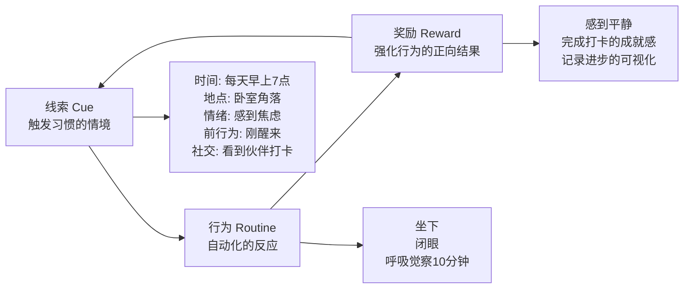
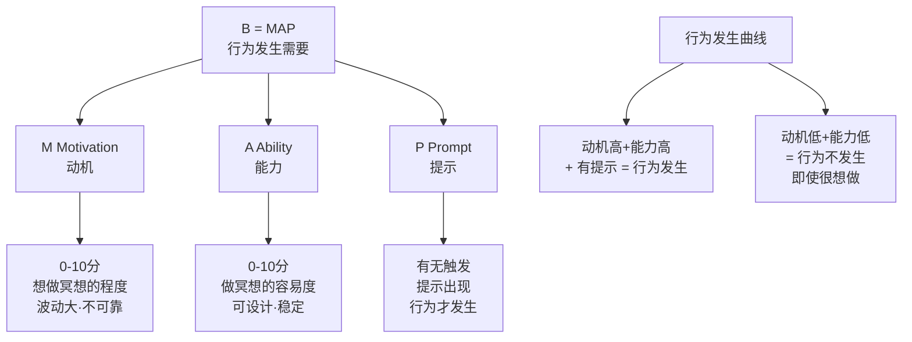
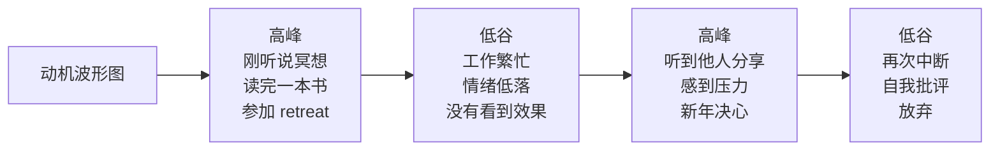
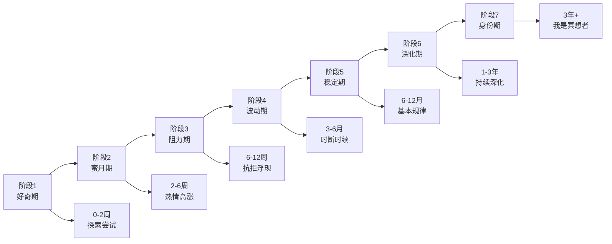
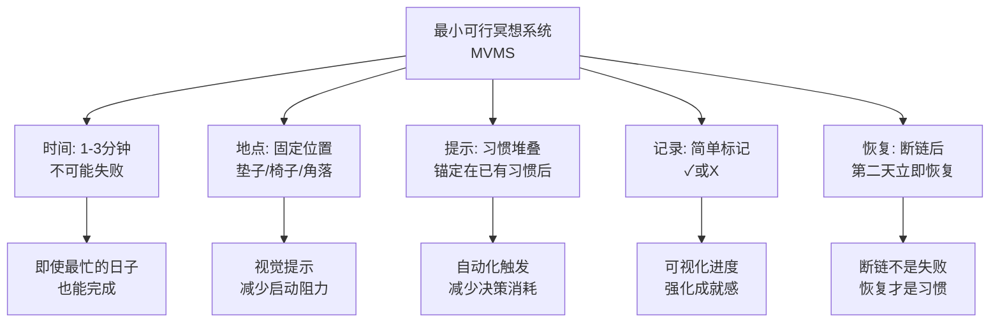
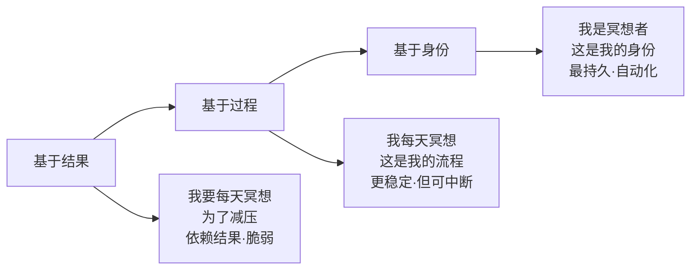

# 冥想习惯养成与行为科学指南 | Meditation Habit Formation & Behavioral Science Guide

> **领域**：冥想行为设计与持续实践系统（Meditation Behavioral Design & Sustainable Practice）
> **关键词**：习惯养成（Habit Formation）、BJ Fogg行为模型（Fogg Behavior Model）、微习惯（Tiny Habits）、执行意图（Implementation Intentions）、习惯堆叠（Habit Stacking）、行为设计（Behavior Design）、坚持曲线（Adherence Curve）、冥想依从性（Meditation Adherence）
> **上次更新**：2026-05

---

## 目录

1. [为什么冥想最难的是"坚持"](#1-为什么冥想最难的是坚持)
2. [行为科学基础：理解习惯的形成](#2-行为科学基础理解习惯的形成)
3. [BJ Fogg行为模型 × 冥想](#3-bj-fogg行为模型--冥想)
4. [冥想习惯养成的七阶段模型](#4-冥想习惯养成的七阶段模型)
5. [核心技术与工具箱](#5-核心技术与工具箱)
6. [常见障碍与精准解决方案](#6-常见障碍与精准解决方案)
7. [社群、责任与外部支持系统](#7-社群责任与外部支持系统)
8. [长期维持：从习惯到身份](#8-长期维持从习惯到身份)
9. [数字工具与App的行为设计分析](#9-数字工具与app的行为设计分析)
10. [个性化习惯设计方案](#10-个性化习惯设计方案)
11. [参考文献与资源](#11-参考文献与资源)

---

## 1. 为什么冥想最难的是"坚持"

### 1.1 数据揭示的实践困境

| 研究来源 | 发现 |
|---------|------|
| Headspace 用户数据 (2020) | 下载App的用户中，仅8%在30天后仍保持每日练习 |
| Cramer et al. (2016) Meta | MBSR课程的完成率约为75-85%，但6个月后的维持率降至40-60% |
| Parsons et al. (2017) | 冥想App用户的中位使用时长为每次6分钟，持续使用中位数为8天 |
| 中国冥想市场调查 (2023) | 76%的受访者表示"知道冥想很好，但无法坚持" |

### 1.2 冥想习惯独有的挑战

与其他健康习惯（如运动、饮食）相比，冥想习惯面临特殊障碍：

```mermaid
graph TD
    A[冥想习惯的特殊挑战] --> B[无即时反馈]
    A --> C[收益延迟]
    A --> D[反直觉性]
    A --> E[模糊目标]
    A --> F[情绪阻力]
    A --> G[环境不兼容]
    
    B --> B1[不像运动出汗<br/>不像饮食饱腹<br/>"我做对了吗？"]
    C --> C1[科学研究:<br/>8周才显著效果<br/>大脑结构改变需数月]
    D --> D1[越是焦虑<br/>越不想静坐<br/>越需要越抗拒]
    E --> E1["冥想"目标模糊<br/>不像"跑5公里"明确<br/>难以衡量完成]
    F --> F1[静坐可能<br/>激活焦虑/无聊<br/>被体验为惩罚]
    G --> G1[现代生活:<br/>碎片时间·通知轰炸<br/>"没有时间"是真实困境]
```

| 挑战 | 具体表现 | 行为科学解释 |
|------|---------|-------------|
| **无即时反馈** | 冥想后没有明显的"完成感" | 缺乏正向强化（Positive Reinforcement） |
| **收益延迟** | 需要数周甚至数月才感到变化 | 与未来自我的时间折扣（Temporal Discounting） |
| **反直觉性** | 越想放松越紧张；越追求平静越焦躁 |  ironic process theory（反弹效应） |
| **模糊目标** | "变得更有正念"难以操作化 | 缺乏具体的行为定义（Behavioral Definition） |
| **情绪阻力** | 面对内心内容时的逃避 | 负强化（Negative Reinforcement）：逃避不适 |
| **环境不兼容** | 家庭/工作空间不适合 | 缺乏行为线索（Cue）和行为链（Behavior Chain） |

---

## 2. 行为科学基础：理解习惯的形成

### 2.1 习惯的三要素循环（Cue-Routine-Reward）

Charles Duhigg在《习惯的力量》中提出的模型：



### 2.2 从有意识到自动化的转变

**习惯形成的阶段模型**：

| 阶段 | 名称 | 特征 | 冥想中的表现 |
|------|------|------|-------------|
| **1** | 无意识无能力 | 不知道要冥想，也不知道怎么做 | 从未听说过冥想 |
| **2** | 有意识无能力 | 知道要冥想，但觉得很难 | 开始练习，但经常忘记或抗拒 |
| **3** | 有意识有能力 | 需要意志力来完成 | 能完成，但需要提醒自己 |
| **4** | 无意识有能力 | 自动化执行，无需思考 | 到点就坐，不冥想反而不习惯 |

**目标**：将冥想从阶段2-3推进到阶段4。

### 2.3 神经科学：基底神经节与习惯

- **前额叶皮层（Prefrontal Cortex）**：负责有意识的目标设定和决策（启动阶段需要）
- **基底神经节（Basal Ganglia）**：负责自动化行为模式（习惯形成后主导）
- **多巴胺系统**：不是"快乐"分子，而是"预期误差"信号——当奖励超过预期时释放，强化行为

**对冥想的启示**：
- 初期需要前额叶的努力（"我要冥想"）
- 重复足够多次后，基底神经节接管（"到点了，自动坐"）
- 设计"超预期的小奖励"增强多巴胺信号

---

## 3. BJ Fogg行为模型 × 冥想

### 3.1 核心公式：B = MAP

**Behavior = Motivation + Ability + Prompt**



**核心洞察**：
- 动机是波动的，不可靠
- 提升"能力"（让冥想变得更容易）比依赖动机更有效
- 必须有一个明确的"提示"触发行为

### 3.2 动机（Motivation）：如何有效利用

**动机的波动性**：



**策略：在动机高峰时设计系统，在低谷时执行系统**

| 动机来源 | 类型 | 可靠性 | 使用策略 |
|---------|------|--------|---------|
| 健康焦虑 | 外在 | 低 | 转化为具体目标，但不依赖 |
| 社交影响 | 外在 | 中 | 加入社群，但不唯一依赖 |
| 精神追求 | 内在 | 中高 | 深化理解，作为长期燃料 |
| 身份认同 | 内在 | 高 | "我是冥想者"——最强动机 |

### 3.3 能力（Ability）：让冥想变得"容易到不可能失败"

**Fogg的"能力链"——影响能力的6个因素**：

| 因素 | 冥想中的应用 | 优化策略 |
|------|-------------|---------|
| **时间** | "我没有30分钟" | 从1分钟开始；找到时间碎片 |
| **金钱** | 课程/APP费用 | 使用免费资源；将冥想视为投资 |
| **体力** | 久坐不适 | 椅子冥想；行走冥想；躺卧冥想 |
| **脑力** | 太累无法专注 | 极简引导（如"Just breathe"）；不强迫专注 |
| **社会偏差** | "别人会觉得我奇怪" | 找到同伴；在家私下练习 |
| **非常规性** | "这不像是我的风格" | 个性化冥想形式（音乐、自然、动态） |

**微习惯策略（Tiny Habits）**：

> 核心原则：新习惯应该从"不可能失败"的微小版本开始。

| 常规目标 | 微习惯版本 | 为什么有效 |
|---------|-----------|-----------|
| 每天冥想30分钟 | 每天深呼吸3次 | 30秒即可完成，无失败可能 |
| 每天早上冥想 | 起床后坐1分钟 | 不需要改变任何其他行为 |
| 用App完成课程 | 打开App就算完成 | 降低启动阻力 |
| 做身体扫描 | 觉察左脚一秒钟 | 将复杂任务简化到极致 |

### 3.4 提示（Prompt）：触发冥想的关键

**三类提示**：

```mermaid
graph LR
    A[提示类型] --> B[人物提示<br/>Person Prompt]
    A --> C[情境提示<br/>Contextual Prompt]
    A --> D[行动提示<br/>Action Prompt]
    
    B --> B1[教练提醒<br/>伙伴邀请<br/>社群打卡]
    C --> C1[闹钟<br/>App通知<br/>冥想垫显眼放置]
    D --> D1[习惯堆叠:<br/>"在我...之后<br/>我会..."]
```

**最有效的提示：习惯堆叠（Habit Stacking）**

将新习惯锚定在已有的牢固习惯之后：

| 已有习惯（锚点） | 新习惯（冥想） | 完整句式 |
|---------------|--------------|---------|
| 早晨刷牙后 | 坐下冥想1分钟 | "在我刷完牙后，我会坐在冥想垫上深呼吸3次" |
| 早晨泡咖啡后 | 在等待咖啡时觉察呼吸 | "在我按下咖啡机后，我会感受3次呼吸" |
| 午休吃完饭后 | 闭眼1分钟 | "在我吃完午饭后，我会闭眼觉察呼吸1分钟" |
| 晚上关灯前 | 躺卧身体扫描 | "在我上床关灯后，我会从头到脚扫描身体1次" |
| 接到压力邮件后 | 3次呼吸再回复 | "在我感到压力时，我会先呼吸3次再行动" |

---

## 4. 冥想习惯养成的七阶段模型

### 4.1 阶段总览



### 4.2 各阶段的特征与策略

**阶段1：好奇期（0-2周）**

| 特征 | 策略 |
|------|------|
| 被文章/朋友/App吸引 | 广泛尝试不同类型，找到感兴趣的 |
| 不知道从何开始 | 使用引导式App或视频入门 |
| 没有固定模式 | 不设目标，保持轻松探索 |
| 易放弃 | 不批评自己，允许"三天打鱼" |

**关键任务**：找到"最小愉悦版本"——哪种冥想方式让你感到哪怕一点点愉悦？

**阶段2：蜜月期（2-6周）**

| 特征 | 策略 |
|------|------|
| 感到新奇和成就感 | 建立基础习惯，设定微目标 |
| 可能感到早期效果（平静、睡眠改善） | 记录感受，强化正向关联 |
| 动机较高 | 利用动机高峰设计系统（时间、地点、提示） |
| 可能过度承诺（"我要每天1小时！"） | **警惕**：设定可持续的目标，避免 burnout |

**关键任务**：建立"如果-那么"计划（Implementation Intentions）

**阶段3：阻力期（6-12周）**

| 特征 | 策略 |
|------|------|
| 新鲜感消失 | 回到微习惯，降低难度 |
| 生活中的阻力显现 | 分析具体障碍，精准解决 |
| 自我批评出现（"我又没做到"） | 用自我慈悲替代自我批评 |
| 怀疑冥想的效果 | 回顾记录，科学了解时间线 |

**关键任务**：度过第一个"想放弃"的节点——这是习惯形成的分水岭。

**阶段4：波动期（3-6个月）**

| 特征 | 策略 |
|------|------|
| 练习频率波动 | 建立支持系统（社群、伙伴、教练） |
| 效果似乎停滞 | 尝试新的冥想类型或 deepen 现有练习 |
| 生活事件打断（出差、生病、压力） | 设计"最小可行练习"——即使在最忙也能做 |
| 开始理解冥想的真正挑战 | 阅读进阶书籍，深化理论理解 |

**关键任务**：将冥想从"项目"转化为"生活方式"。

**阶段5：稳定期（6-12个月）**

| 特征 | 策略 |
|------|------|
| 基本规律练习 | 稳定并优化练习质量和环境 |
| 开始体验更深层的益处 | 考虑参加 retreat 深化 |
| 冥想成为日常的一部分 | 探索冥想与其他生活领域的整合 |
| 偶尔仍有中断 | 接受中断是正常的，关键是恢复 |

**关键任务**：提升练习质量，从"做时间"转向"有质量的修行"。

**阶段6：深化期（1-3年）**

| 特征 | 策略 |
|------|------|
| 探索更深入的修行路径 | 寻找导师或修行社群 |
| 可能经历修行危机（Dark Night） | 了解修行地图，不恐慌 |
| 冥想影响世界观和价值观 | 将冥想智慧带入日常决策 |
| 可能想要分享/教导 | 考虑教师培训，但先稳固自己的修行 |

**关键任务**：在深化个人修行的同时保持生活平衡。

**阶段7：身份期（3年+）**

| 特征 | 策略 |
|------|------|
| "我是冥想者"成为自我认同的一部分 | 持续修行，不执着身份 |
| 修行与生活不可分割 | 服务他人，传承所学 |
| 可能面临新的存在性问题 | 持续学习，保持开放 |
| 成为他人的榜样 | 谦逊，记住初心 |

**关键任务**：将个人修行转化为对世界的贡献。

---

## 5. 核心技术与工具箱

### 5.1 执行意图（Implementation Intentions）

**格式**："如果[情境X出现]，那么我将[执行行为Y]"

| 领域 | 执行意图示例 |
|------|-------------|
| **时间锚定** | "如果到了早上7点，那么我就坐在冥想垫上" |
| **地点锚定** | "如果我走进卧室的那个角落，那么我就闭上眼睛深呼吸" |
| **情绪锚定** | "如果我感到焦虑，那么我就停下来做3次深呼吸" |
| **社交锚定** | "如果我的冥想伙伴发消息问我，那么我就诚实地报告今天的练习" |
| **障碍预案** | "如果今天早上没时间冥想，那么我在午休时做1分钟" |

### 5.2 习惯堆叠（Habit Stacking）详细模板

```
习惯堆叠公式：
在我 [当前习惯] 之后，
我将 [新习惯——冥想微行为]。

示例模板：

早晨系列：
□ 在我睁开眼睛后，我会做1次深呼吸
□ 在我坐起来后，我会感受双脚接触地面的感觉
□ 在我刷完牙后，我会坐在冥想垫上1分钟
□ 在我倒完咖啡后，我会看着蒸汽升起，深呼吸3次

工作系列：
□ 在我打开电脑后，我会先闭眼呼吸3次再开始工作
□ 在我收到压力邮件后，我会先呼吸5次再回复
□ 在我吃完午饭后，我会散步5分钟并觉察脚步

晚间系列：
□ 在我关上电脑后，我会做1分钟身体扫描
□ 在我躺到床上后，我会从脚到头放松身体
□ 在我关灯后，我会感恩今天发生的3件小事
```

### 5.3 诱惑捆绑（Temptation Bundling）

将冥想与已经喜欢做的事情捆绑：

| 喜欢的活动 | 捆绑方式 |
|-----------|---------|
| 早晨喝咖啡 | 只在冥想时享用特别的好咖啡 |
| 听音乐 | 创建专属的"冥想音乐播放列表" |
| 洗澡 | 将淋浴作为身体觉察的练习时间 |
| 散步 | 将部分散步转为正念行走 |
| 阅读 | 读完一章后，做5分钟冥想作为"奖励" |

### 5.4 损失厌恶与承诺机制

| 机制 | 具体应用 | 注意事项 |
|------|---------|---------|
| **金钱承诺** | 预付不可退款的课程费用 | 确保课程质量，避免增加压力 |
| **社交承诺** | 向朋友公开承诺每日练习 | 选择支持性而非评判性的伙伴 |
| **连续记录** | 使用"不要断链"（Don't Break the Chain）日历 | 断链后容易放弃，需设计"断链恢复协议" |
| **问责伙伴** | 每日互相报告 | 建立双向支持，而非单向监督 |

### 5.5 正念习惯养成的"最小可行系统"



---

## 6. 常见障碍与精准解决方案

### 6.1 20大常见障碍解决矩阵

| 障碍 | 行为科学诊断 | 精准解决方案 |
|------|-------------|-------------|
| **"我没有时间"** | 时间折扣 + 任务膨胀 | 从1分钟开始；利用碎片时间；将冥想与已有行为捆绑 |
| **"我坐不住"** | 能力障碍（体力） | 椅子冥想；行走冥想；分段多次短时练习 |
| **"我太焦虑/烦躁，无法冥想"** | 情绪回避 + 反直觉 | 这是最需要冥想的时刻；先做 grounding；允许烦躁存在 |
| **"我睡着了"** | 睡眠负债 + 时机不当 | 改为早晨冥想；坐着而非躺着；缩短时长；改善睡眠 |
| **"我不知道自己在做什么"** | 知识缺口 + 模糊目标 | 使用引导式App；参加入门课程；设定具体目标 |
| **"我没有看到效果"** | 期望管理 + 反馈延迟 | 记录细微变化；了解科学时间线；调整期望 |
| **"我忘记了"** | 缺乏提示 | 习惯堆叠；设置闹钟；冥想垫放在显眼处 |
| **"我感到无聊"** | 多巴胺戒断 + 刺激依赖 | 将无聊作为观察对象；尝试新类型；使用音乐 |
| **"我评判自己的练习"** | 完美主义 + 自我批评 | 学习"没有错误的冥想"; 慈心禅针对自己 |
| **"家庭/室友干扰"** | 环境不兼容 | 沟通边界；使用耳机；寻找外部空间 |
| **"旅行时无法练习"** | 情境依赖 | 设计"旅行版"冥想（仅呼吸，无需任何道具） |
| **"心情不好时不想做"** | 情绪-行为耦合 | 设计"最低版本"——心情不好时只做1次呼吸 |
| **"工作太忙"** | 角色冲突 | 将冥想定位为"提高效率的工具"而非额外任务 |
| **"我不喜欢我的冥想App"** | 工具不匹配 | 尝试不同App/方式；不依赖单一工具 |
| **"我感到孤独"** | 社交需求 | 加入冥想社群；参加团体共修；线上团体 |
| **"我断断续续，感到失败"** | 全-or-无思维 | 引入"恢复协议"；断链≠失败 |
| **"冥想让我更焦虑"** | 内感受恐惧 | 转为外感受 grounding；寻求创伤知情指导 |
| **"我有太多杂念"** | 期望偏差 | 理解"杂念是练习的一部分"; 计数法 |
| **"我更喜欢其他放松方式"** | 偏好差异 | 将偏好活动正念化（正念运动、正念泡澡） |
| **"我达到了目标后失去了动力"** | 目标依赖 | 从目标导向转为过程导向；从外在动机转为内在动机 |

### 6.2 "断链恢复协议"（Chain-Break Recovery Protocol）

**关键洞察**：习惯断裂本身不是问题，问题是对断裂的反应。

```mermaid
graph TD
    A[断链发生] --> B[第1步:<br/>标记而非评判]
    B --> C[第2步:<br/>好奇而非自责]
    C --> D[第3步:<br/>最小恢复]
    D --> E[第4步:<br/>预防再发]
    
    B --> B1["昨天没冥想"<br/>只是一个事实<br/>不是"我又失败了"]
    C --> C1["是什么让昨天不同？"<br/>收集数据<br/>而非自我攻击]
    D --> D1[今天只做<br/>最小可行版本<br/>1次呼吸也算]
    E --> E1[基于好奇的发现<br/>调整系统<br/>而非增加意志力]
```

**恢复协议详细步骤**：

| 步骤 | 行动 | 示例语言 |
|------|------|---------|
| 1. 标记 | 在日历上标记断链 | "2026-05-05：未冥想" |
| 2. 好奇 | 问自己3个问题 | "昨天发生了什么？是什么阻碍了我？我可以如何调整？" |
| 3. 最小恢复 | 当天完成最小版本 | "今天我至少做1次深呼吸" |
| 4. 系统调整 | 修改习惯设计 | "因为早晨太忙，我将冥想移到睡前" |
| 5. 自我慈悲 | 对自己说一句善意的话 | "断链是正常的，恢复练习是善良的" |

---

## 7. 社群、责任与外部支持系统

### 7.1 社群支持的类型与效果

| 社群类型 | 特点 | 最佳适用阶段 | 效果等级 |
|---------|------|-------------|---------|
| **线上打卡群** | 每日报告练习，互相鼓励 | 1-4阶段 | 中 |
| **线下共修团体** | 固定时间地点共同冥想 | 3-7阶段 | 高 |
| **导师/教练关系** | 一对一指导 | 4-7阶段 | 很高 |
| ** retreats** | 密集沉浸式体验 | 3-6阶段 | 高（但短暂） |
| **App内社群** | 便利但浅层 | 1-3阶段 | 中低 |

### 7.2 问责伙伴协议模板

```
问责伙伴关系协议

伙伴A：___________    伙伴B：___________

1. 沟通方式：
   □ 每日简短消息（如："今天冥想了15分钟✓"）
   □ 每周视频/电话15分钟
   □ 紧急情况时随时联系

2. 问责内容：
   □ 练习频率（目标：每周___天）
   □ 练习时长（目标：每次___分钟）
   □ 练习质量（1-5分自评）
   □ 遇到的障碍

3. 支持方式：
   □ 庆祝成功（即使是微小的）
   □ 当对方断链时，发送鼓励而非评判
   □ 分享资源和经验
   □ 必要时提醒对方回到微习惯

4. 协议期限：
   从____年__月__日到____年__月__日
   （建议至少3个月）

5. 退出条款：
   任何一方可以提前1周通知退出，无评判。
```

---

## 8. 长期维持：从习惯到身份

### 8.1 身份转变模型



**从结果到身份的转变策略**：

| 阶段 | 自我对话 | 转变策略 |
|------|---------|---------|
| **结果导向** | "我冥想是为了减压" | 开始注意冥想带来的其他变化（觉察力、慈悲心） |
| **过程导向** | "我每天早晨冥想" | 将冥想与价值观联结（"我重视觉察，所以冥想"） |
| **身份导向** | "我是冥想者，正如我是读者/跑步者" | 公开以冥想者身份介绍自己；将冥想融入价值观体系 |

### 8.2 长期维持的关键因素

**研究表明，维持冥想5年以上的修行者具有以下共同特征**：

| 因素 | 具体表现 | 如何培养 |
|------|---------|---------|
| **社群嵌入** | 属于一个修行社群 | 寻找并投入一个共修团体 |
| **导师关系** | 有信任的指导者 | 参加工作坊、retreat、建立长期关系 |
| **深度体验** | 有过"值得"的深入体验 | 至少参加一次密集闭关 |
| **生活整合** | 冥想不仅限于坐垫 | 将正念带入日常活动 |
| **服务精神** | 帮助他人修行 | 成为志愿者、助教或教师 |
| **持续学习** | 不断深入理解 | 阅读、参加工作坊、探索新传统 |

---

## 9. 数字工具与App的行为设计分析

### 9.1 主流冥想App的行为设计评估

| App | 正向设计 | 潜在问题 | 最适合 |
|-----|---------|---------|--------|
| **Headspace** | 系统化课程、友好视觉、渐进式结构 | 过度简化、订阅费用、 gamification 可能增加压力 | 初学者、喜欢结构化的人 |
| **Calm** | 丰富内容（故事、音乐）、优美界面 | 选择过载、内容偏娱乐化 | 失眠者、喜欢多样性的人 |
| **Insight Timer** | 免费、大量选择、社群功能 | 质量参差、缺乏引导、可能选择困难 | 有经验者、预算有限者 |
| **Waking Up** | 深度理论、Sam Harris的哲学整合 | 对初学者可能过于深入 | 知识型修行者 |
| **10% Happier** | 实用主义、专家访谈 | 内容较散、 branding 偏商业化 | 怀疑论者、职场人士 |
| ** Plum Village** | 免费、一行禅师传承、无商业压力 | 内容较少、技术简单 | 佛教取向、极简主义者 |

### 9.2 使用App的"反设计"策略

App通常被设计为最大化用户留存和付费转化，这可能与用户的真正利益不完全一致：

| App的设计目标 | 用户的真正利益 | 应对策略 |
|-------------|-------------|---------|
| 每日打开App | 每日冥想（不一定需要App） | 学习无App冥想；使用App作为培训工具而非依赖 |
| 连续打卡 | 可持续的、灵活的习惯 | 不追求连续记录；允许断链 |
| 增加使用时长 | 有质量的修行 | 缩短时长提升质量；不追求"时长数字" |
| 社交比较 | 个人化的修行路径 | 关闭社交功能；不比较 |
| 持续订阅 | 负担得起的修行 | 利用免费内容；购买一次性课程 |

---

## 10. 个性化习惯设计方案

### 10.1 评估你的冥想习惯类型

| 问题 | 选项A | 选项B | 选项C |
|------|-------|-------|-------|
| 我最不缺的是？ | 早晨时间 | 碎片时间 | 晚间时间 |
| 我最容易被什么触发？ | 固定时间 | 特定地点 | 特定情绪 |
| 我最大的障碍是？ | 起不来 | 忘记 | 烦躁坐不住 |
| 我喜欢的学习方式是？ | 自主探索 | 结构化课程 | 社群共修 |
| 我坚持其他习惯的方式是？ | 自律清单 | 社交承诺 | 嵌入日常 |

### 10.2 四种冥想习惯原型

| 原型 | 特征 | 最佳策略 | 示例日程 |
|------|------|---------|---------|
| **晨型自律者** | 早晨最有能量，喜欢规律 | 固定时间+固定地点+习惯堆叠在起床后 | 6:30起床→6:35坐冥想垫→6:45结束→6:50早餐 |
| **碎片整合者** | 日程不规律，但有很多碎片时间 | 多个微习惯+情境锚定 | 等咖啡时1分钟→午饭后2分钟→睡前3分钟 |
| **社群驱动者** | 需要外部 accountability | 共修团体+问责伙伴+公开承诺 | 每周二/四线下共修+每日与伙伴打卡 |
| **深度沉浸者** | 喜欢长时间、不被打扰的修行 | 每周2-3次长坐+定期retreat | 周三/周日早晨1小时深度冥想+每季度一次retreat |

### 10.3 30天习惯养成计划

**Week 1: 建立最小基础**
- 每日完成：1次深呼吸（是的，仅此而已）
- 在固定提示后执行（如：刷完牙后）
- 每天在日历上标记

**Week 2: 扩展时长**
- 每日完成：3次深呼吸或1分钟冥想
- 继续使用相同提示
- 开始记录感受（可选）

**Week 3: 增加结构**
- 每日完成：3-5分钟引导冥想
- 使用App或录音
- 如果某天做不到，回到1分钟版本

**Week 4: 稳定习惯**
- 每日完成：5分钟冥想
- 评估：这个习惯感觉自然了吗？
- 决定下个月的扩展计划

---

## 11. 参考文献与资源

### 学术文献

1. Fogg, B. J. (2019). *Tiny Habits: The Small Changes That Change Everything*. Houghton Mifflin Harcourt.
2. Clear, J. (2018). *Atomic Habits: An Easy & Proven Way to Build Good Habits & Break Bad Ones*. Avery.
3. Duhigg, C. (2012). *The Power of Habit: Why We Do What We Do in Life and Business*. Random House.
4. Gollwitzer, P. M. (1999). Implementation intentions: Strong effects of simple plans. *American Psychologist*, 54(7), 493-503.
5. Milne, S., et al. (2002). Combining motivational and volitional interventions to promote exercise participation: Protection motivation theory and implementation intentions. *British Journal of Health Psychology*, 7(2), 163-184.
6. Cramer, H., et al. (2016). The characteristics of an effective mindfulness teacher: A systematic review. *Explore*, 12(5), 329-338.
7. Parsons, C. E., et al. (2017). Home practice in mindfulness-based cognitive therapy and mindfulness-based stress reduction: A systematic review. *Mindfulness*, 8(4), 1132-1142.
8. Kral, T. R., et al. (2018). Impact of short and long-term mindfulness meditation training on amygdala reactivity to emotional stimuli. *NeuroImage*, 181, 301-313.
9. Mitchell, J. T., et al. (2017). Mediation of the association between age of onset of cannabis use and psychosis by developmental factors. *JAMA Psychiatry*.
10. Wood, W., & Rünger, D. (2016). Psychology of habit. *Annual Review of Psychology*, 67, 289-314.

### 实践资源

| 资源类型 | 推荐 | 说明 |
|---------|------|------|
| **书籍** | Fogg《Tiny Habits》 | 行为设计最实用指南 |
| **书籍** | Clear《Atomic Habits》 | 习惯养成的系统框架 |
| **App** | Streaks | 习惯追踪，简洁有效 |
| **App** | Way of Life | 习惯追踪，数据分析 |
| **模板** | 习惯堆叠工作表 | 自行创建或在线搜索 |
| **社群** | 本地正念中心 | 搜索"正念/MBSR+你的城市" |

---

## 相关链接

- [冥想核心基础](基础-总览-冥想核心.md)
- [冥想过程练习指导](基础-总览-冥想实践技术.md)
- [冥想执行师Q&A](基础-总览-冥想PractitionerQA.md)
- [冥想密集闭关指南](基础-总览-冥想静修指南.md)
- [冥想评估量表与工具](基础-总览-冥想评估工具.md)
- [冥想日记模板](基础-工具-冥想日志模板.md)
- [冥想安全筛查](基础-工具-冥想安全Screening.md)

---

> **最后更新：2026-05**
> 坚持冥想不需要超强的意志力，需要的是聪明的行为设计。将冥想变得微小、容易、有提示、有奖励，习惯会自然形成。
>
> **记住：1分钟的冥想胜过0分钟的冥想。完美的每天坚持是神话，持续的回归才是修行。**
