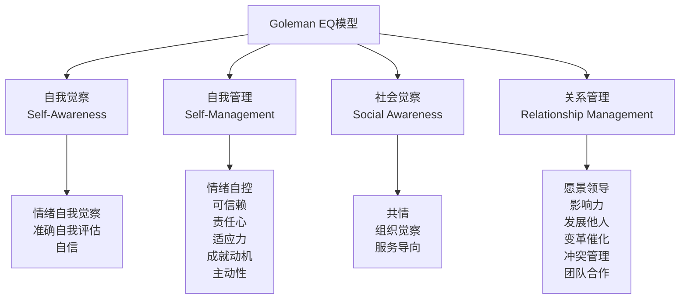
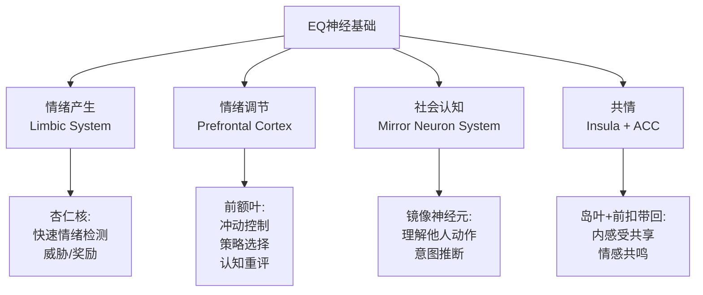
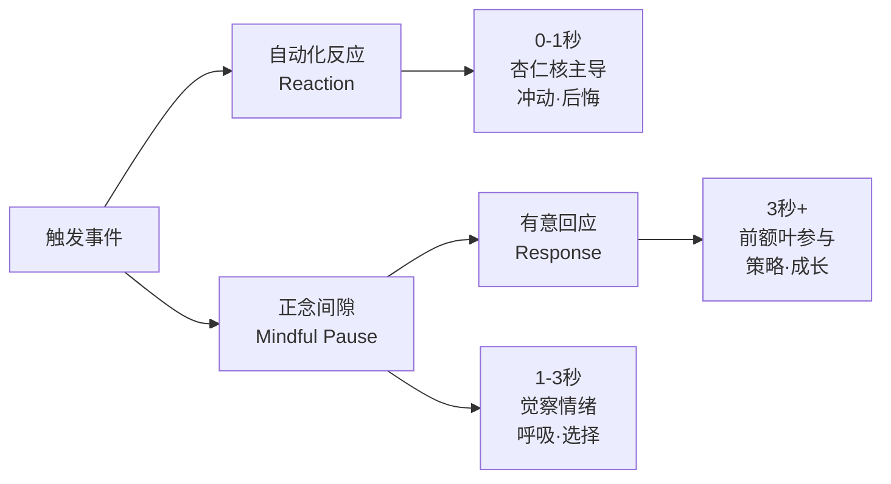

# 冥想与情绪智力（EQ）专业指南 | Meditation & Emotional Intelligence Guide

> **领域**：冥想与情绪智力的整合发展（Meditation & EQ Integration）
> **关键词**：情绪智力（Emotional Intelligence, EQ）、情绪觉察（Emotional Awareness）、情绪调节（Emotion Regulation）、情绪粒度（Emotional Granularity）、社交正念（Social Mindfulness）、共情（Empathy）、 compassion（慈悲）、Goleman模型、Mayer-Salovey模型
> **上次更新**：2026-05

---

## 目录

1. [情绪智力的核心框架](#1-情绪智力的核心框架)
2. [冥想如何提升情绪智力的四大支柱](#2-冥想如何提升情绪智力的四大支柱)
3. [情绪觉察：从模糊到精确](#3-情绪觉察从模糊到精确)
4. [情绪调节：从反应到回应](#4-情绪调节从反应到回应)
5. [社交正念：关系中的情绪智力](#5-社交正念关系中的情绪智力)
6. [职场中的冥想与EQ](#6-职场中的冥想与eq)
7. [亲密关系中的冥想与EQ](#7-亲密关系中的冥想与eq)
8. [儿童与青少年的EQ冥想训练](#8-儿童与青少年的eq冥想训练)
9. [评估工具与进展追踪](#9-评估工具与进展追踪)
10. [参考文献](#10-参考文献)

---

## 1. 情绪智力的核心框架

### 1.1 两种主要模型

**Goleman模型（1995, 1998）——最广泛应用**：



**Mayer-Salovey模型（1997）——学术标准**：

| 维度 | 能力 | 定义 |
|------|------|------|
| **感知情绪** | 识别自己和他人的情绪 | 从面部表情、声音、身体线索中读取情绪 |
| **运用情绪** | 利用情绪促进思维 | 让情绪引导注意力、判断和记忆 |
| **理解情绪** | 理解情绪语言和复杂情绪 | 知道情绪如何演变、混合、转换 |
| **管理情绪** | 调节自己和他人的情绪 | 对情绪保持开放，促进情绪和个人成长 |

### 1.2 情绪智力的神经基础



---

## 2. 冥想如何提升情绪智力的四大支柱

### 2.1 冥想对EQ各维度的影响总览

| EQ维度 | 冥想机制 | 核心冥想技术 | 效果等级 |
|--------|---------|-------------|---------|
| **情绪自我觉察** | 增强内感受觉察；去中心化观察情绪 | 身体扫描、情绪定位、开放觉知 | ↑↑↑ |
| **情绪调节** | 增强前额叶对杏仁核的调控；延长反应窗口 | 呼吸冥想、STOP技术、认知重评冥想 | ↑↑↑ |
| **共情** | 激活镜像神经元系统；减少自我参照 | 慈心禅、共情冥想、聆听冥想 | ↑↑ |
| **社交技能** | 降低社交焦虑；提升在场感 | 社交正念、对话冥想、非暴力沟通 | ↑↑ |

### 2.2 神经科学证据

| 研究 | 发现 | EQ相关性 |
|------|------|---------|
| Hölzel et al. (2011) | MBSR增加海马和岛叶灰质 | 情绪觉察和共情的基础 |
| Kral et al. (2018) | 长期冥想者杏仁核反应性降低 | 情绪调节能力增强 |
| Lutz et al. (2008) | 慈心禅训练增强右侧岛叶和颞顶交界区 | 共情和慈悲心的神经基础 |
| Fan et al. (2007) | 共情冥想增强前扣带回和脑岛活动 | 情感共鸣的神经机制 |
| Taren et al. (2015) | 正念训练增加前额叶-杏仁核功能连接 | 自上而下的情绪调节 |

---

## 3. 情绪觉察：从模糊到精确

### 3.1 情绪粒度（Emotional Granularity）

情绪粒度是指区分和标记不同情绪状态的精确程度。高情绪粒度与更好的心理健康、更强的情绪调节能力相关。

| 低粒度（模糊） | 中粒度 | 高粒度（精确） |
|--------------|--------|--------------|
| "我感觉很糟" | "我感到沮丧" | "我感到被忽视、有点愤怒，但也有悲伤" |
| "我很生气" | "我对这件事很不满" | "我感到被侵犯了边界，夹杂着失望" |
| "我很紧张" | "我有点焦虑" | "我因为不确定结果而感到不安，同时担心自己准备不足" |
| "我很开心" | "我感觉很好" | "我感到被认可，同时对未来充满期待" |

### 3.2 提升情绪粒度的冥想技术

**技术一：情绪定位冥想**

| 步骤 | 操作 | 时长 |
|------|------|------|
| 1 | 觉察当下有什么情绪 | 30秒 |
| 2 | 为情绪命名（尽可能具体） | 30秒 |
| 3 | 问"这个情绪在我的身体哪里？" | 1分钟 |
| 4 | 描述身体感受的性质（紧、热、重、空等） | 1分钟 |
| 5 | 问"这个情绪在告诉我什么需要？" | 1分钟 |
| 6 | 不试图改变，只是观察 | 1分钟 |

**技术二：情绪光谱扩展**

使用 Plutchik 情绪轮或更细致的情绪词汇表，练习从"基本情绪"扩展到"复杂情绪"：

| 基本情绪 | 第一层细分 | 第二层细分 |
|---------|-----------|-----------|
| 愤怒 | 烦躁、不满、愤慨 | 被背叛、被侵犯、嫉妒、怨恨 |
| 悲伤 | 失望、沮丧、孤独 | 被遗弃、遗憾、空虚、悲痛 |
| 恐惧 | 紧张、担忧、不安 | 被威胁、自卑、恐慌、焦虑 |
| 快乐 | 满足、兴奋、感激 | 自豪、爱、希望、宁静 |
| 厌恶 | 反感、鄙视、厌倦 | 鄙视、憎恨、恶心、排斥 |
| 惊讶 | 震惊、困惑、好奇 | 难以置信、迷茫、兴趣 |

**技术三：混合情绪觉察**

真实情绪体验很少是"纯"的。练习觉察同时存在的多种情绪：

> "我现在可以同时感到______和______。它们在我的身体不同部位吗？
> 它们是一起流动的，还是其中一个主导？"

### 3.3 日常情绪觉察练习

| 触发情境 | 微型练习 | 预计时长 |
|---------|---------|---------|
| 收到情绪性邮件/消息 | 回复前：闭眼，命名自己的情绪 | 30秒 |
| 会议中感到不适 | 觉察身体信号：哪里紧了？什么情绪？ | 10秒 |
| 睡前回顾 | 今天最强烈的情绪是什么？它在哪里？ | 2分钟 |
| 与家人冲突时 | 暂停，内心问"我现在具体有什么情绪？" | 10秒 |
| 感到"还好"时 | "'还好'是什么？无聊？平静？轻微满足？" | 30秒 |

---

## 4. 情绪调节：从反应到回应

### 4.1 反应 vs. 回应



### 4.2 STOP技术（核心情绪调节工具）

| 字母 | 步骤 | 操作 | 时长 |
|------|------|------|------|
| **S** | Stop | 暂停，什么都不做 | 1秒 |
| **T** | Take a breath | 深呼吸一次 | 3-5秒 |
| **O** | Observe | 觉察：发生了什么？身体？情绪？想法？ | 5-10秒 |
| **P** | Proceed | 有选择地行动：什么回应最有益？ | 5-10秒 |

### 4.3 情绪调节的冥想策略库

**策略一：呼吸调节（针对强烈情绪）**

| 情绪类型 | 呼吸技术 | 原理 |
|---------|---------|------|
| 焦虑/恐慌 | 延长呼气（吸4-呼6-8） | 激活副交感神经 |
| 愤怒 | 缓慢鼻呼吸，想象冷却气息 | 降低生理唤醒 |
| 悲伤 | 手放心口，感受呼吸的起伏 | 自我安抚 |
| 麻木 | 有意识的加快呼吸（温和） | 轻微提升唤醒 |

**策略二：认知重评冥想（针对负面思维）**

| 步骤 | 操作 |
|------|------|
| 1. 觉察 | "我现在有一个想法..." |
| 2. 命名 | "这是一个[评判/灾难化/读心术]的想法" |
| 3. 去中心化 | "这是一个心理事件，不一定是事实" |
| 4. 替代 | "另一个可能的视角是..." |
| 5. 慈悲 | "有这种想法是可以理解的" |

**策略三：情绪容纳（针对情绪淹没）**

```mermaid
graph TD
    A[情绪淹没] --> B[命名]
    B --> C[允许]
    C --> D[容纳]
    D --> E[转化]
    
    B --> B1["这是焦虑"<br/>"这是悲伤"]
    C --> C1["我可以感受它"<br/>"不需要消除它"]
    D --> D1["想象情绪如波浪<br/>我在冲浪板上"]
    E --> E1["这个情绪在告诉我什么？"<br/>"它有什么信息？"]
```

---

## 5. 社交正念：关系中的情绪智力

### 5.1 正念倾听（Mindful Listening）

| 层次 | 特征 | 正念提升方法 |
|------|------|-------------|
| **表面倾听** | 等待自己说话的机会 | 觉察自己的"想要回应"的冲动 |
| **内容倾听** | 关注对方说了什么 | 跟随内容的同时觉察身体感受 |
| **情感倾听** | 关注对方话语背后的情绪 | 问自己"TA此刻的感受是什么？" |
| **深度倾听** | 全然临在，不评判 | 放下所有预设，只是接收 |

**正念倾听练习**：

> 下次对话时：
> 1. 设定意图："这5分钟，我只倾听，不准备回应"
> 2. 当想打断的冲动升起，标记"想要说话"
> 3. 注意对方的语调、语速、身体语言
> 4. 对方说完后，停顿2秒再回应
> 5. 回应前先确认："我听到你说的是...是这样吗？"

### 5.2 冲突中的正念EQ

| 阶段 | 正念技术 | EQ能力 |
|------|---------|--------|
| **冲突前** | 身体扫描，识别紧张信号 | 自我觉察 |
| **触发瞬间** | STOP技术 | 冲动控制 |
| **冲突中** | 呼吸锚定，开放觉知 | 情绪调节 |
| **回应时** | 暂停，选择语言 | 关系管理 |
| **冲突后** | 慈心禅（对自己和对方） | 共情、宽恕 |

### 5.3 共情冥想（Empathy Meditation）

**Tonglen（施受法）的世俗改编**：

| 步骤 | 操作 |
|------|------|
| 1. 呼吸稳定 | 先让自己的呼吸平稳 |
| 2. 想象对方 | 想象一个你关心的人，感受他们的困难 |
| 3. 吸气想象 | 吸气时，想象吸收对方的痛苦（可视化：黑烟） |
| 4. 呼气想象 | 呼气时，想象发送舒适和希望（可视化：白光） |
| 5. 扩展 | 扩展到更多人：中立的人、困难的人、一切众生 |

**注意**：对于高共情者（Highly Sensitive/Empaths），Tonglen可能导致情绪过载。替代方案：
- 保持边界："我感受到你的痛苦，同时我知道这是你的经历"
-  grounding 优先：在共情练习前后做 grounding

---

## 6. 职场中的冥想与EQ

### 6.1 职场EQ的挑战

| 场景 | EQ挑战 | 冥想解决方案 |
|------|--------|-------------|
| **高压会议** | 情绪淹没、冲动发言 | 会前2分钟呼吸；会中双脚 grounding |
| **负面反馈** | 防御性、自我批评 | 接收前STOP；将反馈与自我价值分离 |
| **截止日期压力** | 焦虑、注意力分散 | 任务切换时的3次呼吸；单任务正念 |
| **办公室政治** | 关系复杂、信任困难 | 慈心禅（对困难同事）；正念沟通 |
| **远程工作** | 孤独、沟通误解 | 视频会议前的意图设定；邮件回复前的觉察 |
| **职业倦怠** | 情感耗竭、去人格化 | 日常微正念；边界设定冥想；慈心禅 |

### 6.2 正念领导力（Mindful Leadership）

| 领导力维度 | 正念EQ应用 | 具体实践 |
|-----------|-----------|---------|
| **自我觉察** | 识别自己的偏见和触发点 | 每日情绪回顾 journaling |
| **情绪调节** | 在压力下保持清晰 | 重要决策前的10分钟冥想 |
| **共情** | 理解团队成员的状态 | 一对一会议前的意图设定 |
| **关系管理** | 建设性处理冲突 | 冲突后修复对话的正念框架 |
| **系统觉察** | 感知组织情绪氛围 | 团队会议中的"情绪检查" |

### 6.3 职场微型正念（Micro-Mindfulness）

| 时机 | 微型练习 | 时长 |
|------|---------|------|
| 到达办公室 | 坐下前，感受双脚踩地 | 10秒 |
| 打开邮箱前 | 3次深呼吸，设定意图 | 15秒 |
| 会议开始 | 觉察身体坐姿，一次深呼吸 | 10秒 |
| 接到挑战任务 | 觉察身体反应，命名情绪 | 15秒 |
| 下班离开 | 回顾今天的一个成功，一个学习 | 30秒 |

---

## 7. 亲密关系中的冥想与EQ

### 7.1 伴侣同步冥想（Synchronized Meditation）

| 练习 | 方法 | 效果 |
|------|------|------|
| **同步呼吸** | 面对面或背靠背，同步呼吸节奏 | HRV耦合，增强连接感 |
| **慈心对诵** | 轮流对对方说慈心语句 | 提升关系满意度 |
| **矛盾后的共同 grounding** | 冲突后，先一起呼吸5次再说话 | 降低防御性，恢复前额叶功能 |
| **日常感恩分享** | 每天分享对对方的一个感激 | 增强正向情感记忆 |

### 7.2 关系修复的正念协议

```mermaid
graph TD
    A[关系冲突] --> B[暂停信号]
    B --> C[各自 grounding]
    C --> D[重新连接]
    D --> E[修复对话]
    E --> F[共同关闭]
    
    B --> B1[约定手势或词语<br/>任一方可随时叫停]
    C --> C1[各自离开<br/>10分钟自我平复<br/>呼吸/行走]
    D --> D1[重新坐在一起<br/>手牵手或肩并肩<br/>3次同步呼吸]
    E --> E1[使用"我"语句<br/>正念倾听<br/>不辩解]
    F --> F1[确认彼此的爱<br/>一个拥抱或感谢]
```

### 7.3 亲子正念与EQ传递

| 孩子年龄 | EQ发展任务 | 冥想/正念活动 |
|---------|-----------|-------------|
| **0-3岁** | 安全依恋、情绪调节的基础 | 照顾者的自我冥想（传递平静） |
| **3-6岁** | 情绪命名、基本调节 | 情绪脸游戏、"生气时的呼吸" |
| **6-12岁** | 情绪理解、社会认知 | 正念行走、睡前身体扫描 |
| **12-18岁** | 身份形成、复杂社交 | 青少年正念课程、 journaling |

---

## 8. 儿童与青少年的EQ冥想训练

### 8.1 发展适应性调整

| 年龄组 | 注意力时长 | 适合的冥想形式 | EQ焦点 |
|--------|-----------|--------------|--------|
| **3-5岁** | 1-3分钟 | 游戏化、故事、动作 | 情绪命名、基本身体觉察 |
| **6-9岁** | 3-5分钟 | 呼吸游戏、安静时间 | 情绪识别、冲动控制 |
| **10-12岁** | 5-10分钟 | 引导冥想、 journaling | 情绪理解、社交觉察 |
| **13-15岁** | 10-15分钟 | 正式冥想、讨论 | 情绪调节、身份探索 |
| **16-18岁** | 15-20分钟 | 自主练习、进阶技术 | 复杂关系、意义建构 |

### 8.2 学校环境中的EQ冥想项目

**.b课程（英国MiSP开发）要点**：

| 主题 | 内容 | EQ目标 |
|------|------|--------|
| **身体扫描** | 系统觉察身体 | 身体-情绪联结 |
| **觉察呼吸** | 呼吸锚定 | 注意力与情绪稳定 |
| **大脑/hand模型** | 解释"情绪劫持" | 情绪理解 |
| **感恩练习** | 日常感恩 | 正向情绪培养 |
| **友善练习** | 对己对人发送善意 | 共情、关系技能 |
| **困难与反应** | 觉察对困难的自动化反应 | 情绪调节 |

---

## 9. 评估工具与进展追踪

### 9.1 EQ自评量表

**Goleman EQ模型自评（简版）**：

| 维度 | 问题示例 | 1-5分 |
|------|---------|-------|
| 自我觉察 | "我能准确识别自己当下的情绪" | ___ |
| 自我管理 | "我能在压力下保持冷静" | ___ |
| 社会觉察 | "我能理解他人的情绪状态" | ___ |
| 关系管理 | "我能建设性地处理人际冲突" | ___ |

### 9.2 冥想特异性EQ评估

| 工具 | 测量内容 | 用途 |
|------|---------|------|
| **MSCEIT** | 客观EQ能力 | 前后测对比 |
| **Trait Emotional Intelligence Questionnaire (TEIQue)** | 特质EQ | 人格层面EQ |
| **Five Facet Mindfulness Questionnaire (FFMQ)** | 正念特质 | 正念与EQ的关联 |
| **Self-Compassion Scale (SCS)** | 自我慈悲 | EQ中的自我关系维度 |
| **Toronto Empathy Questionnaire** | 共情能力 | 社交EQ |

### 9.3 日常追踪指标

| 指标 | 追踪方式 | 目标趋势 |
|------|---------|---------|
| 每日情绪命名次数 | journaling 或App | 增加 |
| 使用STOP的次数 | 自我记录 | 增加 |
| 冲突后的恢复时间 | 事后估计 | 缩短 |
| 正念倾听的频率 | 自我评估 | 增加 |
| 对他人情绪的准确猜测 | 与人确认后记录 | 增加 |

---

## 10. 参考文献

1. Goleman, D. (1995). *Emotional Intelligence: Why It Can Matter More Than IQ*. Bantam.
2. Goleman, D. (2006). *Emotional Intelligence* (10th Anniversary Edition). Bantam.
3. Mayer, J. D., Salovey, P., & Caruso, D. R. (2008). Emotional intelligence: New ability or eclectic traits? *American Psychologist*, 63(6), 503-517.
4. Hölzel, B. K., et al. (2011). Mindfulness practice leads to increases in regional brain gray matter density. *Psychiatry Research: Neuroimaging*, 191(1), 36-43.
5. Kral, T. R., et al. (2018). Impact of short and long-term mindfulness meditation training on amygdala reactivity to emotional stimuli. *NeuroImage*, 181, 301-313.
6. Lutz, A., Brefczynski-Lewis, J., Johnstone, T., & Davidson, R. J. (2008). Regulation of the neural circuitry of emotion by compassion meditation: Effects of meditative expertise. *PLOS ONE*, 3(3), e1897.
7. Fan, Y., Duncan, N. W., de Greck, M., & Northoff, G. (2007). Is there a core neural network in empathy? An fMRI based quantitative meta-analysis. *Neuroscience & Biobehavioral Reviews*, 35(3), 903-911.
8. Taren, A. A., et al. (2015). Mindfulness meditation training alters stress-related amygdala resting state functional connectivity: A randomized controlled trial. *Social Cognitive and Affective Neuroscience*, 10(12), 1758-1768.
9. Barrett, L. F. (2017). *How Emotions Are Made: The Secret Life of the Brain*. Houghton Mifflin Harcourt.
10. Goleman, D., & Davidson, R. J. (2017). *Altered Traits: Science Reveals How Meditation Changes Your Mind, Brain, and Body*. Avery.
11. Brown, K. W., & Ryan, R. M. (2003). The benefits of being present: Mindfulness and its role in psychological well-being. *Journal of Personality and Social Psychology*, 84(4), 822-848.
12. Neff, K. D. (2003). Self-compassion: An alternative conceptualization of a healthy attitude toward oneself. *Self and Identity*, 2(2), 85-101.

---

## 相关链接

- [冥想与亲密关系](应用-Meditation_Intimacy_Relationships.md)
- [冥想与运动表现](应用-Meditation_Sports_Performance.md)
- [冥想与创造力/艺术](应用-Meditation_Creativity_Flow.md)
- [冥想核心基础](基础-总览-Meditation_Core.md)
- [内感受与冥想指南](基础-总览-Meditation_Interoception_Guide.md)
- [慈心禅概述](传统-佛教-慈心冥想-Metta_Loving_Kindness_Overview.md)
- [危机与哀伤冥想指南](临床-危机冥想-Crisis_Meditation_Guide.md)

---

> **最后更新：2026-05**
> 情绪智力不是天赋，而是可以通过冥想训练的能力。每一次你选择觉察而非反应，都在重塑你的大脑和关系。
>
> **记住：EQ的核心不是"控制情绪"，而是"与情绪建立智慧的关系"。**
