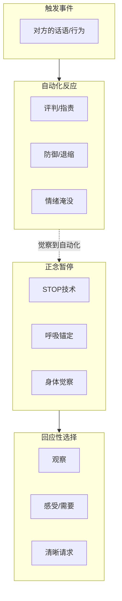
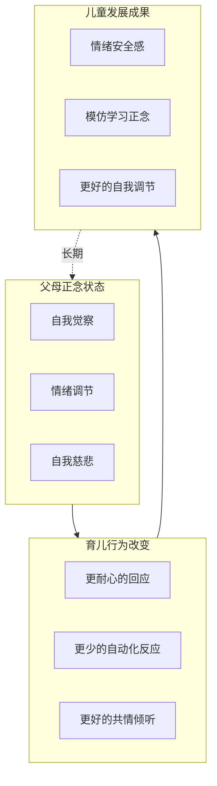
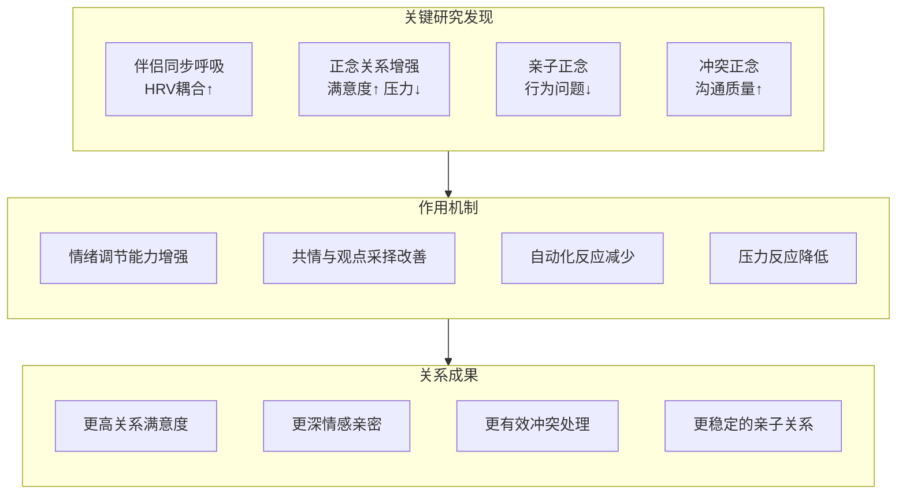

# 冥想与亲密关系

> 最后更新：2026-05

---

## 目录

1. [关系中的正念基础](#1-关系中的正念基础)
2. [伴侣同步冥想](#2-伴侣同步冥想)
3. [冲突调解中的正念](#3-冲突调解中的正念)
4. [家庭正念](#4-家庭正念)
5. [性亲密中的正念](#5-性亲密中的正念)
6. [关系结束的正念支持](#6-关系结束的正念支持)
7. [科学证据](#7-科学证据)
8. [参考资源](#8-参考资源)

---

## 1. 关系中的正念基础

### 1.1 非暴力沟通 (NVC) 与正念的整合

Marshall Rosenberg 的非暴力沟通与正念在核心原则上高度共鸣：

| NVC 要素 | 正念对应 | 整合练习 |
|:---|:---|:---|
| **观察 (Observation)** | 如实觉察，不加评判 | 冲突中先做3次呼吸，描述"我看到/听到..."而非"你总是..." |
| **感受 (Feeling)** | 身体觉察与情绪标记 | 情绪涌现时，扫描身体："愤怒在我的胸口是什么感觉？" |
| **需要 (Need)** | 深层觉察的意图 | 问自己："这个情绪背后，我真正需要什么？" |
| **请求 (Request)** | 清晰、当下的表达 | 以呼吸为锚，提出具体、可执行的请求 |

### 1.2 情绪调节在冲突中的作用

正念通过以下机制改善关系中的情绪调节：

| 调节层面 | 问题表现 | 正念介入 | 预期效果 |
|:---|:---|:---|:---|
| **前摄调节** | 带着累积压力进入互动 | 日常正念练习降低基线唤起水平 | 更稳定的情绪基线 |
| **在线调节** | 冲突中情绪升级失控 | 冲突中的呼吸锚定、暂时离开 | 打断情绪升级的恶性循环 |
| **后摄调节** | 事后反复反刍、怨恨累积 | 正念接纳与慈悲冥想 | 更快恢复，减少怨恨沉积 |

### 1.3 依恋理论与正念

| 依恋风格 | 核心恐惧 | 关系模式 | 适配的正念练习 |
|:---|:---|:---|:---|
| **安全型** | （低恐惧） | 舒适亲密，适度依赖 | 维持现有正念习惯 |
| **焦虑型** | 被抛弃 | 过度寻求确认、情绪化 | 身体锚定练习（减少焦虑的躯体反应）、自我慈悲冥想 |
| **回避型** | 被吞噬/控制 | 情感疏离、逃避亲密 | 渐进式亲密觉察、情感标记练习 |
| **恐惧型** | 被抛弃+被吞噬 | 矛盾行为、难以信任 | 稳定的基础正念+专业治疗支持 |

> **正念对不安全依恋的修复机制**：通过稳定的自我觉察，个体逐渐内化一个"在场的、不评判的内在观察者"，这可以作为一种"安全基地"的内化版本。

---

## 2. 伴侣同步冥想

### 2.1 同步呼吸 (Synchronized Breathing)

**练习步骤：**

| 步骤 | 动作 | 时长 |
|:---:|:---|:---:|
| 1 | 面对面坐或躺下，轻触（手牵手或手掌对心脏） | 1分钟 |
| 2 | 各自觉察自己的自然呼吸节奏，不强迫同步 | 2分钟 |
| 3 | 一人引导呼气/吸气的速度，另一人跟随 | 3分钟 |
| 4 | 交替引导角色 | 3分钟 |
| 5 | 尝试自然同步，不刻意控制，允许自发协调 | 3分钟 |
| 6 | 静默保持身体接触，感受连接 | 2分钟 |

**变式：**

| 变式名称 | 描述 | 适用情境 |
|:---|:---|:---|
| **背靠背呼吸** | 脊柱相触，感受对方呼吸的物理律动 | 对眼神接触感到不适的伴侣 |
| **远程同步** | 通过电话/视频，同时开始呼吸练习 | 异地伴侣的日常连接仪式 |
| **睡前同步** | 躺下后同步5次深呼吸，然后自然入睡 | 改善共同睡眠质量 |

### 2.2 凝视冥想 (Eye Gazing Meditation)

**核心练习：**

| 阶段 | 指导语 | 常见挑战 |
|:---|:---|:---|
| **准备** | 对坐，距离舒适，保持自然呼吸 | 尴尬、想笑、不安 |
| **柔和凝视** | 看对方的左眼或右眼，或双眼之间的空间；允许视线模糊 | 过度分析对方表情 |
| **放下叙事** | 当"他在想什么""我看起来怎样"的念头升起，标记"想法"并回到凝视 | 自我意识过强 |
| **敞开接收** | 允许任何感受浮现——爱、悲伤、烦躁、平静——不推开也不抓取 | 情绪涌现（可能哭泣） |
| **结束** | 缓慢眨眼，深呼吸，分享简短感受（可选） | 想说很多话或完全沉默 |

> **建议时长**：初学者2-3分钟，有经验者10-15分钟。每周1-2次。

### 2.3 伴侣瑜伽中的冥想维度

| 体式/练习 | 冥想要素 | 关系隐喻 |
|:---|:---|:---|
| **双人树式** | 互相支撑中的平衡觉察 | "我可以依赖你，同时保持自我中心" |
| ** seated 前屈+后弯** | 信任与放手的交替 | 关系中主动/接受的动态平衡 |
| **双人呼吸（Pranayama）** | 能量交换的觉察 | 关系是能量的双向流动 |
| **Savasana 双人放松** | 共同的存在，无需作为 | "在一起，什么都不做，就足够了" |

---

## 3. 冲突调解中的正念

### 3.1 STOP 技术在争吵中的应用

**STOP** 是可在冲突中实时应用的微型正念技术：

| 字母 | 行动 | 内在语言 | 时长 |
|:---:|:---|:---|:---:|
| **S** - Stop | 暂停口头和行为的反应 | "停" | 1秒 |
| **T** - Take a breath | 有意识的一次深呼吸 | "吸气...呼气..." | 3-5秒 |
| **O** - Observe | 觉察当下：身体感觉、情绪、念头 | "我注意到胸口发紧...愤怒...'这不公平'的想法" | 5-10秒 |
| **P** - Proceed | 有意识地选择下一步回应 | "我可以选择说什么" | 10-30秒 |

**使用时机：**

- 声音开始提高时
- 感到"情绪淹没"（心跳加速、脸红、声音发抖）
- 想要说伤人的话之前
- 对方说了触发你的话语之后

### 3.2 "正念暂停"协议

伴侣共同制定的冲突中暂停规则：

| 协议要素 | 具体内容 | 示例 |
|:---|:---|:---|
| **暂停信号** | 任何一方可发起的安全词/手势 | "我需要暂停" 或双手合十 |
| **暂停时长** | 最短20分钟（生理唤醒消退所需时间） | 20分钟到24小时 |
| **暂停期间做什么** | 正念活动（散步、呼吸、淋浴），而非反刍 | "我去做10分钟呼吸练习" |
| **恢复方式** | 谁发起恢复、如何恢复 | "我会回来找你，我们先同步三次呼吸再开始" |
| **禁止事项** | 暂停期间不可做的事 | 不可喝酒发泄、不可在社交媒体抱怨、不可找朋友单方面诉说 |

### 3.3 修复对话的冥想引导

冲突后的修复对话结构：

| 步骤 | 引导语/问题 | 正念基础 |
|:---|:---|:---|
| **1. 共同着陆** | "让我们先一起呼吸三次" | 共享的当下 |
| **2. 轮流讲述** | "我想听听你的版本，我会只听不说" | 深度倾听（放下自己的辩护） |
| **3. 验证对方** | "我听到你说...我理解这对你的意义是..." | 放下"正确"的需求 |
| **4. 认领责任** | "我的贡献是..." | 觉察自己的防御与自我欺骗 |
| **5. 表达需要** | "我需要的是..." | 从指责转向脆弱 |
| **6. 共同意图** | "我们共同希望的是..." | 从"我对抗你"到"我们面对问题" |
| **7. 结束仪式** | 握手、拥抱、或再次共同呼吸 | 身体层面的重新连接 |

---

## 4. 家庭正念

### 4.1 亲子正念游戏

| 年龄段 | 游戏名称 | 玩法 | 培养的能力 |
|:---|:---|:---|:---|
| 3-5岁 | **呼吸 buddy** | 将毛绒玩具放在肚子上，观察它随呼吸起伏 | 呼吸觉察、身体连接 |
| 5-8岁 | **正念倾听游戏** | 闭上眼睛，辨认房间里的所有声音 | 听觉觉察、专注力 |
| 6-10岁 | **情绪天气报告** | 每天分享"今天我的情绪天气是..." | 情绪标记、表达 |
| 8-12岁 | **正念品尝** | 用5分钟吃一颗葡萄干（或巧克力） | 感官觉察、放慢 |
| 全年龄 | **共同行走** | 一起慢走，关注脚步、呼吸、周围 | 共同当下、连接 |

### 4.2 家庭晚餐正念仪式

| 仪式元素 | 具体做法 | 时长 | 意义 |
|:---|:---|:---:|:---|
| **感恩时刻** | 轮流分享"今天我想感谢的一件事" | 2-3分钟 | 培养积极关注 |
| **第一口正念** | 所有人闭眼吃第一口食物，觉察味道质地 | 1分钟 | 共同放慢 |
| **无设备约定** | 餐桌上没有手机/平板/电视 | 全程 | 保护共同注意力空间 |
| **情绪检查** | 轮流用1-3个词描述今天的心情 | 2分钟 | 情感连接习惯 |
| **结束呼吸** | 晚餐结束前一起三次深呼吸 | 30秒 | 仪式感与过渡 |

### 4.3 正念育儿：从怀孕到青春期

| 阶段 | 核心挑战 | 正念应用 | 具体练习 |
|:---|:---|:---|:---|
| **孕期** | 焦虑、身体不适、身份转变 | 与胎儿连接、接纳身体变化 | 孕期身体扫描、与宝宝对话冥想 |
| **0-2岁（婴幼儿）** | 睡眠剥夺、情绪耗竭 | 在碎片化时间恢复、对婴儿的当下回应 | "哺乳冥想"、抱宝宝时的呼吸觉察 |
| **3-6岁（学龄前）** | 精力旺盛、边界测试 | 情绪调节示范、共同游戏 | 亲子瑜伽、情绪天气游戏 |
| **7-12岁（学龄期）** | 学业压力、社交挑战 | 教授基础正念工具 | 睡前身体扫描、考试前呼吸练习 |
| **13-18岁（青春期）** | 独立需求、情绪波动、风险行为 | 尊重空间、提供选择、示范而非说教 | 提供正念App、分享而非指导 |

---

## 5. 性亲密中的正念

### 5.1 受密宗启发的正念性行为

> **说明**：此处提取的是密宗传统中与正念科学相容的要素，剥离宗教框架，聚焦于身体觉察与连接。

| 密宗要素 | 正念转化 | 练习方法 |
|:---|:---|:---|
| **呼吸同步** | 性活动中的呼吸觉察与协调 | 开始前的三次共同深呼吸；过程中的呼吸觉察 |
| **目光连接** | 眼神凝视中的当下感 | 非评判地注视伴侣的眼睛 |
| **感官扩展** | 超越生殖器中心的全身体觉察 | 身体扫描式的触碰——觉察全身皮肤的感受 |
| **能量觉察** | 将性兴奋感受为全身能量流动 | 觉察兴奋从骨盆向全身的扩散 |
| **慢下来** | 放慢节奏以增加觉察 | 将通常10分钟的活动延长到有意识的一小时 |
| **意图设定** | 以连接而非高潮为目的 | 开始前的静默意图："今天我选择全然在场" |

### 5.2 身体觉察与性满意度

| 觉察维度 | 常见问题 | 正念介入 | 预期效果 |
|:---|:---|:---|:---|
| **身体形象** | 对自己的身体感到羞耻/焦虑 | 日常身体扫描，培养对身体的接纳 | 减少性活动中的自我监控 |
| **感受觉察** | 难以识别和表达喜好 | "正念探索"——有意识地觉察什么触感带来愉悦 | 更清晰的性沟通 |
| **情绪连接** | 性行为机械化、情感疏离 | 开始前的情感检查："我今天感觉怎样？我想怎样连接？" | 更深的情感亲密 |
| **存在感** | 性活动中思绪游离 | 将注意力带回呼吸或身体感受的锚点 | 更集中的愉悦体验 |

### 5.3 表现焦虑的冥想应对

| 焦虑类型 | 表现 | 冥想应对策略 |
|:---|:---|:---|
| **勃起焦虑** | 过度关注表现导致功能恶化 | "放下目标"冥想——将焦点从"硬/湿"转移到"感受"；认知解离"我有一个'我不行'的想法" |
| **高潮焦虑** | 过度追求或害怕高潮 | 过程导向的意图设定："我不以高潮为目的，我以连接为目的" |
| **身体羞耻** | 因身体形象而回避亲密 | 镜子冥想——裸体面对镜子，对每一部分说"我接纳你" |
| **比较焦虑** | 与前任/色情/文化标准比较 | "回到当下"——觉察比较的念头，标记它，回到当下的真实体验 |
| **创伤触发** | 过去的性创伤在亲密中重现 | 创伤知情正念（需专业支持）；建立安全词与完全停止权 |

---

## 6. 关系结束的正念支持

### 6.1 离婚/分手冥想

| 阶段 | 核心任务 | 正念练习 | 注意事项 |
|:---|:---|:---|:---|
| **决定期** | 分辨"暂时困难"vs"不可调和" | 决策冥想：分别观想"留下"和"离开"的未来，觉察身体的真实反应 | 避免将冥想用于逃避决策 |
| **宣告期** | 以最小的伤害传达决定 | 慈悲冥想——对对方培养善意，即使要分离 | 诚实且温和 |
| **分离期** | 处理丧失、孤独、身份重构 | 哀伤冥想：每天设定时间专门感受悲伤，不推开 | 哀伤有其节奏，不可强求"快速放下" |
| **重构期** | 建立独立身份与新生活 | 价值观澄清冥想："我是谁，独立于我曾经的角色？" | 探索而非急于进入新关系 |

### 6.2 共同育儿中的正念

| 挑战 | 正念回应 | 具体策略 |
|:---|:---|:---|
| **对前任的愤怒** | 将愤怒作为需要觉察的对象，而非行动指令 | "愤怒时的STOP"；为孩子利益设定意图 |
| **育儿风格冲突** | 觉察自己的控制需求，区分"原则"与"偏好" | 每周简短正念沟通——只讨论孩子的需要 |
| **交接时刻的紧张** | 将交接视为正念练习场 | 交接前各做5分钟呼吸；简短、礼貌、以孩子为中心 |
| **在孩子面前说对方坏话的冲动** | 觉察冲动，选择不行动 | "三把火"规则：愤怒时不说、不写、不决定 |

### 6.3 从怨恨到放下

**RAIN 技术在关系结束中的应用：**

| 字母 | 行动 | 在关系结束中的具体应用 |
|:---:|:---|:---|
| **R** - Recognize | 识别 | "我识别到我有怨恨" |
| **A** - Allow | 允许 | "我允许这个怨恨存在，不评判自己" |
| **I** - Investigate | 探究 | "这个怨恨想保护我什么？它指向什么未满足的需要？" |
| **N** - Nurture/Non-identification | 滋养/不认同 | "我给予自己慈悲；这个怨恨是我正在经历的，但不是我的全部" |

> **时间线**：重大关系的"放下"通常需要1-2年或更久。正念不加速这个过程，但帮助个体更完整地经历它，减少二次伤害。

---

## 7. 科学证据

### 7.1 伴侣同步呼吸对 HRV 耦合的影响

| 研究 | 设计 | 主要发现 |
|:---|:---|:---|
| Helm et al. (2013) | 伴侣同步呼吸 vs 非同步 | 同步呼吸增加心率变异性（HRV）耦合，反映自主神经系统的相互调节 |
| Goldstein et al. (2017) | 情侣疼痛共情实验 | 伴侣间的呼吸同步与疼痛缓解相关；同步程度高的伴侣，被试报告疼痛减轻更多 |
| Comer et al. (2019) | 日常同步呼吸干预 | 每日5分钟同步呼吸，4周后关系满意度显著提升 |

### 7.2 正念关系教育 RCT 研究

| 研究 | 干预 | 样本 | 主要结果 |
|:---|:---|:---|:---|
| Carson et al. (2004) | Mindfulness-Based Relationship Enhancement (MBRE) | 44对已婚伴侣 | 关系满意度↑、自主性↑、压力↓、乐观↑ |
| Barnes et al. (2007) | 8周正念训练 | 预备婚姻情侣 | 关系和谐度↑、压力荷尔蒙（皮质醇）↓ |
| Wachs & Cordova (2007) | 正念沟通训练 | 冲突中的伴侣 | 情绪调节改善、沟通质量↑ |
| Pruitt & McCollum (2010) | 夫妻正念 retreats | 关系困扰伴侣 | 关系满意度显著提升，效果持续至随访 |

### 7.3 亲子正念对行为问题的效果

| 研究 | 对象 | 干预 | 结果 |
|:---|:---|:---|:---|
| Singh et al. (2007) | ADHD 儿童家长 | 正念育儿训练 | 儿童攻击行为↓、顺从行为↑、家长满意度↑ |
| Bögels et al. (2010) | 青少年及其家长 | 家庭正念训练 | 青少年焦虑/抑郁↓、家庭功能↑ |
| Coatsworth et al. (2010) | 有风险行为青少年家长 | 正念育儿干预 | 家长报告更好的育儿质量、青少年物质使用↓ |

---

## 8. 参考资源

### 核心书籍

1. Rosenberg, M. (2003). *Nonviolent Communication: A Language of Life*. PuddleDancer Press.
2. Welwood, J. (2006). *Perfect Love, Imperfect Relationships*. Trumpeter.
3. McCollum, E. E., & Gehart, D. R. (2010). *Mindfulness for Relationship Success*. Independently published.
4. Siegel, D. J., & Hartzell, M. (2003). *Parenting from the Inside Out*. TarcherPerigee.
5. Kabat-Zinn, M., & Kabat-Zinn, J. (2014). *Everyday Blessings: The Inner Work of Mindful Parenting*. Hachette Books.

### 学术资源

- Carson, J. W., et al. (2004). "Mindfulness-based relationship enhancement." *Behavior Therapy*, 35(3), 471-494.
- Wachs, K., & Cordova, J. V. (2007). "Mindful relating: Exploring mindfulness and emotion repertoires in intimate relationships." *Journal of Marital and Family Therapy*, 33(4), 464-481.

### 实践项目

| 项目 | 内容 | 链接/获取方式 |
|:---|:---|:---|
| Mindful Schools | 学校正念教育 + 家庭资源 | mindfulschools.org |
| Mindful Couples | 伴侣正念线上课程 | 多种平台 |
| Search Inside Yourself (Google) | 职场正念 + 关系应用 | siyli.org |

---

> **跨领域标签**: `#亲密关系` `#正念沟通` `#非暴力沟通` `#伴侣治疗` `#家庭正念` `#亲子教育` `#情绪调节` `#依恋理论`
