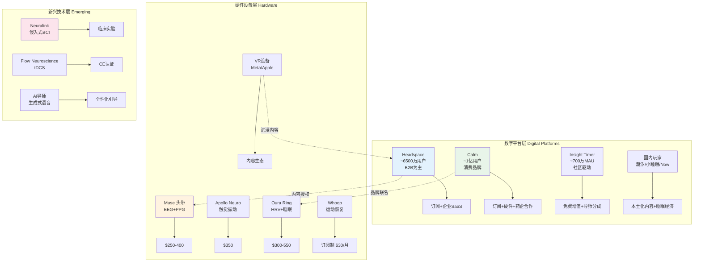
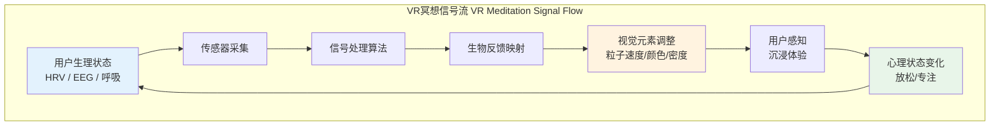
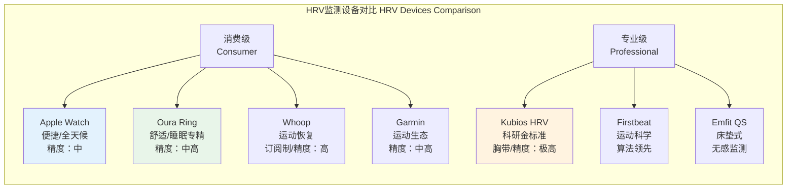
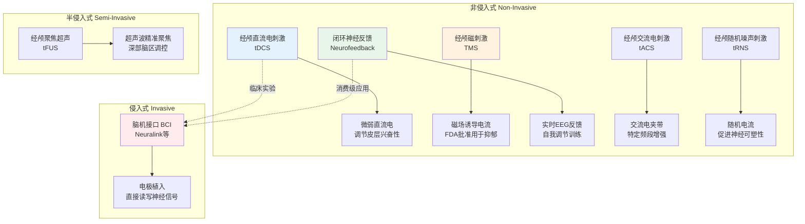
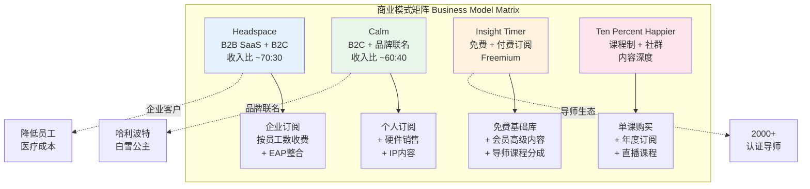
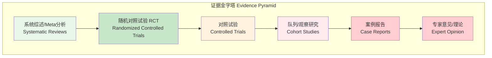
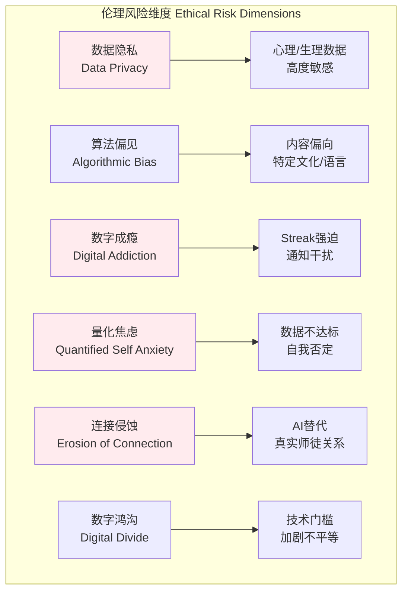
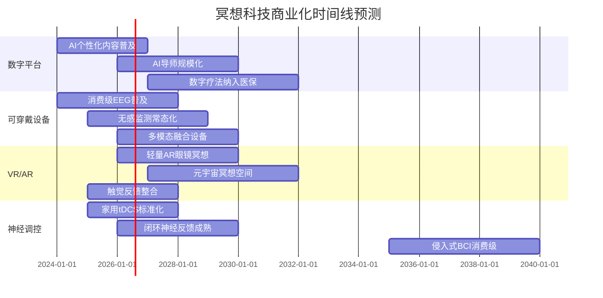
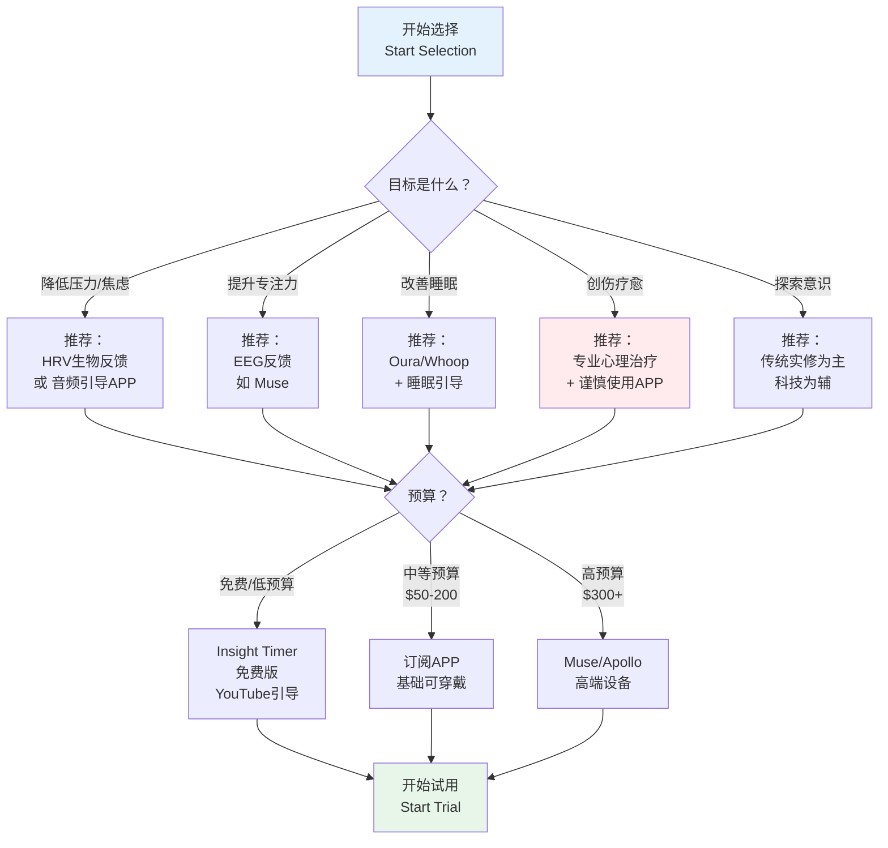
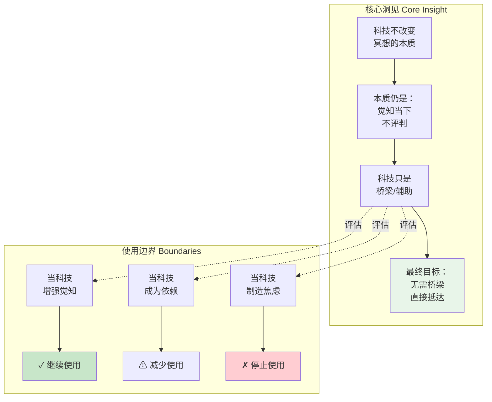

# 冥想与科技专业概述：从生物反馈到脑机接口

> **适用对象**：冥想行业从业者、数字健康产品经理、神经科学研究者、科技冥想练习者
> **阅读时长**：约 50–70 分钟（可分段阅读）
> **最后更新**：2026-05

---

## 一、行业概览：冥想科技市场的爆发与分化

### 1.1 全球市场规模与增长曲线

冥想科技（Meditation Technology / Mindfulness Tech）是数字健康（Digital Health）领域增长最快的细分赛道之一。根据多家市场研究机构的综合数据：

| 指标 | 2023年 | 2024年（估算） | 2030年（预测） | 年均复合增长率 CAGR |
|------|--------|---------------|---------------|---------------------|
| **全球冥想APP市场规模** | ~65 亿美元 | ~78 亿美元 | ~220–270 亿美元 | 18–22% |
| **可穿戴冥想设备市场** | ~12 亿美元 | ~16 亿美元 | ~55–70 亿美元 | 22–25% |
| **VR/AR 冥想市场** | ~3.5 亿美元 | ~5 亿美元 | ~25–35 亿美元 | 30–35% |
| **BCI 神经调控（消费级）** | ~0.8 亿美元 | ~1.2 亿美元 | ~15–20 亿美元 | 50%+ |
| **企业正念福利市场** | ~18 亿美元 | ~22 亿美元 | ~60–80 亿美元 | 18–20% |

**关键驱动因素**：
- 全球焦虑/抑郁患病率持续攀升（WHO 2023：全球约 3.8% 人口受抑郁影响，焦虑约 4%）
- 后疫情时代远程工作常态化，员工心理健康福利需求激增
- 可穿戴设备普及率提升（全球智能手表/手环用户 2024 年超 5 亿）
- 生成式 AI（Generative AI）降低个性化内容生产成本
- 制药巨头入场：Calm 与辉瑞（Pfizer）合作开发"数字疗法+药物"整合方案

### 1.2 主要玩家与竞争格局



**竞争格局分析**：

| 公司/产品 | 核心模式 | 优势 | 风险点 |
|-----------|---------|------|--------|
| **Headspace** | B2B 企业福利为主（~70%收入） | 临床验证丰富、FDA数字疗法路径 | 消费端增长放缓、品牌老化 |
| **Calm** | 消费品牌为主、跨界联名 | 品牌认知度最高、内容IP化（哈利波特等） | 企业端渗透不足、盈利压力大 |
| **Insight Timer** | 免费+社区+导师生态 | 用户粘性极高、内容库最大（20万+引导） | 变现能力弱、导师质量参差 |
| **Muse (Interaxon)** | EEG 硬件+内容订阅 | 科研级信号质量、论文发表多 | 价格门槛高、使用场景受限 |
| **Apollo Neuro** | 触觉振动神经调节 | 无创便携、循证基础较好 | 效果个体差异大、长期数据不足 |

### 1.3 投资趋势与资本市场

| 时间 | 关键事件 | 意义 |
|------|---------|------|
| 2019 | Calm 估值 10 亿美元（独角兽） | 冥想科技首次进入独角兽俱乐部 |
| 2020 | Headspace 与 Ginger 合并为 Headspace Health | 整合冥想+心理治疗，估值 30 亿美元 |
| 2022 | 冥想APP市场首次出现饱和信号 | 用户增长放缓，行业进入整合期 |
| 2023 | Calm 裁员 20%、Headspace 裁员 15% | 高估值难以为继，盈利优先 |
| 2024 | AI 冥想工具融资激增（如 Breathhh、Wonder） | 生成式AI成为新增长点 |
| 2024-2025 | 制药+数字疗法合作加速 | 从"健康应用"向"准医疗"升级 |

**投资逻辑转变**：
- 从「用户增长」转向「临床验证」—— 投资者要求看到 RCT（随机对照试验）证据
- 从「单一APP」转向「平台生态」—— 硬件+内容+服务的闭环
- 从「替代疗法」转向「医疗整合」—— FDA/NMPA 数字疗法审批路径

### 1.4 与传统冥想的互补关系

```mermaid
graph LR
    subgraph 传统冥想 Traditional Meditation
        T1[实修传承<br/>师徒关系] --> T2[身心转化<br/>深层意识工作]
        T2 --> T3[社群支持<br/>Sangha/僧团]
        T3 --> T4[伦理根基<br/>戒定慧体系]
    end

    subgraph 科技冥想 Tech-Enhanced
        S1[可及性<br/>降低入门门槛] --> S2[数据反馈<br/>量化进度]
        S2 --> S3[个性化<br/>AI适配] --> S4[规模化<br/>低成本传播]
    end

    subgraph 整合模式 Integration
        I1[科技作为<br/>"辅助工具"] --> I2[数据帮助<br/>觉察模式]
        I2 --> I3[但不替代<br/>内在觉知]
        I3 --> I4[最终目标：<br/>无需工具的<br/>自在冥想]
    end

    T2 -.->|科技无法替代| I3
    S1 -.->|扩大覆盖面| T1
    S2 -.->|支持| I2

    style T2 fill:#e8f5e9
    style S1 fill:#e3f2fd
    style I3 fill:#fff3e0
```

**核心共识**：
- 科技冥想是**入口**，不是**终点**—— 帮助初学者建立习惯，但深度转化仍需传统实修
- 数据反馈可以**加速觉察**，但过度依赖数据会制造新的执着
- "数字极简"（Digital Minimalism）原则正在冥想科技领域兴起

---

## 二、五大技术类别：深度解析

### 2.1 VR/AR 冥想：沉浸式环境革命

#### 技术原理与分类

| 技术类型 | 沉浸程度 | 设备要求 | 代表产品 | 核心机制 |
|---------|---------|---------|---------|---------|
| **VR 完全沉浸** | 高（隔绝现实） | VR头显 | TRIPP、Guided Meditation VR | 视觉-前庭隔离 + 环境控制 |
| **AR 增强叠加** | 中（与现实共存） | AR眼镜/手机 | Healium、Lumenate | 虚拟元素叠加于现实空间 |
| **混合现实 MR** | 中高 | MR头显（Vision Pro等） | 开发中 | 虚实融合、手势交互 |
| **全景视频** | 中低 | 手机/平板 | 360° 自然场景APP | 视觉沉浸、音频引导 |

#### 代表产品深度分析

| 产品 | 开发商 | 核心特色 | 循证状态 | 价格 |
|------|--------|---------|---------|------|
| **TRIPP** | TRIPP Inc. | 粒子视觉+呼吸同步+生物反馈 | 多项RCT进行中 | $5-15/月 |
| **Guided Meditation VR** | Cubicle Ninjas | 多场景虚拟环境+引导语音 | 用户研究为主 | 一次性$15 |
| **Oxford VR** (now Oxford VR / OVR) | 牛津大学衍生 | 临床级VR心理治疗 | NHS试点 | B2B |
| **Healium** | StoryUP | AR/VR + 可穿戴生物反馈 | 退伍军人研究 | $30/月 |
| **Lumenate** | Lumenate Ltd | 手机闪光灯诱发闭眼光幻视 | 早期研究 | 免费+Pro |

**VR 冥想的优势**：
- **感官隔离**：减少环境干扰，对于注意力缺陷者特别有效
- **可控环境**：可以精确控制光线、声音、场景元素
- **生物反馈可视化**：将 HRV/EEG 数据转化为视觉元素（如粒子流动速度）
- **暴露疗法整合**：在安全环境中处理焦虑触发物

**VR 冥想的局限与风险**：

| 风险类型 | 具体表现 | 严重程度 | 应对策略 |
|---------|---------|---------|---------|
| **VR晕动症** | 前庭-视觉冲突导致恶心、头晕 | 中 | 限制单次时长<20分钟；固定参考点 |
| **解离风险** | 过度沉浸导致现实感丧失 | 中-高 | 避免创伤人群使用完全沉浸；设置现实锚点 |
| **眼部疲劳** | 长时间注视近处屏幕 | 低-中 | 20-20-20法则；限制时长 |
| **社交隔离** | 替代真实人际互动 | 中 | 设计社交VR冥想空间 |
| **设备门槛** | 价格、空间、 setup 复杂度 | 中 | 发展中端设备（如 Quest 3） |



---

### 2.2 AI 语音引导：生成式AI重塑内容生产

#### 技术架构与应用层级

| 应用层级 | 技术实现 | 功能描述 | 代表产品/功能 |
|---------|---------|---------|--------------|
| **L1：智能推荐** | 协同过滤 + 内容标签 | 基于用户历史推荐内容 | Headspace "Today"、Calm "Daily" |
| **L2：动态调整** | 规则引擎 + 生理数据 | 根据HRV/呼吸调整引导节奏 | Muse "实时反馈" |
| **L3：生成式内容** | LLM + TTS 语音合成 | 实时生成个性化引导词 | Breathhh、Wonder |
| **L4：情感化交互** | 多模态AI + 情感计算 | 识别情绪状态并响应 | 实验性产品 |
| **L5：AI导师** | Agent架构 + 长期记忆 | 持续陪伴、深度学习用户 | 概念阶段 |

#### 生成式AI在冥想中的具体应用

**1. 个性化引导词生成**
- 输入：用户当前状态（压力水平、时间、目标、偏好）
- 处理：LLM 生成定制化脚本
- 输出：TTS 语音合成 + 背景音效混合
- 优势：无限内容组合、高度个性化
- 风险：AI 幻觉（Hallucination）可能生成不恰当的引导指令

**2. 语音合成情感化**
- 技术：神经语音合成（Neural TTS）+ 情感控制
- 参数：语速、音调、停顿、气息声
- 前沿：ElevenLabs、Microsoft Azure Speech 支持情感标记
- 应用：AI "禅师" 声音可以模拟平静、温暖、权威等特质

**3. 主要玩家动态**

| 公司 | AI功能 | 技术路线 | 状态 |
|------|--------|---------|------|
| **Calm** | "Calm AI" 个性化推荐 | 推荐算法 + 有限生成 | 2024上线 |
| **Headspace** | 智能内容匹配 | 机器学习推荐 | 成熟 |
| **Breathhh** | Chrome插件+AI呼吸提醒 | 浏览器活动监测+LLM | 活跃 |
| **Wonder** | AI生成冥想引导 | GPT-4 + TTS | 初创 |
| **Endel** | AI生成功能性音乐 | 神经科学算法+生成音频 | 成熟 |

#### 风险矩阵：AI冥想的潜在问题

| 风险 | 描述 | 发生概率 | 影响程度 |  mitigation |
|------|------|---------|---------|-------------|
| **AI幻觉** | 生成错误/有害的冥想指令（如不安全的呼吸控制） | 中 | 高 | 人工审核+医学顾问+用户举报 |
| **情感虚假性** | 用户与AI建立虚假的情感连接，替代真实人际支持 | 中 | 高 | 明确AI身份披露；鼓励社群参与 |
| **算法偏见** | 训练数据偏向特定文化/语言，忽视多元冥想传统 | 高 | 中 | 多元化数据集；文化顾问 |
| **数据滥用** | 语音数据、心理状态数据被商业化利用 | 中 | 高 | 严格隐私政策；本地化处理 |
| **效果夸大** | 营销声称AI冥想"超越人类导师" | 高 | 中 | 循证营销；监管合规 |

---

### 2.3 可穿戴生物反馈：量化冥想的身体信号

#### 技术参数全景表

| 生理信号 | 测量技术 | 核心指标 | 代表设备 | 冥想相关性 | 证据等级 |
|---------|---------|---------|---------|-----------|---------|
| **HRV** | PPG 光电容积脉搏波 | RMSSD, LF/HF, SDNN | Apple Watch, Whoop, Oura, Polar | ★★★★★ 直接反映自主神经平衡 | A（强） |
| **EEG** | 干电极/湿电极脑电 | α波, θ波, γ波, 频段功率 | Muse, Neurosky, Emotiv | ★★★★★ 直接测量脑状态 | A-B（中-强） |
| **GSR/EDA** | 皮肤电导 | 皮肤电反应幅度、频率 | Empatica E4, Microsoft Band（已停产） | ★★★☆☆ 反映交感神经唤醒 | B（中） |
| **体温** | 热敏电阻/红外 | 皮肤温度变化 | Oura, CORE | ★★☆☆☆ 间接指标 | C（弱） |
| **呼吸** | 加速度计/胸带 | 频率、深度、节律 | Spire, Apple Watch | ★★★★☆ 冥想核心锚点 | A（强） |
| **血氧** | 红外光谱 | SpO₂ | Apple Watch, Garmin | ★★☆☆☆ 特定呼吸法监测 | B（中） |
| **运动/姿态** | IMU 惯性测量 | 静止度、姿态变化 | 多数智能手表 | ★★★☆☆ 辅助判断坐姿 | B（中） |

#### HRV 监测设备深度对比



| 设备 | HRV算法 | 采样频率 | 冥想专用功能 | 价格 | 数据导出 | 科研引用 |
|------|--------|---------|-------------|------|---------|---------|
| **Apple Watch** | Apple 自研 | 间歇性 | Breathe App | $400-800 | HealthKit | 少 |
| **Oura Ring Gen3** | 夜间连续HRV | 250Hz | 无专用 | $300-550 | API | 多 |
| **Whoop 4.0** | 连续监测 | 100Hz | 恢复评分 | $30/月 | 有限 | 多 |
| **Muse 2/S** | 实时HRV+EEG | 500Hz | 风声音反馈 | $250-400 | 订阅导出 | 极多 |
| **Kubios** | 科研级分析 | 1000Hz | 无 | $300-2000/年 | 完整 | 金标准 |

#### EEG 脑电设备对比

| 设备 | 电极数 | 佩戴方式 | 频段覆盖 | 冥想应用 | 价格 | 证据质量 |
|------|--------|---------|---------|---------|------|---------|
| **Muse 2** | 4通道（前额+耳后） | 头带 | δ-γ | 风声音反馈、鸟叫声奖励 | $250 | 多篇同行评审论文 |
| **Muse S** | 4通道 + PPG | 头带 | δ-γ | 睡眠跟踪+冥想 | $350 | 同Muse 2 |
| **Neurosky MindWave** | 1通道（前额） | 头带 | δ-β | 专注/放松指数 | $100 | 早期研究多 |
| **Emotiv Epoc X** | 14通道 | 头带+盐水 | δ-γ | 研究级 | $850 | 科研常用 |
| **Emotiv Insight** | 5通道 | 头带 | δ-γ | 消费级研究 | $300 | 中等 |
| **OpenBCI** | 8-16通道（可扩展） | 帽/头带 | 全频段 | DIY/研究 | $500-2000 | 取决于配置 |

**Muse 头带的科学验证**：

Muse 是目前科研引用最多的消费级 EEG 冥想设备。多项独立研究评估了其信号质量：

| 研究 | 发表年份 | 核心发现 | 局限性 |
|------|---------|---------|--------|
| Krigolson et al. | 2017 | Muse EEG 与科研级设备相关性 r=0.85+ | 仅前额区域 |
| Barham et al. | 2022 | Muse 可可靠检测 α 波增强（冥想状态标志） | 噪声环境下精度下降 |
| Díaz et al. | 2023 | Muse 引导的冥想训练 4 周后 HRV 显著改善 | 样本量较小（n=40） |

**关键洞察**：消费级 EEG 设备的**相对变化**（session-to-session）比**绝对值**更可靠。适合追踪个人趋势，不适合临床诊断。

---

### 2.4 脑机接口与神经调控：前沿与边界

#### 技术分类图谱



#### 各项技术深度解析

**经颅直流电刺激（tDCS）**

| 参数 | 说明 |
|------|------|
| **原理** | 1-2 mA 微弱直流电通过头皮电极，调节神经元静息膜电位 |
| **靶向区域** | 背外侧前额叶（DLPFC）—— 与注意力、工作记忆相关；顶叶—— 与自我意识相关 |
| **冥想相关研究** | 早期探索：tDCS 辅助是否加速冥想技能习得（尚无定论） |
| **代表产品** | Flow Neuroscience（CE认证，用于抑郁）、The Brain Driver（DIY设备） |
| **安全性** | 总体安全，但可能出现头痛、皮肤刺激；癫痫患者禁忌 |
| **证据等级** | C（弱）—— 冥想+tDCS 的专项研究极少 |

**经颅磁刺激（TMS）**

| 参数 | 说明 |
|------|------|
| **原理** | 强磁场脉冲诱导皮层电流，可兴奋或抑制特定脑区 |
| **临床状态** | FDA 批准用于难治性抑郁、强迫症、戒烟；深部 TMS 用于焦虑 |
| **与冥想关系** | 间接：TMS 治疗抑郁后患者更易建立冥想习惯；直接研究稀缺 |
| **成本** | 单次 $200-400；疗程 $10,000-15,000 |
| **可及性** | 仅医疗机构，非家用 |

**闭环神经反馈（Closed-Loop Neurofeedback）**

| 参数 | 说明 |
|------|------|
| **原理** | 实时监测 EEG 信号，当目标频段（如 α 波、γ 波）出现时给予反馈 |
| **传统模式** | 开环：用户看到脑波数据，自主调节 |
| **闭环模式** | 系统实时检测状态，自动调整刺激参数或内容 |
| **冥想应用** | 当检测到注意力分散时，自动加强引导音频的提示性 |
| **前沿产品** | Neurosity Crown（可穿戴EEG+API）、BitBrain（研究级） |
| **证据** | B（中）—— 神经反馈对 ADHD 有证据，对冥想的增效作用仍在研究中 |

**脑机接口 BCI（Neuralink 等）**

| 维度 | 现状 |
|------|------|
| **技术成熟度** | 早期临床阶段；Neuralink 2024年首次人体植入 |
| **冥想相关** | 纯概念阶段；理论上未来可：直接读取冥想深度、精准调控意识状态 |
| **时间线预测** | 医疗应用（运动控制）：2028-2030；消费级增强：2035+；冥想专用：未知 |
| **伦理关切** | 极大—— 思想隐私、神经数据主权、认知增强公平性 |

---

### 2.5 数字平台与APP生态：商业模式深度拆解

#### 四大平台商业模式对比



| 维度 | Headspace | Calm | Insight Timer | Ten Percent Happier |
|------|-----------|------|---------------|---------------------|
| **订阅价格/年** | $69.99 | $69.99 | $59.99（可选） | $99.99 |
| **免费内容** | 基础引导（有限） | 少量场景 | 海量（20,000+引导） | 少量试听 |
| **内容库规模** | 1,000+ | 2,000+ | 200,000+（含用户上传） | 500+（精品深度） |
| **核心差异化** | 临床验证、企业端 | 品牌、IP联名、睡眠 | 社区、免费、导师生态 | 深度课程、大师讲座 |
| **B2B业务** | 强（Fortune 500客户） | 弱（起步中） | 无 | 无 |
| **科研合作** | 强（70+研究） | 中 | 弱 | 中 |
| **AI应用** | 推荐算法 | Calm AI | 无显著AI | 无显著AI |
| **数据隐私** | 企业级合规 | 标准合规 | 导师/用户数据风险 | 标准合规 |

#### 订阅制 vs 免费增值（Freemium）

| 模式 | 优势 | 劣势 | 代表 | 适用场景 |
|------|------|------|------|---------|
| **纯订阅制** | 收入稳定、用户质量高、无广告 | 获客成本高、转化漏斗窄 | Headspace、Calm | 品牌力强、内容精品化 |
| **免费增值** | 用户基数大、病毒传播、长尾变现 | 变现率低、免费用户成本高 | Insight Timer、小睡眠 | 社区驱动、导师生态 |
| **单次购买** | 无持续付费压力、用户满意度高 | 无持续收入、更新动力弱 | 部分独立APP | 工具型产品 |
| **企业SaaS** | 客单价高、合同期长 | 销售周期长、定制成本高 | Headspace Health | B2B市场 |

#### 社交功能与数据隐私

| 功能 | 描述 | 隐私风险 | 缓解措施 |
|------|------|---------|---------|
| **冥想 streak/连续记录** | 游戏化激励 | 低 | 本地存储可选 |
| **好友排行榜** | 社交比较 | 中 | 可选关闭 |
| **社群讨论** | 用户互助 | 中 | 内容审核 |
| **导师互动** | 问答、直播 | 中-高 | 实名认证、举报机制 |
| **生理数据上传** | HRV/EEG云端分析 | 高 | 端到端加密、本地处理 |
| **情绪追踪** | 每日情绪记录 | 高 | 匿名化处理、数据最小化 |

**关键数据隐私问题**：
- 冥想APP收集的心理状态数据属于**敏感个人数据**（GDPR/PIPL 定义）
- 2023年 Mozilla 基金会报告：多数冥想APP隐私政策评级为"差"
- Calm 2023年因数据共享实践遭 FTC 调查
- 建议：优先选择支持**本地处理**、**端到端加密**、**数据导出**功能的产品

---

## 三、科学验证现状：循证与噱头的分界线

### 3.1 证据金字塔：冥想科技工具评估



### 3.2 主要工具的科学证据评级

| 技术/产品 | 研究数量 | 最高证据等级 | 核心发现 | 效果量 Effect Size | 证据质量评级 |
|-----------|---------|-------------|---------|-------------------|-------------|
| **正念冥想APP（通用）** | 200+ | Meta分析 | 对压力、焦虑有中小效应 | d=0.3-0.5 | **A-** |
| **Muse EEG反馈** | 15+ | RCT | EEG反馈可提升初学者注意力集中度 | d=0.4-0.6 | **B+** |
| **HRV生物反馈** | 50+ | Meta分析 | 对焦虑、PTSD有中等效应 | d=0.5-0.7 | **A-** |
| **VR冥想** | 20+ | RCT | 对急性焦虑、疼痛管理有效 | d=0.5-0.8 | **B+** |
| **Apollo Neuro（触觉）** | 5+ | 对照试验 | HRV改善、主观压力下降 | d=0.3-0.5 | **C+** |
| **tDCS + 冥想** | <5 | 探索性 | 初步信号，无定论 | 未知 | **D** |
| **AI生成冥想** | <3 | 无RCT | 无独立验证 | 未知 | **D** |
| **纯音频APP（无反馈）** | 100+ | Meta分析 | 效果与传统引导相当 | d=0.3-0.5 | **B+** |

### 3.3 安慰剂效应 vs 真实效应

| 因素 | 安慰剂成分 | 真实效应成分 | 区分方法 |
|------|-----------|-------------|---------|
| **环境期待** | 使用"高科技"设备本身的期待感 | 技术确实改善了反馈精度 | 主动 vs 假刺激对照（sham control） |
| **仪式效应** | 佩戴设备/打开APP的仪式感 | 生理信号确实改变 | 对照组使用无功能设备 |
| **关注效应** | 因为被监测而更加专注 | 生物反馈帮助建立正确模式 | 比较反馈组 vs 仅监测组 |
| **时间投入** | 任何结构化练习都有益 | 技术加速学习曲线 | 剂量-反应关系分析 |

**关键结论**：
- 对于**HRV生物反馈**和**EEG神经反馈**：有合理的机制解释和RCT支持，真实效应 > 安慰剂效应
- 对于**VR冥想**：沉浸感确实增强急性放松效果，但长期效果是否优于传统方法证据不足
- 对于**tDCS/TMS + 冥想**：目前多为概念验证，缺乏高质量RCT
- 对于**AI生成内容**：尚无独立验证其效果是否优于人工编写内容

### 3.4 营销噱头识别指南

| 营销话术 | 实际含义 | 可信度 |
|---------|---------|--------|
| "经科学验证" | 可能有1-2项内部研究 | ⚠️ 需查是否同行评审 |
| "NASA技术" | 可能使用了NASA研究的衍生技术 | ⚠️ 往往夸大关联 |
| "改变脑波" | EEG确实会变化，但含义不明 | ⚠️ 脑波变化≠认知改善 |
| "深度冥想状态" | 无客观标准定义"深度" | ❌ 伪概念 |
| "FDA认证" | 可能是FDA注册（非批准） | ⚠️ 注册≠临床验证 |
| "XX大学研发" | 可能仅有一位校友参与 | ⚠️ 查具体合作方式 |
| "用户报告压力降低XX%" | 无对照组的主观报告 | ❌ 不可信 |

---

## 四、伦理与风险：技术介入冥想的暗面

### 4.1 伦理风险矩阵



### 4.2 六大伦理议题深度分析

**1. 数据隐私：你的冥想数据值多少钱？**

| 数据类型 | 敏感度 | 潜在滥用 | 保护现状 |
|---------|--------|---------|---------|
| **情绪日记** | 极高 | 保险定价、雇主评估 | 多数APP未加密 |
| **HRV/EEG数据** | 极高 | 健康画像、药物营销 | 仅少数支持本地处理 |
| **使用模式** | 高 | 行为预测、精准广告 | 普遍共享给第三方 |
| **语音数据** | 高 | 声纹识别、情绪分析 | 多数上传云端 |
| **地理位置** | 中 | 生活方式推断 | 常被过度收集 |

**案例**：2023年，Mozilla 基金会评估 32 款心理健康APP，其中 19 款数据隐私评级为"差"或"极差"。冥想APP普遍存在：过度收集数据、与广告商共享、缺乏端到端加密。

**2. 算法偏见：谁的冥想？**

| 偏见类型 | 表现 | 影响 |
|---------|------|------|
| **文化偏见** | 内容以西方正念（Mindfulness）为主，忽视佛教、道家等传统 | 非西方用户感到疏离 |
| **语言偏见** | AI生成内容以英语训练数据为主 | 多语言质量参差 |
| **社会经济偏见** | 高质量工具需要昂贵设备和订阅 | 低收入群体被排除 |
| **能力偏见** | 界面设计假设用户有特定视觉/听觉能力 | 残障用户无法使用 |

**3. 数字成瘾：Streak 的诅咒**

- 游戏化机制（连续天数 streak、徽章、排行榜）可能将冥想从**内在动机**转化为**外在强迫**
- 研究发现： streak 中断会导致用户焦虑、自责—— 与冥想的初衷背道而驰
- 建议：选择允许"无 streak 模式"的APP；将 streak 视为中性工具而非目标

**4. "量化自我"的焦虑**

| 现象 | 描述 | 应对 |
|------|------|------|
| **HRV 焦虑** | 每天检查HRV，数值低时恐慌 | 理解HRV的自然波动 |
| **冥想分数执着** | Muse "小鸟" 数量成为目标 | 将反馈视为辅助，不执着 |
| **睡眠分数压力** | Oura 睡眠评分影响白天情绪 | 关注趋势而非单日数据 |
| **比较心理** | 社交功能中与他人的数据比较 | 关闭社交/排行榜功能 |

**5. 对 authentic human connection 的侵蚀**

- 传统冥想强调**师徒关系**（Guru-Disciple / 师生关系）和**同修社群**（Sangha）
- AI导师无法提供：真实的共情、无常的示范、即时的直觉回应
- 风险：技术成为**关系的替代品**而非**辅助工具**
- 建议：即使使用AI工具，也保持定期的线下修习社群参与

**6. 数字鸿沟：谁被落下了？**

| 群体 | 面临障碍 | 潜在解决方案 |
|------|---------|-------------|
| **老年人** | 技术操作复杂、视觉/听觉退化 | 简化界面、语音优先 |
| **低收入群体** | 设备+订阅费用 | 免费基础版、公共图书馆设备 |
| **残障人士** | 界面无障碍缺失 | 屏幕阅读器兼容、触觉反馈 |
| **数字原住民以外的文化** | 技术文化冲突 | 本地化设计、文化适配 |
| **严重心理疾病患者** | 技术可能加剧症状 | 医疗监督下使用、明确禁忌 |

---

## 五、未来趋势：2030年展望

### 5.1 技术演进时间线



### 5.2 五大趋势预测

| 趋势 | 描述 | 预计时间 | 信心度 |
|------|------|---------|--------|
| **AI导师普及** | 每个人拥有 24/7 可用的个性化冥想AI导师 | 2027-2029 | 高 |
| **多模态融合设备** | 一个设备同时监测EEG+HRV+GSR+体温+环境 | 2026-2028 | 高 |
| **元宇宙冥想空间** |  persistent 虚拟冥想社区，支持全球同步共修 | 2028-2030 | 中 |
| **数字疗法审批** | 冥想APP获得 FDA/NMPA 数字疗法认证，纳入处方 | 2027-2030 | 中-高 |
| **脑机接口冥想增强** | 侵入式/半侵入式BCI用于深度冥想状态诱导 | 2035+ | 低 |

### 5.3 关键不确定性

| 因素 | 乐观情景 | 悲观情景 |
|------|---------|---------|
| **监管** | 数字疗法路径清晰，行业规范化 | 数据隐私丑闻导致严格监管，创新受阻 |
| **临床验证** | 高质量RCT证明科技冥想的独特价值 | 多数工具被证明不优于传统方法 |
| **用户接受度** | Z世代拥抱科技冥想，市场持续扩大 | 反技术回潮（Neo-Luddism）兴起 |
| **技术成熟度** | EEG降噪、AI理解力突破 | 消费级信号质量长期不达预期 |
| **伦理框架** | 全球共识的神经权利宣言 | 各国碎片化监管，企业钻空子 |

---

## 六、实践指引：如何选择与使用科技冥想工具

### 6.1 工具选择决策树



### 6.2 初学者工具推荐（按场景）

| 场景 | 推荐工具 | 理由 | 价格区间 |
|------|---------|------|---------|
| **完全零基础** | Insight Timer 免费版 | 内容海量、无经济压力、社群支持 | 免费 |
| **需要结构化解压** | Headspace 基础课程 | 渐进式课程、临床基础扎实 | $70/年 |
| **想了解自身状态** | Apple Watch + 呼吸APP | 已有设备、HRV基础监测 | 设备已购 |
| **睡眠困难** | Calm 睡眠故事 | 内容质量高、叙事专业 | $70/年 |
| **视觉型学习者** | TRIPP VR | 沉浸式体验、反馈可视化 | $10/月 + VR设备 |

### 6.3 进阶者工具推荐

| 目标 | 推荐工具 | 进阶用法 |
|------|---------|---------|
| **精准觉察脑状态** | Muse 2/S + 自定义反馈 | 脱离引导，静默冥想中自我监测 |
| **深度HRV训练** | Kubios + 胸带 | 专业级分析、寻找个人最优呼吸频率 |
| **自主神经调节** | Apollo Neuro | 结合特定冥想阶段使用振动模式 |
| **数据整合分析** | Oura + 手动日记 | 长期追踪睡眠-冥想-恢复的关系 |
| **开放探索** | OpenBCI + Python | 自定义信号处理、研究级实验 |

### 6.4 "数字极简"冥想原则

```mermaid
graph TD
    subgraph 数字极简原则 Digital Minimalism for Meditation
        P1[原则1：工具服务于觉知<br/>Tools Serve Awareness] --> P1D[当工具成为焦点时<br/>放下工具]
        P2[原则2：定期数字禁食<br/>Regular Digital Fasting] --> P2D[每周至少一次<br/>完全无设备的冥想]
        P3[原则3：数据去中心化<br/>Data Decentralization] --> P3D[优先选择本地存储<br/>不依赖云端]
        P4[原则4：减少通知<br/>Notification Minimalism] --> P4D[关闭所有<br/>非必要的推送]
        P5[原则5：质量>数量<br/>Quality Over Quantity] --> P5D[宁可30分钟静默<br/>不用60分钟APP]
        P6[原则6：定期评估<br/>Periodic Assessment] --> P6D[每季度问自己：<br/>"这个工具还在帮我吗？"]
    end

    style P1 fill:#e8f5e9
    style P2 fill:#e8f5e9
    style P3 fill:#e8f5e9
    style P5 fill:#e8f5e9
```

**具体操作建议**：

| 阶段 | 科技使用策略 | 目标 |
|------|-------------|------|
| **第1-4周** | 使用APP建立每日习惯（Streak） | 形成规律性 |
| **第5-12周** | 引入HRV/EEG反馈，理解自身状态 | 建立身心连接 |
| **第3-6个月** | 逐步减少引导依赖，增加静默冥想比例 | 内化技能 |
| **第6-12个月** | 每周至少2次完全无设备的冥想 | 培养独立能力 |
| **1年后** | 按需使用工具，而非习惯性使用 | 工具成为真正的辅助 |

---

## 七、总结：技术是中性的，使用是选择的



冥想科技的发展轨迹折射出人类更深层的张力：**我们渴望用技术解决技术造成的问题**。当数字生活导致注意力碎片化时，我们用APP来重建专注；当社交媒体侵蚀内心平静时，我们用可穿戴设备来量化放松。

这种循环并非坏事—— 每一次工具的迭代都在追问同一个问题：**什么才是对心灵真正有益的？**

对冥想科技的评价标准不应是"技术有多先进"，而应是"它是否帮助使用者更直接地触达觉知本身"。当某一天，技术让使用者不再需要技术时，那才是它最成功的时刻。

---

## 附录

### 附录A：关键术语表

| 中文 | 英文 | 说明 |
|------|------|------|
| 心率变异性 | HRV (Heart Rate Variability) | 心跳间期的微小变化，反映自主神经平衡 |
| 脑电图 | EEG (Electroencephalography) | 头皮表面记录的脑电活动 |
| 皮肤电反应 | GSR/EDA (Galvanic Skin Response / EDA) | 皮肤导电性变化，反映交感神经活动 |
| 经颅直流电刺激 | tDCS (transcranial Direct Current Stimulation) | 微弱直流电调节脑皮层兴奋性 |
| 经颅磁刺激 | TMS (Transcranial Magnetic Stimulation) | 磁场诱导电流刺激脑区 |
| 脑机接口 | BCI (Brain-Computer Interface) | 直接读写神经信号的系统 |
| 闭环神经反馈 | Closed-Loop Neurofeedback | 实时监测并自动响应脑状态 |
| 随机对照试验 | RCT (Randomized Controlled Trial) | 金标准的临床研究设计 |
| 效应量 | Effect Size (Cohen's d) | 0.2小/0.5中/0.8大 |
| 数字疗法 | DTx (Digital Therapeutics) | 经临床验证的处方级数字干预 |
| 生成式AI | Generative AI | 可生成文本/音频/图像的AI系统 |
| 元宇宙 | Metaverse | persistent 的虚拟共享空间 |

### 附录B：推荐延伸阅读与资源

| 类型 | 资源 | 说明 |
|------|------|------|
| 学术综述 | Van Dam et al. (2018), *Mind the Hype* | 正念科研的批判性评估 |
| 行业报告 | Headspace Science Team 发表 | 公司内部RCT结果 |
| 隐私评估 | Mozilla *Privacy Not Included* | 心理健康APP隐私评级 |
| 技术前沿 | Neuralink 临床试验更新 | BCI最新进展 |
| 批判视角 | Ronald Purser, *McMindfulness* | 正念商业化的批判 |
| 伦理框架 | UNESCO AI Ethics Recommendation | AI伦理全球框架 |

### 附录C：研究机构与实验室

| 机构 | 方向 | 代表成果 |
|------|------|---------|
| **Brown University Mindfulness Center** | 正念科研 | MBSR机制研究 |
| **UCSF Osher Center** | 整合医学 | 冥想与衰老研究 |
| **Max Planck Institute (Leipzig)** | 神经冥想 | 长期冥想者脑成像 |
| **Waisman Laboratory (UW-Madison)** | 情感神经科学 | 慈悲冥想（LKM）研究 |
| **University of Arizona** | VR冥想 | TRIPP 合作研究 |
| **Imperial College London** | 神经调控 |  psychedelic + 冥想 |

---

> **免责声明**：本文档仅供信息参考，不构成医疗建议。使用任何冥想科技产品前，如有身心健康状况，请咨询专业医疗人员。部分技术（如tDCS、TMS）应在专业监督下使用。

---

*Peace Lab Database — Meditation Knowledge Base*
*最后更新：2026-05*
