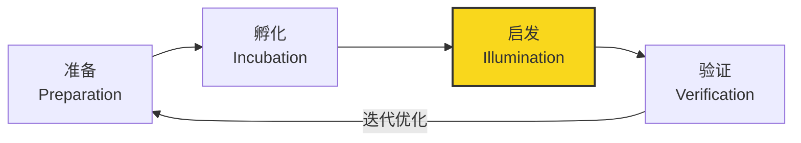
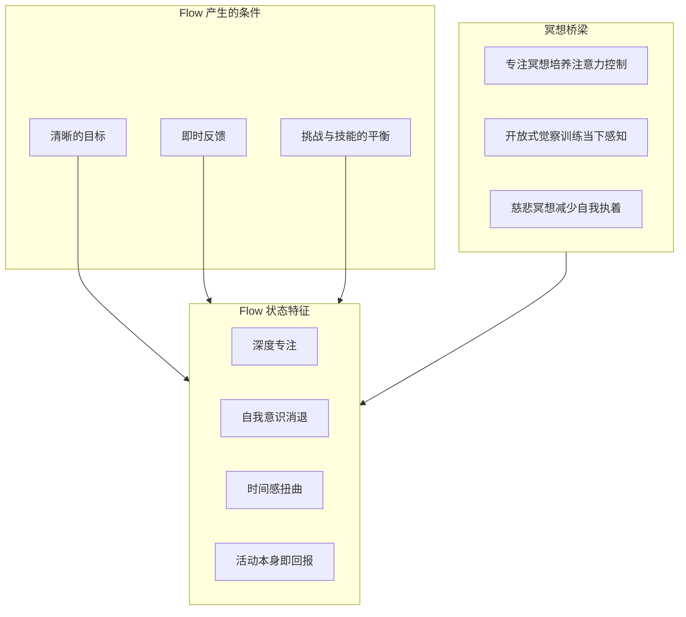
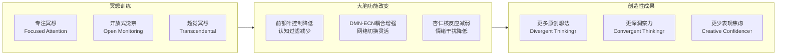
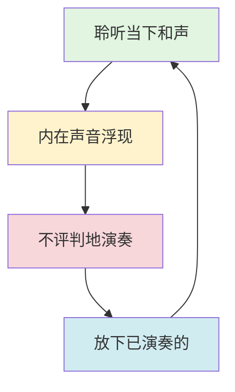

# 冥想与创造力/艺术

> 最后更新：2026-05

---

## 目录

1. [创造力的心理学模型](#1-创造力的心理学模型)
2. [冥想如何促进创造力](#2-冥想如何促进创造力)
3. [针对艺术家的冥想技术](#3-针对艺术家的冥想技术)
4. [科学证据](#4-科学证据)
5. [案例研究](#5-案例研究)
6. [参考资源](#6-参考资源)

---

## 1. 创造力的心理学模型

### 1.1 Graham Wallas 的四阶段模型

英国心理学家 Graham Wallas 于1926年提出创造性思维的四个阶段，至今仍是理解创意过程的经典框架：

| 阶段 | 名称 | 核心特征 | 冥想介入点 |
|:---:|:---|:---|:---|
| Ⅰ | **准备** (Preparation) | 明确问题、收集信息、有意识努力 | 专注冥想提升信息处理效率 |
| Ⅱ | **孵化** (Incubation) | 暂时搁置问题、潜意识加工 | 开放式觉察冥想促进潜意识联结 |
| Ⅲ | **启发** (Illumination) | 顿悟时刻、"啊哈"体验 | 降低认知过滤，允许灵感浮现 |
| Ⅳ | **验证** (Verification) | 逻辑检验、完善执行 | 正念减少验证阶段的完美主义焦虑 |

> **冥想视角**：孵化阶段与冥想状态高度重叠——两者都涉及对默认模式网络（DMN）的利用，以及前额叶控制网络的暂时"放手"。

### 1.2 Mihaly Csikszentmihalyi 的 Flow 理论

匈牙利心理学家 Mihaly Csikszentmihalyi 提出的 Flow（心流）理论描述了最优体验状态：

**Flow 的九个维度：**

| 维度 | 描述 | 与冥想的对应 |
|:---|:---|:---|
| 挑战-技能平衡 | 任务难度与个人技能匹配 | 冥想中觉察对象的"恰到好处" |
| 行动-意识融合 | 行为与意识融为一体 | 正念的"不二"体验 |
| 明确目标 | 知道当下要做什么 | 冥想意图的清晰设定 |
| 即时反馈 | 立刻知道行动结果 | 觉察本身的即时性 |
| 专注当下 | 注意力完全集中于当下 | 正念的核心定义 |
| 控制感 | 感到对活动有掌控力 | 冥想培养的内在稳定感 |
| 自我消失 | 自我意识暂时消退 | 无我体验（Anatta） |
| 时间感扭曲 | 时间流逝感改变 | 深度冥想中的时间消融 |
| 自成目的性 | 活动本身就是目的 | 非评判、不执取的冥想态度 |

### 1.3 Default Mode Network (DMN) 与创意

默认模式网络（DMN）是大脑在静息状态下活跃的一组脑区，与自我参照思维、心智游移和未来想象密切相关。

**DMN 与创意的关系：**

| 脑区 | 主要功能 | 在创意中的作用 |
|:---|:---|:---|
| 内侧前额叶皮层 (mPFC) | 自我参照、社会认知 | 模拟他人视角、角色代入 |
| 后扣带回 (PCC) | 记忆整合、情境建构 | 远距离联想、隐喻生成 |
| 角回 (Angular Gyrus) | 语义整合、概念模糊 | 跨模态联想、双关/比喻 |
| 海马体 (Hippocampus) | 记忆提取、场景想象 | 过去经验的创造性重组 |

> **关键发现**：高创造力个体的 DMN 与执行控制网络（ECN）之间的动态切换更加灵活。冥想训练可增强这种网络间灵活性。

---

## 2. 冥想如何促进创造力

### 2.1 神经机制

#### 前额叶皮层活动降低 → 自发联想增加

| 网络 | 功能 | 冥想效应 | 对创造力的影响 |
|:---|:---|:---|:---|
| **执行控制网络 (ECN)** | 目标导向、逻辑分析、抑制控制 | 暂时活动降低 | 减少"过早判断"，允许更多想法涌现 |
| **默认模式网络 (DMN)** | 心智游移、自我参照、联想思维 | 活动模式改变（更协调） | 促进远距离联想、隐喻思维 |
| **显著性网络 (SN)** | 检测内外显著事件、网络切换 | 切换效率提升 | 更快在"发散"与"聚焦"间转换 |

#### DMN 与任务正网络 (TPN) 的动态平衡

### 2.2 抑制控制与发散思维的权衡

创造性思维需要精妙的平衡——既要能抑制无关想法（聚焦），又要能放松抑制以允许远距离联想（发散）。

| 认知功能 | 过度活跃的问题 | 过度抑制的问题 | 冥想的调节作用 |
|:---|:---|:---|:---|
| **抑制控制** | 思维僵化、过早评判 | 注意力涣散、无法深入 | 培养"灵活抑制"——知道何时放开 |
| **工作记忆** | 过度分析、过度思考 | 无法维持复杂思路 | 清理工作记忆缓存，为新想法腾空间 |
| **认知灵活性** | 频繁切换、浅尝辄止 | 固执于单一方案 | 增强网络切换的神经效率 |

---

## 3. 针对艺术家的冥想技术

### 3.1 音乐即兴冥想

#### 爵士乐手的 Flow 训练

| 训练模块 | 冥想技术 | 应用情境 |
|:---|:---|:---|
| **呼吸-节奏同步** | 将呼吸与节拍器同步，逐步内化节奏感 | 即兴演奏前的集体准备 |
| **听觉开放式觉察** | 不评判地觉察所有声音（包括"错误"音符） | 在即兴中保持接纳心态 |
| **身体扫描+演奏** | 觉察身体紧张区域，有意识地放松 | 长时间演奏中的身体维护 |
| **"空杯"冥想** | 演奏前5分钟静默，放下预设与期望 | 每次即兴前的重置仪式 |

**爵士即兴中的正念循环：**

#### 古典乐手的演出前静心

| 阶段 | 时长 | 练习内容 | 目的 |
|:---|:---:|:---|:---|
| 调息 | 2分钟 | 4-7-8呼吸法 | 激活副交感神经 |
| 身体扫描 | 3分钟 | 觉察并释放肩膀/下巴/手的紧张 | 预防演奏伤害 |
| 意图设定 | 1分钟 | 默念："我与音乐合一，而非我被评判" | 转化表演焦虑 |
| 观想 | 2分钟 | 观想演奏的流畅与观众的接纳 | 预演成功体验 |

### 3.2 视觉艺术创作冥想

#### 观察冥想 → 写生

将正念观察转化为写生技能的训练路径：

| 步骤 | 冥想练习 | 写生应用 | 时间 |
|:---|:---|:---|:---:|
| 1. 悬置命名 | 看着对象而不在心里贴标签（"这是杯子"） | 看到形状/色彩而非"物体" | 5分钟 |
| 2. 边缘觉察 | 追踪对象与背景的边界，不抓取整体 | 准确勾勒轮廓 | 5分钟 |
| 3. 光影质感 | 觉察光线在表面的变化，如看第一次 | 捕捉明暗与材质 | 5分钟 |
| 4. 空间关系 | 觉察对象与周围空间的互动 | 构图与透视 | 5分钟 |
| 5. 整体-局部切换 | 在细节与整体间灵活移动注意力 | 避免"只见树木不见森林" | 5分钟 |

#### 空白画布恐惧的应对

**"第一笔"冥想协议：**

| 恐惧来源 | 正念回应 | 具体练习 |
|:---|:---|:---|
| "我必须画出杰作" | 过程导向，非结果导向 | 设定意图："今天我只是与材料对话" |
| "我没有灵感" | 灵感不必先于行动 | 5分钟"乱画冥想"——随意涂抹，不评判 |
| "别人会怎么看" | 将创作空间视为神圣私密 | 创作前默念："此刻，只有我和作品" |
| "我会毁掉它" | 接受"可破坏性"是创作的一部分 | 故意在废纸上"毁掉"一幅画以释放恐惧 |

### 3.3 写作冥想

#### 自由写作的冥想维度

| 传统自由写作 | 冥想增强版自由写作 | 效果差异 |
|:---|:---|:---|
| 限时快速书写 | 书写前3分钟呼吸冥想 | 降低启动焦虑 |
| 不修改、不停笔 | 加入"觉察编辑冲动"——注意到想修改时标记它但不执行 | 培养对内在批评的觉察 |
| 跟随思绪流动 | 像开放式觉察冥想一样"聆听"文字浮现 | 更多潜意识内容的涌现 |
| 接受任何内容 | 对令人不适的内容保持慈悲觉察 | 更深层的真实表达 |

#### 作家的阻滞突破

**"阻塞即材料"冥想练习：**

1. **命名阻塞**：静坐，将注意力放在"写不出来"的感受上——它在身体的哪个部位？质地如何？
2. **对话式冥想**：想象阻塞是一个角色，问它："你想保护我什么？" 将对话记录下来。
3. **切换模态**：如果文字阻塞，尝试用画、声音、动作来表达同一主题。
4. **微习惯+正念**：设定"每天只写一句话"的低门槛，但以全然的当下感去写那一句话。

### 3.4 舞蹈/运动即兴冥想

#### 接触即兴中的正念

| 正念原则 | 接触即兴应用 | 训练练习 |
|:---|:---|:---|
| **当下觉察** | 实时感知接触点的重量、方向、质地 | 闭眼慢速接触，仅通过皮肤"聆听" |
| **非评判** | 将"失衡"视为探索机会而非错误 | 故意失衡，追踪身体自动调整的智慧 |
| **不执取** | 接触-分离的自然流动 | "三秒接触"练习：每次接触后主动释放 |
| **慈悲** | 同时照顾自己和舞伴的安全与表达 | 双人呼吸同步，建立非语言信任 |

#### 编舞中的觉察

**编舞正念循环：**

---

## 4. 科学证据

### 4.1 冥想对发散思维测试的影响

| 研究 | 设计 | 主要发现 |
|:---|:---|:---|
| Colzato et al. (2012) | 专注冥想 vs 开放式觉察冥想 vs 控制组 | **开放式觉察冥想**显著提升发散思维（替代用途测验 AUT），专注冥想无显著效果 |
| Lebuda et al. (2016) | 元分析 (n=20 研究) | 冥想与创造力的关系呈"倒U型"——适度练习促进，过度专注型冥想可能抑制发散思维 |
| Ren et al. (2011) | fMRI 研究 | 冥想经验者完成创造性任务时 DMN 与 ECN 的协同性更高 |
| Ding et al. (2015) | 短期正念训练 (5天) | 提升远距离联想测验 (RAT) 成绩，伴随前额叶-顶叶连接增强 |

### 4.2 艺术家群体的冥想研究

| 研究 | 对象 | 干预 | 结果 |
|:---|:---|:---|:---|
| Kaufman & Lamb (2014) | 专业艺术家 | 回顾性调查 | 约30%的获奖艺术家有定期冥想练习，报告冥想帮助"进入状态"和"突破瓶颈" |
| Dudek (2016) | 音乐学院学生 | 8周MBSR | 表演焦虑显著降低，自我报告的创造性自信提升 |
| Lloyd et al. (2016) | 创意写作学生 | 6周正念训练 | 写作流畅性提升，内在批评降低，作品原创性评分提高 |

### 4.3 创意产业中的正念项目

| 机构/项目 | 内容 | 成果 |
|:---|:---|:---|
| **Google "Search Inside Yourself"** | 为员工提供正念+情商培训 | 员工报告创造力与协作能力提升 |
| **Aetna 正念项目** | 保险公司员工的正念减压 | 人均医疗保健成本降低，生产力指标改善 |
| **NBS 国家芭蕾舞团加拿大** | 舞者的正念身体训练 | 损伤率降低，表演质量评分提高 |
| **皮克斯动画工作室** | 鼓励员工冥想与静观 | 文化层面的创新支持环境 |

---

## 5. 案例研究

### 5.1 David Lynch：超觉冥想与电影创作

| 维度 | 详情 |
|:---|:---|
| **背景** | 美国电影导演、编剧、视觉艺术家；代表作《穆赫兰道》《蓝丝绒》《双峰》 |
| **冥想实践** | 1973年开始练习超觉冥想（TM），每日两次，每次20分钟；2005年成立 David Lynch Foundation |
| **创作关联** | Lynch 将 TM 视为创意的源泉："冥想让意识沉入更深层的领域，那里是创意的源头。想法像鱼一样游上来。" |
| **具体表现** | 电影中超现实意象的直接呈现；对梦境/潜意识主题的一贯探索；创作时的高度直觉导向 |
| **对艺术教育的贡献** | David Lynch Foundation 资助学校引入 TM，声称提升学生创造力与学业表现 |

> **核心洞察**：Lynch 代表了"深度冥想→深层潜意识→超现实艺术"的路径。对需要挖掘潜意识意象的艺术家，TM 等深度放松技术可能特别有效。

### 5.2 史蒂夫·乔布斯：禅宗与苹果设计

| 维度 | 详情 |
|:---|:---|
| **背景** | 苹果联合创始人、前CEO；改变了个人电脑、音乐、手机、动画电影等多个行业 |
| **冥想实践** | 青年时期在印度寻找灵性导师；终身练习禅宗冥想；定期参加禅修闭关；结婚由禅宗僧侣 Kobun Chino Otogawa 主持 |
| **设计哲学** | "简约是终极的复杂"（Simplicity is the ultimate sophistication）——深受禅宗"减法美学"影响 |
| **具体表现** | 苹果产品的极简设计；对"空白"的重视（物理与数字界面）；对细节的极致专注（如字体、圆角） |
| **决策风格** | 直觉导向的重大决策（如开发 iPhone）；"静心"后做决定的习惯 |

> **核心洞察**：Jobs 展示了"正念→专注力→极致简约→创新设计"的路径。对产品/界面设计师，正念培养的专注与"少即是多"的洞察至关重要。

### 5.3 Ray Dalio：冥想与投资决策

| 维度 | 详情 |
|:---|:---|
| **背景** | 桥水基金创始人；全球最大对冲基金公司之一；著有《原则》 |
| **冥想实践** | 1968年开始练习超觉冥想，持续超过50年；称冥想为"生命中最大的礼物" |
| **投资关联** | 将冥想视为保持决策清晰度的工具："市场充满情绪与噪音，冥想让我看清模式而不被情绪裹挟。" |
| **具体表现** | 桥水的"极度透明"文化部分源于对"当下真实"的重视；系统化决策流程（"原则"）需要超越自我偏见 |
| **组织推广** | 桥水为员工提供正念培训；Dalio 多次公开推广冥想对商业决策的价值 |

> **核心洞察**：Dalio 代表了"冥想→情绪调节→清晰决策→系统创新"的路径。对需要高压决策的创意/商业领袖，冥想的情绪调节功能尤为关键。

---

## 6. 参考资源

### 核心文献

1. Csikszentmihalyi, M. (1996). *Creativity: Flow and the Psychology of Discovery and Invention*. Harper Perennial.
2. Wallas, G. (1926). *The Art of Thought*. Harcourt, Brace and Company.
3. Lynch, D. (2006). *Catching the Big Fish: Meditation, Consciousness, and Creativity*. Tarcher.
4. Isaacson, W. (2011). *Steve Jobs*. Simon & Schuster.
5. Dalio, R. (2017). *Principles: Life and Work*. Simon & Schuster.

### 学术论文

- Colzato, L. S., et al. (2012). "Meditation and creativity." *Frontiers in Human Neuroscience*, 6, 219.
- Lebuda, I., Zabelina, D. L., & Karwowski, M. (2016). "Mind full of ideas: A meta-analysis of the mindfulness-creativity link." *Aggression and Violent Behavior*.

### 实践资源

| 资源 | 类型 | 适用对象 |
|:---|:---|:---|
| *The Artist's Way* (Julia Cameron) | 书籍 | 所有创意人士 |
| *Free Play* (Stephen Nachmanovitch) | 书籍 | 音乐家、即兴艺术家 |
| *Drawing on the Right Side of the Brain* (Betty Edwards) | 书籍 | 视觉艺术家 |
| *Writing Down the Bones* (Natalie Goldberg) | 书籍 | 作家 |
| David Lynch Foundation | 组织 | 寻求 TM 的艺术家与学生 |

---

> **跨领域标签**: `#创造力` `#Flow` `#艺术治疗` `#正念` `#神经科学` `#发散思维` `#心流` `#默认模式网络`
