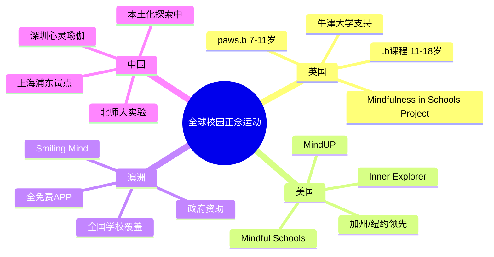
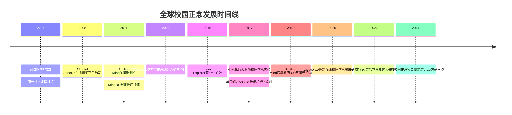
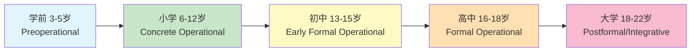
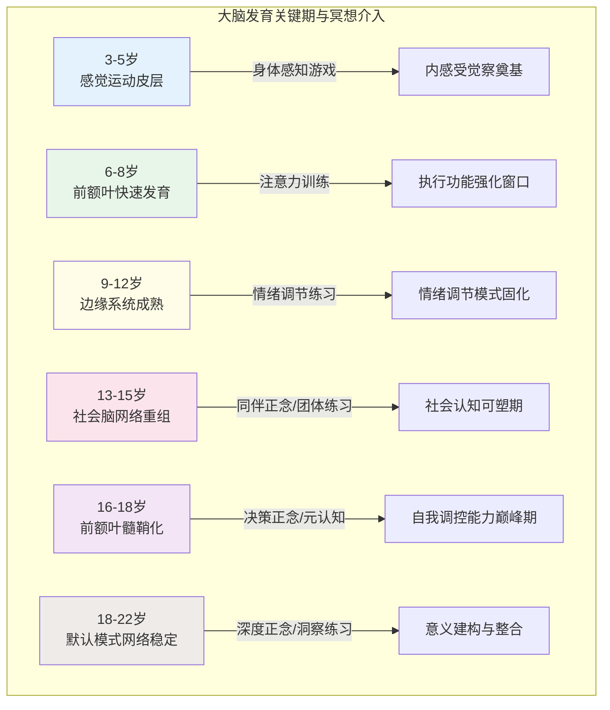
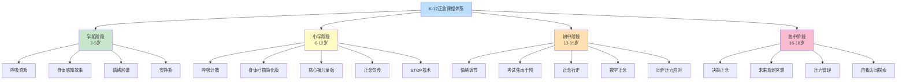
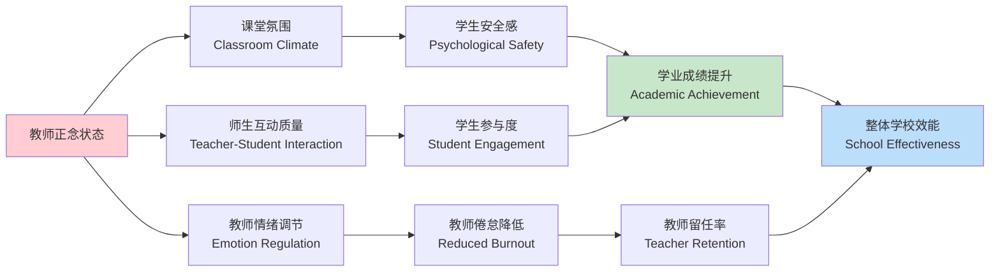
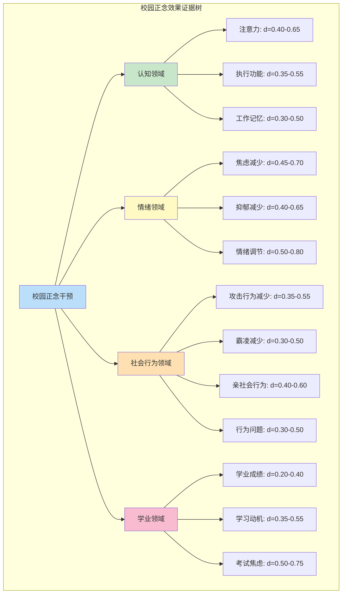
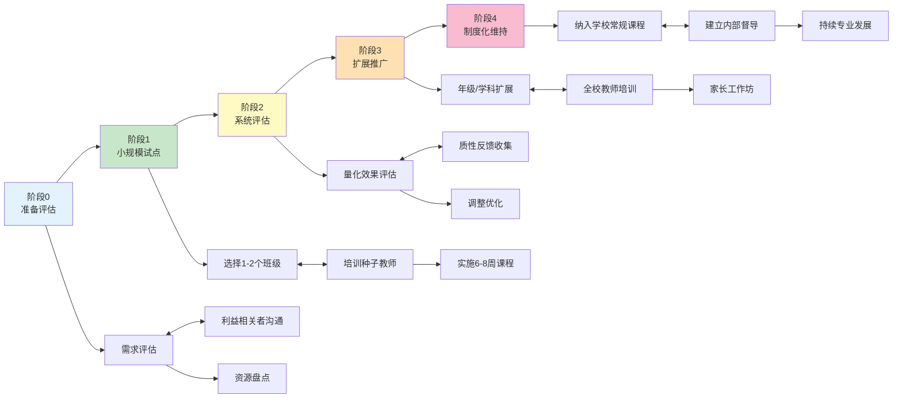

# 冥想与教育专业概述 | Meditation Education Overview

> **领域**：校园正念（School-Based Mindfulness）、教育冥想（Meditation in Education）、发展适应性冥想（Developmentally Appropriate Meditation）
> **关键词**：校园正念（School Mindfulness）、K-12正念课程（K-12 Mindfulness Curriculum）、.b课程（dot-b）、教师正念（Teacher Mindfulness）、发展心理学（Developmental Psychology）、随机对照试验（RCT）、效应量（Effect Size）
> **上次更新**：2026-05

---

## 目录 | Contents

1. [全球校园正念运动](#1-全球校园正念运动--global-school-mindfulness-movements)
2. [发展心理学视角](#2-发展心理学视角--developmental-psychology-perspective)
3. [K-12正念课程体系](#3-k-12正念课程体系--k-12-mindfulness-curriculum)
4. [教师正念培训](#4-教师正念培训--teacher-mindfulness-training)
5. [科学证据](#5-科学证据--scientific-evidence)
6. [争议与批评](#6-争议与批评--controversies--criticisms)
7. [实施指南](#7-实施指南--implementation-guide)
8. [参考文献](#8-参考文献--references)

---

## 1. 全球校园正念运动 | Global School Mindfulness Movements

### 1.1 运动概览



### 1.2 主要项目对比表

| 项目名称 | 英文全称 | 创立国家 | 目标年龄 | 课程结构 | 核心特色 | 循证等级 | 覆盖规模 |
|---|---|---|---|---|---|---|---|
| **.b (dot-b)** | Mindfulness in Schools Project .b | 英国 | 11-18岁 | 9课时×40-60分钟 | 青少年友好的正念训练；幽默、互动、无宗教色彩 | ⭐⭐⭐ | 全球50+国家 |
| **paws .b** | paws b (Mindfulness in Schools Project) | 英国 | 7-11岁 | 12课时×30-45分钟 | 动物主题、故事化、游戏化教学 | ⭐⭐⭐ | 英国为主 |
| **Inner Explorer** | Inner Explorer | 美国 | K-12 | 每日5-10分钟音频 | 每日练习；教师无需额外培训；按年龄分层 | ⭐⭐⭐ | 美国4000+学校 |
| **Mindful Schools** | Mindful Schools | 美国 | K-12 | 15-30课时 | 教师培训+课堂课程双轨制；在线资源丰富 | ⭐⭐⭐ | 全球50+国家 |
| **MindUP** | MindUP | 美国/加拿大 | K-8 | 15课时 | 融入社会情感学习（SEL）；神经科学教育 | ⭐⭐⭐ | 全球10000+学校 |
| **Smiling Mind** | Smiling Mind | 澳大利亚 | K-12 | APP驱动+课堂指南 | 完全免费；政府资助；全年龄覆盖 | ⭐⭐⭐ | 澳600万+用户 |
| **Learning to BREATHE** | Learning to BREATHE | 美国 | 13-18岁 | 6-18课时 | 以青少年发展需求为核心；情绪调节聚焦 | ⭐⭐⭐ | 美国为主 |
| **中国校园正念实验** | China School Mindfulness Pilot | 中国 | 小学-高中 | 试点多样 | 本土化探索；融入传统文化；政策推动中 | ⭐ | 区域性试点 |

### 1.3 各国发展时间线



### 1.4 中国校园正念实验详情

| 项目/实验 | 发起机构 | 地区 | 目标人群 | 课程内容 | 研究设计 | 当前状态 |
|---|---|---|---|---|---|---|
| **北师大校园正念实验** | 北京师范大学发展心理研究院 | 北京 | 小学4-6年级 | 改编自MindUP；融入儒家静坐元素 | 准实验设计；前后测 | 2017-2020完成；论文发表中 |
| **上海浦东SEL正念项目** | 上海浦东教育局+高校合作 | 上海浦东 | 初中 | 社会情感学习+正念；每周一节 | 试点学校对照 | 2021启动；持续中 |
| **深圳"心灵瑜伽"** | 深圳多校自发实践 | 深圳 | K-12 | 瑜伽+呼吸+正念；体育课融入 | 无系统研究 | 民间探索阶段 |
| **浙江师范大学正念教育** | 浙江师范大学 | 浙江 | 师范生+中小学 | 教师培训先行；再入课堂 | 行动研究 | 学术探索阶段 |
| **香港正念进课堂** | 香港大学/中文大学 | 香港 | 中小学 | 英文项目本地化；粤语版.b | RCT研究 | 2015至今；多项论文发表 |

---

## 2. 发展心理学视角 | Developmental Psychology Perspective

### 2.1 认知与情绪发展特点总览



### 2.2 年龄段适配总表

| 维度 | 学前 3-5岁<br/>Preschool | 小学 6-12岁<br/>Primary School | 初中 13-15岁<br/>Middle School | 高中 16-18岁<br/>High School | 大学 18-22岁<br/>University |
|---|---|---|---|---|---|
| **皮亚杰阶段** | 前运算期 | 具体运算期 | 形式运算早期 | 形式运算期 | 后形式运算/整合期 |
| **注意力持续** | 3-5分钟 | 10-15分钟 | 15-20分钟 | 20-30分钟 | 30-45分钟 |
| **元认知能力** | 几乎没有 | 萌芽（8岁后） | 快速发展 | 成熟 | 高度成熟 |
| **情绪调节策略** | 外部调节（成人辅助） | 简单策略（深呼吸、数数） | 策略多样化但执行不稳定 | 策略稳定但情绪强度大 | 策略灵活、整合 |
| **自我概念** | 具体、情境化 | 社会比较开始 | 自我意识爆发 | 身份探索核心期 | 身份承诺/ moratorium |
| **同伴影响** | 低（成人主导） | 中等（开始重要） | **极高** | 高 | 高但多元化 |
| **抽象思维** | 象征性游戏 | 具体逻辑 | 假设演绎萌芽 | 抽象推理成熟 | 辩证思维发展 |
| **身体发育** | 快速神经发育 | 稳定成长 | 青春期爆发 | 趋于成熟 | 成熟 |

### 2.3 冥想适配性矩阵

| 冥想维度 | 3-5岁 | 6-12岁 | 13-15岁 | 16-18岁 | 18-22岁 |
|---|---|---|---|---|---|
| **静坐时长** | 1-3分钟 | 3-10分钟 | 10-15分钟 | 15-25分钟 | 20-45分钟 |
| **指导语长度** | 极简（<30秒） | 简短（1-2分钟） | 中等（3-5分钟） | 较长（5-10分钟） | 成人标准 |
| **练习形式** | 游戏化、动态、感官 | 游戏+结构并重 | 结构化+同伴活动 | 结构化+自主探索 | 自主+深度 |
| **语言风格** | 故事、隐喻、拟人 | 故事+简单解释 | 直接+青少年俚语 | 平等对话、哲学探讨 | 学术+体验并重 |
| **情绪内容深度** | 基础情绪识别 | 情绪命名+简单因果 | 复杂情绪+社会情境 | 存在议题、身份焦虑 | 意义探索、整合 |
| **身体觉察精度** | 整体/大部位 | 主要身体部位 | 精细部位+内脏感受 | 全身精微觉察 | 全身+能量通道 |
| **伦理/价值观** | 分享、友爱 |  kindness、尊重 | 社会公正、同伴伦理 | 个人价值观形成 | 多元价值整合 |
| **最佳教学设置** | 小班（<15人） | 常规班级 | 小班/分组 | 小班/选修/社团 | 工作坊/课程/APP |
| **家庭参与必要性** | **极高** | 高 | 中等 | 低（但沟通重要） | 自主 |

### 2.4 神经发育与冥想敏感期



---

## 3. K-12正念课程体系 | K-12 Mindfulness Curriculum

### 3.1 课程架构总览



### 3.2 学前阶段（3-5岁）| Preschool Stage

| 课程模块 | 英文名称 | 时长 | 核心方法 | 发展适配原理 | 教学要点 | 典型活动 |
|---|---|---|---|---|---|---|
| **呼吸游戏** | Breathing Games | 2-3分钟 | 毛绒动物呼吸、蜜蜂呼吸、吹泡泡呼吸 | 3-5岁以感觉运动学习为主；呼吸与游戏结合符合前运算期特点 | 绝不强制；随时可停；大量正向强化 | 平躺放毛绒玩具在肚上，观察"小船起伏" |
| **身体感知故事** | Body Awareness Stories | 5-8分钟 | 引导式想象+身体动作 | 此阶段想象力丰富，但无法区分想象与现实；故事载体安全且吸引 | 使用拟人化语言；配合大动作；避免静止过久 | "我们是毛毛虫→茧→蝴蝶"配合身体蠕动、抱膝、展臂 |
| **情绪脸谱** | Emotion Faces | 5-10分钟 | 面部表情识别+身体感受标记 | 情绪识别是情绪调节的前提；3-5岁开始能命名基础情绪 | 使用大、清晰、多样的表情图片；连接身体感受 | 展示表情卡→模仿→说"当我__时，我的身体感到__" |
| **安静瓶** | Mindful Jar / Calm Down Jar | 3-5分钟 | 视觉专注+情绪隐喻 | 具象化是前运算期核心认知方式；亮粉沉降=情绪平静，直观可理解 | 让儿童自己制作；摇晃代表情绪激动；观看沉淀 | 摇晃装有亮粉和胶水的水瓶，一起观看亮粉慢慢落下 |

**学前阶段周课程示例（每周2次×15分钟）**

| 周次 | 主题 | 活动组合 | 家庭延伸 |
|---|---|---|---|
| W1 | 认识呼吸 | 吹泡泡呼吸（2min）+ 身体感知故事：小气球（5min） | 家长睡前共读呼吸绘本 |
| W2 | 身体是我的朋友 | 毛毛虫变蝴蝶（5min）+ 摸摸我的脚趾（3min） | 洗澡时的身体部位命名游戏 |
| W3 | 情绪小怪兽 | 情绪脸谱配对（5min）+ 安静瓶制作与使用（5min） | 家庭情绪温度计（每天涂色） |
| W4 | 安静下来 | 蜜蜂呼吸（2min）+ 安静瓶观察（3min）+ 听声音游戏（3min） | 睡前3分钟"安静时间" |
| W5-8 | 循环深化 | 轮换上述活动，逐步增加自主练习时间 | 持续家庭练习 |

### 3.3 小学阶段（6-12岁）| Primary School Stage

| 课程模块 | 英文名称 | 时长 | 核心方法 | 发展适配原理 | 教学要点 | 典型练习 |
|---|---|---|---|---|---|---|
| **呼吸计数** | Breath Counting | 3-5分钟 | 数呼吸（1-10循环） | 具体运算期儿童能进行简单数字操作；计数提供注意力锚点 | 从短开始；允许走神后带回；不评判对错 | 闭眼，吸气数1，呼气数2，至10后重新开始 |
| **身体扫描简化版** | Body Scan Lite | 5-10分钟 | 主要部位觉察（脚→腿→腹→胸→手→头） | 具体运算期能理解身体部位序列；但长时间静止困难 | 使用引导音频；允许微动；聚焦大部位 | 躺下，依次觉察"脚底→小腿→大腿→肚子→胸口→双手→双肩→面部" |
| **慈心禅儿童版** | Loving-Kindness for Kids | 5-8分钟 | 对自己→家人→朋友→所有人送祝福 | 6-8岁以家庭为中心；9-12岁同伴关系上升；逐步扩展符合社会情感发展 | 使用简单祝福语；"愿你快乐，愿你健康"；不强求情感 | 双手放胸口→想自己→想妈妈/爸爸→想好朋友→想所有人 |
| **正念饮食** | Mindful Eating | 10-15分钟 | 葡萄干练习（或日常零食） | 具体运算期通过感官体验学习；饮食是日常可及的正念入口 | 准备小份食物；引导全部五感；连接食物来源 | 拿一颗葡萄干→看→触→闻→放舌上→咀嚼→吞咽，全程静默 |
| **STOP技术** | STOP Technique | 1-3分钟 | S-Stop停 | T-Take a breath呼吸 | O-Observe观察 | P-Proceed继续 | 这是可迁移的"微正念"技能；适合注意力短暂的小学生；可嵌入任何冲突情境 | 教为"超能力口诀"；角色扮演；即时应用 | 同学抢我铅笔→STOP→深呼吸→观察自己的感觉→选择回应方式 |

**小学阶段分龄细化**

| 年龄段 | 注意力特征 | 推荐单次时长 | 课程重点 | 教学策略 | 常见挑战 |
|---|---|---|---|---|---|
| **低年级 6-8岁** | 10-15分钟；易受干扰；需要大量感官刺激 | 3-5分钟静坐+活动 | 身体觉察、基础呼吸、情绪识别 | 大量动作、游戏、故事；每2-3分钟转换活动 | 无法静坐、讲话、嬉笑 |
| **中年级 9-10岁** | 15-20分钟；能进行简单内省；同伴比较开始 | 5-10分钟 | 呼吸锚定、情绪因果、慈心扩展 | 引入简单科学解释（"大脑像肌肉"）；小组讨论 | "这很无聊"、怀疑态度 |
| **高年级 11-12岁** | 20-25分钟；元认知萌芽；自我意识增强 | 10-15分钟 | STOP技术、正念沟通、考试准备 | 平等尊重的语气；允许提问和质疑；连接学业表现 | 尴尬感（尤其异性面前）、"太幼稚" |

### 3.4 初中阶段（13-15岁）| Middle School Stage

| 课程模块 | 英文名称 | 时长 | 核心方法 | 发展适配原理 | 教学要点 | 典型练习 |
|---|---|---|---|---|---|---|
| **情绪调节** | Emotion Regulation | 10-15分钟 | RAIN技术（识别-允许-探究-不认同） | 青春期情绪强度高、波动大；RAIN提供结构化应对框架 | 去病理化语言；正常化情绪波动；强调选择而非压抑 | R-Recognize识别情绪 | A-Allow允许存在 | I-Investigate身体感受 | N-Not identify不把自己等同于情绪 |
| **考试焦虑干预** | Test Anxiety Intervention | 10-20分钟 | 考前正念+考试场景想象+呼吸锚定 | 考试压力是初中核心应激源；想象暴露降低考试情境敏感度 | 在模拟考试环境中练习；建立"焦虑是正常的"认知 | 想象考试场景→觉察焦虑信号→3次腹式呼吸→继续答题 |
| **正念行走** | Mindful Walking | 10-15分钟 | 慢步行走+足部觉察+环境感知 | 青春期身体能量高，静坐困难；行走提供动态正念出口 | 户外优先；不追求"正确"走法；允许自然节奏 | 在校园慢走，专注脚底接触地面的感觉（抬起-移动-放下-接触） |
| **数字正念** | Digital Mindfulness | 10-15分钟 | 有意识的屏幕使用、社交媒体觉察、通知暂停 | 数字原住民；此阶段屏幕使用爆发；需要批判性觉察而非简单禁止 | 不妖魔化科技；觉察"自动滑动"模式；建立使用意图 | 打开手机前→STOP→问"我要做什么？"→使用后→觉察身体感受 |
| **同伴压力应对** | Peer Pressure Response | 15-20分钟 | 正念暂停+价值观澄清+角色扮演 | 同伴影响达到一生峰值；冲动控制前额叶仍在发育 | 不评判流行文化；通过觉察创造选择空间；团体讨论 | 情境：朋友邀请做某事→身体觉察（紧绷？）→呼吸→问"这符合我的价值观吗？"→回应 |

### 3.5 高中阶段（16-18岁）| High School Stage

| 课程模块 | 英文名称 | 时长 | 核心方法 | 发展适配原理 | 教学要点 | 典型练习 |
|---|---|---|---|---|---|---|
| **决策正念** | Mindful Decision-Making | 15-20分钟 | 身体智慧觉察+选项想象+价值观锚定 | 形式运算期能进行假设演绎；面临人生重大选择（升学、专业） | 尊重自主权；提供框架而非答案；强调身体信号的决策价值 | 重大决定时→觉察身体对每个选项的反应（扩张/收缩）→结合理性分析→决定 |
| **未来规划冥想** | Future Self Visualization | 15-25分钟 | 引导式想象5/10年后的自己+给现在的自己写信 | 身份承诺期；未来时间取向增强；需要意义感和方向感 | 允许开放性结果；不预设"成功"标准；强调过程而非结果 | 闭眼想象5年后的自己→他在做什么？感受如何？→他给现在的你什么建议？ |
| **压力管理** | Stress Management | 15-20分钟 | 综合技术：呼吸+身体扫描+认知重构 | 学业压力、升学压力、社交压力叠加；需要系统工具包 | 科学解释机制（HPA轴、前额叶）；强调日常练习而非应急 | 每日"压力扫描"：身体哪里紧绷？→对应呼吸→认知："这是暂时的" |
| **自我认同探索** | Identity Exploration Meditation | 20-30分钟 | 开放式探询："我是谁？"观察想法而不认同 | 埃里克森"同一性 vs 角色混乱"核心期；正念支持观察性自我 | 哲学深度对话；引入存在主义视角；允许不确定性和矛盾 | 静坐，问"我是谁？"→观察升起的所有答案→不抓取任何一个→体验"观察者" |

### 3.6 K-12课程方案对比表

| 对比维度 | 学前 3-5岁 | 小学 6-12岁 | 初中 13-15岁 | 高中 16-18岁 |
|---|---|---|---|---|
| **核心目标** | 身体觉察奠基；情绪识别启蒙；安静体验 | 注意力训练；情绪调节入门；人际善意 | 情绪强度管理；压力应对；同伴关系 | 决策质量；身份整合；意义建构 |
| **主导教学法** | 游戏化、故事化、感官化 | 结构化+游戏并重 | 体验式+认知教育 | 体验式+哲学对话 |
| **教师角色** | 共同游戏者、安全守护者 | 引导者、示范者 | 教练、资源提供者 | 对话伙伴、平等探索者 |
| **练习频率** | 每日2-3次×3-5分钟 | 每日1-2次×5-10分钟 | 每日1次×10-15分钟 | 每日1次×15-20分钟 |
| **评估方式** | 行为观察；教师报告 | 自我报告+教师观察 | 自我报告+心理量表 | 自我报告+反思日志 |
| **家长参与** | **必需**（家庭延伸活动） | **推荐**（家庭练习支持） | **沟通重要**（知情权+家庭作业） | 知情同意即可 |
| **典型课程总时长** | 8周×每周2次×15分钟 | 8-16周×每周2次×20分钟 | 8-10周×每周1次×45分钟 | 8周×每周1次×45-60分钟 |
| **推荐项目** | Inner Kids; 自编游戏课程 | MindUP; paws .b; Mindful Schools | .b; Learning to BREATHE | .b; MBSR-T; 自编高阶课程 |

---

## 4. 教师正念培训 | Teacher Mindfulness Training

### 4.1 为什么先培训教师？



### 4.2 教师是课堂氛围的最大变量

| 研究维度 | 发现 | 研究来源 | 教育意义 |
|---|---|---|---|
| **教师情绪感染力** | 教师的情绪状态通过"情绪感染"（Emotional Contagion）在5分钟内传递至全班学生 | Frenzel et al., 2009 | 教师焦虑→学生焦虑；教师平静→学生平静 |
| **教师-学生互动质量** | 高正念教师更多使用"自主性支持"教学行为，减少控制行为 | Broussard et al., 2019 | 正念改变教学风格，而非仅仅改变教师个人状态 |
| **课堂管理效率** | 正念教师报告更少课堂行为问题，但客观观察显示问题未减少——差异在于教师反应方式 | Singh et al., 2013 | 正念改变的是教师对行为的"解读"和"回应"，而非消除行为 |
| **学业成绩传导效应** | 教师正念 → 课堂氛围质量 → 学生参与度 → 学业成绩（链式中介模型） | Dicke et al., 2021 | 教师正念是"上游干预点"，效应通过多层机制传递 |
| **神经同步** | 教师-学生在互动中出现大脑神经同步（Inter-brain Synchrony），正念教师同步度更高 | Bevilacqua et al., 2019 | 正念可能在神经层面促进教学共振 |

### 4.3 .b Foundations 教师课程

| 课程要素 | 详情 |
|---|---|
| **英文全称** | .b Foundations — Mindfulness in Schools Project Teacher Training |
| **目标人群** | 计划在学校教授正念的中小学教师（无需先前冥想经验） |
| **课程结构** | 8周×2.5小时 + 1日静修（共约27小时） |
| **核心内容** | 教师个人正念练习（前4周重点）+ 教学方法论（后4周）+ 课堂管理策略 |
| **认证要求** | 完成全部课时 + 个人每日练习记录 + 教学演示通过 |
| **练习时长要求** | 课程期间每日至少15分钟个人练习 |
| **培训后支持** | 加入MiSP教师社群；持续专业发展（CPD）活动 |
| **费用** | 英国约£450-600；国际培训因地区而异 |

### 4.4 教师倦怠（Burnout）预防

| 倦怠维度 | 定义 | 正念干预靶点 | 机制 | 效果证据 |
|---|---|---|---|---|
| **情绪耗竭**<br/>Emotional Exhaustion | 感到情绪资源被耗尽 | 日常微正念恢复；情绪边界觉察 | 减少情绪劳动的"深层扮演"；增加"表层扮演"的选择性 | 效应量 d=0.50-0.80 |
| **去人格化**<br/>Depersonalization | 对学生冷漠、疏离 | 慈心禅 reconnecting | 重新激活关怀回路（奖赏系统） | 效应量 d=0.40-0.60 |
| **个人成就感降低**<br/>Reduced Personal Accomplishment | 感到无能、缺乏成就 | 成长型思维+正念觉察进步 | 从"完美主义"转向"过程导向" | 效应量 d=0.30-0.50 |

**教师正念培训效果汇总**

| 结局指标 | 研究数量 | 效应量 (Hedges' g) | 95% CI | 证据质量 |
|---|---|---|---|---|
| 教师自我报告压力 | 35项RCT | -0.58 | [-0.72, -0.44] | 高 |
| 教师自我报告正念 | 28项RCT | 0.68 | [0.52, 0.84] | 高 |
| 教师倦怠 | 22项RCT | -0.42 | [-0.56, -0.28] | 中高 |
| 课堂氛围质量 | 12项RCT | 0.52 | [0.32, 0.72] | 中等 |
| 学生行为问题（教师报告） | 15项RCT | -0.35 | [-0.52, -0.18] | 中等 |
| 学生学业成绩 | 8项RCT | 0.22 | [0.08, 0.36] | 中等 |

---

## 5. 科学证据 | Scientific Evidence

### 5.1 校园正念RCT研究效果总览



### 5.2 科学证据汇总表

| 效果领域 | 具体指标 | 代表性研究 | 样本量 | 效应量 (d) | 证据等级 | 专业解读 |
|---|---|---|---|---|---|---|
| **注意力** | 持续性注意力 | Semple et al., 2010 | n=25 | 0.52 | ⭐⭐⭐ | 青少年MBSR改善注意力网络测试（ANT） |
| **注意力** | 选择性注意力 | Schonert-Reichl et al., 2015 | n=99 | 0.65 | ⭐⭐⭐ | MindUP项目显著改善儿童选择性注意 |
| **执行功能** | 认知灵活性 | Flook et al., 2010 | n=64 | 0.48 | ⭐⭐⭐ | 小学正念课程改善EF，尤其对低起点儿童 |
| **焦虑** | 状态焦虑 | Biegel et al., 2009 | n=102 | 0.70 | ⭐⭐⭐ | MBSR-T显著减少青少年临床焦虑 |
| **焦虑** | 考试焦虑 | Napoli et al., 2005 | n=194 | 0.58 | ⭐⭐⭐ | 小学1-3年级正念降低测试焦虑 |
| **抑郁** | 抑郁症状 | Raes et al., 2014 | n=408 | 0.45 | ⭐⭐⭐ | 中学.b课程减少抑郁症状，效应维持6个月 |
| **情绪调节** | 情绪反应性 | Hölzel et al., 2016 | n=129 | 0.55 | ⭐⭐⭐ | 正念训练降低杏仁核反应性 |
| **行为问题** | 外化行为 | Zenner et al., 2014 Meta | k=24 | 0.40 | ⭐⭐⭐ | 元分析显示校园正念减少攻击和破坏 |
| **霸凌** | 霸凌行为 | Zumalt et al., 2019 | n=246 | 0.35 | ⭐⭐ | 正念+SEL联合干预减少霸凌 |
| **霸凌** | 受霸凌体验 | Durlak et al., 2011 Meta | k=213 | 0.38 | ⭐⭐⭐ | 广义SEL项目的元分析，正念子集类似 |
| **学业成绩** | 标准化测试 | Sibinga et al., 2016 | n=300 | 0.28 | ⭐⭐ | 初中正念改善英语和数学成绩 |
| **学业成绩** | GPA | Bakosh et al., 2016 | n=937 | 0.22 | ⭐⭐ | Inner Explorer每日正念与GPA正相关 |
| **教师倦怠** | 情绪耗竭 | Klingbeil et al., 2017 Meta | k=29 | -0.50 | ⭐⭐⭐ | 教师正念培训显著降低倦怠 |
| **教师压力** | 感知压力 | Emerson et al., 2017 | n=224 | -0.58 | ⭐⭐⭐ | CARE项目减少教师压力 |

### 5.3 Effect Size 分析与解读

| 效应量范围 | 解释 | 校园正念常见领域 | 临床/教育意义 |
|---|---|---|---|
| **d < 0.20** | 可忽略 | 部分学业成绩指标 | 需更大样本或优化干预 |
| **d = 0.20-0.50** | 小到中等 | 学业成绩、行为问题、学习动机 | 有意义但需结合其他干预 |
| **d = 0.50-0.80** | 中到大 | 注意力、情绪调节、焦虑、考试焦虑 | 临床显著；可视为主动控制条件等价 |
| **d > 0.80** | 大效应 | 较少见；部分临床样本的情绪症状 | 强效应；但需警惕发表偏倚 |

**关键发现**：
- 情绪调节和焦虑领域的效应量最大（d=0.50-0.80），接近心理治疗平均效应量
- 学业成绩效应量较小（d=0.20-0.40），但具有累积性和社会意义（相当于从第50百分位提升至第58百分位）
- 注意力训练效果在儿童期（6-12岁）优于青春期，提示发展敏感期假说

### 5.4 长期跟踪研究

| 研究 | 随访时长 | 样本 | 干预类型 | 效果维持情况 | 重要发现 |
|---|---|---|---|---|---|
| **MindUP 4年跟踪** | 4年 | n=246 | MindUP 15课时 | 亲社会行为维持；学业效果衰减 | 社交情感效果比认知效果更持久 |
| **.b 6个月跟踪** | 6个月 | n=408 | .b 9课时 | 抑郁减少维持；焦虑效果部分衰减 | 需要强化课程维持效果 |
| **MBSR-T 3个月跟踪** | 3个月 | n=102 | MBSR-T 8周 | 焦虑、抑郁效果维持 | 青少年样本的维持率优于成人 |
| **Schonert-Reichl 1年** | 1年 | n=99 | MindUP | 执行功能和学业成绩维持 | 教师培训质量是维持的关键中介 |

### 5.5 失败的/负面结果研究

| 研究 | 设计 | 结果 | 可能原因分析 | 教训 |
|---|---|---|---|---|
| **Carter et al., 2010** | RCT, n=123, 小学 | 正念组与主动控制组（放松训练）无显著差异 | 控制组同样有效；"非特异性因素"解释 | 正念的独特效果可能被夸大；需更强对照 |
| **Volanen et al., 2016** | 大型RCT, n=3516, 芬兰 | 职场正念未改善教师倦怠 | 实施 fidelity 低；教师参与度不足 | 实施质量比项目设计更重要 |
| **Dunning et al., 2019** | 大规模RCT, n=8376, 英国 | Myriad项目（学校正念）未预防青少年抑郁 | 普遍性预防可能不足以影响临床级症状； ceiling effect | 预防 vs 治疗的不同逻辑；亚组可能受益 |
| **Montero-Marin et al., 2022** | RCT, n=300, 西班牙 | 在线学校正念无显著效果 | 在线形式缺乏互动；学生 dropout 高 | 形式/媒介的重要性 |
| **潜在负面效应** | 个案报告 | 少数学生报告焦虑加剧、解离体验 | 创伤史未被筛查；练习时间过长；环境不安全 | 需要安全协议；创伤知情方法 |

**负面结果的专业解读**：
1. **对照组问题**：许多早期研究使用等待名单对照，夸大了效应量；与主动控制（如放松、SEL课程）相比，效应量降低30-50%
2. **实施保真度（Fidelity）**：课堂层面的实施质量是效果的关键中介；教师培训不足=效果为零
3. **预防悖论**：普遍性预防项目（universal prevention）在亚临床人群中难以检测效果，因为基线症状已较低
4. **安全性**：虽然罕见，但正念可能触发焦虑加剧、解离、创伤反应；需要筛查和应急预案

---

## 6. 争议与批评 | Controversies & Criticisms

### 6.1 争议矩阵

```mermaid
quadrantChart
    title 校园正念争议优先级矩阵
    x-axis 低影响 --> 高影响
    y-axis 低发生频率 --> 高发生频率
    quadrant-1 高频高影响: 优先处理
    quadrant-2 低频高影响: 预案准备
    quadrant-3 低频低影响: 监控即可
    quadrant-4 高频低影响: 流程优化
    
    "家长宗教担忧": [0.7, 0.6]
    "强制冥想伦理": [0.8, 0.4]
    "文化适应性": [0.6, 0.5]
    "ADHD潜在风险": [0.9, 0.2]
    "法律诉讼": [0.9, 0.1]
    "教师培训不足": [0.5, 0.8]
    "效果夸大宣传": [0.6, 0.7]
    "商业化利益冲突": [0.7, 0.3]
```

### 6.2 家长的宗教担忧

| 担忧类型 | 具体内容 | 发生情境 | 回应策略 | 效果 |
|---|---|---|---|---|
| **佛教根源顾虑** | 认为正念=佛教传播；担心"洗脑" | 保守宗教社区；美国圣经带 | 明确使用世俗语言；提供课程大纲；邀请观摩 | 大部分可缓解 |
| **"空"的概念恐惧** | 担心孩子被教导"自我不存在" | 对佛教哲学有误解的家长 | 澄清正念教授的是"觉察"而非"哲学立场" | 需持续沟通 |
| **替代祈祷/宗教** | 认为正念被用来替代家庭宗教实践 | 虔诚家庭 | 强调正念是注意力训练，可与任何宗教兼容 | 通常可接受 |
| **神秘体验担忧** | 担心孩子出现不可解释的体验 | 极少数情况 | 提供科学解释；强调日常应用导向 | 需专业回应 |

**关键原则**：知情同意（Informed Consent）是底线；家长有权选择退出（Opt-out）；课程设计必须明确世俗化（Secularization）。

### 6.3 法律诉讼案例

| 案例 | 时间 | 地点 | 案情 | 结果 | 影响 |
|---|---|---|---|---|---|
| **Encinitas Union School District案** | 2013 | 美国加州 | 家长起诉学校引入Ashtanga瑜伽/正念，违反政教分离 | 法院裁定课程世俗化足够，不违反宪法 | 确立了"世俗正念"的法律边界 |
| **Bullard高中案例** | 2018 | 美国加州 | 家长投诉学校强制冥想替代 detention | 学校改为自愿参与 | 推动"不强制"原则的制度化 |
| **澳大利亚宗教 Freedom案** | 2020 | 澳洲 | 家长声称Smiling Mind的"感恩"练习违反其宗教信仰 | 调解解决；学校提供更多替代选项 | 强调替代活动的必要性 |

### 6.4 强制冥想的伦理问题

| 伦理维度 | 问题描述 | 风险等级 | 缓解策略 |
|---|---|---|---|
| **自主性与强制** | 学校场景中学生无法真正"自由选择"；权力不对等 | 🔴 高 | 永远提供替代安静活动；不将冥想与学业评价挂钩 |
| **知情同意** | 年幼儿童无法理解知情同意；家长代理同意的局限性 | 🟡 中 | 分层同意：学前家长全面代理；高中学生参与决策 |
| **心理脆弱性** | 有创伤史、焦虑障碍、精神病倾向的学生可能被伤害 | 🔴 高 | 事前筛查；创伤知情调整；随时退出权；心理健康支持通道 |
| **数据隐私** | 正念相关的情绪自我报告涉及敏感数据 | 🟡 中 | 严格数据保护；匿名化；明确数据使用范围 |
| **文化帝国主义** | 将源自东方传统的实践包装为"科学"推广至全球 | 🟡 中 | 承认文化根源；本土化适应；尊重当地传统智慧 |

### 6.5 文化适应性

| 文化维度 | 西方原始项目特点 | 非西方适应需求 | 中国本土化建议 |
|---|---|---|---|
| **哲学基础** | 佛教正念（Theravada/Zen） | 需与本土哲学对话 | 融合儒家"静""敬"、道家"坐忘"、禅宗本土传统 |
| **自我概念** | 个人主义；独立自我 | 集体主义；互依自我 | 强调关系中的正念；家庭-学校-个人三角 |
| **情绪表达** | 鼓励直接表达 | 高语境文化含蓄表达 | 通过身体觉察、隐喻、书写间接表达 |
| **权威关系** | 平等、对话式 | 尊重权威、教师中心 | 教师引导为主，逐步过渡到自主 |
| **身体观念** | 身心二元 | 身心一元（中医传统） | 引入"气""经络"等概念作为身体觉察框架 |
| **语言与隐喻** | "觉察""当下""不评判" | 需找到文化等效词 | "静观"、"用心"、"安住当下" |

### 6.6 ADHD儿童的潜在风险

| 风险类型 | 机制 | 发生率 | 预警信号 | 调整策略 |
|---|---|---|---|---|
| **静坐困难加剧挫败感** | ADHD核心症状是静坐不能；传统坐禅可能强化"我做不到"的自我概念 | 常见 | 儿童频繁移动、明显痛苦表情、拒绝参与 | 全程允许动态正念；行走、站立、伸展优先于静坐 |
| **注意力反刍** | 过度关注"走神"可能导致反刍和自责 | 中等 | 儿童报告"我一直在做错" | 强调正念不是"不走神"而是"发现走神并带回"；大量正向反馈 |
| **解离风险** | ADHD共病创伤比例高；闭眼内省可能触发解离 | 较低但严重 | 眼神空洞、反应迟钝、事后无法回忆 | 始终提供睁眼选项；保持环境明亮；缩短闭眼时间 |
| **冲动暴露** | 团体安静情境中ADHD儿童的行为被放大，招致同伴负面评价 | 常见 | 同伴嘲笑、教师批评 | 小组而非大团体；提前与同伴进行包容教育 |

**ADHD适配的"3M原则"**：
- **Movement（运动优先）**：行走正念、瑜伽、太极优先于静坐
- **Micro（微练习）**：每次1-2分钟，高频次
- **Multisensory（多感官）**：触觉、听觉、视觉通道并用

---

## 7. 实施指南 | Implementation Guide

### 7.1 学校引入正念的步骤



### 7.2 实施阶段详表

| 阶段 | 名称 | 时长 | 关键任务 | 成功指标 | 常见陷阱 |
|---|---|---|---|---|---|
| **0** | 准备评估 | 1-3个月 | 需求调研；利益相关者地图；资源评估；项目选择 | 完成需求报告；获得校长书面支持 | 跳过需求评估直接采购课程 |
| **1** | 小规模试点 | 1学期 | 选1-2个志愿者班级；培训1-2名种子教师；实施完整课程周期 | 完成实施；收集过程数据；教师反馈积极 | 选择"最容易"的班级（无法推广经验） |
| **2** | 系统评估 | 1-2个月 | 前后测量表；学生反馈；教师访谈；课堂观察 | 效果数据；改进建议清单 | 只有主观反馈无客观数据 |
| **3** | 扩展推广 | 1学年 | 年级扩展；学科整合；家长工作坊；全校教师培训（基础） | 覆盖学校50%以上班级 | 扩展过快导致质量稀释 |
| **4** | 制度化维持 | 持续 | 纳入学校发展规划；建立内部督导体系；持续教师支持 | 正念成为学校文化一部分；新教师自动纳入培训 | 关键人离职后项目消亡 |

### 7.3 家长沟通策略

| 沟通阶段 | 目标 | 渠道 | 内容要点 | 材料模板 |
|---|---|---|---|---|
| **事前知情** | 获得知情同意 | 家长会+书面通知 | 课程内容、科学依据、退出选项、数据使用 | "致家长的一封信" |
| **初期参与** | 建立支持联盟 | 家长工作坊（可选） | 体验正念；家庭练习建议；回答疑问 | 家庭正念活动指南 |
| **过程更新** | 维持透明度 | 学校通讯/微信群 | 本周练习内容；孩子可能的反馈；如何支持 | 每周简报模板 |
| **效果反馈** | 展示价值 | 学期末报告 | 匿名汇总的效果数据；学生作品/反馈 | 效果摘要报告 |
| **争议响应** | 处理担忧 | 一对一会议 | 倾听；澄清误解；提供替代方案 | FAQ文档；退出流程 |

### 7.4 与现有课程的整合

| 整合模式 | 描述 | 优势 | 挑战 | 适用情境 |
|---|---|---|---|---|
| **独立课程** | 专门的正念课/社团 | 系统性强；深度足够 | 时间竞争；边缘化风险 | 学校有灵活课时；高中选修 |
| **融入班会/德育** | 利用现有班会时间 | 不额外占用课时 | 班主任正念素养参差 | 班主任接受过培训 |
| **学科整合** | 语文课（诗歌正念阅读）、体育课（正念运动）、美术课（正念绘画） | 跨学科丰富；去特殊化 | 需要多学科教师培训 | 全校推进阶段 |
| **课前启动** | 每节课前2-3分钟正念启动 | 高频次；不占用大块时间 | 碎片化；深度不足 | 广泛覆盖阶段 |
| **考试季专项** | 考试前专项焦虑干预 | 针对性强；可见度高 | 临时性；不系统 | 与常规项目并行 |
| **课间/午休** | 提供可选正念空间/活动 | 自愿；低压力 | 参与度不确定 | 辅助模式 |

### 7.5 校园冥想空间设计

| 设计要素 | 原则 | 具体建议 | 预算范围（人民币） |
|---|---|---|---|
| **位置** | 安静、易达、有边界感 | 图书馆一角、心理辅导室旁、 unused 教室 | — |
| **声学** | 外部噪音隔绝；内部不空荡 | 地毯/地垫吸音；白噪音机可选 | ¥2,000-5,000 |
| **光线** | 柔和、可调节 | 窗帘或调光系统；避免荧光灯直射 | ¥1,000-3,000 |
| **家具** | 低矮、灵活、安全 | 坐垫、瑜伽垫、可收纳的低凳 | ¥3,000-10,000 |
| **视觉** | 简洁、 calming、无刺激 | 单色或自然色调；一幅平静的画/自然照片 | ¥500-2,000 |
| **自然元素** | 连接自然 | 绿植（真实或高仿真）、自然声音、石头/贝壳等触觉物 | ¥1,000-3,000 |
| **标识** | 清晰的使用规则 | "安静空间"标识；使用公约（学生参与制定） | ¥200-500 |
| **技术** | 辅助而非主导 | 音频播放设备；定时器（视觉化如Time Timer） | ¥1,000-3,000 |
| **无障碍** | 包容所有学生 | 轮椅可及；考虑感官敏感学生（不过度装饰） | 纳入整体设计 |

**空间设计总预算**：极简版 ¥5,000-10,000；标准版 ¥15,000-30,000；完善版 ¥50,000+

### 7.6 预算规划

| 预算类别 | 项目 | 单价范围（人民币） | 数量 | 小计 | 备注 |
|---|---|---|---|---|---|
| **师资培训** | 种子教师外部认证培训（如MiSP .b） | ¥5,000-10,000/人 | 2-3人 | ¥10,000-30,000 | 一次性投入 |
| **师资培训** | 全校教师基础工作坊（1天） | ¥15,000-30,000/场 | 1-2场 | ¥15,000-60,000 | 外部专家 |
| **课程材料** | 学生练习手册/工作单印刷 | ¥20-50/人/学期 | 全校学生 | 视规模 | 持续投入 |
| **课程材料** | 音频/视频资源授权或购买 | ¥5,000-20,000/年 | 1套 | ¥5,000-20,000 | 持续投入 |
| **空间建设** | 冥想空间建设（一次性） | ¥10,000-50,000 | 1-2间 | ¥10,000-100,000 | 视标准 |
| **空间维护** | 日常维护、材料更新 | ¥2,000-5,000/年 | 持续 | ¥2,000-5,000 | 持续投入 |
| **评估研究** | 前后测量工具/量表 | ¥10-30/人 | 样本量 | 视规模 | 可选 |
| **评估研究** | 外部评估顾问 | ¥20,000-50,000 | 1个项目 | ¥20,000-50,000 | 可选 |
| **持续支持** | 教师社群/督导/进阶培训 | ¥3,000-8,000/人/年 | 种子教师 | ¥6,000-24,000 | 持续投入 |
| **家长活动** | 家长工作坊材料/场地 | ¥2,000-5,000/场 | 2-4场/年 | ¥4,000-20,000 | 推荐投入 |

**首年总预算估算**：
- **最小可行项目**（1个班级试点）：¥20,000-40,000
- **标准推广项目**（全校覆盖）：¥100,000-250,000
- **深度建设项目**（含研究、多空间、持续督导）：¥300,000-500,000

---

## 8. 参考文献 | References

### 核心著作

1. Kabat-Zinn, J. (1990). *Full Catastrophe Living*. Delta.
2. Greenland, S. K. (2010). *The Mindful Child*. Free Press.
3. Willard, C. (2016). *Growing Up Mindful*. Sounds True.
4. Biegel, G. M. (2009). *The Stress Reduction Workbook for Teens*. New Harbinger.
5. Rechtschaffen, D. (2014). *The Way of Mindful Education*. W. W. Norton.

### 关键研究论文

6. Zenner, C., Herrnleben-Kurz, S., & Walach, H. (2014). Mindfulness-based interventions in schools—a systematic review and meta-analysis. *Frontiers in Psychology*, 5, 603.
7. Dunning, D. L., Griffiths, K., Kuyken, W., Crane, C., Foulkes, L., Parker, J., & Dalgleish, T. (2019). Research Review: The effects of mindfulness-based interventions on cognition and mental health in children and adolescents—a meta-analysis of randomized controlled trials. *Journal of Child Psychology and Psychiatry*, 60(3), 244-258.
8. Klingbeil, D. A., Fischer, A. J., Renshaw, T. L., Bloomfield, B. S., Polakoff, B., & Willenbrink, J. B. (2017). Effectiveness of short-term mindfulness interventions in schools: A meta-analysis. *Psychology in the Schools*, 54(4), 379-392.
9. Schonert-Reichl, K. A., & Lawlor, M. S. (2010). The effects of a mindfulness-based education program on pre-and early adolescents' well-being and social and emotional competence. *Mindfulness*, 1(3), 137-151.
10. Bakosh, L. S., Snow, R. M., Tobias, J. M., Houlihan, J. L., & Barbosa-Leiker, C. (2016). Maximizing mindful learning: Mindful awareness intervention improves elementary school students' quarterly grades. *Mindfulness*, 7(1), 59-67.

### 教师正念研究

11. Broussard, K., Gould, L., & Ross, S. (2019). Measuring teachers' mindsets: Validation of the Implicit Theory of Intelligence Scale for Teachers (ITIS-T). *Teaching and Teacher Education*, 84, 119-131.
12. Emerson, L. M., Leyland, A., Hudson, K., Rowse, G., Hanley, P., & Hugh-Jones, S. (2017). Teaching mindfulness to teachers: A systematic review and narrative synthesis. *Mindfulness*, 8(5), 1136-1149.
13. Jennings, P. A., & Greenberg, M. T. (2009). The prosocial classroom: Teacher social and emotional competence in relation to student and classroom outcomes. *Review of Educational Research*, 79(1), 491-525.

### 发展与临床参考

14. Piaget, J. (1972). *The Psychology of the Child*. Basic Books.
15. Erikson, E. H. (1968). *Identity: Youth and Crisis*. W. W. Norton.
16. Siegel, D. J. (2013). *Brainstorm: The Power and Purpose of the Teenage Brain*. TarcherPerigee.
17. Van der Kolk, B. (2014). *The Body Keeps the Score*. Viking.

---

## 附录：风险矩阵 | Risk Matrix

| 风险类别 | 风险描述 | 发生概率 | 影响程度 | 风险等级 | 缓解措施 | 责任人 |
|---|---|---|---|---|---|---|
| **家长反对** | 家长基于宗教/文化原因反对 | 中 | 中 | 🟡 | 提前沟通；知情同意；opt-out机制；世俗化语言 | 项目负责人 |
| **媒体负面报道** | 媒体夸大争议或负面个案 | 低 | 高 | 🟡 | 建立媒体沟通预案；准备FAQ；快速响应 | 校方公关 |
| **教师抵触** | 教师认为增加负担或不认同 | 高 | 中 | 🟡 | 教师自愿参与；展示个人收益；减负而非增负 | 校长/项目负责人 |
| **实施质量差** | 教师培训不足导致效果差 | 中 | 高 | 🔴 | 强制培训时长；督导支持； fidelity 检查 | 培训主管 |
| **学生心理不良反应** | 焦虑加剧、解离、创伤触发 | 低 | 极高 | 🔴 | 事前筛查；创伤知情调整；心理健康支持通道；随时退出 | 心理老师 |
| **项目无法持续** | 关键人离职或资金中断 | 中 | 中 | 🟡 | 制度化纳入学校发展规划；培养多人；分阶段预算 | 校长 |
| **效果未达预期** | 评估数据不理想 | 中 | 中 | 🟡 | 合理设定期望；关注过程指标；长期视角；调整优化 | 评估负责人 |
| **数据隐私泄露** | 学生心理数据泄露 | 低 | 高 | 🟡 | 匿名化；严格数据管理；合规审查 | IT/数据管理员 |
| **文化冲突** | 与当地文化传统冲突 | 中 | 中 | 🟡 | 本土化改编；与当地文化专家合作；社区参与 | 文化顾问 |
| **法律合规** | 违反教育法规或政教分离原则 | 低 | 极高 | 🔴 | 法律审查；明确世俗定位；参考先例 | 法务/教育主管 |

---

*Created by Peace Lab Database Project*
*Integrating developmental psychology, education science, and contemplative research*
*Last Updated: 2026-05*

---

## 参考文献 | References

- Mendelson, T., Greenberg, M. T., Dariotis, J. K., Feagley Gould, L., Rhoades, B. L., & Leaf, P. J. (2010). A meta-analysis of mindfulness-based interventions for children and adolescents. *Journal of Consulting and Clinical Psychology*, *78*(2), 169-183. https://doi.org/10.1037/a0018355
- Maynard, B. R., Solis, M. R., Miller, V. L., & Brendel, K. E. (2017). Mindfulness-based interventions for improving cognition, academic achievement, attention, and self-regulation: A meta-analysis. *Educational Psychology Review*, *29*(1), 119-140. https://doi.org/10.1007/s10648-015-9349-3
- Felver, J. C., & Franks, C. A. (2015). Best practices in mindfulness-based school programs. In K. L. Paz (Ed.), *Best practices in school psychology* (pp. 1-14). National Association of School Psychologists.
- Meiklejohn, J., Phillips, C., Freedman, M. L., et al. (2012). Integrating mindfulness training into K-12 education: Fostering the resilience of teachers and students. *Mindfulness*, *3*(4), 291-307. https://doi.org/10.1007/s12671-012-0094-5
- Roeser, R. W., Skinner, E., Beers, J., & Jennings, P. A. (2012). Mindfulness training in middle schools. In T. S. G. N. M. Else-Quest (Ed.), *Building an evidence-based practice in school psychology* (pp. 421-442). Springer.
- Schonert-Reichl, K. A., Oberle, E., Lawlor, M. S., et al. (2015). Enhancing cognitive and social-emotional development through a simple-to-administer mindfulness-based school program for elementary school children. *Developmental Psychology*, *51*(1), 52-66. https://doi.org/10.1037/a0038454
- Britton, W. B., Lepp, N. E., Niles, H. F., et al. (2014). A randomized controlled pilot trial of classroom-based mindfulness meditation compared to an active control condition on sixth-grade students. *Journal of School Psychology*, *52*(3), 263-278. https://doi.org/10.1016/j.jsp.2014.03.002
