# 全书图解 · Mermaid

> 用 Mermaid 图表总-分呈现《风暴中的宁静》核心理论框架。可直接复制到支持 Mermaid 的 Markdown 编辑器、Obsidian、Notion、GitHub 等使用。

---

## 总图：全书核心框架

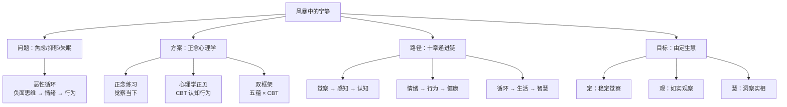

---

## 分图 1：恶性循环——焦虑/抑郁/失眠的共同根源

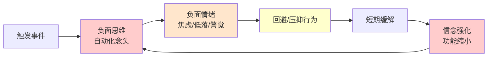

---

## 分图 2：正念心理学的双支柱

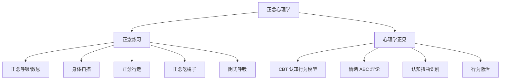

---

## 分图 3：五蕴模型 × CBT 双框架对照

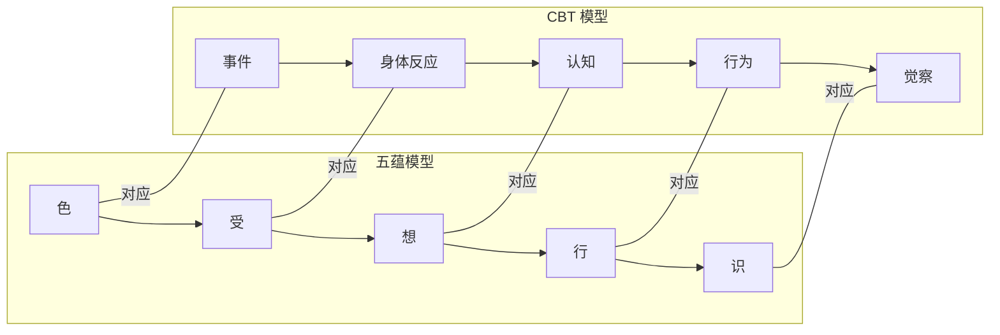

---

## 分图 4：十章递进链——逐环破解恶性循环

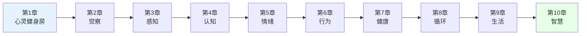

---

## 分图 5：情绪的两支箭

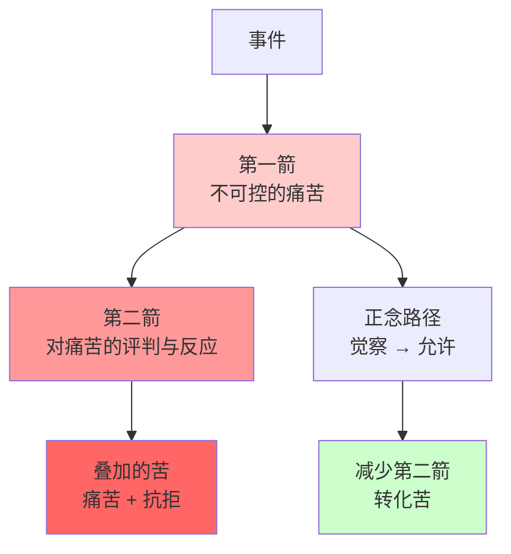

---

## 分图 6：行为转化——从回避到接纳行动

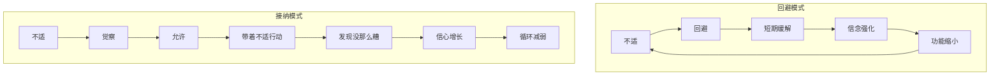

---

## 分图 7：正念助眠——打破失眠恶性循环

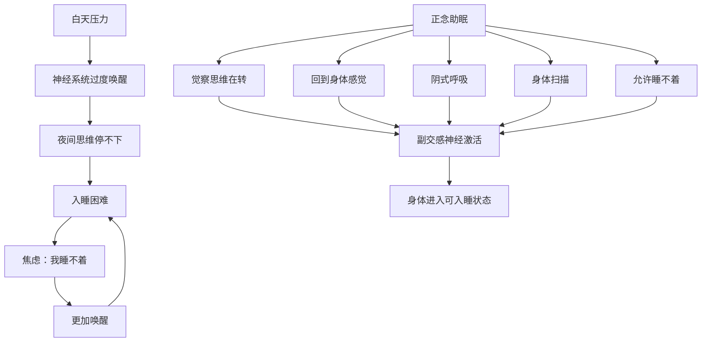

---

## 分图 8：行动模式 vs 存在模式

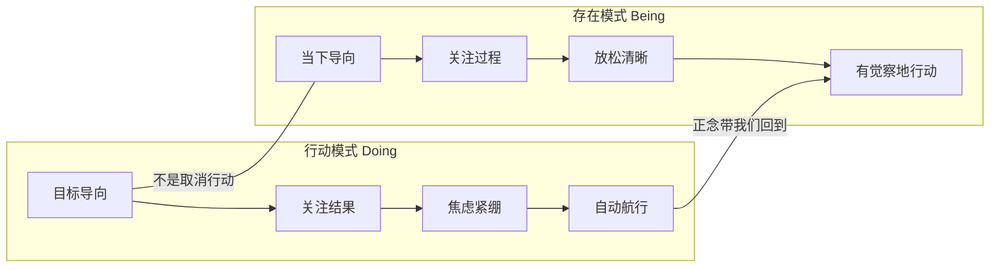

---

## 分图 9：由定生慧

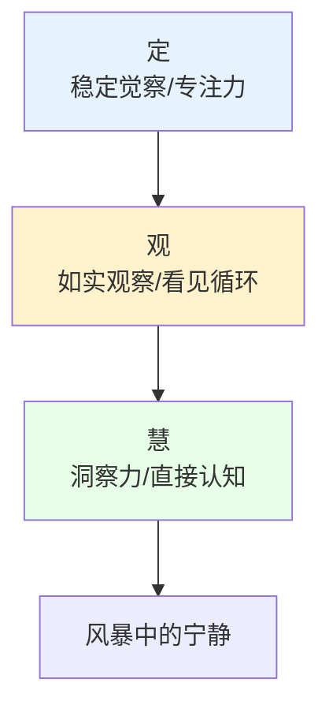

---

## 分图 10：作者背景与方法论形成

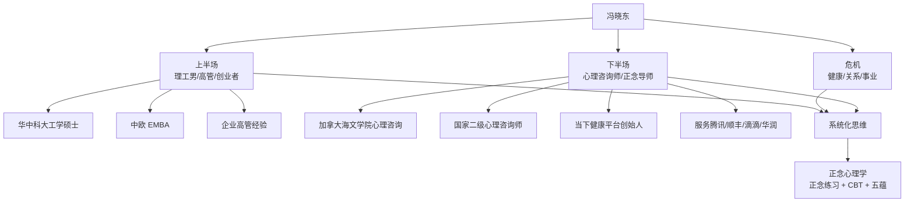

---

## 分图 11：全书核心概念地图

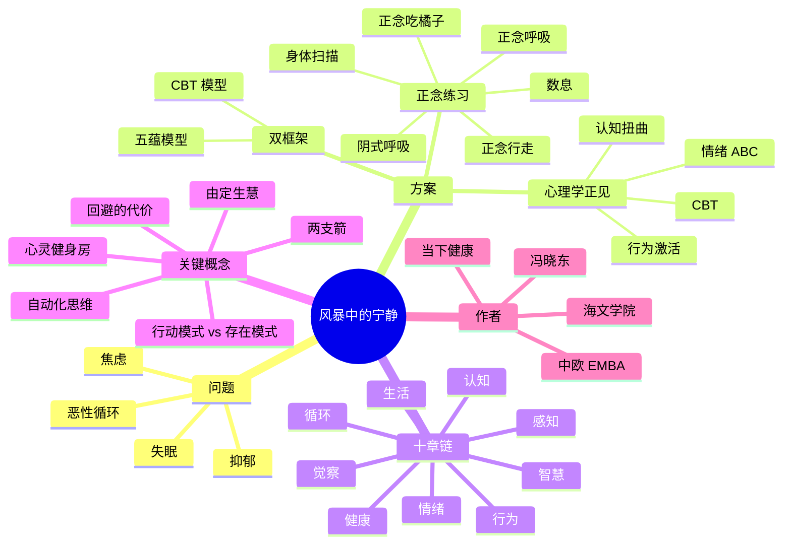

---

## 使用说明

1. **复制整块代码**：点击图表右上角的复制按钮，或选中 ```mermaid 到 ``` 之间的内容。
2. **粘贴到支持 Mermaid 的环境**：Obsidian、Notion、GitHub、MkDocs（配 mermaid 插件）、Typora 等。
3. **根据现场需要删减**：20 分钟分享推荐用「总图 + 分图 1/2/4/9」；60 分钟分享可展开全部。

---

*返回 [INDEX](INDEX.md) · 主持稿见 [12-20分钟主持稿](12-20分钟主持稿.md) · 全书框架见 [06-速读全景](06-速读全景.md)*
