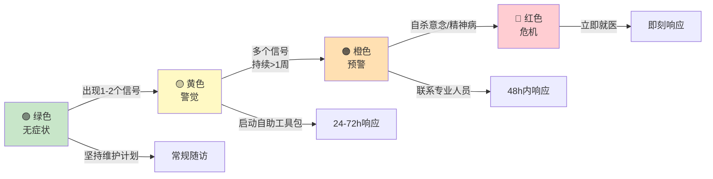

# Depression Early Warning Signals (抑郁症早期预警信号识别)

> **抑郁症早期预警信号 (Early Warning Signals of Depression)**
>
> *"复发不是一夜之间发生的，它是一系列微小信号被忽略后的累积。学会阅读这些信号，就是夺回主动权的第一步。"*
> *"Relapse does not happen overnight; it is the accumulation of small signals that were missed. Learning to read these signals is the first step to reclaiming agency."*
>
> 早期识别抑郁发作的前驱症状（prodromal symptoms）可将干预窗口提前数周至数月。本文档建立系统化的信号识别、监测与响应体系，服务于患者自我监测、家属觉察及临床预警。

---

## 1. 核心概念 (Core Concepts)

### 表1.1 前驱期与预警信号术语定义

| 术语 (中文) | 英文 | 定义 | 持续时间 | 临床意义 |
|---|---|---|---|---|
| **前驱期** | Prodromal Phase | 抑郁全面发作前出现亚临床症状的阶段 | 数天至数月 | 干预的黄金窗口期 |
| **早期预警信号** | Early Warning Signal (EWS) | 可预测抑郁发作或恶化的可观察变化 | 数小时至数周 | 触发预防性干预的指标 |
| **触发因素** | Trigger / Precipitant | 直接诱发症状加重的生活事件或生物变化 | 急性或慢性 | 帮助理解信号出现的背景 |
| **前驱症状** | Prodromal Symptom | 前驱期出现的具体症状表现 | 持续存在 | 与既往发作模式高度相关 |
| **微小信号** | Subtle Sign | 早期不易察觉的行为、认知或生理变化 | 短暂或持续 | 需要高度自我觉察才能识别 |
| **红旗信号** | Red Flag | 提示即将严重恶化的强烈信号 | 急性 | 需立即升级干预 |

### 表1.2 预警信号 vs 正常情绪波动

| 维度 | 正常情绪波动 | 抑郁预警信号 |
|---|---|---|
| **持续时间** | 数小时至1-2天 | ≥3-5天，且持续存在 |
| **强度** | 中等；可控 | 显著；难以自我调节 |
| **功能影响** | 轻微；不影响日常职责 | 可观察到工作效率、社交或自理能力下降 |
| **模式** | 与情境匹配；可解释 | 与情境不成比例；或无明显诱因 |
| **恢复力** | 通过休息、社交、活动可恢复 | 常规应对策略失效 |
| **认知内容** | 具体情境相关 | 泛化至自我、世界、未来（贝克三联征） |
| **躯体变化** | 轻微或无明显变化 | 睡眠、食欲、精力出现可观察变化 |

---

## 2. 早期预警信号分类体系 (Taxonomy of Early Warning Signals)

### 2.1 情绪维度信号 (Emotional Signals)

| 信号 | 具体表现 | 严重度分级 | 出现频率（复发患者中） | 识别难度 |
|---|---|---|---|---|
| **情绪低落加重** | 悲伤、空虚、绝望感增加；「心里堵」 | 🟡→🔴 | 90%+ | 低 |
| **易激惹性增高** | 小事即怒；对他人不耐烦；脾气变差 | 🟡 | 60-70%（尤其青少年/男性） | 中 |
| **焦虑感增强** | 莫名的紧张、担心；「总觉得有坏事要发生」 | 🟡 | 50-60% | 低 |
| **情绪麻木** | 对任何事物都「没感觉」；情感隔离 | 🟡→🔴 | 40-50% | 高 |
| **快感减退加重** | 原本喜欢的活动不再带来愉悦 | 🟡→🔴 | 80%+ | 中 |
| **内疚感泛化** | 为小事过度自责；觉得对不起所有人 | 🟡 | 50-60% | 中 |
| **绝望感** | 「不会好的」「没救了」的念头频繁出现 | 🔴 | 40-50% | 低 |
| **情感脆弱** | 容易哭；看普通新闻/电影也流泪 | 🟡 | 40-50% | 低 |

### 2.2 认知维度信号 (Cognitive Signals)

| 信号 | 具体表现 | 严重度分级 | 出现频率 | 识别难度 |
|---|---|---|---|---|
| **注意力下降** | 读不进书；看电影走神；工作效率降低 | 🟡 | 80%+ | 中 |
| **决策困难** | 连「吃什么」「穿什么」都难决定 | 🟡 | 60-70% | 中 |
| **记忆力减退** | 忘事增多；刚放的东西找不到 | 🟡 | 50-60% | 中 |
| **反刍思维加重** | 反复想同一件负面的事；停不下来 | 🟡→🔴 | 70-80% | 高（对自己而言） |
| **负性自我对话** | 脑中批评自己的声音变多、变强 | 🟡 | 70-80% | 高 |
| **悲观预期** | 对未来预期全面负面；看不到希望 | 🟡→🔴 | 60-70% | 中 |
| **认知速度减慢** | 脑子像「生锈」；反应变慢 | 🟡 | 40-50% | 高 |
| **自我评价降低** | 「我没用」「我是负担」的想法增加 | 🟡→🔴 | 60-70% | 中 |
| **自杀意念萌芽** | 「不想活了」「睡着了别醒」的念头闪过 | 🔴 | 20-30% | 高（患者常隐藏） |

### 2.3 行为维度信号 (Behavioral Signals)

| 信号 | 具体表现 | 严重度分级 | 出现频率 | 识别难度 |
|---|---|---|---|---|
| **社交退缩** | 回避邀约；回消息变慢；不想见人 | 🟡 | 80%+ | 低（他人易观察） |
| **活动减少** | 取消计划；待在家时间增加；兴趣活动停止 | 🟡→🔴 | 80%+ | 低 |
| **拖延加重** | 任务堆积；连简单事务也拖延 | 🟡 | 70-80% | 中 |
| **自我照顾下降** | 不洗澡；不换衣服；不收拾房间 | 🟡→🔴 | 60-70% | 低（他人易观察） |
| **屏幕时间增加** | 无目的刷手机；看视频/打游戏时间剧增 | 🟡 | 60-70% | 中 |
| **睡眠行为改变** | 熬夜；赖床；白天睡觉；作息混乱 | 🟡→🔴 | 80%+ | 低 |
| **食欲行为改变** | 暴饮暴食或进食明显减少；不规律用餐 | 🟡 | 50-60% | 中 |
| **酒精/物质使用增加** | 借酒消愁；依赖镇静类物质助眠 | 🟡→🔴 | 20-30% | 高 |
| **坐立不安或迟缓** | 不停走动、搓手；或动作明显变慢 | 🟡 | 30-40% | 低 |
| **回避责任** | 请假增多；推卸工作任务；逃避家庭职责 | 🟡→🔴 | 50-60% | 低 |

### 2.4 躯体维度信号 (Somatic Signals)

| 信号 | 具体表现 | 严重度分级 | 出现频率 | 识别难度 |
|---|---|---|---|---|
| **疲劳感加重** | 睡醒了还是累；做一点事就 exhausted | 🟡 | 90%+ | 低 |
| **睡眠问题** | 入睡困难；早醒（比平时早2+小时）；多梦；嗜睡 | 🟡→🔴 | 80%+ | 低 |
| **不明原因疼痛** | 头痛；背痛；肌肉酸痛；胃肠不适 | 🟡 | 40-50% | 高（易归因躯体疾病） |
| **消化问题** | 食欲改变；恶心；便秘/腹泻；胃部不适 | 🟡 | 40-50% | 高 |
| **性欲下降** | 对性失去兴趣；性功能变化 | 🟡 | 40-50% | 高（常不主动提及） |
| **体重变化** | 短期内体重明显增减（>5%/月） | 🟡 | 30-40% | 低 |
| **感官敏感** | 对光、声音、气味异常敏感 | 🟡 | 20-30% | 高 |
| **免疫力下降** | 容易感冒；小伤口愈合慢 | 🟡 | 20-30% | 高 |

### 2.5 功能维度信号 (Functional Signals)

| 信号 | 具体表现 | 严重度分级 | 出现频率 | 识别难度 |
|---|---|---|---|---|
| **工作效率下降** | 完成任务时间增加；错误增多；创造力下降 | 🟡 | 80%+ | 中 |
| **学业表现下滑** | 成绩下降；缺课增多；无法完成作业 | 🟡 | 60-70%（学生群体） | 低 |
| **家庭功能受损** | 不愿参与家庭活动；与伴侣/子女互动减少 | 🟡→🔴 | 60-70% | 中 |
| **财务管理疏忽** | 账单忘记付；冲动消费或过度节省 | 🟡 | 30-40% | 高 |
| **个人卫生下降** | 刷牙、洗脸、洗澡频率降低 | 🟡→🔴 | 50-60% | 低 |

---

## 3. 个人预警信号图谱构建 (Personal Warning Signal Map)

每个人的预警信号模式具有**高度个体特异性**，与既往发作模式高度一致。构建个人图谱是复发预防的核心。

### 表3.1 个人预警信号图谱模板

| 维度 | 我的典型预警信号 | 出现顺序（1=最早） | 严重程度（1-10） | 持续时间 | 触发因素 |
|---|---|---|---|---|---|
| **情绪** | _________________ | ___ | ___ | ___ | _________________ |
| **认知** | _________________ | ___ | ___ | ___ | _________________ |
| **行为** | _________________ | ___ | ___ | ___ | _________________ |
| **躯体** | _________________ | ___ | ___ | ___ | _________________ |
| **功能** | _________________ | ___ | ___ | ___ | _________________ |

### 表3.2 信号出现顺序的常见模式

| 模式类型 | 描述 | 典型顺序 | 人群特点 |
|---|---|---|---|
| **睡眠先行型** | 睡眠问题是最早信号 | 睡眠 → 疲劳 → 情绪低落 → 社交退缩 | 高压力职业人群；既往有失眠史 |
| **情绪先行型** | 情绪波动最先出现 | 情绪低落 → 认知负性 → 行为退缩 → 躯体症状 | 高情绪觉察者；女性较多 |
| **躯体先行型** | 身体症状最先出现 | 疲劳/疼痛 → 睡眠改变 → 情绪变化 → 功能下降 | 男性；躯体化倾向；医疗从业者 |
| **认知先行型** | 思维变化最先出现 | 反刍加重 → 注意力下降 → 决策困难 → 情绪恶化 | 高认知需求职业；既往有焦虑史 |
| **应激触发型** | 与生活事件高度关联 | 应激事件 → 3-7天后情绪/睡眠变化 → 症状全面化 | 情境性抑郁；适应困难者 |
| **隐匿渐进型** | 信号微弱、缓慢累积 | 微小变化（逐渐减活动）→ 数周后突然崩溃 | 完美主义；高功能抑郁 |

> **构建方法**：回顾既往发作前1-3个月，列出当时最先出现的3-5个变化。通常个人模式在不同发作间具有高度一致性。

---

## 4. 触发因素识别 (Trigger Identification)

### 表4.1 常见触发因素分类

| 类别 | 具体触发因素 | 影响机制 | 时间延迟 | 可预见性 |
|---|---|---|---|---|
| **人际关系** | 冲突、分离、丧亲、孤独感、被批评 | 依恋激活、社会支持丧失 | 数天至数周 | 部分可预见 |
| **工作/学业** | deadline、失败、失业、过度负荷、角色转变 | 自我效能威胁、慢性应激 | 数天至数月 | 部分可预见 |
| **健康相关** | 躯体疾病、手术、慢性疼痛、药物变化 | 炎症、HPA轴激活、功能丧失 | 数天至数周 | 部分可预见 |
| **生理节律** | 季节变化（秋冬）、昼夜节律紊乱、睡眠不足 | 褪黑素、5-HT、光照 | 数周 | 高度可预见 |
| **激素变化** | 月经周期、产后、更年期、甲状腺功能波动 | 雌激素/孕激素/甲状腺素影响神经递质 | 数天至数周 | 部分可预见 |
| **生活变迁** | 搬家、结婚、离婚、生育、退休 | 社会角色变化、适应需求 | 数周至数月 | 可预见 |
| ** Anniversary 反应** | 既往创伤/丧失的周年日期 | 情境性记忆激活 | 特定日期前后 | 高度可预见 |
| **物质/药物** | 酒精使用、药物减停（尤其抗抑郁药）、咖啡因过量 | 神经递质波动、戒断反应 | 数小时至数天 | 可控制 |
| **积极事件** | 升职、结婚、度假结束 | 「应该快乐」的压力、角色变化 | 数天至数周 | 可预见但常被忽视 |

> **临床要点**：积极事件也可能触发抑郁（如「应该快乐」的认知压力、角色转变的适应需求），这在临床中常被忽略。

---

## 5. 预警监测工具与方法 (Monitoring Tools & Methods)

### 表5.1 标准化监测工具

| 工具 | 用途 | 频率 | 完成时间 | 预警切点 |
|---|---|---|---|---|
| **PHQ-9** | 症状严重度追踪 | 每周 | 2-3分钟 | 较基线升高 ≥ 5 分；或总分 ≥ 10 |
| **QIDS-SR-16** | 症状域详细追踪 | 每2周 | 5-7分钟 | 较基线升高 ≥ 4 分 |
| **Altman 自评躁狂量表 (ASRM)** | 排除转躁（尤其双相） | 每周 | 2分钟 | ≥ 6 分提示可能转躁 |
| **睡眠日记** | 睡眠模式监测 | 每日 | 2分钟 | 睡眠效率 < 85%；早醒 > 30分钟 |
| **活动-情绪日志** | 行为与情绪关联 | 每日 | 每次5分钟 | 愉悦活动减少 50%+ |
| **反刍反应量表 (RRS)** | 反刍思维追踪 | 每月 | 5分钟 | 较基线升高 ≥ 20% |
| **C-SSRS (简化版)** | 自杀风险筛查 | 每周 | 2分钟 | 任何主动意念或计划 |

### 表5.2 简易自我监测法（无工具版）

| 监测法 | 操作 | 预警标准 | 优势 |
|---|---|---|---|
| **红绿灯法** | 每日睡前评估：今天整体是绿/黄/红？ | 连续3天「黄」或任何「红」 | 极简；可持续 |
| **1-10 评分法** | 对情绪、精力、睡眠、社交分别打分 | 任一项连续3天下降 ≥ 2 分 | 多维；敏感 |
| **里程碑法** | 标记过去一周完成的日常活动数量 | 较正常周减少 ≥ 30% | 功能导向 |
| **他人观察法** | 请信任的人每周给予反馈 | 他人报告明显变化 | 弥补自我觉察盲区 |
| **身体扫描法** | 每晚快速扫描身体紧张/不适感 | 新出现或加重的躯体症状 | 识别躯体化信号 |

### 表5.3 数字化监测工具

| 工具类型 | 代表产品 | 监测维度 | 预警功能 | 隐私注意 |
|---|---|---|---|---|
| **情绪追踪APP** | Daylio、eMoods、Moodnotes | 情绪、活动、症状、药物 | 趋势提醒；导出报告 | 数据存储位置 |
| **可穿戴设备** | Apple Watch、Fitbit、Garmin | 心率变异性 (HRV)、睡眠、活动 | HRV持续下降；睡眠质量恶化 | 数据所有权 |
| **睡眠追踪** | Sleep Cycle、Pillow | 睡眠阶段、效率、节律 | 睡眠效率持续下降 | 床边放置 |
| **语音分析** | 部分研究级APP | 语速、语调、词汇选择 | 声学特征变化（研究阶段） | 高度敏感 |

---

## 6. 预警-应对匹配预案 (Signal-Response Matching Protocol)

### 表6.1 分级响应系统



| 级别 | 信号特征 | 响应策略 | 时间框架 | 责任人 |
|---|---|---|---|---|
| **绿色 (维持)** | 无症状或轻微波动；功能正常 | 坚持日常维护计划；常规随访 | 持续 | 本人 |
| **黄色 (警觉)** | 出现1-2个早期信号；功能轻微下降 | **启动自助工具包**；增加监测频率（每日）；联系信任的人；调整生活方式 | 24-72小时 | 本人 |
| **橙色 (预警)** | 多个信号同时出现；功能明显下降；持续 > 1周 | **联系专业人员**；预约医生/治疗师；加强心理会谈；启动家属支持；考虑药物调整 | 48小时内 | 本人 + 专业人员 |
| **红色 (危机)** | 自杀意念；严重功能丧失；精神病性症状 | **立即就医**；24小时陪伴；启动安全计划；考虑急诊/住院 | 即刻 | 专业人员 + 家属 |

### 表6.2 信号-干预匹配速查表

| 预警信号 | 即时自助干预 | 短期加强策略 | 专业干预 |
|---|---|---|---|
| 情绪低落加重 | 三分钟呼吸空间；接触自然；听愉悦音乐 | 增加愉悦活动；联系朋友；正念练习 | 心理治疗会谈；评估药物 |
| 反刍思维加重 | 设定「反刍时间」限制；转移注意力活动 | 思维记录表；正念去中心化；行为激活 | CBT；正念治疗；药物调整 |
| 睡眠恶化 | 睡眠卫生；放松训练；限制床上时间 | CBT-I；光照管理；运动调整 | 睡眠专科；药物辅助 |
| 社交退缩 | 「最小社交剂量」强制联系；简短外出 | 社交技能练习；支持小组；陪伴活动 | IPT；团体治疗 |
| 疲劳加重 | 短暂休息；极轻度活动（5分钟） | 检查睡眠/营养/运动；调整任务负荷 | 医学检查；评估药物副作用 |
| 自杀意念萌芽 | **立即联系信任的人；移除危险物品** | 安全计划；增加监测；减少独处 | **紧急联系医生/危机热线；评估住院** |
| 工作/学业效率下降 | 任务分解至最小单元；番茄工作法 | 与上级/老师沟通；调整期望；寻求支持 | 职业康复；心理治疗；必要时休假 |
| 食欲明显改变 | 规律进餐时间；准备易食食物 | 营养评估；饮食日记；正念饮食 | 营养师；评估进食障碍 |
| 不明原因疼痛 | 轻度拉伸；热敷；放松 | 医学检查排除躯体疾病；疼痛心理教育 | 疼痛专科；整合医学 |
| 物质使用增加 | 限制获取；寻找替代活动 | 物质戒断支持；动机访谈；团体 | 成瘾专科；整合治疗 |

---

## 7. 家属与支持者识别指南 (Guide for Family & Supporters)

### 表7.1 家属可观察的早期信号

| 观察维度 | 具体信号 | 识别难度 | 家属行动 |
|---|---|---|---|
| **日常行为** | 起床时间变晚/变早；不洗漱；房间变乱；不吃饭 | 低 | 温和询问；不指责；提供帮助 |
| **社交模式** | 不回消息；回避家庭聚会；电话减少；闭门不出 | 低 | 保持联系；不强迫社交；表达关心 |
| **情绪表达** | 叹气增多；易怒；沉默寡言；莫名哭泣；表情减少 | 中 | 倾听为主；不急于给建议；确认感受 |
| **兴趣爱好** | 停止以往爱好；对宠物/植物疏于照料；取消计划 | 中 | 邀请参与低压力活动；不施压 |
| **工作/学业** | 抱怨变多；请假增多；提到「跟不上」；拖延 | 中 | 询问是否需要帮助；协助沟通 |
| **言语内容** | 「好累」「没意思」「睡不着」；自我贬低增多；提到死亡 | 低→🔴 | 直接询问自杀意念；联系专业人员 |
| **生理变化** | 体重明显变化；面容疲惫；行动迟缓/坐立不安 | 低 | 关心健康；建议体检 |
| **物质使用** | 饮酒增多；吸烟增加；依赖助眠物质 | 中 | 温和关注；不道德评判 |

### 表7.2 家属支持行动指南

| 情境 | 建议做法 | 避免做法 |
|---|---|---|
| **发现信号** | 温和表达观察：「我注意到你最近似乎不太开心，想聊聊吗？」 | 指责：「你怎么又这样」；忽视：「别想太多」 |
| **对方不愿谈** | 表达可及性：「我随时在，你想说的时候我都在」 | 强迫交谈；反复追问 |
| **听到消极想法** | 验证感受：「这听起来真的很痛苦」 | 否认感受：「你应该想开点」 |
| **功能下降** | 提供具体帮助：「我帮你把饭菜热好」 | 代替所有事务（剥夺掌控感） |
| **怀疑自杀风险** | **直接询问**：「你有想过伤害自己吗？」 | 回避话题；害怕提问会「植入想法」 |
| **确认自杀意念** | 不独处；移除危险物品；立即联系专业人员 | 承诺保密；独自承担 |
| **鼓励就医** | 提供信息；陪伴就诊；减少就医障碍 | 强迫；威胁；代替决策 |
| **长期陪伴** | 设定界限（保护自己）；寻求自身支持；了解疾病知识 | 完全牺牲自我；过度卷入 |

> **重要**：家属的焦虑和压力会传递给患者。家属也需要自己的支持系统（支持小组、心理咨询、喘息服务）。

---

## 8. 临床整合应用 (Clinical Integration)

### 表8.1 临床预警系统构建

| 层级 | 实施内容 | 执行者 | 频率 |
|---|---|---|---|
| **患者自评** | PHQ-9 + 个人预警信号清单 + 睡眠日记 | 患者 | 每日/每周 |
| **家属观察** | 信号观察清单 + 功能评估 | 家属 | 每周 |
| **治疗师评估** | 症状访谈 + 功能评估 + 反刍/认知评估 | 治疗师 | 每次会谈 |
| **医生监测** | 症状量表 + 药物副作用 + 躯体检查 | 精神科医生 | 每次复诊 |
| **系统整合** | 多源数据汇总；趋势分析；预警算法 | 团队 | 持续 |

### 表8.2 预警响应临床决策树

```
患者报告预警信号
       │
       ▼
┌──────────────────┐
│ 评估严重度与功能  │
└──────────────────┘
       │
   ┌───┴───┐
   ▼       ▼
轻度       中度/重度
   │       │
   ▼       ▼
强化自助   联系专业人员
+ 监测     │
           ├── 调整心理治疗频率
           ├── 评估药物依从性/调整
           ├── 强化社会支持
           └── 必要时：危机干预/住院
```

---

*本文档为 Peace Lab Database 抑郁早期预警信号识别专项资料。*
*早期预警是复发预防的第一道防线。信号本身不可怕，被忽略才可怕。*
*如有自杀意念或严重症状恶化，请立即寻求专业帮助。*

---

*Created by Peace Lab Database Project*
*Author: Allen Galler (allengaller@gmail.com)*

## 交叉引用 | Cross References

| 关联主题 | 所在支柱 | 链接 | 关联维度 |
|---------|---------|------|--------|
| 抑郁症概览 | 02-心理 | [Depression Overview](临床-抑郁-Depression_Overview.md) | 诊断标准、症状学 |
| 抑郁复发预防 | 02-心理 | [Relapse Prevention](临床-抑郁-Depression_Relapse_Prevention.md) | 预警响应与干预 |
| 轻中度抑郁自助 | 02-心理 | [Self-Help Guide](临床-抑郁-Depression_Self_Help_Guide.md) | 信号出现后的自助策略 |
| 抑郁症治疗 | 02-心理 | [Depression Treatment](临床-抑郁-Depression_Treatment.md) | 药物与心理治疗 |
| 正念认知疗法 | 02-心理 | [MBCT](../../../疗法/整合疗法/正念认知疗法/INDEX.md) | 觉察训练 |
| 行为激活 | 02-心理 | [Behavioral Activation](../../行为心理/抗拖延/行为心理-抗拖延-Behavioral_Activation.md) | 行为监测 |
| 失眠CBT-I | 02-心理 | [CBT-I](../../躯体身心/睡眠/INDEX.md) | 睡眠信号干预 |
| 职业倦怠 | 02-心理 | [Burnout](../../应用心理/职业倦怠/INDEX.md) | 职场触发因素 |
| 慢性压力 | 02-心理 | [Chronic Stress](../../压力与HPA轴/慢性压力/INDEX.md) | 应激与信号 |
| 危机评估 | 02-心理 | [Crisis Assessment](../危机评估/INDEX.md) | 自杀风险评估 |

---

## 📞 危机干预资源 | Crisis Resources

> **如果您或您认识的人正在经历心理危机或有自杀念头,请立即寻求帮助。**

### 中国大陆

| 资源 | 联系方式 |
|---|---|
| 北京心理危机研究与干预中心 | **010-82951332** (24小时) |
| 全国心理援助热线 | **400-161-9995** (24小时) |
| 希望24热线 | **400-161-9995** (24小时) |
| 生命热线 | **400-821-1215** (24小时) |

### 国际

| 地区 | 资源 | 联系方式 |
|---|---|---|
| 🇺🇸 美国 | 988 Suicide & Crisis Lifeline | **988** (24/7) |
| 🇬🇧 英国 | Samaritans | **116 123** (24/7) |
| 🇭🇰 香港 | 撒玛利亚防止自杀会 | **2389-0000** |
| 🇹🇼 台湾 | 生命线 | **1995** |

**完整资源列表**:[_meta/docs/CRISIS_RESOURCES.md](../../../../_meta/docs/CRISIS_RESOURCES.md)

**全球资源**:[Befrienders Worldwide](https://www.befrienders.org) | [WHO 心理健康](https://www.who.int/health-topics/mental-health)

