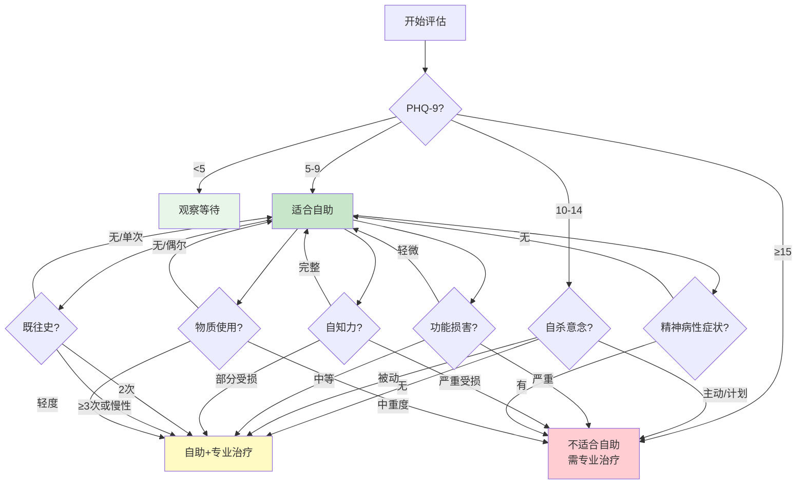

# Depression Self-Help Guide (轻中度抑郁自助管理指南)

> **轻中度抑郁自助管理 (Self-Help for Mild-to-Moderate Depression)**
>
> *"自助不是独自承担，而是在专业支持之外，为自己搭建一座 daily 的救生桥。"*
> *"Self-help is not bearing the burden alone; it is building a daily bridge for yourself alongside professional support."*
>
> 本指南面向轻中度抑郁（PHQ-9 ≤ 14）及缓解期患者，整合循证自助策略。需注意：自助不能替代专业治疗，中重度抑郁或伴有自杀风险者必须寻求专业帮助。

---

## ⚠️ 安全声明与适用边界 (Safety Declaration & Boundaries)

### 表0.1 自助适用性快速评估

| 评估维度 | 适合自助 | 需谨慎并配合专业治疗 | 不适合自助，需立即就医 |
|---|---|---|---|
| **PHQ-9 分数** | 5-9（轻度） | 10-14（中度） | ≥15 或快速升高 |
| **自杀意念** | 无 | 被动意念（"不想活了"） | 主动意念/计划/手段 |
| **功能损害** | 轻微；能维持基本生活 | 中等；工作效率明显下降 | 严重；无法工作/自理 |
| **自知力** | 完整；能主动寻求帮助 | 部分受损 | 严重受损；否认有病 |
| **支持系统** | 良好 | 一般 | 孤立无援 |
| **既往史** | 无或单次发作 | 2次发作 | ≥3次发作或慢性化 |
| **精神病性症状** | 无 | 无 | 有（幻觉/妄想） |
| **物质使用** | 无/偶尔 | 轻度依赖 | 中重度依赖 |

> **核心原则**：自助是「辅助」而非「替代」。任何自助方案实施前，建议先由精神科医生或临床心理师评估确认适用性。

---

## 1. 行为激活自助方案 (Behavioral Activation Self-Help)

行为激活（BA）是轻中度抑郁循证最强的心理自助技术，其核心假设：**抑郁不是先有低落情绪才不想动，而是先停止活动才导致情绪低落**。

### 表1.1 行为激活核心步骤

| 步骤 | 行动 | 具体操作 | 时间 | 预期效果 |
|---|---|---|---|---|
| **Step 1: 活动监测** | 记录当前活动与情绪 | 使用活动-情绪日志，每小时记录所做之事和情绪评分（0-10） | 1周 | 识别"抑郁陷阱"活动（如躺床刷手机）和"提升活动" |
| **Step 2: 愉悦/掌控评估** | 评估活动的愉悦感和掌控感 | 对每项活动打分：愉悦感（P）0-10，掌控感（M）0-10 | 同步 | 发现被忽略的正向活动 |
| **Step 3: 活动计划** | 安排提升情绪的活动 | 每日安排2-3项"提升活动"，优先低门槛、高愉悦/掌控比的活动 | 持续 | 重建"行动→奖赏"循环 |
| **Step 4: 渐进实施** | 从小步骤开始 | 将任务分解至"最低可行行动"（如「刷牙」而非「整理房间」） | 持续 | 降低启动阻力，积累成就感 |
| **Step 5: 行为实验** | 验证预测 vs 实际 | 行动前预测「我觉得这不会有用」，行动后记录实际结果 | 每次 | 打破「什么都无用」的负性预期 |
| **Step 6: 维持与扩展** | 固化新行为模式 | 将有效活动固化为日常习惯，逐步扩展活动范围 | 长期 | 建立抗抑郁的生活方式基础 |

### 表1.2 行为激活活动库（按能量需求分级）

| 能量等级 | 活动示例 | 预期愉悦/掌控感 | 适用情境 |
|---|---|---|---|
| **极低能量** (躺床也能做) | 深呼吸5次；听一首喜欢的歌；喝一口温水；给植物浇水；开窗通风 | P: 3-5, M: 4-6 | 严重无力感；连起床都困难时 |
| **低能量** (可坐着/短时间) | 晒太阳10分钟；简单拉伸；整理桌面一角；给亲友发一条消息；看一页书 | P: 4-6, M: 5-7 | 动力缺乏；注意力短暂 |
| **中等能量** (需移动/轻度体力) | 散步15-20分钟；做一顿简单饭；洗一个热水澡；整理衣物；听播客/有声书 | P: 5-7, M: 6-8 | 有一定行动力；想改善状态 |
| **中高能量** (需专注/社交) | 与朋友见面聊天；完成一项工作任务；运动30分钟；学习新技能30分钟；户外活动 | P: 6-8, M: 7-9 | 症状较轻；功能部分恢复 |
| **高能量** (挑战/成就) | 参加社交活动；完成拖延的重要任务；创造性活动（绘画/写作）；志愿服务 | P: 7-9, M: 8-10 | 缓解期；希望重建生活意义 |

### 表1.3 常见「抑郁陷阱」与替代策略

| 抑郁陷阱 | 短期感受 | 长期后果 | 替代策略 |
|---|---|---|---|
| **床上刷手机** | 麻木、逃避 | 昼夜节律紊乱、自责加重 | 设屏幕时间限制；手机放另一个房间；用有声书替代短视频 |
| **社交回避** | 暂时减少焦虑 | 孤立加剧、社会支持流失 | 设定「最小社交剂量」（如每周1次简短联系） |
| **拖延重要任务** | 暂时减压 | 任务堆积、自我效能下降 | 「2分钟原则」：先做2分钟；或「最低可行任务」 |
| **过度睡眠/赖床** | 暂时舒适 | 昼夜节律崩溃、精力更差 | 固定起床时间；起床后立即接触阳光；床铺仅用于睡眠 |
| **消极反刍** | 短暂「理解感」 | 情绪恶化、认知功能下降 | 设定「反刍时间」限制；转移注意力活动；正念练习 |
| **酒精/物质使用** | 短暂麻痹 | 情绪反弹、依赖形成、药物相互作用 | 寻找替代性应对策略；必要时寻求戒断支持 |

---

## 2. 认知重构自助技术 (Cognitive Restructuring Self-Help)

### 表2.1 抑郁常见认知偏差识别

| 认知偏差 | 定义 | 典型思维 | 现实检验提问 |
|---|---|---|---|
| **全或无思维** | 非黑即白，无中间地带 | "要么完美，要么失败" | "有没有部分成功的地方？" |
| **灾难化** | 预期最坏结果 | "这次搞砸了，我人生完了" | "最坏情况发生的概率有多大？" |
| **过度概括** | 一次失败推导全面否定 | "我总是搞砸一切" | "有没有例外情况？" |
| **心理过滤** | 只看消极面，忽略积极面 | "同事表扬了所有人，除了我" | "积极的部分被我忽略了吗？" |
| **贬低积极** | 将成就归为偶然/不重要的 | "我只是运气好" | "运气能解释全部吗？我的努力在哪？" |
| **读心术** | 假设知道他人负面想法 | "他们觉得我很没用" | "我有证据吗？有没有其他解释？" |
| **情绪推理** | 因为感觉糟，所以认定事实糟 | "我感觉绝望，所以情况真的无望" | "感觉等于事实吗？过去的感觉变过吗？" |
| **应该陈述** | 用苛刻标准要求自己 | "我应该做得更好" | "这个标准合理吗？我对朋友也会这样要求吗？" |
| **贴标签** | 以单一事件定义整体自我 | "我是个失败者" | "一次事件能定义整个人吗？" |
| **个人化** | 将无关事件归责于自己 | "朋友不高兴，一定是因为我" | "还有其他可能原因吗？" |

### 表2.2 自助认知重构步骤（思维记录表）

| 步骤 | 操作 | 示例 |
|---|---|---|
| **1. 情境** | 发生了什么？何时？何地？ | 周五下午，老板在会议上没采纳我的提案 |
| **2. 自动思维** | 当时脑中闪过的想法是什么？ | "我能力太差了" "我不适合这份工作" |
| **3. 情绪** | 伴随什么情绪？强度 0-100% | 沮丧 80%；焦虑 60%；羞耻 70% |
| **4. 证据支持** | 支持这个想法的证据有哪些？ | 这次提案确实没被采纳 |
| **5. 证据反对** | 反对这个想法的证据有哪些？ | 过去3个提案被采纳了；老板事后说「这个方向不错，只是预算不够」 |
| **6. 替代思维** | 更平衡、现实的想法是什么？ | "这次提案因预算限制未通过，不代表我能力差。我在数据分析部分得到了认可。" |
| **7. 再评情绪** | 现在情绪强度 0-100% | 沮丧 40%；焦虑 30%；羞耻 20% |
| **8. 行动计划** | 基于新想法，下一步做什么？ | 向老板确认预算范围；调整方案后再次提交 |

> **练习建议**：初期每天完成1-2份思维记录表，连续2周后可逐渐内化为自动思维习惯。

### 表2.3 针对抑郁核心信念的自助策略

| 核心信念 | 典型表达 | 形成来源 | 松动策略 | 替代信念 |
|---|---|---|---|---|
| **无价值感** | "我不值得被爱" | 早期忽视/批评 | 列出自己的优点清单；记录他人对自己的善意 | "我有价值，像所有人一样值得尊重" |
| **无助感** | "我做什么都没用" | 反复失败经验 | 行为实验：做小任务并记录结果；回顾过去的成功 | "我的行动可以产生影响，即使微小" |
| **无望感** | "未来不会变好" | 长期抑郁状态 | 回顾过去情绪波动的记录；注意「过去也以为不会好，但后来好了」 | "情绪会变化，就像天气变化一样" |

---

## 3. 正念与接纳自助练习 (Mindfulness & Acceptance Self-Help)

### 表3.1 抑郁适用的正念练习分级

| 练习 | 时长 | 难度 | 适用阶段 | 核心作用 | 操作要点 |
|---|---|---|---|---|---|
| **三分钟呼吸空间** | 3分钟 | 低 | 任何阶段 | 情绪调节、反刍打断 | 无论多糟，只需3分钟；可做简化版（1分钟） |
| **正念饮水/进食** | 5-10分钟 | 低 | 任何阶段 | 感官 grounding、去自动化 | 全神贯注于味道、温度、质地 |
| **身体扫描** | 15-30分钟 | 中 | 症状较轻时 | 内感受觉察、放松 | 不追求放松，只是觉察；困是正常的 |
| **正念步行** | 10-20分钟 | 低 | 任何阶段 | 运动 + 正念双重获益 | 慢速行走，觉察脚底触感、步伐节奏 |
| **去中心化练习** | 5-10分钟 | 中 | 有正念基础后 | 拉开与思维的距离 | "我注意到我有一个想法……" |
| **慈心冥想** | 10-15分钟 | 中 | 缓解期 | 自我关怀、减少自我攻击 | 从「愿我平安」开始，逐渐扩展 |

> **⚠️ 注意**：急性抑郁发作（PHQ-9 ≥ 20）时，正念可能加重反刍。此时应优先行为激活，待症状减轻后再引入正念。

---

## 4. 生活方式干预 (Lifestyle Interventions)

### 表4.1 循证生活方式干预一览

| 干预领域 | 具体建议 | 机制 | 证据等级 | 实施要点 |
|---|---|---|---|---|
| **运动** | 每周3-5次，每次30-45分钟中等强度有氧运动（快走、骑行、游泳） | BDNF↑；5-HT/DA/NE↑；抗炎；改善睡眠 | **A级** (Cochrane) | 从10分钟开始；优先上午（利用光照）；社交运动更佳 |
| **睡眠** | 固定起床时间；限制床上时间至实际睡眠时长+30分钟；睡前1小时无屏幕 | 昼夜节律稳定；皮质醇下降；GABA能增强 | **A级** | 床仅用于睡眠；避免白天补觉；失眠严重时优先CBT-I |
| **光照** | 早晨30分钟自然光暴露；白天保持明亮环境；夜间减少蓝光 | 褪黑素节律；5-HT合成；昼夜节律 | **A级** (季节性) | 阴天也有效；冬季可考虑光疗灯（10000 lux，30分钟） |
| **营养** | 地中海饮食模式；增加ω-3（深海鱼、亚麻籽）；维生素D检测补充；减少精制糖 | 抗炎；肠脑轴；神经递质前体 | **B级** | 渐进调整；勿极端节食；严重食欲不振时先保证热量 |
| **社交** | 每周至少1次面对面社交；主动联系至少1位信任的人；考虑支持小组 | 催产素；社会缓冲；减少孤独感 | **A级** | 不求深度，但求联系；从低压力社交开始 |
| **自然暴露** | 每周至少2次，每次20分钟以上自然环境接触（公园、绿地、水边） | 注意力恢复；皮质醇下降；sgPFC活动降低 | **A级** | 步行最佳；不追求运动强度；允许「什么都不做」 |
| **减少酒精** | 完全避免或严格限制 | 酒精是中枢抑制剂；干扰睡眠；与药物相互作用 | **A级** | 酒精可短暂麻痹但加重抑郁；戒断时可能出现暂时情绪波动 |
| **减少咖啡因** | 午后避免；总量限制在200mg以内（约2杯咖啡） | 避免焦虑叠加；保护睡眠 | **B级** | 突然戒断可能头痛；逐步减量 |

### 表4.2 每日自助常规模板（参考）

| 时间 | 活动 | 目标 |
|---|---|---|
| **07:00** | 固定起床，接触阳光 | 昼夜节律锚定 |
| **07:30** | 简单早餐 + 温水 | 能量启动 |
| **08:00** | 10分钟伸展/轻度运动 | 激活身体 |
| **上午** | 完成1-2项「最低可行任务」 | 成就感积累 |
| **12:00** | 正念午餐 | 感官觉察、消化 |
| **12:30** | 15分钟户外散步 | 光照 + 运动 |
| **下午** | 工作/活动 + 社交联系（至少1条消息/电话） | 功能维持 + 社会连接 |
| **18:00** | 中等强度运动 20-30分钟 | BDNF、情绪提升 |
| **19:00** | 晚餐 + 社交互动 | 营养 + 关系 |
| **20:00** | 放松活动（阅读、音乐、轻度家务） | 压力释放 |
| **21:30** | 屏幕时间限制启动；放松仪式（热水澡、轻柔音乐） | 睡眠准备 |
| **22:30** | 正念呼吸 5分钟；记录「今日三件好事」 | 积极关注、情绪调节 |
| **23:00** | 固定就寝 | 睡眠稳态 |

> **重要**：不必完美执行。目标是「比昨天好一点」，而非「做到全部」。

---

## 5. 社会支持激活 (Social Support Activation)

### 表5.1 自助社会支持策略

| 策略 | 具体操作 | 适用情境 | 注意事项 |
|---|---|---|---|
| **告知信任的人** | 选择1-2位信任的人，简单说明「我最近状态不好，需要你的支持」 | 孤立感强；需要实际帮助时 | 不必透露全部细节；选择不评判的人 |
| **设定「最小社交剂量」** | 每周至少1次面对面或视频联系；每天至少1条文字/语音消息 | 社交回避倾向 | 不求长时间高质量互动；5分钟也有效 |
| **加入支持小组** | 线上或线下抑郁互助小组；同伴支持团体 | 希望获得理解；减少病耻感 | 选择有专业引导的团体；警惕负能量循环 |
| **明确求助内容** | 具体说明需要对方做什么（「陪我去散步」「帮我买 groceries」「听我讲讲」） | 不知如何求助 | 越具体越容易被接受；避免笼统的「帮帮我」 |
| **接受帮助** | 允许他人为自己做饭、陪伴、分担任务 | 独立性过强；抗拒依赖 | 接受帮助不是软弱；未来你也可以回报 |
| **减少有毒关系** | 暂时远离消耗型关系；设定边界 | 人际压力是诱因 | 不必彻底断交；暂时减少接触即可 |

---

## 6. 危机应对与升级路径 (Crisis Response & Escalation)

### 表6.1 自助中的升级信号与行动

| 信号 | 含义 | 自助策略 | 必须采取的专业行动 |
|---|---|---|---|
| 连续2周无法执行任何自助活动 | 症状可能加重 | 降至「极低能量」活动；寻求帮助 | 联系医生/治疗师 |
| 出现被动自杀意念（"不想活了"） | 需高度重视 | 启动安全计划；立即联系信任的人 | 24小时内联系专业人员 |
| 出现主动自杀意念/计划 | 紧急危机 | 不独处；移除危险物品 | **立即前往急诊或拨打危机热线** |
| 症状评分持续升高（PHQ-9每周+3分以上） | 可能进展 | 回顾触发因素；加强自助 | 联系医生调整治疗 |
| 出现精神病性症状（幻觉/妄想） | 严重恶化 | 确保环境安全；不与之争辩 | **立即就医** |
| 药物副作用严重 | 治疗耐受问题 | 记录副作用详情 | 联系医生，**勿自行停药** |

### 表6.2 自助安全清单（每日/每周自检）

| 检查项 | 每日 | 每周 | 行动阈值 |
|---|---|---|---|
| PHQ-9 评分 | ☐ | ☑ | 连续2周 ≥10 或单周 ≥15 → 联系医生 |
| 自杀意念 | ☑ | ☐ | 任何主动意念 → 立即求助 |
| 睡眠质量 | ☑ | ☐ | 连续3天 <4小时或 >12小时 → 调整睡眠策略 |
| 社交联系 | ☐ | ☑ | 连续3天零社交 → 强制联系至少1人 |
| 运动 | ☐ | ☑ | 连续5天无运动 → 从5分钟步行重启 |
| 饮食 | ☐ | ☑ | 连续2天几乎未进食 → 寻求帮助 |
| 药物依从性 | ☑ | ☐ | 漏服 ≥2次/周 → 联系医生讨论障碍 |

---

## 7. 数字化自助工具推荐 (Digital Self-Help Tools)

### 表7.1 循证数字工具

| 工具类型 | 代表产品/平台 | 适用情境 | 证据等级 | 注意事项 |
|---|---|---|---|---|
| **数字化CBT (cCBT)** | MoodGYM、Beating the Blues、iCBT | 轻中度抑郁；辅助治疗 | **A级** | 需主动使用；效果依赖投入度 |
| **正念APP** | Headspace、Calm、潮汐、Now | 日常正念练习辅助 | **B级** | 配合系统治疗更佳 |
| **情绪追踪** | Daylio、eMoods、MindShift | 症状监测；触发因素识别 | **C级** | 数据可帮助医生了解趋势 |
| **行为激活APP** | MoodTools、Activity Scheduler | 活动计划；愉悦活动提醒 | **B级** | 结构化辅助 |
| **同伴支持平台** | 7 Cups、Togetherall | 即时倾诉；减少孤独感 | **C级** | 不可替代专业治疗 |
| **危机干预热线** | 各地心理危机援助热线 | 紧急情绪危机 | — | 24小时可用；保存号码 |

---

*本文档为 Peace Lab Database 抑郁自助管理专项资料。*
*自助是康复之路的重要伙伴，但非唯一答案。请始终将专业医疗建议置于首位。*
*如有自杀意念或症状严重恶化，请立即寻求专业帮助。*

---

*Created by Peace Lab Database Project*
*Author: Allen Galler (allengaller@gmail.com)*

## 交叉引用 | Cross References

| 关联主题 | 所在支柱 | 链接 | 关联维度 |
|---------|---------|------|--------|
| 抑郁症概览 | 02-心理 | [Depression Overview](抑郁总览.md) | 诊断标准、症状识别 |
| 抑郁症治疗 | 02-心理 | [Depression Treatment](抑郁治疗.md) | 药物与心理治疗 |
| 抑郁复发预防 | 02-心理 | [Relapse Prevention](抑郁复发预防.md) | 长期管理与维持 |
| 早期预警信号 | 02-心理 | [Early Warning Signals](抑郁EarlyWarningSignals.md) | 症状恶化识别 |
| 行为激活 | 02-心理 | [Behavioral Activation](../../行为心理/抗拖延/行为Activation.md) | 行为干预理论基础 |
| 正念认知疗法 | 02-心理 | [MBCT](../../../疗法/整合疗法/正念认知疗法/) | 正念在抑郁中的应用 |
| 失眠CBT-I | 02-心理 | [CBT-I](../../躯体身心/睡眠/) | 睡眠障碍自助干预 |
| 运动与心理健康 | 03-生命 | [Exercise Mental Health](../../../../03-生命科学/生物学/运动科学/运动心理健康.md) | 运动抗抑郁机制 |
| 正念行走 | 05-实践 | [Mindful Walking](../../../../05-实践成长/个人发展/正念/正念日常生活/Mindful步行实践.md) | 正念运动实践 |
| 步行临床方案 | 05-实践 | [Walking Clinical Protocols](../../../../05-实践成长/个人发展/步行/步行临床Protocols.md) | 运动处方指南 |

---

## 📞 危机干预资源 | Crisis Resources

> **如果您或您认识的人正在经历心理危机或有自杀念头,请立即寻求帮助。**

### 中国大陆

| 资源 | 联系方式 |
|---|---|
| 北京心理危机研究与干预中心 | **010-82951332** (24小时) |
| 全国心理援助热线 | **400-161-9995** (24小时) |
| 希望24热线 | **400-161-9995** (24小时) |
| 生命热线 | **400-821-1215** (24小时) |

### 国际

| 地区 | 资源 | 联系方式 |
|---|---|---|
| 🇺🇸 美国 | 988 Suicide & Crisis Lifeline | **988** (24/7) |
| 🇬🇧 英国 | Samaritans | **116 123** (24/7) |
| 🇭🇰 香港 | 撒玛利亚防止自杀会 | **2389-0000** |
| 🇹🇼 台湾 | 生命线 | **1995** |

**完整资源列表**:[_meta/docs/CRISIS_RESOURCES.md](../../../../_meta/docs/CRISIS_RESOURCES.md)

**全球资源**:[Befrienders Worldwide](https://www.befrienders.org) | [WHO 心理健康](https://www.who.int/health-topics/mental-health)

