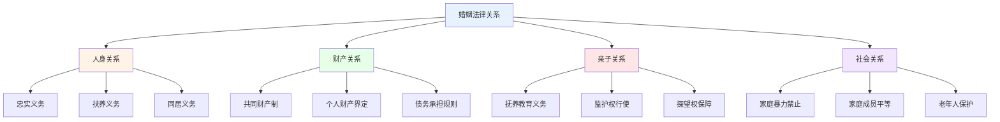
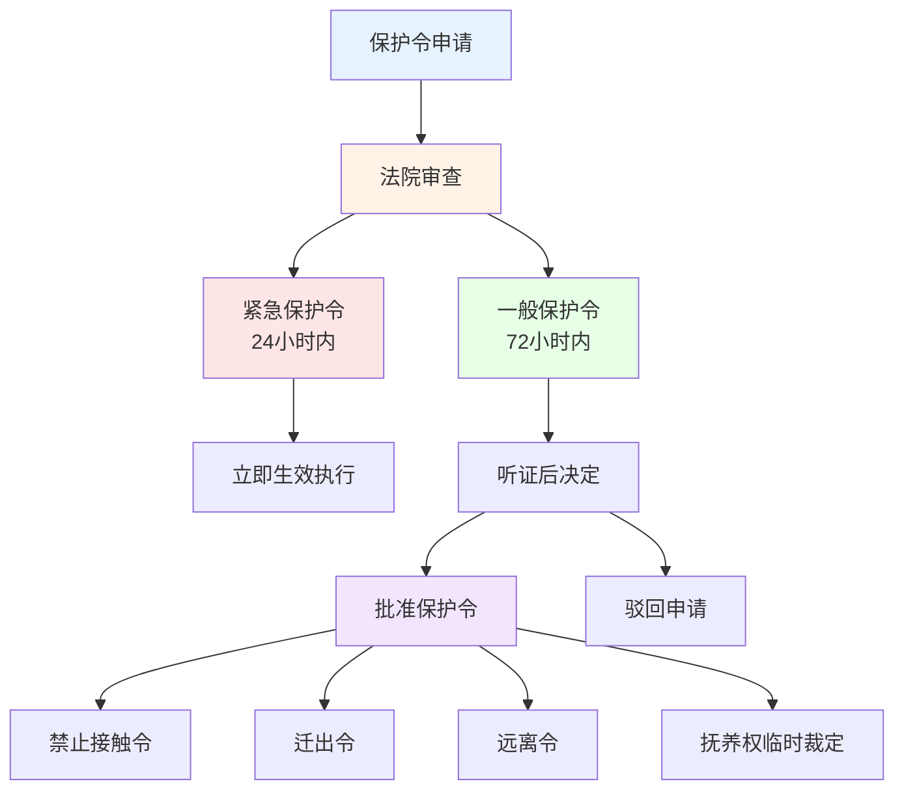
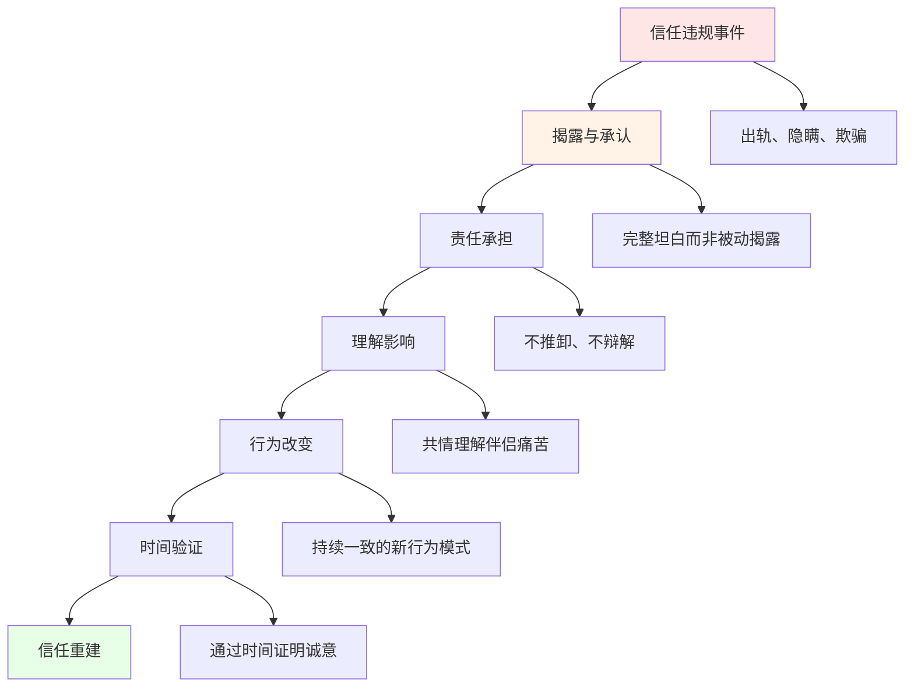

# 关系法律与伦理深度研究 (Relationship Law & Ethics Deep Dive)

## 关系法的理论框架

### 亲密关系的法律维度

#### 婚姻关系法的核心原理

**婚姻的法律本质与权利义务体系：**


**婚姻法中的过错制度比较：**
| 法律制度 | 中国《民法典》 | 美国各州法律 | 欧盟国家法律 | 日本《民法》 |
|---------|--------------|-------------|-------------|-------------|
| **过错离婚** | 感情确已破裂 | 各州标准不一 | 分居制度为主 | 有责离婚主义 |
| **精神损害赔偿** | 明确规定 | 多数州允许 | 普遍承认 | 精神抚慰金 |
| **财产分割** | 照顾无过错方 | 社区财产州50/50 | 各国差异大 | 贡献比例制 |
| **出轨证据** | 电子证据可采信 | 各州标准不同 | 隐私保护严格 | 证据要求严格 |

#### 非婚关系的法律保护

**同居关系的法律地位：**
| 关系类型 | 法律认可程度 | 财产权利 | 继承权利 | 子女权利 |
|---------|-------------|---------|---------|---------|
| **事实婚姻** | 有限认可 | 按份共有 | 无法定继承权 | 享有同等权利 |
| **同居关系** | 一般不认可 | 个人财产归各自 | 无法定继承权 | 享有同等权利 |
| **注册伴侣** | 部分地区认可 | 部分共同财产 | 部分继承权 | 视法律而定 |
| **意定监护** | 法律明确保护 | 按约定执行 | 按约定执行 | 不涉及 |

## 家庭暴力的法律框架

### 家庭暴力防治的法律体系

#### 家庭暴力的法律定义与分类

**《反家庭暴力法》的核心框架：**

| 暴力类型 | 法律定义 | 典型行为 | 法律后果 | 救济措施 |
|---------|---------|---------|---------|---------|
| **身体暴力** | 对身体的打击和伤害 | 殴打、捆绑、残害 | 行政处罚/刑事追究 | 人身安全保护令 |
| **精神暴力** | 精神上的折磨和控制 | 恐吓、侮辱、隔离 | 视情节严重程度 | 心理干预+保护令 |
| **性暴力** | 违背意愿的性行为 | 强迫性行为、性虐待 | 刑事犯罪 | 刑事追究+保护令 |
| **经济控制** | 通过经济手段实施控制 | 限制经济自由、剥夺财产 | 民事救济 | 财产保护措施 |

#### 人身安全保护令制度

**保护令的申请与执行：**


**保护令的具体措施：**
1. **禁止令** - 禁止被申请人实施家庭暴力
2. **远离令** - 禁止被申请人接近申请人住所、工作单位
3. **迁出令** - 责令被申请人迁出申请人住所
4. **保护令** - 禁止被申请人骚扰、跟踪申请人
5. **临时措施** - 关于子女抚养和探视的临时安排

### 家庭暴力的识别与干预

#### 暴力循环理论

**Walker暴力循环(Cycle of Violence)：**
| 循环阶段 | 行为特征 | 受害者心理 | 施暴者心理 | 干预窗口 |
|---------|---------|-----------|-----------|---------|
| **紧张积累期** | 挑剔、控制、威胁 | 焦虑、努力讨好 | 不满、要求增加 | 最佳预防介入时机 |
| **暴力爆发期** | 身体或精神暴力 | 恐惧、无助 | 失控、宣泄 | 紧急保护介入 |
| **蜜月和解期** | 道歉、承诺改变 | 希望恢复、原谅 | 愧疚(或表演性) | 利用窗口建立安全计划 |

## 伴侣治疗的伦理规范

### 心理治疗伦理的核心原则

#### APA伦理原则在伴侣治疗中的应用

**五项核心伦理原则：**
| 伦理原则 | 在伴侣治疗中的应用 | 常见伦理困境 | 解决方案 |
|---------|-----------------|-------------|---------|
| **善行(Beneficence)** | 促进关系健康 | 治疗目标冲突 | 协商共同目标 |
| **不伤害(Non-maleficence)** | 避免治疗造成伤害 | 揭露秘密的两难 | 预先建立保密协议 |
| **自主(Autonomy)** | 尊重各方意愿 | 一方被迫参与 | 确认自愿参与 |
| **公正(Justice)** | 公平对待各方 | 偏袒一方 | 定期审视中立性 |
| **诚信(Fidelity)** | 建立信任关系 | 多重关系挑战 | 清晰界定治疗边界 |

#### 保密原则的特殊挑战

**伴侣治疗中的保密问题：**
```mermaid
graph TB
    A["保密伦理挑战"] --> B["个体秘密"]
    A --> C ["治疗记录"]
    A --> D["法律义务"]
    
    B --> B1["一方要求保密的出轨事实"]
    B --> B2["个人创伤史"]
    B --> B3["隐秘的财务问题"]
    
    C --> C1["谁有权查看记录"]
    C --> C2["法庭传唤的处理"]
    C --> C3["联合记录vs个体记录"]
    
    D --> D1["虐待报告义务"]
    D --> D2["自杀风险评估"]
    D --> D3["暴力威胁警告"]
    
    style A fill:#e6f3ff
    style B fill:#fff2e6
    style C fill:#e6ffe6
    style D fill:#ffe6e6
```

**保密协议的最佳实践：**
- 治疗开始前签署明确的保密协议
- 区分联合信息(Joint Information)和个体秘密(Individual Secrets)
- 事先约定秘密揭露的条件和程序
- 建立法律强制披露的应急预案
- 定期回顾和更新保密协议

### 治疗师的角色与边界

#### 多重关系的避免

**治疗中的边界管理：**
| 边界类型 | 风险行为 | 潜在后果 | 预防措施 |
|---------|---------|---------|---------|
| **社交边界** | 与客户社交来往 | 失去客观性 | 避免非治疗性社交 |
| **商业边界** | 与客户有商业往来 | 利益冲突 | 不建立商业关系 |
| **时间边界** | 延长或频繁加时 | 依赖关系形成 | 严格遵守预约时间 |
| **情感边界** | 过度卷入客户情感 | 反移情问题 | 定期接受督导 |
| **物理边界** | 不适当的身体接触 | 专业关系破坏 | 仅限治疗性接触 |

## 关系中的隐私权

### 亲密关系中的隐私与透明

#### 隐私权的心理学基础

**关系中的隐私悖论：**
| 维度 | 隐私需求 | 透明需求 | 平衡策略 |
|------|---------|---------|---------|
| **数字隐私** | 个人手机和社交媒体 | 消除出轨嫌疑 | 约定可接受的隐私边界 |
| **情感隐私** | 个人内心感受空间 | 情感共享和亲密 | 区分隐私和隐瞒 |
| **社交隐私** | 独立的社交圈和活动 | 共同社交生活 | 保留个人空间的同时共建社交 |
| **历史隐私** | 过去经历的权利 | 建立信任的需要 | 自愿分享而非强制审查 |

#### 数字时代的隐私伦理

**智能手机与关系隐私：**
- 伴侣间查看手机的伦理争议
- 位置共享技术的同意问题
- 社交媒体活动对关系信任的影响
- 数字通讯记录的法律和伦理地位

### 信任与监控的平衡

#### 关系信任的重建机制

**信任违规后的修复框架：**


**透明度的渐进恢复：**
1. **即时透明** - 关键信息的完整和及时披露
2. **行为透明** - 日常行为的可见性和可预测性
3. **情感透明** - 感受和需求的真实表达
4. **数字透明** - 在同意框架内的数字生活共享
5. **长期透明** - 持续的开放沟通和诚实互动

---

*本文件从关系法理论、家庭暴力法律框架、伴侣治疗伦理和关系隐私权四个维度深入探讨亲密关系的法律和伦理问题，为专业实践和关系建设提供全面的规范指导。*

---

## 📞 危机干预资源 | Crisis Resources

> **如果您或您认识的人正在经历心理危机或有自杀念头,请立即寻求帮助。**

### 中国大陆

| 资源 | 联系方式 |
|---|---|
| 北京心理危机研究与干预中心 | **010-82951332** (24小时) |
| 全国心理援助热线 | **400-161-9995** (24小时) |
| 希望24热线 | **400-161-9995** (24小时) |
| 生命热线 | **400-821-1215** (24小时) |

### 国际

| 地区 | 资源 | 联系方式 |
|---|---|---|
| 🇺🇸 美国 | 988 Suicide & Crisis Lifeline | **988** (24/7) |
| 🇬🇧 英国 | Samaritans | **116 123** (24/7) |
| 🇭🇰 香港 | 撒玛利亚防止自杀会 | **2389-0000** |
| 🇹🇼 台湾 | 生命线 | **1995** |

**完整资源列表**:[_meta/docs/CRISIS_RESOURCES.md](../../_meta/docs/CRISIS_RESOURCES.md)

**全球资源**:[Befrienders Worldwide](https://www.befrienders.org) | [WHO 心理健康](https://www.who.int/health-topics/mental-health)

