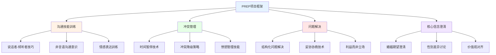
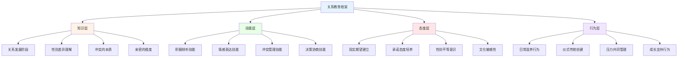
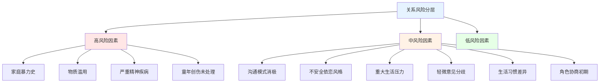

# 关系预防项目研究 (Relationship Prevention Programs)

## PREP项目深度分析

### 预防与关系增强项目(PREP)的理论与实践

#### PREP项目的理论基础

**PREP(Prevention and Relationship Enhancement Program)概述：**



**PREP的核心模块详解：**
| 模块 | 核心内容 | 技能目标 | 教学方法 | 效果证据 |
|------|---------|---------|---------|---------|
| **沟通训练** | 说话者-倾听者技术(Speaker-Listener Technique) | 清晰表达和积极倾听 | 角色扮演、录像反馈 | Markman et al. (1993) |
| **危险信号** | 四骑士行为识别和阻断 | 防止消极互动升级 | 行为观察练习 | 离婚/不满降低30-50% |
| **问题解决** | COAL策略(Calm, Open, Acknowledge, Listen) | 建设性处理分歧 | 结构化练习册 | 长期跟踪效果持续 |
| **核心信念** | 期望管理和承诺增强 | 建立现实关系期望 | 价值观讨论和写作 | 效果因人群而异 |
| **亲密增强** | 情感表达和连接活动 | 深化情感亲密 | 配对活动和分享 | 增强关系满意度 |
| **压力管理** | 外部压力源的联合应对 | 团队合作应对压力 | 压力映射和计划 | 减少压力对关系的负面影响 |

#### PREP的效果研究

**PREP项目的循证证据：**
| 研究类型 | 样本 | 追踪时间 | 主要发现 | 效果持续性 |
|---------|------|---------|---------|-----------|
| **Markman et al. (1993)** | 135对情侣 | 5年 | 满意度显著高于对照组 | 中长期有效 |
| **Stanley et al. (2001)** | 军队样本 | 1年 | 离婚率降低33% | 短期效果显著 |
| **Hahlweg et al. (2010)** | 德国样本 | 11年 | 长期保护效应 | 最长追踪证据 |
| **Williamson et al. (2016)** | 元分析 | 综合 | d=0.30-0.50 | 中等效果量 |

## 关系教育项目

### 关系素养的培养体系

#### 关系教育(Relationship Education)的发展

**关系教育项目的分类：**
| 项目类型 | 代表项目 | 目标人群 | 核心方法 | 授课形式 |
|---------|---------|---------|---------|---------|
| **婚前教育** | PREP, Prepare/Enrich | 准婚情侣 | 技能训练+评估 | 周末工作坊 |
| **婚姻强化** | Marriage Encounter | 已婚夫妻 | 情感分享+沟通 | 闭关式体验 |
| **青年关系教育** | Love Thinks, Connections | 青少年 | 认知教育+讨论 | 学校课程 |
| **再婚准备** | Smart Steps | 再婚家庭 | 家庭整合+技能 | 多次小组课程 |
| **在线关系教育** | ePREP, OurRelationship | 远程用户 | 数字化互动 | 网络平台 |

#### 关系教育的内容框架

**全面关系教育的核心要素：**


### 关系教育的效果评估

#### 教育项目有效性的元分析

**关系教育的效果量汇总：**
| 效果维度 | 效果量(d) | 显著性 | 调节因素 | 关键文献 |
|---------|----------|--------|---------|---------|
| **沟通技能** | 0.45-0.80 | 显著 | 实践练习比单纯讲座更有效 | Blanchard et al. (2009) |
| **关系满意度** | 0.30-0.50 | 显著 | 已婚比未婚效果更好 | Hawkins et al. (2008) |
| **冲突管理** | 0.35-0.60 | 显著 | 技能型课程优于知识型 | Halford et al. (2008) |
| **离婚预防** | RR=0.67 | 显著 | 高风险人群效果更大 | Stanley et al. (2006) |

## 伴侣丰富化活动

### 主动构建关系资本

#### 关系丰富化的科学方法

**基于Gottman研究所的丰富化策略：**

| 策略类型 | 具体方法 | 科学依据 | 频率建议 | 效果预期 |
|---------|---------|---------|---------|---------|
| **爱情地图更新** | 定期询问伴侣的内心世界 | 情感连接基础 | 每天5分钟 | 增强了解和关注 |
| **情感银行存款** | 表达欣赏和感激 | 5:1正负比例 | 每天3次以上 | 增加积极情感储备 |
| **转向回应** | 对伴侣的邀请给予积极回应 | 情感连接的关键 | 每次邀请时 | 建立信任和安全感 |
| **约会之夜** | 定期的二人专属时间 | 保持新鲜感和连接 | 每周1次 | 维持浪漫和亲密 |
| **仪式传统** | 建立共同的家庭仪式 | 创造共享意义 | 持续性 | 增强归属感 |
| **梦想支持** | 了解和支持伴侣的目标 | 深层连接和尊重 | 定期讨论 | 增强伙伴关系 |

#### ARROW富化模型

**ARROW关系丰富化框架：**
```
A - Attention（关注）: 给予伴侣全神贯注的注意力
R - Respect（尊重）: 尊重伴侣的感受、想法和选择
R - Reciprocity（互惠）: 建立互惠互利的关系动态
O - Openness（开放）: 保持开放和真实的沟通
W - Willingness（意愿）: 持续投入关系建设的意愿
```

### 创新性丰富化活动

#### 基于正念的关系练习

**正念关系活动(Mindful Relationship Practices)：**
1. **正念聆听练习** - 不打断、不评判地聆听伴侣说话5分钟
2. **感恩分享仪式** - 每晚分享当天对伴侣感恩的一件事
3. **身体扫描共练** - 一起进行身体觉察冥想
4. **自然共步** - 在自然环境中一起正念行走
5. **创造性合作** - 一起完成需要合作的创造性任务

## 早期干预策略

### 关系风险的早期识别与干预

#### 风险因素分层模型

**关系风险的分层评估：**


#### 基于生命周期的早期干预

**不同生命阶段的预防策略：**
| 生命阶段 | 典型关系挑战 | 预防策略 | 干预时机 | 推荐项目 |
|---------|-------------|---------|---------|---------|
| **约会阶段** | 选择和承诺 | 关系素养教育 | 关系初期 | Connections项目 |
| **婚前阶段** | 期望调整 | 婚前评估和教育 | 婚前6-12月 | Prepare/Enrich |
| **新婚适应** | 角色整合 | 沟通技能训练 | 婚后第一年 | PREP新婚版 |
| **育儿转型** | 角色重构 | 夫妻时间保护 | 怀孕至产后2年 | Bringing Baby Home |
| **中年危机** | 意义重构 | 深层连接活动 | 子女青春期 | 夫妻丰富化课程 |
| **空巢阶段** | 关系重新定义 | 共同愿景建设 | 子女离巢前后 | 二次蜜月项目 |
| **退休适应** | 新角色建立 | 退休前规划 | 退休前2年 | 退休夫妻工作坊 |

#### 数字化早期干预

**技术辅助的关系预防：**
- 在线关系健康自评工具的普及
- 手机应用提供的日常关系技能练习
- 远程伴侣治疗降低服务获取门槛
- AI辅助的关系风险早期预警系统
- 社交媒体上的关系教育内容传播

---

*本文件系统综述了PREP项目、关系教育、伴侣丰富化和早期干预等关系预防策略，为关系健康促进提供循证的项目设计和实施指导。*
