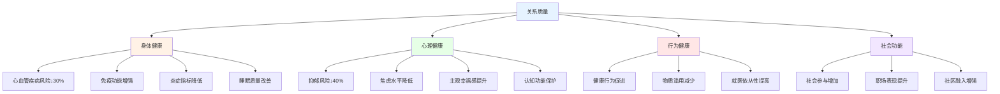
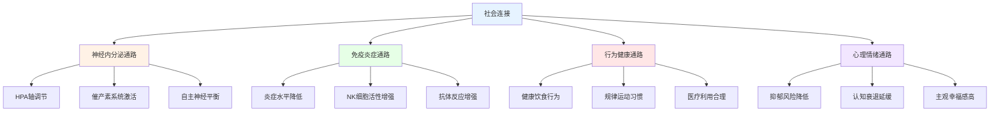

# 关系影响研究综述 (Relationship Impact Research)

## 关系对健康的深远影响

### 亲密关系与身体健康

#### 关系质量与疾病风险

**关系质量的健康效应量：**


**高质量关系的疾病预防效应：**
| 健康领域 | 研究发现 | 效应量 | 关键研究 | 作用机制 |
|---------|---------|--------|---------|---------|
| **心血管** | 婚姻质量与冠心病风险负相关 | HR=0.71 | Eaker et al. (2007) | 压力缓冲+健康行为 |
| **免疫** | 关系满意度与抗体反应正相关 | d=0.45 | Cohen et al. (2003) | 神经-免疫通路 |
| **癌症** | 已婚患者生存率更高 | HR=0.80 | Aizer et al. (2013) | 早期发现+治疗依从 |
| **代谢** | 婚姻质量与代谢综合征负相关 | OR=0.65 | Whisman & Uebelacker (2012) | 饮食运动+压力管理 |
| **疼痛** | 伴侣支持减轻慢性疼痛 | d=0.35 | Cano et al. (2008) | 内啡肽释放+注意力转移 |

#### 关系压力的生理损伤

**关系冲突的急性生理反应：**
- 血压和心率急剧升高，反复发作导致血管损伤
- 皮质醇水平持续升高，抑制免疫和代谢功能
- 炎症标志物(如CRP、IL-6)增加，加速慢性疾病进程
- 睡眠质量下降，影响身体修复和认知功能
- 自主神经系统失调，增加心律失常风险

### 关系与心理健康

#### 关系质量的心理学效应

**不同关系状态的心理健康指标比较：**
| 关系状态 | 抑郁发生率 | 焦虑水平 | 生活满意度 | 自我报告健康 | 社会功能 |
|---------|-----------|---------|-----------|-------------|---------|
| **高质量婚姻** | 12% | 低 | 最高 | 最高 | 最佳 |
| **低质量婚姻** | 28% | 高 | 较低 | 较差 | 受损 |
| **稳定同居** | 15% | 中低 | 较高 | 良好 | 良好 |
| **单身且满足** | 18% | 中 | 中高 | 良好 | 良好 |
| **离异后适应** | 22% | 中高 | 中等 | 中等 | 恢复中 |
| **丧偶后哀伤** | 35% | 高 | 最低 | 较差 | 受损 |

**关系决定心理健康的路径模型：**
```
关系质量 → [社会支持 × 应激缓冲 × 意义感 × 身份认同] → 心理健康
       ↗ 社会支持路径：提供情感和工具性支持
      ↗ 应激缓冲路径：减弱压力事件的负面影响
     ↗ 意义感路径：赋予生活目的和方向
    ↗ 身份认同路径：提供社会角色和归属感
```

## 长寿与社会连接研究

### 社会连接的寿命效应

#### 开创性纵向研究

**关键研究发现汇总：**
| 研究项目 | 样本规模 | 追踪时间 | 核心发现 | 发表年份 |
|---------|---------|---------|---------|---------|
| **Alameda County Study** | 6,928人 | 9年 | 社会连接降低50%死亡风险 | Berkman & Syme (1979) |
| **Terman Life Cycle Study** | 1,528人 | 80年 | 社交网络预测长寿 | Friedman & Martin (2011) |
| **Holt-Lunstad元分析** | 308,849人 | 综合 | 社会隔离=每天抽15支烟的风险 | Holt-Lunstad et al. (2010) |
| **UK Biobank** | 480,849人 | 12年 | 社会隔离增加26%死亡风险 | Hamer et al. (2014) |
| **Harvard Study of Adult Development** | 724人 | 80年+ | 关系质量是长寿最强预测因子 | Waldinger (2015) |

#### 社会连接的生物学机制

**社会连接影响长寿的通路：**


### 婚姻状态的寿命差异

#### 婚姻保护效应

**婚姻与寿命的流行病学证据：**
| 婚姻状态 | 死亡率比(RR) | 心血管疾病 | 癌症 | 意外伤害 | 自杀 |
|---------|-------------|-----------|------|---------|------|
| **已婚** | 1.0(参照) | 最低 | 最低 | 最低 | 最低 |
| **从未结婚** | 1.25 | 增加15% | 增加10% | 增加50% | 增加100% |
| **离异** | 1.30 | 增加20% | 增加15% | 增加40% | 增加80% |
| **丧偶** | 1.40 | 增加30% | 增加20% | 增加35% | 增加60% |

**婚姻保护效应的性别差异：**
- 男性从婚姻中获得的健康收益通常大于女性
- 婚姻对男性危险行为的抑制作用更显著
- 女性的健康更多受关系质量而非关系状态影响
- 低质量婚姻对女性健康的负面效应比男性更强

## 社会连接的神经科学

### 社会大脑与关系健康

#### 社会脑网络(Social Brain Network)

**关系互动的神经基础：**
| 脑区 | 关系功能 | 失调后果 | 研究方法 |
|------|---------|---------|---------|
| **腹内侧前额叶(vMPFC)** | 关系评价与决策 | 关系判断偏差 | fMRI社交判断任务 |
| **颞顶联合区(TPJ)** | 观点采择与共情 | 误解伴侣意图 | fMRI心理理论任务 |
| **后上颞沟(pSTS)** | 社会感知 | 社交信号解读困难 | fMRI社会感知任务 |
| **杏仁核** | 关系情绪反应 | 过度反应或麻木 | fMRI情绪面孔任务 |
| **腹侧纹状体** | 关系奖赏感受 | 亲密感缺失 | fMRI奖赏任务 |

#### 社会疼痛与物理疼痛的重叠

**关系拒绝的神经 correlates：**
- 社会排斥激活的脑区与物理疼痛高度重叠(前扣带回、前岛叶)
- Eisenberger (2012) 的社会疼痛理论(Social Pain Theory)
- 关系丧失的"心碎"感具有真实的神经基础
- 社会支持可以减轻社会疼痛的神经激活
- 催产素可降低社会疼痛的敏感性

## 社会孤立的健康后果

### 孤独感的流行病学

#### 孤独(Loneliness)的健康危害

**孤独的健康风险量化：**
| 健康后果 | 风险增加 | 研究来源 | 调节因素 |
|---------|---------|---------|---------|
| **全因死亡率** | 26% | Holt-Lunstad (2015) | 主观孤独感比客观孤立更重要 |
| **冠心病** | 29% | Valtorta et al. (2016) | 慢性孤独比暂时孤独影响更大 |
| **中风** | 32% | Valtorta et al. (2016) | 年龄和性别有调节作用 |
| **认知衰退** | 40% | Donovan et al. (2017) | 在老年群体中效应最显著 |
| **抑郁** | 2-3倍 | Cacioppo et al. (2006) | 双向因果关系形成恶性循环 |

#### 孤独的公共卫生意义

**孤独的流行率与社会成本：**
- 约20-40%的成年人报告显著孤独感
- 老年群体中孤独感比例更高(约40-50%)
- 孤独相关的医疗支出每年数十亿美元
- COVID-19大流行加剧了全球孤独问题
- 孤独被WHO列为重要公共心理健康议题

### 孤独干预的有效策略

#### 循证干预方法

**孤独干预的效果比较：**
| 干预类型 | 效果量 | 持续性 | 适用人群 | 核心机制 |
|---------|--------|--------|---------|---------|
| **社会技能训练** | d=0.40 | 中等 | 社交困难者 | 提升社交能力 |
| **认知行为疗法** | d=0.60 | 较好 | 慢性孤独者 | 改变消极社交认知 |
| **社区支持项目** | d=0.30 | 中等 | 社区居民 | 增加社交机会 |
| **正念与接纳** | d=0.35 | 较好 | 孤独伴随焦虑者 | 改善孤独应对方式 |
| **志愿服务参与** | d=0.25 | 中等 | 有活动能力的孤独者 | 提供社会角色和意义 |

---

*本文件综合关系对健康和长寿的影响研究、社会连接的神经科学基础以及社会孤立的健康后果，为认识关系在人类健康中的核心地位提供循证依据。*

---

## 📞 危机干预资源 | Crisis Resources

> **如果您或您认识的人正在经历心理危机或有自杀念头,请立即寻求帮助。**

### 中国大陆

| 资源 | 联系方式 |
|---|---|
| 北京心理危机研究与干预中心 | **010-82951332** (24小时) |
| 全国心理援助热线 | **400-161-9995** (24小时) |
| 希望24热线 | **400-161-9995** (24小时) |
| 生命热线 | **400-821-1215** (24小时) |

### 国际

| 地区 | 资源 | 联系方式 |
|---|---|---|
| 🇺🇸 美国 | 988 Suicide & Crisis Lifeline | **988** (24/7) |
| 🇬🇧 英国 | Samaritans | **116 123** (24/7) |
| 🇭🇰 香港 | 撒玛利亚防止自杀会 | **2389-0000** |
| 🇹🇼 台湾 | 生命线 | **1995** |

**完整资源列表**:[_meta/docs/CRISIS_RESOURCES.md](../../_meta/docs/CRISIS_RESOURCES.md)

**全球资源**:[Befrienders Worldwide](https://www.befrienders.org) | [WHO 心理健康](https://www.who.int/health-topics/mental-health)

