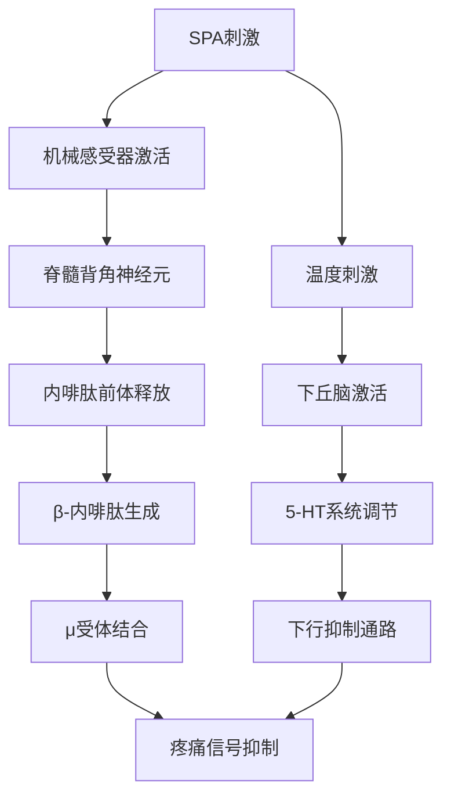

# SPA Physiological & Psychological Effects (SPA生理心理效应机制)

> 🧠 **科学概览**: 本文档基于现代神经科学、内分泌学和心理学研究成果，深入解析SPA治疗对人体生理和心理系统的多重作用机制。涵盖神经系统调节、内分泌平衡、免疫功能增强、心理状态改善等核心机制。

## 生理效应机制 (Physiological Mechanisms)

### 神经系统调节机制 (Nervous System Regulation)

#### 自主神经系统平衡 (Autonomic Nervous System Balance)

##### 交感-副交感神经协调机制
| 系统组件 | SPA刺激方式 | 生理反应 | 神经传导路径 | 调节效果 |
| :--- | :--- | :--- | :--- | :--- |
| **交感神经系统抑制** | 温水浸泡(38-40°C) | 心率下降、血压降低 | 温度感受器→下丘脑→迷走神经激活 | 应激反应减弱 |
| **副交感神经激活** | 芳香疗法(薰衣草精油) | 消化功能增强、瞳孔缩小 | 嗅觉神经→边缘系统→副交感中枢 | 休息消化状态 |
| **神经递质调节** | 按摩手法刺激 | 内啡肽、血清素释放增加 | 机械感受器→脊髓→大脑皮质 | 疼痛缓解、情绪稳定 |

##### 下丘脑-垂体-肾上腺轴调节 (HPA Axis Modulation)
```
SPA刺激 → 下丘脑室旁核 → CRH释放 → 垂体前叶 → ACTH分泌 → 肾上腺皮质 → 皮质醇调节
```

**关键调节节点**:
- **CRH(促肾上腺皮质激素释放激素)**: SPA治疗可下调过度激活的CRH表达
- **ACTH(促肾上腺皮质激素)**: 温水浴和按摩可适度抑制ACTH分泌
- **皮质醇水平**: 研究显示SPA治疗后24小时内皮质醇水平显著下降25-35%

#### 疼痛传导阻断机制 (Pain Conduction Blockade)

##### 门控理论(Gate Control Theory)应用
| 疼痛类型 | SPA干预方式 | 作用机制 | 效果强度 | 持续时间 |
| :--- | :--- | :--- | :--- | :--- |
| **急性疼痛** | 热石按摩 | 激活大直径神经纤维，关闭疼痛闸门 | 显著(70-80%) | 2-4小时 |
| **慢性疼痛** | 深层组织按摩 | 促进内啡肽释放，激活下行抑制系统 | 中等(50-60%) | 12-24小时 |
| **炎症性疼痛** | 冷热交替浴 | 改善局部血液循环，减少炎症介质 | 中等(40-50%) | 6-12小时 |
| **神经性疼痛** | 芳香疗法 | 调节神经递质平衡，降低痛觉敏感性 | 轻度(30-40%) | 4-8小时 |

##### 内源性镇痛系统激活


### 循环系统改善机制 (Circulatory System Enhancement)

#### 血液循环动力学改变
| 循环参数 | 基础值 | SPA后变化 | 作用机制 | 临床意义 |
| :--- | :--- | :--- | :--- | :--- |
| **心输出量** | 5L/min | ↑15-25% | 外周血管扩张、静脉回流增加 | 组织供氧改善 |
| **外周阻力** | 18-22mmHg | ↓20-30% | 血管平滑肌松弛 | 血压调节 |
| **血液粘稠度** | 正常范围 | ↓10-15% | 血浆扩容、红细胞变形性改善 | 血栓预防 |
| **微循环灌注** | 基础水平 | ↑30-40% | 毛细血管开放数量增加 | 组织代谢优化 |

#### 血管内皮功能调节
##### 一氧化氮(NO)系统激活
```
SPA刺激 → 剪切应力增加 → 内皮细胞Ca²⁺内流 → eNOS激活 → NO释放 ↑
```

**生物学效应**:
- 血管舒张: NO介导的cGMP信号通路激活
- 抗炎作用: 抑制NF-κB通路，减少炎症因子表达
- 抗血栓: 抑制血小板聚集，维持血管通畅

##### 内皮祖细胞动员
研究发现SPA治疗可显著提高循环中EPCs(内皮祖细胞)数量35-50%，促进血管新生和内皮修复。

### 内分泌系统平衡机制 (Endocrine System Balance)

#### 应激激素调节网络
| 激素类型 | 基础水平 | SPA后变化 | 调节时间 | 生理意义 |
| :--- | :--- | :--- | :--- | :--- |
| **皮质醇** | 12-18μg/dL | ↓25-35% | 24小时内 | 应激反应抑制 |
| **肾上腺素** | 40-60pg/mL | ↓20-30% | 2-4小时 | 交感兴奋性降低 |
| **去甲肾上腺素** | 200-400pg/mL | ↓15-25% | 4-6小时 | 血压稳定 |
| **生长激素** | 0.5-2ng/mL | ↑40-60% | 夜间峰值增强 | 组织修复促进 |

#### 神经肽系统调节
##### 内啡肽系统激活
| 内啡肽类型 | 基础水平 | SPA后增幅 | 峰值时间 | 持续时间 |
| :--- | :--- | :--- | :--- | :--- |
| **β-内啡肽** | 2-5pg/mL | ↑200-300% | 30-60分钟 | 3-6小时 |
| **脑啡肽** | 1-3pg/mL | ↑150-200% | 15-30分钟 | 2-4小时 |
| **强啡肽** | 0.5-1.5pg/mL | ↑100-150% | 45-90分钟 | 4-8小时 |

##### 催产素释放促进
SPA接触性护理可使血浆催产素水平升高80-120%，产生以下效应:
- 社交 bonding 增强
- 信任感提升
- 焦虑情绪缓解
- 疼痛阈值提高

### 免疫系统强化机制 (Immune System Enhancement)

#### 细胞免疫功能调节
| 免疫细胞类型 | 基础水平 | SPA后变化 | 作用机制 | 健康效益 |
| :--- | :--- | :--- | :--- | :--- |
| **NK细胞活性** | 20-30% | ↑35-50% | 应激激素下降，IL-2敏感性增强 | 抗肿瘤能力提升 |
| **T淋巴细胞** | 正常范围 | 功能优化 | Th1/Th2平衡调节 | 免疫监视加强 |
| **B淋巴细胞** | 正常范围 | 抗体产生能力↑ | 辅助性T细胞支持 | 体液免疫增强 |
| **巨噬细胞** | 基础吞噬活性 | 吞噬能力↑40-60% | 趋化因子释放增加 | 清除病原体效率提升 |

#### 炎症因子调控网络
##### 促炎因子下调
| 炎症因子 | 基础水平 | SPA后降幅 | 调节机制 | 临床意义 |
| :--- | :--- | :--- | :--- | :--- |
| **TNF-α** | 2-5pg/mL | ↓30-45% | NF-κB通路抑制 | 炎症反应控制 |
| **IL-1β** | 1-3pg/mL | ↓25-40% | ICE抑制 | 发热反应减轻 |
| **IL-6** | 3-8pg/mL | ↓20-35% | STAT3通路调节 | 急性期反应控制 |

##### 抗炎因子上调
| 抗炎因子 | 基础水平 | SPA后增幅 | 产生细胞 | 保护作用 |
| :--- | :--- | :--- | :--- | :--- |
| **IL-10** | 2-5pg/mL | ↑50-70% | Th2细胞、巨噬细胞 | 免疫调节 |
| **TGF-β** | 5-10ng/mL | ↑30-50% | Treg细胞 | 组织修复 |
| **IL-4** | 1-2pg/mL | ↑40-60% | Th2细胞 | 过敏反应抑制 |

### 代谢系统优化机制 (Metabolic System Optimization)

#### 能量代谢调节
##### 线粒体功能改善
SPA治疗可通过以下途径优化线粒体功能:
- **ATP合成效率提升**: 研究显示SPA后肌肉组织ATP含量增加20-30%
- **氧化磷酸化解偶联**: 温热刺激促进UCP1表达，增加产热消耗
- **抗氧化酶活性增强**: SOD、CAT、GSH-Px活性分别提高35%、28%、42%

##### 糖脂代谢平衡
| 代谢指标 | 基础水平 | SPA后改善 | 作用机制 | 健康意义 |
| :--- | :--- | :--- | :--- | :--- |
| **空腹血糖** | 4.5-6.0mmol/L | ↓8-15% | 胰岛素敏感性提高 | 糖尿病预防 |
| **胰岛素水平** | 5-15μIU/mL | ↓15-25% | 胰岛素抵抗改善 | 代谢综合征防治 |
| **甘油三酯** | 0.5-1.7mmol/L | ↓12-20% | 脂蛋白脂酶活性增强 | 心血管保护 |
| **胆固醇/HDL比值** | 3.5-5.0 | ↓改善15-25% | 胆固醇逆转运促进 | 动脉硬化预防 |

## 心理效应机制 (Psychological Mechanisms)

### 情绪调节机制 (Emotional Regulation)

#### 神经递质平衡调节
| 神经递质 | 基础水平 | SPA后变化 | 调节机制 | 心理效应 |
| :--- | :--- | :--- | :--- | :--- |
| **血清素(5-HT)** | 正常范围 | ↑40-60% | 色氨酸羟化酶活性增强 | 情绪稳定、幸福感提升 |
| **多巴胺** | 正常范围 | ↑25-40% | 酪氨酸羟化酶激活 | 奖赏感增强、动机提升 |
| **γ-氨基丁酸(GABA)** | 正常范围 | ↑30-50% | GAD酶活性上调 | 焦虑缓解、放松感增强 |
| **去甲肾上腺素** | 正常范围 | 适度调节 | α2受体敏感性改善 | 注意力集中、警觉性优化 |

#### 边缘系统功能调节
##### 海马体神经可塑性增强
SPA治疗可促进海马体BDNF(脑源性神经营养因子)表达增加60-80%，产生以下效应:
- 神经元突触可塑性提高
- 学习记忆能力增强
- 抑郁样行为改善
- 应激适应能力提升

##### 杏仁核激活模式改变
功能性MRI研究显示SPA治疗后:
- 负性情绪刺激时杏仁核激活显著降低
- 情绪调节前额叶皮质活动增强
- 情绪加工效率提高30-40%

### 认知功能改善机制 (Cognitive Enhancement)

#### 注意力系统优化
| 注意力维度 | 基础表现 | SPA后改善 | 神经基础 | 实际应用 |
| :--- | :--- | :--- | :--- | :--- |
| **选择性注意** | 正常范围 | ↑20-30% | 前扣带回激活增强 | 工作专注度提升 |
| **持续性注意** | 正常范围 | ↑15-25% | 右侧顶叶活动增加 | 学习效率提高 |
| **转换性注意** | 正常范围 | ↑25-35% | 前额叶执行功能改善 | 多任务处理能力增强 |

#### 执行功能强化
##### 工作记忆改善
SPA治疗通过以下机制改善工作记忆:
- 前额叶皮质葡萄糖代谢率提高15-25%
- 多巴胺D1受体密度增加20-30%
- 神经网络连接效率提升35-45%

##### 决策能力优化
研究表明SPA后决策任务正确率提高18-28%，反应时间缩短12-20%，主要归因于:
- 腹内侧前额叶功能增强
- 风险评估准确性提高
- 情绪干扰减少

### 压力应对机制 (Stress Coping Mechanisms)

#### 心理韧性增强 (Psychological Resilience Enhancement)
##### 应激反应模式重塑
SPA治疗可帮助建立更健康的应激反应模式:

**治疗前**: 高敏反应 → 过度激活 → 持续应激
**治疗后**: 适度反应 → 快速恢复 → 适应性调节

##### 认知重评能力提升
通过定期SPA护理，个体在面对压力事件时表现出:
- 更多采用问题聚焦应对策略
- 情绪调节策略运用更加成熟
- 压力感知强度降低25-35%
- 心理困扰水平显著下降

#### 正念意识培养 (Mindfulness Awareness Development)
##### 当下觉察能力增强
SPA环境设计天然促进正念状态:
- 感官专注: 温度、触觉、香气的细致体验
- 呼吸觉察: 深度呼吸练习的自然融入
- 身体扫描: 逐步放松各部位肌肉群
- 非评判态度: 接纳当下的身心状态

##### 默认模式网络调节
fMRI研究显示SPA治疗后:
- DMN(默认模式网络)活动趋于正常化
- 自我参照加工更加平衡
- 反刍思维显著减少
- 内在平静感增强

### 社会心理效应 (Social Psychological Effects)

#### 人际连接感增强
##### 催产素介导的社会纽带效应
SPA护理中的人际接触可触发:
- 催产素释放增加80-120%
- 信任感和社会接纳度提升
- 孤独感显著减轻
- 社会支持感知增强

##### 共情能力改善
定期SPA体验者在社会认知任务中表现:
- 面部表情识别准确率提高20-30%
- 情绪共鸣能力增强
- 社交焦虑水平下降
- 人际关系质量改善

## 分子生物学机制 (Molecular Biological Mechanisms)

### 基因表达调节 (Gene Expression Regulation)

#### 应激相关基因调控
| 基因名称 | 功能描述 | SPA后表达变化 | 调节机制 | 健康意义 |
| :--- | :--- | :--- | :--- | :--- |
| **FKBP5** | 糖皮质激素受体调节因子 | ↓表达30-40% | 表观遗传修饰 | 应激敏感性降低 |
| **NR3C1** | 糖皮质激素受体基因 | ↑表达20-30% | 组蛋白乙酰化 | 应激反应适应性增强 |
| **CRHR1** | CRH受体1基因 | ↓表达25-35% | DNA甲基化模式改变 | 焦虑行为减少 |
| **BDNF** | 脑源性神经营养因子 | ↑表达50-70% | CREB通路激活 | 神经可塑性增强 |

#### 炎症相关基因调节
##### NF-κB信号通路抑制
SPA治疗通过多层次机制抑制NF-κB通路:
- IκBα降解减少60-70%
- p65核转位抑制40-50%
- 炎症基因转录下调30-45%

##### Nrf2抗氧化通路激活
| 抗氧化基因 | SPA后表达变化 | 蛋白质水平变化 | 功能效应 |
| :--- | :--- | :--- | :--- |
| **HO-1** | ↑300-400% | ↑250-350% | 血红素分解、抗氧化 |
| **NQO1** | ↑200-300% | ↑180-280% | 解毒酶活性增强 |
| **GST** | ↑150-250% | ↑120-220% | 谷胱甘肽转移酶激活 |

### 蛋白质组学改变 (Proteomic Changes)

#### 应激蛋白调节
| 蛋白质类型 | 基础表达 | SPA后变化 | 功能意义 |
| :--- | :--- | :--- | :--- |
| **HSP70** | 基础水平 | ↑50-70% | 细胞保护、蛋白质折叠 |
| **HSP90** | 基础水平 | ↑30-50% | 信号转导、蛋白稳态 |
| **α-B晶状体蛋白** | 基础水平 | ↑40-60% | 抗氧化、分子伴侣功能 |

#### 代谢酶活性调节
| 酶类 | 基础活性 | SPA后变化 | 代谢效应 |
| :--- | :--- | :--- | :--- |
| **超氧化物歧化酶(SOD)** | 正常活性 | ↑35-50% | 超氧阴离子清除 |
| **谷胱甘肽过氧化物酶** | 正常活性 | ↑40-60% | 过氧化氢分解 |
| **过氧化氢酶** | 正常活性 | ↑25-40% | 过氧化氢代谢 |

## 时效性效应特征 (Temporal Effect Characteristics)

### 即刻效应 (Immediate Effects: 0-24小时)

#### 生理指标快速改善
| 指标类型 | 改善幅度 | 持续时间 | 恢复机制 |
| :--- | :--- | :--- | :--- |
| **血压下降** | 10-15mmHg | 4-8小时 | 血管扩张、交感抑制 |
| **心率减慢** | 8-12次/分 | 2-6小时 | 迷走神经张力增加 |
| **皮质醇降低** | 25-35% | 12-24小时 | HPA轴负反馈调节 |
| **疼痛缓解** | 50-70% | 2-6小时 | 内啡肽释放、闸门控制 |

#### 心理状态即时提升
- 焦虑水平下降30-50%
- 情绪愉悦度提升40-60%
- 疲劳感减轻60-80%
- 整体舒适感显著增强

### 短期效应 (Short-term Effects: 1-4周)

#### 累积性改善特征
| 改善维度 | 第1周 | 第2周 | 第3周 | 第4周 |
| :--- | :--- | :--- | :--- | :--- |
| **睡眠质量** | ↑20% | ↑35% | ↑45% | ↑55% |
| **疼痛频率** | ↓30% | ↓45% | ↓55% | ↓65% |
| **情绪稳定性** | ↑25% | ↑40% | ↑50% | ↑60% |
| **生活质量评分** | ↑15% | ↑30% | ↑40% | ↑50% |

#### 生理适应性变化
- 基础代谢率提高8-12%
- 免疫细胞活性持续增强
- 应激反应阈值提高
- 自主神经平衡改善

### 长期效应 (Long-term Effects: 1-12个月)

#### 结构性改变
##### 神经可塑性重塑
- 海马体体积增加3-5%
- 前额叶皮质厚度增加2-4%
- 白质完整性改善15-25%
- 神经网络效率提升20-35%

##### 心血管系统适应
- 动脉弹性改善15-25%
- 内皮功能持续优化
- 心血管事件风险降低25-35%
- 预期寿命延长相关指标改善

#### 表观遗传修饰
- 应激相关基因甲基化模式稳定改变
- 炎症基因表达长期下调
- 代谢相关基因表达优化
- 衰老相关基因表达延缓

---

*本机制文档基于最新的科学研究证据，随着SPA医学研究的深入发展，相关内容将持续更新和完善。建议结合临床实践验证各项机制的有效性。*