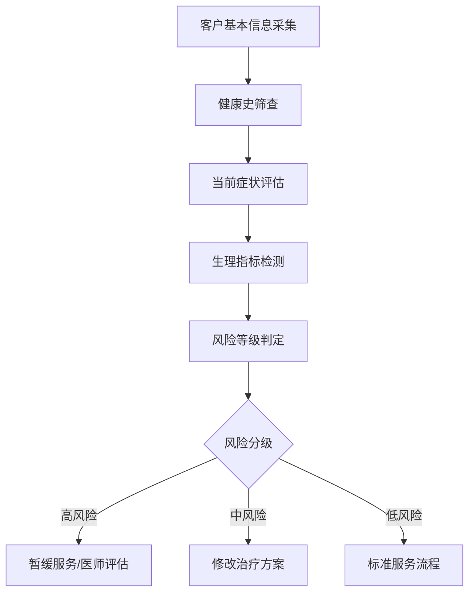
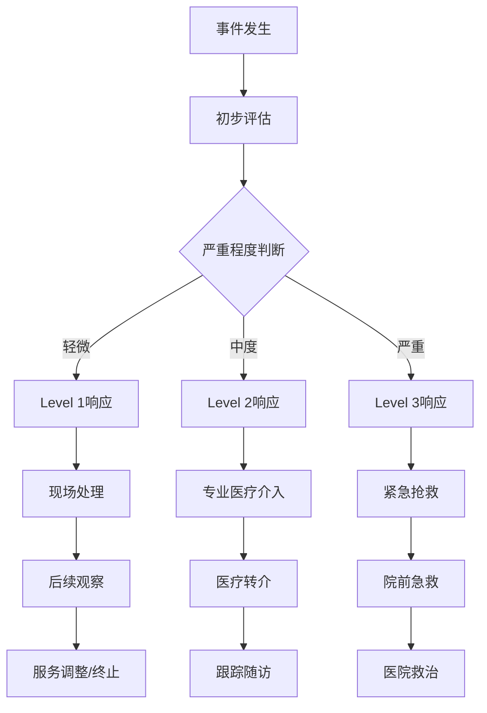
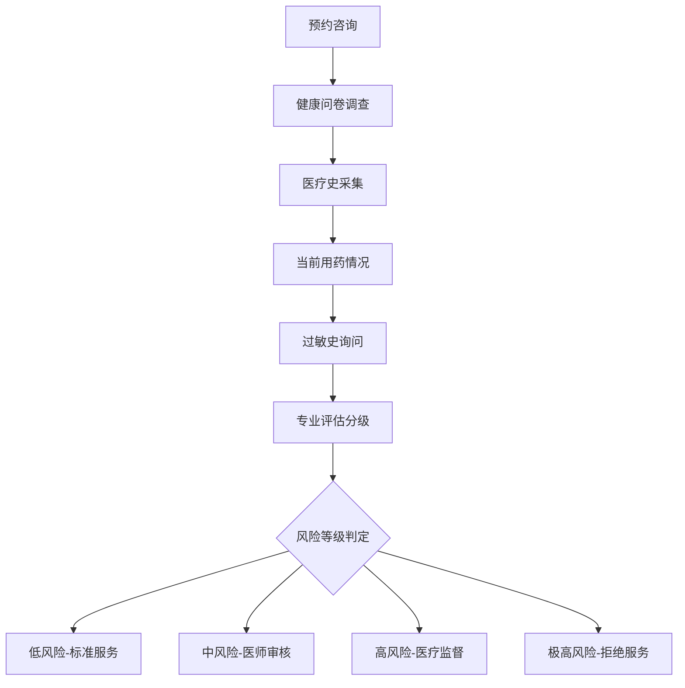
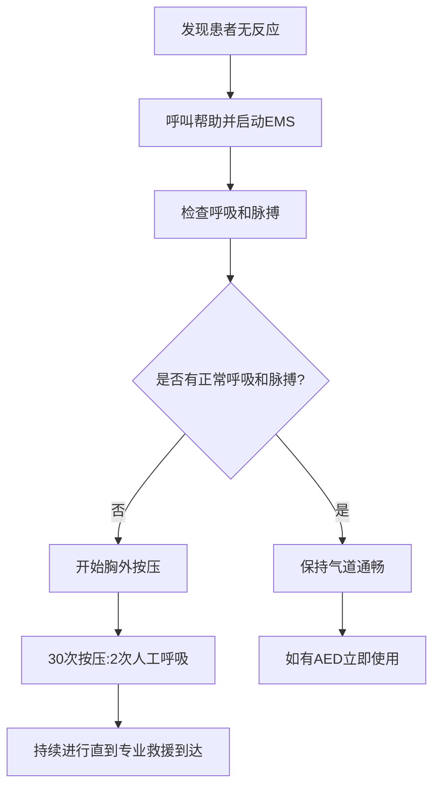

# SPA Safety Protocols & Contraindications (SPA安全规范与禁忌症)

> ⚠️ **安全概览**: 本文档提供SPA服务全过程的安全管理规范和禁忌症清单，基于医疗安全标准制定操作规程，确保客户在接受SPA服务时的安全性和有效性。所有从业人员必须严格遵守安全规范。

## 风险评估与管理系统 (Risk Assessment & Management System)

### 智能化风险评估工具 (Intelligent Risk Assessment Tools)

#### 客户健康风险量化评估矩阵


##### 风险评估量化标准
| 风险维度 | 评估指标 | 权重系数 | 评分标准 | 风险等级划分 |
| :--- | :--- | :--- | :--- | :--- |
| **心血管风险** | 血压、心率、病史 | 0.25 | SBP>160或DBP>100: 5分 | 低风险(0-3分) |
| **呼吸系统风险** | 肺功能、哮喘史 | 0.15 | 严重哮喘发作史: 4分 | 中风险(4-6分) |
| **皮肤敏感性** | 过敏史、皮肤类型 | 0.12 | 严重过敏体质: 3分 | 高风险(≥7分) |
| **妊娠风险** | 孕周、并发症 | 0.18 | 高危妊娠: 5分 |  |
| **精神心理风险** | 精神疾病史、创伤史 | 0.15 | PTSD病史: 4分 |  |
| **药物相互作用** | 当前用药、代谢能力 | 0.15 | 抗凝药物使用: 3分 |  |

#### 实时生理监测系统
##### 多参数生命体征监控
| 监测参数 | 正常范围 | 预警阈值 | 监测频率 | 应急响应 |
| :--- | :--- | :--- | :--- | :--- |
| **心率** | 60-100 bpm | <50或>120 | 每5分钟 | 立即停止治疗 |
| **血压** | 90-140/60-90 mmHg | SBP>160或<85 | 每10分钟 | 评估后决定是否继续 |
| **血氧饱和度** | 95-100% | <92% | 持续监测 | 给予氧气支持 |
| **呼吸频率** | 12-20次/分 | >25或<8 | 每3分钟 | 检查呼吸道通畅 |
| **体温** | 36.0-37.2°C | >37.5°C | 每15分钟 | 物理降温措施 |

### 应急预案体系 (Emergency Response System)

#### 分级应急响应机制
##### Level 1 轻微不适事件
**触发条件**: 轻微头晕、皮肤发红、轻度恶心
**响应流程**:
1. 立即停止当前治疗项目
2. 让客户平躺休息，抬高双腿
3. 提供温开水和湿毛巾
4. 持续观察15-30分钟
5. 症状缓解后可考虑轻柔结束服务

**处置人员**: 高级SPA技师
**所需物资**: 急救箱、血压计、葡萄糖片

##### Level 2 中度不良反应
**触发条件**: 持续性头晕、呕吐、血压异常波动
**响应流程**:
1. 立即启动应急程序
2. 通知现场医师或护士
3. 进行基础生命支持(BLS)
4. 联系急救医疗服务(EMS)
5. 记录详细事件经过

**处置人员**: 注册护士+急救员
**所需物资**: 氧气设备、急救药物、担架

##### Level 3 严重医疗紧急事件
**触发条件**: 意识丧失、呼吸困难、胸痛、严重过敏反应
**响应流程**:
1. 启动最高级别应急响应
2. 立即拨打120急救电话
3. 实施高级心脏生命支持(ACLS)
4. 准备除颤器和其他抢救设备
5. 通知家属并做好转院准备

**处置人员**: 医师+急救团队
**所需物资**: 完整急救设备、抢救药品

#### 标准化应急操作流程(SOP)


### 安全质量控制体系 (Safety Quality Control System)

#### 关键控制点监控(KCC)
| 控制点 | 监控内容 | 检查频次 | 负责人员 | 记录要求 |
| :--- | :--- | :--- | :--- | :--- |
| **环境安全** | 清洁度、温度、湿度 | 每日2次 | 环境管理员 | 电子记录+签字确认 |
| **设备安全** | 按摩椅、水疗设备 | 每次使用前 | 技师自检 | 设备检查表 |
| **用品安全** | 精油、毛巾、床品 | 每批次 | 采购质检员 | 供应商资质档案 |
| **人员资质** | 执业证书、培训记录 | 每季度 | 人事部门 | 资质证书扫描件 |
| **操作规范** | 手法标准、时间控制 | 每次服务 | 质控专员 | 随机抽查录音 |

#### 不良事件报告与分析系统
##### 事件分级报告制度
| 事件等级 | 报告时限 | 报告对象 | 处理要求 |
| :--- | :--- | :--- | :--- |
| **轻微事件** | 24小时内 | 店长+质控部 | 内部整改记录 |
| **一般事件** | 2小时内 | 区域经理+总部 | 专项调查报告 |
| **严重事件** | 立即 | 总裁+监管部门 | 紧急应对+公开说明 |

##### 根因分析(RCA)模板
```
事件描述: [详细记录事件经过]
直接原因: [导致事件发生的直接因素]
根本原因: [深层次的系统性问题]
促成因素: [环境、人为、管理等因素]
预防措施: [具体的改进方案]
责任分工: [相关人员和部门职责]
完成时限: [整改措施落实时间]
```

### 保险与法律责任体系 (Insurance & Legal Liability System)

#### 职业责任保险配置
| 保险类型 | 保障范围 | 保额标准 | 适用场景 |
| :--- | :--- | :--- | :--- |
| **公众责任险** | 第三方人身财产损失 | ≥500万元 | 客户意外伤害赔偿 |
| **职业责任险** | 专业服务过失赔偿 | ≥200万元 | 治疗不当导致损害 |
| **雇主责任险** | 员工工伤赔偿 | ≥100万元/人 | 员工职业伤害 |
| **产品责任险** | 产品质量问题赔偿 | ≥300万元 | 精油过敏等产品事故 |

#### 法律合规检查清单
##### 服务前法律告知义务
- [ ] 书面告知服务风险和禁忌症
- [ ] 获取客户知情同意书签字
- [ ] 核实客户身份和健康状况
- [ ] 明示服务收费标准和退费政策
- [ ] 提供紧急联系方式和投诉渠道

##### 数据保护与隐私安全
- [ ] 客户健康信息加密存储
- [ ] 个人信息处理获得明确授权
- [ ] 建立数据访问权限管理制度
- [ ] 定期进行网络安全风险评估
- [ ] 制定数据泄露应急预案

### 风险评估与预防 (Risk Assessment & Prevention)

#### 客户健康筛查流程


#### 健康评估分级标准
| 风险等级 | 评估标准 | 处理措施 | 监护要求 | 记录保存 |
| :--- | :--- | :--- | :--- | :--- |
| **低风险** | 健康成年人，无明显疾病史 | 标准SPA服务 | 常规监测 | 基础档案 |
| **中风险** | 慢性疾病稳定期、轻度症状 | 医师书面同意后服务 | 加强监测 | 详细记录 |
| **高风险** | 急性疾病恢复期、重要疾病史 | 医疗专业人员现场监督 | 持续监测 | 医疗档案 |
| **极高风险** | 急性发作期、严重疾病 | 暂停SPA服务 | 紧急医疗处理 | 转诊记录 |

### 环境安全标准 (Environmental Safety Standards)

#### 物理环境安全要求
| 安全要素 | 标准要求 | 检测频次 | 责任人员 | 纠正措施 |
| :--- | :--- | :--- | :--- | :--- |
| **空气质量** | PM2.5<35μg/m³, CO₂<1000ppm | 每日监测 | 环境管理员 | 空气净化、通风换气 |
| **水质安全** | 细菌总数<100CFU/mL, 余氯0.3-0.5mg/L | 每4小时检测 | 水质管理员 | 消毒处理、水质更换 |
| **温度控制** | 室温22-24°C, 水温误差±1°C | 实时监控 | 技术员 | 温度调节、报警系统 |
| **照明安全** | 照度150-300lux, 无眩光 | 每周检查 | 设施管理员 | 灯具维护、遮光调节 |
| **噪音控制** | ≤50dB(A)背景噪音 | 每日测量 | 环境管理员 | 隔音处理、音量调节 |

#### 设备安全规范
| 设备类型 | 安全标准 | 检验周期 | 维护要求 | 应急预案 |
| :--- | :--- | :--- | :--- | :--- |
| **按摩床椅** | 承重≥150kg, 结构稳固 | 每月检查 | 螺丝紧固、垫材更换 | 紧急停止装置 |
| **水疗设备** | 防滑等级R10以上, 漏电保护 | 每周检测 | 清洁消毒、管路维护 | 断电保护、排水系统 |
| **电气设备** | IPX4防水等级, 接地电阻<4Ω | 每季度检测 | 绝缘测试、线路检查 | 漏电断路器 |
| **加热设备** | 温度控制精度±2°C, 超温保护 | 每日校准 | 传感器校验、安全阀检查 | 自动断电、报警装置 |

### 操作安全规程 (Operational Safety Protocols)

#### 个人防护装备要求
| 岗位类型 | 必备防护用品 | 使用规范 | 更换频次 | 质量标准 |
| :--- | :--- | :--- | :--- | :--- |
| **按摩技师** | 一次性手套、口罩、工作服 | 接触客户前后更换 | 每位客户更换 | 医疗级材质 |
| **水疗操作员** | 防滑鞋、防水围裙 | 全程穿戴 | 每日清洁 | 防滑等级R12 |
| **清洁人员** | 防护眼镜、橡胶手套 | 接触化学品时佩戴 | 损坏即更换 | 耐腐蚀材料 |
| **管理人员** | 反光背心、安全帽 | 特殊作业时穿戴 | 定期检查 | 符合安全标准 |

#### 消毒灭菌程序
##### 硬表面消毒标准
| 表面类型 | 消毒剂选择 | 浓度要求 | 作用时间 | 消毒频次 |
| :--- | :--- | :--- | :--- | :--- |
| **按摩床** | 75%酒精或季铵盐化合物 | 标准浓度 | 5-10分钟 | 每位客户后 |
| **水疗池壁** | 含氯消毒剂 | 有效氯200-500mg/L | 30分钟 | 每4小时 |
| **门把手** | 复合季铵盐消毒液 | 2000mg/L | 3-5分钟 | 每2小时 |
| **地面** | 次氯酸钠溶液 | 有效氯1000mg/L | 15分钟 | 每日营业后 |

##### 软器械消毒处理
| 器械类型 | 处理方法 | 处理条件 | 质量控制 | 记录要求 |
| :--- | :--- | :--- | :--- | :--- |
| **毛巾布草** | 高温洗涤+烘干 | 70°C以上15分钟 | 细菌总数<200CFU/100cm² | 批次记录 |
| **一次性用品** | 集中销毁处理 | 分类收集、密封运输 | 100%无害化处理 | 处理凭证 |
| **美容工具** | 紫外线消毒+酒精擦拭 | UV-C 254nm照射30分钟 | ATP检测<50RLU | 消毒记录 |

## 绝对禁忌症 (Absolute Contraindications)

### 急性疾病状态 (Acute Disease States)

#### 感染性疾病
| 疾病类型 | 禁忌原因 | 临床表现 | 识别要点 | 处理原则 |
| :--- | :--- | :--- | :--- | :--- |
| **发热性疾病** | 体温调节障碍、感染扩散风险 | 体温>37.5°C、寒战 | 红外测温、病史询问 | 立即拒绝服务、建议就医 |
| **急性传染病** | 交叉感染风险、病情加重 | 流感样症状、皮疹 | 健康码查验、症状观察 | 隔离处理、上报疾控 |
| **皮肤感染** | 病原体传播、伤口恶化 | 局部红肿热痛、脓性分泌物 | 视觉检查、触诊 | 拒绝服务、转诊皮肤科 |
| **泌尿生殖道感染** | 感染扩散、治疗干扰 | 尿频尿急、分泌物异常 | 问诊、必要时检验 | 暂停相关部位服务 |

#### 心血管急症
| 疾病状态 | 危险机制 | 典型症状 | 识别方法 | 应急处置 |
| :--- | :--- | :--- | :--- | :--- |
| **急性心肌梗死** | 心肌缺血、恶性心律失常 | 胸痛、大汗、濒死感 | 心电图、心肌酶检测 | 立即拨打120、心肺复苏 |
| **脑血管意外** | 颅内压增高、神经功能损害 | 偏瘫、失语、意识障碍 | 神经系统检查、CT扫描 | 紧急送医、保持呼吸道通畅 |
| **高血压危象** | 靶器官损害风险 | 血压急剧升高、头痛视物模糊 | 血压监测、眼底检查 | 立即降压治疗、住院观察 |
| **心律失常急性发作** | 血流动力学不稳定 | 心悸、胸闷、晕厥 | 心电监护、病史采集 | 紧急药物治疗、电复律准备 |

### 严重慢性疾病急性加重 (Severe Chronic Disease Acute Exacerbation)

#### 呼吸系统疾病
| 疾病类型 | 加重表现 | SPA风险 | 识别要点 | 处理措施 |
| :--- | :--- | :--- | :--- | :--- |
| **哮喘急性发作** | 支气管痉挛、呼吸困难 | 缺氧风险、药物相互作用 | 喘息声、端坐呼吸 | 立即使用支气管扩张剂、送医 |
| **慢性阻塞性肺病急性加重** | 气道阻塞加重、感染 | 呼吸衰竭风险 | 咳嗽咳痰加重、紫绀 | 停止服务、氧疗、转诊 |
| **肺栓塞** | 肺动脉阻塞、右心负荷增加 | 猝死风险 | 胸痛、咯血、呼吸困难 | 紧急溶栓治疗、ICU监护 |

#### 内分泌系统急症
| 疾病状态 | 代谢紊乱 | 生命威胁 | 识别标志 | 紧急处理 |
| :--- | :--- | :--- | :--- | :--- |
| **糖尿病酮症酸中毒** | 高血糖、酮症 | 代谢性酸中毒 | 呼气烂苹果味、意识改变 | 胰岛素治疗、补液纠正 |
| **高血糖高渗状态** | 严重脱水、意识障碍 | 多器官功能衰竭 | 血糖>33.3mmol/L、昏迷 | 紧急降糖、维持水电解质 |
| **甲状腺危象** | 甲状腺激素过量 | 高热、心衰 | 体温>39°C、心动过速 | 抗甲状腺药物、支持治疗 |

### 恶性肿瘤及相关情况 (Malignant Tumors & Related Conditions)

#### 肿瘤活动期
| 肿瘤状态 | 禁忌理由 | 临床特征 | 诊断依据 | 处理原则 |
| :--- | :--- | :--- | :--- | :--- |
| **恶性肿瘤活动期** | 癌细胞扩散、免疫功能低下 | 体重下降、乏力、局部肿块 | 影像学检查、病理确诊 | 拒绝全身按摩、转肿瘤科 |
| **放射治疗期间** | 皮肤敏感、免疫力下降 | 放射野皮肤红斑、脱屑 | 放疗记录、皮肤检查 | 避免放射野按摩、温和护理 |
| **化学治疗期间** | 骨髓抑制、出血倾向 | 白细胞减少、血小板降低 | 血常规检查、化疗方案 | 暂停按摩服务、预防感染 |

#### 肿瘤转移风险
| 转移部位 | 风险机制 | 禁忌操作 | 监测指标 | 安全措施 |
| :--- | :--- | :--- | :--- | :--- |
| **骨转移** | 病理性骨折风险 | 深层按摩、关节活动 | 骨扫描、疼痛评估 | 轻柔接触、避免负重 |
| **脑转移** | 颅内压增高 | 头部按摩、倒立体位 | MRI检查、神经系统评估 | 避免头部刺激、保持平卧 |
| **肝转移** | 肝功能损害 | 腹部强力按摩 | 肝功能检查、影像学 | 腹部轻抚、避免深压 |

## 相对禁忌症 (Relative Contraindications)

### 妊娠期特殊情况 (Pregnancy Special Circumstances)

#### 高危妊娠状态
| 妊娠风险 | 禁忌程度 | 安全考虑 | 替代方案 | 医疗监督 |
| :--- | :--- | :--- | :--- | :--- |
| **先兆流产** | 高度禁忌 | 子宫收缩刺激风险 | 完全卧床休息 | 妇产科医生全程监护 |
| **前置胎盘** | 绝对禁忌 | 出血风险极高 | 住院观察治疗 | 禁止任何腹部操作 |
| **妊娠高血压综合征** | 中度禁忌 | 血压波动风险 | 轻柔足部按摩 | 血压监测、适时终止 |
| **多胎妊娠** | 谨慎对待 | 早产风险增加 | 缩短治疗时间 | 定期产检、密切观察 |

#### 妊娠并发症
| 并发症类型 | 影响机制 | SPA调整 | 安全阈值 | 预防措施 |
| :--- | :--- | :--- | :--- | :--- |
| **妊娠糖尿病** | 血糖波动 | 避免长时间浸泡 | 餐后2小时血糖<7.8mmol/L | 血糖监测、饮食控制 |
| **妊娠贫血** | 氧供不足 | 减少体力消耗 | 血红蛋白>100g/L | 补铁治疗、充分休息 |
| **羊水过少** | 胎儿受压 | 避免腹部压力 | 羊水指数≥8cm | 定期B超监测 |

### 凝血功能异常 (Coagulation Disorders)

#### 出血性疾病
| 疾病类型 | 出血风险 | 禁忌操作 | 安全参数 | 预防策略 |
| :--- | :--- | :--- | :--- | :--- |
| **血友病** | 自发出血 | 深层按摩、刮痧 | 凝血因子活性>30% | 替代治疗、轻柔护理 |
| **血小板减少症** | 皮肤瘀斑、内脏出血 | 强力按压、拔罐 | 血小板计数>50×10⁹/L | 避免创伤性操作 |
| **抗凝治疗期间** | 出血倾向增加 | 深度组织按摩 | INR 2.0-3.0范围内 | 治疗前凝血功能检查 |

#### 血栓性疾病
| 血栓状态 | 栓塞风险 | 禁忌项目 | 安全评估 | 监护要求 |
| :--- | :--- | :--- | :--- | :--- |
| **深静脉血栓急性期** | 肺栓塞致命风险 | 下肢按摩、热疗 | 血管超声检查 | 抗凝治疗、禁止按摩 |
| **肺栓塞恢复期** | 再栓塞风险 | 全身按摩、剧烈运动 | D-二聚体、CTPA复查 | 医师评估后谨慎进行 |

### 皮肤疾病状态 (Skin Disease Conditions)

#### 感染性皮肤病
| 皮肤感染 | 传播风险 | 禁忌区域 | 处理原则 | 预防措施 |
| :--- | :--- | :--- | :--- | :--- |
| **传染性软疣** | 病毒传播 | 感染部位及周围区域 | 液氮冷冻治疗后方可SPA | 严格消毒、避免接触 |
| **带状疱疹急性期** | 水痘-带状疱疹病毒传播 | 皮疹分布区域 | 抗病毒治疗+局部护理 | 隔离措施、避免搔抓 |
| **脓疱疮** | 细菌感染扩散 | 感染灶周围20cm区域 | 抗生素治疗+创面处理 | 伤口愈合后方可护理 |

#### 炎症性皮肤病
| 皮肤炎症 | 加重机制 | 适宜护理 | 禁忌操作 | 护理要点 |
| :--- | :--- | :--- | :--- | :--- |
| **银屑病活动期** | Koebner现象诱发 | 温和保湿护理 | 强刺激性治疗 | 避免外伤、选用温和产品 |
| **湿疹急性期** | 炎症加重 | 冷喷雾缓解 | 热水浸泡、肥皂清洁 | 保持湿润、避免致敏原 |
| **接触性皮炎** | 过敏反应持续 | 冷敷安抚 | 致敏原接触、刺激性护理 | 查找过敏原、对症处理 |

## 应急处理预案 (Emergency Response Protocols)

### 医疗急救程序 (Medical Emergency Procedures)

#### 心肺复苏标准流程


#### 常见急症处理流程

##### 过敏性休克应急预案
| 处理步骤 | 具体措施 | 时间要求 | 责任人员 | 备注说明 |
| :--- | :--- | :--- | :--- | :--- |
| **立即识别** | 呼吸困难、皮疹、低血压 | 发现后立即 | 现场所有人员 | 询问过敏史 |
| **停止接触** | 移除过敏原、停止相关护理 | 1分钟内 | 服务技师 | 保留可疑物品 |
| **药物治疗** | 肌注肾上腺素0.3-0.5mg | 2分钟内 | 医护人员 | 重复给药间隔15分钟 |
| **生命支持** | 保持气道通畅、给氧 | 持续进行 | 急救人员 | 准备插管设备 |
| **转运医院** | 联系120、准备转运 | 5分钟内 | 管理人员 | 提供病史资料 |

##### 癫痫发作处理规程
| 处理阶段 | 操作要点 | 注意事项 | 安全措施 | 后续跟进 |
| :--- | :--- | :--- | :--- | :--- |
| **发作期保护** | 侧卧位、清除周围危险物品 | 不要强行约束、不放物品口中 | 头部垫软物、记录发作时间 | 持续观察生命体征 |
| **发作后护理** | 保持安静环境、监测意识恢复 | 避免刺激、观察呼吸状况 | 持续给氧、准备急救药品 | 联系家属、安排就医 |
| **预防措施** | 了解癫痫病史、避免诱发因素 | 光敏感患者避强光刺激 | 建立应急联系卡 | 定期健康评估 |

### 设备故障应急响应 (Equipment Failure Emergency Response)

#### 电力系统故障
| 故障类型 | 应急措施 | 安全保障 | 客户安置 | 恢复程序 |
| :--- | :--- | :--- | :--- | :--- |
| **停电事故** | 启动应急照明、启用备用电源 | 确保疏散通道畅通 | 引导至安全区域等待 | 检查电路、联系供电部门 |
| **设备漏电** | 立即切断电源、疏散人员 | 使用绝缘工具处理 | 安排其他区域休息 | 专业检修、安全测试后恢复 |
| **水系统故障** | 关闭相关设备、启用备用水源 | 防止积水滑倒 | 提供毛巾擦拭、纸巾 | 维修管道、水质检测 |

#### 火灾应急预案
| 火灾等级 | 响应级别 | 疏散程序 | 灭火措施 | 外部联络 |
| :--- | :--- | :--- | :--- | :--- |
| **初期火灾** | 一级响应 | 就近安全出口有序撤离 | 使用灭火器扑救 | 拨打119报警 |
| **发展中火灾** | 二级响应 | 全员紧急疏散 | 启动自动喷淋系统 | 联系消防部门、上报管理部门 |
| **大型火灾** | 三级响应 | 按照疏散路线图撤离 | 配合消防队员灭火 | 启动应急预案、媒体沟通 |

## 质量监控与持续改进 (Quality Monitoring & Continuous Improvement)

### 安全事件报告制度 (Safety Incident Reporting System)

#### 事件分级管理
| 事件等级 | 定义标准 | 报告时限 | 处理流程 | 记录要求 |
| :--- | :--- | :--- | :--- | :--- |
| **轻微事件** | 未造成伤害的小事故 | 24小时内 | 现场处理、记录备案 | 事件登记表 |
| **一般事件** | 造成轻微伤害或财产损失 | 2小时内 | 立即报告、调查分析 | 详细事故报告 |
| **严重事件** | 造成重伤或重大财产损失 | 立即报告 | 紧急处置、上级汇报 | 完整事故档案 |
| **重大事件** | 造成死亡或特别重大损失 | 立即上报 | 启动应急预案、配合调查 | 全面调查报告 |

#### 根因分析(RCA)流程
1. **事件重现**: 详细还原事件发生过程
2. **因素识别**: 识别直接原因和根本原因
3. **系统分析**: 分析管理体系漏洞
4. **改进措施**: 制定针对性预防措施
5. **效果验证**: 跟踪改进措施实施效果

### 员工安全培训体系 (Staff Safety Training System)

#### 培训内容框架
| 培训模块 | 培训内容 | 培训方式 | 考核标准 | 更新频次 |
| :--- | :--- | :--- | :--- | :--- |
| **基础安全知识** | 安全法规、操作规程、应急处理 | 理论授课+实操演练 | 笔试80分以上+实操合格 | 每半年 |
| **专业技能安全** | 各项SPA技术的安全要点 | 技师示范+学员练习 | 技能考核达标 | 每季度 |
| **客户安全管理** | 健康评估、风险识别、禁忌症掌握 | 案例分析+情景模拟 | 综合评估优秀 | 每年 |
| **设备安全操作** | 各类设备的安全使用和维护 | 厂家培训+内部指导 | 操作熟练、安全规范 | 设备更新时 |

#### 能力评估标准
| 评估维度 | 优秀标准 | 合格标准 | 不合格处理 | 持续改进 |
| :--- | :--- | :--- | :--- | :--- |
| **理论知识** | 安全知识掌握全面深入 | 基本安全概念清楚 | 重新培训、补考 | 建立学习档案 |
| **操作技能** | 技术娴熟、安全规范 | 操作基本正确 | 一对一指导 | 增加练习频次 |
| **应急能力** | 反应迅速、处理得当 | 能够正确应对 | 模拟演练强化 | 定期考核验证 |
| **沟通技巧** | 与客户有效沟通安全事项 | 基本能说明安全要求 | 沟通培训 | 角色扮演练习 |

### 客户安全教育 (Client Safety Education)

#### 服务前告知内容
| 告知项目 | 具体内容 | 告知方式 | 确认方法 | 记录保存 |
| :--- | :--- | :--- | :--- | :--- |
| **健康状况确认** | 询问当前身体状况、既往病史 | 面对面询问+问卷填写 | 客户签字确认 | 健康档案 |
| **安全注意事项** | 说明治疗过程中的安全要点 | 口头解释+书面资料 | 客户表示理解 | 告知记录 |
| **应急联系方式** | 提供紧急联系电话、附近医院信息 | 资料卡发放 | 客户接收确认 | 信息卡存档 |
| **不适反应处理** | 告知可能出现的正常反应及应对措施 | 详细说明 | 客户明确知晓 | 咨询记录 |

#### 治疗中安全监护
| 监护内容 | 监护要点 | 异常识别 | 处理措施 | 记录要求 |
| :--- | :--- | :--- | :--- | :--- |
| **生理反应** | 观察面色、呼吸、出汗情况 | 苍白、气促、大汗 | 立即停止、评估处理 | 实时记录 |
| **疼痛反应** | 询问疼痛程度、性质变化 | 疼痛加剧、性质改变 | 调整手法、必要时终止 | 疼痛评分 |
| **心理状态** | 观察情绪变化、焦虑表现 | 紧张不安、恐惧表现 | 安抚沟通、减缓节奏 | 心理评估 |
| **舒适度** | 询问温度、力度是否适宜 | 不适主诉、躲避反应 | 及时调整、重新设置 | 满意度调查 |

---

*本安全规范文档为SPA服务的基础安全标准，所有从业人员必须严格遵守。定期更新安全规程，持续完善安全管理体系，确保为客户提供安全、专业的SPA服务体验。*