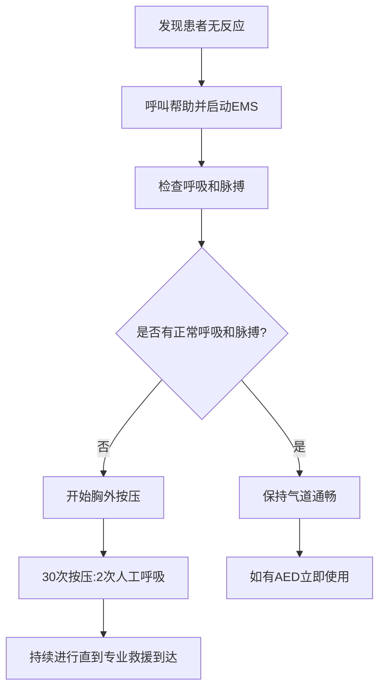

# Tuina Safety Protocols & Contraindications (推拿安全性与禁忌症)

> ⚠️ **安全概览**: 本文档系统阐述中医推拿治疗过程中的安全规范、禁忌症清单、风险评估体系和应急处理预案。通过建立健全的安全管理体系，确保推拿治疗的安全性、有效性和专业性。

## 安全管理体系 (Safety Management System)

### 风险评估与预防 (Risk Assessment & Prevention)

#### 患者健康状况评估 (Patient Health Status Assessment)

##### 详细病史采集 (Comprehensive Medical History Collection)
| 评估项目 | 评估内容 | 评估方法 | 风险等级 | 处理原则 |
| :--- | :--- | :--- | :--- | :--- |
| **既往病史** | 慢性疾病、手术史、过敏史 | 问诊+查阅病历 | 高风险 | 详细记录、医师评估 |
| **当前症状** | 主要症状、伴随症状、病程 | 系统问诊 | 中风险 | 症状分析、鉴别诊断 |
| **用药情况** | 正在服用药物、近期用药史 | 药物清单核查 | 中风险 | 药物相互作用评估 |
| **生理状态** | 妊娠状态、月经周期、年龄 | 体格检查+问诊 | 高风险 | 特殊人群重点关注 |
| **心理状态** | 焦虑程度、配合意愿、恐惧心理 | 心理评估量表 | 低风险 | 心理疏导、沟通解释 |

##### 体格检查要点 (Physical Examination Key Points)
| 检查部位 | 检查项目 | 异常表现 | 临床意义 | 处理建议 |
| :--- | :--- | :--- | :--- | :--- |
| **皮肤检查** | 颜色、温度、完整性 | 红肿、破损、皮疹 | 感染风险、皮肤疾病 | 避免该部位操作 |
| **淋巴结检查** | 大小、质地、活动度 | 肿大、压痛、粘连 | 感染、肿瘤可能 | 全身性疾病筛查 |
| **关节检查** | 活动度、稳定性、疼痛 | 活动受限、不稳定 | 骨关节疾病 | 谨慎手法、避免牵拉 |
| **神经系统检查** | 感觉、运动、反射 | 异常表现 | 神经系统疾病 | 专业评估、转诊建议 |
| **心血管检查** | 血压、心率、心律 | 异常指标 | 心血管风险 | 生命体征监测 |

#### 环境安全标准 (Environmental Safety Standards)

##### 治疗室环境要求 (Treatment Room Environmental Requirements)
| 环境要素 | 标准要求 | 检测方法 | 监控频次 | 纠正措施 |
| :--- | :--- | :--- | :--- | :--- |
| **温度控制** | 22-26°C (夏季)，24-28°C (冬季) | 温度计监测 | 每日检查 | 空调调节、增减衣物 |
| **湿度控制** | 40-60%相对湿度 | 湿度计测量 | 每日检查 | 加湿器或除湿器调节 |
| **空气质量** | PM2.5<35μg/m³，通风良好 | 空气质量检测仪 | 每周检测 | 空气净化、开窗通风 |
| **照明亮度** | 150-300lux柔和光线 | 照度计测量 | 每月检查 | 调节灯光、遮光处理 |
| **噪音控制** | ≤50dB(A)安静环境 | 声级计测量 | 每月检测 | 隔音处理、音量控制 |

##### 设备安全规范 (Equipment Safety Standards)
| 设备类型 | 安全要求 | 检查项目 | 维护频次 | 应急预案 |
| :--- | :--- | :--- | :--- | :--- |
| **治疗床椅** | 承重≥150kg，结构稳固 | 螺丝紧固、垫材完好 | 每月检查 | 紧急停止使用 |
| **按摩器具** | 材质安全、边缘光滑 | 无裂纹、无锐角 | 每次使用前后 | 立即更换损坏器具 |
| **加热设备** | 温度控制准确、安全保护 | 温控器、过热保护 | 每周检测 | 断电保护、紧急处理 |
| **电气设备** | 绝缘良好、接地可靠 | 绝缘电阻、接地电阻 | 每季度检测 | 漏电保护、专业维修 |

### 操作安全规程 (Operational Safety Protocols)

#### 个人防护措施 (Personal Protective Measures)
| 防护类型 | 防护用品 | 使用规范 | 更换频次 | 质量标准 |
| :--- | :--- | :--- | :--- | :--- |
| **手部防护** | 一次性手套、洗手液 | 接触前后洗手、必要时戴手套 | 每位患者更换 | 医疗级材质、75%酒精 |
| **服装防护** | 工作服、帽子、口罩 | 全程穿戴整齐、定期清洗 | 每日更换 | 纯棉材质、清洁消毒 |
| **环境防护** | 消毒剂、清洁用品 | 定期环境消毒、物品清洁 | 每日清洁 | 符合卫生标准 |

#### 手法安全控制 (Manipulation Safety Control)

##### 力度分级管理 (Force Grading Management)
| 力度等级 | 数值范围(N) | 适用人群 | 操作要点 | 安全考虑 |
| :--- | :--- | :--- | :--- | :--- |
| **1级(极轻)** | 5-10N | 婴幼儿、体弱者、敏感部位 | 蚊虫叮咬感、轻抚为主 | 避免深压、观察反应 |
| **2级(轻柔)** | 10-20N | 老年人、慢性病患者 | 轻风吹拂感、节律均匀 | 循序渐进、患者舒适 |
| **3级(中等)** | 20-35N | 一般成年患者 | 手掌按压感、适度深透 | 根据反馈调整力度 |
| **4级(稍重)** | 35-50N | 体质较强者、实证患者 | 指压板感、渗透有力 | 避免疼痛、询问感受 |
| **5级(重力)** | 50-70N | 急性疼痛、肌肉痉挛 | 强力按压感、瞬间发力 | 严格适应症、专业操作 |

##### 时间控制标准 (Time Control Standards)
| 治疗阶段 | 时间分配 | 操作特点 | 安全要点 | 监控要求 |
| :--- | :--- | :--- | :--- | :--- |
| **准备期** | 2-3分钟 | 轻柔抚摸、适应性刺激 | 观察患者反应、建立信任 | 询问舒适度 |
| **治疗期** | 15-25分钟 | 核心治疗手法、针对病症 | 根据反应调整、避免疲劳 | 每5分钟询问感受 |
| **整理期** | 2-3分钟 | 轻柔整理、促进吸收 | 整理被褥、交代注意事项 | 确认无不适感 |
| **观察期** | 10-15分钟 | 静卧休息、观察反应 | 监测生命体征、记录反应 | 异常及时处理 |

## 绝对禁忌症 (Absolute Contraindications)

### 急性传染病状态 (Acute Infectious Disease States)

#### 传染性疾病 (Infectious Diseases)
| 疾病类型 | 传染途径 | 禁忌原因 | 临床表现 | 识别要点 |
| :--- | :--- | :--- | :--- | :--- |
| **病毒性肝炎急性期** | 血液、体液传播 | 交叉感染风险 | 黄疸、乏力、食欲不振 | 肝功能检查、病史询问 |
| **肺结核活动期** | 飞沫传播 | 空气传播感染 | 咳嗽、咳血、午后潮热 | 胸片检查、痰液检测 |
| **艾滋病期** | 血液、性接触传播 | 免疫缺陷、机会感染 | 消瘦、发热、淋巴结肿大 | HIV抗体检测 |
| **梅毒二期** | 性接触、血液传播 | 皮肤黏膜损害 | 皮疹、扁平湿疣、全身症状 | 血清学检查、皮肤检查 |

#### 皮肤感染性疾病 (Skin Infectious Diseases)
| 感染类型 | 病原体 | 禁忌部位 | 传播风险 | 处理原则 |
| :--- | :--- | :--- | :--- | :--- |
| **化脓性感染** | 细菌(金葡菌等) | 感染部位及周围 | 接触传播、败血症风险 | 局部避免操作、转诊治疗 |
| **真菌感染** | 皮肤癣菌等 | 感染区域 | 接触传播、扩散风险 | 避免接触、抗真菌治疗 |
| **病毒性皮肤病** | 疱疹病毒等 | 皮疹分布区域 | 直接接触传播 | 隔离处理、抗病毒治疗 |
| **寄生虫感染** | 疥螨、虱子等 | 全身皮肤 | 接触传播、家庭聚集性 | 全身治疗、环境消毒 |

### 严重内科疾病急性期 (Severe Internal Medicine Disease Acute Phase)

#### 心血管系统急症 (Cardiovascular Emergencies)
| 疾病状态 | 危险机制 | 典型症状 | 识别方法 | 应急处理 |
| :--- | :--- | :--- | :--- | :--- |
| **急性心肌梗死** | 心肌缺血坏死、恶性心律失常 | 剧烈胸痛、大汗淋漓、濒死感 | 心电图、心肌酶谱 | 立即拨打120、心肺复苏 |
| **高血压危象** | 靶器官损害、脑血管意外风险 | 血压急剧升高、头痛视物模糊 | 血压监测、眼底检查 | 紧急降压治疗、住院观察 |
| **主动脉夹层** | 大血管破裂、循环衰竭 | 撕裂样胸痛、两侧血压不对称 | CT血管造影、D-二聚体 | 紧急手术治疗、严禁推拿 |
| **严重心律失常** | 血流动力学不稳定 | 心悸、胸闷、晕厥 | 心电监护、病史采集 | 电复律准备、药物治疗 |

#### 呼吸系统急症 (Respiratory Emergencies)
| 疾病状态 | 危险机制 | 典型症状 | 识别要点 | 紧急处置 |
| :--- | :--- | :--- | :--- | :--- |
| **哮喘持续状态** | 支气管痉挛、呼吸衰竭 | 严重呼吸困难、端坐呼吸 | 喘息声、血氧饱和度下降 | 立即使用支气管扩张剂 |
| **急性肺栓塞** | 肺动脉阻塞、右心负荷增加 | 胸痛、咯血、呼吸困难 | D-二聚体升高、CTPA检查 | 溶栓治疗、抗凝治疗 |
| **大叶性肺炎** | 肺实质炎症、中毒症状 | 高热、寒战、胸痛咳铁锈色痰 | 胸片检查、血常规 | 抗生素治疗、支持疗法 |
| **自发性气胸** | 胸膜破裂、纵隔移位 | 突发胸痛、呼吸困难 | 胸片检查、呼吸音减弱 | 胸腔闭式引流 |

#### 神经系统急症 (Neurological Emergencies)
| 疾病状态 | 危险机制 | 典型症状 | 诊断依据 | 紧急处理 |
| :--- | :--- | :--- | :--- | :--- |
| **脑出血** | 颅内压增高、脑疝风险 | 剧烈头痛、呕吐、意识障碍 | CT检查、神经系统检查 | 紧急降颅压、手术治疗 |
| **脑梗死急性期** | 脑组织缺血坏死 | 偏瘫、失语、意识改变 | MRI检查、血管造影 | 溶栓治疗、神经保护 |
| **癫痫持续状态** | 持续癫痫发作、脑损伤 | 意识丧失、全身抽搐 | 脑电图、病史询问 | 抗癫痫药物、生命支持 |
| **蛛网膜下腔出血** | 颅内动脉瘤破裂 | 突发剧烈头痛、脑膜刺激征 | CT检查、腰椎穿刺 | 紧急手术、血管内治疗 |

### 恶性肿瘤及血液系统疾病 (Malignant Tumors & Hematological Diseases)

#### 恶性肿瘤活动期 (Active Malignant Tumors)
| 肿瘤状态 | 禁忌原因 | 临床特征 | 诊断依据 | 处理原则 |
| :--- | :--- | :--- | :--- | :--- |
| **恶性肿瘤活动期** | 癌细胞扩散、免疫功能低下 | 体重下降、乏力、局部肿块 | 影像学检查、病理确诊 | 拒绝全身按摩、转肿瘤科 |
| **放射治疗期间** | 皮肤敏感、免疫力下降 | 放射野皮肤红斑、脱屑 | 放疗记录、皮肤检查 | 避免放射野按摩、温和护理 |
| **化学治疗期间** | 骨髓抑制、出血倾向 | 白细胞减少、血小板降低 | 血常规检查、化疗方案 | 暂停按摩服务、预防感染 |
| **肿瘤骨转移** | 病理性骨折风险 | 局部疼痛、活动受限 | 骨扫描、疼痛评估 | 轻柔接触、避免负重按摩 |

#### 血液系统疾病 (Hematological Diseases)
| 疾病类型 | 出血风险 | 禁忌操作 | 安全参数 | 预防措施 |
| :--- | :--- | :--- | :--- | :--- |
| **血友病** | 自发出血、关节出血 | 深层按摩、关节活动 | 凝血因子活性>30% | 替代治疗后轻柔护理 |
| **血小板减少性紫癜** | 皮肤瘀斑、内脏出血 | 强力按压、拔罐 | 血小板计数>50×10⁹/L | 避免创伤性操作 |
| **白血病** | 感染风险、出血倾向 | 全身按摩、穴位重压 | 白细胞计数正常范围 | 严格消毒、轻柔手法 |
| **再生障碍性贫血** | 全血细胞减少 | 深度组织按摩 | 血常规各项指标正常 | 暂停推拿服务 |

## 相对禁忌症 (Relative Contraindications)

### 妊娠期特殊情况 (Pregnancy Special Circumstances)

#### 高危妊娠状态 (High-risk Pregnancy States)
| 妊娠风险 | 禁忌程度 | 安全考虑 | 替代方案 | 医疗监督 |
| :--- | :--- | :--- | :--- | :--- |
| **先兆流产** | 高度禁忌 | 子宫收缩刺激风险 | 完全卧床休息 | 妇产科医生全程监护 |
| **前置胎盘** | 绝对禁忌 | 出血风险极高 | 住院观察治疗 | 禁止任何腹部操作 |
| **妊娠高血压综合征** | 中度禁忌 | 血压波动风险 | 轻柔足部按摩 | 血压监测、适时终止 |
| **多胎妊娠** | 谨慎对待 | 早产风险增加 | 缩短治疗时间 | 定期产检、密切观察 |

#### 妊娠并发症 (Pregnancy Complications)
| 并发症类型 | 影响机制 | 推拿调整 | 安全阈值 | 预防措施 |
| :--- | :--- | :--- | :--- | :--- |
| **妊娠糖尿病** | 血糖波动 | 避免长时间浸泡 | 餐后2小时血糖<7.8mmol/L | 血糖监测、饮食控制 |
| **妊娠贫血** | 氧供不足 | 减少体力消耗 | 血红蛋白>100g/L | 补铁治疗、充分休息 |
| **羊水过少** | 胎儿受压 | 避免腹部压力 | 羊水指数≥8cm | 定期B超监测 |
| **胎位异常** | 胎儿窘迫风险 | 避免腹部刺激 | 定期胎心监护 | 专业医师评估 |

### 骨关节系统疾病 (Musculoskeletal System Diseases)

#### 骨折相关情况 (Fracture Related Conditions)
| 骨折状态 | 禁忌原因 | 临床特征 | 诊断方法 | 处理原则 |
| :--- | :--- | :--- | :--- | :--- |
| **新鲜骨折** | 骨折移位、愈合干扰 | 局部疼痛、畸形、功能障碍 | X线检查、体格检查 | 固定制动、禁止按摩 |
| **骨折愈合期** | 愈合不良、再次骨折风险 | 局部压痛、活动受限 | X线复查、功能评估 | 轻柔周围按摩、避免直接刺激 |
| **病理性骨折** | 骨质破坏、再骨折风险 | 轻微外力致骨折 | 骨扫描、生化检查 | 肿瘤科会诊、谨慎处理 |
| **骨质疏松性骨折** | 骨密度降低、多发骨折风险 | 轻微外伤、身高变矮 | 骨密度检查、X线检查 | 补钙治疗、避免负重 |

#### 关节疾病急性期 (Joint Disease Acute Phase)
| 疾病类型 | 炎症特点 | 禁忌操作 | 安全措施 | 康复时机 |
| :--- | :--- | :--- | :--- | :--- |
| **化脓性关节炎** | 细菌感染、关节破坏 | 关节按摩、热疗 | 抗生素治疗、关节穿刺 | 炎症控制后轻柔活动 |
| **类风湿关节炎急性期** | 滑膜炎症、关节肿胀 | 关节重压、强力活动 | 抗炎治疗、关节制动 | 缓解期适度功能锻炼 |
| **痛风性关节炎急性发作** | 尿酸结晶沉积、剧烈疼痛 | 关节按摩、酒精摩擦 | 秋水仙碱治疗、碱化尿液 | 症状缓解后温和护理 |
| **创伤性关节炎** | 关节软骨损伤、炎症反应 | 关节过度活动、重力按摩 | 消炎镇痛、功能锻炼 | 炎症消退后逐步康复 |

### 皮肤疾病状态 (Skin Disease Conditions)

#### 炎症性皮肤病 (Inflammatory Skin Diseases)
| 皮肤炎症 | 加重机制 | 适宜护理 | 禁忌操作 | 护理要点 |
| :--- | :--- | :--- | :--- | :--- |
| **急性湿疹** | 炎症加重、渗出增加 | 冷湿敷安抚 | 热水浸泡、肥皂清洁 | 保持湿润、避免致敏原 |
| **接触性皮炎急性期** | 过敏反应持续 | 冷敷缓解 | 致敏原接触、刺激性护理 | 查找过敏原、对症处理 |
| **银屑病进行期** | Koebner现象诱发 | 温和保湿护理 | 强刺激性治疗 | 避免外伤、选用温和产品 |
| **荨麻疹急性发作** | 组胺释放增加 | 冷敷止痒 | 热疗、搔抓 | 抗组胺治疗、避免诱发因素 |

#### 感染性皮肤病 (Infectious Skin Diseases)
| 皮肤感染 | 传播风险 | 禁忌区域 | 处理原则 | 预防措施 |
| :--- | :--- | :--- | :--- | :--- |
| **带状疱疹急性期** | 水痘-带状疱疹病毒传播 | 皮疹分布区域 | 抗病毒治疗+局部护理 | 隔离措施、避免搔抓 |
| **传染性软疣** | 病毒传播 | 感染部位及周围区域 | 液氮冷冻治疗后方可推拿 | 严格消毒、避免接触 |
| **脓疱疮** | 细菌感染扩散 | 感染灶周围20cm区域 | 抗生素治疗+创面处理 | 伤口愈合后方可护理 |
| **癣菌感染** | 真菌传播 | 感染区域 | 抗真菌治疗 | 避免共用物品、保持干燥 |

## 应急处理预案 (Emergency Response Protocols)

### 医疗急救程序 (Medical Emergency Procedures)

#### 心肺复苏标准流程 (CPR Standard Procedure)

#### 常见急症处理流程 (Common Emergency Handling Process)

##### 过敏性休克应急预案 (Anaphylactic Shock Emergency Plan)
| 处理步骤 | 具体措施 | 时间要求 | 责任人员 | 备注说明 |
| :--- | :--- | :--- | :--- | :--- |
| **立即识别** | 呼吸困难、皮疹、低血压 | 发现后立即 | 现场所有人员 | 询问过敏史 |
| **停止接触** | 移除过敏原、停止相关治疗 | 1分钟内 | 服务技师 | 保留可疑物品 |
| **药物治疗** | 肌注肾上腺素0.3-0.5mg | 2分钟内 | 医护人员 | 重复给药间隔15分钟 |
| **生命支持** | 保持气道通畅、给氧 | 持续进行 | 急救人员 | 准备插管设备 |
| **转运医院** | 联系120、准备转运 | 5分钟内 | 管理人员 | 提供病史资料 |

##### 癫痫发作处理规程 (Epileptic Seizure Handling Protocol)
| 处理阶段 | 操作要点 | 注意事项 | 安全措施 | 后续跟进 |
| :--- | :--- | :--- | :--- | :--- |
| **发作期保护** | 侧卧位、清除周围危险物品 | 不要强行约束、不放物品口中 | 头部垫软物、记录发作时间 | 持续观察生命体征 |
| **发作后护理** | 保持安静环境、监测意识恢复 | 避免刺激、观察呼吸状况 | 持续给氧、准备急救药品 | 联系家属、安排就医 |
| **预防措施** | 了解癫痫病史、避免诱发因素 | 光敏感患者避强光刺激 | 建立应急联系卡 | 定期健康评估 |

### 设备故障应急响应 (Equipment Failure Emergency Response)

#### 电力系统故障 (Power System Failure)
| 故障类型 | 应急措施 | 安全保障 | 客户安置 | 恢复程序 |
| :--- | :--- | :--- | :--- | :--- |
| **停电事故** | 启动应急照明、启用备用电源 | 确保疏散通道畅通 | 引导至安全区域等待 | 检查电路、联系供电部门 |
| **设备漏电** | 立即切断电源、疏散人员 | 使用绝缘工具处理 | 安排其他区域休息 | 专业检修、安全测试后恢复 |
| **水系统故障** | 关闭相关设备、启用备用水源 | 防止积水滑倒 | 提供毛巾擦拭、纸巾 | 维修管道、水质检测 |

#### 火灾应急预案 (Fire Emergency Plan)
| 火灾等级 | 响应级别 | 疏散程序 | 灭火措施 | 外部联络 |
| :--- | :--- | :--- | :--- | :--- |
| **初期火灾** | 一级响应 | 就近安全出口有序撤离 | 使用灭火器扑救 | 拨打119报警 |
| **发展中火灾** | 二级响应 | 全员紧急疏散 | 启动自动喷淋系统 | 联系消防部门、上报管理部门 |
| **大型火灾** | 三级响应 | 按照疏散路线图撤离 | 配合消防队员灭火 | 启动应急预案、媒体沟通 |

## 质量监控与持续改进 (Quality Monitoring & Continuous Improvement)

### 安全事件报告制度 (Safety Incident Reporting System)

#### 事件分级管理 (Incident Classification Management)
| 事件等级 | 定义标准 | 报告时限 | 处理流程 | 记录要求 |
| :--- | :--- | :--- | :--- | :--- |
| **轻微事件** | 未造成伤害的小事故 | 24小时内 | 现场处理、记录备案 | 事件登记表 |
| **一般事件** | 造成轻微伤害或财产损失 | 2小时内 | 立即报告、调查分析 | 详细事故报告 |
| **严重事件** | 造成重伤或重大财产损失 | 立即报告 | 紧急处置、上级汇报 | 完整事故档案 |
| **重大事件** | 造成死亡或特别重大损失 | 立即上报 | 启动应急预案、配合调查 | 全面调查报告 |

#### 根因分析(RCA)流程 (Root Cause Analysis Process)
1. **事件重现**: 详细还原事件发生过程
2. **因素识别**: 识别直接原因和根本原因
3. **系统分析**: 分析管理体系漏洞
4. **改进措施**: 制定针对性预防措施
5. **效果验证**: 跟踪改进措施实施效果

### 员工安全培训体系 (Staff Safety Training System)

#### 培训内容框架 (Training Content Framework)
| 培训模块 | 培训内容 | 培训方式 | 考核标准 | 更新频次 |
| :--- | :--- | :--- | :--- | :--- |
| **基础安全知识** | 安全法规、操作规程、应急处理 | 理论授课+实操演练 | 笔试80分以上+实操合格 | 每半年 |
| **专业技能安全** | 各项推拿技术的安全要点 | 技师示范+学员练习 | 技能考核达标 | 每季度 |
| **客户安全管理** | 健康评估、风险识别、禁忌症掌握 | 案例分析+情景模拟 | 综合评估优秀 | 每年 |
| **设备安全操作** | 各类设备的安全使用和维护 | 厂家培训+内部指导 | 操作熟练、安全规范 | 设备更新时 |

#### 能力评估标准 (Capability Assessment Standards)
| 评估维度 | 优秀标准 | 合格标准 | 不合格处理 | 持续改进 |
| :--- | :--- | :--- | :--- | :--- |
| **理论知识** | 安全知识掌握全面深入 | 基本安全概念清楚 | 重新培训、补考 | 建立学习档案 |
| **操作技能** | 技术娴熟、安全规范 | 操作基本正确 | 一对一指导 | 增加练习频次 |
| **应急能力** | 反应迅速、处理得当 | 能够正确应对 | 模拟演练强化 | 定期考核验证 |
| **沟通技巧** | 与客户有效沟通安全事项 | 基本能说明安全要求 | 沟通培训 | 角色扮演练习 |

### 客户安全教育 (Client Safety Education)

#### 服务前告知内容 (Pre-service Notification Content)
| 告知项目 | 具体内容 | 告知方式 | 确认方法 | 记录保存 |
| :--- | :--- | :--- | :--- | :--- |
| **健康状况确认** | 询问当前身体状况、既往病史 | 面对面询问+问卷填写 | 客户签字确认 | 健康档案 |
| **安全注意事项** | 说明治疗过程中的安全要点 | 口头解释+书面资料 | 客户表示理解 | 告知记录 |
| **应急联系方式** | 提供紧急联系电话、附近医院信息 | 资料卡发放 | 客户接收确认 | 信息卡存档 |
| **不适反应处理** | 告知可能出现的正常反应及应对措施 | 详细说明 | 客户明确知晓 | 咨询记录 |

#### 治疗中安全监护 (Safety Monitoring During Treatment)
| 监护内容 | 监护要点 | 异常识别 | 处理措施 | 记录要求 |
| :--- | :--- | :--- | :--- | :--- |
| **生理反应** | 观察面色、呼吸、出汗情况 | 苍白、气促、大汗 | 立即停止、评估处理 | 实时记录 |
| **疼痛反应** | 询问疼痛程度、性质变化 | 疼痛加剧、性质改变 | 调整手法、必要时终止 | 疼痛评分 |
| **心理状态** | 观察情绪变化、焦虑表现 | 紧张不安、恐惧表现 | 安抚沟通、减缓节奏 | 心理评估 |
| **舒适度** | 询问温度、力度是否适宜 | 不适主诉、躲避反应 | 及时调整、重新设置 | 满意度调查 |

---

*本安全规范文档为推拿治疗的基础安全标准，所有从业人员必须严格遵守。定期更新安全规程，持续完善安全管理体系，确保为客户提供安全、专业的推拿治疗服务。*