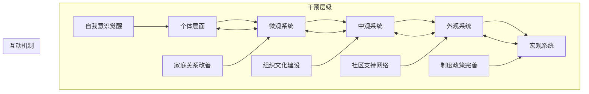

# Intervention Strategies and Policy Recommendations for Gender Discrimination (性别歧视干预策略与政策建议)

## 多层次综合治理框架 (Multi-level Comprehensive Governance Framework)

### 系统性干预的理论基础 (Theoretical Foundation of Systemic Intervention)

#### 生态系统理论的应用 (Application of Ecological Systems Theory)

#### 社会认知理论的指导原则 (Guiding Principles of Social Cognitive Theory)

| 理论要素 | 核心概念 | 干预应用 | 实施策略 | 效果预期 |
| :--- | :--- | :--- | :--- | :--- |
| **观察学习** | 通过观察他人行为及其后果来学习 | 树立性别平等榜样，展示成功案例 | 媒体宣传，典型推广，经验分享 | 态度转变，行为模仿，规范内化 |
| **自我效能** | 个体对自己完成特定任务能力的信念 | 提升性别平等意识和行动能力 | 能力培训，成功体验，积极反馈 | 自信心增强，参与度提高，持续行动 |
| **结果预期** | 对行为结果的预期影响行为选择 | 让人们看到性别平等的积极效果 | 成效展示，利益分析，前景描绘 | 动机增强，投入增加，坚持行为 |
| **环境支持** | 社会环境对行为的支持和制约作用 | 营造支持性别平等的社会环境 | 制度建设，文化培育，资源整合 | 行为便利，障碍减少，氛围改善 |

### 干预策略的分类体系 (Classification System of Intervention Strategies)

#### 预防性干预 (Preventive Intervention)

| 干预类型 | 目标人群 | 核心内容 | 实施方式 | 评估指标 |
| :--- | :--- | :--- | :--- | :--- |
| **意识启蒙** | 全社会成员，特别是青少年 | 性别平等基本理念和价值观念 | 学校教育，媒体宣传，社区活动 | 知晓率，态度变化，行为意向 |
| **能力培养** | 教育工作者，家长，社区工作者 | 识别和应对性别歧视的知识技能 | 专业培训，实践指导，经验交流 | 知识掌握，技能应用，效果反馈 |
| **环境营造** | 政府部门，社会组织，企事业单位 | 支持性别平等的制度环境和文化氛围 | 政策制定，制度完善，文化建设 | 制度覆盖率，环境友好度，参与度 |
| **风险监测** | 高危群体，易受影响人群 | 早期识别和预警性别歧视风险 | 筛查评估，跟踪监测，及时干预 | 风险识别率，干预及时性，效果维持 |

#### 治疗性干预 (Therapeutic Intervention)

| 干预类型 | 服务对象 | 主要方法 | 专业要求 | 成效标准 |
| :--- | :--- | :--- | :--- | :--- |
| **心理咨询** | 受到性别歧视伤害的个体 | 个体咨询，团体辅导，家庭治疗 | 心理咨询师资质，专业训练 | 症状缓解，功能恢复，满意度 |
| **法律援助** | 权益受损的当事人 | 法律咨询，诉讼代理，维权指导 | 法律专业背景，执业资格 | 权益维护，公正实现，满意度 |
| **社会支持** | 需要帮助的弱势群体 | 经济援助，就业支持，生活帮扶 | 社会工作资质，实务经验 | 需求满足，生活质量，融入度 |
| **康复服务** | 创伤后需要恢复的人群 | 职业康复，社会适应，能力建设 | 康复专业技能，综合服务能力 | 功能恢复，独立生活，社会参与 |

#### 发展性干预 (Developmental Intervention)

| 干预类型 | 受益群体 | 重点内容 | 实施载体 | 长期目标 |
| :--- | :--- | :--- | :--- | :--- |
| **赋权增能** | 女性群体，弱势人群 | 提升自主能力和社会参与水平 | 教育培训，创业支持，领导力发展 | 能力增强，地位提升，影响力扩大 |
| **文化创新** | 文艺创作者，媒体从业者 | 传播性别平等理念的优秀作品 | 文化创作，媒体制作，艺术表达 | 观念更新，审美提升，价值引领 |
| **制度完善** | 政策制定者，管理者 | 建立健全性别平等的制度体系 | 立法修法，政策制定，制度创新 | 制度健全，执行有力，保障到位 |
| **国际合作** | 相关机构，专家学者 | 学习借鉴国际先进经验和做法 | 交流合作，学习培训，联合研究 | 视野开阔，水平提升，贡献增加 |

## 政策制度层面的改革建议 (Policy and Institutional Reform Recommendations)

### 法律法规体系完善 (Improvement of Legal and Regulatory System)

#### 反歧视法律框架建设 (Anti-discrimination Legal Framework Construction)

| 法律层级 | 现状分析 | 完善建议 | 实施路径 | 预期效果 |
| :--- | :--- | :--- | :--- | :--- |
| **宪法层面** | 缺乏明确的反歧视原则规定 | 在宪法中确立性别平等基本原则 | 宪法修改程序，广泛征求意见 | 为其他法律提供根本依据 |
| **基本法律** | 《妇女权益保障法》需要进一步完善 | 修订完善相关条款，增强可操作性 | 立法调研，专家论证，公开征求意见 | 法律保障更加全面有力 |
| **专门法规** | 缺乏系统的反就业歧视法律 | 制定专门的反就业歧视法 | 借鉴国际经验，结合国情制定 | 就业歧视得到有效遏制 |
| **实施细则** | 现有法律缺乏具体的实施规定 | 制定配套的实施细则和操作指南 | 部门协作，试点先行，逐步推广 | 法律实施更加规范有效 |

#### 执法监督机制强化 (Strengthening Law Enforcement and Supervision Mechanisms)

| 监督维度 | 存在问题 | 改进措施 | 保障机制 | 评估标准 |
| :--- | :--- | :--- | :--- | :--- |
| **执法力度** | 执法不严，违法成本低 | 加大执法力度，提高违法成本 | 增加执法资源，完善问责机制 | 违法案件查处率，威慑效果 |
| **监督体系** | 监督机制不完善，缺乏有效制约 | 建立多层次监督体系 | 人大监督，政协监督，社会监督 | 监督覆盖面，问题发现率 |
| **救济渠道** | 权利救济途径不畅，维权困难 | 完善权利救济机制 | 简化程序，降低成本，提高效率 | 维权成功率，满意度 |
| **信息公开** | 执法信息不透明，公众知情权保障不足 | 推进执法信息公开 | 建立信息发布平台，定期公布信息 | 透明度，公众参与度 |

### 公共政策优化 (Public Policy Optimization)

#### 教育政策改革 (Educational Policy Reform)

| 政策领域 | 现状问题 | 改革方向 | 具体措施 | 预期成效 |
| :--- | :--- | :--- | :--- | :--- |
| **课程设置** | 缺乏系统的性别平等教育内容 | 将性别平等教育纳入国民教育体系 | 开发专门教材，培训师资队伍 | 教育公平性提升，观念转变 |
| **招生就业** | 教育资源配置存在性别差异 | 推进教育资源均衡配置 | 优化专业设置，完善就业指导 | 机会平等，发展均衡 |
| **评价体系** | 教育评价标准存在性别偏见 | 建立性别敏感的评价体系 | 多元评价标准，过程性评价 | 全面发展，个性成长 |
| **师资建设** | 教师队伍性别结构不合理 | 优化教师队伍性别结构 | 鼓励男性从事幼教等传统女性主导职业 | 角色示范，观念更新 |

#### 就业政策完善 (Employment Policy Improvement)

| 政策方面 | 现有问题 | 改进策略 | 实施举措 | 效果指标 |
| :--- | :--- | :--- | :--- | :--- |
| **招聘录用** | 就业歧视现象普遍存在 | 建立公平的招聘录用制度 | 规范招聘信息，推行盲选机制 | 招聘公平性，机会均等 |
| **职业发展** | 女性职业发展面临天花板效应 | 完善职业发展支持体系 | 建立导师制度，提供培训机会 | 晋升机会，发展空间 |
| **薪酬待遇** | 性别薪酬差距依然较大 | 推进薪酬分配公平化 | 建立薪酬透明机制，加强监管 | 薪酬公平，收入差距缩小 |
| **工作环境** | 职场性骚扰等问题突出 | 营造安全健康的工作环境 | 完善投诉机制，加强预防教育 | 工作安全感，满意度提升 |

#### 社会保障政策调整 (Social Security Policy Adjustment)

| 保障项目 | 现状分析 | 优化方向 | 改革措施 | 目标效果 |
| :--- | :--- | :--- | :--- | :--- |
| **养老保险** | 女性养老保障水平相对较低 | 完善女性养老保障制度 | 承认家务劳动价值，延长缴费年限选择 | 养老保障水平提升，性别差距缩小 |
| **医疗保险** | 女性特殊医疗需求关注不足 | 加强女性健康保障 | 完善妇科疾病防治体系，关注生殖健康 | 健康水平提升，医疗负担减轻 |
| **失业保险** | 女性失业后再就业困难 | 强化失业女性再就业支持 | 提供技能培训，创造就业机会 | 再就业率提升，经济安全增强 |
| **工伤保险** | 职业伤害认定存在性别盲区 | 完善工伤保险制度 | 扩大保障范围，优化认定程序 | 权益保障加强，公平性提升 |

## 组织文化建设策略 (Organizational Culture Building Strategies)

### 企业性别平等实践 (Corporate Gender Equality Practice)

#### 组织制度建设 (Organizational System Construction)

| 制度类型 | 核心内容 | 实施要点 | 保障机制 | 评估指标 |
| :--- | :--- | :--- | :--- | :--- |
| **反歧视制度** | 明确禁止各种形式的性别歧视行为 | 制定详细的反歧视政策和程序 | 高层承诺，全员培训，严格执行 | 制度知晓率，执行效果 |
| **平等机会制度** | 确保男女员工在招聘、晋升等方面的平等权利 | 建立公平的选拔和评价机制 | 透明流程，客观标准，监督机制 | 机会均等，程序公正 |
| **工作生活平衡制度** | 支持员工平衡工作与家庭责任 | 提供灵活的工作安排和家庭友好政策 | 弹性工作制，育儿假制度，托育服务 | 员工满意度，留任率 |
| **申诉投诉制度** | 为受歧视员工提供有效的救济渠道 | 建立便捷的申诉和处理机制 | 独立机构，保密保护，及时处理 | 申诉便利性，处理满意度 |

#### 管理实践创新 (Management Practice Innovation)

| 实践领域 | 创新做法 | 实施要点 | 支持条件 | 效果评估 |
| :--- | :--- | :--- | :--- | :--- |
| **领导力发展** | 培养女性领导者，提升女性领导比例 | 设立女性领导力发展项目 | 导师指导，轮岗锻炼，高管支持 | 女性领导比例，领导效能 |
| **团队建设** | 构建性别多元化的高效团队 | 注重团队构成的性别平衡 | 多元化招聘，包容性管理，协作文化 | 团队绩效，创新能力 |
| **绩效管理** | 建立性别敏感的绩效评价体系 | 采用多元化评价标准和方法 | 客观指标，360度反馈，发展导向 | 评价公平性，激励效果 |
| **文化建设** | 营造支持性别平等的组织文化 | 开展性别平等主题活动和培训 | 高层示范，全员参与，持续改进 | 文化认同度，行为改变 |

### 教育机构性别友好环境建设 (Gender-friendly Environment Construction in Educational Institutions)

#### 校园文化建设 (Campus Culture Construction)

| 建设维度 | 具体措施 | 实施主体 | 资源需求 | 成效评估 |
| :--- | :--- | :--- | :--- | :--- |
| **价值引领** | 传播性别平等理念，树立正确价值导向 | 学校管理层，教师队伍 | 教育资源，宣传材料，活动经费 | 学生价值观，行为表现 |
| **环境营造** | 创造包容多元的校园物理和心理环境 | 后勤部门，学生组织 | 设施改造，装饰布置，氛围营造 | 环境满意度，归属感 |
| **活动开展** | 组织丰富多彩的性别平等主题教育活动 | 团委学生会，社团组织 | 活动场地，组织人员，资金支持 | 参与度，影响力 |
| **榜样示范** | 树立性别平等的师生典型和成功案例 | 宣传部门，教学单位 | 典型挖掘，宣传推广，激励机制 | 示范效应，学习动力 |

#### 教学改革创新 (Teaching Reform and Innovation)

| 改革领域 | 创新内容 | 实施方式 | 支持保障 | 效果监测 |
| :--- | :--- | :--- | :--- | :--- |
| **课程设计** | 融入性别平等教育内容，消除教材偏见 | 课程开发，教材编写，教学研讨 | 专家指导，教师培训，资源投入 | 课程质量，学生反馈 |
| **教学方法** | 采用参与式、互动式教学方法 | 小组讨论，案例分析，角色扮演 | 教学设施，技术支持，方法培训 | 学习效果，课堂氛围 |
| **评价方式** | 建立多元化、过程性的评价体系 | 项目作业，同伴评价，自我反思 | 评价工具，标准制定，培训指导 | 评价公平性，发展促进 |
| **师生关系** | 构建平等尊重的师生互动模式 | 沟通技巧培训，关系建设活动 | 师德教育，心理支持，文化建设 | 关系质量，教学效果 |

## 社区支持网络构建 (Community Support Network Construction)

### 社区服务平台建设 (Community Service Platform Construction)

#### 综合服务中心模式 (Comprehensive Service Center Model)

| 服务功能 | 核心内容 | 服务对象 | 运营方式 | 质量保障 |
| :--- | :--- | :--- | :--- | :--- |
| **信息咨询** | 提供性别平等相关信息和咨询服务 | 社区居民，特别是女性群体 | 专业人员值守，线上线下结合 | 服务专业化，响应及时性 |
| **技能培训** | 开展职业技能和生活技能培训 | 失业人员，待业女性，家庭主妇 | 专业机构合作，实用导向 | 培训质量，就业转化率 |
| **心理支持** | 提供心理健康咨询和支持服务 | 遭遇歧视或创伤的个人 | 专业心理咨询师，志愿者协助 | 专业资质，服务效果 |
| **法律援助** | 为权益受损者提供法律帮助 | 需要维权的当事人 | 法律专业人士，公益律师参与 | 专业水平，维权成功率 |
| **互助交流** | 组织经验分享和互助支持活动 | 社区成员，兴趣群体 | 居民自治，社工引导 | 参与度，凝聚力 |

#### 数字化服务平台 (Digital Service Platform)

| 平台功能 | 技术特点 | 服务优势 | 用户体验 | 发展前景 |
| :--- | :--- | :--- | :--- | :--- |
| **在线咨询** | 人工智能客服，专业人员在线 | 24小时服务，隐私保护好 | 便捷高效，匿名性强 | 用户规模扩大，服务智能化 |
| **资源共享** | 信息数据库，经验案例库 | 资源丰富，获取便利 | 搜索方便，内容权威 | 知识图谱完善，个性化推荐 |
| **互动社区** | 论坛交流，群组讨论，直播活动 | 互动性强，参与度高 | 社交体验好，归属感强 | 社群活跃度提升，影响力扩大 |
| **服务对接** | 需求发布，资源匹配，服务预约 | 精准对接，效率提升 | 操作简便，响应快速 | 平台生态完善，服务闭环形成 |

### 志愿服务体系建设 (Volunteer Service System Construction)

#### 志愿者队伍建设 (Volunteer Team Building)

| 建设方面 | 具体措施 | 实施要点 | 保障机制 | 发展目标 |
| :--- | :--- | :--- | :--- | :--- |
| **招募选拔** | 广泛招募，严格选拔合适人才 | 多渠道宣传，明确选拔标准 | 激励机制，培训体系，管理制度 | 队伍规模扩大，素质提升 |
| **培训发展** | 系统培训，持续能力提升 | 专业培训，实践锻炼，经验交流 | 培训资源，导师指导，学习机会 | 服务能力增强，专业水平提高 |
| **激励保障** | 完善激励机制，提供必要保障 | 荣誉表彰，物质奖励，保险保障 | 制度规范，资金支持，风险管理 | 积极性提高，队伍稳定 |
| **管理协调** | 规范管理，有效协调各方资源 | 组织架构，工作流程，沟通机制 | 管理制度，信息系统，协调机制 | 运行效率提升，协同效应增强 |

#### 服务项目创新 (Service Program Innovation)

| 项目类型 | 服务内容 | 目标群体 | 实施方式 | 社会价值 |
| :--- | :--- | :--- | :--- | :--- |
| **关爱老人** | 为空巢老人、独居老人提供陪伴和帮助 | 老年群体，特别是老年女性 | 定期探访，生活照料，精神慰藉 | 弘扬孝道文化，缓解老龄化压力 |
| **帮扶儿童** | 为留守儿童、困难儿童提供关爱和支持 | 儿童群体，重点关注女童 | 学业辅导，心理关怀，兴趣培养 | 促进儿童健康成长，阻断贫困代际传递 |
| **支持女性** | 为遭遇困境的女性提供全方位帮助 | 困境女性，受歧视女性群体 | 法律援助，心理疏导，就业支持 | 维护女性权益，促进性别平等 |
| **社区建设** | 参与社区治理，推动社区发展 | 全体社区居民 | 环境整治，文化活动，邻里互助 | 建设和谐社区，提升居民幸福感 |

## 监测评估体系构建 (Monitoring and Evaluation System Construction)

### 指标体系设计 (Indicator System Design)

#### 宏观层面监测指标 (Macro-level Monitoring Indicators)

| 指标类别 | 具体指标 | 数据来源 | 监测频率 | 评估用途 |
| :--- | :--- | :--- | :--- | :--- |
| **政策环境** | 性别平等相关政策法规数量和质量 | 政府部门，立法机构 | 年度评估 | 政策完善程度，制度保障水平 |
| **经济参与** | 女性劳动参与率，性别薪酬差距 | 统计部门，人社部门 | 季度监测 | 经济赋权水平，发展机会平等 |
| **教育公平** | 各级教育性别比，女性受教育年限 | 教育部门，统计部门 | 年度统计 | 教育机会平等，人力资本积累 |
| **健康福祉** | 女性健康指标，孕产妇死亡率 | 卫生部门，统计部门 | 年度报告 | 健康保障水平，生命质量改善 |
| **政治参与** | 女性人大代表、政协委员比例 | 人大政协，组织部门 | 换届统计 | 政治参与度，话语权大小 |
| **安全保障** | 家庭暴力案件数，性骚扰投诉量 | 公安部门，妇联组织 | 月度汇总 | 安全环境改善，权益保护效果 |

#### 微观层面评估指标 (Micro-level Evaluation Indicators)

| 评估维度 | 具体指标 | 测量工具 | 评估周期 | 应用场景 |
| :--- | :--- | :--- | :--- | :--- |
| **态度认知** | 性别平等意识水平，歧视认知程度 | 问卷调查，访谈调研 | 半年度评估 | 干预效果评价，策略调整依据 |
| **行为表现** | 歧视行为发生频率，平等行为实践程度 | 行为观察，自我报告 | 季度监测 | 行为改变追踪，成效验证 |
| **心理状态** | 受歧视群体心理健康水平，创伤恢复情况 | 心理量表，临床评估 | 年度普查 | 心理健康促进，治疗效果评估 |
| **生活质量** | 受影响群体生活满意度，幸福感指数 | 生活质量量表，幸福感问卷 | 年度调查 | 干预目标达成，福祉提升程度 |
| **社会功能** | 人际交往能力，社会参与度，工作表现 | 功能评估，绩效考核 | 定期评估 | 社会适应能力，发展潜能评估 |

### 评估方法创新 (Evaluation Method Innovation)

#### 混合方法评估 (Mixed Methods Evaluation)

| 评估方法 | 技术特点 | 适用场景 | 实施要点 | 质量控制 |
| :--- | :--- | :--- | :--- | :--- |
| **定量评估** | 标准化测量，统计分析，结果客观 | 大样本调查，政策效果评估 | 问卷设计，抽样方法，数据分析 | 信效度检验，误差控制 |
| **定性评估** | 深度理解，过程分析，意义阐释 | 小样本深度调研，机制探索 | 访谈提纲，观察记录，主题分析 | 研究者培训，资料三角验证 |
| **参与式评估** | 利益相关者参与，赋权增能取向 | 社区项目评估，赋权项目评价 | 参与设计，共同实施，共享结果 | 包容性原则，能力建设 |
| **案例研究** | 深入分析，情境化理解，经验总结 | 典型案例分析，最佳实践提炼 | 案例选择，多源数据收集，理论构建 | 案例代表性，分析严谨性 |

#### 实时监测技术应用 (Real-time Monitoring Technology Application)

| 技术手段 | 应用场景 | 技术优势 | 实施挑战 | 发展趋势 |
| :--- | :--- | :--- | :--- | :--- |
| **大数据分析** | 舆情监测，行为模式识别，趋势预测 | 数据丰富，分析深入，时效性强 | 隐私保护，算法偏见，技术门槛 | 技术成熟度提升，应用场景扩展 |
| **人工智能** | 自动化评估，智能预警，个性化推荐 | 效率高，成本低，服务个性化 | 技术依赖，伦理风险，人机结合 | 智能化水平提高，人机协作深化 |
| **移动互联** | 实时数据收集，便捷服务提供，即时反馈 | 覆盖面广，参与便利，响应迅速 | 数字鸿沟，网络安全，用户粘性 | 5G技术普及，物联网发展 |
| **区块链** | 数据可信存储，过程透明记录，权益保护 | 安全可靠，不可篡改，去中心化 | 技术复杂，成本较高，标准缺失 | 标准化推进，应用生态完善 |

## 可持续发展机制建设 (Sustainable Development Mechanism Construction)

### 资源保障体系 (Resource Guarantee System)

#### 资金投入机制 (Funding Investment Mechanism)

| 资金来源 | 筹集方式 | 使用方向 | 管理监督 | 可持续性 |
| :--- | :--- | :--- | :--- | :--- |
| **政府财政** | 预算安排，专项资金，转移支付 | 基础设施建设，公共服务供给 | 预算管理，绩效评价，审计监督 | 稳定可靠，规模保障 |
| **社会资本** | 公益捐赠，企业CSR，慈善基金 | 项目支持，能力建设，创新试点 | 项目管理，信息公开，效果评估 | 灵活性强，补充作用 |
| **国际援助** | 多双边合作，技术援助，经验分享 | 能力建设，示范项目，政策研究 | 合作协议，项目管理，成果共享 | 优势互补，视野拓展 |
| **市场化运作** | 有偿服务，产品销售，投资回报 | 可持续服务，产业发展，价值创造 | 市场机制，商业模式，风险管理 | 自我造血，良性循环 |

#### 人才队伍建设 (Talent Team Building)

| 队伍类型 | 建设重点 | 培养途径 | 激励机制 | 发展前景 |
| :--- | :--- | :--- | :--- | :--- |
| **专业人才队伍** | 提升专业能力，培养领军人才 | 高等教育，在职培训，国际交流 | 职业发展，薪酬激励，荣誉表彰 | 专业化水平提升，国际竞争力增强 |
| **管理人才队伍** | 强化管理能力，创新管理模式 | 管理培训，实践锻炼，标杆学习 | 晋升通道，绩效奖励，股权激励 | 管理现代化，组织效率提升 |
| **志愿服务队伍** | 扩大队伍规模，提高服务质量 | 志愿招募，技能培训，实践锻炼 | 精神激励，积分兑换，社会认可 | 社会参与度提高，公益文化发展 |
| **研究人才队伍** | 加强理论研究，推动实践创新 | 学术研究，政策分析，行动研究 | 科研支持，成果转化，学术交流 | 理论水平提升，实践指导增强 |

### 协同治理机制 (Collaborative Governance Mechanism)

#### 多元主体参与 (Multi-stakeholder Participation)

| 参与主体 | 角色定位 | 参与方式 | 责任分工 | 协调机制 |
| :--- | :--- | :--- | :--- | :--- |
| **政府部门** | 政策制定者，资源调配者，监督管理者 | 政策引导，资源投入，监督检查 | 顶层设计，统筹协调，保障支持 | 联席会议，信息共享，联合行动 |
| **社会组织** | 服务提供者，权益维护者，监督倡导者 | 项目实施，能力建设，社会动员 | 专业服务，赋权增能，社会倡导 | 伙伴关系，资源对接，协同发展 |
| **企业单位** | 就业创造者，社会责任承担者，创新实践者 | 创造就业，履行责任，实践创新 | 经济发展，就业保障，示范引领 | 行业联盟，标准制定，经验分享 |
| **学术机构** | 理论研究者，人才培养者，智库支撑者 | 理论研究，人才培养，政策咨询 | 知识创新，人才供给，智力支持 | 产学研合作，成果转化，协同创新 |
| **公民个人** | 权益主体，参与者，监督者 | 积极参与，依法维权，社会监督 | 自我发展，权益维护，共建共享 | 公众参与，民主协商，社会监督 |

#### 区域协调发展 (Regional Coordinated Development)

| 发展维度 | 现状特征 | 协调策略 | 实施路径 | 预期效果 |
| :--- | :--- | :--- | :--- | :--- |
| **东部地区** | 经济发达，意识先进，资源丰富 | 发挥引领作用，输出先进经验 | 先行先试，示范带动，经验推广 | 模式创新，标准引领，辐射带动 |
| **中部地区** | 承东启西，潜力巨大，发展加快 | 承接转移，创新发展，补齐短板 | 产业承接，能力建设，制度完善 | 发展加速，结构优化，活力增强 |
| **西部地区** | 基础薄弱，观念滞后，需求迫切 | 重点支持，倾斜政策，夯实基础 | 资源投入，能力建设，环境改善 | 基础夯实，能力提升，可持续发展 |
| **东北地区** | 转型攻坚，振兴发展，机遇挑战并存 | 转型升级，创新发展，重振雄风 | 结构调整，创新驱动，改革开放 | 转型成功，活力重现，协调发展 |

通过构建多层次、全方位的干预策略体系和完善的政策制度框架，可以有效应对性别歧视问题，推动性别平等目标的实现。这需要政府、社会、企业和个人的共同努力，形成合力推进的良好局面。

**相关文档链接 (Related Documents):
- [性别歧视概览](Gender_Discrimination_Overview.md) - 理论基础和现状分析
- [重男轻女文化根源分析](Son_Preference_Cultural_Origins.md) - 文化和社会结构因素
- [当代影响与表现](Contemporary_Impacts_Manifestations.md) - 现代表现形式
- [心理创伤与代际传递](Psychological_Trauma_Intergenerational.md) - 心理影响机制
- [干预策略与政策建议](Intervention_Strategies_Policy.md) - 解决策略和建议
- [国际比较与最佳实践](International_Comparison_Best_Practices.md) - 国际经验借鉴
- [测量与评估工具](Gender_Discrimination_Measurement_Tools.md) - 专业的测量量表和评估方法
- [标准化术语词典](Gender_Discrimination_Terminology_Standards.md) - 统一的专业术语定义
- [干预效果评估](Gender_Discrimination_Effectiveness_Evaluation.md) - 全面的效果评估体系
- [案例分析集](Gender_Discrimination_Case_Studies.md) - 典型案例深度解析
- [实践指南](Gender_Discrimination_Practical_Guide.md) - 实践操作指导手册
- [培训材料](Gender_Discrimination_Training_Materials.md) - 培训课程体系和教学设计

*本文档基于公共政策学、社会治理理论、组织行为学等多学科理论，结合国内外实践经验，提出系统性的性别歧视干预策略和政策建议，为相关工作提供理论指导和实践参考。*

**参考文献 (References):**
- United Nations. (2023). Beijing Declaration and Platform for Action.
- European Institute for Gender Equality. (2022). Gender Equality Index.
- 国务院妇女儿童工作委员会. (2023). 中国妇女发展纲要(2021-2030年).
- 全国妇联. (2023). 中国妇女发展报告.
- World Bank. (2023). Women, Business and the Law.