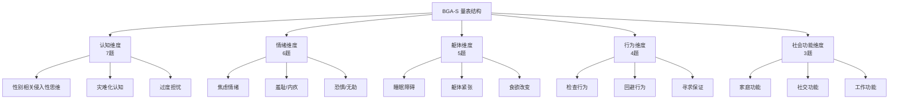
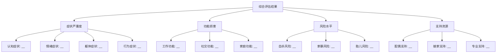

# Birth Gender Anxiety: Assessment Tools (生育性别焦虑评估工具与量表)

## 专用评估工具 (Specialized Assessment Tools)

### BGA-S 生育性别焦虑量表 (Birth Gender Anxiety Scale)

#### 量表简介 (Scale Introduction)

| 维度 | 内容 |
| :--- | :--- |
| **全称** | Birth Gender Anxiety Scale (BGA-S) / 生育性别焦虑量表 |
| **版本** | V1.0 (2024) |
| **题目数** | 25题 |
| **计分方式** | Likert 5点计分 (0-4分) |
| **总分范围** | 0-100分 |
| **适用人群** | 备孕期、孕期女性及其配偶 |
| **施测时间** | 约10-15分钟 |

#### 量表维度结构 (Scale Dimensional Structure)



#### 量表条目内容 (Scale Items)

**A. 认知维度 (Cognitive Dimension)**

| 题号 | 条目内容 | 计分 |
| :--- | :--- | :--- |
| 1 | 我经常不由自主地想到胎儿/未来孩子的性别问题 | 0-4 |
| 2 | 我担心如果生了女儿，家人会对我失望 | 0-4 |
| 3 | 我认为生不出儿子会让我在家里没有地位 | 0-4 |
| 4 | 我相信生儿子是我应尽的责任 | 0-4 |
| 5 | 我害怕如果生女儿，婚姻会出问题 | 0-4 |
| 6 | 我觉得不能控制胎儿性别让我很痛苦 | 0-4 |
| 7 | 我常常想象如果生了女儿会发生的可怕后果 | 0-4 |

**B. 情绪维度 (Emotional Dimension)**

| 题号 | 条目内容 | 计分 |
| :--- | :--- | :--- |
| 8 | 想到可能生女儿时，我感到紧张不安 | 0-4 |
| 9 | 如果生不出儿子，我会感到羞愧 | 0-4 |
| 10 | 我对胎儿性别问题感到恐惧 | 0-4 |
| 11 | 想到生育结果我感到无助 | 0-4 |
| 12 | 我为不能给家人生儿子而内疚 | 0-4 |
| 13 | 有时候我会因为性别焦虑而突然流泪 | 0-4 |

**C. 躯体维度 (Somatic Dimension)**

| 题号 | 条目内容 | 计分 |
| :--- | :--- | :--- |
| 14 | 因为担心性别问题，我的睡眠受到影响 | 0-4 |
| 15 | 想到性别问题时，我会心跳加速或心慌 | 0-4 |
| 16 | 性别焦虑影响了我的食欲 | 0-4 |
| 17 | 因为这个担心，我经常感到疲惫 | 0-4 |
| 18 | 我有时会因为这种担心而出现头痛或肌肉紧张 | 0-4 |

**D. 行为维度 (Behavioral Dimension)**

| 题号 | 条目内容 | 计分 |
| :--- | :--- | :--- |
| 19 | 我反复查阅关于生男生女的信息 | 0-4 |
| 20 | 我会反复向医生或他人询问胎儿性别 | 0-4 |
| 21 | 我尝试过各种方法希望能影响胎儿性别 | 0-4 |
| 22 | 我回避参加有小孩的聚会或活动 | 0-4 |

**E. 社会功能维度 (Social Functioning Dimension)**

| 题号 | 条目内容 | 计分 |
| :--- | :--- | :--- |
| 23 | 这种担心影响了我和丈夫的关系 | 0-4 |
| 24 | 因为这种担心，我和公婆的关系变得紧张 | 0-4 |
| 25 | 这种焦虑影响了我的工作/日常生活 | 0-4 |

#### 评分标准与解释 (Scoring and Interpretation)

| 分数段 | 焦虑等级 | 临床解释 | 建议处理 |
| :--- | :--- | :--- | :--- |
| **0-20** | 正常/轻微 | 有轻微关注，属正常范围 | 健康教育、随访观察 |
| **21-40** | 轻度焦虑 | 存在明显担忧，需关注 | 心理咨询、支持性干预 |
| **41-60** | 中度焦虑 | 焦虑明显影响生活 | 系统心理治疗 |
| **61-80** | 重度焦虑 | 严重困扰，功能受损 | 心理治疗+药物考虑 |
| **81-100** | 极重度焦虑 | 极度痛苦，需紧急干预 | 紧急心理干预+精神科会诊 |

### 量表心理测量学特性 (Psychometric Properties)

| 指标 | 数值 | 评价标准 | 结果评价 |
| :--- | :--- | :--- | :--- |
| **内部一致性 (Cronbach's α)** | 0.91 | >0.70为可接受 | 优秀 |
| **重测信度 (2周)** | 0.86 | >0.70为可接受 | 良好 |
| **结构效度 (CFI)** | 0.94 | >0.90为良好 | 良好 |
| **聚合效度** | r=0.78 (与SAS) | 中高相关 | 良好 |
| **区分效度** | p<0.001 | 能区分临床/非临床 | 良好 |

---

## 辅助评估工具 (Auxiliary Assessment Tools)

### 通用焦虑评估工具 (General Anxiety Assessment Tools)

| 工具名称 | 英文缩写 | 评估内容 | 在BGA评估中的作用 |
| :--- | :--- | :--- | :--- |
| 焦虑自评量表 | SAS | 一般焦虑水平 | 评估整体焦虑基线 |
| 汉密尔顿焦虑量表 | HAMA | 焦虑严重程度 | 临床严重度评估 |
| 广泛性焦虑量表-7 | GAD-7 | 广泛性焦虑 | 筛查与鉴别诊断 |
| 状态-特质焦虑问卷 | STAI | 状态/特质焦虑 | 区分情境性vs人格性焦虑 |

### 围产期心理评估工具 (Perinatal Psychological Assessment Tools)

| 工具名称 | 评估内容 | 适用阶段 | 建议使用时机 |
| :--- | :--- | :--- | :--- |
| 爱丁堡产后抑郁量表 (EPDS) | 围产期抑郁 | 孕期+产后 | 产检常规筛查 |
| 产前抑郁筛查量表 (PDSS) | 产前抑郁 | 孕期 | 孕期心理筛查 |
| 孕期焦虑量表 (PAQ) | 孕期特异性焦虑 | 孕期 | 与BGA-S联合使用 |

### 家庭与社会支持评估 (Family and Social Support Assessment)

| 工具名称 | 评估内容 | 评估目的 |
| :--- | :--- | :--- |
| 社会支持评定量表 (SSRS) | 社会支持水平 | 评估保护因素 |
| 家庭功能评定量表 (FAD) | 家庭功能 | 评估家庭环境 |
| 婚姻质量问卷 (QMI) | 婚姻满意度 | 评估夫妻关系 |

---

## 临床访谈评估 (Clinical Interview Assessment)

### 结构化临床访谈提纲 (Structured Clinical Interview Outline)

#### 模块一：主诉与现病史 (Chief Complaint and Present Illness)

```
1. 开放性导入：
   "请您告诉我，是什么让您来寻求帮助的？"

2. 症状探查：
   - 您是从什么时候开始担心胎儿性别的？
   - 这种担心有多频繁？每天大约多少次？
   - 当这种担心出现时，您身体有什么感觉？
   - 这种担心影响了您的睡眠/食欲/工作吗？

3. 功能影响：
   - 这种担心如何影响您和家人的关系？
   - 您因为这种担心做过什么或避免做什么？
```

#### 模块二：文化与家庭背景 (Cultural and Family Background)

```
1. 家庭性别观念：
   - 在您的家庭中，生男生女这件事重要吗？
   - 您的公婆/丈夫对孩子性别有什么期望？
   - 如果生了女儿，您担心会发生什么？

2. 成长经历：
   - 您小时候，家里对男孩女孩的态度一样吗？
   - 您妈妈/奶奶有没有经历过类似的压力？

3. 社会压力：
   - 周围的亲戚朋友对生儿子这件事怎么看？
   - 您觉得社会上对没有儿子的家庭是什么态度？
```

#### 模块三：风险评估 (Risk Assessment)

```
1. 自伤/自杀风险：
   - 这种担心让您有时候觉得活着没意思吗？
   - 您有没有想过伤害自己？

2. 胎儿安全风险：
   - 您对这次怀孕有什么想法？
   - 如果确定是女儿，您会怎么办？

3. 家庭暴力风险：
   - 您和家人讨论这个问题时，有没有发生冲突？
   - 有人因为这件事对您说过伤害性的话或做过什么吗？
```

### 访谈评分表 (Interview Rating Form)

| 评估维度 | 评分标准 | 0分 | 1分 | 2分 | 3分 |
| :--- | :--- | :--- | :--- | :--- | :--- |
| **焦虑强度** | 主观痛苦程度 | 无 | 轻微 | 明显 | 严重 |
| **症状频率** | 每日出现次数 | 偶尔 | 数次 | 频繁 | 持续 |
| **功能损害** | 日常功能影响 | 无 | 轻微 | 中等 | 严重 |
| **文化压力** | 来自环境的压力 | 无 | 轻微 | 明显 | 严重 |
| **支持资源** | 可用支持程度 | 充足 | 一般 | 有限 | 缺乏 |

---

## 多维度评估整合 (Multidimensional Assessment Integration)

### 综合评估报告模板 (Comprehensive Assessment Report Template)

```
========================================
生育性别焦虑综合评估报告
========================================

一、基本信息
- 姓名：_____ 年龄：_____ 孕周：_____
- 评估日期：_____ 评估者：_____

二、量表评估结果
| 量表 | 得分 | 等级 |
| BGA-S | __/100 | ___ |
| SAS | __/80 | ___ |
| EPDS | __/30 | ___ |
| SSRS | __/66 | ___ |

三、临床访谈摘要
- 主要症状：_____
- 诱发因素：_____
- 维持因素：_____
- 保护因素：_____

四、风险等级
□ 低风险  □ 中风险  □ 高风险  □ 极高风险

五、诊断印象
_____

六、处理建议
_____

评估者签名：_____ 日期：_____
========================================
```

### 评估结果可视化 (Assessment Results Visualization)



---

## 评估伦理与注意事项 (Assessment Ethics and Considerations)

### 评估伦理原则 (Ethical Principles in Assessment)

| 原则 | 具体要求 | 实践操作 |
| :--- | :--- | :--- |
| **知情同意** | 告知评估目的、内容、保密原则 | 签署书面同意书 |
| **文化敏感** | 尊重个体文化背景 | 避免评判性语言 |
| **保密原则** | 保护个人隐私 | 明确保密例外情况 |
| **不伤害原则** | 避免评估过程造成二次伤害 | 温和稳定的评估风格 |
| **专业胜任** | 在专业能力范围内评估 | 必要时转介 |

### 特殊情况处理 (Handling Special Situations)

| 情况 | 识别线索 | 处理方式 |
| :--- | :--- | :--- |
| **高自杀风险** | 表达自杀意念或计划 | 立即危机干预、精神科会诊 |
| **家庭暴力** | 报告遭受暴力或控制 | 安全评估、必要时报告 |
| **强制堕胎风险** | 家人施压要求性别鉴定/堕胎 | 告知法律保护、联系相关部门 |
| **严重躯体症状** | 明显躯体不适 | 医学检查排除器质性疾病 |

---

## 参考文献 (References)

1. Zung, W. W. (1971). A rating instrument for anxiety disorders. *Psychosomatics*, 12(6), 371-379.
2. Cox, J. L., et al. (1987). Detection of postnatal depression: Development of the 10-item Edinburgh Postnatal Depression Scale. *British Journal of Psychiatry*, 150, 782-786.
3. Spielberger, C. D. (1983). Manual for the State-Trait Anxiety Inventory. Palo Alto, CA: Consulting Psychologists Press.
4. 汪向东, 王希林, 马弘. (1999). 心理卫生评定量表手册. 北京: 中国心理卫生杂志社.
5. American Educational Research Association. (2014). Standards for Educational and Psychological Testing. Washington, DC: AERA.

---

*返回目录: [INDEX.md](INDEX.md) | 上级目录: [gender-discrimination](../INDEX.md)*
