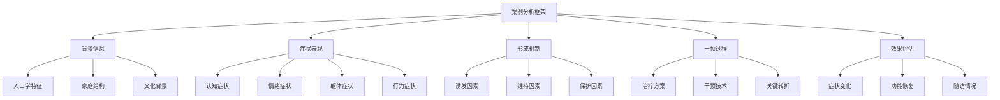
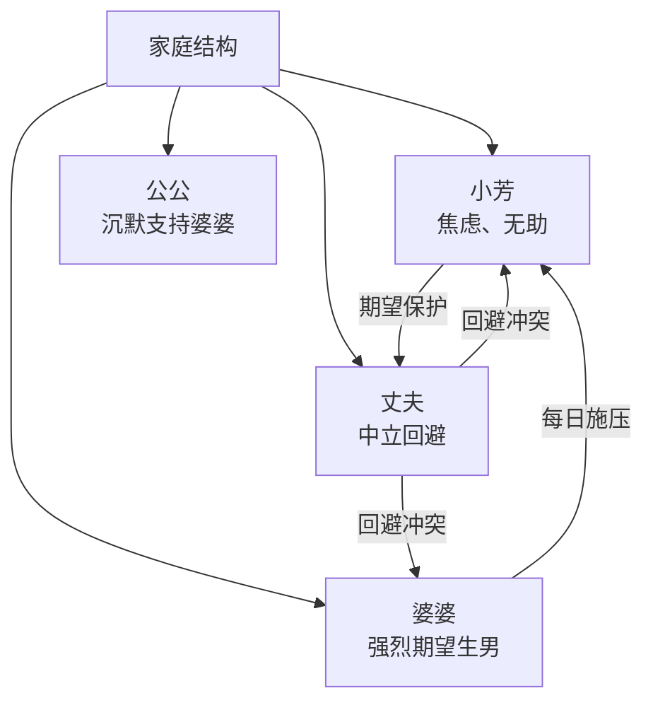

# Birth Gender Anxiety: Case Studies (生育性别焦虑案例汇编)

## 案例导读 (Case Study Guide)

### 案例分析框架 (Case Analysis Framework)

---

## 案例一：重度BGA伴婆媳冲突 (Case 1: Severe BGA with MIL-DIL Conflict)

### 基本信息 (Basic Information)

| 项目 | 内容 |
| :--- | :--- |
| **化名** | 小芳 |
| **年龄** | 28岁 |
| **职业** | 小学教师 |
| **学历** | 本科 |
| **婚姻状况** | 已婚3年 |
| **孕周** | 首次就诊时孕16周 |
| **居住** | 与公婆同住 |
| **家庭背景** | 丈夫为家中独子，农村户籍 |

### 主诉与现病史 (Chief Complaint and Present Illness)

> "我每天都在想这个孩子是男是女，晚上根本睡不着。婆婆每天都在我耳边念叨，说一定要生个孙子，不然我们这一脉就断了。我现在一想到可能是女儿就浑身发抖，吃不下饭。"

**症状表现**：
- 认知：反复想性别问题，每天数十次；认为"生女儿我的婚姻就完了"
- 情绪：严重焦虑、恐惧、有时哭泣
- 躯体：失眠（每晚睡眠<4小时）、食欲下降、体重减轻2kg
- 行为：反复上网搜索、多次去不同医院做B超

### 家庭系统分析 (Family System Analysis)

**婆媳关系**：婆婆每天念叨"生孙子"，对小芳说"你妈生了你姐妹三个，你可别像她"。

**丈夫角色**：丈夫夹在中间，选择回避，对妻子说"别想太多"，但也不阻止母亲。

### 评估结果 (Assessment Results)

| 评估工具 | 得分 | 解释 |
| :--- | :--- | :--- |
| BGA-S | 78/100 | 重度生育性别焦虑 |
| SAS | 68/80 | 重度焦虑 |
| EPDS | 16/30 | 产前抑郁风险 |
| 家庭功能评估 | 差 | 沟通障碍、情感卷入过度 |

### 干预过程 (Intervention Process)

**治疗方案**：CBT个体治疗 + 夫妻咨询 + 家庭会议

**第1-2次**（评估与教育）：
- 建立治疗联盟，提供心理教育
- 量表评估，制定治疗目标

**第3-6次**（认知重建）：
- 识别自动思维："生女儿=婚姻失败"
- 挑战核心信念：
  - 治疗师："如果您的好朋友生了女儿，您会觉得她的婚姻失败吗？"
  - 小芳："不会……她的丈夫很爱她。"
  - 治疗师："那为什么您就会例外呢？"

**第7-8次**（夫妻咨询）：
- 促进丈夫理解妻子压力
- 练习非暴力沟通
- 建立夫妻联盟，统一应对婆婆

**第9次**（家庭会议）：
- 邀请婆婆参与（有心理准备）
- 心理教育：讲解焦虑对孕妇和胎儿的影响
- 设立沟通规则：不再在小芳面前讨论性别话题

**第10-12次**（巩固与预防）：
- 复习技能，预防复发
- 制定产后应对计划

### 治疗效果 (Treatment Outcome)

| 时间点 | BGA-S | SAS | 主要变化 |
| :--- | :--- | :--- | :--- |
| 治疗前 | 78 | 68 | — |
| 治疗中期 | 52 | 48 | 睡眠改善，焦虑减轻 |
| 治疗结束 | 28 | 35 | 症状显著缓解 |
| 产后3月随访 | 22 | 32 | 效果维持，母婴关系良好 |

**结局**：小芳生了一个健康女婴。在治疗支持下，她能够接受并爱女儿。丈夫在产房外明确对母亲说"女儿很好，您也要接受"。

---

## 案例二：二胎生育焦虑 (Case 2: Second Child Birth Anxiety)

### 基本信息 (Basic Information)

| 项目 | 内容 |
| :--- | :--- |
| **化名** | 阿梅 |
| **年龄** | 34岁 |
| **职业** | 全职主妇 |
| **学历** | 高中 |
| **婚姻状况** | 已婚8年 |
| **生育史** | 已有一女（6岁） |
| **孕周** | 就诊时孕20周 |
| **家庭背景** | 丈夫经商，经济条件较好 |

### 主诉与现病史 (Chief Complaint and Present Illness)

> "生老大是女儿，我觉得愧对我老公。这次怀二胎，我每天都在祈祷是儿子。上周B超说可能是女儿，我整个人崩溃了，一直哭，不想活了。"

**关键病史**：
- 生第一个女儿后，虽然家人表面没说什么，但阿梅感到婆婆态度变冷
- 二胎开放后，婆婆多次暗示"再生一个男孩"
- 自己也认为"没有儿子的人生不完整"
- B超显示可能是女孩后出现严重焦虑和被动自杀意念

### 风险评估 (Risk Assessment)

| 风险因素 | 评估结果 |
| :--- | :--- |
| **自杀意念** | 有被动意念："不想活了"，但无具体计划 |
| **自伤行为** | 无 |
| **家庭支持** | 中等（丈夫关心但不知如何帮助） |
| **风险等级** | 中高危 |

### 干预重点 (Intervention Focus)

1. **安全评估与契约**：确保安全，签订不伤害协议
2. **危机干预**：稳定情绪，找到活下去的理由
3. **认知工作**：挑战"没儿子人生不完整"的信念
4. **家庭干预**：激活丈夫的支持功能

### 关键治疗片段 (Key Treatment Excerpts)

**危机干预对话**：

> 治疗师："您说不想活了，能告诉我更多吗？"
> 阿梅："如果又是女儿，我觉得活着没意思，对不起所有人。"
> 治疗师："听起来您承受了很大的压力。我很担心您。您有想过要怎么做吗？"
> 阿梅："没有……我就是很绝望。"
> 治疗师："您说对不起所有人，有没有您不想对不起的人？"
> 阿梅："我女儿……她很黏我。"
> 治疗师："如果您不在了，您女儿会怎样？"
> 阿梅：（哭泣）"她会很可怜……"

**认知重建对话**：

> 治疗师："您说没有儿子人生不完整，这个想法是从哪里来的？"
> 阿梅："从小就这么觉得。我妈生了两个女儿，一直被人看不起。"
> 治疗师："所以您妈妈的经历影响了您。但我想问，您妈妈的人生是不完整的吗？"
> 阿梅："她过得挺好的……我和姐姐都孝顺她。"
> 治疗师："那看来没有儿子，人生也可以是完整的？"

### 治疗效果 (Treatment Outcome)

阿梅在持续治疗支持下情绪逐渐稳定。B超最终确认是女孩，她经历了再次的情绪波动，但在治疗师和丈夫的支持下度过了危机期。产后虽然有轻度适应困难，但没有出现严重产后抑郁，能够照顾女儿。

**阿梅的反思**：
> "现在想想，儿子女儿真的那么重要吗？我的两个女儿都很健康，我应该知足了。"

---

## 案例三：丈夫施压型 (Case 3: Husband-Pressured Type)

### 基本信息 (Basic Information)

| 项目 | 内容 |
| :--- | :--- |
| **化名** | 小雨 |
| **年龄** | 26岁 |
| **职业** | 公司职员 |
| **孕周** | 孕12周 |
| **特殊背景** | 丈夫明确表示必须生儿子 |

### 案例特点 (Case Characteristics)

与前两个案例不同，小雨的主要压力来源是丈夫而非公婆。

> 丈夫："我们家三代单传，必须生儿子。如果是女儿，你就再怀一个。"

小雨夹在个人价值观（"男女平等"）和丈夫要求之间，产生严重认知失调。

### 干预策略 (Intervention Strategy)

1. **个体治疗**：帮助小雨澄清自己的价值观和底线
2. **夫妻治疗**：邀请丈夫参与，进行心理教育和观念沟通
3. **赋权干预**：增强小雨的自我效能感和谈判能力

### 关键转折 (Key Turning Point)

在一次夫妻治疗中：

> 治疗师（对丈夫）："您说必须生儿子，能告诉我这对您意味着什么吗？"
> 丈夫："我们家三代单传，不能断在我这里。"
> 治疗师："如果真的是女儿，您会怎么办？"
> 丈夫："那就再生。"
> 治疗师："如果连续几个都是女儿呢？"
> 丈夫：（沉默）
> 治疗师："我想问一个可能有点冒犯的问题——您的妻子对您来说重要吗？"
> 丈夫："当然重要。"
> 治疗师："您知道她现在因为这件事已经严重焦虑，失眠、吃不下饭吗？这对她和孩子的健康都有影响。您希望她和孩子健康吗？"
> 丈夫："……希望。"

### 结果 (Outcome)

经过多次夫妻治疗，丈夫的态度有所软化。虽然他内心仍有偏好，但不再向妻子施压。小雨的焦虑显著减轻。

---

## 案例四：文化冲突型 (Case 4: Cultural Conflict Type)

### 基本信息 (Basic Information)

| 项目 | 内容 |
| :--- | :--- |
| **化名** | 晓琳 |
| **年龄** | 30岁 |
| **职业** | 律师 |
| **教育背景** | 研究生（海外留学） |
| **特殊背景** | 接受过西方性别平等教育，但婆家非常传统 |

### 案例特点 (Case Characteristics)

晓琳是典型的"现代观念vs传统压力"冲突案例。

- 晓琳自己：坚信性别平等，认为重男轻女是落后观念
- 婆家：来自农村，传统观念根深蒂固
- 内心冲突：理性上不认同重男轻女，但情感上又被家庭氛围影响

> "我明明知道男女平等，但每次婆婆念叨，我还是会焦虑。我觉得自己很可笑，一个律师，居然也会被这种落后观念影响。"

### 干预重点 (Intervention Focus)

1. **自我接纳**：接受自己有这种感受是正常的，不代表"落后"
2. **认知整合**：整合理性信念和情感反应
3. **边界设定**：学会在坚持自我和维护关系之间找平衡

### 治疗感悟 (Treatment Insights)

> 晓琳（治疗后）："我学会了，我可以不认同婆婆的观念，但我也不需要因为自己有时会受影响就自我批判。环境的力量很强大，我已经做得很好了。"

---

## 案例分析总结 (Case Analysis Summary)

### 各案例特点对比 (Case Comparison)

| 维度 | 案例一 | 案例二 | 案例三 | 案例四 |
| :--- | :--- | :--- | :--- | :--- |
| **主要压力源** | 婆婆 | 自我/婆婆 | 丈夫 | 文化冲突 |
| **严重程度** | 重度 | 重度（有自杀意念） | 中度 | 轻度 |
| **丈夫角色** | 回避型 | 支持但无力 | 施压型 | 支持型 |
| **干预重点** | 家庭系统 | 危机干预+认知 | 夫妻关系 | 认知整合 |
| **预后** | 良好 | 较好 | 改善 | 良好 |

### 治疗经验总结 (Treatment Lessons Learned)

1. **个体化评估**：每个案例的压力来源和维持因素不同，需要个体化分析
2. **系统视角**：BGA通常涉及家庭系统问题，单独治疗孕妇效果有限
3. **丈夫参与**：丈夫的态度和参与度是治疗成功的关键因素
4. **文化敏感**：治疗师需理解文化背景，不简单地否定传统观念
5. **安全优先**：对有自杀意念的案例，安全评估和危机干预优先

---

## 参考文献 (References)

1. 钱铭怡. (2006). 心理咨询与心理治疗案例. 北京: 北京大学出版社.
2. Beck, J. S. (2020). Cognitive Behavior Therapy: Basics and Beyond (3rd ed.). New York: Guilford Press.
3. 杨凤池. (2012). 心理咨询面谈技术. 北京: 人民卫生出版社.

---

*注：以上案例均为基于临床经验的虚构案例，用于教学目的。任何与真实人物的相似纯属巧合。*

---

*返回目录: [INDEX.md](INDEX.md) | 上级目录: [gender-discrimination](../INDEX.md)*
